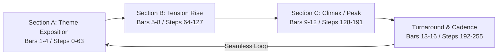

# Game Audio Principles: Anti-Fatigue & Narrative Loop Design

This document details game audio design theory for visual novels, courtroom litigation, and retro chiptune synthesizers.

---

## 1. Why Game Music Causes Player Fatigue

Unlike linear soundtracks (films, pop songs), video game background music (BGM) plays continuously while the player is solving puzzles, reading dialogue, or thinking.

### Primary Causes of Ear Fatigue:
1. **Short Loop Duration**: Repeating a 2-bar or 4-bar phrase every 4–8 seconds triggers subconscious annoyance and mental strain.
2. **Frequency Congestion**: When the synthesizer lead occupies the exact same frequencies as speech or typewriter sound effects (800 Hz – 3.5 kHz) with no resting pauses.
3. **Harmonic Monotony**: Staying on a single drone chord or repeating a simple $i - iv$ cadence indefinitely without modulation.
4. **Lack of Dynamic Rest**: Continuous wall-of-sound with no quiet gaps or breathing room.

---

## 2. The Multi-Section Loop Framework

To keep a track captivating over 10 to 30 minutes of continuous listening, structure tracks into at least **8 to 16 bars (128 to 256 steps)** divided into 4 narrative phrases:

### Phrase Functions:
- **Section A (Exposition)**: Establish key, tempo, and baseline rhythmic pulse. Melodic lead is clean and memorable.
- **Section B (Development / Tension)**: Shift harmony (move to subdominant, relative major, or secondary dominant). Lead melody rhythm becomes more syncopated.
- **Section C (Climax)**: Highest pitch register, faster arpeggios, full driving drum pattern.
- **Turnaround (Resolution & Loop Transition)**: Drum fill (snare rolls, syncopated kicks), dominant chord cadence ($V$ or $VII \to i$) leading naturally back to bar 1.

---

## 3. Courtroom & Visual Novel Audio Archetypes

| Archetype | Tempo (BPM) | Harmonization & Scale | Rhythm & Mood |
|---|---|---|---|
| **Investigation** | 108–116 | Minor, Dorian, Blues | Laid-back swing, walking bassline, inquisitive chords (m7, 9ths), subtle hi-hats. |
| **Cross-Examination (Moderato)** | 118–126 | Natural Minor (Aeolian) | Methodical 4/4 pulse, steady bass drive, analytical focus, disciplined drums. |
| **Cross-Examination (Allegro)** | 142–150 | Harmonic Minor / Dorian | Fast driving tempo, urgent syncopated bass, high-register counterpoints. |
| **Objection / Turnaround** | 146–154 | Dorian / Major Mixolydian | Triumphant, heroic brass synth riffs, driving double-kicks, rising pitch sequences. |
| **Pursuit / Cornered** | 156–168 | Spanish Phrygian / Minor | Relentless 16th-note bass, rapid arpeggiated synth leads, urgent snare fills. |
| **Suspense / Revelation** | 88–98 | Diminished / Tritone Drones | Minimalist, slow pulsing kick like a heartbeat, eerie dissonant chords. |
| **Victory / Innocence** | 132–140 | Major Key / Pentatonic | Celebratory, bright major triads, bouncy syncopated bass, joyful resolution. |

---

## 4. Mixing & Frequency Balancing in Procedural Chiptune

| Channel | Waveform | Ideal MIDI Range | Filter Cutoff | Gain Envelope Rule |
|---|---|---|---|---|
| **Bass** | Triangle | MIDI 36–52 (C2–E3) | 600–900 Hz Lowpass | Punchy attack (0.01s), medium decay (0.2s–0.3s) to avoid sub-bass mud. |
| **Harmony / Chords** | Sawtooth / Pulse | MIDI 48–65 (C3–F4) | 1.8–2.4 kHz Lowpass | Lower gain (0.10–0.15) to sit under the lead melody without masking it. |
| **Lead Melody** | Square | MIDI 64–86 (E4–D6) | 3.2–4.5 kHz Lowpass | Clear attack, subtle vibrato on held notes, frequent rests between phrases. |
| **Kick Drum** | Sine sweep | 140 Hz $\to$ 35 Hz | N/A | Fast 120ms linear decay to punch through bassline. |
| **Snare Drum** | White Noise | N/A | 1.1 kHz Highpass | Crisp 100–120ms burst on beats 2 and 4. |
| **Hi-Hat** | White Noise | N/A | 6.0 kHz Highpass | Ultra-short 35–45ms tick for tempo subdivisions. |
