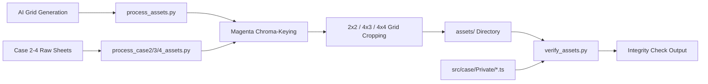

# Asset Pipeline Architecture

Technical guide for [[process_assets.py]], [[process_case2_assets.py]], [[process_case3_assets.py]], [[process_case4_assets.py]], and [[verify_assets.py]], configured in [[pipeline.group.md]].

## Overview

The asset pipeline automates the extraction, transparency keying, cropping, and verification of game sprites, cut-ins, backgrounds, and evidence icons.

## Chroma-Keying & Slicing ([[process_assets.py]])

### 1. Chroma-Keying, Cavity Extraction & Despill ([[process_assets.py#Boundary Chroma-Key & Despill]])
AI image models often produce subpixel antialiasing blend between dark character outlines and magenta backgrounds, as well as enclosed loops and white/gray grid divider lines.

The pipeline performs:
1. **Unified Background Masking**: Captures all pure/edge magenta ($dist < 160$ or $R > 140 \land B > 140 \land G < 125$) across both outer borders and interior cavities (wings, arms, head), combined with neutral border grid lines ($10\text{px}$ margin only, $|R - B| < 40$).
2. **Skin Tone Protection**: Enforces $G < 125$ on magenta detection so warm, fair skin tones ($G \ge 140, R > B$) are never erased.
3. **Subpixel Dilation**: 1-pixel dilation of background mask to eliminate outer fringe.
4. **Mathematical Despill**: In the fringe zone (within 4px of background), computes $\text{excess} = \max(0, \min(R - G, B - G))$ and subtracts it from $R$ and $B$, restoring neutral black outlines ($RGB: 0..30, 0..30, 0..30$).
5. **Margin Clearing**: Zeros 5px outer edge borders to eradicate cell divider line artifacts.

### 2. Grid Slicing & Extended Bounds ([[process_assets.py#Connected Component Filtering]])
- Character sheets are formatted as 2x2 grids (4 distinct emotional poses per character).
- **Extended Gesture Bounds**: Poses with outstretched gestures (e.g. `chapulin_point`) support custom crop windows ($x: 0..576$) to capture complete pointing fingers and hands with zero clipping.
- **Dedicated Super Sam slam**: `supersam_slam` is extracted from the top-left cell of [[tools/raw/supersam_slam_sheet_raw.png]], then translated so the waist notch lands on the same contact row as `chapulin_slam` (`448/512`). Re-running the 2x2 Super Sam sheet must not keep the slam cell — that pose has to match idle identity *and* the shared `bench-slam` silhouette.
- **Accurate Drop Boxes**: Speech bubbles and cross-cell neighbor bleed are dropped using calibrated bounding boxes that preserve character hair, hands, and hats.
- Cut-ins are formatted as 2x2 grids (4 distinct shout placards).
- Evidence items are extracted from a 4x2 icon grid (Case 1) or a 4×3 grid (Case 2).

### Case 2 ([[process_case2_assets.py]])
Case 2 art lives in [[tools/raw/]] and is processed separately so [[process_assets.py]] stays frozen:
- **2x2 pose sheets** (row-major): Chómpiras, Peterete, Jirafales, Jaimito, Clotilde. Peterete breakdown is the top-left cell of `peterete_breakdown_raw.png`. Super Sam sweat is the top-right cell of `supersam_sweat_raw.png` (does not overwrite idle/point/slam/breakdown). That sheet must be generated with idle as the identity lock; otherwise the model paints Chespirito yellow/green instead of navy + flag cape. Don Ramón shock is the top-left cell of `donramon_shock_raw.png` (does not overwrite slam). Generate it with idle as the identity lock so the model keeps the navy lawyer suit and denim hat instead of TV casual clothes. After chroma-key, `anchor_standing_bust` pastes the opaque hem 5px from the 512 canvas floor — same floor as idle — because `plain` staging lines the **canvas** bottom to the dialogue box, not the drawn waist.
- **Evidence**: `case2_evidence_icons_raw.png` (4 columns × 3 rows) → `chanfle_oro.webp` … `lata_grasa.webp`.
- **Backgrounds** exported as WebP: `bg_boveda.webp`, `bg_restaurante.webp`, `bg_postal.webp`, `bg_clotilde.webp`, `bg_waiting_room.webp`.

### Case 3 ([[process_case3_assets.py]])
Same chroma pipeline as Case 2. Sheets in [[tools/raw/]]: Chapatín, Pazguato, Aniceto, Barriga, Ñoño, Chimoltrufia, plus extra cells for `chapatin_conmovido` and `aniceto_breakdown`. `anchor_standing_bust` scales a crop that exceeds 512 before flooring it; pasting a 1024 1x1 pose onto 512 without that scale zoom-crops the bust (head fills the stage, limbs shear). Barriga's main 2×2 is idle / vendado. Shock and enojado are cells (1,0) and (0,1) of `barriga_injured_poses_raw.png`, locked to the vendado wheelchair crop — not the idle fedora sheet. Chimoltrufia’s idle lock is the caricature (messy hair, gap teeth, no rollers) — not Doña Florinda. After slicing, **every** `plain`-frame bust (all six characters, not a subset) runs through `anchor_standing_bust` so the opaque hem sits 5px above the 512 canvas floor. Flooring only Chapatín and Pazguato left Ñoño with ~50px of transparency under the shirt; `plain` lines the **canvas** to the dialogue box, so that padding reads as a clipped floating waist. Generation prompts must put the waist cut on the **cell floor** (magenta on top/sides only). Do not float the bust in a central 60% safe area. That rule is for full-body action sheets, not Ace Attorney busts. Evidence: `case3_evidence_icons_raw.png` is a **4×3** card grid (not 4×4 — that row count cuts through the painted icons and leaves white dividers in the court-record PNGs). Cells (0,0) and (1,0) are unused (shared badge + a draft informe). `case3_evidence_icons_b_raw.png` is 3×2. `informe_barriga.webp` is then overwritten from `informe_barriga_icon_raw.png` (1×1, no card drop boxes) because the B-sheet cell nests a second magenta frame. `informe_medico.webp` is Case 1 art (Alma Negra's coin sack) and must not be reused. `insignia_abogado.webp` stays the shared Case 1 file. Aniceto's base pose is `aniceto_idle` (identity lock); his silk handkerchief never sits at his neck in any pose, because it is the gag in `ataduras_bodega`. Backgrounds: `bg_cabina.webp`, `bg_kermes.webp`, `bg_despacho.webp`, `bg_clinica.webp`, `bg_bodega.webp`, `bg_delegacion.webp`. Detention reuses `bg_detention.webp`.

### Case 4 ([[process_case4_assets.py]])
Same chroma pipeline. Sheets in [[tools/raw/]]: Botija, Cecilio, Maruja, Rufino 2×2s plus `maruja_shock_raw.png` and `rufino_breakdown_raw.png` (1×1 full poses). Identity locks: Botija idle (tiny sky-blue flat cap, full black beard, all-black plumber clothes, wrench); Cecilio idle (bottle-bottom glasses, pearl-grey three-piece); Maruja idle (copper-red teased hair, emerald satin, cream stole — never pink); Rufino smug (black tailcoat, ivory vest, white bow tie, gold monocle, waxed mustache — not Aniceto's grey cravat). After slicing, **every** Case 4 `plain` bust runs through `anchor_standing_bust`. Evidence: `case4_evidence_icons_raw.png` is a **4×4** grid; cell (3,3) is unused. `foto_crimen.webp` is a shared `EvidenceId` with Case 1 — this run writes the Suite 304 polaroid. `insignia_abogado.webp` stays the Case 1 file. Backgrounds cover-crop to 1536×1024: `bg_hotel_lobby`, `bg_hotel_suite`, `bg_hotel_bar`, `bg_hotel_sotano`, `bg_hotel_suite204`, `bg_hotel_cava`, `bg_hotel_azotea`. Deep-examine plates export at 960×540: `examine_foto`, `examine_cadena`, `examine_plano`, `examine_botella`, `examine_nota`. Detention / courtroom / `bg_delegacion` / `bg_waiting_room` are reused. See [[tools/case4_hotspot_notes.md]] for painted-object percent guesses after cover crop.

### 3. Asset Naming Conventions & Format

All runtime production assets in `assets/` use **WebP (`quality=85`)** to minimize payload footprint (~90% size reduction vs uncompressed PNG/JPEG), while raw AI generator sheets in `tools/raw/*.png` and intermediate processing remain strictly **lossless PNG / uncompressed float32 NumPy arrays**.

| Category | File Prefix / Suffix | Examples |
|----------|----------------------|----------|
| **Character Poses** | `[character]_[emotion].webp` | `chapulin_idle.webp`, `supersam_point.webp`, `tripaseca_sweat.webp`, `judge_gavel.webp`, `florinda_angry.webp` |
| **Cut-ins** | `objection_[type].webp` | `objection_protesto.webp`, `objection_un_momento.webp`, `objection_toma_eso.webp`, `objection_culpable.webp`, `objection_inocente.webp` |
| **Evidence Icons** | `[item_id].webp` | `chipote_chillon.webp`, `chanfle_oro.webp`, `reloj_pendulo.webp` |
| **Backgrounds** | `bg_[location].webp` | `bg_museum.webp`, `bg_detention.webp`, `bg_boveda.webp`, `bg_restaurante.webp`, `bg_postal.webp`, `bg_clotilde.webp`, `bg_waiting_room.webp` |

## Integrity Verification ([[verify_assets.py]])

A fast static analysis tool that scans [[src/case/index.ts]] and private case scripts:
- Extracts all referenced character poses (`pose: '...'`), cut-ins (`cutin: '...'`), and background images (`assets/...`).
- Validates physical file existence in `assets/`.
- Runs static quality checks asserting:
  - 0 unkeyed solid magenta holes in foreground
  - 0 purple perimeter fringe pixels
  - 0 outer border margin noise
