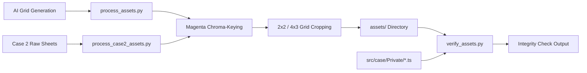

# Asset Pipeline Architecture

Technical guide for [[process_assets.py]], [[process_case2_assets.py]], and [[verify_assets.py]], configured in [[pipeline.group.md]].

## Overview

The asset pipeline automates the extraction, transparency keying, cropping, and verification of game sprites, cut-ins, backgrounds, and evidence icons.

## Chroma-Keying & Slicing ([[process_assets.py]])

### 1. Chroma-Keying, Cavity Extraction & Despill ([[process_assets.py#Boundary Chroma-Key & Despill]])
AI image models often produce subpixel antialiasing blend between dark character outlines and magenta backgrounds, as well as enclosed loops and white/gray grid divider lines.

The pipeline performs:
1. **Unified Background Masking**: Captures all pure/edge magenta ($dist < 160$ or $R > 140 \land B > 140 \land G < 125$) across both outer borders and interior cavities (wings, arms, head), combined with neutral border grid lines ($10\text{px}$ margin only, $|R - B| < 40$).
2. **Skin Tone Protection**: Enforces $G < 125$ on magenta detection so warm, fair skin tones ($G \ge 140, R > B$) are never erased.
3. **Subpixel Dilation**: 1-pixel dilation of background mask to eliminate outer fringe.
4. **Mathematical Despill**: In the fringe zone (within 4px of background), computes $\text{excess} = \max(0, \min(R - G, B - G))$ and subtracts it from $R$ and $B$, restoring neutral black outlines ($RGB: 0..30, 0..30, 0..30$).
5. **Margin Clearing**: Zeros 5px outer edge borders to eradicate cell divider line artifacts.

### 2. Grid Slicing & Extended Bounds ([[process_assets.py#Connected Component Filtering]])
- Character sheets are formatted as 2x2 grids (4 distinct emotional poses per character).
- **Extended Gesture Bounds**: Poses with outstretched gestures (e.g. `chapulin_point`) support custom crop windows ($x: 0..576$) to capture complete pointing fingers and hands with zero clipping.
- **Dedicated Super Sam slam**: `supersam_slam` is extracted from the top-left cell of [[tools/raw/supersam_slam_sheet_raw.png]], then translated so the waist notch lands on the same contact row as `chapulin_slam` (`448/512`). Re-running the 2x2 Super Sam sheet must not keep the slam cell — that pose has to match idle identity *and* the shared `bench-slam` silhouette.
- **Accurate Drop Boxes**: Speech bubbles and cross-cell neighbor bleed are dropped using calibrated bounding boxes that preserve character hair, hands, and hats.
- Cut-ins are formatted as 2x2 grids (4 distinct shout placards).
- Evidence items are extracted from a 4x2 icon grid (Case 1) or a 4×3 grid (Case 2).

### Case 2 ([[process_case2_assets.py]])
Case 2 art lives in [[tools/raw/]] and is processed separately so [[process_assets.py]] stays frozen:
- **2x2 pose sheets** (row-major): Chómpiras, Peterete, Jirafales, Jaimito, Clotilde. Peterete breakdown is the top-left cell of `peterete_breakdown_raw.png`. Super Sam sweat is the top-right cell of `supersam_sweat_raw.png` (does not overwrite idle/point/slam/breakdown). That sheet must be generated with idle as the identity lock; otherwise the model paints Chespirito yellow/green instead of navy + flag cape.
- **Evidence**: `case2_evidence_icons_raw.png` (4 columns × 3 rows) → `chanfle_oro.png` … `lata_grasa.png`.
- **Backgrounds** copied as JPEG: `bg_boveda.jpg`, `bg_restaurante.jpg`, `bg_postal.jpg`, `bg_clotilde.jpg`.

### 3. Asset Naming Conventions

| Category | File Prefix / Suffix | Examples |
|----------|----------------------|----------|
| **Character Poses** | `[character]_[emotion].png` | `chapulin_idle.png`, `supersam_point.png`, `tripaseca_sweat.png`, `judge_gavel.png`, `florinda_angry.png` |
| **Cut-ins** | `objection_[type].png` | `objection_protesto.png`, `objection_un_momento.png`, `objection_toma_eso.png`, `objection_culpable.png` |
| **Evidence Icons** | `[item_id].png` | `chipote_chillon.png`, `chanfle_oro.png`, `reloj_pendulo.png` |
| **Backgrounds** | `bg_[location].jpg` | `bg_museum.jpg`, `bg_detention.jpg`, `bg_boveda.jpg`, `bg_restaurante.jpg`, `bg_postal.jpg`, `bg_clotilde.jpg` |

## Integrity Verification ([[verify_assets.py]])

A fast static analysis tool that scans [[src/case/index.ts]] and private case scripts:
- Extracts all referenced character poses (`pose: '...'`), cut-ins (`cutin: '...'`), and background images (`assets/...`).
- Validates physical file existence in `assets/`.
- Runs static quality checks asserting:
  - 0 unkeyed solid magenta holes in foreground
  - 0 purple perimeter fringe pixels
  - 0 outer border margin noise
