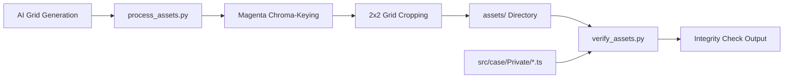

# Asset Pipeline Architecture

Technical guide for [[process_assets.py]] and [[verify_assets.py]], configured in [[pipeline.group.md]].

## Overview

The asset pipeline automates the extraction, transparency keying, cropping, and verification of game sprites, cut-ins, backgrounds, and evidence icons.

## Chroma-Keying & Slicing ([[process_assets.py]])

### 1. Boundary Chroma-Keying & Mathematical Despill ([[process_assets.py#Boundary Chroma-Key & Despill]])
AI image models often produce subpixel antialiasing blend between dark character outlines and magenta backgrounds, as well as white/gray grid divider lines.

The pipeline performs:
1. **Boundary-Connected Masking**: Flood-fills from outer borders with magenta + grid line detection, preserving internal character colors (such as apron flowers).
2. **Subpixel Dilation**: 1-pixel dilation of background mask to eliminate outer fringe.
3. **Mathematical Despill**: In the fringe zone (within 4px of background), computes $\text{excess} = \max(0, \min(R - G, B - G))$ and subtracts it from $R$ and $B$, restoring neutral black outlines ($RGB: 0..30, 0..30, 0..30$).
4. **Margin Clearing**: Zeros 4px outer edge borders to remove grid divider line artifacts.

### 2. Grid Slicing ([[process_assets.py#Connected Component Filtering]])
- Character sheets are formatted as 2x2 grids (4 distinct emotional poses per character).
- Cut-ins are formatted as 2x2 grids (4 distinct shout placards).
- Evidence items are extracted from a 4x2 icon grid.

### 3. Asset Naming Conventions

| Category | File Prefix / Suffix | Examples |
|----------|----------------------|----------|
| **Character Poses** | `[character]_[emotion].png` | `chapulin_idle.png`, `supersam_point.png`, `tripaseca_sweat.png`, `judge_gavel.png`, `florinda_angry.png` |
| **Cut-ins** | `objection_[type].png` | `objection_protesto.png`, `objection_un_momento.png`, `objection_toma_eso.png`, `objection_culpable.png` |
| **Evidence Icons** | `[item_id].png` | `chipote_chillon.png`, `pastillas_chiquitolina.png`, `antenitas_vinil.png` |
| **Backgrounds** | `bg_[location].jpg` | `bg_museum.jpg`, `bg_detention.jpg`, `bg_courtroom.jpg`, `bg_judge.jpg`, `bg_witness.jpg` |

## Integrity Verification ([[verify_assets.py]])

A fast static analysis tool that scans [[src/case/index.ts]] and private case scripts:
- Extracts all referenced character poses (`pose: '...'`).
- Extracts all referenced cut-ins (`cutin: '...'`).
- Extracts all referenced background images (`assets/...`).
- Validates each reference against physical files in `assets/` to ensure zero missing assets or broken image links at runtime.
