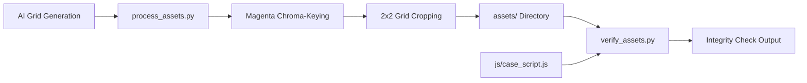

# Asset Pipeline Architecture

Technical guide for [`process_assets.py`](file:///c:/Proyectos/ace-attorney-gemini/process_assets.py) and [`verify_assets.py`](file:///c:/Proyectos/ace-attorney-gemini/verify_assets.py).

## Overview

The asset pipeline automates the extraction, transparency keying, cropping, and verification of game sprites, cut-ins, backgrounds, and evidence icons.



## Chroma-Keying & Slicing (`process_assets.py`)

### 1. Magenta Alpha Mask Algorithm
AI image models often struggle with direct PNG alpha channel generation. The pipeline generates character grids on a solid magenta / hot-pink background (`#FF00FF`) and keys out the background via NumPy:

```python
def chroma_key_pink(img):
    img = img.convert("RGBA")
    data = np.array(img)
    r, g, b, a = data[:, :, 0], data[:, :, 1], data[:, :, 2], data[:, :, 3]
    
    # Magenta/Pink mask: high R & B, low G, balanced R-B
    is_pink = (r > 160) & (g < 110) & (b > 160) & (np.abs(r.astype(int) - b.astype(int)) < 75)
    data[:, :, 3] = np.where(is_pink, 0, 255)
    return Image.fromarray(data, mode="RGBA")
```

### 2. Grid Slicing
- Character sheets are formatted as 2x2 grids (4 distinct emotional poses per character).
- Cut-ins are formatted as 2x2 grids (4 distinct shout placards).
- Evidence items are extracted from a 4x2 icon grid.

### 3. Asset Naming Conventions

| Category | File Prefix / Suffix | Examples |
|----------|----------------------|----------|
| **Character Poses** | `[character]_[emotion].png` | `chapulin_idle.png`, `supersam_point.png`, `tripaseca_sweat.png`, `judge_gavel.png`, `florinda_angry.png` |
| **Cut-ins** | `objection_[type].png` | `objection_protesto.png`, `objection_un_momento.png`, `objection_toma_eso.png`, `objection_culpable.png` |
| **Evidence Icons** | `[item_id].png` | `chipote_chillon.png`, `pastillas_chiquitolina.png`, `antenitas_vinil.png` |
| **Backgrounds** | `bg_[location].jpg` | `bg_museum.jpg`, `bg_detention.jpg`, `bg_courtroom.jpg`, `bg_judge.jpg`, `bg_witness.jpg` |

## Integrity Verification (`verify_assets.py`)

A fast static analysis tool that scans `js/case_script.js` via regular expressions:
- Extracts all referenced character poses (`pose: '...'`).
- Extracts all referenced cut-ins (`cutin: '...'`).
- Extracts all referenced background images (`assets/...`).
- Validates each reference against the physical files present in `assets/` to ensure zero missing assets or broken image links at runtime.
