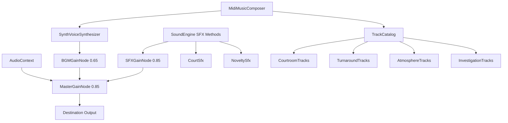

# Audio & Music Synthesis Architecture

Technical guide for [[src/audio/index.ts]], configured in [[src/audio/audio.group.md]].

## Overview

The audio system is a **100% procedural, zero-asset sound and music engine** built directly on the Web Audio API. It eliminates all external audio file downloads (`.mp3` or `.wav`) while providing polyphonic 16-bit retro visual novel and courtroom chiptune audio.

## Subsystems

### 1. Sound Synthesis Engine ([[src/audio/Private/SoundEngine.ts]])

Manages the `AudioContext` lifecycle and procedural SFX generators:

| SFX Method | Sound Description | Waveforms & Filters | Synthesizer Module |
|------------|-------------------|---------------------|--------------------|
| `playTextBlip()` | Typewriter character chirp | Square wave with downward frequency sweep (540Hz -> 360Hz) and random pitch variance. | [[src/audio/Private/NoveltySfx.ts#Typewriter Blip Synthesis]] |
| `playClick()` | Quiet hotspot examination tap | Sine wave with short subtle downward frequency drop (600Hz -> 120Hz, 25ms, gain 0.12). | [[src/audio/Private/NoveltySfx.ts#Subtle Click Synthesis]] |
| `playGavel()` | Heavy wooden judicial strike | Low triangle impact (160Hz -> 30Hz) + wood crack bandpass noise (950Hz, Q=3). | [[src/audio/Private/CourtSfx.ts#Gavel Synthesis]] |
| `playDeskSlam()` | Defense / prosecutor desk punch | Sawtooth oscillator (120Hz -> 25Hz) + 500Hz lowpass filter. | [[src/audio/Private/CourtSfx.ts#Desk Slam Synthesis]] |
| `playObjectionWhoosh()` | Dramatic shout whip whoosh | Swept bandpass white noise (350Hz -> 4500Hz) followed by a 4-note chord hit. | [[src/audio/Private/CourtSfx.ts#Objection Whoosh Synthesis]] |
| `playRealization()` | Lightbulb / contradiction chime | 4-tone sine wave arpeggio (880Hz, 1174.66Hz, 1760Hz, 2349.32Hz). | [[src/audio/Private/NoveltySfx.ts#Realization Chime Synthesis]] |
| `playDamage()` | Courtroom penalty shock | Heavy downward sawtooth slide (300Hz -> 60Hz). | [[src/audio/Private/CourtSfx.ts#Damage Synthesis]] |
| `playChipoteSqueak()` | Comedic squeaky hammer sound | Sine wave frequency modulator (680Hz -> 1550Hz -> 480Hz). | [[src/audio/Private/NoveltySfx.ts#Chipote & Chicharra Synthesis]] |
| `playChicharra()` | Paralyzing bicycle buzzer | Dual-pitch sawtooth buzz (466.16Hz -> 349.23Hz). | [[src/audio/Private/NoveltySfx.ts#Chipote & Chicharra Synthesis]] |

### 2. Procedural Polyphonic MIDI Tracker ([[src/audio/Private/MidiMusicComposer.ts]])

Real-time step sequencer delegating voice rendering to [[src/audio/Private/SynthVoiceSynthesizer.ts]] and playing 16th-note musical patterns defined in [[src/audio/Private/TrackCatalog.ts]]:

- **Channels & Voice Synthesis**:
  - **Bass**: Low triangle wave with punchy lowpass filtering (900 Hz, gain 0.35).
  - **Lead**: Bright square wave melody channel with 5.5 Hz vibrato LFO and breathing rests (3600 Hz lowpass, gain 0.22).
  - **Chords / Harmony**: Polyphonic sawtooth pad supporting 3-note triads and 4-note 7th chords with normalized gain scaling (2200 Hz lowpass, gain 0.16).
  - **Drums**: Dynamic percussion engine supporting Kick (`K`), Snare (`S`), Closed Hat (`H`), Open Hat (`O`), Crash Cymbal (`C`), Slap (`P`), and compound hits (e.g. `'KC'`, `'KH'`).
- **Pitch Math** ([[src/audio/Private/SynthVoiceSynthesizer.ts#Pitch Calculation]]): Standard MIDI note to Hz formula:
  $$f = 440 \times 2^{\frac{m - 69}{12}}$$
- **Anti-Fatigue Multi-Section Loop Design**:
  All 8 soundtrack themes feature 64 to 128 steps (8 to 16 bars, ~25–45s loop duration) structured into 4 narrative phrases (Exposition, Tension/Development, Climax, and Cadence Turnaround) with polyphonic harmonic backing and breathing rests to prevent ear fatigue during extended gameplay sessions.

### Track Catalog ([[src/audio/Private/TrackCatalog.ts]])

Modularized into private track collections under `src/audio/Private/tracks/`:
1. `trial` (115 BPM, 128 steps) - Stately C Minor courtroom opening with polyphonic chord pads and crash accents ([[src/audio/Private/tracks/CourtroomTracks.ts]])
2. `cross_exam_moderato` (118 BPM, 128 steps) - Analytical E Minor testimony cross-examination with 7th chords and call-and-response lead motifs ([[src/audio/Private/tracks/CourtroomTracks.ts]])
3. `cross_exam_allegro` (142 BPM, 128 steps) - High-tension G Minor cross-examination with fast 16th driving bass and syncopated stabs ([[src/audio/Private/tracks/CourtroomTracks.ts]])
4. `objection` (152 BPM, 128 steps) - Heroic A Minor / C Major turnaround theme ("¡No contaban con mi astucia!") ([[src/audio/Private/tracks/TurnaroundTracks.ts]])
5. `pursuit` (158 BPM, 128 steps) - Cornered culprit pursuit in D Spanish Phrygian ("¡Que no panda el cúnico!") ([[src/audio/Private/tracks/TurnaroundTracks.ts]])
6. `investigation` (112 BPM, 128 steps) - Noir detective swing in E Dorian with walking jazz bass and 7th chords ([[src/audio/Private/tracks/AtmosphereTracks.ts]])
7. `investigation_core` (120 BPM, 128 steps) - Tense D Minor underground vault / crime scene investigation with driving 16th pedal bass and knee-slaps ([[src/audio/Private/tracks/InvestigationTracks.ts]])
8. `restaurante` (116 BPM, 128 steps) - Gentle F Major café bossa/jazz for Doña Florinda's restaurant and Jirafales banter ([[src/audio/Private/tracks/InvestigationTracks.ts]])
9. `callejon_postal` (104 BPM, 128 steps) - Lazy G Major swinging walk for Don Jaimito's Tangamandapio postal cart ([[src/audio/Private/tracks/InvestigationTracks.ts]])
10. `casa_clotilde` (98 BPM, 128 steps) - Eccentric G Minor gothic-romantic botanical lab theme for Doña Clotilde ([[src/audio/Private/tracks/InvestigationTracks.ts]])
11. `detention_center` (70 BPM, 128 steps) - Somber Bb Minor jailer's elegy for visitor room interviews ([[src/audio/Private/tracks/AtmosphereTracks.ts]])
12. `suspense` (116 BPM, 128 steps) - D Minor final-showdown habanera for the climax verdict dilemma: staccato tango heartbeat groove, Dm-Bb-A7 harmonic minor pressure, and chromatic turnaround ([[src/audio/Private/tracks/AtmosphereTracks.ts]])
13. `victory` (136 BPM, 128 steps) - Celebratory G Major case resolution march ("¡Síganme los buenos!") ([[src/audio/Private/tracks/AtmosphereTracks.ts]])

## Invariants & Design Rules

- **Autoplay Handling**: Audio is muted by default until the player interacts with the start splash overlay or document, avoiding browser console autoplay warnings.
- **Node Cleanup**: Oscillators and buffer sources call `.stop()` and are garbage-collected automatically once their envelopes finish.
- **Seamless Switching**: Calling `playTrack()` clears existing playback timers before starting a new track.
