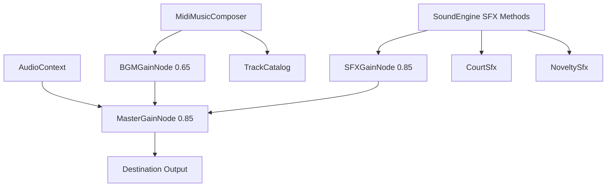

# Audio & Music Synthesis Architecture

Technical guide for [[src/audio/index.ts]], configured in [[src/audio/audio.group.md]].

## Overview

The audio system is a **100% procedural, zero-asset sound and music engine** built directly on the Web Audio API. It eliminates all external audio file downloads (`.mp3` or `.wav`) while providing classic 16-bit Capcom GBA/DS aesthetic chiptune audio.

## Subsystems

### 1. Sound Synthesis Engine ([[src/audio/Private/SoundEngine.ts]])

Manages the `AudioContext` lifecycle and procedural SFX generators:

| SFX Method | Sound Description | Waveforms & Filters | Synthesizer Module |
|------------|-------------------|---------------------|--------------------|
| `playTextBlip()` | Typewriter character chirp | Square wave with downward frequency sweep (540Hz -> 360Hz) and random pitch variance. | [[src/audio/Private/NoveltySfx.ts#Typewriter Blip Synthesis]] |
| `playGavel()` | Heavy wooden judicial strike | Low triangle impact (160Hz -> 30Hz) + wood crack bandpass noise (950Hz, Q=3). | [[src/audio/Private/CourtSfx.ts#Gavel Synthesis]] |
| `playDeskSlam()` | Defense / prosecutor desk punch | Sawtooth oscillator (120Hz -> 25Hz) + 500Hz lowpass filter. | [[src/audio/Private/CourtSfx.ts#Desk Slam Synthesis]] |
| `playObjectionWhoosh()` | Dramatic shout whip whoosh | Swept bandpass white noise (350Hz -> 4500Hz) followed by a 4-note chord hit. | [[src/audio/Private/CourtSfx.ts#Objection Whoosh Synthesis]] |
| `playRealization()` | Lightbulb / contradiction chime | 4-tone sine wave arpeggio (880Hz, 1174.66Hz, 1760Hz, 2349.32Hz). | [[src/audio/Private/NoveltySfx.ts#Realization Chime Synthesis]] |
| `playDamage()` | Courtroom penalty shock | Heavy downward sawtooth slide (300Hz -> 60Hz). | [[src/audio/Private/CourtSfx.ts#Damage Synthesis]] |
| `playChipoteSqueak()` | Comedic squeaky hammer sound | Sine wave frequency modulator (680Hz -> 1550Hz -> 480Hz). | [[src/audio/Private/NoveltySfx.ts#Chipote & Chicharra Synthesis]] |
| `playChicharra()` | Paralyzing bicycle buzzer | Dual-pitch sawtooth buzz (466.16Hz -> 349.23Hz). | [[src/audio/Private/NoveltySfx.ts#Chipote & Chicharra Synthesis]] |

### 2. Procedural MIDI Music Tracker ([[src/audio/Private/MidiMusicComposer.ts]])

Real-time 4-channel step sequencer playing 16th-note musical patterns defined in [[src/audio/Private/TrackCatalog.ts]]:

- **Channels**:
  - **Bass**: Low triangle wave with punchy lowpass filtering.
  - **Lead**: Bright square wave melody channel.
  - **Chords / Harmony**: Sawtooth pad channel.
  - **Drums**: Synthesized Kick (sine sweep), Snare (1.1kHz highpass noise), and Hi-Hat (6kHz highpass noise).
- **Pitch Math** ([[src/audio/Private/MidiMusicComposer.ts#Pitch Frequency Conversion]]): Standard MIDI note to Hz formula:
  $$f = 440 \times 2^{\frac{m - 69}{12}}$$
- **Envelope**: Linear ADSR gain automation per note step.

### Track Catalog ([[src/audio/Private/TrackCatalog.ts]])

1. `trial` (124 BPM) - Courtroom opening atmosphere
2. `cross_exam_moderato` (118 BPM) - Initial testimony cross-examination
3. `cross_exam_allegro` (144 BPM) - High-tension testimony cross-examination
4. `objection` (148 BPM) - "¡No contaban con mi astucia!" turnaround theme
5. `pursuit` (156 BPM) - Cornered culprit pursuit theme ("¡Que no panda el cúnico!")
6. `investigation` (112 BPM) - Museum crime scene investigation
7. `suspense` (96 BPM) - Detention center & critical revelations
8. `victory` (136 BPM) - Case resolution celebration ("¡Síganme los buenos!")

## Invariants & Design Rules

- **Autoplay Handling**: Audio is muted by default until the player interacts with the start splash overlay or document, avoiding browser console autoplay warnings.
- **Node Cleanup**: Oscillators and buffer sources call `.stop()` and are garbage-collected automatically once their envelopes finish.
- **Seamless Switching**: Calling `playTrack()` clears existing playback timers before starting a new track.
