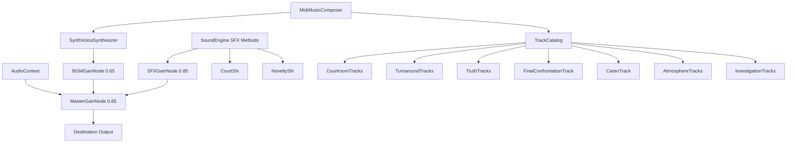

# Audio & Music Synthesis Architecture

Technical guide for [[src/audio/index.ts]], configured in [[src/audio/audio.group.md]].

## Overview

The audio system is a **100% procedural, zero-asset sound and music engine** built directly on the Web Audio API. It eliminates all external audio file downloads (`.mp3` or `.wav`) while providing polyphonic 16-bit retro visual novel and courtroom chiptune audio.

## Subsystems

### 1. Sound Synthesis Engine ([[src/audio/Private/SoundEngine.ts]])

Manages the `AudioContext` lifecycle and procedural SFX generators:

| SFX Method | Sound Description | Waveforms & Filters | Synthesizer Module |
|------------|-------------------|---------------------|--------------------|
| `playTextBlip()` | Typewriter character chirp | Square wave with downward frequency sweep (540Hz -> 360Hz) and random pitch variance. | [[src/audio/Private/NoveltySfx.ts#Typewriter Blip Synthesis]] |
| `playClick()` | Quiet hotspot examination tap | Sine wave with short subtle downward frequency drop (600Hz -> 120Hz, 25ms, gain 0.12). | [[src/audio/Private/NoveltySfx.ts#Subtle Click Synthesis]] |
| `playGavel()` | Heavy wooden judicial strike | Low triangle impact (160Hz -> 30Hz) + wood crack bandpass noise (950Hz, Q=3). | [[src/audio/Private/CourtSfx.ts#Gavel Synthesis]] |
| `playDeskSlam()` | Defense / prosecutor desk punch | Sawtooth oscillator (120Hz -> 25Hz) + 500Hz lowpass filter. | [[src/audio/Private/CourtSfx.ts#Desk Slam Synthesis]] |
| `playObjectionWhoosh()` | Dramatic shout whip whoosh | Swept bandpass white noise (350Hz -> 4500Hz) followed by a 4-note chord hit. | [[src/audio/Private/CourtSfx.ts#Objection Whoosh Synthesis]] |
| `playRealization()` | Lightbulb / contradiction chime | 4-tone sine wave arpeggio (880Hz, 1174.66Hz, 1760Hz, 2349.32Hz). | [[src/audio/Private/NoveltySfx.ts#Realization Chime Synthesis]] |
| `playDamage()` | Courtroom penalty shock | Heavy downward sawtooth slide (300Hz -> 60Hz). | [[src/audio/Private/CourtSfx.ts#Damage Synthesis]] |
| `playChipoteSqueak()` | Comedic squeaky hammer sound | Sine wave frequency modulator (680Hz -> 1550Hz -> 480Hz). | [[src/audio/Private/NoveltySfx.ts#Chipote & Chicharra Synthesis]] |
| `playChicharra()` | Paralyzing bicycle buzzer | Dual-pitch sawtooth buzz (466.16Hz -> 349.23Hz). | [[src/audio/Private/NoveltySfx.ts#Chipote & Chicharra Synthesis]] |

### 2. Procedural Polyphonic MIDI Tracker ([[src/audio/Private/MidiMusicComposer.ts]])

Real-time step sequencer delegating voice rendering to [[src/audio/Private/SynthVoiceSynthesizer.ts]] and playing 16th-note musical patterns defined in [[src/audio/Private/TrackCatalog.ts]]:

- **Channels & Voice Synthesis**:
  - **Bass**: Low triangle wave with punchy lowpass filtering (900 Hz, gain 0.35).
  - **Lead**: Bright square wave melody channel with 5.5 Hz vibrato LFO and breathing rests (3600 Hz lowpass, gain 0.22).
  - **Chords / Harmony**: Polyphonic sawtooth pad supporting 3-note triads and 4-note 7th chords with normalized gain scaling (2200 Hz lowpass, gain 0.16).
  - **Drums**: Dynamic percussion engine supporting Kick (`K`), Snare (`S`), Closed Hat (`H`), Open Hat (`O`), Crash Cymbal (`C`), Slap (`P`), and compound hits (e.g. `'KC'`, `'KH'`).
- **Pitch Math** ([[src/audio/Private/SynthVoiceSynthesizer.ts#Pitch Calculation]]): Standard MIDI note to Hz formula:
  $$f = 440 \times 2^{\frac{m - 69}{12}}$$
- **Anti-Fatigue Multi-Section Loop Design**:
  All soundtrack themes feature 64 to 400 steps (~25–45s loop duration) structured into 4 narrative phrases (Exposition, Tension/Development, Climax, and Cadence Turnaround) with polyphonic harmonic backing and breathing rests to prevent ear fatigue during extended gameplay sessions.
- **Meter is a free parameter**: the sequencer advances one 16th per tick and wraps on `step % track.length`, with no concept of a bar or a time signature. A track is therefore in whatever meter its own note grouping implies (5/4 = 20-step bars, 9/8 = 18). Only the composition has to agree with itself; nothing in the engine requires a multiple of 16.

### Track Catalog ([[src/audio/Private/TrackCatalog.ts]])

Modularized into private track collections under `src/audio/Private/tracks/`:
1. `trial` (115 BPM, 128 steps) - Stately C Minor courtroom opening with polyphonic chord pads and crash accents ([[src/audio/Private/tracks/CourtroomTracks.ts]])
2. `cross_exam_moderato` (118 BPM, 128 steps) - Analytical E Minor testimony cross-examination with 7th chords and call-and-response lead motifs ([[src/audio/Private/tracks/CourtroomTracks.ts]])
3. `cross_exam_allegro` (142 BPM, 128 steps) - High-tension G Minor cross-examination with fast 16th driving bass and syncopated stabs ([[src/audio/Private/tracks/CourtroomTracks.ts]])
4. `objection` (152 BPM, 128 steps) - Heroic A Minor / C Major turnaround theme ("¡No contaban con mi astucia!") ([[src/audio/Private/tracks/TurnaroundTracks.ts]])
5. `pursuit` (158 BPM, 128 steps) - Cornered culprit pursuit in D Spanish Phrygian ("¡Que no panda el cúnico!") ([[src/audio/Private/tracks/TurnaroundTracks.ts]])
6. `investigation` (112 BPM, 128 steps) - Noir detective swing in E Dorian with walking jazz bass and 7th chords ([[src/audio/Private/tracks/AtmosphereTracks.ts]])
7. `investigation_core` (120 BPM, 128 steps) - Tense D Minor underground vault / crime scene investigation with driving 16th pedal bass and knee-slaps ([[src/audio/Private/tracks/InvestigationTracks.ts]])
8. `restaurante` (116 BPM, 128 steps) - Gentle F Major café bossa/jazz for Doña Florinda's restaurant and Jirafales banter ([[src/audio/Private/tracks/InvestigationTracks.ts]])
9. `callejon_postal` (104 BPM, 128 steps) - Lazy G Major swinging walk for Don Jaimito's Tangamandapio postal cart ([[src/audio/Private/tracks/InvestigationTracks.ts]])
10. `casa_clotilde` (98 BPM, 128 steps) - Eccentric G Minor gothic-romantic theme for Doña Clotilde's Case 2 laboratory and Rufino's Case 4 Suite 204, in both languages ([[src/audio/Private/tracks/InvestigationTracks.ts]])
11. `detention_center` (70 BPM, 128 steps) - Somber Bb Minor jailer's elegy for visitor room interviews ([[src/audio/Private/tracks/AtmosphereTracks.ts]])
    - `game_over` is a catalog alias of the same composition. It is the somber cue the engine forces on the first CULPABLE line when the health bar empties, in every case and at every penalty site.
12. `suspense` (116 BPM, 128 steps) - D Minor final-showdown habanera for the climax verdict dilemma: staccato tango heartbeat groove, Dm-Bb-A7 harmonic minor pressure, and chromatic turnaround ([[src/audio/Private/tracks/AtmosphereTracks.ts]])
13. `victory` (136 BPM, 128 steps) - Celebratory G Major case resolution march ("¡Síganme los buenos!") ([[src/audio/Private/tracks/AtmosphereTracks.ts]])
14. `truth` (96 BPM, 384 steps, 60 seconds) - "Atando Cabos", the big-reveal theme. B minor, 24 bars of 4/4 in six 4-bar sections. Rules that carry it and should not be flattened:
    - **The chords channel is a 16th-note broken-chord ostinato**, one note per step, grouped 3+3+2 per half bar; kick and bass hit the same accents. This is the piano right hand shared by the series' truth themes: clockwork thinking under the explanation. The lead stays free for the theme.
    - **No minor 2nds or 9ths between the lead and what sounds under it.** Every note has a fixed engine length (lead ~3 steps), so a passing G still rings against an F# pedal and sounds harsh rather than tense. G-rooted bars drop the pedal to D for that reason.
    - **The theme is a 3+3+2 rhythm sequenced upward a step per bar** in section B. That climb is the "closing in"; the release is withheld for `victory`.

    Shape: lament bass B-A-G-F# under an F# pedal, ostinato alone (1–4); the theme enters (5–8); climbing bass Em-F#m-G-A with the theme sequenced up (9–12); breakthrough D-E-F#sus4-F# with the lead hammering upward into a snare roll (13–16); the **apex**, where the ostinato becomes 3+3+2 block stabs over octave bass and the lead peaks at G6 before landing on B (17–20); the **hole** (ostinato and one kick), a low echo of the theme, then a Neapolitan C to F#7 turnaround with a chromatic bass climb into bar 1 (21–24) ([[src/audio/Private/tracks/TruthTracks.ts]]).

15. `cross_exam_final` (158 BPM, 384 steps, ~36 seconds) - "Confrontación Final", the theme for the **last cross-examination of a case**: the witness is still standing but the defense already knows. F minor, 24 bars of 4/4 in six 4-bar sections. It is deliberately not another variation of the `cross_exam_*` family (those are one 8-bar loop restated) — it is a through-composed arc, because the final testimony is the longest stretch of uninterrupted reading in a case. Rules that carry it and should not be flattened:
    - **The bass is unbroken 16th notes on the root**, the one gesture borrowed from the piano left hand of the Ace Attorney confrontation themes. It stops exactly once, in bar 17, and that silence is the loudest bar in the piece.
    - **Chords are offbeat stabs only** (8th-note upbeats). On the downbeat they weld to the kick and the whole track becomes one thick pulse; off the beat they read as interjections.
    - **Bars 13–20 modulate up a minor third to Ab minor** and come back without a cadence, so the loop never sounds finished. The lift is the accusation escalating; the ear has settled into F by bar 12 and is moved off it.

    Shape: the accusation stated plainly in the mid register, Fm-Fm-Db-C (1–4); a cycle of fourths, Fm-Bbm-Eb-Ab, with the lead climbing an octave (5–8); 16ths at the top of the F minor tension, Db-Eb-Fm-C7 (9–12); the modulation, hammered repeated notes over an octave-jumping bass (13–16); the **hole** — bar 17 drops bass and drums to a single crash — then the **apex** run to B6 and a scalar walk back down (17–20); recap at the original height with a chromatic bass turnaround and drum fill into bar 1 (21–24) ([[src/audio/Private/tracks/FinalConfrontationTrack.ts]]).

16. `cross_exam_careo` (164 BPM, 512 steps, ~47 seconds) - "Careo", an alternative bed for the same role as `cross_exam_final`, modelled on the piano writing of the Investigations 2 confrontation presto. D minor, 32 bars in eight 4-bar sections. No case cues it yet; audition it in the jukebox before swapping a `bgm`. Rules that carry it and should not be flattened:
    - **Every phrase ends on the dominant or a leading tone.** Each 4-bar phrase is an unanswered question; the only tonic arrival (bar 25) goes straight back into the question.
    - **Chords are the piano left hand**: 8th pumps in the exposition, then a gallop (8th + two 16ths) that the bass doubles with an octave on the last 16th.
    - **Keys pivot on one enharmonic note**: C#6 becomes Db (Dm → Fm, bar 9), and Db6 becomes C# again (Bbm → A7 → D major, bars 15–17).
    - **Bars 13–16 are stop-time** (two hits per bar and a ticking hat), then a snare roll into the only major-key section.

    Shape: the question, Dm-Dm-Bb-A (1–4); a hammered answer over a lament bass, Dm-C-Bb-A7 (5–8); the question a minor third up, Fm-Fm-Db-C7 (9–12); stop-time gasp and a scalar run, Fm-Db-Bbm-A7 (13–16); D major, the defense believes, D-Bm-G-A (17–20); deceptive Bb with the hammer climbing, Bb-C-Dm-A7/E (21–24); the **apex**, bar 1 an octave up, peaking at Bb6, Dm-Bb-Gm-A7 (25–28); the breath, low widening fragments and a chromatic pickup into bar 1, Bb-Gm-Bb-A7 (29–32) ([[src/audio/Private/tracks/CareoTrack.ts]]).

### Terraza Bar

`terraza_bar` in [[src/audio/Private/tracks/TerrazaBarTrack.ts]] plays at both Case 4 terrace locations in Spanish and English. Its 256 steps form 16 bars at 108 BPM, about 36 seconds. A minor lounge harmony, syncopated chords, sparse percussion, and four melodic phrases give the bar its own theme. Scene `bgm` selection uses the existing investigation audio flow.

### Case 5

`archivo` (84 BPM, 128 steps) scores the Judicial Archive: mid-register, hat-only percussion, paper and dust. `cross_exam_grave` (96 BPM, 128 steps) scores Berrondo and Super Sam's grave cross-examinations: walking bass, low lead, distinct from `cross_exam_moderato` and `cross_exam_allegro` from the first bar ([[src/audio/Private/tracks/Case5Tracks.ts]]). `archivo` scores only the day-1 vestibule: the crime scene itself (pasillo 7) cues `suspense` and the basement boiler room cues `investigation_core`, so the Archive never plays one loop for a whole visit (spec §10.3). Case 5 never cues `truth`; climax and reveal blocks use `suspense` or `pursuit`.

## Invariants & Design Rules

- **Autoplay Handling**: Audio is muted by default until the player interacts with the start splash overlay or document, avoiding browser console autoplay warnings.
- **Node Cleanup**: Oscillators and buffer sources call `.stop()` and are garbage-collected automatically once their envelopes finish.
- **Seamless Switching**: Calling `playTrack()` clears existing playback timers before starting a different composition. Catalog aliases that reference the same `TrackDefinition` keep the current sequencer position, so narrative labels such as `victory` and `epilogue` do not restart the music during a scene transition.
- **Pause / Resume / Seek (jukebox)**: `pause()` clears the interval but keeps `currentTrack` and `step`. `resumePaused()` re-arms the timer without resetting `step`. `seekToStep(n)` clamps to `track.length - 1`. `getPlaybackSnapshot()` exposes `{ track, step % length, length, isPlaying }` for UI. `stop()` remains the gameplay contract (`isPlaying=false`, `currentTrack=null`).
- **Soundtrack playlist**: `listSoundtrack()` in [[src/audio/index.ts]] walks `TRACK_CATALOG` in insertion order, skips duplicate `TrackDefinition` aliases (e.g. `epilogue`), and returns `{ id, bpm, length, durationMs }` entries for the title-screen jukebox.
- **Game Over Cue**: Losing the last health point is a music change, not only a dialogue change. `gameOverLines` in [[src/engine/Private/TrialPenalty.ts]] stamps `bgm: GAME_OVER_BGM` (`game_over`, the `detention_center` elegy) on the first line of the guilty block — the engine's default lines and a case's own `guiltyDialogue` alike — so the verdict never plays over the cross-examination loop. A `guiltyDialogue` that declares its own `bgm` keeps it. The trial intro's `bgm: 'trial'` restores the courtroom loop on restart.
- **Dramatic Cue Hand-Back**: `objection` and `pursuit` are stingers for a single dramatic beat, not a background loop. Nothing in the engine ends them: `DialogueFlow` only changes track when a line declares `bgm`, and the next `playTrack` is `TrialController.startTestimony`, which can be dozens of lines away. A contradiction `successDialogue` that raises a dramatic cue must therefore hand it back on the line where routine court business resumes — the witness dismissal, the next witness being sworn in, the session closing — by stamping the active testimony's own `bgm` (or `suspense` when the beat resolves into a quiet cliff-hanger). A `followUp` block that declares no `bgm` silently inherits the parent block's cue, so each follow-up peak declares its own cue explicitly. The only exemption is the last contradiction chain of the last trial day, which hands control to the climax; the climax's first dialogue line owns the cue from there. Enforced for Case 5 in [[tests/case/Case5TrialCue.test.ts]].
- **Narrative Cue Switching**: Dialogue cues are chosen by dramatic job: `objection` scores a single successful contradiction (the breakthrough moment); `pursuit` scores the follow-up turnabout that chases a cornered witness. `truth` is different and script-driven only (`bgm: 'truth'` on the dialogue block): use it for the big truth-reveal sequences where the case's real story is laid out after the cornering — the "here is what really happened" narration — and switch back to the testimony/cross-exam loop when court business resumes. `suspense` is never a reveal: it opens the pre-verdict climax dilemma, and `victory` is the happy release that `truth` deliberately withholds.
- **Press Cue Inheritance**: `Statement.pressText` is an interruption within the active testimony, so its dialogue must not declare `bgm`. The testimony's loop remains active through every press response; only a contradiction, scene transition, or other explicitly scripted narrative beat may change it. Regression: [[tests/case/Case5Day3Trial.test.ts]].
`cross_exam_final` is the cross-examination loop reserved for the **last testimony of a case**, cued the same way as the other `cross_exam_*` tracks (`bgm` on the testimony block). Use it when the next contradiction is the one that ends the trial; use `moderato` / `allegro` / `presto` for every earlier testimony, so the change of theme itself tells the player this one is different. It is a cross-examination bed, not a reveal — when the explanation starts, hand over to `truth`, `objection` or `pursuit`.

Distinguishing the reveal cues: `objection` is the single-moment breakthrough (one contradiction lands), `pursuit` chases a witness already cornered and flailing, and `truth` is the longer march where the full explanation is laid out and the witness's account comes apart under it. If the scene is one shout, use `objection`; if it is several dialogue blocks of "and that is why it had to be you", use `truth`. `suspense` is never a reveal: it opens the pre-verdict climax dilemma, and `victory` is the happy release that `truth` deliberately withholds.
