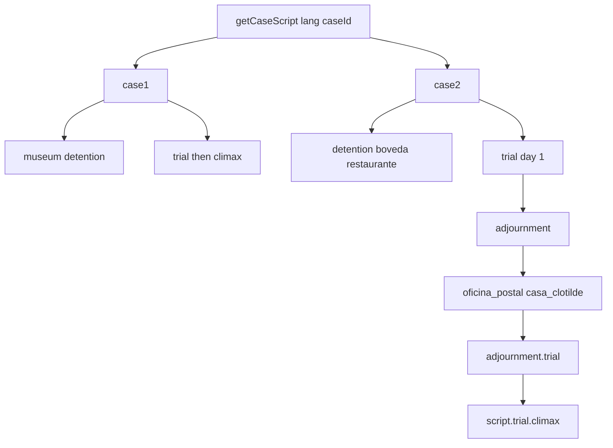

# Case Scripting Architecture

Technical guide for [[src/case/index.ts]], configured in [[src/case/case.group.md]].

## Overview

Narrative lives in `CaseScript` objects. `getCaseScript(lang, caseId)` in [[src/case/index.ts]] returns Case 1 (`case1`), Case 2 (`case2`), or Case 3 (`case3`); default `CASE_SCRIPT` is still Case 1 Spanish. Each script has `id`, `startLocation`, `requiredEvidence`, `debugEvidence`, `debugUnlockLocations`, `investigation`, `trial`, and optional `adjournment` ([[src/types/Private/script.ts]]). Case 3 lives in nested module [[src/case/case3/index.ts]].



Case 3 (`case3`) is assembled in [[src/case/case3/index.ts]]: detention → cabina → kermés → day-1 trial → despacho → clínica → delegación → day-2 trial → bodega → `delegacion_d3` → `centro_detencion_d3` → day-3 trial → four-stage climax + proverb-trap choices + waiting-room epilogue. Day 3 reuses precinct/detention as distinct location ids so intros stay day-specific. `Statement.unlockedBy` hides a line until another statement is pressed. `ClimaxStage.minUpdateStage` rejects `microfono_oro` until two description updates. `adjournment.next` is the third trial day.

Case 2 is assembled in [[src/case/Private/case2_script.ts]]: ES/EN scene modules, day-1 trial (`case2_trial_day1*`), day-2 trial (`case2_trial_day2*`), climax on `trial.climax` (`case2_climax.ts`). Day-1 investigation: `detention` → `boveda` → `restaurante`. After testimony 2, `adjournment` sends the player to `oficina_postal` (unlock), then `casa_clotilde`. Day-2 testimonies live on `adjournment.trial`; the finale is still `script.trial.climax`. Case 2 uses optional `climax.stages`: three presents (`lata_grasa`/`antenitas_vinil`, then `frasco_valeriana`/`aroma_dulce`, then `molde_cera`), then optional `climax.choices` (two `ChoicePrompt` questions after the wax-mold present). Case 1 has a single present (`presentTarget` only) and no choices. After the Not Guilty line, courtroom confetti plays, then a black fade into Case 2 `climax.epilogue` in `assets/bg_waiting_room.jpg` (no bench/podium). Case 1 has no `adjournment` and no epilogue.

## Schema Definitions

### 1. Dialogue Line Object ([[src/types/Private/script.ts#Dialogue & Visual Tags]])

Each entry in a dialogue sequence supports the following optional and required fields:

| Field | Type | Description |
|-------|------|-------------|
| `speaker` | string | Speaker label displayed in the nameplate (e.g. `'DEFENSA'`, `'DON RAMON'`, `'CHAPULIN'`, `'SUPER SAM'`, `'JUEZ'`, `'TRIPASECA'`, `'FLORINDA'`, `'NARRADOR'`). |
| `text` | string | Text string rendered via typewriter. |
| `pose` | string \| null | Sprite key (e.g. `'donramon_idle'`, `'donramon_shock'`, `'chompiras_crying'`). If `null` during trial, defense defaults to `'donramon_idle'`. `donramon_slam` is a desk-contact pose for trial benches; investigation uses `donramon_shock`. Leftover slam tags remap to shock when mode is not `TRIAL`. |
| `bg` | string | File path to switch the background image (`#scene-bg`). |
| `bgm` | string | Track ID to switch soundtrack playback in `midiComposer`. |
| `sfx` | string | SFX identifier to trigger procedural audio (`'gavel'`, `'desk_slam'`, `'whoosh'`, `'realization'`, `'damage'`, `'chipote'`, `'chicharra'`). |
| `cutin` | string | Cut-in graphic key (`'objection_protesto'`, `'objection_un_momento'`, `'objection_toma_eso'`, `'objection_culpable'`, `'objection_inocente'`). |
| `addEvidence` | string | Evidence ID to automatically add to the player's inventory with a progress notification (same toast + realization SFX as a new location). |
| `updateEvidence` | string | Advances one Court Record description stage (`updates[]` or legacy `updatedDesc`). Missing items are added first. |

Statements may set `unlockedBy` to another statement id; [[src/engine/Private/StatementUnlock.ts]] keeps those lines out of the visible cross-exam list until that id is pressed.

### 2. Investigation Scene Schema ([[src/case/Private/case1_investigation.ts]], [[src/case/Private/case2_script.ts]])

```typescript
investigation: {
  [locationId]: {
    title: string;
    bg: string;
    bgm: TrackName;
    speaker: SpeakerName;
    intro: DialogueLine[];
    hotspots: Hotspot[];
    talkOptions: TalkOption[];
  }
}
```

Hotspot `x,y,w,h` are percentages of the 960×540 `#game-screen`, not of the JPEG. `#scene-bg` uses `background-size: cover` and `background-position: center`, so a 1536×1024 (3:2) Case 2 plate is width-fitted and the extra height is cropped equally top and bottom. Place boxes on that cover crop (and keep Spanish/English geometry identical). Keep clickable regions above the dialogue strip when the object is fully visible there; a floor object that only exists under the 145px dialogue box still belongs on that object.

### 3. Testimony & Cross-Examination Schema ([[src/case/Private/case1_trial.ts]])

```typescript
testimony: {
  title: string;
  witness: string;
  bgm: TrackName;
  statements: Statement[];
}
```

### 4. Climax Schema ([[src/case/Private/case1_climax.ts]], [[src/case/Private/case2_climax.ts]])

```typescript
climax: {
  dialogue: DialogueLine[];
  presentTarget: EvidenceId[];
  stages?: { presentTarget: EvidenceId[]; successDialogue: DialogueLine[]; minUpdateStage?: Partial<Record<EvidenceId, number>> }[];
  choices?: ChoicePrompt[];
  verdict: DialogueLine[];
  epilogue?: { bg: string; dialogue: DialogueLine[] };
}

interface ChoicePrompt {
  id: string;
  question: string;
  options: { id: string; label: string }[];
  correctId: string;
  successDialogue: DialogueLine[];
  failDialogue: DialogueLine[];
}
```

If `stages` is set, [[src/engine/Private/TrialClimax.ts]] walks them in order: a correct present plays that stage's `successDialogue` and opens the Court Record again, until the last stage. Case 1 omits `stages` and treats `presentTarget` + `verdict` as one step. When `choices` is set (Case 2), the final present plays that stage's `successDialogue` (wax mold + judge question), then [[src/engine/Private/TrialChoice.ts]] opens `#choice-prompt-modal` for each `ChoicePrompt`. Wrong answers apply penalties and reopen the same prompt; the last correct choice queues its `successDialogue` (verdict through Not Guilty), then confetti and epilogue. `climax.verdict` mirrors the last choice's `successDialogue`. [[src/engine/Private/TrialClimax.ts]] fires courtroom confetti and fades through black into `epilogue.bg`. Every epilogue line is stamped with that `bg` and `furniture: 'none'` so trial speaker cameras do not fire. After the last epilogue line the screen fades to black and `#case-complete-overlay` reports the case is finished. Case 1 omits `epilogue` and uses the same complete plate after the verdict confetti. Case 2 opens the epilogue with a narrator time-skip into the waiting room.

### 5. Adjournment ([[src/types/Private/script.ts]])

Optional `AdjournmentDefinition`: `nextLocation`, `unlockLocations`, next-day `requiredEvidence`, a `trial` (intro + two testimonies, no nested climax), and optional `next` for a third day. Climax always stays on `script.trial.climax`. [[src/engine/Private/TrialDayRouter.ts]] walks that chain (`trialDay` 1|2|3).

## Case 1 Contradiction Mapping

| Phase | Statement | Contradiction Logic | Required Evidence | Module Source |
|-------|-----------|---------------------|-------------------|---------------|
| **Testimony 1** | Witness claims Chapulín knocked out the guard with his lethal Chipote Chillón. | The Chipote is hollow soft vinyl and makes squeaky sounds; medical report proves the guard suffered a blunt fracture from heavy metal coins. | `chipote_chillon` or `informe_medico` | [[src/case/Private/case1_trial.ts#Testimony 1: Assault Weapon]] |
| **Testimony 2 (Part 1)** | Witness claims the culprit broke into the glass case from the outside. | Glass shards fell outward and Chiquitolina shrinking pills were found by the vent, showing the culprit shrank and broke the glass from inside. | `pastillas_chiquitolina` | [[src/case/Private/case1_trial.ts#Testimony 2: Escape Route]] |
| **Testimony 2 (Part 2)** | Witness claims security photo shows Chapulín running toward the front exit. | The chest logo shows inverted "HC", proving the photo captured a reflection in the mirror; culprit was running to the rear loading bay. | `foto_crimen` | [[src/case/Private/case1_trial.ts#Testimony 2: Escape Route]] |
| **Climax** | Prosecution demands physical proof of where the stolen artifact is right now. | Vinyl antennae detect enemy presence pointing straight at Tripaseca's jacket pocket where the Chicharra is concealed. | `antenitas_vinil` or `bolsa_dolares` | [[src/case/Private/case1_climax.ts#Climax Confrontation & Dilemma]] |
