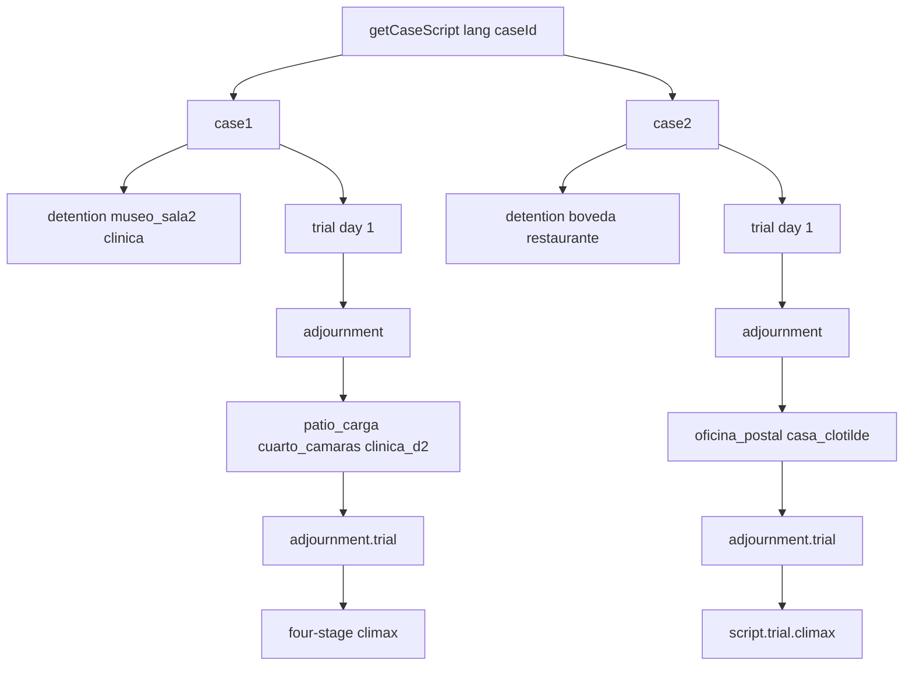

# Case Scripting Architecture

Technical guide for [[src/case/index.ts]], configured in [[src/case/case.group.md]].

Case 0 is a courtroom-only script: `investigation` is empty, `startLocation` is `courtroom`, and the launch layer enters `TRIAL` without calling investigation startup. It is registered alongside Cases 1–4 and has no `adjournment`. Its intro opens in the waiting room, where Chapulín teaches dialogue advance and cross-examination before the courtroom opening and `openingPresent` tutorial. Testimony 2's success dialogue includes the recessed waiting-room conversation, then resumes in court to deliver `maletin_cobranza` and `tarjeta_enciclopedias` before testimony 3.

## Overview

Narrative lives in `CaseScript` objects. `getCaseScript(lang, caseId)` in [[src/case/index.ts]] returns Case 1 (`case1`), Case 2 (`case2`), Case 3 (`case3`), or Case 4 (`case4` when scripted); default `CASE_SCRIPT` is still Case 1 Spanish. Each script has `id`, `startLocation`, `requiredEvidence`, `debugEvidence`, `debugUnlockLocations`, `investigation`, `trial`, and optional `adjournment` ([[src/types/Private/script.ts]]). Case 3 lives in nested module [[src/case/case3/index.ts]]; Case 4 will live in [[src/case/case4/index.ts]].

The splash menu presents the playable arcs as Acts rather than mirroring internal case ids: Act 1 launches `case2` (the Chómpiras arc), Act 2 launches `case1` (the museum arc), Act 3 launches `case3`, and Act 4 launches `case4`. Keep `case1`/`case2` stable for saves, catalogs, and deep-module imports. Their canonical crime dates are 28 August for `case1` and 21 August for `case2`; menu order is a presentation decision, not a `CaseId` rename.



Case 1 (`case1`) is assembled in [[src/case/case1/index.ts]] and is the project's **two-day** case: `detention` → `museo_sala2` → `clinica` → day-1 trial (Florinda, Tripaseca) → `patio_carga` → `cuarto_camaras` → `clinica_d2` → day-2 trial (Alma Negra, Tripaseca ×2) → four-stage climax + waiting-room epilogue. `adjournment.next` is deliberately **absent**: the case ends on day 2. `adjournment.unlockLocations` opens only `patio_carga`; the yard and the camera room unlock the rest of the day themselves through conditional hotspots, so inventory and route advance together. Case 1 owns its catalogue pair ([[src/state/Private/EvidenceCatalogCase1Es.ts]] / `…En.ts`) — `getEvidenceCatalog(lang, 'case1')` no longer returns the map shared with Case 2. It is the only case that declares `debugProfiles`, and therefore the only one whose Acta shows a tab bar (§ *Character record* below).

Case 3 (`case3`) is assembled in [[src/case/case3/index.ts]]: `detention` → `cabina_radio` → `plaza_kermes` → day-1 trial → `despacho_barriga` → `clinica_chapatin` → `delegacion` → day-2 trial → `bodega_radio` → `detention_d3` → `delegacion_d3` → day-3 trial → four-stage climax + proverb-trap choices + waiting-room epilogue. Day 1 reuses the shared `detention` id; day 3 revisits detention and the precinct under `_d3` ids because `investigation` is one scene per location key and the intros are day-specific. Day 3 visits detention **before** the precinct so the two precinct clues close the day (see the gating invariant below). `Statement.unlockedBy` hides a line until another statement is pressed. `ClimaxStage.requiredUpdateStage` rejects `microfono_oro` until two description updates. `adjournment.next` is the third trial day. After Barriga wakes, day-3 trial, climax, and epilogue lines use the wheelchair family (`barriga_vendado`, `barriga_shock`, `barriga_enojado`) and never `barriga_idle`. Shock and enojado come from [[tools/raw/barriga_injured_poses_raw.png]], not from the idle 2×2. `tests/case/Case3BarrigaTrialPoses.test.ts` and `tests/assets/BarrigaInjuredPoses.test.ts` guard that. Case 3 owns `informe_barriga` rather than reusing Case 1's `informe_medico`, and `getEvidenceCatalog(lang, 'case3')` returns the Case 3 map alone — no Case 1 entries leak in.

> **Gating invariant (all multi-day cases):** `checkTrialReadiness` reads only the inventory, never the visited-location set. The **last** location of each investigation day must therefore hand over at least one `requiredEvidence` item, or `#btn-inv-trial` lights up early and the player can skip scenes the trial script assumes were seen. Case 3 day lists live in [[src/case/case3/Private/progress.ts]]; `tests/case/Case3Scripts.test.ts` walks the `unlockLocation` chain to assert it.

Case 2 is assembled in [[src/case/case2/index.ts]]: ES/EN scene modules, day-1 trial (`trial_day1*`), day-2 trial (`trial_day2*`), climax on `trial.climax` (`climax.ts`). Day-1 investigation: `detention` → `boveda` → `restaurante`. After testimony 2, `adjournment` sends the player to `oficina_postal` (unlock), then `casa_clotilde`. Day-2 testimonies live on `adjournment.trial`; the finale is still `script.trial.climax`. Case 2 uses optional `climax.stages`: three presents (`lata_grasa`/`antenitas_vinil`, then `frasco_valeriana`/`aroma_dulce`, then `molde_cera`), then optional `climax.choices` (two `ChoicePrompt` questions after the wax-mold present). Case 1 uses four `stages` and no choices. After the Not Guilty line, courtroom confetti plays, then a black fade into Case 2 `climax.epilogue` in `assets/bg_waiting_room.jpg` (no bench/podium). Case 1 adjourns once (day 1 → day 2) and ends on a waiting-room epilogue. Once that victory is queued, the engine is no longer awaiting a climax present, so the Acta must not reopen on the lobby cut.

## Schema Definitions

### 1. Dialogue Line Object ([[src/types/Private/script.ts#Dialogue & Visual Tags]])

Each entry in a dialogue sequence supports the following optional and required fields:

| Field | Type | Description |
|-------|------|-------------|
| `speaker` | string | Speaker label displayed in the nameplate (e.g. `'DEFENSA'`, `'DON RAMON'`, `'CHAPULIN'`, `'SUPER SAM'`, `'JUEZ'`, `'TRIPASECA'`, `'FLORINDA'`, `'NARRADOR'`). |
| `text` | string | Text string rendered via typewriter. |
| `pose` | string \| null | Sprite key (e.g. `'donramon_idle'`, `'donramon_shock'`, `'chompiras_crying'`). If `null` during trial, defense defaults to `'donramon_idle'`. `donramon_slam` is a desk-contact pose for trial benches; investigation uses `donramon_shock`. Leftover slam tags remap to shock when mode is not `TRIAL`. |
| `requiresExamine` | string \| null | On a contradiction rule, the evidence id that must have been opened with `EXAMINE DETAIL` before the matching present is accepted. |
| `bg` | string | File path to switch the background image (`#scene-bg`). |
| `bgm` | string | Track ID to switch soundtrack playback in `midiComposer`. On a climax `dialogue[0]` it overrides the engine's `suspense` opener — see [[docs/lessons-learned/climax-bgm-line-override.md]]. For the big truth-reveal dialogue block (the "here is what really happened" sequence), use `truth` on the block's first line and return to the testimony loop when court business resumes — see [[docs/architecture/audio-system.md#Track Catalog]]. |
| `sfx` | string | SFX identifier to trigger procedural audio (`'gavel'`, `'desk_slam'`, `'whoosh'`, `'realization'`, `'damage'`, `'chipote'`, `'chicharra'`). |
| `cutin` | string | Cut-in graphic key (`'objection_protesto'`, `'objection_un_momento'`, `'objection_toma_eso'`, `'objection_culpable'`, `'objection_inocente'`). |
| `addEvidence` | string | Evidence ID to automatically add to the player's inventory with a progress notification (same toast + realization SFX as a new location). |
| `updateEvidence` | string | Advances one Court Record description stage (`updates[]` or legacy `updatedDesc`). Missing items are added first. |
| `addProfile` | string | Files a person in the Acta de Personajes. Same toast as evidence. Case 1 only. |
| `updateProfile` | string | Advances one profile description stage. Missing profiles are filed first. Saturates like evidence. |

To show a full-screen illustration mid-dialogue (Case 0's `cartapacio` definition inside the third press of testimony 1), stamp `bg` with a 960×540 plate plus `furniture: 'none'` on **every** line of the aside and speak them as `NARRADOR` (no `pose`, so no sprite covers the plate). The next line without `bg` restores the speaker camera.

### Character record (`profileTarget`)

Case 1 adds a second tab to the Acta. `ProfileItem` ([[src/types/Private/profile.ts]]) mirrors `EvidenceItem`: `desc` plus an ordered `updates[]` counter that saturates. `profileTarget` **replaces** `evidence` / `presentTarget` on `OpeningPresent`, `ContradictionRule`, `ContradictionFollowUp` and `ClimaxStage`, which is why those three fields are optional — code that reads them must guard, or an exhibit presented in a person-shaped slot would be penalised silently instead of routed to [[src/engine/Private/ProfilePresent.ts]]. Case 1 uses exactly two person slots: the day-2 `openingPresent` (`perfil_almanegra`) and climax stage 1 (`perfil_tripaseca`). Day 1 has no `openingPresent` at all. Optional `ClimaxStage.failDialogue` plays before the Acta reopens on a wrong present or a wrong person. See [[docs/flows/character-record-flow.md]].

`Hotspot.condition` hides a hotspot until its predicate passes, and the hotspot layer re-renders after each examine. Case 1 chains its day-2 scenes with it (`hotspot_guantera` needs the truck; `hotspot_barda` needs the glovebox and the bag; `hotspot_espejo` needs the camera, the envelope and the roll log). Hotspots without a predicate are always available, so no other case changes.

Statements may set `unlockedBy` to another statement id; [[src/engine/Private/StatementUnlock.ts]] keeps those lines out of the visible cross-exam list until that id is pressed. Instruction-only speakers (`NARRADOR`, `MODO EXAMINAR`, and `EXAMINE MODE`) do not infer a witness camera, so the last courtroom shot remains visible while the instruction is read. `ALGUACIL` and `CUSTODIO` are the same kind of voice: no camera, no sprite. `SECRETARIO` is a voice too, but after a recusal he speaks from the prosecution bench (`bg_courtroom.webp`) with pose omitted so staging hides the sprite.

### Court roles (optional; Cases 0–4 omit them)

Penalty lines used to hardcode Super Sam and Don Ramón. Cases that swap the bench (Chapulín as `DEFENSA`) or recuse the prosecutor declare roles on the script instead:

| Field | Where | Default |
|-------|--------|---------|
| `defensePointPose` / `defensePanicPose` | `CaseScript` | `donramon_point` / `donramon_panic` |
| `defenseIdlePose` | `CaseScript` | `donramon_idle` (documentational; idle inference in VisualEffects still uses Don Ramón unless the line stamps a pose) |
| `penaltyProsecutionSpeaker` / `penaltyProsecutionPose` | `TrialScript`, `TrialDayScript`, and `Testimony` | `'SUPER SAM'` / `supersam_point` |
| `pressHint` | `CaseScript` | omitted → Chapulín (`chapulin_point`) speaks `i18n.t.pressHint` at Don Ramón |

The press hint speaker follows **who is counsel**, not a hardcoded hero. Cases 0–4 omit `pressHint` so Chapulín coaches Don Ramón. When Chapulín is `DEFENSA`, set `pressHint` to Don Ramón (client, defense bench) addressing Chapulín — never Chapulín saying "¡Don Ramón!". After two wrong presents on a testimony that still has `unlockedBy` lines, [[src/engine/Private/TrialPressFlow.ts]] queues `script.pressHint` instead of the Super Sam / SECRETARIO penalty.

Testimony overrides the active day. A speaker other than Super Sam with no pose queues a voiceless line. `BERRONDO` omitted-pose lines infer `berrondo_idle` (identity lock: black three-piece, leontina, tome) on the witness camera. Do not invent extra Berrondo poses past `berrondo_idle`, `berrondo_definicion`, `berrondo_sweat`, `berrondo_catalogo`, `berrondo_panic`, `berrondo_breakdown`.

### 2. Investigation Scene Schema ([[src/case/case1/Private/museo.ts]], [[src/case/case2/index.ts]])

```typescript
investigation: {
  [locationId]: {
    title: string;
    bg: string;
    bgm: TrackName;
    speaker: SpeakerName;
    intro: DialogueLine[];
    hotspots: Hotspot[];
    talkOptions: TalkOption[];
  }
}
```

`TalkOption` supports progressive unlocking via optional `unlockedByTalk` (another talk option id that must be played first), `unlockedByHotspot` (a hotspot id that must be examined first), and `condition` predicates. [[src/engine/Private/TalkOptionUnlock.ts]] filters available options for the talk modal and triggers realization SFX and `notifDialogueUnlocked` banner notifications whenever a previously locked topic unlocks.

Hotspot `x,y,w,h` are percentages of the 960×540 `#game-screen`, not of the JPEG. `#scene-bg` uses `background-size: cover` and `background-position: center`, so a 1536×1024 (3:2) Case 2 plate is width-fitted and the extra height is cropped equally top and bottom. Place boxes on that cover crop (and keep Spanish/English geometry identical). Keep clickable regions above the dialogue strip when the object is fully visible there; a floor object that only exists under the 145px dialogue box still belongs on that object.

### 3. Testimony & Cross-Examination Schema ([[src/case/case1/Private/trial_day1.ts]])

`TrialScript.testimonies` and `TrialDayScript.testimonies` are ordered arrays. The controller advances from index `i` to `i + 1` after a successful contradiction and only enters adjournment/climax when the array is exhausted. Existing scripts expose optional `testimony1`/`testimony2` aliases for compatibility with older consumers; new cases must use the array.

**Calling the witness to the stand.** A cross-examination must never start cold. The dialogue block that plays immediately before a testimony ends with the witness being called: the prosecution summons them, the court takes their **name and occupation**, a character beat lands, and a final `JUEZ` line orders the testimony to begin. A witness who already testified earlier in the case gets a shorter recall beat instead of a second identity interrogation. The engine resolves that preceding block as:

- testimony index 0 of a day → `openingPresent.successDialogue` when the day has one, otherwise `intro`;
- testimony index *i* > 0 → the resolving `contradiction.followUp.successDialogue` (or `contradiction.successDialogue`) of testimony *i − 1*.

Two invariants hold for every block, in both languages, and are asserted by `tests/case/WitnessCallToStand.test.ts`: the block contains a line spoken by `statements[0].speaker`, and its **last** line is spoken by `JUEZ`. Appending to a success dialogue therefore means the judge's order is what hands control to the cross-examination. Cases 0, 3 and 4 keep these blocks in `Private/witness_calls.ts` / `witness_calls_en.ts` because the host files were near the 200-line limit; Cases 1 and 2 inline them.

Every trial-day `intro` begins with a narrator line using `assets/bg_waiting_room.webp` and `furniture: 'none'`. That line records the scheduled date, time, and `Tribunal Superior - Sala de Espera` / `High Court - Waiting Room`. Most cases then cut directly to the judge; Case 0 instead plays its full pre-trial lobby dialogue before entering court. This keeps trial entry consistent with investigation location introductions without adding a new engine state.

```typescript
testimony: {
  title: string;
  witness: string;
  bgm: TrackName;
  statements: Statement[];
}
```

Case 0 uses three entries in that array. Each entry has exactly one resolving contradiction; a second proof is represented by `followUp`. Its second testimony is the intentional exception for alternate entry points: `c0_t2_2` and `c0_t2_3` both map to the same `foto_patio` contradiction because both assert that the school bell rang, so either statement starts the same examine-detail and Present & Point sequence.

Its climax uses `choicesAfterStage: 0` so the single multiple-choice prompt appears after the plancha Present & Point and before the savings-tin stage. Existing cases leave this field unset and retain their final-stage choice behavior.

### 4. Climax Schema ([[src/case/case1/Private/climax.ts]], [[src/case/case2/Private/climax.ts]])

```typescript
climax: {
  dialogue: DialogueLine[];
  presentTarget: EvidenceId[];
  stages?: { presentTarget: EvidenceId[]; successDialogue: DialogueLine[]; prompt?: string; requiredUpdateStage?: Partial<Record<EvidenceId, number>>; pointTarget?: PointTargetContradiction }[];
  choices?: ChoicePrompt[];
  verdict: DialogueLine[];
  epilogue?: { bg: string; dialogue: DialogueLine[] };
}

interface ChoicePrompt {
  id: string;
  question: string;
  options: { id: string; label: string }[];
  correctId: string;
  successDialogue: DialogueLine[];
  failDialogue: DialogueLine[];
}
```

If `stages` is set, [[src/engine/Private/TrialClimax.ts]] walks them in order: a correct present plays that stage's `successDialogue` and opens the Court Record again, until the last stage. Optional `ClimaxStage.prompt` is the question shown on `#climax-present-prompt` and `#court-record-present-prompt` while that stage awaits a present ([[src/engine/Private/ClimaxPresentPrompt.ts]]); Case 3 fills all four (cuándo / dónde / quién / por qué). Optional `ClimaxStage.pointTarget` opens Present & Point **before** `successDialogue`. Case 1 fills all four (quién / con qué se encuentra la pieza / estuvo adentro / de dónde salieron los datos), and its first stage is a `profileTarget`. When `choices` is set (Case 2), the final present plays that stage's `successDialogue` (wax mold + judge question), then [[src/engine/Private/TrialChoice.ts]] opens `#choice-prompt-modal` for each `ChoicePrompt`. Wrong answers apply penalties and reopen the same prompt; the last correct choice queues its `successDialogue` (verdict through Not Guilty), then confetti and epilogue. `climax.verdict` mirrors the last choice's `successDialogue`. A final stage **without** `choices` plays `stage.successDialogue` then `queueClimaxCelebration(climax.verdict)` (Case 4 bottle + wax-seal breakdown, then INOCENTE). A `DialogueLine` with `confetti: true` triggers the particles as soon as that line is rendered; the generic climax completion callback only supplies a fallback for verdicts without such a line. Case 1 takes this path: stage 4 (`ficha_museo`) plays its success dialogue, then the verdict's effect-only confetti line, followed by the remaining celebration dialogue. [[src/engine/Private/TrialClimax.ts]] then fades through black into `epilogue.bg`. Every epilogue line is stamped with that `bg` and `furniture: 'none'` so trial speaker cameras do not fire. After the last epilogue line the screen fades to black and `#case-complete-overlay` reports the case is finished. Case 1's epilogue is the courthouse waiting room. Case 2 opens the epilogue with a narrator time-skip into the waiting room.

### 5. Adjournment ([[src/types/Private/script.ts]])

Optional `AdjournmentDefinition`: `nextLocation`, `unlockLocations`, next-day `requiredEvidence`, a `trial` (intro + two testimonies, no nested climax), and optional `next` for a third day. Climax always stays on `script.trial.climax`. [[src/engine/Private/TrialDayRouter.ts]] walks that chain (`trialDay` 1|2|3).

## Case 1 Contradiction Mapping

Five testimonies across two days. Each has exactly one resolving contradiction and at most one `followUp`; the two carry **different** dialogue arrays ([[docs/lessons-learned/contradiction-followup-plays-twice.md]]).

| Day / Testimony | Witness claims | Contradiction | Present | Follow-up | Module |
|---|---|---|---|---|---|
| **D1-T1** | The defendant took the Chicharra. | Sixty seconds later he carried nothing, and the museum was searched piece by piece. | `parte_detencion` | `chipote_chillon` (the "club" is a squeaky toy that cannot fracture a skull) | [[src/case/case1/Private/trial_day1.ts]] |
| **D1-T2** | The blow sounded like "a sackful of iron" from the chipote. | The wound needs a heavy, dense, edgeless, *flexible* object struck downward from behind — a sack of coin, and from above. | `informe_medico` | — (closes on turnabout 1 and the recess) | [[src/case/case1/Private/trial_day1_t2.ts]] |
| **D2-T1** | The watchman's round was secret. | It was written in a notebook hanging from a nail where any ticket-holder walks past. | `bitacora_ronda` | `chicharra_oro` (the relic paralysed the thief for a minute) | [[src/case/case1/Private/trial_day2.ts]] |
| **D2-T2** | The case was smashed from outside. | All the glass lies outside the footprint, fanned six metres towards the door (**Pointing 1**). | `vitrina_rota` | `pastillas_chiquitolina` (the thief grew *inside* the case) | [[src/case/case1/Private/trial_day2_t2.ts]] |
| **D2-T3** | The photo shows the defendant fleeing, emblem reading "CH". | The emblem reads "HC": the camera shot the mirror, so direction is inverted too (**Pointing 2**). | `foto_crimen` | `bolsa_dolares` (silver alloy matches the wound) | [[src/case/case1/Private/trial_day2_t3.ts]] |

Climax, four stages ([[src/case/case1/Private/climax_stages.ts]] and [[src/case/case1/Private/climax.ts]]):

| Stage | Question | Answer |
|---|---|---|
| 1 | Who stood on the pedestal? | `profileTarget: perfil_tripaseca` |
| 2 | What instrument locates the Chicharra here in this room? | `antenitas_vinil` |
| 3 | What proves he was inside the gallery? | `rejilla_ducto` (**Pointing 3**: bent corner → tape measure marks → fabric thread) |
| 4 | Where did his advance knowledge come from? | `ficha_museo` |

Stage 2 asks for an *instrument*, not a place: phrased as "where is the Chicharra?" it would make `chicharra_oro` — the card for that very piece, sitting in the Acta — the literal answer and punish the player for giving it. The tail of stage 1 success plants the hypothesis (Chapulín offers the antennae, Don Ramón asks the Record to name the instrument) without naming the answer.

## Case 4 Assembly (`case4`)

Case 4 (`case4`) is specified in [[docs/specs/case-4-el-caso-del-hotel-buena-vista.md]]; scripts land in [[src/case/case4/index.ts]]. Investigation path:

| Day | Location chain | Notes |
|-----|----------------|-------|
| **1** | `detention` → `hotel_lobby` → `hotel_suite` → `hotel_terraza` | Terrace closes with the cork annex (`informe_policial` update) then `candado_cadena`. |
| **2** | `hotel_sotano` → `hotel_suite204` → `hotel_terraza_d2` → `hotel_azotea` → `delegacion` | Terrace rotates to Chómpiras (`chompiras_idle`); precinct closes with `copa_vino` + `toxicologia_vino`. |
| **3** | `hotel_cava` → `hotel_lobby_d3` → `detention_d3` → `delegacion_d3` | Lobby rotates to Chimoltrufia (`chimoltrufia_idle`); precinct closes with `sello_lacre`. |

Day 1 reuses `detention`; day 3 revisits it as `detention_d3` (same gating pattern as Case 3). Cast rotation uses **new location ids** (`hotel_terraza_d2`, `hotel_lobby_d3`) instead of mutating the same scene — see [[docs/lessons-learned/location-cast-rotation.md]].

**Localization is per-file, not per-field.** Every Case 4 scene, testimony and success block has a full `_en` twin holding its own English text; the English script is an adaptation of the Spanish spec, not a translation (spec §18). Two consequences worth preserving: an `_en` module must not reuse a Spanish `successDialogue`/`pointTarget` array, and spreading a Spanish `PointTargetContradiction` to override only `promptQuestion` silently inherits its Spanish `zones[].failureDialogue` — override `zones` too. `hotel_cava_en.ts` exists for this reason; the index no longer builds the English cellar by swapping hotspots onto the Spanish scene.

The day-2 §10.3 closing beat (Rufino's "I did not poison him", the search order for Suite 204, Chapulín's send-off) is appended to `CASE4_D2_T2_BAUL_SUCCESS` so it plays before the adjournment, per the §6 rule that D1-T2 and D2-T2 end on their last success line.

### Case 4 script fields (beyond Case 3)

| Field | Where | Purpose |
|-------|-------|---------|
| `pointTarget` | `ContradictionRule`, `ContradictionFollowUp`, `ClimaxStage` | After a correct present, opens `#present-point-overlay` so the player clicks a zone on the 640×360 plate ([[docs/flows/present-point-flow.md]]). Optional target `successDialogue` and `next` chain another deduction on the same plate; the parent success waits for the final correct click. Optional `id` preserves the active chained target across language changes. |
| `followUp` | `ContradictionRule` | After the first present's success (and point, if any), reopen the Acta for `followUp.evidence`. Wrong item = penalty. Correct plays `followUp.successDialogue` (optional `followUp.pointTarget` first), then testimony 2 / adjourn / climax. |
| `openingPresent` | `TrialScript` / `TrialDayScript` | After that day's intro, before testimony 1: Acta present. Unused in Case 1 day 1 (the badge is a Case 0 tutorial beat only; repeating it every trial kills the pacing) and Case 4 day 3 (the baccarat alibi is admitted, not presented). |
| `detailedView` | `EvidenceItem` in [[src/state/Private/EvidenceCatalogCase4.ts]] | Eight items expose `#btn-evidence-examine` in the Acta ([[docs/flows/evidence-examine-flow.md]]). |

### Case 4 trial gating (`checkTrialReadiness`)

Readiness is inventory-only (see [[docs/lessons-learned/trial-gating-is-inventory-only.md]]). Last location of each day must hand over at least one `requiredEvidence` item:

| Day | `requiredEvidence` | Last location | Sealing item |
|-----|-------------------|---------------|--------------|
| **1** | `informe_policial`, `foto_crimen`, `billetera_cuajinais`, `orden_servicios`, `plano_hotel`, `candado_cadena` | `hotel_terraza` | `candado_cadena` |
| **2** | `residuos_manos`, `casquillo_fogueo`, `registro_montacargas`, `baul_etiquetas`, `copa_vino`, `toxicologia_vino` | `delegacion` | `toxicologia_vino` |
| **3** | `botella_vino`, `boleta_baccarat`, `nota_amenaza`, `sello_lacre` | `delegacion_d3` | `sello_lacre` |

`informe_forense` is delivered mid-trial on day 1 and never gates. Staged `updates[]` enrich cards, never days.

`getEvidenceCatalog(lang, 'case4')` returns the Case 4 map alone (18 entries including `insignia_abogado`); Case 1 `foto_crimen` text must not leak.
