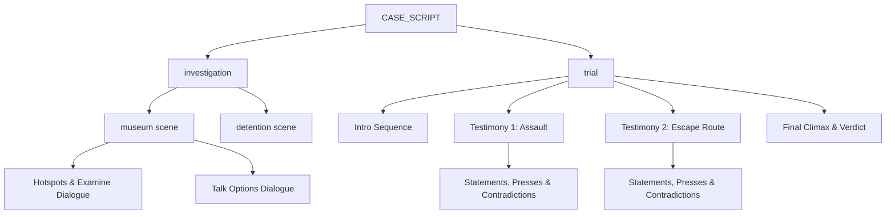

# Case Scripting Architecture

Technical guide for [[src/case/index.ts]], configured in [[src/case/case.group.md]].

## Overview

Case content is defined declaratively in the `CASE_SCRIPT` data structure ([[src/case/index.ts]]). It separates narrative text, logic trees, cross-examination rules, and evidence triggers from UI rendering code.



## Schema Definitions

### 1. Dialogue Line Object ([[src/types/Private/script.ts#Dialogue & Visual Tags]])

Each entry in a dialogue sequence supports the following optional and required fields:

| Field | Type | Description |
|-------|------|-------------|
| `speaker` | string | Speaker label displayed in the nameplate (e.g. `'DEFENSA'`, `'DON RAMON'`, `'CHAPULIN'`, `'SUPER SAM'`, `'JUEZ'`, `'TRIPASECA'`, `'FLORINDA'`, `'NARRADOR'`). |
| `text` | string | Text string rendered via typewriter. |
| `pose` | string \| null | Sprite key (e.g. `'donramon_idle'`, `'donramon_slam'`, `'donramon_point'`, `'chapulin_idle'`, `'tripaseca_sweat'`). If `null` during trial, defense defaults to `'donramon_idle'`. |
| `bg` | string | File path to switch the background image (`#scene-bg`). |
| `bgm` | string | Track ID to switch soundtrack playback in `midiComposer`. |
| `sfx` | string | SFX identifier to trigger procedural audio (`'gavel'`, `'desk_slam'`, `'whoosh'`, `'realization'`, `'damage'`, `'chipote'`, `'chicharra'`). |
| `cutin` | string | Cut-in graphic key (`'objection_protesto'`, `'objection_un_momento'`, `'objection_toma_eso'`, `'objection_culpable'`). |
| `addEvidence` | string | Evidence ID to automatically add to the player's inventory with UI notification. |

### 2. Investigation Scene Schema ([[src/case/Private/case1_investigation.ts]])

```typescript
investigation: {
  [locationId]: {
    title: string;
    bg: string;
    bgm: TrackName;
    speaker: SpeakerName;
    intro: DialogueLine[];
    hotspots: Hotspot[];
    talkOptions: TalkOption[];
  }
}
```

### 3. Testimony & Cross-Examination Schema ([[src/case/Private/case1_trial.ts]])

```typescript
testimony: {
  title: string;
  witness: string;
  bgm: TrackName;
  statements: Statement[];
}
```

### 4. Climax Schema ([[src/case/Private/case1_climax.ts]])

```typescript
climax: {
  dialogue: DialogueLine[];
  presentTarget: EvidenceId[];
  verdict: DialogueLine[];
}
```

## Case 1 Contradiction Mapping

| Phase | Statement | Contradiction Logic | Required Evidence | Module Source |
|-------|-----------|---------------------|-------------------|---------------|
| **Testimony 1** | Witness claims Chapulín knocked out the guard with his lethal Chipote Chillón. | The Chipote is hollow soft vinyl and makes squeaky sounds; medical report proves the guard suffered a blunt fracture from heavy metal coins. | `chipote_chillon` or `informe_medico` | [[src/case/Private/case1_trial.ts#Testimony 1: Assault Weapon]] |
| **Testimony 2 (Part 1)** | Witness claims the culprit broke into the glass case from the outside. | Glass shards fell outward and Chiquitolina shrinking pills were found by the vent, showing the culprit shrank and broke the glass from inside. | `pastillas_chiquitolina` | [[src/case/Private/case1_trial.ts#Testimony 2: Escape Route]] |
| **Testimony 2 (Part 2)** | Witness claims security photo shows Chapulín running toward the front exit. | The chest logo shows inverted "HC", proving the photo captured a reflection in the mirror; culprit was running to the rear loading bay. | `foto_crimen` | [[src/case/Private/case1_trial.ts#Testimony 2: Escape Route]] |
| **Climax** | Prosecution demands physical proof of where the stolen artifact is right now. | Vinyl antennae detect enemy presence pointing straight at Tripaseca's jacket pocket where the Chicharra is concealed. | `antenitas_vinil` or `bolsa_dolares` | [[src/case/Private/case1_climax.ts#Climax Confrontation & Dilemma]] |
