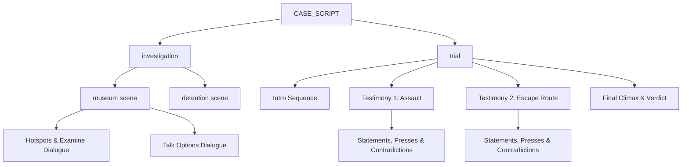

# Case Scripting Architecture

Technical guide for [`src/case/`](file:///c:/Proyectos/ace-attorney-gemini/src/case/).

## Overview

Case content is defined declaratively in the `CASE_SCRIPT` data structure. It separates narrative text, logic trees, cross-examination rules, and evidence triggers from UI rendering code.



## Schema Definitions

### 1. Dialogue Line Object

Each entry in a dialogue sequence supports the following optional and required fields:

| Field | Type | Description |
|-------|------|-------------|
| `speaker` | string | Speaker label displayed in the nameplate (e.g. `'DEFENSA'`, `'CHAPULIN'`, `'SUPER SAM'`, `'JUEZ'`, `'TRIPASECA'`, `'FLORINDA'`, `'NARRADOR'`). |
| `text` | string | Text string rendered via typewriter. |
| `pose` | string \| null | Sprite key (e.g. `'chapulin_idle'`, `'tripaseca_sweat'`). If `null` and speaker is defense/narrator, hides the stage sprite. |
| `bg` | string | File path to switch the background image (`#scene-bg`). |
| `bgm` | string | Track ID to switch soundtrack playback in `midiComposer`. |
| `sfx` | string | SFX identifier to trigger procedural audio (`'gavel'`, `'desk_slam'`, `'whoosh'`, `'realization'`, `'damage'`, `'chipote'`, `'chicharra'`). |
| `cutin` | string | Cut-in graphic key (`'objection_protesto'`, `'objection_un_momento'`, `'objection_toma_eso'`, `'objection_culpable'`). |
| `addEvidence` | string | Evidence ID to automatically add to the player's inventory with UI notification. |

### 2. Investigation Scene Schema

```javascript
investigation: {
    [locationId]: {
        title: string,
        bg: string,
        bgm: string,
        speaker: string,
        intro: DialogueLine[],
        hotspots: [
            {
                id: string,
                label: string,
                x: number, y: number, w: number, h: number, // Percentage coords
                dialogue: DialogueLine[]
            }
        ],
        talkOptions: [
            {
                id: string,
                label: string,
                dialogue: DialogueLine[]
            }
        ]
    }
}
```

### 3. Testimony & Cross-Examination Schema

```javascript
testimony: {
    title: string,
    witness: string,
    bgm: string,
    statements: [
        {
            id: string,
            speaker: string,
            pose: string,
            text: string,
            pressText: DialogueLine[],
            contradiction?: {
                evidence: string[], // Acceptable evidence IDs
                successDialogue: DialogueLine[]
            }
        }
    ]
}
```

### 4. Climax Schema

```javascript
climax: {
    dialogue: DialogueLine[],
    presentTarget: string[], // Valid evidence IDs
    verdict: DialogueLine[]
}
```

## Case 1 Contradiction Mapping

| Phase | Statement | Contradiction Logic | Required Evidence |
|-------|-----------|---------------------|-------------------|
| **Testimony 1** | Witness claims Chapulín knocked out the guard with his lethal Chipote Chillón. | The Chipote is hollow soft vinyl and makes squeaky sounds; medical report proves the guard suffered a blunt fracture from heavy metal coins. | `chipote_chillon` or `informe_medico` |
| **Testimony 2 (Part 1)** | Witness claims the culprit broke into the glass case from the outside. | Glass shards fell outward and Chiquitolina shrinking pills were found by the vent, showing the culprit shrank and broke the glass from inside. | `pastillas_chiquitolina` |
| **Testimony 2 (Part 2)** | Witness claims security photo shows Chapulín running toward the front exit. | The chest logo shows inverted "HC", proving the photo captured a reflection in the mirror; culprit was running to the rear loading bay. | `foto_crimen` |
| **Climax** | Prosecution demands physical proof of where the stolen artifact is right now. | Vinyl antennae detect enemy presence pointing straight at Tripaseca's jacket pocket where the Chicharra is concealed. | `antenitas_vinil` or `bolsa_dolares` |
