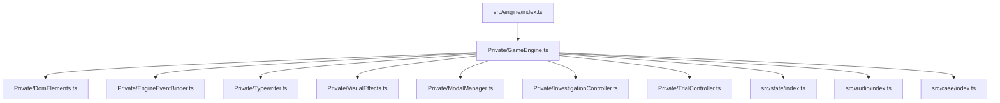

# Presentation & Game Engine Architecture

Technical guide for the presentation and game engine deep module (`src/engine/`, `index.html`, and `style.css`).

## Overview

The `src/engine/` module is organized into encapsulated deep module components with a thin public interface (`src/engine/index.ts`):

## Core Responsibilities

1. **Dialogue Queue System**:
   - `queueDialogue(dialogueArray, onComplete)` maintains a FIFO queue of dialogue line objects.
   - `handleAdvance()` advances dialogue on user input (Click / Space / Enter). If typewriter animation is running, it instantly reveals the complete line; otherwise, it dequeues the next line or triggers `onComplete`.

2. **Typewriter & Text Rendering**:
   - `startTypewriter(text)` steps character-by-character at 28ms intervals.
   - Triggers `soundEngine.playTextBlip()` every alternate character for authentic Capcom typewriter chirping.

3. **Character & Scene Staging**:
   - Updates `#scene-bg` background images.
   - Updates `#character-sprite` poses with continuous idle floating/breathing animation (`characterBreathe`).
   - Automatically hides character sprites when the defense or narrator is speaking, or during active examine mode.

4. **Visual Effects & Overlays**:
   - **Cut-in Animation**: `showCutin(cutinName)` triggers zoom, shake, and flash animations for `¡PROTESTO!`, `¡UN MOMENTO!`, `¡TOMA ESO!`, and `¡INOCENTE!`.
   - **Screen Shake**: `shakeScreen(durationMs)` applies CSS shake keyframes (`aaShake`).
   - **Screen Flash**: `flashScreen()` fades in an opaque white flash overlay.
   - **Confetti Victory**: `triggerConfetti()` creates randomized falling celebratory particles.

5. **Investigation & Examination Mode**:
   - `startInvestigation(location)` renders hotspots and loads intro dialogue.
   - `startExamineMode()` enables pointer events on hotspots, attaches a cursor-following tooltip (`#examine-tooltip`), and hides the character sprite to give an unobstructed view.
   - Hotspot clicks trigger audio feedback, hide the examine cursor, and queue hotspot dialogue.

6. **Court Record & Talk Modals**:
   - Dynamically populates `#court-record-modal` with items from `gameState.inventory`.
   - Renders evidence details (icon preview, title, description) and provides the "¡Presentar Prueba!" button during trial cross-examinations.
   - Dynamically renders `#talk-options-modal` with topics defined in the current scene script.

## Invariants & Design Rules

- **Input Safety**: Interactions are blocked or sequenced through the dialogue queue to prevent race conditions during animations.
- **Audio Context Activation**: Any user gesture ensures the `AudioContext` is active via `soundEngine.ensureActive()`.
- **Clean Mode Toggles**: Switching modes (`INVESTIGATION` <-> `TRIAL` <-> `EXAMINE`) explicitly hides inactive HUD groups to avoid overlapping controls.
