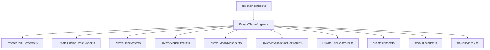

# Presentation & Game Engine Architecture

Technical guide for the presentation and game engine deep module ([[src/engine/index.ts]], `index.html`, and `style.css`), configured in [[src/engine/engine.group.md]].

## Overview

The `src/engine/` module is organized into encapsulated deep module components with a thin public interface ([[src/engine/index.ts]]):

## Core Responsibilities

1. **Dialogue Queue System** ([[src/engine/Private/GameEngine.ts#Dialogue Flow & Queue]]):
   - `queueDialogue(dialogueArray, onComplete)` maintains a FIFO queue of dialogue line objects.
   - `handleAdvance()` advances dialogue on user input (Click / Space / Enter). If typewriter animation is running, it instantly reveals the complete line; otherwise, it dequeues the next line or triggers `onComplete`.

2. **Typewriter & Text Rendering** ([[src/engine/Private/Typewriter.ts#Typewriter Stepping & Chirping]]):
   - `start(text)` steps character-by-character at 28ms intervals.
   - Triggers `soundEngine.playTextBlip()` every alternate character for authentic Capcom typewriter chirping.

3. **Character & Scene Staging** ([[src/engine/Private/VisualEffects.ts#Character Pose Staging]]):
   - Updates `#scene-bg` background images automatically per speaker in trial mode (`bg_defense.jpg` for defense, `bg_courtroom.jpg` for prosecution, `bg_judge.jpg` for judge, `bg_witness.jpg` for witness) or via explicit `line.bg`.
   - Updates `#character-sprite` poses with continuous idle floating/breathing animation (`characterBreathe`).
   - Dynamically stages courtroom foreground furniture (`#court-furniture-sprite`): shows `court_podium.png` during witness testimonies, `court_bench.png` when defense or prosecution speaks in court (`bg_defense.jpg`, `bg_courtroom.jpg`), and hides furniture during judge lines or in detention/museum scenes.
   - `updateStagingForLine(dom, line, isTrialMode)` resolves background, furniture **and** stage geometry in one unified step, ensuring camera angle and furniture consistency across rapid speaker turns.
   - Automatically hides character sprites when narrator is speaking, or during active examine mode.

4. **Stage Composition Frames** ([[src/engine/Private/StageLayout.ts#Frame Resolution]]):
   - `STAGE_FRAMES` is the single source of truth for character size and character-to-furniture contact. Four frames: `plain`, `bench-stand`, `bench-slam`, `podium`.
   - `resolveStageFrame(furniture, pose)` picks a frame from the resolved furniture plus the pose. Poses matching `*_slam` are surface-contact poses and get `bench-slam`.
   - `applyStageFrame(gameScreenEl, frameId)` projects the frame onto `#game-screen` as CSS custom properties (`--char-height`, `--char-baseline`, `--char-layer`, `--furniture-width`, `--furniture-height`, `--furniture-baseline`) plus a `data-stage-frame` attribute.
   - **Invariant — no pixels in the frame table or in the staging CSS.** Every metric is a fraction of the stage box so new trials, new locations, and any future change to the 960×540 stage reuse the same frames. `style.css` only reads the variables; the pixel fallbacks there exist solely for the first paint before staging runs.
   - **Invariant — character height stays near 0.62 of stage height.** Above ~0.70 a 512×512 bust overflows the top edge and crops the head.
   - **Invariant — both bench frames share one furniture box.** Only the character baseline differs, so the desk never shifts when the speaker changes pose. `bench-slam` is the only frame whose `characterLayer` exceeds the furniture layer (3).
   - **Invariant — a contact pose's waist lands ON the counter's edge outline.** `court_bench.png` is opaque from row 0 (the outline) and its wood starts at row 6, so the target is a band only ~4px tall on stage. Above it, the room shows through the see-through notch between the forearms; below it, the torso paints on top of the wood as if his belly lay on the desk. `characterBaseline` for `bench-slam` is solved against that band, not tuned by eye — at this scale the error is smaller than a downscaled screenshot can resolve.
   - **Invariant — a `surfaceContact` frame suppresses the idle breathing float.** `applyStageFrame` sets `data-stage-contact`, and `style.css` cancels `characterBreathe` while it is true. A sprite that drifts vertically cannot stay in contact with a static counter; the float would reopen a gap at the contact line every cycle. `surfaceContact` must always agree with `characterLayer > FURNITURE_LAYER`.
   - **Invariant — the `plain` frame aligns with the dialogue box top edge.** The dialogue box is 120px tall with 15px bottom padding (top edge at 135px / 540px = 0.25). Setting `characterBaseline: 0.25` anchors the waist-up bust so the bottom cut of the character sprite rests cleanly along the upper golden border of the dialogue box during investigation mode and free-standing scenes, preventing characters from sinking into the dialogue box.
   - **Invariant — the defense bench spans the full stage width.** This is geometry, not taste. `chapulin_slam.png` has a transparent notch between the forearms, and the counter's far edge must cover it while the palms still stay clear of the gold trim. Those two features are 37px apart on stage, so the rendered wood surface must be deeper than that; below ~0.9 furniture width the frame is unsatisfiable at any character baseline.
   - **Invariant — instant positioning without transition sliding on shot changes.** `#character-container` geometry (`bottom`, `height`) snaps immediately to stage frame custom properties without CSS transitions. In visual novels, courtroom camera shot changes and character switches are instant visual cuts; animating container dimensions/positions causes incoming character sprites to momentarily display at the prior character's baseline and visibly slide into place.
   - Geometry is regression-tested in [[tests/engine/StageLayout.test.ts]], which resolves the ratios into stage pixels and asserts dialogue box alignment, head clearance, palm-on-surface contact against the measured source geometry of `court_bench.png`, and absence of position transitions on `#character-container`.

5. **Visual Effects & Overlays** ([[src/engine/Private/VisualEffects.ts#Dramatic Cut-in Overlays]]):
   - **Cut-in Animation**: `showCutin(cutinName)` triggers zoom, shake, and flash animations for `¡PROTESTO!`, `¡UN MOMENTO!`, `¡TOMA ESO!`, and `¡INOCENTE!`.
   - **Screen Shake**: `shakeScreen(durationMs)` applies CSS shake keyframes (`aaShake`).
   - **Screen Flash**: `flashScreen()` fades in an opaque white flash overlay.
   - **Confetti Victory**: `triggerConfetti()` creates randomized falling celebratory particles.

6. **Investigation & Examination Mode** ([[src/engine/Private/InvestigationController.ts#Examine Mode & Tooltips]]):
   - `startInvestigation(location)` renders hotspots and loads intro dialogue.
   - `startExamineMode()` enables pointer events on hotspots, attaches a cursor-following tooltip (`#examine-tooltip`), and hides the character sprite to give an unobstructed view.
   - Hotspot clicks trigger audio feedback, hide the examine cursor, and queue hotspot dialogue.
   - **First-time Hotspot Dialogue**: When examining a hotspot for the first time, investigation navigation controls (`#investigation-controls`) remain hidden and actions (talk, examine, move) are locked until the dialogue is completed, at which point the hotspot is marked examined in `gameState.flags` and navigation controls reappear.
   - **Repeated Hotspot Dialogue**: When examining a previously completed hotspot, navigation controls remain interactive, allowing the player to freely talk or examine something else without being locked into known dialogue.

7. **Debug Trial Launch** ([[src/engine/Private/GameEngine.ts#Initialization & Bootstrapping]]):
   - `startTrialDebug()` bypasses the investigation phase, activates Web Audio API synth, dismisses splash screen overlay, populates all required case clues via `gameState.populateTrialEvidence()`, and launches the courtroom trial directly.
   - Triggerable via `#btn-start-trial-debug` on the splash card, URL query/hash parameters (`?mode=trial`, `?trial=1`, `#trial`), or `window.gameEngine.startTrialDebug()`.

8. **Court Record & Talk Modals** ([[src/engine/Private/ModalManager.ts#Court Record Evidence Modal]]):
   - Dynamically populates `#court-record-modal` with items from `gameState.inventory`.
   - Renders evidence details (icon preview, title, description) and provides the "¡Presentar Prueba!" button during trial cross-examinations.
   - Dynamically renders `#talk-options-modal` with topics defined in the current scene script.

## Invariants & Design Rules

- **Input Safety**: Interactions are blocked or sequenced through the dialogue queue to prevent race conditions during animations.
- **Audio Context Activation**: Any user gesture ensures the `AudioContext` is active via `soundEngine.ensureActive()`.
- **Clean Mode Toggles**: Switching modes (`INVESTIGATION` <-> `TRIAL` <-> `EXAMINE`) explicitly hides inactive HUD groups to avoid overlapping controls.

