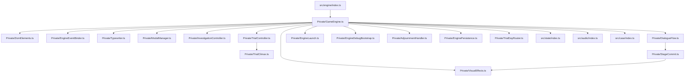

# Presentation & Game Engine Architecture

Technical guide for the presentation and game engine deep module ([[src/engine/index.ts]], `index.html`, and `style.css`), configured in [[src/engine/engine.group.md]].

## Overview

The `src/engine/` module is organized into encapsulated deep module components with a thin public interface ([[src/engine/index.ts]]):

## Core Responsibilities

1. **Dialogue Queue System** ([[src/engine/Private/DialogueFlow.ts]]):
   - `queueDialogue(dialogueArray, onComplete)` maintains a FIFO queue of dialogue line objects.
   - `handleAdvance()` advances dialogue on user input (Click / Space / Enter) and returns a boolean. If typewriter animation is running, it instantly reveals the complete line; otherwise, it dequeues the next line, triggers `onComplete`, or returns `false` when idle. When idle during a climax present (`isAwaitingEvidence()`), `GameEngine.handleAdvance()` reopens the Court Record in presentation mode. After the climax is settled (verdict, confetti, waiting-room epilogue) that reopen must not fire.
   - The blinking `#dialogue-arrow` is a promise that a click advances. `DialogueFlow` toggles `.hidden` on it after every render: visible only while a queued line or an `onComplete` callback is still pending. Cross-examination statements are rendered outside the queue (`renderDialogueLine` direct), so the arrow stays hidden there, where clicking the box does nothing.

   - **Message history** ([[src/engine/Private/DialogueHistory.ts]], rendered by [[src/engine/Private/HistoryModal.ts]]): every rendered line is appended to a capped 150-entry session backlog, opened from the 📜 HUD button (`#btn-history` → `#history-modal`). It is deliberately session-only: `SaveManager` does not serialize it, and a load clears it because the engine re-queues dialogue for the restored scene.

2. **Typewriter & Text Rendering** ([[src/engine/Private/Typewriter.ts#Typewriter Stepping & Chirping]]):
   - `start(text)` steps character-by-character at 28ms intervals.
   - Triggers `soundEngine.playTextBlip()` every alternate character for authentic Capcom typewriter chirping.

3. **Character & Scene Staging** ([[src/engine/Private/VisualEffects.ts#Character Pose Staging]]):
   - Updates `#scene-bg` background images automatically per speaker in trial mode (`bg_defense.webp` for defense, `bg_courtroom.webp` for prosecution, `bg_judge.webp` for judge, `bg_witness.webp` for witness) or via explicit `line.bg`. Location plates (waiting room, investigation) skip courtroom cameras when `line.bg` is set.
   - Updates `#character-sprite` poses with continuous idle floating/breathing animation (`characterBreathe`). `donramon_slam` on a non-trial line resolves to `donramon_shock` so the desk-contact silhouette is never staged on a location plate. Pose `src`, background URL, furniture `src`, and `applyStageFrame` commit together after `Image.decode` ([[src/engine/Private/StageCommit.ts]]); a pending generation is dropped if the player advances again.
   - Dynamically stages courtroom foreground furniture (`#court-furniture-sprite`): shows `court_podium.webp` during witness testimonies, `court_bench.webp` when defense or prosecution speaks in court (`bg_defense.webp`, `bg_courtroom.webp`), and hides furniture during judge lines, investigation scenes, and waiting-room epilogue lines (`bg_waiting_room.webp`).
   - `updateStagingForLine(dom, line, isTrialMode)` resolves background, furniture **and** stage geometry in one unified step, ensuring camera angle and furniture consistency across rapid speaker turns.
   - Automatically hides character sprites when narrator is speaking, or during active examine mode.

4. **Stage Composition Frames** ([[src/engine/Private/StageLayout.ts#Frame Resolution]]):
   - `STAGE_FRAMES` is the single source of truth for character size and character-to-furniture contact. Four frames: `plain`, `bench-stand`, `bench-slam`, `podium`.
   - `resolveStageFrame(furniture, pose)` picks a frame from the resolved furniture plus the pose. Poses matching `*_slam` are surface-contact poses and get `bench-slam`.
   - `applyStageFrame(gameScreenEl, frameId, pose)` projects the frame onto `#game-screen` as CSS custom properties (`--char-height`, `--char-baseline`, `--char-layer`, `--furniture-width`, `--furniture-height`, `--furniture-baseline`) plus a `data-stage-frame` attribute. `--char-height` is the frame height times a pose-prefix scale (Chapatín is 0.85 so a short bust does not swallow the witness podium).
   - **Invariant — no pixels in the frame table or in the staging CSS.** Every metric is a fraction of the stage box so new trials, new locations, and any future change to the 960×540 stage reuse the same frames. `style.css` only reads the variables; the pixel fallbacks there exist solely for the first paint before staging runs.
   - **Invariant — busts render with smooth filtering.** `#character-sprite` is the one place in the UI that sets `image-rendering: auto`. Every stage frame downscales a 512px painting by a non-integer ratio; nearest-neighbour drops over half the rows and columns and shreds thin linework. Do not "restore consistency" by putting `pixelated` back.
   - **Invariant — character height stays near 0.62 of stage height.** Above ~0.70 a 512×512 bust overflows the top edge and crops the head. A short character keeps the same baseline and furniture box; only the height multiplier changes.
   - **Invariant — both bench frames share one furniture box.** Only the character baseline differs, so the desk never shifts when the speaker changes pose. `bench-slam` is the only frame whose `characterLayer` exceeds the furniture layer (3).
   - **Invariant — a contact pose's waist lands ON the counter's edge outline.** `court_bench.png` is opaque from row 0 (the outline) and its wood starts at row 6, so the target is a band only ~4px tall on stage. Above it, the room shows through the see-through notch between the forearms; below it, the torso paints on top of the wood as if his belly lay on the desk. `characterBaseline` for `bench-slam` is solved against that band, not tuned by eye — at this scale the error is smaller than a downscaled screenshot can resolve.
   - **Invariant — a `surfaceContact` frame suppresses the idle breathing float.** `applyStageFrame` sets `data-stage-contact`, and `style.css` cancels `characterBreathe` while it is true. A sprite that drifts vertically cannot stay in contact with a static counter; the float would reopen a gap at the contact line every cycle. `surfaceContact` must always agree with `characterLayer > FURNITURE_LAYER`.
   - **Invariant — the `plain` frame aligns with the dialogue box top edge.** The dialogue box is 120px tall with 15px bottom padding (top edge at 135px / 540px = 0.25). Setting `characterBaseline: 0.25` anchors the waist-up bust so the bottom cut of the character sprite rests cleanly along the upper golden border of the dialogue box during investigation mode and free-standing scenes, preventing characters from sinking into the dialogue box.
   - **Invariant — the defense bench spans the full stage width.** This is geometry, not taste. `chapulin_slam.png` has a transparent notch between the forearms, and the counter's far edge must cover it while the palms still stay clear of the gold trim. Those two features are 37px apart on stage, so the rendered wood surface must be deeper than that; below ~0.9 furniture width the frame is unsatisfiable at any character baseline.
   - **Invariant — instant positioning without transition sliding on shot changes.** `#character-container` geometry (`bottom`, `height`) snaps immediately to stage frame custom properties without CSS transitions. In visual novels, courtroom camera shot changes and character switches are instant visual cuts; animating container dimensions/positions causes incoming character sprites to momentarily display at the prior character's baseline and visibly slide into place.
   - Geometry is regression-tested in [[tests/engine/StageLayout.test.ts]], which resolves the ratios into stage pixels and asserts dialogue box alignment, head clearance, palm-on-surface contact against the measured source geometry of `court_bench.png`, and absence of position transitions on `#character-container`. Case 3 bust PNGs are gated in [[tests/assets/Case3StandingBusts.test.ts]] so a floating hem cannot pass as a staging bug.

5. **Visual Effects & Overlays** ([[src/engine/Private/VisualEffects.ts#Dramatic Cut-in Overlays]]):
   - **Cut-in Animation**: `showCutin(cutinName)` triggers zoom, shake, and flash animations for `¡PROTESTO!`, `¡UN MOMENTO!`, `¡TOMA ESO!`, and `¡INOCENTE!`.
   - **Screen Shake**: `shakeScreen(durationMs)` applies CSS shake keyframes (`aaShake`).
   - **Screen Flash**: `flashScreen()` fades in an opaque white flash overlay.
   - **Location Fade**: [[src/engine/Private/SceneFade.ts]] covers `#screen-flash` in black. `fadeThroughBlack` swaps the plate while opaque, then reveals. Entering trial paints the first intro courtroom shot during the black cover (not after the reveal). Leaving trial for investigation day 2 does the same in reverse: postal background, no bench, no courtroom sprite, `plain` frame. Also used after a Not Guilty so the waiting room is not a hard cut. `fadeToBlack` stays covered for the case-complete plate ([[src/engine/Private/CaseComplete.ts]]) after the last verdict or epilogue line.
   - **Confetti Victory**: `triggerConfetti()` runs on the verdict camera. Case 2 clears it during the black cover before the waiting-room epilogue. Case 1 has no epilogue, so confetti stays up.

6. **Investigation & Examination Mode** ([[src/engine/Private/InvestigationController.ts#Examine Mode & Tooltips]]):
   - `startInvestigation(location)` renders hotspots, loads intro dialogue, and clears leftover courtroom staging (sprite, bench frame, dialogue) so a fade-in from trial is already the crime scene.
   - `startExamineMode()` enables pointer events on hotspots, attaches a cursor-following tooltip (`#examine-tooltip`), hides the character sprite, and stamps `examine-mode` on `#game-screen` so `#controls-bar` drops onto the 48px examine plate. The bar itself is `pointer-events: none`; only `.menu-btn` receives clicks, so empty dock space cannot cover floor hotspots.
   - Hotspot clicks trigger audio feedback, hide the examine cursor, and queue hotspot dialogue.
   - **First-time Hotspot Dialogue**: When examining a hotspot for the first time, investigation navigation controls (`#investigation-controls`) remain hidden and actions (talk, examine, move) are locked until the dialogue is completed, at which point the hotspot is marked examined in `gameState.flags` and navigation controls reappear.
   - **Repeated Hotspot Dialogue**: When examining a previously completed hotspot, navigation controls remain interactive, allowing the player to freely talk or examine something else without being locked into known dialogue.

7. **Debug Trial Launch** ([[src/engine/Private/EngineDebugBootstrap.ts]], [[src/engine/Private/EngineLaunch.ts]]):
   - `applyDebugUrlParams` reads query/hash (`lang=en`, `case=2`, `trial`) during `GameEngine.init()`.
   - `startTrialDebug()` bypasses investigation, dismisses splash, populates debug evidence, and launches the active case's courtroom.
   - Also triggerable via URL params (`?trial`) or `window.gameEngine.startTrialDebug()`.
   - Case 2 day-1 adjournment returns to investigation through [[src/engine/Private/AdjournmentHandler.ts]] (`fadeThroughBlack`, then `resetTrialLaunchButton` and `startInvestigation` with the postal plate painted while covered and the intro queued after the reveal).

8. **Court Record & Talk Modals** ([[src/engine/Private/ModalManager.ts#Court Record Evidence Modal]]):
   - Dynamically populates `#court-record-modal` with items from `gameState.inventory`.
   - Renders evidence details (icon preview, title, `getEvidenceDesc` which swaps in `updatedDesc` after `updateEvidence`) and provides the "¡Presentar Prueba!" button during trial cross-examinations and climax evidence prompts (whether opened automatically, via dialogue advance, or from `#btn-court-record`). While a climax stage with `prompt` awaits a present, [[src/engine/Private/ClimaxPresentPrompt.ts]] copies that question onto `#climax-present-prompt` (HUD, `pointer-events: none`) and `#court-record-present-prompt` (inside the Acta). The banners hide during success dialogue and choice prompts. Language switch re-reads the current stage's `prompt` from the swapped script.
   - Dynamically renders `#talk-options-modal` with topics defined in the current scene script.
   - Renders `#choice-prompt-modal` during climax via `openChoiceModal()` — non-dismissible, no close button; option buttons use `menu-btn talk-btn` and call `TrialController.handleSelectChoice()`.
   - **Invariant — Court Record cards share equal tracks and scroll only on Y.** `#evidence-grid` is a flex child (`min-width: 0`) with `repeat(3, minmax(0, 1fr))`. Grid items also use `min-width: 0`. Names wrap up to two lines (`line-clamp: 2`); they must not use `white-space: nowrap` or they grow a column (`min-width: auto`) and the grid overflows X. `overflow-x: clip` + `overflow-y: auto` (not `overflow: auto`). Regression: [[tests/engine/CourtRecordLayout.test.ts]].
   - **Invariant — Evidence descriptions scroll; Presentar stays fully visible.** `.modal-body` is `overflow: hidden`. `#evidence-details` uses `min-height: 0` so it can shrink to that body instead of growing with copy. `#evidence-description` is capped at six lines (`max-height: calc(1.3em * 6)`, matching `line-height: 1.3`) with `overflow-y: auto`. `#btn-modal-present` is `flex-shrink: 0`. Regression: [[tests/engine/CourtRecordLayout.test.ts]].

## Invariants & Design Rules

- **Input Safety**: Interactions are blocked or sequenced through the dialogue queue to prevent race conditions during animations.
- **Audio Context Activation**: Any user gesture ensures the `AudioContext` is active via `soundEngine.ensureActive()`.
- **Clean Mode Toggles**: Switching modes (`INVESTIGATION` <-> `TRIAL` <-> `EXAMINE`) explicitly hides inactive HUD groups to avoid overlapping controls.
- **Splash stack fits the 960×540 stage.** `#game-screen` is `overflow: hidden` at 540px. The title screen directly uses the 960×540 canvas without nested inner card boxes. Language toggle is stationed in the top corner (`#btn-lang-splash`), Chapulín is displayed at hero size (180px), and case selection buttons hover cleanly. Regression: [[tests/engine/SplashLayout.test.ts]].
- **The message history records at `renderDialogueLine`, never at `queueDialogue`.** Cross-examination statements are rendered outside the queue, so hooking the queue would silently drop exactly the lines players most need to re-read. The backlog survives `DialogueFlow.clear()` (a queue reset is not a scene change) and is cleared only on a new case or a save load. Regression: [[tests/engine/GameEngineHistory.test.ts]].
- **An open modal owns the keyboard.** The global Space/Enter advance handler returns early while any `.game-modal` is visible, so scrolling the history (or reading the Acta) cannot advance the scene behind it. Regression: [[tests/engine/EngineEventBinder.test.ts]].
- **Full-width HUD docks must not steal hotspot hits.** `#controls-bar` is `pointer-events: none` with `.menu-btn { pointer-events: auto }`. Examine mode lowers the dock (`bottom: 82px`) with the shrunk dialogue plate. Regression: [[tests/engine/ExamineHudLayout.test.ts]].

