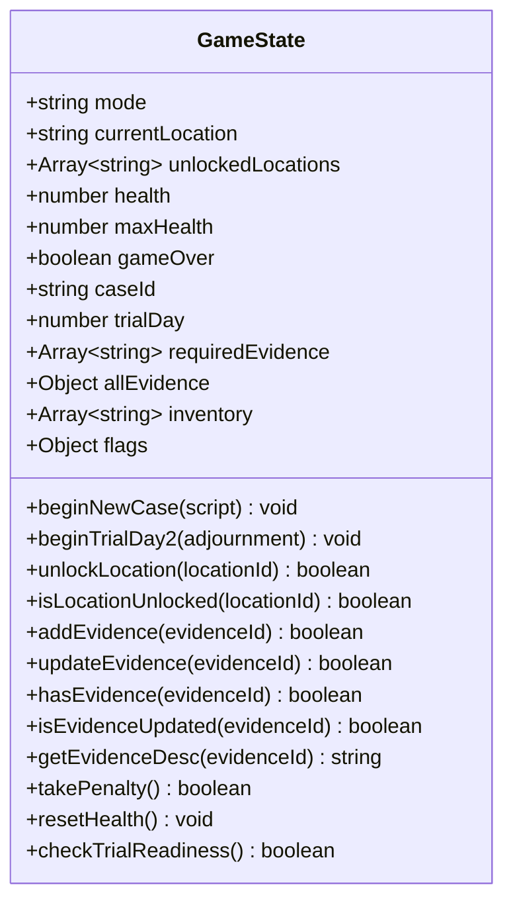

# Game State & Inventory Architecture

Technical guide for [[src/state/index.ts]], configured in [[src/state/state.group.md]].

## Overview

The `GameStateManager` class ([[src/state/Private/GameStateManager.ts]]) is the single source of truth for the game's logical progression, inventory management, penalty/health meters, and investigation state.

## Data Model

### 1. Evidence Registry (`allEvidence`)
Contains the master catalog defined in [[src/state/Private/EvidenceCatalog.ts#Evidence Registry]] (Case 1 plus Case 2 IDs from [[src/state/Private/EvidenceCatalogCase2.ts]]):

| Evidence ID | Name | Role in Case |
|-------------|------|--------------|
| `insignia_abogado` | Insignia de Abogado CH | Default starting badge |
| `chipote_chillon` | Chipote Chillón | Disproves lethal blunt assault charge |
| `pastillas_chiquitolina` | Pastillas de Chiquitolina | Explains entry into locked display case |
| `antenitas_vinil` | Antenitas de Vinil | Detects villain location & timestamps alarm |
| `informe_medico` | Informe Médico de Alma Negra | Shows guard was struck with metal coins |
| `foto_crimen` | Foto del Sospechoso | Mirror reflection proves escape direction |
| `chicharra_oro` | Chicharra Paralizadora de Oro | The stolen artifact |
| `bolsa_dolares` | Bolsa de Dólares de Super Sam | Prosecutor's coin bag / true blunt weapon |

### 2. Player Inventory (`inventory`)
- Array of active evidence IDs currently held by the player.
- Initialized with `['insignia_abogado']`.
- Updated via `addEvidence(evidenceId)` in [[src/state/Private/GameStateManager.ts#Inventory Operations]] which prevents duplicate additions.
- Optional catalog fields `updatedDesc` (legacy one-shot) and `updates[]` (ordered stages). `updateEvidence` advances `evidenceUpdateStage` one step and saturates. `getEvidenceDesc` returns `updates[stage-1] ?? updatedDesc ?? desc`. A dialogue `updateEvidence` line still adds a missing item first.
- `beginNewCase` clears flags (including update flags). `populateTrialEvidence` also applies `updateEvidence` so debug trial shows the revised text. Saves persist the flags with the rest of `flags`.

### 3. Location Management (`unlockedLocations`)
- Array of unlocked location identifiers accessible during the investigation phase.
- Default construction uses `['museum']`; `beginNewCase` replaces this with `[script.startLocation]` (Case 2: `'detention'`).
- Updated via `unlockLocation(locationId)` in [[src/state/Private/GameStateManager.ts#Location Operations]] which dynamically registers new areas and returns `true` only when an area is newly unlocked.
- Queryable via `isLocationUnlocked(locationId)`.

### 4. Penalty System (`health` & `takePenalty`)
- Defense starts with `5` health points (displayed as 5 green exclamation points `!` on the HUD).
- Each invalid evidence submission deducts `1` point via `takePenalty()` in [[src/state/Private/GameStateManager.ts#Penalty & Health]].
- When `health` reaches `0`, `gameOver` is set to `true`. The calling penalty site (cross-examination, climax present, or climax choice) must queue the guilty lines and restart the trial, which restores health.

### 5. Case start, trial day, and readiness
- `beginNewCase(script)` in [[src/state/Private/GameStateManager.ts#Case Progression]] sets `caseId`, `trialDay = 1`, investigation at `script.startLocation`, inventory to `['insignia_abogado']`, then `applyProgressionRules(script)`.
- `trialDay` is `1 | 2 | 3`. `beginNextTrialDay(adjournment)` increments the day, copies that adjournment's required evidence and location list. `beginTrialDay2` is a wrapper for Case 2 tests.
- `checkTrialReadiness()` is case-aware: it requires every ID in the current `requiredEvidence` list (not a hardcoded Case 1 five-item set).
- Case 1 `requiredEvidence`: `chipote_chillon`, `pastillas_chiquitolina`, `antenitas_vinil`, `informe_medico`, `foto_crimen`.
- Case 2 day 1: `palanca_rota`, `informe_boveda`, `reloj_pendulo`, `aroma_dulce`, `plano_hacienda`, `caja_generador`.
- Case 2 day 2 (`adjournment.requiredEvidence`): `multa_transito`, `registro_postal`, `lata_grasa`, `antenitas_vinil`, `frasco_valeriana`, `molde_cera`.
- Case 3 lists live in [[src/case/case3/Private/progress.ts]] — day 1: `lentes_barriga`, `informe_barriga`, `marcas_carrito`, `microfono_cabina`, `microfono_oro`, `cinta_salud`, `ventana_cabina`, `programa_kermes`; day 2: `bitacora_transmision`, `receta_nono`, `libro_verde`; day 3: `ataduras_bodega`, `cinta_sketch`, `cartucho_corte`, `boleta_empeno`.
- **Invariant:** readiness is inventory-only — it never checks which locations were visited. So the last location of every investigation day must hand over at least one required item, or the trial unlocks before the player has seen scenes the trial script assumes. Case 3 moves `programa_kermes` to the plaza (day 1) and puts detention before the precinct (day 3) for exactly this reason.

### 6. Debug Trial State Setup (`populateTrialEvidence`)
- `populateTrialEvidence()` in [[src/state/Private/GameStateManager.ts#Trial Debug Setup]] adds `debugEvidence`, unlocks `debugUnlockLocations`, sets `flags.ready_for_trial = true`, and switches `mode` to `'TRIAL'`. Those lists come from the active `CaseScript` (Case 1 extra `bolsa_dolares`; Case 2 debug uses day-1 evidence + `boveda` / `restaurante`).

### 7. Browser Storage Persistence (`SaveManager`)
- `SaveManager` in [[src/state/Private/SaveManager.ts]] provides persistence in `window.localStorage` under key `'ace_attorney_save_data'`.
- `exportState(trialSnapshot)` serializes game progression, unlocked locations, inventory, flags, health, mode, language, `caseId`, `trialDay`, and active trial testimony statements.
- `restoreState(data)` rehydrates game state and validates schema versioning (`CURRENT_SAVE_VERSION = 1`).

## Invariants

- Evidence can only be added if it exists in `allEvidence`.
- Inventory contains no duplicates.
- Description updates advance `evidenceUpdateStage` and do not go past the last `updates[]` entry.
- Health cannot drop below 0.
- Corrupted or outdated save payloads are rejected safely without mutating runtime state.
