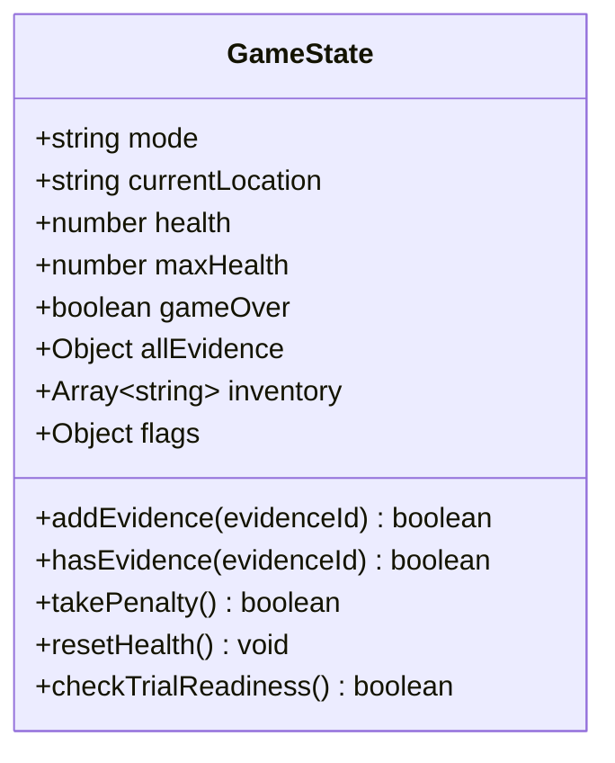

# Game State & Inventory Architecture

Technical guide for [[src/state/index.ts]], configured in [[src/state/state.group.md]].

## Overview

The `GameStateManager` class ([[src/state/Private/GameStateManager.ts]]) is the single source of truth for the game's logical progression, inventory management, penalty/health meters, and investigation state.

## Data Model

### 1. Evidence Registry (`allEvidence`)
Contains the master catalog defined in [[src/state/Private/EvidenceCatalog.ts#Evidence Registry]]:

| Evidence ID | Name | Role in Case |
|-------------|------|--------------|
| `insignia_abogado` | Insignia de Abogado CH | Default starting badge |
| `chipote_chillon` | Chipote Chillón | Disproves lethal blunt assault charge |
| `pastillas_chiquitolina` | Pastillas de Chiquitolina | Explains entry into locked display case |
| `antenitas_vinil` | Antenitas de Vinil | Detects villain location & timestamps alarm |
| `informe_medico` | Informe Médico de Alma Negra | Shows guard was struck with metal coins |
| `foto_crimen` | Foto del Sospechoso | Mirror reflection proves escape direction |
| `chicharra_oro` | Chicharra Paralizadora de Oro | The stolen artifact |
| `bolsa_dolares` | Bolsa de Dólares de Super Sam | Prosecutor's coin bag / true blunt weapon |

### 2. Player Inventory (`inventory`)
- Array of active evidence IDs currently held by the player.
- Initialized with `['insignia_abogado']`.
- Updated via `addEvidence(evidenceId)` in [[src/state/Private/GameStateManager.ts#Inventory Operations]] which prevents duplicate additions.

### 3. Penalty System (`health` & `takePenalty`)
- Defense starts with `5` health points (displayed as 5 green exclamation points `!` on the HUD).
- Each invalid evidence submission deducts `1` point via `takePenalty()` in [[src/state/Private/GameStateManager.ts#Penalty & Health]].
- When `health` reaches `0`, `gameOver` is set to `true`, prompting a retry modal that restores health and resets the current trial phase.

### 4. Progression & Readiness Validation
- Investigation progress is tracked via `flags`.
- `checkTrialReadiness()` in [[src/state/Private/GameStateManager.ts#Investigation Readiness]] verifies that all 5 critical clues have been discovered:
  1. `chipote_chillon`
  2. `pastillas_chiquitolina`
  3. `antenitas_vinil`
  4. `informe_medico`
  5. `foto_crimen`
- Once satisfied, `flags.ready_for_trial` becomes `true`, enabling the "Ir a Juicio" button.

## Invariants

- Evidence can only be added if it exists in `allEvidence`.
- Inventory contains no duplicates.
- Health cannot drop below 0.
