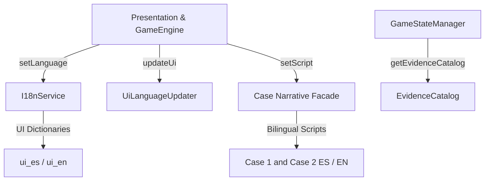

# Internationalization (i18n) Subsystem

Provides comprehensive runtime localization support for **Spanish** (`es`) and **English** (`en`) across UI controls, evidence catalogs, investigation scenes, talk trees, and trial cross-examination scripts.

## Module Boundaries

## Public Facade (`src/i18n/index.ts`)

The internationalization deep module exposes:
- `I18nService` / singleton `i18n`: Locale registry providing language query (`getLanguage()`), setting (`setLanguage(lang)`), toggling (`toggleLanguage()`), and event subscriptions (`subscribe(listener)`).
- `SUPPORTED_LANGUAGES`: Constant array `['es', 'en']`.
- `DEFAULT_LANGUAGE`: Default locale `'es'`.
- `UI_ES` & `UI_EN`: Strongly-typed translation dictionaries implementing the `UiTranslations` interface.

## Language Switching Flow

1. **Trigger**: Player clicks the language toggle button (`#btn-lang-toggle` in top HUD or `#btn-lang-splash` in start splash overlay) or loads a URL parameter (`?lang=en`).
2. **State & i18n Update**: `GameEngine.setLanguage(lang)` invokes `i18n.setLanguage(lang)` and `gameState.setLanguage(lang)`.
3. **Evidence Reload**: `gameState.allEvidence` is repopulated with localized titles, `desc`, and optional `updatedDesc` via `getEvidenceCatalog(lang)`. Update flags stay on `gameState.flags`, so language switch keeps the revised text in the new locale.
4. **Script Swap**: Investigation and trial controllers receive the matching localized narrative graph via `getCaseScript(lang, caseId)` (Case 1 and Case 2 both have ES/EN scripts).
5. **DOM Synchronization**: `UiLanguageUpdater.updateUi(dom, lang)` updates all button labels, modal headers, HUD banners, tooltip templates, and the case-complete overlay copy without requiring a full page reload.

## Structural Invariants

- **Contradiction Parity**: English and Spanish scripts for the same `caseId` must share statement indices and evidence IDs. Case 1 climax targets `antenitas_vinil` / `bolsa_dolares`; Case 2 climax stages target `lata_grasa` / `antenitas_vinil`, then `frasco_valeriana` / `aroma_dulce`, then `molde_cera`. Case 2 `climax.choices` must keep the same `id`, option `id`, and `correctId` values in ES and EN (`case2_climax_choices.ts` / `case2_climax_choices_en.ts`); only `question` and `label` strings differ.
- **Catalog Parity**: If an evidence ID has `updatedDesc` in one language catalog, the other language must have it too.
