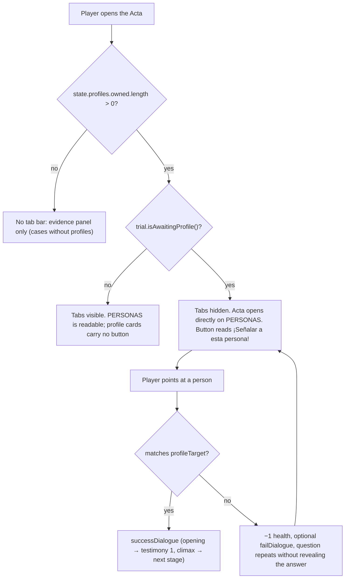

# Character Record Flow (Acta de Personajes, Case 1)

**Trigger:** the player opens the Court Record (`📜 PRESENTAR` or the HUD badge) in a case that declares profiles, or the court asks the defense to name a person.

This is a separate flow from the evidence one, not a variant of it: which button exists on a card depends on what the *active prompt* is asking for, not on which tab the player is looking at.

## Why it exists

Case 1 mechanises the step from "somebody else was standing there" to "that person is the witness". The defense never volunteers a name; the Judge orders one, and the game only accepts it through a profile card ([[docs/specs/case-1-turnabout-red-grasshopper.md]] §6, §15).

## Modules

| Module | Responsibility |
|---|---|
| [[src/state/Private/ProfileInventory.ts]] | Owned profiles + linear saturating stage counter. |
| [[src/state/Private/ProfileCatalog.ts]] | Per-case catalogue; Case 1 and Case 5 maps, `{}` for Cases 0, 2, 3, and 4. |
| [[src/engine/Private/CourtRecordTabs.ts]] | Tab bar, card lists, which present button is visible. |
| [[src/engine/Private/ProfilePresent.ts]] | Routes a person present to the opening slot or the climax stage. |
| [[src/engine/Private/DialogueFlow.ts]] | `addProfile` / `updateProfile` on a dialogue line. |

## Sequence

## Rules worth preserving

- **The tab bar is conditional, not decorative.** It renders while reading an Acta whose active case owns at least one profile, but hides during an active present prompt so the requested evidence or person is the only available record view. A case that declares no profiles must look exactly as it did before this mechanic existed — that regression is guarded by `tests/engine/ProfileRecord.test.ts`.
- **Reading is free.** During a normal cross-examination the profile card exposes no present button at all, so opening the Acta and sitting on PERSONAS cannot cost health.
- **Closing is recoverable.** While the Acta is open, Space/Enter remain reserved by the modal; clicking `X` or pressing Escape closes it and returns to the same cross-examination statement without changing trial state. Escape leaves a nested evidence-examine modal untouched.
- **`profileTarget` replaces `evidence` / `presentTarget`,** it does not accompany them. An exhibit presented into a person-shaped slot is a normal wrong present.
- **Stages saturate.** A second `updateProfile` past the last `updates[]` entry is dropped in silence, exactly like evidence ([[docs/lessons-learned/investigation-gating-and-evidence-stages.md]]).
- **Profiles never gate the trial.** `checkTrialReadiness` reads the evidence inventory only.
