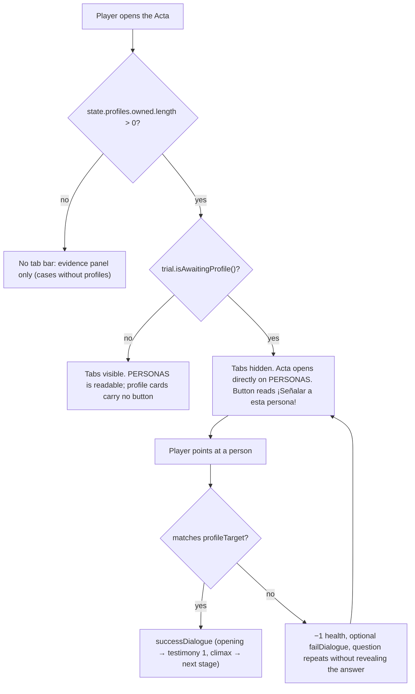

# Character Record Flow (Acta de Personajes)

**Trigger:** the player opens the Court Record (`📜 PRESENTAR` or the HUD badge) in a case that declares profiles, or the court asks the defense to name a person.

This is a separate flow from the evidence one, not a variant of it: which button exists on a card depends on what the *active prompt* is asking for, not on which tab the player is looking at.

## Why it exists

The Acta records people as they are introduced and advances their descriptions when the player learns important new facts. A new act silently starts with profiles for returning characters already present in earlier acts; the active case's catalog supplies their current starting descriptions, so the opening does not announce familiar names again. New characters are still added when introduced. Case 1 introduced the person-present mechanic: the defense never volunteers a name; the Judge orders one, and the game only accepts it through a profile card ([[docs/specs/case-1-turnabout-red-grasshopper.md]] §6, §15). Profile milestones follow the story act and reveal order; `caseId` is a catalog key, not a progress counter. Case 0 is a tutorial before Act 1 and uses its own in-episode reveal order.

## Modules

| Module | Responsibility |
|---|---|
| [[src/state/Private/ProfileInventory.ts]] | Owned profiles + linear saturating stage counter; seeds returning cast silently. |
| [[src/state/Private/ProfileCatalog.ts]] | Per-case bilingual catalogue and prior-act order used to find returning profiles. |
| [[src/engine/Private/CourtRecordTabs.ts]] | Tab bar, card lists, which present button is visible. |
| [[src/engine/Private/ProfilePresent.ts]] | Routes a person present to the opening slot or the climax stage. |
| [[src/engine/Private/DialogueFlow.ts]] | `addProfile` / `updateProfile` on a dialogue line. |

## Sequence

```mermaid
flowchart TD
    Open["Player opens the Acta"] --> HasProfiles{"state.profiles.owned.length > 0?"}
    HasProfiles -- no --> Single["No tab bar: evidence panel only (cases without profiles)"]
    HasProfiles -- yes --> Asking{"trial.isAwaitingProfile()?"}
    Asking -- no --> Read["Tabs visible. PERSONAS is readable; profile cards carry no button"]
    Asking -- yes --> Point["Tabs hidden. Acta opens directly on PERSONAS. Button reads ¡Señalar a esta persona!"]
    Point --> Pick["Player points at a person"]
    Pick --> Right{"matches profileTarget?"}
    Right -- yes --> Success["successDialogue (opening → testimony 1, climax → next stage)"]
    Right -- no --> Penalty["−1 health, optional failDialogue, question repeats without revealing the answer"]
    Penalty --> Point
```

## Rules worth preserving

- **The tab bar is conditional, not decorative.** It renders while reading an Acta whose active case owns at least one profile, but hides during an active present prompt so the requested evidence or person is the only available record view. The same flow still supports a case with no declared profiles; that regression is guarded by `tests/engine/ProfileRecord.test.ts`.
- **Reading is free.** During a normal cross-examination the profile card exposes no present button at all, so opening the Acta and sitting on PERSONAS cannot cost health.
- **Closing is recoverable.** While the Acta is open, Space/Enter remain reserved by the modal; clicking `X` or pressing Escape closes it and returns to the same cross-examination statement without changing trial state. Escape leaves a nested evidence-examine modal untouched.
- **`profileTarget` replaces `evidence` / `presentTarget`,** it does not accompany them. An exhibit presented into a person-shaped slot is a normal wrong present.
- **Stages saturate.** A second `updateProfile` past the last `updates[]` entry is dropped in silence, exactly like evidence ([[docs/lessons-learned/investigation-gating-and-evidence-stages.md]]).
- **Returning profiles are seeded in act order.** `beginNewCase` silently owns profiles whose IDs occur in an earlier act and in the active catalog. This uses Case 0, then Case 2 (Act 1), Case 1 (Act 2), Case 3, Case 4, and Case 5; never sort by case ID. Their active-catalog description starts at stage zero, and scripted `addProfile` lines remain safe no-ops. Fresh cast still generates the usual add notification.
- **Profiles never gate the trial.** `checkTrialReadiness` reads the evidence inventory only.
