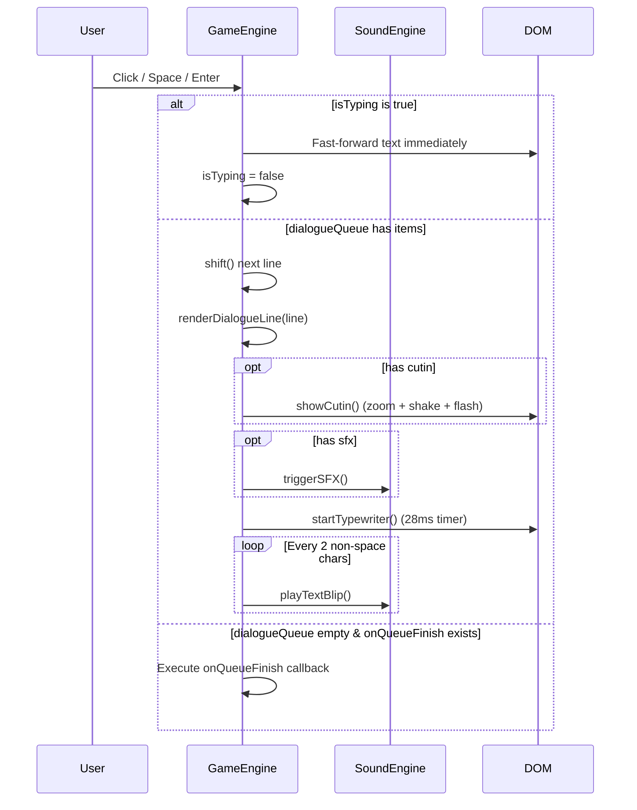

# Dialogue, Typewriter & Cut-in Flow

Operational guide for dialogue queueing, typewriter text animation, audio blip playback, cut-in overlays, and visual effects.

## 1. Trigger
- Script dialogue is queued, or the player advances dialogue via mouse click, `Space`, or `Enter` keys.

## 2. Entry Point
- [`gameEngine.queueDialogue(dialogueArray, onComplete)`](file:///c:/Proyectos/ace-attorney-gemini/js/engine.js#L216)
- [`gameEngine.handleAdvance()`](file:///c:/Proyectos/ace-attorney-gemini/js/engine.js#L198)
- [`gameEngine.renderDialogueLine(line)`](file:///c:/Proyectos/ace-attorney-gemini/js/engine.js#L225)
- [`gameEngine.startTypewriter(text)`](file:///c:/Proyectos/ace-attorney-gemini/js/engine.js#L271)

## 3. Step-by-Step Sequence

### Dialogue Line Rendering Sequence
1. **Background Switch**: If `line.bg` is present, updates `#scene-bg` background URL.
2. **Soundtrack Switch**: If `line.bgm` is present, `midiComposer.playTrack()` starts the requested chiptune track.
3. **Sound Effect**: If `line.sfx` is present, `triggerSFX(sfx)` runs corresponding synthesizer audio and optional screen effects (`gavel`, `desk_slam`, `whoosh`, `realization`, `damage`, `chipote`, `chicharra`).
4. **Cut-in Animation**: If `line.cutin` is present, `showCutin(cutin)` applies `.cutin-animate` keyframes to `#cutin-overlay`, shakes the screen, and flashes white.
5. **Sprite Management**:
   - If `line.pose` is set: updates `#character-sprite` `src` and removes `.hidden`.
   - If `line.speaker` is `'DEFENSA'` or `'NARRADOR'`: hides `#character-sprite`.
6. **Evidence Automatic Grant**: If `line.addEvidence` is present, calls `gameState.addEvidence()` and triggers `#game-notification`.
7. **Speaker Tag**: Updates `#speaker-name` text content.
8. **Typewriter Effect**: Starts a 28ms `setInterval` timer appending characters one by one, playing `soundEngine.playTextBlip()` on every second non-whitespace character.

## 4. Reads
- `gameEngine.dialogueQueue`
- `gameEngine.isTyping`
- `gameEngine.fullTextToType`
- `line` properties (`bg`, `bgm`, `sfx`, `cutin`, `pose`, `speaker`, `text`, `addEvidence`)

## 5. Writes
- `gameEngine.isTyping`
- `gameEngine.typeIdx`
- `gameEngine.dialogueQueue`
- `gameEngine.onQueueFinish`
- `#dialogue-text.textContent`
- `#speaker-name.textContent`

## 6. Side Effects
- Screen shake classes added/removed.
- White flash overlay opacity changes.
- Audio synthesis oscillator creation and termination.

## 7. Files to Inspect
- [`js/engine.js`](file:///c:/Proyectos/ace-attorney-gemini/js/engine.js) (lines 198–369)
- [`style.css`](file:///c:/Proyectos/ace-attorney-gemini/style.css) (lines 307–504)

## 8. Common Failure Modes
- **Text Skipping**: Clicking rapidly during an empty queue fires the completion callback immediately.
- **Missing Pose Asset**: Setting `pose` to an asset that does not exist in `assets/` results in a broken image icon.
