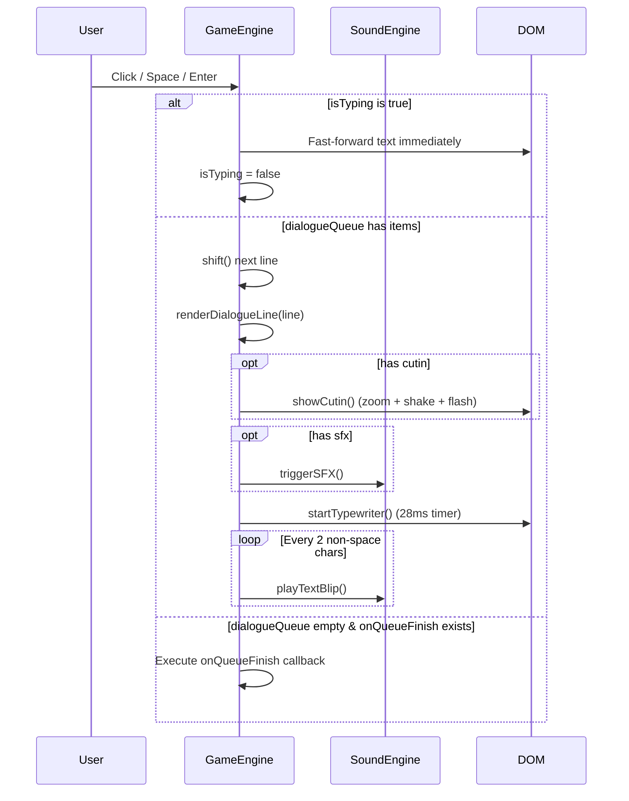

# Dialogue, Typewriter & Cut-in Flow

Operational guide for dialogue queueing, typewriter text animation, audio blip playback, cut-in overlays, and visual effects.

## 1. Trigger
- Script dialogue is queued, or the player advances dialogue via mouse click, `Space`, or `Enter` keys.

## 2. Entry Point
- `engine.queueDialogue(dialogueArray, onComplete)` in [[src/engine/Private/GameEngine.ts#Dialogue Flow & Queue]]
- `engine.handleAdvance()` in [[src/engine/Private/GameEngine.ts#Dialogue Flow & Queue]]
- `engine.renderDialogueLine(line)` in [[src/engine/Private/GameEngine.ts#Line Rendering & Staging]]
- `typewriter.start(text)` in [[src/engine/Private/Typewriter.ts#Typewriter Stepping & Chirping]]

## 3. Step-by-Step Sequence

### Dialogue Line Rendering Sequence
0. **Message History Record**: `DialogueHistory.record(line)` appends `{speaker, text}` to the session backlog ([[src/engine/Private/DialogueHistory.ts]]). It runs first and unconditionally, because `renderDialogueLine` is the only choke point every displayed line passes through — including cross-examination statements, which bypass the queue. An identical consecutive line is skipped so walking testimony back and forth does not duplicate the log.
1. **Background Switch**: Resolved later with the decoded cut (step 6). Soundtrack still starts immediately.
2. **Soundtrack Switch**: If `line.bgm` is present, `midiComposer.playTrack()` starts the requested chiptune track from [[src/audio/Private/TrackCatalog.ts]].
3. **Sound Effect**: If `line.sfx` is present, `triggerSFX(sfx)` runs corresponding synthesizer audio and optional screen effects (`gavel`, `desk_slam`, `whoosh`, `realization`, `damage`, `chipote`, `chicharra`).
4. **Cut-in Animation**: If `line.cutin` is present, `VisualEffects.showCutin(cutin)` applies `.cutin-animate` keyframes to `#cutin-overlay`, shakes the screen, and flashes white.
5. **Sprite Management**:
   - If `line.pose` is set: the engine decodes the pose (and the line's background/furniture) off-DOM, then assigns `#character-sprite` `src` and the stage frame together. Until that decode finishes, the previous complete shot stays on screen so a slow CDN cannot show the last character at the next character's scale.
   - If `line.speaker` is `'DEFENSA'` or `'NARRADOR'` with no pose: hides `#character-sprite` immediately.
6. **Stage Composition**: `presentDialogueVisuals` in [[src/engine/Private/StageCommit.ts]] waits for those bitmaps, then `VisualEffects.updateStagingForLine(dom, line, isTrialMode)` runs in the same turn as the pose swap:
   - Resolves courtroom background (`bg_defense.webp`, `bg_courtroom.webp`, `bg_judge.webp`, `bg_witness.webp`) and updates `#scene-bg` only after the plate has decoded, so the stage never drops to the black `#game-screen` fill between cameras.
   - Resolves furniture from `line.furniture`, else infers it from trial mode + resolved background + pose.
   - `resolveStageFrame(furniture, line.pose)` maps that pair to one of `plain` / `bench-stand` / `bench-slam` / `podium`.
   - `applyStageFrame()` writes the frame's ratios to `#game-screen` as CSS custom properties, which resize and reposition `#character-container` and `#court-furniture-container` together instantly without CSS position transitions (ensuring instant camera cuts without character sliding). See [[src/engine/Private/StageLayout.ts]]. Character `--char-layer` commits with the furniture bitmap so slam palms cannot outrank a bench that has not arrived yet.
7. **Evidence Automatic Grant**: If `line.addEvidence` is present, calls `gameState.addEvidence()`, plays realization SFX, and shows `#game-notification` (`notifEvidenceAdded`).
8. **Evidence Description Update**: If `line.updateEvidence` is present, `gameState.updateEvidence()` applies catalog `updatedDesc`. Newly acquired items get the add toast; already owned items get `notifEvidenceUpdated` (same toast + realization SFX as a location unlock).
9. **Location Unlock**: If `line.unlockLocation` is present and newly unlocked, realization SFX + `notifLocationUnlocked`.
10. **Speaker Tag**: Updates `#speaker-name` text content.
11. **Typewriter Effect**: Starts a 28ms `setInterval` timer appending characters one by one, playing `soundEngine.playTextBlip()` on every second non-whitespace character.

## 4. Reads
- `engine.dialogueQueue`
- `typewriter.isTyping`
- `typewriter.fullText`
- `line` properties (`bg`, `bgm`, `sfx`, `cutin`, `pose`, `speaker`, `text`, `addEvidence`, `updateEvidence`, `unlockLocation`)

## 5. Writes
- `typewriter.isTyping`
- `typewriter.typeIdx`
- `engine.dialogueQueue`
- `engine.onQueueFinish`
- `#dialogue-text.textContent`
- `#speaker-name.textContent`

## 6. Side Effects
- Screen shake classes added/removed.
- White flash overlay opacity changes.
- Audio synthesis oscillator creation and termination.

## 7. Files to Inspect
- [[src/engine/Private/GameEngine.ts]]
- [[src/engine/Private/Typewriter.ts]]
- [[src/engine/Private/VisualEffects.ts]]
- [[src/engine/Private/StageCommit.ts]]
- [[style.css]]

## 8. Common Failure Modes
- **Text Skipping**: Clicking rapidly during an empty queue fires the completion callback immediately.
- **Missing Pose Asset**: Setting `pose` to an asset that does not exist in `assets/` results in a broken image icon.
