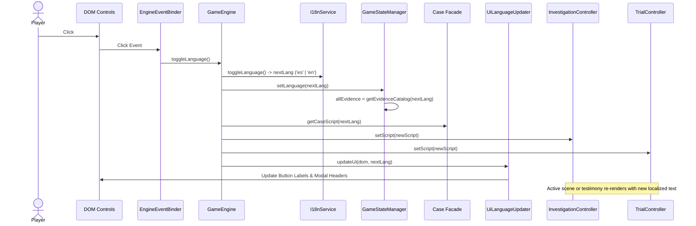

# Language Switching Flow

End-to-end trace when the user toggles the game language between Spanish and English.

## Trigger

- User clicks the language toggle button in the top HUD (`#btn-lang-toggle`).
- User clicks the language toggle button in the title splash card (`#btn-lang-splash`).
- Page loads with URL query parameter (e.g. `?lang=en`).

## Sequence of Operations

## State & Side Effects

1. **`i18n.currentLanguage`**: Updated to `'es'` or `'en'`.
2. **`gameState.language`**: Updated to match active locale.
3. **`gameState.allEvidence`**: Re-indexed with localized item names and descriptions.
4. **`GameEngine.script`**: Replaced with the corresponding localized script tree.
5. **DOM Elements**: Navigation buttons (`Examinar`/`Examine`, `Hablar`/`Talk`, etc.), HUD banner titles, modal headers, and tooltip placeholders update instantly.
