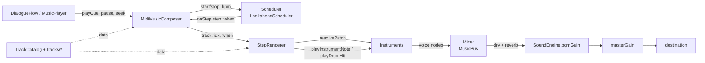
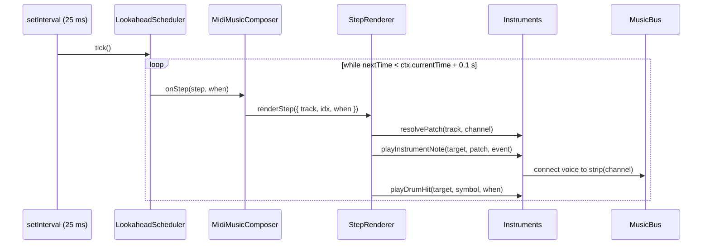
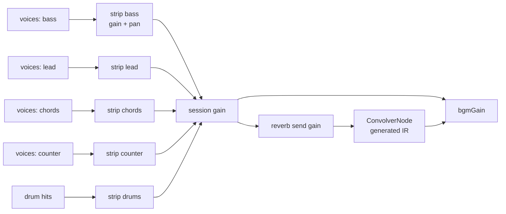

# Plan: Instrument Palette for the Procedural Soundtrack

Status: **IMPLEMENTED**. Scope: [[src/audio/index.ts]] and its callers. Current design: [[docs/architecture/audio-system.md]].

Decisions taken with the implementation:

1. `chip_bass`, `chip_lead`, and `chip_pad` stay the defaults. A track with no `instruments` field, including `cross_exam_presto`, sounds like the old tracker.
2. Reverb is a property of the patch, not of the track. Chip voices, bass, and drums send nothing. Other patches send at most about 0.2.
3. The jukebox does not list instruments.

Existing melodies were not rewritten with `HOLD`. Note attacks stay where they were. Sustained patches that set `legacyLengthBeats` keep a ring close to the old channel length; piano, guitar, marimba, and the electric piano last one step unless a later edit adds `HOLD`.

## 1. Problem

Every composition plays through the same three voices hardcoded in [[src/audio/Private/MidiMusicComposer.ts]] `playTrackVoices`: triangle bass, square lead with vibrato, sawtooth pad (the "strings" sound). A `TrackDefinition` carries only notes, so a track cannot choose a timbre, a note length or a dynamic. All voices share one proportional envelope. Notes play at `ctx.currentTime` from a `setInterval` callback, so timing jitters with the browser's timer.

## 2. Goals and non-goals

Goals:
- Each track picks an instrument per channel; untouched tracks sound **exactly** as they do today.
- About 15 synthesized instruments (piano, brass, marimba, guitar, accordion, organ, flute, upright bass, string pad…) plus Latin percussion.
- Sample-accurate timing, stereo placement, a shared reverb.
- Composers can hold notes, add a fourth melodic line, and accent notes.

Non-goals:
- No audio files, SoundFonts or samples ([[docs/lessons-learned/zero-asset-procedural-audio.md]]). Everything is oscillators, noise and buffers computed at runtime.
- No change to `BgmCue`, dialogue cue rules, aliases, `silence`, or the jukebox contract.
- No AudioWorklet (it would need a separate module file and build step; not needed for these algorithms).

## 3. Target architecture



Three new deep modules inside `src/audio/Private/`, each with an `index.ts` facade and a `Private/` folder (GUIDELINES: nested deep modules). Only files in `src/audio/Private/` import their facades. Nothing outside `src/audio/` sees them; the public facade [[src/audio/index.ts]] does not change.

| Module | Owns | Knows nothing about |
|---|---|---|
| `Scheduler/` | Wall-clock timer, lookahead window, audio-clock time of each step | Tracks, notes, instruments |
| `Instruments/` | Patch data, synthesis algorithms, drum kit, per-context caches (waves, noise, plucked buffers) | Tracks, steps, BPM |
| `Mixer/` | Channel strips (gain + pan), reverb send, per-playback session fade, voice cap | Notes, patches |
| `MidiMusicComposer` (existing) | Track state: current/queued track, step, BPM, aliases, pause/seek/snapshot | Synthesis details |
| `StepRenderer` (new, composer helper) | Reads one step of a track, turns notation into `NoteEvent`s, picks the patch | Timing, node graphs |

### 3.1 Where the data lives

| Data | Location | Shape |
|---|---|---|
| Notes, BPM, length (unchanged) | `src/audio/Private/tracks/*.ts` | `TrackDefinition` |
| Instrument choice per track | same `TrackDefinition`, new optional `instruments` field | `Partial<Record<ChannelName, InstrumentId>>` |
| Fourth melodic line | new optional `counter` array | `NoteEntry[]` |
| Accents | new optional `accents` | `Partial<Record<ChannelName, number[]>>`, `0..1` gain multipliers, `length` entries |
| Hold marker | inside any note array | `HOLD = -1` (constant in `tracks/Notation.ts`) |
| Instrument ids and channel names | [[src/types/Private/audio.ts]] | `InstrumentId`, `ChannelName` string unions |
| Patch definitions | `Instruments/Private/PatchLibrary*.ts` | `InstrumentPatch` (below), a `Record<InstrumentId, InstrumentPatch>` |
| Channel defaults | `Instruments/Private/PatchLibrary.ts` | `DEFAULT_INSTRUMENTS: Record<ChannelName, InstrumentId>` = today's voices |
| Drum symbols | `Instruments/Private/DrumKit.ts` | `DRUM_SYMBOLS` (exported through the facade; tests validate against it instead of a hardcoded set) |
| Per-context caches | `WeakMap<BaseAudioContext, …>` inside `Waveforms`, `NoiseSource`, `PluckedString`, `MusicBus` | Rebuilt automatically when tests or `SoundEngine.init` pass a new context |

Type additions:

```ts
// src/types/Private/audio.ts
export type ChannelName = 'bass' | 'lead' | 'chords' | 'counter';
export type InstrumentId =
  | 'chip_bass' | 'chip_lead' | 'chip_pad'                 // today's voices, bit-for-bit
  | 'pulse_lead_12' | 'pulse_lead_25'                      // NES duty cycles
  | 'piano' | 'epiano' | 'marimba' | 'nylon_guitar'
  | 'upright_bass' | 'brass' | 'mariachi_trumpet' | 'flute'
  | 'accordion' | 'organ' | 'string_pad' | 'orchestra_hit';

export interface TrackDefinition {
  bpm: number;
  length: number;
  bass?: NoteEntry[];
  lead?: NoteEntry[];
  chords?: NoteEntry[];
  counter?: NoteEntry[];
  drums?: string[];
  instruments?: Partial<Record<ChannelName, InstrumentId>>;
  accents?: Partial<Record<ChannelName, number[]>>;
}
/** 0 = rest, -1 = hold the previous note one more step, >0 = MIDI note. */
export type NoteEntry = number | number[];
```

Patch shape (internal to `Instruments/`):

```ts
interface InstrumentPatch {
  layers: OscLayer[];            // one or more oscillators per note
  amp: AmpEnvelope;              // { kind: 'legacy' } | { kind: 'adsr', a, d, s, r }
  filter?: FilterEnvelope;       // { type, base, peak, attack, decay, q }
  pitch?: { scoopCents: number; scoopSec: number };        // brass attack
  vibrato?: { rateHz: number; depthCents: number; delaySec: number };
  tremolo?: { rateHz: number; depth: number };             // accordion bellows
  transient?: { gain: number; filterFreq: number; sec: number }; // hammer, breath, pick noise
  synthesis?: 'subtractive' | 'fm' | 'plucked';            // default subtractive
  fm?: { ratio: number; index: number; indexDecaySec: number };
  gain: number;
  pan: number;                   // -1..1, applied by the channel strip
  reverbSend: number;            // 0..1
  legacyLengthBeats?: number;    // fixed length when no HOLD follows (today's 0.675 / 0.81 / 0.54 beats)
}
interface OscLayer { wave: OscillatorType | 'pulse12' | 'pulse25' | 'organ'; gain: number; detuneCents?: number; octave?: number }
```

### 3.2 How the parts interact at runtime



1. `playTrack` → composer resets step, asks `MusicBus` for a new **session** (fresh session gain), starts the scheduler with the track BPM.
2. Each scheduler tick schedules every step whose time falls in the next 100 ms at its exact audio-clock time `when`.
3. `StepRenderer` reads `bass/lead/chords/counter/drums[idx]`. For a note it computes the length (§4.3), multiplies gain by `accents[channel][idx] ?? 1`, resolves the patch and calls `playInstrumentNote`. `HOLD` and `0` produce nothing.
4. `Instruments` builds the voice graph starting at `when` and connects it to the channel strip returned by `MusicBus.strip(channel)`.
5. `stop()` / track change: scheduler stops; `MusicBus.endSession()` ramps the session gain to 0 over 30 ms and disconnects it, so the ≤100 ms of already-scheduled notes do not leak into the next track. The reverb tail rings out naturally.
6. `pause()`: scheduler stops, session stays; notes already scheduled finish. `resumePaused()`: scheduler restarts at `ctx.currentTime + 0.02` from the kept step. `seekToStep()`: sets step; the next tick schedules from it.
7. `getPlaybackSnapshot()` reports the **audible** step, not the next scheduled one: `scheduledStep - ceil((nextTime - ctx.currentTime) / stepSec)`, clamped ≥0 and wrapped by length. The jukebox progress bar keeps working unchanged.
8. Mute is unchanged: `SoundEngine.masterGain` sits after the bus. `canPlay()` keeps gating scheduling.

Mixer graph:



Per-voice reverb amount: each voice connects to its strip dry and, when `reverbSend > 0`, also through a small gain node to the bus's reverb input. Legacy patches have `pan: 0, reverbSend: 0`, so the old sound passes through unity gains only.

## 4. Algorithms

### 4.1 Lookahead scheduling ("A Tale of Two Clocks", C. Wilson)
- `setInterval` every **25 ms** (wall clock, only wakes the loop).
- Schedule window **100 ms**: `while (nextTime < ctx.currentTime + 0.1) { onStep(step, nextTime); nextTime += 60 / bpm / 4; step++; }`.
- If the tab was throttled and `nextTime` fell behind `ctx.currentTime - 0.05`, jump `nextTime` to `ctx.currentTime` instead of firing a burst of late notes.
- All synthesis calls receive `when`; none reads `ctx.currentTime` for note start.

### 4.2 Synthesis techniques (all zero-asset)

| Technique | Implementation | Used by |
|---|---|---|
| Legacy envelope | Current curve: 0.0001 → level at +12 ms → level×0.72 at 45% → 0.0001 at end, linear | `chip_bass`, `chip_lead`, `chip_pad` |
| ADSR | `setValueAtTime` + `linearRamp` for attack, `setTargetAtTime` for decay to sustain, `cancelAndHold`-free release via a scheduled `setTargetAtTime(0.0001, end, r/4)`; stop osc at `end + r` | all new patches |
| Filter envelope | Biquad lowpass `frequency`: base → peak over `attack` (`exponentialRamp`), → base over `decay` | brass (opens), piano/bass/guitar (closes) |
| Pulse waves | `createPeriodicWave` with Fourier coefficients of a duty-`d` pulse: `real[n] = (2/(nπ))·sin(nπd)`, n=1..64 | `pulse_lead_12`, `pulse_lead_25`, accordion |
| Organ | `createPeriodicWave` from drawbar amplitudes on harmonics 1,2,3,4,6,8 | `organ` |
| Unison/detune | N layers with `detune` ±7–12 cents, gain ÷ √N | `string_pad`, accordion (musette), brass |
| Pitch scoop | `detune` param from `-scoopCents` → 0 over `scoopSec` | `brass`, `mariachi_trumpet` |
| Vibrato / tremolo | LFO oscillator → gain → `detune` (cents) or → amp gain; LFO depth ramps in after `delaySec` | lead, flute, trumpet / accordion |
| 2-op FM | Modulator osc (`freq·ratio`) → gain (`freq·index`, decaying over `indexDecaySec`) → carrier `frequency` | `epiano` (ratio 1 + short ratio-14 tine), `marimba` (ratio 4, fast decay) |
| Karplus-Strong | Precompute into an `AudioBuffer` per MIDI note (≈1.2 s): ring buffer of `round(sr/f)` noise samples, `y[n] = decay·0.5·(y[n−N] + y[n−N−1])`; cache in `WeakMap<ctx, Map<midi, buffer>>`; play with `AudioBufferSourceNode`. A `DelayNode` feedback loop is **not** used: Web Audio clamps cyclic delays to ≥128 samples, so notes above ~344 Hz would be impossible | `nylon_guitar`, optionally `upright_bass` |
| Noise transient | One shared 1 s white-noise buffer per context, started at a random offset with a duration (replaces per-hit `createBuffer`) | piano hammer, flute breath, drums |
| Reverb IR | Generated once per context: 2 channels × 1.8 s, `noise · e^(−t/0.45)` with a 1 ms fade-in; `ConvolverNode.normalize = true` | Mixer |

### 4.3 Note length from notation
- A note followed by `k` consecutive `HOLD` entries lasts `(k + 1) · stepSec`, minus a 10% gap (legato patches: 0%). Scan forward, wrapping at `track.length`.
- A note with no `HOLD` after it uses `patch.legacyLengthBeats · 60 / bpm` when the patch defines it (today's fixed lengths), else one step. This keeps every existing track identical.
- Chords (`number[]`) hold as a block; `HOLD` holds the whole chord.

### 4.4 Voice cap
`MusicBus` counts live voices (increment on start, decrement on the source's `onended`). Above **48**, new `chords`/`counter` notes are skipped first, then `lead`; bass and drums always play.

## 5. Drum kit additions

Existing `K S H O C P` move unchanged to `DrumKit.ts` (kick sweep switched to `exponentialRamp` only if an A/B listen prefers it; default keeps linear). New symbols:

| Symbol | Hit | Synthesis |
|---|---|---|
| `X` | Clap | Three 8 ms bandpassed (1.2 kHz) noise bursts 10 ms apart + 120 ms tail |
| `R` | Rimshot | Square 1.7 kHz, 15 ms + 5 ms highpassed noise |
| `T` / `M` | Low / mid tom | Sine 140→80 Hz / 220→130 Hz, exponential, 180 ms |
| `B` | Cowbell | Squares at 540 + 800 Hz through bandpass 2.6 kHz, 250 ms decay |
| `G` | Güiro | Noise through bandpass 3 kHz, gain modulated by a 28 Hz square LFO, 180 ms |
| `Y` | Timbal | Triangle 420 Hz + highpassed noise ring, 220 ms |

Compound hits keep working (`'KX'`, `'KB'`).

## 6. Files

### 6.1 Create

| File | Responsibility |
|---|---|
| `src/audio/Private/Scheduler/index.ts` | Facade: `LookaheadScheduler`, `StepHandler` type |
| `src/audio/Private/Scheduler/Private/LookaheadScheduler.ts` | `start({ ctx, bpm, fromStep })`, `stop()`, `setBpm()`, `audibleStep()`; runs the §4.1 loop and calls `onStep(step, when)` |
| `src/audio/Private/Mixer/index.ts` | Facade: `MusicBus` |
| `src/audio/Private/Mixer/Private/MusicBus.ts` | Per-context bus: channel strips, `beginSession()`, `endSession()`, `strip(channel)`, `reverbInput()`, voice counter |
| `src/audio/Private/Mixer/Private/ReverbImpulse.ts` | Builds and caches the generated impulse response |
| `src/audio/Private/Instruments/index.ts` | Facade: `playInstrumentNote(target, patch, event)`, `playDrumHit(target, symbol, when)`, `resolvePatch(track, channel)`, `midiToFreq`, `DRUM_SYMBOLS`, `NoteEvent`, `VoiceTarget` |
| `…/Instruments/Private/InstrumentPatch.ts` | `InstrumentPatch`, `OscLayer`, envelope types |
| `…/Instruments/Private/PatchLibrary.ts` | `chip_*` and `pulse_*` patches, `DEFAULT_INSTRUMENTS`, merged `PATCHES` map |
| `…/Instruments/Private/PatchLibraryKeys.ts` | piano, epiano, marimba, organ, nylon_guitar, upright_bass |
| `…/Instruments/Private/PatchLibraryWinds.ts` | brass, mariachi_trumpet, flute, accordion, string_pad, orchestra_hit |
| `…/Instruments/Private/SubtractiveVoice.ts` | Layers → filter → amp for one note (absorbs today's `playSingleVoice` / `playChord`) |
| `…/Instruments/Private/FmVoice.ts` | 2-operator FM voice |
| `…/Instruments/Private/PluckedString.ts` | Karplus-Strong buffer render + cache + playback |
| `…/Instruments/Private/Envelopes.ts` | Legacy, ADSR, filter envelope, pitch scoop, LFO helpers |
| `…/Instruments/Private/Waveforms.ts` | Cached `PeriodicWave` factory (pulse duties, organ) |
| `…/Instruments/Private/NoiseSource.ts` | Shared noise buffer per context, `playNoise({ ctx, dest, when, sec, filter })` |
| `…/Instruments/Private/DrumKit.ts` | `K S H O C P` + dispatcher, `DRUM_SYMBOLS` |
| `…/Instruments/Private/LatinPercussion.ts` | `X R T M B G Y` |
| `src/audio/Private/StepRenderer.ts` | One step → `NoteEvent`s: hold scan, accents, patch resolution, drum dispatch |
| `src/audio/Private/tracks/Notation.ts` | `HOLD` constant and small helpers for track authors (e.g. `repeat(pattern, n)`) |
| `tests/audio/LookaheadScheduler.test.ts` | Steps land on exact multiples of `stepSec` even with irregular timer advances; throttled tab does not burst |
| `tests/audio/Instruments.test.ts` | Every `InstrumentId` resolves and renders without throwing; a track without `instruments` builds the same node graph as one naming the defaults explicitly; unison layers count matches the patch |
| `tests/audio/StepRenderer.test.ts` | A held note lasts longer than an unheld one; `HOLD` wraps across the loop point; accent lowers gain relative to an unaccented step |
| `tests/audio/MusicBus.test.ts` | `endSession` silences scheduled notes of the old track; voice cap drops chords before bass |

### 6.2 Modify

| File | Change |
|---|---|
| [[src/types/Private/audio.ts]] | `ChannelName`, `InstrumentId`, `counter`, `instruments`, `accents`; document `HOLD` on `NoteEntry` |
| [[src/types/index.ts]] | Export the new types |
| [[src/audio/Private/MidiMusicComposer.ts]] | Replace `setInterval` loop with `LookaheadScheduler`; delegate `playTrackVoices` to `StepRenderer`; open/close `MusicBus` sessions; snapshot uses audible step; `playNote(midi, durationSec, instrument?)` replaces the `NoteOptions` form. Public API otherwise unchanged. Stays < 200 lines |
| [[src/audio/Private/SynthVoiceSynthesizer.ts]] | **Delete**; content moves into `Instruments/` (`SubtractiveVoice`, `Envelopes`, `DrumKit`) |
| [[src/audio/Private/tracks/*.ts]] | Phase 6 only: add `instruments`, `HOLD`, `counter`, new drum symbols, track by track |
| [[tests/fakes/FakeAudioContext.ts]] | `currentTime` derived from faked `Date.now()`; add `createPeriodicWave`, `createStereoPanner`, `createConvolver`, `detune` param, `onended`, `setTargetAtTime`, `cancelScheduledValues`, `start(when, offset, duration)` |
| [[tests/audio/MidiMusicComposer.test.ts]] | Step assertions via `getPlaybackSnapshot()`; drum validation from `DRUM_SYMBOLS`; allow `HOLD` in note range checks; new `playNote` signature |
| [[tests/audio/TruthTrack.test.ts]], `FinalConfrontationTrack`, `CareoTrack`, `TerrazaBarTrack` tests | Accept `HOLD` and the new drum symbols through shared constants |
| [[docs/architecture/audio-system.md]] | Replace "Channels & Voice Synthesis" with Scheduler / Instruments / Mixer sections, instrument table, notation rules, invariants (legacy patches are bit-for-bit, audible-step snapshot) |
| [[docs/flows/audio-synthesis-flow.md]] | New per-step sequence (§3.2) |
| [[src/audio/audio.group.md]] | Long description mentions the three nested modules |
| [[docs/live/glossary.md]] | **Patch (Instrumento)**, **HOLD**, **Session (bus)** |
| `.agents/skills/chiptune-music-composer/SKILL.md` | Instrument palette, `HOLD`, `counter`, accents, drum symbols, per-role recommendations |

Unchanged: [[src/audio/index.ts]], `SoundEngine`, `CourtSfx`, `NoveltySfx`, `TrackCatalog`, `SoundtrackPlaylist`, all `src/engine/` callers.

## 7. Phases

Each phase is engine work: tests + lint + `npx fallow audit` before the next. Phases 1–3 must be inaudible; check by A/B in the jukebox.

1. **Timing.** `Scheduler/`, `when` threaded through synthesis, shared noise buffer, fake context clock. Only audible change: steadier rhythm.
2. **Instruments shell.** `Instruments/` with `chip_*` patches reproducing today's voices, `StepRenderer`, `resolvePatch`, delete `SynthVoiceSynthesizer`. Relational test: implicit defaults ≡ explicit defaults.
3. **Mixer.** `MusicBus`, strips, sessions, reverb bus (legacy sends 0), voice cap.
4. **Synthesis + patches.** Envelopes, pulse/organ waves, unison, scoop, FM, Karplus-Strong; the 14 new patches. Audition each on a scratch track in the jukebox, level-match by ear against `chip_lead`.
5. **Notation.** `HOLD`, `counter`, `accents`; new drum symbols.
6. **Migration (content).** One commit per track, using the `chiptune-music-composer` skill. Proposed assignment (after audition, only the `cross_exam_*` rows, `truth` and `archivo` were kept; the rest were reverted to the chip voices):

| Track | bass | lead | chords | counter / drums |
|---|---|---|---|---|
| `trial` | upright_bass | brass | string_pad | crash accents stay |
| `cross_exam_moderato` | chip_bass | pulse_lead_25 | epiano | — |
| `cross_exam_allegro` | chip_bass | pulse_lead_12 | chip_pad | rimshots `R` |
| `cross_exam_final` | piano (16th bass) | chip_lead | brass stabs | — |
| `cross_exam_careo` | piano | pulse_lead_25 | piano | — |
| `objection` | chip_bass | mariachi_trumpet | brass | orchestra_hit on the downbeat |
| `pursuit` | upright_bass | mariachi_trumpet | nylon_guitar | timbales `Y` |
| `truth` | piano | flute | piano (ostinato) | string_pad counter in bars 17–20 |
| `investigation` | upright_bass | pulse_lead_25 | epiano | — |
| `investigation_core` | chip_bass | chip_lead | organ | — |
| `restaurante` | upright_bass | flute | nylon_guitar | güiro `G` |
| `callejon_postal` | upright_bass | accordion | marimba | cowbell `B` |
| `casa_clotilde` | chip_bass | string_pad | organ | — |
| `detention_center` | upright_bass | flute | string_pad | — |
| `suspense` | upright_bass | accordion | nylon_guitar | claps `X` |
| `victory` | chip_bass | mariachi_trumpet | brass | marimba counter |
| `kermes` | chip_bass | marimba | accordion | güiro `G` |
| `archivo` | chip_bass | flute | epiano | — |
| `cross_exam_grave` | upright_bass | chip_lead | string_pad | — |
| `terraza_bar` | upright_bass | epiano | nylon_guitar | — |

   Keep at least the cross-examination family recognisably chiptune: the square lead is part of the game's identity.
7. **Docs.** §6.2 doc rows; lessons-learned entries for anything surprising (e.g. the 128-sample cyclic delay limit).

## 8. Risks

| Risk | Mitigation |
|---|---|
| CPU on low-end/mobile (unison × chords × FM) | Voice cap; unison ≤3; FM only 2 ops; cached waves/buffers |
| Loudness jumps between tracks | Level-match patches in phase 4; bus gain stays 0.65 |
| Reverb muddies 16th-note tracks | Default sends ≤0.2; zero on bass and drums |
| `StereoPannerNode` missing on old Safari | Strip falls back to plain gain |
| Fake timers vs audio clock in tests | Fake `currentTime` follows faked `Date.now()`; assert on snapshot, not internal `step` |
| Scheduled notes leaking after `stop()` | Session gain fade (§3.2 step 5) |
| GUIDELINES (≤3 params, ≤30-line functions, ≤200-line files) | Param objects (`VoiceTarget`, `NoteEvent`); patch library split in three files |

## 9. Open decisions

Resolved in the implementation (see the status block at the top).
