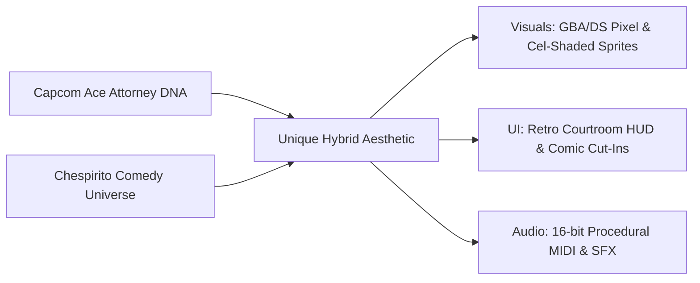
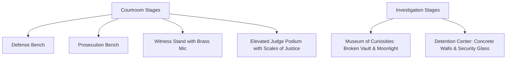
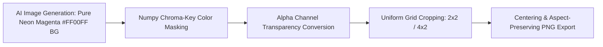

# Artistic & Audio Direction Specification

Comprehensive aesthetic, visual, and acoustic design guidelines for **El Chapulín Colorado: Ace Attorney**, detailing character design, environmental staging, UI architecture, asset extraction pipelines, and procedural audio synthesis.

---

## 1. Core Aesthetic Philosophy

The artistic direction bridges two iconic pop culture universes:
1. **The Capcom Ace Attorney Legacy**: 2D GBA/Nintendo DS visual novel drama, high-contrast cel-shaded sprite art, extreme expressive emotional swings, dynamic camera shifts, full-screen shouting cut-ins, and driving chiptune music.
2. **The Chespirito / El Chapulín Colorado Universe**: Whimsical 1970s Mexican television satire, slapstick physical comedy, absurd superhero subversions, vibrant primary color palettes, and iconic comedic timing.

### Aesthetic Pillars
- **Melodrama Meets Slapstick**: Courtroom litigation is treated with life-or-death seriousness by the system, while the character motives, evidence, and actions remain delightfully absurd.
- **Uncompromised Retro Authenticity**: Clean pixel rendering (`image-rendering: pixelated`), fixed 16:9 staging, and zero asset compression artifacts.
- **Dynamic Pacing**: Instant text-advance feedback, synchronized typewriter chirps, screen shakes on impacts, and screen flashes on contradictions.

---

## 2. Character Visual Direction & Spritesheet Matrix

Characters are rendered in high-definition 2D Capcom sprite style with crisp dark contour outlines, expressive facial anatomy, and solid primary color coding.

### A. El Chapulín Colorado (Defense / Defendant)
* **Visual Motifs**: Scarlet-red superhero cowl and bodysuit, bright yellow heart chest crest with red "CH" typography, antennae with flexible physics, yellow wings/capelet.
* **Palette**: Crimson Red (`#C0392B`), Canary Yellow (`#F1C40F`), Warm Flesh (`#F5CBA7`), Charcoal Outline (`#1A1A1A`).
* **Sprite Poses** ([[assets/chapulin_sprites_clean_1787540691618.jpg]]):
  * `chapulin_idle`: Confident superhero/defense stance with hands resting on hips (standalone character sprite with zero baked furniture).
  * `chapulin_slam`: Double-palmed desk slam pose with hands positioned downwards to align with foreground furniture.
  * `chapulin_point`: Iconic Phoenix Wright-style horizontal finger thrust with twitching antennae.
  * `chapulin_panic`: Wide-eyed comic sweat-storm with hands clutching cowl in despair.

### B. Super Sam (Prosecutor)
* **Visual Motifs**: Capitalist superhero rival in sharp navy suit with US flag lapels/cape, blonde pompadour, heavy burlap sack stamped with green `$`.
* **Palette**: Deep Navy (`#1B263B`), Star Spangled Red/White/Blue (`#E63946`, `#FFFFFF`, `#1D3557`), Dollar Green (`#2A9D8F`), Gold (`#E9C46A`).
* **Sprite Poses** ([[assets/supersam_sprites.png]]):
  * `supersam_idle`: Smug half-smile clutching the money bag over his shoulder.
  * `supersam_slam`: Double-palm desk slam with the cash sack slung over the shoulder. Same costume as idle/point (off-center `$`, gold SS belt, red trunks, flag cape). Contact silhouette matches other slam poses: A-frame arms and a transparent waist notch so the bench covers the waist instead of the torso painting onto the wood.
  * `supersam_point`: Arrogant finger-pointing objection shout ("Time is money!").
  * `supersam_sweat`: Collar-tugging grimace with sweat beads. Same navy bodysuit, white `$`, gold SS belt, red trunks, flag cape, and red/white cravat as idle. A new pose sheet that is not locked to idle identity will default to Chespirito yellow/green Super Sam.
  * `supersam_breakdown`: Screaming recoil as dollar bills scatter into the air.

### C. El Tripaseca (Witness & Culprit)
* **Visual Motifs**: Classic 1930s/70s Mexican mobster, brown fedora, pinstriped double-breasted suit, thin pencil mustache, smoldering cigar.
* **Palette**: Muted Brown (`#5C4033`), Cream Pinstripes (`#D7CCC8`), Tobacco Ash (`#8D6E63`), Off-White (`#F5F5DC`).
* **Sprite Poses** ([[assets/tripaseca_sprites.png]]):
  * `tripaseca_smug`: Relaxed swagger puffing ringlets of cigar smoke.
  * `tripaseca_sweat`: Nervous sideways glance with sweat beads forming.
  * `tripaseca_panic`: Collar-tugging grimace under relentless questioning.
  * `tripaseca_breakdown`: Uncontrollable bawling while biting and crushing his fedora.

### D. El Juez (The Presiding Judge)
* **Visual Motifs**: Elderly venerable magistrate, bald crown with side-fringe, bushy snow-white beard, traditional black judicial robes, wooden gavel.
* **Sprite Poses** ([[assets/judge_sprites.png]]): `judge_neutral`, `judge_gavel`, `judge_shock`, `judge_thinking`.

### E. Doña Florinda (Museum Curator / Witness)
* **Visual Motifs**: Haughty matriarch in emerald dress, pink/brown vintage hair curlers, floral apron, folding paper fan.
* **Sprite Poses** ([[assets/witness_florinda_sprites.png]]): `florinda_idle`, `florinda_angry`, `florinda_crying`, `florinda_shock`.

---

## 3. Environmental Staging & Color Scripts

### 1. Courtroom Environments (`bg_defense.jpg`, `bg_courtroom.jpg`, `bg_witness.jpg`, `bg_judge.jpg`)
* **Palette**: Mahogany wood (`#3D2314`), Gilded Brass (`#C5A059`), Classical Stone Grey (`#7F8C8D`), Warm Amber Lighting (`#F39C12`), Burgundy Velvet (`#581825`).
* **Atmosphere**: Grand judicial hall with classical arches, elevated witness podium, and prominent Scales of Justice wall carvings.
  * `bg_defense.jpg`: Close-up eye-level perspective of the defense stand's back wall with rich mahogany wainscoting and vertical wood planks.
  * `bg_courtroom.jpg`: Close-up eye-level perspective of the prosecution stand's back wall, matching the defense scale and horizon line while featuring a central carved wooden arch with golden Scales of Justice crest, illuminated pilasters, and elegant burgundy velvet side drapes with gold tiebacks (solid wood wall, no windows).

### 2. Museum of Curiosities (`bg_museum.jpg`)
* **Palette**: Rich Burgundy Carpeting (`#78281F`), Night Blue Moonlight (`#1B4F72`), Ornate Walnut (`#4A235A`), Caution Gold (`#F4D03F`).
* **Atmosphere**: Atmospheric crime scene featuring a moonlit arched window, shattered glass showcase, scattered pills, medieval armor, and police perimeter tape.

### 3. Detention Center (`bg_detention.jpg`)
* **Palette**: Cold Concrete Grey (`#34495E`), Industrial Steel (`#2C3E50`), Dim Barred Sunlight (`#BDC3C7`).
* **Atmosphere**: Stark visitor booth with thick security glass, metallic intercom grill, and wall-mounted phone.

---

## 4. UI Architecture & Graphical Assets

| UI Element | Visual Design & Specifications | Source Asset |
|:---|:---|:---|
| **Dialogue Frame** | Translucent navy panel (`rgba(10, 20, 45, 0.92)`), double gold rim (`#E0A800`), crimson speaker nameplate (`#C0392B`), animated gold arrow ticker. | [[style.css#Dialogue Box]] |
| **Cut-in Banners** | High-energy spiky starburst explosions with bold 3D typography (`¡PROTESTO!`, `¡UN MOMENTO!`, `¡TOMA ESO!`, `¡CULPABLE!`, `¡INOCENTE!`). | [[assets/ui_objection_cutins.png]] |
| **Health Penalty Bar** | Retro segmented display with 5 luminous green exclamation points (`! ! ! ! !`), flashing red on penalty strikes. | [[style.css#Health Bar]] |
| **Court Record Cards** | Gold-bordered dark slate tiles with centered pixel item icons and glowing cyan selection highlights (`#00FFCC`). | [[style.css#Court Record Modal]] |
| **Examine Tooltip** | Sleek dark tooltip (`🔍 Inspeccionar`) following cursor with subtle highlight outlines only on hover. | [[style.css#Examine Tooltip]] |
| **Witness Podium** | Classical mahogany witness stand with antique gilded brass microphone overlay in foreground. | [[assets/court_podium.png]] |
| **Defense Bench** | Wide mahogany defense desk. Staged as an aspect-preserved close-up crop whose top edge is the stage's hand-contact line (not a full-bleed squashed strip). Slam palms paint over the counter. Geometry comes from the `bench-*` stage frames, never from pixel offsets. | [[assets/court_bench.png]] |

---

## 5. Asset Extraction & Processing Pipeline

All visual assets follow a strict chroma-key extraction workflow implemented in [[process_assets.py]]:

### Chroma-Key Invariants
1. **Background Chroma**: Pure neon magenta pink (`R > 160, G < 110, B > 160, |R - B| < 75`).
2. **Palette Restriction**: No pink/magenta tones permitted in foreground character outfits or props to prevent keying artifacts.
3. **No Image Stretching**: Handled via `object-fit: contain` and integer scaling across all viewports.

---

## 6. Audio Architecture & Musical Direction

All sound effects and soundtrack compositions are synthesized in real-time at runtime via the **Web Audio API** without external audio file downloads ([[src/audio/Private/SoundEngine.ts]], [[src/audio/Private/MidiMusicComposer.ts]]).

### A. Procedural Sound Effects (SFX)
* **Gavel Bang**: Dual-layer impact combining a 160Hz to 30Hz exponential pitch-dropped triangle wave with an 800Hz bandpass wood-crack noise burst.
* **Desk Slam**: Heavy 120Hz sawtooth drop filtered through a 500Hz low-pass resonance.
* **Objection Whoosh**: 350Hz to 4500Hz bandpass whip noise sweep followed by a sharp 4-voice sawtooth chord sting.
* **Realization Chime**: Sparkling 4-tone ascending sine arpeggio (880Hz, 1174Hz, 1760Hz, 2349Hz).
* **Chipote Squeak**: Ascending-then-descending sine frequency chirp (680Hz -> 1550Hz -> 480Hz).
* **Chicharra Buzzer**: Dual-tone antique vehicle squeeze-horn sawtooth blast (Bb4 -> F4).
* **Typewriter Chirp**: High-pitched 540Hz square wave chirp per dialogue character.

### B. Procedural MIDI Soundtrack Catalog
The procedural tracker drives 4 concurrent polyphonic channels: **Lead Synth** (Square wave), **Harmony/Chords** (Detuned Sawtooth pad), **Bass** (Punchy Triangle wave), and **Drums** (Filtered Noise & Sine Kick).

| Track ID | Track Name | Tempo (BPM) | Musical Mood & Composition Style |
|:---|:---|:---|:---|
| `trial` | *El Juicio Comienza* | 124 BPM | Driving courtroom anticipation; steady walking bass with mystery arpeggios. |
| `cross_exam_moderato` | *Interrogatorio Moderato* | 118 BPM | Classic 16-bit detective questioning groove; rhythmic staccato bass and clicking hi-hats. |
| `cross_exam_allegro` | *Interrogatorio Allegro* | 144 BPM | High-octane courtroom confrontation; rapid 16th-note bassline and urgent lead hooks. |
| `objection` | *¡No Contaban con mi Astucia!* | 148 BPM | Heroic Turnabout anthem blending Chespirito's iconic brass fanfare into Capcom rock beats. |
| `pursuit` | *¡Que No Panda el Cúnico!* | 156 BPM | Climax Cornered theme; escalating chord progressions pushing the culprit to breakdown. |
| `investigation` | *Museo de Curiosidades* | 112 BPM | Jaunty mystery groove; syncopated walking bass with vibraphone-like synth flourishes. |
| `suspense` | *La Verdad al Descubierto* | 96 BPM | Dark pulsing revelation drone with clock-ticking hi-hat tension. |
| `victory` | *¡Síganme los Buenos!* | 136 BPM | Triumphant brass celebration fanfare celebrating a "Not Guilty" verdict. |
