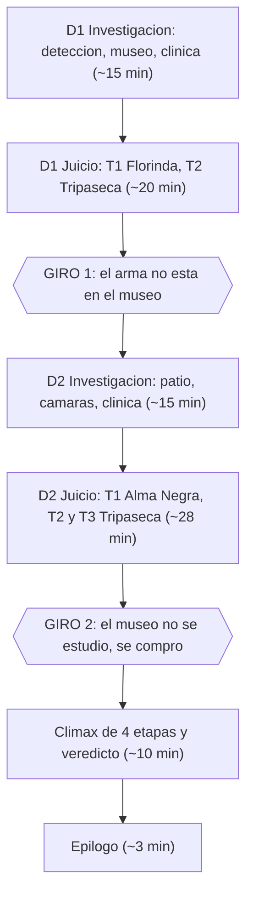

# Caso 1: El Juicio del Chapulín Colorado — La Chicharra de Oro

> **Estado: implementada.** El guion, la mecánica, las pruebas y el arte de §18 viven ya en [[src/case/case1/index.ts]] y [[process_case1_assets.py]]. La versión anterior (una jornada, tres contradicciones en línea recta) sigue en el historial de git. Pendiente el recorrido cronometrado de §22. Las cajas de hotspots y de los dos señalamientos están medidas sobre los WebP de 960 × 540 ([[tests/case/Case1Hotspots.test.ts]], [[docs/lessons-learned/present-point-cover-crop.md]]). Esta reescritura ejecuta [[docs/plans/case-1-reconstruccion-narrativa.md]] con tres ajustes aprobados por el autor: **90 minutos** en lugar de 70–85, **tres testigos distintos en el estrado** en lugar de uno solo recurrente, y un **Acta de Personajes** (mecánica nueva, §6).

Configurado en [[src/case/case.group.md]]. Dirección de arte: [[docs/specs/artistic-direction.md]].

---

## 1. Objetivo y reglas de diseño

Caso 1 es el **segundo episodio en orden de juego**, después del tutorial (Caso 0) y antes del Caso 2. Su trabajo es enseñar el juego completo —dos jornadas, aplazamiento, presión que desbloquea declaraciones, examen a detalle, señalamiento sobre lámina y clímax multietapa— sin la densidad de los Casos 3 y 4.

| Regla | Valor |
|---|---|
| Duración objetivo | **~90 minutos** (comprobar jugando). Por encima del Caso 0 (~40) y del Caso 2 (~60–75); por debajo del Caso 3 (~120). |
| Jornadas | 2 investigaciones + 2 juicios. `adjournment` sin `next` (no hay día 3). |
| Testimonios | 5, repartidos 2 / 3. |
| Testigos en el estrado | 3 distintos (Doña Florinda, Alma Negra, El Tripaseca ×3). |
| Locaciones de investigación | 6 (3 por jornada). |
| Giros | 2, ambos al cierre de una jornada de juicio. |
| Entradas del Acta (pruebas) | 14. Doce se presentan; `insignia_abogado` y `plano_pasillo` se consultan y no se presentan (§5, §16). |
| Penalizaciones | 5 puntos por jornada; se restauran al aplazar. |

**Regla de legibilidad.** El caso es enrevesado por acumulación, no por ofuscación: cada jornada presenta una hipótesis clara, la demuestra, y la demostración vuelve falsa a la hipótesis anterior. En ningún momento el jugador debe adivinar; siempre tiene en el Acta la pieza que necesita, y siempre el Juez dice en voz alta qué pregunta está abierta.

**Regla de sospecha.** La defensa nunca abre señalando personas. Ataca hechos. El paso de "aquí hubo otra persona" a "esa persona es el testigo" está **mecanizado**: el Juez exige a la defensa que presente una ficha del **Acta de Personajes** antes de permitirle continuar (§6, §13, §15). Don Ramón **no** verbaliza que nunca antes acusó a nadie — ese recurso ya se gastó en el Caso 3 y repetirlo lo vuelve tic.

---

## 2. Sinopsis y verdad del autor

### 2.1 Lo que la fiscalía cree

La noche del 21 de agosto robaron la **Chicharra Paralizadora de Oro** del Museo de las Curiosidades. El velador, **Alma Negra**, apareció con el cráneo fracturado. A las 21:07, el fiscal **Super Sam** detuvo dentro de la sala 2 a **El Chapulín Colorado**, de pie junto al cuerpo y con su **Chipote Chillón** en la mano. Un testigo de paso, el comerciante **El Tripaseca**, declara haberlo visto dar el golpe por la ventana del callejón. El museo estaba cerrado con llave desde las 20:40. Caso resuelto en cinco minutos: *Time is money*.

Lo defiende **Don Ramón**, abogado de banqueta con catorce meses de renta atrasada, asesorado por el propio acusado.

### 2.2 Lo que de verdad pasó

El Tripaseca no estudió el museo: **lo compró**. Pagó por una tarjeta mecanografiada —una *ficha*— que traía seis renglones: la chapa vencida de la puerta de carga, la medida exacta de la rejilla de la sala 2, la ronda escrita del velador copiada palabra por palabra de su propia libreta, dónde conseguir Pastillas de Chiquitolina, en qué noche de la semana a la cámara de seguridad le queda un solo cuadro de rollo, y un renglón final que dice **"servicio de cierre incluido — 5 min"**.

Ese último renglón es un fiscal que cobra por caso cerrado y que esa noche estaría a cinco minutos del museo.

A las 20:40, con el museo ya sellado, Tripaseca tomó una pastilla en el patio de carga, se redujo al tamaño de un ratón —y con él, la bolsa de lona que le acababan de pagar— y entró por la rejilla. Se metió **dentro de la vitrina** por la ranura de ventilación de la base y se sentó a esperar junto a la Chicharra. A las 20:55 se le acabó el efecto: **recuperó su tamaño dentro de la vitrina y la reventó desde adentro con su propio cuerpo**. Por eso el cristal cayó hacia afuera. Por eso quedó de pie sobre el pedestal, con la reliquia en una mano y, en la otra, un saco de moneda metálica a peso completo.

Alma Negra entró corriendo un minuto después. Llegó hasta la vitrina rota, no distinguió a nadie en la oscuridad y se volvió hacia la puerta para pedir ayuda. En ese instante terminó la parálisis de Tripaseca. El golpe vino **desde atrás y desde arriba**, porque Alma le daba la espalda y el hombre que lo dio seguía subido en el pedestal.

**El arma del delito es el soborno.** No la eligió: era lo más pesado que traía encima, y se lo acababan de pagar.

### 2.3 El residuo (deliberado)

Tres cosas salen del Caso 1 sin resolver. Las tres son intencionales y **ninguna se subraya en pantalla**:

1. **Quién dejó la bolsa de lona en el callejón.** Se acredita que el arma fue un saco de moneda y que la bolsa sellada de la fiscalía apareció vacía en el patio de carga. Super Sam no declara y nadie lo obliga.
2. **Qué es "el Tomo Trece".** El Tripaseca lo nombra una sola vez, al derrumbarse. El Juez pregunta qué es eso, Super Sam objeta que es irrelevante para el veredicto, y el Juez **le da la razón**.
3. **Quién escribió la ficha.** Queda en autos como prueba de un tercero no identificado.

Ninguno bloquea el veredicto ni deja sensación de caso a medias: el acusado sale libre, el culpable confiesa, el objeto aparece y las doce pruebas del Acta se usan.

---

## 3. Reparto

| Personaje | Papel | Notas de escritura |
|---|---|---|
| **Don Ramón (Lic. Monchito)** | Defensa (jugador) | Catorce meses de renta. Improvisa, cobra en especie y gana por terquedad. *"¡Con permisito, dijo Monchito!"* |
| **El Chapulín Colorado** | Acusado y asesor legal | Litiga desde el banquillo. Llegó cinco minutos tarde a su propia inocencia. Destroza dos refranes (§17). |
| **Super Sam** | Fiscal | *"Time is money!"* El día 1 sube al estrado **sin su bolsa de dólares al hombro** y nadie lo comenta hasta el giro. **Nunca declara**: su arco se paga en otro episodio. |
| **El Juez** | Juez | Justo, impresionable, y el que enuncia en voz alta la pregunta abierta al final de cada bloque. |
| **El Tripaseca** | Testigo estrella y culpable único | Comerciante: *"compro barato y vendo lo que se deje"*. Habla de todo como si fuera mercancía. Tres testimonios. |
| **Doña Florinda** | Curadora del museo, testigo D1-T1 | Honesta y equivocada. Vio lo que dice que vio. *"¡Chusma, chusma!"* Le duele el museo, no el acusado. |
| **Alma Negra** | Víctima y testigo D2-T1 | Velador con pinta de pirata. Habla en marino: la sala 1 es *"la bodega de proa"*, las horas son *"campanadas"*, y a todos les dice *"grumete"*. Declara en silla de ruedas y vendado. |
| **Profesor Jirafales** | Conferencista invitado (sólo investigación) | Dio la charla de las 20:00 y fue testigo del cierre. Minutario en mano, como siempre. Corrige a Chapulín los refranes. **No sube al estrado.** *"¡¡¡TA-TA-TA-TA-TAAAAAA!!!"* |

**Sin sprite:** el perico histórico de la sala 2 (sólo grazna fuera de cuadro) y el empleado de la farmacia mencionado en la ficha.

---

## 4. Cronología del 21 de agosto

Las horas de autor **no son hechos judiciales**: la columna derecha dice hasta dónde llega el jugador.

| Hora | Hecho real | Alcance para el jugador |
|---|---|---|
| 20:00–20:30 | Conferencia del Profesor Jirafales en la sala 1: *"La Chicharra Paralizadora: mito y metalurgia"*. Cuarenta asistentes con boleto. | D1, museo. Jirafales lo cuenta con minutario. |
| Días antes | Una persona no identificada entra al museo con boleto de visitante en horario normal y **copia a mano la libreta de rondas de Alma Negra**, que cuelga de un clavo en la caseta. Con esos datos prepara la ficha que después vende a Tripaseca. | Se deduce en el clímax, no se muestra. La identidad de quien escribió la ficha queda sin resolver (§2.3). |
| 20:30 | Alguien deja una bolsa de lona sellada de la fiscalía en el callejón de carga. Es el pago. | **Nunca se acredita quién.** Residuo §2.3. |
| 20:40 | Doña Florinda cierra el museo con llave, con Jirafales de testigo. Adentro queda sólo Alma Negra. | D1, museo y D1-T1. |
| 20:40 | Tripaseca, en el patio de carga, toma una Pastilla de Chiquitolina. Se reduce él **y la bolsa que trae en la mano**. Entra por la rejilla de la sala 2 y se mete dentro de la vitrina por la ranura de ventilación de la base. | `rejilla_ducto`, D2-T2. |
| 20:45 | Las Antenitas de Vinil del Chapulín detectan enemigo. Sale hacia el museo. | Su propio relato, desde D1. |
| 20:55 | Se acaba el efecto. Tripaseca recupera su tamaño **dentro de la vitrina** y la revienta con el cuerpo. El cristal cae hacia afuera. Queda de pie sobre el pedestal, con la Chicharra en una mano y el saco de moneda en la otra. | `vitrina_rota`, D2-T2. |
| 20:56 | Alma Negra llega corriendo hasta la vitrina. Como no distingue a nadie en la oscuridad, se vuelve hacia la puerta para pedir ayuda. Termina la parálisis de Tripaseca y éste lo golpea por detrás **y desde arriba** con la bolsa. Se revientan monedas al piso; las recoge. | `informe_medico` (2 etapas), D1-T2. |
| 20:58 | Tripaseca termina de recoger y huye por el pasillo del espejo, **pegado al muro, fuera de la franja iluminada**. Dobla hacia la puerta de carga y se agacha junto a la camioneta. Deja la puerta abierta. | Autor. El jugador no ve este minuto. El hotspot del muro bajo la cámara planta la zona ciega en §11.2. |
| 21:00 | El Chapulín empuja la puerta de carga abierta, **dobla** al tramo recto y cruza la franja que ilumina una lámpara fija. El último cuadro se dispara y fotografía **el espejo**. En el reflejo corre El Chapulín Colorado: manos vacías, Chipote al cinturón, emblema con la C invertida, viniendo del acceso hacia el cristal. Tripaseca ya está agachado junto a la camioneta; el patio está oscuro y el acusado no lo ve. | `foto_crimen`, D2-T3. |
| 21:02 | En el patio: vacía las monedas en su gabán, tira la bolsa de lona vacía junto a la camioneta y deja la ficha en la guantera. | `bolsa_dolares`, `ficha_museo`, D2. |
| 21:03 | Llama a la policía desde la esquina. | D1-T2, declaración 4. |
| 21:05 | El Chapulín vuelve a girar hacia las salas y tropieza con la jaula del perico histórico **desde el acceso del pasillo a la sala 2**. El golpe desprende el Chipote de su cinturón; lo recoge y queda de pie junto al cuerpo con el chipote en la mano. Doña Florinda abre la puerta principal con su llave y lo ve así. | D1-T1. |
| 21:07 | Super Sam detiene al Chapulín. Cuatro minutos después de la llamada. **Nunca ordena registrar el vehículo del patio.** | `parte_detencion`. |

> **Nota de autor (cámara).** Esa cámara, mal instalada junto al acceso, apunta al espejo que cierra el tramo recto y sólo cubre una **franja** del pasillo: se dispara cuando algo cruza la luz de una lámpara fija **dentro de ese encuadre reflejado**. Por eso el último cuadro no lo gasta Tripaseca, que ya sabía que quedaba uno (ficha, renglón 5): sale pegado al muro, fuera de la franja. A las 21:00 el Chapulín dobla al entrar y cruza la luz, y gasta el único cuadro. No se explican en el estrado. Florinda planta el disparo contra la lámpara en §11.2; Chapulín planta que dobló al entrar y volvió a girar hacia las salas en §9.1. La foto **no** acredita la camioneta a las 21:00: el patio queda fuera de cuadro.

---

## 5. Acta del Juicio — Pruebas

Catorce entradas. Once se presentan durante los contrainterrogatorios y el clímax; `insignia_abogado` no se presenta nunca en este caso: la insignia sólo se pide en el tutorial (Caso 0), y repetirlo en cada juicio corta el ritmo. `plano_pasillo` tampoco se presenta: se consulta en el Acta. `chipote_chillon` es una prueba del inventario inicial del detenido y tampoco se presenta en este caso. Los `EvidenceId` marcados *(heredado)* ya existen en [[src/state/Private/EvidenceCatalog.ts]] y **no se renombran**: en particular la fotografía es `foto_crimen`, no `foto_sospechoso`.

| ID | Obtención | Descripción inicial permitida | Ranura de presentación |
|---|---|---|---|
| `insignia_abogado` *(heredado)* | Inicio | Insignia abollada de Don Ramón. Constante de la serie. | Ninguna. Sólo se presenta en el tutorial (Caso 0). |
| `parte_detencion` **(nueva en Caso 1)** | D1 detención | Informe policial del 21 de agosto: detención a las 21:07 en la sala 2. Inventario del detenido: un Chipote Chillón, una caja de Pastillas de Chiquitolina, unas Antenitas de Vinil y tres pesos. **Chicharra no localizada.** Museo revisado pieza por pieza. Vehículos del predio: sin registrar. | D1-T1 contradicción. Un `[ACTUALIZAR]` en el `followUp` de D2-T2. |
| `chipote_chillon` *(heredado)* | D1 detención | El mazo del acusado. Lo traía en la mano en la sala 2. Al apretarlo emite un chillido. | Ninguna. |
| `pastillas_chiquitolina` *(heredado)* | D1 detención | Píldoras que reducen a quien las toma al tamaño de un ratón durante quince minutos. Reducen también lo que la persona lleva puesto o en la mano. | D2-T2 `followUp`. |
| `antenitas_vinil` *(heredado)* | D1 detención | Detectan la presencia del enemigo. Vibraron a las 20:45 del 21 de agosto. | Clímax, etapa 2. |
| `chicharra_oro` *(heredado)* | D1 museo | Ficha de la pieza robada: cigarra de oro macizo, **1.2 kg**, filigrana de canto vivo, montada sobre base de resonancia. Al separarla de la base suena, y quien la oye queda inmóvil cerca de un minuto. | D2-T1 `followUp`. |
| `vitrina_rota` **(nueva)** | D1 museo | Vitrina de la sala 2, reventada. Pedestal de madera a la altura de la cintura. Junto a ella, la jaula del perico histórico volcada. `detailedView`. | D2-T2 contradicción + **Señalamiento 1**. |
| `rejilla_ducto` **(nueva)** | D1 museo | Rejilla del ducto de la sala 2, 18 × 24 cm, cuatro tornillos con la pintura sin romper. Esquina inferior doblada; dos marcas paralelas en el polvo del labio interior. Un hilo de casimir crema con raya, recogido de la malla. `detailedView`. | Clímax, etapa 3. |
| `informe_medico` *(heredado)* | D1 clínica | Alma Negra: golpe único en la región occipital. Objeto pesado, denso, **sin aristas**. Coma. Sin aptitud para declarar. `updates[]` de **2 etapas**. | D1-T2 contradicción. |
| `bolsa_dolares` *(heredado)* | D2 patio de carga | Bolsa de lona con el sello de la fiscalía, hallada **vacía** junto a la camioneta. Tizne de lona encerada y una moneda de plata atorada en la costura. `detailedView`. | D2-T3 `followUp`. |
| `ficha_museo` **(nueva)** | D2 patio de carga | Tarjeta mecanografiada hallada en la guantera de una camioneta sin placas. Seis renglones. Impresa al reverso de una papelería de "Enciclopedias El Saber Universal, S.A.". `detailedView`. | Clímax, etapa 4. |
| `foto_crimen` *(heredado)* | D2 cuarto de cámaras | Único cuadro de la cámara del pasillo, con hora impresa 21:00. Se ve una figura corriendo. `detailedView`. `updates[]` de **1 etapa**. | D2-T3 contradicción + **Señalamiento 2 encadenado**: emblema, pintura y croquis. |
| `plano_pasillo` **(nueva)** | D2 cuarto de cámaras (`hotspot_espejo`) | Plano del pasillo de servicio: puerta de carga, cámara, espejo y paso a las salas. `detailedView`. **No se presenta.** Sin flechas de marcha ni figura del acusado. | Consulta en el Acta + tablero del 3.er señalamiento encadenado de D2-T3 (ubicación de la pintura). |
| `bitacora_ronda` **(nueva)** | D2 clínica | Libreta de rondas de Alma Negra, escrita de su puño y en jerga marinera. Cuelga de un clavo en la caseta del velador. | D2-T1 contradicción. |

### 5.1 Etapas de descripción (`updates[]`)

El contador es lineal y satura: una tercera actualización se descartaría en silencio ([[docs/lessons-learned/investigation-gating-and-evidence-stages.md]]).

| Prueba | Etapa 1 | Etapa 2 |
|---|---|---|
| `informe_medico` | En el éxito de la contradicción de D1-T2: *"El calco indica un objeto **flexible**, que se deformó al impactar, y una trayectoria de **arriba hacia abajo y por detrás**. Compatible con un saco denso de moneda metálica."* | En el éxito del `followUp` de D2-T3: *"Partículas metálicas en la herida: aleación de plata al 90%, idéntica a la moneda atorada en la costura de la bolsa de lona."* |
| `parte_detencion` | En el éxito del `followUp` de D2-T2: *"Anexo de laboratorio: la caja de Pastillas de Chiquitolina venía **sellada de fábrica, doce de doce**. El acusado no tomó ninguna esa noche."* | — |
| `foto_crimen` | Al examinar la bitácora del cuarto de cámaras (D2): *"Bitácora del rollo: se cambia los lunes. El martes 21 quedaba **un solo cuadro**, y se disparó por movimiento a las 21:00."* | — |

### 5.2 Reglas de redacción heredadas

- Ninguna descripción inicial nombra la solución de un señalamiento ([[docs/lessons-learned/climax-stage-prompt-spoils-answer.md]]). La ficha de `vitrina_rota` **no** dice hacia dónde cayó el cristal; la de `foto_crimen` **no** menciona el emblema ni el espejo. Eso se descubre en la lámina.
- `informe_medico` **no nombra ni dibuja la bolsa** en su descripción inicial: identificar el objeto es la deducción del día 1.
- `parte_detencion` comparte `EvidenceId` con el Caso 0. Debe **sobrescribir `icon`** (`assets/parte_detencion_c1.webp`) o colisiona en `assets/<id>.webp` ([[docs/lessons-learned/shared-evidence-id-filenames.md]]).
- Los `updatedDesc` heredados (campo legacy de una sola etapa) de `chipote_chillon` y `antenitas_vinil` **se eliminan**: en esta reescritura ninguna de las dos pruebas se actualiza. Las únicas descripciones con etapas son las tres de §5.1, y todas usan `updates[]`, no `updatedDesc`.
- El texto actual de `informe_medico` en [[src/state/Private/EvidenceCatalog.ts]] ("saco pesado con monedas metálicas") **debe reescribirse**: nombra el arma en la descripción inicial y eso mata la deducción del día 1.

---

## 6. Mecánica nueva: **Acta de Personajes**

Una segunda pestaña dentro del Acta del Juicio con las fichas de las personas del caso. Es el vehículo por el que la corte exige que la defensa **nombre** a alguien en lugar de insinuarlo.

### 6.1 Reglas de producto

1. **Invisible si está vacía.** La barra de pestañas se renderiza **sólo si** `profiles.length > 0`. Los Casos 0, 2, 3 y 4 no declaran perfiles, así que su Acta se ve exactamente igual que hoy: un solo panel, sin pestañas. Esto es parte del contrato de no modificación de [[docs/plans/arco-general-el-tomo-trece.md]].
2. **Visible pero no presentable durante el contrainterrogatorio.** En un contrainterrogatorio normal el jugador puede abrir el Acta y cambiar a la pestaña de Personajes para leer las fichas, pero la tarjeta de un personaje **no muestra el botón `¡Presentar Prueba!`**. Abrir el Acta con `📜 PRESENTAR` y quedarse en esa pestaña no consume salud: simplemente no hay botón que pulsar.
3. **Presentación enfocada.** Cuando hay un prompt activo, la barra de pestañas se oculta y el Acta muestra directamente la lista del tipo solicitado: pruebas para `evidence` / `presentTarget`, o Personajes para `profileTarget`. En el segundo caso el botón de la ficha dice **`¡Señalar a esta persona!`**. Una persona equivocada cuesta un punto de salud, repite la pregunta y **no revela la respuesta**.
4. **Las fichas se actualizan durante el caso**, con el mismo contador lineal que las pruebas.

### 6.2 Esquema

```ts
// src/types/Private/profile.ts
export type ProfileId =
  | 'perfil_chapulin' | 'perfil_donramon' | 'perfil_supersam'
  | 'perfil_tripaseca' | 'perfil_florinda' | 'perfil_almanegra' | 'perfil_jirafales';

export interface ProfileItem {
  id: ProfileId;
  name: string;
  /** Línea corta bajo el nombre: "Acusado", "Curadora del museo", "Testigo". */
  role: string;
  icon: string;
  desc: string;
  /** Etapas ordenadas; contador lineal que satura, igual que EvidenceItem.updates. */
  updates?: string[];
}
```

Campos nuevos en el guion:

| Campo | Dónde | Efecto |
|---|---|---|
| `addProfile` | `DialogueLine` | Alta de ficha. Directiva de spec: `[ENTREGAR-PERFIL id]`. |
| `updateProfile` | `DialogueLine` | Avanza una etapa. Directiva: `[ACTUALIZAR-PERFIL id]`. Si falta la ficha, la da de alta primero. |
| `profileTarget` | `ContradictionRule`, `ContradictionFollowUp`, `ClimaxStage`, `OpeningPresent` | Sustituye a `evidence` / `presentTarget` para esa ranura. Mutuamente excluyente con ellos. |

### 6.3 Estado y persistencia

`GameStateManager` gana `profiles: ProfileId[]`, `profileUpdateStage: Record<ProfileId, number>`, y los métodos `addProfile`, `updateProfile`, `hasProfile`, `getProfileDesc`, en paralelo exacto a los de pruebas. `beginNewCase` los vacía.

**Migración de guardados: hay que escribirla, no basta con subir el número.** Hoy [[src/state/Private/SaveManager.ts]] valida con `if (d.version !== CURRENT_SAVE_VERSION) return false;` y `load()` convierte ese `false` en `null`. Subir la constante a `2` sin tocar nada más **borra de la pantalla de Continuar todas las partidas existentes, incluidas las de los Casos 0, 2, 3 y 4**. El trabajo obligatorio es:

1. `isValidSave` acepta `d.version >= 1 && d.version <= CURRENT_SAVE_VERSION`, en vez de exigir igualdad.
2. Una función `migrate(data)` que, para `version === 1`, añade `profiles: []` y `profileUpdateStage: {}` y sube el campo `version`. `load()` la aplica antes de `restoreState`.
3. Un test de regresión con un payload v1 literal, que debe cargar y dejar el Acta sin pestaña de personas.

Sólo entonces `CURRENT_SAVE_VERSION` sube a `2`. Esta es la única parte de la mecánica nueva que puede dañar a los casos ya publicados.

`checkTrialReadiness` **no mira perfiles**: las fichas nunca bloquean el paso al juicio.

### 6.4 Catálogo del Caso 1 (7 fichas)

Todas se entregan en el Día 1 salvo `perfil_almanegra`. Icono: recorte de busto del sprite `*_idle`, en `assets/profile_<id>.webp`.

| Ficha | Alta | Descripción inicial | Etapas |
|---|---|---|---|
| `perfil_chapulin` | D1 detención | *"El acusado. Héroe profesional. Detenido a las 21:07 junto al cuerpo del velador, con su Chipote Chillón en la mano. Dice que llegó tarde."* | **1** (D1-T2, tras el giro): *"Mide 1.60 m. El velador mide 1.92 m con botas. Para golpearlo desde arriba habría tenido que estar subido en algo."* |
| `perfil_donramon` | D1 detención | *"Abogado defensor. Catorce meses de renta atrasada. Es la primera vez que defiende a alguien que puede saltar edificios."* | — |
| `perfil_supersam` | D1 juicio, apertura | *"Fiscal. Cobra por caso cerrado. Cerró éste en cinco minutos. Hoy subió al estrado sin su bolsa de dólares al hombro."* | **1** (D1, giro 1): *"Se negó a decir dónde estuvo su bolsa de lona la noche del 21 y pidió el aplazamiento él mismo."* |
| `perfil_tripaseca` | D1 juicio, llamado al estrado | *"Testigo estrella. Comerciante: compra barato y vende lo que se deje. Dice que pasaba por el callejón de carga cerca de las nueve."* | **3.** (1) D1-T2: *"Describió el sonido del golpe como 'un costalazo de fierros'."* (2) D1-T2, giro: *"Dijo haber visto al acusado **parado sobre el pedestal de la vitrina**. Nadie le preguntó cómo sabía que había un pedestal."* (3) D2-T2: *"Sabe que la chapa de la puerta de carga está vencida desde marzo."* |
| `perfil_florinda` | D1 museo | *"Curadora del Museo de las Curiosidades. Única llave de la puerta principal. Cerró a las 20:40 con el Profesor Jirafales de testigo."* | **1** (D1-T1): *"Llegó a las 21:05 y vio al acusado de pie junto al velador. Es lo único que vio."* |
| `perfil_jirafales` | D1 museo | *"Conferencista invitado y viejo conocido de la vecindad de Don Ramón. Dio la charla de las 20:00 sobre la Chicharra. Lleva minutario de todo lo que hace."* | — |
| `perfil_almanegra` | D2 clínica | *"Velador del museo. Víctima. Despertó al segundo día. Fractura occipital. Habla como pirata porque, dice, lo fue."* | **1** (D2-T1): *"Su ronda está escrita en una libreta que cuelga de un clavo, a la vista de cualquier visitante."* |

### 6.5 Ranuras de presentación de persona en el Caso 1

Dos, y sólo dos:

1. **`openingPresent` del día 2** (enseñanza, baja presión). El Juez pregunta a quién va a llamar la defensa y por qué está en condiciones de declarar. Respuesta: `perfil_almanegra`.
2. **Clímax, etapa 1** (la que importa). El Juez exige que la defensa diga **quién** estuvo sobre el pedestal. Respuesta: `perfil_tripaseca`. Es el único momento del episodio en que se acusa a una persona, y lo autoriza el Juez, no la defensa (§15).

---

## 7. Convenciones de guion

- `[ENTREGAR id]` = `addEvidence`. `[ACTUALIZAR id]` = `updateEvidence`. `[ENTREGAR-PERFIL id]` / `[ACTUALIZAR-PERFIL id]` = los equivalentes de §6.
- `[LÁMINA ruta]` … `[FIN LÁMINA]` = bloque a pantalla completa: cada línea lleva `bg` + `furniture: 'none'` y habla `NARRADOR` sin `pose`, para que ningún sprite tape la imagen. La línea siguiente sin `bg` devuelve la cámara.
- Presionar es **gratuito y siempre produce contenido**. Ninguna contradicción exige presionar una paráfrasis para habilitarse; la única declaración `unlockedBy` del caso (D1-T2, decl. 5) la señaliza el Juez expresamente.
- Presentar mal o señalar mal cuesta un punto, repite la pregunta y **no revela la respuesta**.
- Cada testimonio tiene **una** contradicción resolutoria y a lo sumo un `followUp`. Contradicción y `followUp` encolan arreglos de diálogo **distintos** ([[docs/lessons-learned/contradiction-followup-plays-twice.md]]).
- El `followUp` **cuelga de la regla de contradicción, no de una declaración**: el motor lo dispara en cuanto esa regla se resuelve y lo cotejo contra `followUp.evidence`, sin índice de declaración de por medio. Cuando un encabezado de este spec menciona una declaración junto a un `followUp`, es contexto narrativo, nunca una segunda `ContradictionRule`.
- Ningún testimonio arranca en seco: lo precede el **llamado al estrado**, que la primera vez toma nombre y ocupación y después sólo recuerda la protesta, y que **termina siempre en una línea del `JUEZ`** ordenando declarar. Ese bloque es la `successDialogue` de la apertura para el primer testimonio del día, y la `successDialogue` resolutoria del testimonio anterior para los siguientes.
- La primera línea de diálogo del clímax fija `bgm` explícitamente ([[docs/lessons-learned/climax-bgm-line-override.md]]).
- Toda línea del epílogo y de la sala de espera estampa `bg` + `furniture: 'none'` ([[docs/lessons-learned/trial-waiting-room-epilogue-staging.md]]).
- Toda línea visible lleva `pose` explícita ([[docs/lessons-learned/case0-script-visual-contract.md]]).

---

## 8. Estructura general (~90 minutos)



### 8.1 Puerta de acceso al juicio (`requiredEvidence`)

La comprobación es **sólo de inventario**: nunca mira qué locaciones se visitaron ([[docs/lessons-learned/trial-gating-is-inventory-only.md]]). Por eso la **última locación obligatoria de cada jornada entrega una prueba requerida**.

| Jornada | `requiredEvidence` | Última locación y prueba que cierra |
|---|---|---|
| Día 1 | `parte_detencion`, `chipote_chillon`, `pastillas_chiquitolina`, `antenitas_vinil`, `chicharra_oro`, `vitrina_rota`, `rejilla_ducto`, `informe_medico` | **Clínica** → `informe_medico` |
| Día 2 (`adjournment.requiredEvidence`) | `bolsa_dolares`, `ficha_museo`, `foto_crimen`, `bitacora_ronda` | **Clínica (visita 2)** → `bitacora_ronda` |

`adjournment.unlockLocations` del día 2: **sólo `patio_carga`**. `cuarto_camaras` y `clinica_d2` los abre la cadena de la propia jornada (§11.1 `hotspot_barda` y §11.2 `hotspot_espejo`). Abrir las tres de golpe dejaría muertos esos dos desbloqueos y permitiría llegar a la clínica con una de las cuatro pruebas requeridas, con el cierre de la jornada anunciando un botón de juicio que sigue apagado. `adjournment.next` **no se define**: el caso termina en el día 2.

**Regla de cadena (aplica a las dos jornadas).** El paso que desbloquea la siguiente locación va **siempre al final** de la escena y **se condiciona a haber recogido las pruebas requeridas de esa escena**. Así el inventario y el recorrido avanzan juntos, que es lo único que compensa que `checkTrialReadiness` no mire ubicaciones:

| Escena | Paso que desbloquea | Condición previa |
| --- | --- | --- |
| `detention` | Talk 3 → `museo_sala2` | Talks 1 y 2 jugados (entregan `antenitas_vinil`, `chipote_chillon`, `parte_detencion`, `pastillas_chiquitolina`) |
| `museo_sala2` | Jirafales, tema **2** → `clinica` | `hotspot_vitrina`, `hotspot_rejilla` y `hotspot_cedula` examinados |
| `clinica` | `hotspot_expediente` entrega `informe_medico` y **dispara el bloque de cierre** de §9.3 | — |
| `patio_carga` | `hotspot_barda` → `cuarto_camaras` | `hotspot_guantera` y `hotspot_bolsa` examinados |
| `cuarto_camaras` | `hotspot_espejo` → `clinica_d2` | `hotspot_camara`, `hotspot_foto` y `hotspot_bitacora_rollo` examinados |
| `clinica_d2` | Talk 3 entrega `bitacora_ronda` y **dispara el bloque de cierre** de §11.3 | — |

### 8.2 Cobertura de mecánicas

| Mecánica | Dónde | Dificultad |
|---|---|---|
| Presionar con recompensa | Las 21 declaraciones de los 5 testimonios (4 + 5 + 4 + 4 + 4) | Baja |
| `unlockedBy` | D1-T2, declaración 5 | **Una sola en todo el caso**, señalizada por el Juez |
| `updates[]` de descripción | `informe_medico` (2), `parte_detencion` (1), `foto_crimen` (1) | Media |
| `detailedView` | `vitrina_rota`, `rejilla_ducto`, `foto_crimen`, `plano_pasillo`, `bolsa_dolares`, `ficha_museo` | Media |
| Present & Point | Señalamiento 1 (D2-T2) y 2 (D2-T3) | Baja; ya se enseñó en el Caso 0 |
| `openingPresent` | Sólo Día 2 (`perfil_almanegra`); el día 1 entra directo al Testimonio 1 | Baja |
| **Acta de Personajes** | 7 fichas; 2 ranuras de señalamiento de persona | **Mecánica nueva** (§6) |
| Aplazamiento (`adjournment`) | Día 1 → Día 2 | Primera vez en orden de juego |
| Clímax multietapa | 4 etapas | Media |

---

## 9. Guión: Día 1 — Investigación (22 de agosto)

Ruta obligatoria: `detention` → `museo_sala2` → `clinica`. Se desbloquea en cadena; la clínica cierra la jornada entregando `informe_medico` (§8.1).

### 9.1 Locación 1: Centro de Detención (`detention`, `bg_detention.webp`)

- **Personajes:** El Chapulín Colorado (`chapulin_idle`, `chapulin_point`, `chapulin_panic`), Don Ramón.
- **Música:** `detention_center`.

~~~dialogue
NARRADOR: 22 de agosto, 9:00 AM. Centro de Detención de la Ciudad. [bg: bg_detention; furniture: none; bgm: detention_center]
DEFENSA: Buenos días. Soy Don Ramón, defensor de oficio... y de banqueta, según quién pregunte. [pose: donramon_idle]
CHAPULIN: ¡No contaban con mi astucia! [pose: chapulin_point]
DEFENSA: Joven, está usted preso. [pose: donramon_sweat]
CHAPULIN: Sí, pero no contaban con ella. [pose: chapulin_idle]
DEFENSA: (Catorce meses de renta atrasada y me toca defender a un señor vestido de grillo. Yo le voy al Necaxa y hasta eso me sale mejor.) [pose: donramon_sweat]
CHAPULIN: Licenciado, antes de que empiece: yo no me robé nada. Llegué tarde. Otra vez. [pose: chapulin_panic]
DEFENSA: Empecemos por ahí. Cuénteme la noche completa, desde el principio, sin saltarse nada. [pose: donramon_idle]
[ENTREGAR-PERFIL perfil_chapulin]
[ENTREGAR-PERFIL perfil_donramon]
DEFENSA: (Ya me anoté a los dos en el Acta. A él porque es mi cliente; a mí porque si me distraigo, se me olvida de qué lado estoy.) [pose: donramon_idle]
~~~

> **MODO TUTORIAL (una sola vez, `instant: true`):** *El corazón amarillo del ACTA DEL JUICIO ahora tiene dos pestañas: **PRUEBAS** y **PERSONAS**. En la pestaña de PERSONAS se guarda todo lo que sabes de cada quien, y se actualiza sola conforme avanza el caso.*

#### Opciones de diálogo (Talk)

1. **"¿Qué pasó la noche del 21?"**

~~~dialogue
CHAPULIN: A las ocho cuarenta y cinco me vibraron las antenitas de vinil. Vibran cuando hay un enemigo cerca; nunca fallan. [pose: chapulin_idle]
CHAPULIN: Salí volando para el museo. Bueno, volando no. Corriendo. Con escalas. [pose: chapulin_panic]
DEFENSA: ¿Cuántas escalas? [pose: donramon_idle]
CHAPULIN: Dos. Un semáforo y una señora a la que se le cayó el mandado. [pose: chapulin_idle]
DEFENSA: (Quince minutos entre heroísmo, semáforo y mandado.) [pose: donramon_sweat]
CHAPULIN: Llegué a las nueve en punto. La puerta de carga estaba abierta. La empujé, entré y tuve que doblar por el pasillo. [pose: chapulin_point]
DEFENSA: ¿Abierta o forzada? [pose: donramon_idle]
CHAPULIN: Abierta, licenciado. Como cuando uno empuja una puerta y la puerta dice "pásele". [pose: chapulin_idle]
DEFENSA: ¿Y en el patio? ¿Nadie? [pose: donramon_idle]
CHAPULIN: Oscuro, licenciado. Una camioneta tapada con lona. Yo iba para adentro, doblando hacia las salas. No me puse a saludar muebles. [pose: chapulin_idle]
CHAPULIN: Adentro volví a girar y me tropecé con una jaula; se me vino encima un perico disecado, y cuando me levanté ya tenía al velador a mis pies y al fiscal en la nuca. [pose: chapulin_panic]
DEFENSA: ¿Y el chipote? [pose: donramon_idle]
CHAPULIN: Lo traía colgado del cinturón. Para correr necesito las manos, licenciado. [pose: chapulin_idle]
CHAPULIN: Cuando me cayó la jaula, el chipote salió volando. Lo recogí del piso antes de levantarme. [pose: chapulin_panic]
[ENTREGAR antenitas_vinil]
[ENTREGAR chipote_chillon]
~~~

2. **"¿Qué traía usted encima cuando lo detuvieron?"**

~~~dialogue
CHAPULIN: Todo mi equipo reglamentario: el chipote chillón, las antenitas de vinil y una caja de pastillas de chiquitolina. Sellada, eso sí. [pose: chapulin_point]
DEFENSA: ¿Sellada? [pose: donramon_idle]
CHAPULIN: Sellada de fábrica. Doce pastillas, doce. Es que la caja anterior se me acabó en junio, por una gotera. [pose: chapulin_idle]
DEFENSA: No pregunté. [pose: donramon_sweat]
CHAPULIN: Es que fue una gotera muy injusta. [pose: chapulin_panic]
NARRADOR: El alguacil entrega a Don Ramón una copia del informe de detención.
DEFENSA: (Detenido a las nueve con siete. Chipote, pastillas, antenitas y tres pesos. De la chicharra de oro... nada.) [pose: donramon_idle]
DEFENSA: (Revisaron el museo pieza por pieza y tampoco apareció. Y los vehículos del predio: "sin registrar". Sin registrar, dice.) [pose: donramon_shock]
[ENTREGAR parte_detencion]
[ENTREGAR pastillas_chiquitolina]
~~~

3. **"¿Por qué se metió usted al museo?"** *(desbloquea `museo_sala2`)*

~~~dialogue
CHAPULIN: Porque las antenitas no se equivocan, licenciado. Si vibran, hay un malandrín. Y si hay un malandrín, ahí voy yo. [pose: chapulin_point]
DEFENSA: Le vibraron a las ocho cuarenta y cinco. El robo, según la fiscalía, fue a las nueve menos cinco. [pose: donramon_idle]
CHAPULIN: ¡Exacto! ¡Mis antenitas detectaron al ladrón diez minutos antes de que robara! [pose: chapulin_idle]
DEFENSA: Eso, o lo detectaron a usted. [pose: donramon_sweat]
CHAPULIN: ¡Chanfle! [pose: chapulin_panic]
DEFENSA: (Aunque... si el ladrón ya andaba cerca del museo a las ocho cuarenta y cinco, y el museo cerró a las ocho cuarenta, ese señor estaba afuera esperando algo.) [pose: donramon_idle]
CHAPULIN: ¡Vaya al museo, licenciado! ¡Síganme los buenos! [pose: chapulin_point]
DEFENSA: Usted no puede seguirme, está preso. [pose: donramon_sweat]
CHAPULIN: Sígame usted a mí, entonces. Yo me quedo aquí dirigiendo. [pose: chapulin_idle]
~~~

---

### 9.2 Locación 2: Museo de las Curiosidades, Sala 2 (`museo_sala2`, `bg_museo_sala2.webp`)

- **Personajes:** Doña Florinda (`florinda_angry`, `florinda_idle`, `florinda_crying`), Profesor Jirafales (`jirafales_idle`, `jirafales_smoking`, `jirafales_angry`).
- **Música:** `investigation`.
- El acusado está detenido: en la investigación del día 1 **no aparece en pantalla**. Sus intervenciones llegan por un radio de dos pesos que Don Ramón trae en el bolsillo y se estampan con `pose: donramon_idle` (nadie cambia de cámara).

~~~dialogue
NARRADOR: 22 de agosto, 11:00 AM. Museo de las Curiosidades, sala 2. La cinta de la policía sigue puesta. [bg: bg_museo_sala2; furniture: none; bgm: investigation]
FLORINDA: ¡Ay, mi museo! ¡Mi pobre museo! [pose: florinda_crying]
DEFENSA: Doña Florinda, buenas... [pose: donramon_idle]
FLORINDA: ¡USTED! ¿Usted qué hace aquí? [pose: florinda_angry]
DEFENSA: Soy el abogado del acusado. [pose: donramon_sweat]
FLORINDA: ¡Chusma, chusma! ¡Vámonos, profesor, no vaya a ser contagioso! [pose: florinda_angry]
JIRAFALES: Doña Florinda, por favor. Toda persona tiene derecho a una defensa. Eso está en los libros. [pose: jirafales_idle]
JIRAFALES: Y además es un vecino, Doña Florinda. Buenos días, Don Ramón. [pose: jirafales_smoking]
DEFENSA: ¡Profesor Jirafales! ¿Usted por aquí? [pose: donramon_idle]
JIRAFALES: Anoche di aquí la charla de las ocho: "La Chicharra Paralizadora: mito y metalurgia". [pose: jirafales_smoking]
DEFENSA: (Que no saque lo de la renta, que no saque lo de la renta...) ¿Y a qué hora terminó, profesor? [pose: donramon_sweat]
JIRAFALES: A las ocho treinta con cuatro segundos. Traigo minutario. [pose: jirafales_idle]
DEFENSA: (Sigue igual que siempre: le pone hora hasta a los segundos. De algo me va a servir.) [pose: donramon_idle]
[ENTREGAR-PERFIL perfil_florinda]
[ENTREGAR-PERFIL perfil_jirafales]
~~~

#### Puntos de interés (Hotspots)

1. **Vitrina reventada (`hotspot_vitrina`)**

~~~dialogue
NARRADOR: La vitrina de la Chicharra, reventada. El pedestal de madera queda a la altura de la cintura de un hombre.
DEFENSA: Está hecha añicos. Y el cristal... el cristal quedó regado por todo el piso. [pose: donramon_idle]
FLORINDA: ¡Se lo llevaron todo! ¡Ese insecto colorado me dejó el museo en la ruina! [pose: florinda_crying]
DEFENSA: (Hay algo raro en cómo cayó ese vidrio, pero ahorita no sabría decir qué. Me la llevo al Acta y la miro con calma.) [pose: donramon_idle]
[ENTREGAR vitrina_rota]
~~~

> **`detailedView` de `vitrina_rota`** (`assets/examine_vitrina_rota.webp`). Pie de lámina neutro, sin adelantar la solución: *"Vitrina de la sala 2 fotografiada a las 23:10 del 21 de agosto, antes de recoger nada."* La lámina es también el tablero del **Señalamiento 1** (§12.3).

2. **Rejilla del ducto (`hotspot_rejilla`)**

~~~dialogue
NARRADOR: En el muro, arriba del zoclo, una rejilla metálica pequeña.
DEFENSA: Dieciocho por veinticuatro. Por ahí no pasa ni un gato. [pose: donramon_idle]
DEFENSA: Cuatro tornillos, y la pintura de los cuatro está entera. Nadie los ha aflojado desde que pintaron el muro. [pose: donramon_shock]
FLORINDA: Esa rejilla da al patio de carga. Lleva ahí desde que el museo era fábrica de botones. [pose: florinda_idle]
DEFENSA: La esquina inferior de la malla está doblada hacia arriba y vuelta a acomodar. [pose: donramon_shock]
DEFENSA: Y en el labio interior faltan dos rayitas paralelas de polvo. Hay algo atorado entre los rombos. [pose: donramon_idle]
NARRADOR: Don Ramón extrae con una pinza un hilo de casimir crema con raya y lo guarda en un sobre de papel encerado. [sfx: whoosh]
DEFENSA: (Sin marcas de palanca y sin tornillos tocados. No sé todavía qué significan esas rayas ni el hilo, pero vinieron del lado de adentro.) [pose: donramon_idle]
[ENTREGAR rejilla_ducto]
~~~

> **`detailedView` de `rejilla_ducto`** (`assets/examine_rejilla_ducto.webp`): la rejilla de frente con la cinta métrica del perito encima, los cuatro tornillos intactos, la esquina inferior doblada, **dos rayitas paralelas sin polvo en el labio interior** y el punto de la malla del que se recogió **un hilo de casimir crema con raya**. El hilo mide **tres milímetros**. El pie de lámina describe lo que se ve y registra el hilo embalado, nunca lo que significa: las rayitas y el hilo los dejaron **dos personas distintas**, y descubrir eso es el trabajo del clímax (§13.3 y §13.4).

3. **Cédula de la pieza robada (`hotspot_cedula`)**

~~~dialogue
NARRADOR: Junto al pedestal vacío sigue la cédula de la pieza, con su fotografía.
DEFENSA: "Chicharra Paralizadora de Oro. Oro macizo, un kilo doscientos. Filigrana de canto vivo." [pose: donramon_idle]
JIRAFALES: Y no es un adorno, licenciado. Va montada sobre una base de resonancia. [pose: jirafales_smoking]
DEFENSA: ¿Y eso qué quiere decir? [pose: donramon_idle]
JIRAFALES: Que si usted la separa de la base, suena. Y el que la oye se queda tieso como un minuto. Por eso la pusieron bajo cristal y no bajo llave. [pose: jirafales_idle]
DEFENSA: ¿Un minuto entero? [pose: donramon_shock]
JIRAFALES: Sesenta segundos, licenciado. Los conté yo mismo en 1968 y todavía me acuerdo del techo. [pose: jirafales_smoking]
[ENTREGAR chicharra_oro]
~~~

4. **Jaula del perico histórico (`hotspot_jaula`)**

~~~dialogue
NARRADOR: Una jaula de latón volcada en el piso. Adentro, un perico disecado con cara de sorpresa permanente.
DEFENSA: Volcada hacia adentro desde el acceso del pasillo a la sala dos. Las plumas se regaron tierra adentro. [pose: donramon_idle]
FLORINDA: ¡Es Aristóteles! ¡Doscientos años de historia y ese grillo lo tiró de un empujón! [pose: florinda_angry]
DEFENSA: (Si la tiró al entrar desde el pasillo, eso cuadra con los giros que me contó.) [pose: donramon_idle]
~~~

5. **Ventana del callejón (`hotspot_ventana`)**

~~~dialogue
NARRADOR: Un ventanuco alto y angosto, con el vidrio opaco de tanto polvo.
DEFENSA: Por aquí dice el testigo que vio todo. [pose: donramon_idle]
DEFENSA: (Está a dos metros veinte del piso del callejón, mide cuarenta centímetros y el vidrio está esmerilado. Para ver algo hay que treparse... y saber a qué treparse.) [pose: donramon_shock]
JIRAFALES: Hay un tambo de basura debajo, del lado del callejón. Lo vi al salir anoche. [pose: jirafales_idle]
DEFENSA: (Un tambo. Ya. Entonces sí se puede ver. Lástima: se me cayó la primera objeción del caso.) [pose: donramon_sweat]
~~~

> **Nota de diseño.** Este hotspot existe para **quemar la sospecha fácil**. El jugador llega pensando "el testigo miente sobre la ventana" y se va sabiendo que la ventana funciona. El Tripaseca no cae por mentiroso: cae por saber de más.

#### Hablar con Doña Florinda

- **"¿A qué hora cerró usted el museo?"**

~~~dialogue
FLORINDA: A las ocho cuarenta. Con mi llave, que es la única que existe, y con el profesor de testigo. [pose: florinda_idle]
JIRAFALES: Ocho cuarenta con once segundos. Minutario. [pose: jirafales_smoking]
FLORINDA: Adentro sólo quedaba Alma Negra. Mi pobre velador. [pose: florinda_crying]
DEFENSA: ¿Y la puerta de carga? [pose: donramon_idle]
FLORINDA: Ésa nunca la uso. Lleva años con la chapa vencida, pero como da al patio y el patio está bardado... [pose: florinda_idle]
DEFENSA: (Bardado. Con una barda que cualquiera brinca y una chapa que lleva años sin servir.) [pose: donramon_sweat]
~~~

- **"¿Qué vio usted cuando llegó?"**

~~~dialogue
FLORINDA: Me habló un vecino a las nueve y cuatro. Corrí, abrí la puerta grande con mi llave y... [pose: florinda_crying]
FLORINDA: Ahí estaba mi Alma Negra, tirado como un fardo. Y encima de él ese insecto colorado, con el chipote todavía en la mano. [pose: florinda_angry]
DEFENSA: ¿Encima de él, o de pie junto a él? [pose: donramon_idle]
FLORINDA: ¡Es lo mismo! [pose: florinda_angry]
DEFENSA: (No es lo mismo, doña Florinda. Pero eso se lo pregunto esta tarde y con el juez de testigo.) [pose: donramon_idle]
~~~

#### Hablar con el Profesor Jirafales — el **segundo** tema desbloquea `clinica`

- **"Su conferencia de anoche"**

~~~dialogue
JIRAFALES: Cuarenta asistentes, todos con boleto. Terminé a las ocho treinta, firmé dos ejemplares y me quedé platicando con doña Florinda hasta el cierre. [pose: jirafales_idle]
DEFENSA: ¿Alguien se quedó adentro? [pose: donramon_idle]
JIRAFALES: Nadie. Doña Florinda cuenta a la gente que sale como yo cuento a mis alumnos: dos veces. [pose: jirafales_smoking]
DEFENSA: ¿Y el velador? [pose: donramon_idle]
JIRAFALES: Ah, Alma Negra. Hombre puntualísimo. Me enseñó su libretita muy orgulloso: hace la misma ronda todas las noches, a la misma hora, escrita con su puño. [pose: jirafales_idle]
DEFENSA: ¿Escrita? [pose: donramon_shock]
JIRAFALES: Escrita y colgada de un clavo en su caseta, para no fallar. Yo le dije que un hombre de orden es un hombre invencible. [pose: jirafales_smoking]
DEFENSA: (Invencible. Sí. Y con el horario a la vista de cualquiera que compre un boleto.) [pose: donramon_idle]
~~~

- **"¿Usted cree que lo hizo el Chapulín?"** — aquí entra el **primer refrán destrozado** (§17.2):

~~~dialogue
JIRAFALES: Yo no creo nada, licenciado. Yo nada más sé a qué hora pasaron las cosas. [pose: jirafales_idle]
FLORINDA: ¡Pues yo sí creo! ¡Y creo que ese grillo se va a pudrir en la cárcel! [pose: florinda_angry]
NARRADOR: Del bolsillo del saco de Don Ramón sale una vocecita de lata: es el radio de dos pesos con el que el Chapulín "dirige la investigación" desde su celda. [sfx: whoosh]
CHAPULIN: ¡Que no panda el cúnico, doña Florinda! Ya verá que el ladrón cae solito: camarón que se duerme... a hierro muere. [pose: donramon_idle]
JIRAFALES: ¡¡¡TA-TA-TA-TA-TAAAAAA!!! ¡Joven! ¡Ésos son DOS refranes y ninguno de los dos dice eso! [pose: jirafales_angry]
CHAPULIN: Por eso, profesor. Uno solo no me alcanzaba. [pose: donramon_idle]
DEFENSA: (Ya se me metió a la investigación por el bolsillo. Con permisito, dijo Monchito.) [pose: donramon_sweat]
JIRAFALES: Licenciado, si de veras quiere ayudar a su cliente, vaya a la clínica. Alma Negra sigue sin despertar. [pose: jirafales_idle]
~~~

> **Plante clave.** *"Camarón que se duerme... a hierro muere"* se cobra en el clímax, etapa 2, cuando Don Ramón lo completa. Intocable (§17.2).

---

### 9.3 Locación 3: Clínica (`clinica`, `bg_clinica_cuarto6.webp`)

- **Personajes:** ninguno como sprite persistente; Alma Negra está pintado en el fondo para que Examinar no lo oculte.
- **Música:** `detention_center` (mismo criterio que el Caso 3 para una víctima en coma).

~~~dialogue
NARRADOR: 22 de agosto, 12:00 PM. Clínica municipal, cuarto 6. [bg: bg_clinica_cuarto6; furniture: none; bgm: detention_center]
NARRADOR: En la cama hay un hombre enorme, con parche en el ojo y la cabeza vendada. No se mueve.
DEFENSA: Con que éste es Alma Negra. Parece que lo bajaron de un galeón. [pose: donramon_idle]
DEFENSA: (Un metro noventa y dos. Con las botas, más. Y a mi cliente le calculo un metro sesenta parado de puntitas.) [pose: donramon_shock]
~~~

#### Puntos de interés

1. **Expediente a los pies de la cama (`hotspot_expediente`)**

~~~dialogue
NARRADOR: Una carpeta de cartón atada con listón.
DEFENSA: "Golpe único en la región occipital. Objeto pesado, denso, sin aristas." [pose: donramon_idle]
DEFENSA: Sin aristas. O sea que no fue el filo de nada. Ni un fierro, ni una esquina, ni un candelabro. [pose: donramon_shock]
DEFENSA: "Pronóstico reservado. Sin aptitud para declarar." [pose: donramon_sweat]
DEFENSA: (Un solo golpe. El pobre hombre no alcanzó ni a voltear.) [pose: donramon_idle]
[ENTREGAR informe_medico]
~~~

2. **Vendaje de la nuca (`hotspot_vendaje`)**

~~~dialogue
NARRADOR: La venda deja ver el borde de la herida: un hundimiento ancho, sin cortes.
DEFENSA: (Ancho y hundido. Como si le hubieran dejado caer encima un costal.) [pose: donramon_idle]
DEFENSA: (Con ese chipote, lo más que le sacas a un cráneo es un chiflido.) [pose: donramon_sweat]
~~~

3. **Silla junto a la cama (`hotspot_silla`)**

~~~dialogue
NARRADOR: Una silla, un rosario y una bolsa del mandado con un tejido a medias.
DEFENSA: Doña Florinda se pasa las tardes aquí. [pose: donramon_idle]
DEFENSA: (Le grita a medio mundo y se viene a tejer junto a su velador. Uno nunca sabe con la gente.) [pose: donramon_idle]
~~~

**Cierre de la jornada.** Este bloque **no es una escena suelta**: se encola al final de `hotspot_expediente`, que es el que entrega `informe_medico`, la última prueba requerida del día 1 (§8.1).

~~~dialogue
NARRADOR: El botón de JUICIO se ilumina. [sfx: realization]
DEFENSA: (Ocho pruebas, cero coartada y un cliente que llegó cinco minutos tarde a su propia inocencia.) [pose: donramon_sweat]
DEFENSA: (Pues vámonos. Que no panda el cúnico, dijo el otro.) [pose: donramon_idle]
~~~

---

## 10. Guión: Día 1 — Juicio (22 de agosto, 14:00)

Pregunta de la jornada, enunciada por el Juez en la apertura y contestada en el giro: **¿con qué golpearon al velador?**

### 10.1 Apertura

~~~dialogue
NARRADOR: 22 de agosto, 2:00 PM. Tribunal Superior - Sala de Espera. [bg: bg_waiting_room; furniture: none; bgm: trial]
JUEZ: ¡Silencio en la sala! Se abre la audiencia por el robo de la Chicharra Paralizadora de Oro y las lesiones al velador Alma Negra. [sfx: gavel; bgm: trial; pose: judge_gavel]
SUPER SAM: Your Honor, este caso lo cerré en cinco minutos. FIVE! Un museo cerrado con llave, un velador en el suelo, y adentro un señor vestido de grillo con el chipote en la mano. [pose: supersam_slam; sfx: desk_slam]
SUPER SAM: Time is money, y este juicio ya me está costando dinero. [pose: supersam_point]
DEFENSA: ¡PROTESTO! ¡Con permisito, dijo Monchito! [sfx: desk_slam; cutin: objection_protesto; pose: donramon_slam]
DEFENSA: Mi cliente estaba adentro porque entró a ayudar, señor juez. Si eso es delito, aquí la mitad de la sala tendría que estar esposada. [pose: donramon_point]
JUEZ: Queda asentado, licenciado. Fiscalía, exponga su teoría. [pose: judge_neutral]
[ENTREGAR-PERFIL perfil_supersam]
DEFENSA: (Fiscal Super Sam. Cobra por caso cerrado y hoy subió al estrado sin su bolsa de dólares al hombro. Nunca lo había visto sin ella. Lo apunto, aunque sea por chismoso.) [pose: donramon_idle]
SUPER SAM: Simple, Your Honor. El acusado golpeó al velador, reventó la vitrina y se llevó la chicharra. Three steps, one criminal. [pose: supersam_point]
JUEZ: Entonces esta corte quiere una respuesta clara a una sola pregunta antes que a ninguna otra: **¿con qué se golpeó a ese hombre?** [pose: judge_thinking]
SUPER SAM: ¡Con el chipote que traía en la mano! ¡La curadora lo vio! [pose: supersam_slam; sfx: desk_slam]
SUPER SAM: La fiscalía llama al estrado a la señora Florinda Corcuera viuda de Matalascallando, curadora del museo. [pose: supersam_point]
JUEZ: Testigo, diga su nombre y su ocupación. [pose: judge_neutral]
FLORINDA: Florinda Corcuera viuda de Matalascallando, curadora del Museo de las Curiosidades. Y que conste que yo no quería venir a un lugar con tanta chusma. [pose: florinda_angry]
JUEZ: La corte le agradece la observación y le pide su testimonio. Únicamente lo que percibió. [sfx: gavel; pose: judge_gavel]
~~~

---

### 10.2 Testimonio 1 — Doña Florinda: *"Cómo encontré mi museo"*

**BGM:** `cross_exam_moderato`.

~~~dialogue
c1_d1t1_1 FLORINDA: Yo cerré mi museo a las ocho cuarenta, con mi llave, que es la única que existe.
c1_d1t1_2 FLORINDA: A las nueve y cuatro me habló un vecino y salí corriendo como alma que lleva el diablo.
c1_d1t1_3 FLORINDA: Abrí la puerta grande y ahí estaba mi velador tirado, y ese insecto colorado parado junto a él con el chipote en la mano.
c1_d1t1_4 FLORINDA: Y la vitrina hecha añicos y mi chicharra de oro ya no estaba. Se la llevó él. ¿Quién más?
~~~

#### Presiones

**Declaración 1**

~~~dialogue
DEFENSA: ¡UN MOMENTO! ¿La única llave? [sfx: whoosh; cutin: objection_un_momento; pose: donramon_point]
FLORINDA: La única, licenciado. La traigo colgada del cuello desde 1962. [pose: florinda_idle]
DEFENSA: ¿Y la puerta de carga? [pose: donramon_idle]
FLORINDA: Ésa ni llave tiene. La chapa se venció en marzo y nunca la arreglaron, pero da al patio y el patio está bardado. [pose: florinda_idle]
JUEZ: ¿La corte entiende que había una puerta que cualquiera podía abrir? [pose: judge_shock]
FLORINDA: ¡Una puerta que da a un patio con barda, señor juez! ¡No es lo mismo! [pose: florinda_angry]
DEFENSA: (Una barda de dos metros. Para un hombre normal es un problema. Para un hombre con prisa, un escalón.) [pose: donramon_idle]
SUPER SAM: ¡Irrelevante! ¡El acusado estaba ADENTRO! ¡Cómo entró es un detalle de arquitectura! [pose: supersam_slam; sfx: desk_slam]
JUEZ: La corte anota el detalle de arquitectura. Continúe, defensa. [pose: judge_neutral]
~~~

**Declaración 2**

~~~dialogue
DEFENSA: ¡UN MOMENTO! ¿Qué vecino le habló? [sfx: whoosh; pose: donramon_point]
FLORINDA: Pues... un señor. No dio su nombre. [pose: florinda_idle]
DEFENSA: ¿Un señor sin nombre le habló a su casa? [pose: donramon_shock]
FLORINDA: Dijo "señora, están robando su museo" y colgó. Yo ni pregunté, ¿usted qué hubiera hecho? [pose: florinda_crying]
DEFENSA: (Alguien se tomó la molestia de avisarle a la de la llave. Qué considerado.) [pose: donramon_idle]
CHAPULIN: ¡Lo sospeché desde un principio! [pose: chapulin_point]
DEFENSA: Usted no ha sospechado nada, joven, lleva toda la mañana dormido en el banquillo. [pose: donramon_sweat]
CHAPULIN: ¡Sospechaba dormido! ¡Todos mis movimientos están fríamente calculados! [pose: chapulin_idle]
~~~

**Declaración 3**

~~~dialogue
DEFENSA: ¡UN MOMENTO! Señora, sea precisa: ¿parado junto a él, o encima de él? [sfx: whoosh; pose: donramon_point]
FLORINDA: Parado junto a él. De pie, derechito, viendo hacia la puerta. [pose: florinda_idle]
DEFENSA: ¿Y el velador? [pose: donramon_idle]
FLORINDA: Boca abajo. Con la cabeza hacia la puerta y los pies hacia la vitrina. [pose: florinda_crying]
DEFENSA: (Cayó hacia la puerta. O sea que cuando le pegaron le estaba dando la espalda a la vitrina. Me lo guardo.) [pose: donramon_idle]
DEFENSA: Una última cosa, señora, y se la pregunto con todo respeto: **¿usted vio el golpe?** [pose: donramon_idle]
FLORINDA: ...No. Cuando yo llegué ya estaba en el suelo. [pose: florinda_idle]
JUEZ: ¡Cáspita! Que quede asentado: la testigo no presenció la agresión. [sfx: gavel; pose: judge_shock]
SUPER SAM: ¡Objection! ¡No hace falta ver caer el árbol para saber quién traía el hacha! [pose: supersam_slam; sfx: desk_slam]
DEFENSA: Salvo que el hacha sea de juguete, señor fiscal. [pose: donramon_idle]
~~~

**Declaración 4**

~~~dialogue
DEFENSA: ¡UN MOMENTO! ¿Cómo era la chicharra, señora? [sfx: whoosh; pose: donramon_point]
FLORINDA: ¡Preciosa! Oro macizo, un kilo doscientos, con la filigrana de canto vivo. Cabe en las dos manos. [pose: florinda_idle]
DEFENSA: Un kilo doscientos de oro. Eso no se esconde en una bolsa del pantalón. [pose: donramon_idle]
FLORINDA: ¡Pues por eso se la llevó él! [pose: florinda_angry]
DEFENSA: (Está diciendo "él" porque no había nadie más a quién decírselo. No está mintiendo: está rellenando un hueco.) [pose: donramon_idle]
~~~

#### Contradicción resolutoria — declaración 4: **`parte_detencion`**

Pregunta visible: *"¿Qué traía encima el acusado sesenta segundos después?"*

~~~dialogue
DEFENSA: ¡PROTESTO! [sfx: desk_slam; cutin: objection_protesto; pose: donramon_slam]
DEFENSA: Señor juez, la señora llegó a las nueve y cinco. La policía detuvo a mi cliente a las nueve con siete. [pose: donramon_point]
DEFENSA: Dos minutos. Y en el informe de detención está, renglón por renglón, todo lo que traía encima: un chipote, una caja de pastillas, unas antenitas y tres pesos. [pose: donramon_idle]
DEFENSA: De un kilo doscientos de oro macizo que cabe en las dos manos... **nada**. [pose: donramon_slam; sfx: desk_slam]
FLORINDA: Pues... pues la escondió. [pose: florinda_shock]
DEFENSA: ¿Dónde, señora? El mismo informe dice que revisaron el museo pieza por pieza esa noche. Cuatrocientas doce piezas y ni rastro. [pose: donramon_point]
SUPER SAM: ¡Tuvo dos minutos! ¡En dos minutos yo cierro un caso! [pose: supersam_slam; sfx: desk_slam]
DEFENSA: En dos minutos usted cierra un caso, señor fiscal. Yo no dudo de su velocidad: dudo de la de mi cliente. [pose: donramon_idle]
JUEZ: La corte concede que un objeto no localizado no acredita por sí solo la inocencia. [pose: judge_thinking]
JUEZ: Pero también concede que la fiscalía no ha puesto esa chicharra en las manos de nadie. Por hoy, el robo queda en el aire. [sfx: gavel; pose: judge_gavel]
SUPER SAM: ¡Da igual! ¡Aunque no se haya llevado nada, GOLPEÓ al velador! ¡La testigo lo vio parado junto al cuerpo! [pose: supersam_point]
DEFENSA: Usted vio a un hombre de pie junto al cuerpo, señora, pero ya admitió que no presenció la agresión. Y de ahí a "él lo golpeó" hay un brinco que dio la fiscalía, no usted. [pose: donramon_idle]
[ACTUALIZAR-PERFIL perfil_florinda]
JUEZ: Es verdad. La testigo no presenció el golpe. Para probar la agresión, la corte necesita al testigo que sí vio los hechos. [pose: judge_thinking]
JUEZ: La testigo puede retirarse. Fiscalía, llame a su siguiente testigo. [pose: judge_neutral]
SUPER SAM: ¡Con gusto, Your Honor! La fiscalía llama al único hombre que vio todo con sus propios ojos: el señor conocido como El Tripaseca. [pose: supersam_point]
JUEZ: Testigo, diga su nombre y su ocupación. [pose: judge_neutral]
TRIPASECA: Comerciante, señor juez. Comerciante honrado: compro barato y vendo lo que se deje. [pose: tripaseca_smug]
JUEZ: La corte le pidió también su nombre. [pose: judge_thinking]
TRIPASECA: Ya se me hacía. El Tripaseca, para servirle. De cariño, ¿eh? Yo no escojo cómo me dicen. [pose: tripaseca_smug]
[ENTREGAR-PERFIL perfil_tripaseca]
JUEZ: Queda bajo protesta de decir verdad. Su testimonio, por favor. [sfx: gavel; pose: judge_gavel]
~~~

---

### 10.3 Testimonio 2 — El Tripaseca: *"Lo que vi por la ventana del callejón"*

**BGM:** `cross_exam_allegro`. Contiene la **única declaración `unlockedBy` del caso**.

~~~dialogue
c1_d1t2_1 TRIPASECA: Yo pasaba por el callejón de carga como a las nueve, por mis asuntos.
c1_d1t2_2 TRIPASECA: Por el ventanuco de la sala dos vi al colorado ese parado sobre el pedestal de la vitrina.
c1_d1t2_3 TRIPASECA: Levantó el chipote y le dio al velador en la nuca. Un solo golpe, pero bien dado.
c1_d1t2_4 TRIPASECA: El velador se fue de boca y yo salí corriendo a buscar a la ley.
c1_d1t2_5 TRIPASECA: [unlockedBy: c1_d1t2_3] Y ese chipote no sonó a juguete... mire, yo he oído golpes en mi vida. Sonó a costalazo de fierros.
~~~

#### Presiones

**Declaración 1**

~~~dialogue
DEFENSA: ¡UN MOMENTO! ¿Qué asuntos lleva uno a un callejón de carga a las nueve de la noche? [sfx: whoosh; pose: donramon_point]
TRIPASECA: Asuntos de comerciante, licenciado. Uno camina, uno ve, uno compra. [pose: tripaseca_smug]
DEFENSA: ¿Y qué compró usted esa noche? [pose: donramon_idle]
TRIPASECA: Nada. Mal día. [pose: tripaseca_smug]
SUPER SAM: ¡Objection! ¡Que un hombre camine de noche no es un crimen! ¡Yo camino de noche! [pose: supersam_point]
DEFENSA: Nadie ha dicho que lo sea, señor fiscal. Yo sólo estoy tomando el tiempo. [pose: donramon_idle]
~~~

**Declaración 2** — *(presión que planta el pedestal; no desbloquea nada, pero es la que se cobra en el clímax)*

~~~dialogue
DEFENSA: ¡UN MOMENTO! Ese ventanuco está a dos metros veinte del suelo del callejón. ¿Cómo vio usted para adentro? [sfx: whoosh; pose: donramon_point]
TRIPASECA: Hay un tambo de basura abajo. Me trepé. [pose: tripaseca_smug]
DEFENSA: (Un tambo. Igualito que me dijo el profesor. Este hombre no está mintiendo sobre la ventana.) [pose: donramon_sweat]
DEFENSA: Bien. ¿Y sobre qué dice usted que estaba parado mi cliente? [pose: donramon_idle]
TRIPASECA: Sobre el pedestal de la vitrina. Ese de madera, como de la cintura de uno. [pose: tripaseca_smug]
DEFENSA: (Como de la cintura de uno... por un ventanuco de cuarenta centímetros, con el vidrio esmerilado y a oscuras.) [pose: donramon_shock]
CHAPULIN: (Don Ramón... yo en mi vida me he subido a un pedestal. Me dan vértigo hasta las banquetas.) [pose: chapulin_panic]
DEFENSA: (Guárdeselo, joven. Todavía no sé qué hacer con eso.) [pose: donramon_idle]
~~~

**Declaración 3** — *(desbloquea la declaración 5)*

~~~dialogue
DEFENSA: ¡UN MOMENTO! Descríbame el golpe. Sin adornos. [sfx: whoosh; pose: donramon_point]
TRIPASECA: Uno solo. De arriba p'abajo, en la nuca. El grandote ni volteó. [pose: tripaseca_smug]
JUEZ: De arriba hacia abajo, dice el testigo. [pose: judge_thinking]
TRIPASECA: De arriba p'abajo. Y déjeme decirle otra cosa que no me han preguntado... [pose: tripaseca_smug]
JUEZ: ¡La corte quiere oír eso! Testigo, agregue esa declaración a su testimonio. [sfx: gavel; pose: judge_gavel]
NARRADOR: Se ha añadido una nueva declaración al testimonio. [sfx: realization]
~~~

**Declaración 4**

~~~dialogue
DEFENSA: ¡UN MOMENTO! ¿A dónde corrió usted? [sfx: whoosh; pose: donramon_point]
TRIPASECA: Al teléfono de la esquina. Marqué a la policía a las nueve con tres. Puede checarlo. [pose: tripaseca_smug]
SUPER SAM: ¡Y yo estaba a cuatro cuadras! ¡Llegué en cuatro minutos! ¡FOUR! ¡Eso es servicio! [pose: supersam_slam; sfx: desk_slam]
DEFENSA: Cuatro minutos. Qué suerte tuvo el museo con usted tan cerca, señor fiscal. [pose: donramon_idle]
SUPER SAM: ¡No es suerte! ¡Es... es eficiencia! [pose: supersam_sweat]
DEFENSA: (Se tardó en contestar. Un cuarto de segundo, pero se tardó.) [pose: donramon_idle]
~~~

**Declaración 5**

~~~dialogue
DEFENSA: ¡UN MOMENTO! "Costalazo de fierros". Explíquemelo. [sfx: whoosh; pose: donramon_point]
TRIPASECA: Pos ese chipote, licenciado. Sonó como cuando se le cae a uno una caja de tornillos. Chin, chin, chin. Fierros. [pose: tripaseca_smug]
DEFENSA: ¿Fierros? [pose: donramon_idle]
TRIPASECA: Fierros. Y que conste que yo nomás digo lo que oí. [pose: tripaseca_smug]
CHAPULIN: (¡Don Ramón! ¡Mi chipote no hace "chin chin chin"! ¡Mi chipote hace "iiiik"!) [pose: chapulin_panic]
DEFENSA: (Ya lo oí, joven. Ya lo oí.) [pose: donramon_idle]
~~~

> **Señalización obligatoria.** Si el jugador intenta presentar sin haber presionado la declaración 3, el Juez interviene una vez: *"Defensa, si nada de lo dicho le sirve, presione al testigo. Presionar no le cuesta nada a esta corte ni a usted."* ([[docs/plans/case-1-reconstruccion-narrativa.md]], §8.)

#### Contradicción resolutoria — declaración 5: **`informe_medico`**

Pregunta visible: *"¿Podía el chipote producir la herida y el ruido que describió el testigo?"*

~~~dialogue
DEFENSA: ¡PROTESTO! [sfx: desk_slam; cutin: objection_protesto; pose: donramon_slam]
DEFENSA: Señor juez, el testigo atribuyó ese "costalazo de fierros" al Chipote de mi cliente. [pose: donramon_point]
DEFENSA: "Costalazo de fierros". Metal suelto, mucho, y adentro de algo que lo aguanta. [pose: donramon_idle]
DEFENSA: Pero el Chipote chilla al apretarlo. El informe exige un objeto **pesado**, **denso** y **sin aristas**. [pose: donramon_slam; sfx: desk_slam]
[ACTUALIZAR informe_medico]
DEFENSA: Con la ampliación urgente que pedí esta mañana: el calco de la herida corresponde a un objeto **flexible**, que se deformó al golpear. Y la trayectoria viene **de arriba hacia abajo y por detrás**. [pose: donramon_point]
JUEZ: ¿Flexible y pesado a la vez? [pose: judge_shock]
DEFENSA: Un saco, señor juez. Un saco lleno de moneda metálica. [pose: donramon_slam; sfx: desk_slam]
NARRADOR: Murmullo en la galería. [sfx: realization]
TRIPASECA: ...Pos yo nomás dije lo que oí. [pose: tripaseca_sweat]
[ACTUALIZAR-PERFIL perfil_tripaseca]
SUPER SAM: ¡Objection! ¡Un saco de monedas! ¡¿De dónde iba a sacar el acusado un saco de monedas?! [pose: supersam_slam; sfx: desk_slam]
DEFENSA: Ésa, señor fiscal, es la primera pregunta inteligente que hace usted en dos días. [pose: donramon_idle]
[ACTUALIZAR-PERFIL perfil_chapulin]
DEFENSA: Y hay otra cosa, señor juez. El golpe vino de **arriba**. El velador mide un metro noventa y dos con botas. [pose: donramon_point]
DEFENSA: Mi cliente mide un metro sesenta. Con antenitas. [pose: donramon_idle]
CHAPULIN: ¡Un metro sesenta y dos! [pose: chapulin_panic]
DEFENSA: Un metro sesenta y dos, perdón. [pose: donramon_sweat]
JUEZ: ¡Cáspita! Para dar ese golpe, el acusado habría tenido que estar subido en algo. [pose: judge_shock]
DEFENSA: En algo como... un pedestal de madera a la altura de la cintura, señor juez. [pose: donramon_point]
[ACTUALIZAR-PERFIL perfil_tripaseca]
DEFENSA: (Y de eso ya hablaremos. Todavía no. Primero el arma.) [pose: donramon_idle]
~~~

---

### 10.4 GIRO 1 — *El arma no está en el museo*

Se encola como cierre de la `successDialogue` de la contradicción de D1-T2, antes del `adjournment`.

~~~dialogue
JUEZ: Esta corte va a ordenar algo muy simple. Fiscalía: **el inventario del museo**. [sfx: gavel; bgm: objection; pose: judge_gavel]
SUPER SAM: ¿Para qué quiere el inventario, Your Honor? [pose: supersam_sweat]
JUEZ: Para saber qué objeto de ese museo pesa como un saco de moneda y es flexible. [pose: judge_neutral]
NARRADOR: El alguacil entrega un legajo. Super Sam lo hojea. La sala espera. [sfx: whoosh]
SUPER SAM: ...Cuatrocientas doce piezas, Your Honor. [pose: supersam_sweat]
JUEZ: ¿Y? [pose: judge_thinking]
SUPER SAM: La más pesada que se puede cargar es la chicharra. Un kilo doscientos. De oro macizo, con filigrana... de canto vivo. [pose: supersam_sweat]
DEFENSA: De canto vivo, señor juez. Con aristas. Y la herida no tiene ni una. [pose: donramon_point]
DEFENSA: En ese museo **no hay** un objeto que haya podido hacer esa herida. [pose: donramon_slam; sfx: desk_slam]
JUEZ: Entonces el arma entró de la calle. [pose: judge_shock]
DEFENSA: Entró de la calle, señor juez, en la mano de alguien, y volvió a salir en la mano de alguien. Porque tampoco apareció adentro. [pose: donramon_point]
NARRADOR: La sala estalla. El Juez golpea el mazo tres veces. [sfx: gavel]
JUEZ: ¡ORDEN! [sfx: gavel; pose: judge_gavel]
JUEZ: Alguien caminó hasta ese museo cargando un saco de moneda metálica la noche del veintiuno de agosto. [pose: judge_neutral]
DEFENSA: (Alguien con un saco de moneda... a cinco minutos del museo... y con tanta prisa por cerrar el caso.) [pose: donramon_idle]
DEFENSA: (No. Todavía no. Si lo digo hoy me lo tumban en tres segundos.) [pose: donramon_sweat]
DEFENSA: Señor juez, la defensa tiene una sola pregunta y va dirigida a la fiscalía. [pose: donramon_point]
SUPER SAM: ¡¿A MÍ?! [pose: supersam_sweat]
DEFENSA: A usted. Señor fiscal: usted trae al hombro, todos los días, desde que yo lo conozco, una bolsa de lona con el sello de la fiscalía llena de moneda de plata. [pose: donramon_idle]
DEFENSA: Hoy no la trae. **¿Dónde estaba esa bolsa la noche del veintiuno?** [pose: donramon_slam; sfx: desk_slam; cutin: objection_protesto]
NARRADOR: Silencio absoluto. [bgm: suspense]
SUPER SAM: ...Your Honor. [pose: supersam_sweat]
JUEZ: Fiscalía, conteste. [pose: judge_neutral]
SUPER SAM: La fiscalía **no va a contestar esa pregunta**. [pose: supersam_sweat]
JUEZ: ¡¿Cómo dice?! [pose: judge_shock]
SUPER SAM: Y la fiscalía... la fiscalía solicita un aplazamiento. [pose: supersam_sweat]
DEFENSA: (¿Qué?) [pose: donramon_shock]
CHAPULIN: (¡Don Ramón! ¡El fiscal que cobra por minuto acaba de pedir tiempo!) [pose: chapulin_panic]
[ACTUALIZAR-PERFIL perfil_supersam]
JUEZ: La corte concede el aplazamiento, y lo concede con disgusto. [sfx: gavel; pose: judge_gavel]
JUEZ: Mañana esta corte quiere dos cosas: **por dónde entró el ladrón** y **por dónde salió el arma**. [pose: judge_neutral]
JUEZ: Y una cosa más. La corte autoriza al acusado a acompañar a su defensa en las diligencias de mañana, bajo custodia del alguacil. [pose: judge_neutral]
SUPER SAM: ¡Objection! ¡¿Sabe usted lo que cuesta un traslado con custodia?! [pose: supersam_slam; sfx: desk_slam]
JUEZ: Menos que dos días más de audiencia, señor fiscal. [pose: judge_thinking]
CHAPULIN: ¡No contaban con mi astucia! [pose: chapulin_point]
DEFENSA: Usted no hizo nada, joven. [pose: donramon_sweat]
CHAPULIN: ¡Pero lo iba a hacer! [pose: chapulin_idle]
JUEZ: Se levanta la sesión. [sfx: gavel; pose: judge_gavel]
DEFENSA: (Catorce meses de renta y acabo de pelearme con el fiscal más rápido de la ciudad.) [pose: donramon_sweat]
DEFENSA: (Con permisito, dijo Monchito. Mañana le entro al patio de carga.) [pose: donramon_idle]
~~~

> **`adjournment`.** `requiredEvidence`: `bolsa_dolares`, `ficha_museo`, `foto_crimen`, `bitacora_ronda`. `unlockLocations`: **sólo `patio_carga`** (`cuarto_camaras` y `clinica_d2` los abre la cadena del día, §8.1). **Sin `next`.** La salud se restaura a 5 ([[docs/architecture/game-state.md]]).
>
> **Nota de tono.** Super Sam **no** confiesa nada aquí y nadie lo acusa de nada. Pide tiempo, que es lo único que él nunca pide. El jugador saca su propia conclusión y el caso no la confirma jamás (§2.3).

---

## 11. Guión: Día 2 — Investigación (23 de agosto)

Ruta obligatoria: `patio_carga` → `cuarto_camaras` → `clinica_d2`. La clínica cierra la jornada entregando `bitacora_ronda` (§8.1).

> **Custodia del acusado.** La última línea de la sesión del día 1 (antes del mazo final) incluye la autorización del Juez: *"La corte autoriza al acusado a acompañar a su defensa en las diligencias de mañana, bajo custodia del alguacil."* Super Sam objeta por el costo del traslado y el Juez lo ignora. Desde aquí, el Chapulín aparece **en pantalla** en la investigación (`chapulin_idle`, `chapulin_point`, `chapulin_panic`) y se acaba el radio de bolsillo del día 1.

### 11.1 Locación 1: Patio de carga (`patio_carga`, `bg_patio_carga.webp`)

- **Personajes:** El Chapulín Colorado.
- **Música:** `investigation`.

~~~dialogue
NARRADOR: 23 de agosto, 8:30 AM. Patio de carga del Museo de las Curiosidades. Bardado, con una sola puerta y una camioneta cubierta con lona. [bg: bg_patio_carga; furniture: none; bgm: investigation]
CHAPULIN: ¡Aire libre! ¡Qué bonito se ve el mundo cuando a uno lo dejan salir con dos policías! [pose: chapulin_point]
DEFENSA: Joven, no se emocione, que si se me pierde me quedo sin cliente y sin honorarios. [pose: donramon_sweat]
CHAPULIN: ¡Que no panda el cúnico, licenciado! Yo nunca me pierdo. Nada más llego tarde. [pose: chapulin_idle]
DEFENSA: Por aquí entró usted la otra noche. [pose: donramon_idle]
CHAPULIN: Por aquí mero. Empujé la puerta y se abrió solita. [pose: chapulin_idle]
DEFENSA: (Y nadie —nadie— revisó este patio en dos días. Porque el caso ya estaba cerrado a los cinco minutos.) [pose: donramon_shock]
~~~

#### Puntos de interés

1. **Camioneta cubierta con lona (`hotspot_camioneta`)**

~~~dialogue
NARRADOR: Una camioneta de redilas bajo una lona encerada. Sin placas, delante ni atrás.
DEFENSA: Sin placas. Ni adelante ni atrás, ni calcomanía, ni número de motor legible. [pose: donramon_shock]
CHAPULIN: ¿Entonces de quién es? [pose: chapulin_idle]
DEFENSA: De nadie, joven. Ése es el chiste de quitarle las placas a una camioneta. [pose: donramon_idle]
DEFENSA: (Y en el informe de detención lo dice clarito: "vehículos del predio, sin registrar". Nadie la abrió. Nadie la tocó.) [pose: donramon_sweat]
CHAPULIN: ¿Y si la abrimos nosotros? [pose: chapulin_point]
DEFENSA: Con la orden del juez en la mano, joven. Que yo seré pobre pero no tonto. [pose: donramon_idle]
~~~

2. **Guantera de la camioneta (`hotspot_guantera`)** — *(requiere haber examinado `hotspot_camioneta`)*

~~~dialogue
NARRADOR: Dentro de la guantera: un trapo, media cajetilla de cigarros y una tarjeta mecanografiada.
DEFENSA: ...Una tarjeta. A máquina. [pose: donramon_idle]
DEFENSA: (Seis renglones. Medidas, horarios y una frase al final que no entiendo.) [pose: donramon_shock]
CHAPULIN: ¡Léala, licenciado! [pose: chapulin_point]
DEFENSA: Aquí no, joven. Esto lo leo delante del juez o no lo leo. [pose: donramon_idle]
DEFENSA: (Y está impresa al reverso de un papel membretado. "Enciclopedias El Saber Universal, Sociedad Anónima". Alguien le está dando la vuelta al papel viejo para no gastar.) [pose: donramon_sweat]
[ENTREGAR ficha_museo]
~~~

> **`detailedView` de `ficha_museo`** (`assets/examine_ficha_museo.webp`). La lámina muestra los seis renglones legibles y, al reverso, el membrete de la sociedad. **Detalle de arte obligatorio:** la máquina que escribió la tarjeta tiene la **"s" media línea abajo del renglón** en las seis líneas. En el Caso 1 ese detalle se menciona **una sola vez** (clímax, etapa 4) y no sostiene ninguna deducción: es residuo de serie (§2.3).

3. **Bolsa de lona junto a la llanta trasera (`hotspot_bolsa`)**

~~~dialogue
NARRADOR: Tirada entre la llanta y la barda, una bolsa de lona gruesa, vacía, con un sello estampado.
DEFENSA: (Sello de la Fiscalía. "Time is Money".) [pose: donramon_shock]
CHAPULIN: ¡Chanfle! ¡Ésa es la bolsa del fiscal! [pose: chapulin_panic]
DEFENSA: Vacía. Ni un billete, ni una moneda. [pose: donramon_idle]
NARRADOR: Don Ramón le da la vuelta a la bolsa y algo brilla en la costura.
DEFENSA: ...Una. Una moneda de plata atorada en la costura. Y la lona está tiznada por fuera. [pose: donramon_point]
CHAPULIN: ¡Tizne! ¡Como el de la lona de la camioneta! [pose: chapulin_point]
DEFENSA: Exactamente como el de la lona de la camioneta. [pose: donramon_idle]
[ENTREGAR bolsa_dolares]
~~~

> **`detailedView` de `bolsa_dolares`** (`assets/examine_bolsa_dolares.webp`): la bolsa abierta y volteada, con la costura reventada y la moneda atorada de canto. Pie de lámina: *"Bolsa de lona, 82 × 50 cm, con sello de la Fiscalía. Peso en vacío: 900 g."*

4. **Puerta de carga (`hotspot_puerta`)**

~~~dialogue
NARRADOR: Una puerta metálica de dos hojas. La chapa está floja y el pestillo no engancha.
DEFENSA: Vencida desde marzo, dijo la curadora. [pose: donramon_idle]
DEFENSA: (Y no está forzada. Ni una marca, ni un rayón. Porque no hacía falta forzarla: nomás se empuja.) [pose: donramon_shock]
CHAPULIN: ¡Yo la empujé y dijo "pásele"! [pose: chapulin_idle]
DEFENSA: Ya sé, joven. Y eso es justo lo que no me gusta: que cualquiera podía empujarla. Usted, yo, y el que le pegó al velador. [pose: donramon_sweat]
~~~

5. **Rejilla, cara exterior (`hotspot_rejilla_exterior`)**

~~~dialogue
NARRADOR: Del lado del patio, la rejilla del ducto de la sala 2, al ras del suelo.
DEFENSA: La misma rejilla de ayer, vista por fuera. Dieciocho por veinticuatro. [pose: donramon_idle]
DEFENSA: (Tornillos con la pintura entera. Pero la esquina de abajo de la malla está floja, como si alguien la hubiera doblado hacia arriba y la hubiera acomodado de regreso.) [pose: donramon_shock]
CHAPULIN: Licenciado, por ahí no pasa ni un gato. [pose: chapulin_idle]
DEFENSA: No, joven. Por ahí no pasa ni un gato. [pose: donramon_idle]
DEFENSA: (Ni un gato. Pero un ratón sí.) [pose: donramon_shock]
CHAPULIN: ¿Un ratón? [pose: chapulin_panic]
DEFENSA: Todavía nada, joven. Todavía nada. [pose: donramon_sweat]
~~~

6. **Barda del patio (`hotspot_barda`)** *(desbloquea `cuarto_camaras`)*

~~~dialogue
NARRADOR: Barda de tabique de dos metros, con vidrios rotos encementados arriba... salvo en un tramo de metro y medio.
DEFENSA: Aquí faltan los vidrios. Y hay una huella de zapato en el enjarre. [pose: donramon_point]
CHAPULIN: ¡Del cuarenta y dos! [pose: chapulin_idle]
DEFENSA: ¿Cómo sabe? [pose: donramon_idle]
CHAPULIN: Porque yo calzo del treinta y ocho y no llego ni a la mitad. [pose: chapulin_panic]
DEFENSA: (Del cuarenta y dos. Ya es algo. Pero una huella sin dueño no acusa a nadie.) [pose: donramon_idle]
DEFENSA: Vámonos al cuarto de las cámaras, joven. Quiero ver la famosa fotografía. [pose: donramon_idle]
~~~

---

### 11.2 Locación 2: Pasillo del espejo y cuarto de cámaras (`cuarto_camaras`, `bg_pasillo_espejo.webp`)

- **Personajes:** El Chapulín Colorado, Doña Florinda.
- **Música:** `suspense`.

~~~dialogue
NARRADOR: 23 de agosto, 11:00 AM. Pasillo interior del museo. A un lado queda el acceso de carga; al frente, un espejo veneciano cierra el tramo recto. [bg: bg_pasillo_espejo; furniture: none; bgm: suspense]
FLORINDA: Otra vez ustedes. [pose: florinda_angry]
DEFENSA: Otra vez nosotros, señora. Traemos orden del juez. [pose: donramon_idle]
FLORINDA: ...Pásenle. Pero no toquen el espejo, que es de 1770 y me costó tres años de presupuesto. [pose: florinda_idle]
CHAPULIN: ¡Qué espejo tan grande! ¡Parece que el pasillo sigue! [pose: chapulin_point]
DEFENSA: (Desde donde está la cámara, también.) [pose: donramon_idle]
~~~

#### Puntos de interés

1. **Cámara de seguridad (`hotspot_camara`)**

~~~dialogue
NARRADOR: Una caja metálica atornillada en lo alto, junto al acceso. Está desplazada a un lado y apunta al espejo.
DEFENSA: ¿Ésta es la cámara que tomó la foto? [pose: donramon_idle]
FLORINDA: Ésa. Se dispara sola cuando algo se mueve. Es carísima y no sirve para nada. [pose: florinda_idle]
FLORINDA: Además sólo cubre una franja del pasillo. Si no cruzan la luz de esa lámpara, no retrata ni un elefante. [pose: florinda_angry]
DEFENSA: (Tripaseca pudo salir pegado al muro y fuera del encuadre. Quien cruzara esa franja gastaba el último cuadro.) [pose: donramon_idle]
DEFENSA: (Está atornillada mirando hacia el espejo. La foto no es una vista directa del pasillo.) [pose: donramon_shock]
CHAPULIN: ¿Y para qué pusieron una cámara que ve un espejo? [pose: chapulin_panic]
FLORINDA: ¡Porque el que la puso era el sobrino del tesorero y no sabía ni prender un foco! [pose: florinda_angry]
~~~

2. **Sobre del revelado (`hotspot_foto`)**

~~~dialogue
NARRADOR: Sobre la mesita, junto a la bitácora del rollo, hay un sobre cerrado del laboratorio.
DEFENSA: Aquí debe estar la famosa foto. Antes de abrirla quiero saber por qué sólo revelaron un cuadro. [pose: donramon_idle]
FLORINDA: Porque sólo quedaba uno, licenciado. La explicación está clavada junto a la cámara. [pose: florinda_idle]
~~~

3. **Bitácora del rollo (`hotspot_bitacora_rollo`)** — *(entrega y actualiza `foto_crimen`; no requiere examinar antes `hotspot_foto`)*

~~~dialogue
NARRADOR: Clavada junto a la cámara, una hoja con fechas y palomitas.
DEFENSA: "Cambio de rollo: lunes." Y el último cambio fue el lunes 20. [pose: donramon_idle]
FLORINDA: Los lunes, porque los domingos hay más gente y se acaba más rápido. [pose: florinda_idle]
DEFENSA: (Lunes 20. Para el martes 21 le quedaba un cuadro. **Uno.**) [pose: donramon_shock]
DEFENSA: ¿Y eso lo sabe alguien más? [pose: donramon_idle]
FLORINDA: Está clavado en la pared del pasillo, licenciado. Lo sabe quien se pare a leerlo. [pose: florinda_idle]
DEFENSA: (Otra cosa que estaba a la vista de cualquiera que pagara un boleto.) [pose: donramon_sweat]
NARRADOR: Doña Florinda abre el sobre del laboratorio y entrega el único cuadro revelado y ampliado.
[ENTREGAR foto_crimen]
DEFENSA: Hora impresa: nueve en punto. Una figura corriendo. Colorada. [pose: donramon_sweat]
CHAPULIN: ¡Ése soy yo! [pose: chapulin_panic]
DEFENSA: No se apure tanto en reconocerse, joven, que todavía no sabemos hacia dónde va usted en esa foto. [pose: donramon_idle]
DEFENSA: Y una cosa más antes de guardarla: esta foto existe porque a ese rollo le quedaba **un** cuadro. [pose: donramon_point]
FLORINDA: El que sobró del lunes. [pose: florinda_idle]
[ACTUALIZAR foto_crimen]
~~~

> **`detailedView` de `foto_crimen`** (`assets/examine_foto_crimen.webp`). Lámina de 960 × 540 con el cuadro ampliado en grano grueso: figura corriendo de tres cuartos, emblema de pecho con la C realmente invertida (no un "HC" de letras normales), marco tallado del espejo a la izquierda, **losetas ajedrezadas en el tercio inferior**, y al fondo el interior reflejado (cuadro colgado, no puerta ni camioneta). Pie de lámina: *"Único cuadro del rollo. Ampliación 8×. Hora impresa: 21:00."* **No menciona el espejo ni el emblema en la ficha inicial.** Es el tablero del **Señalamiento 2** (§12.4). El plano del pasillo es una prueba aparte (`plano_pasillo`).

4. **Puerta a la galería (`hotspot_acceso_carga`)** — `(x, y, w, h) = (36, 18, 7, 30)` sobre `bg_pasillo_espejo.webp`.

~~~dialogue
NARRADOR: Una puerta a un lado. No cierra el tramo: hay que doblar al entrar para ver el espejo.
DEFENSA: ¿Ésta da al patio? [pose: donramon_idle]
FLORINDA: A la galería. Las salas salen de este pasillo, antes de llegar al cristal. [pose: florinda_idle]
CHAPULIN: ¡Por eso la puerta no sale en la foto! [pose: chapulin_point]
DEFENSA: (Ni el patio. El cuadro es el reflejo de este tramo, no una vista de la calle.) [pose: donramon_idle]
~~~

5. **Muro bajo la cámara (`hotspot_muro_ciego`)** — `(66, 65, 16, 10)`, el banco pegado al muro, fuera de la franja de la lámpara.

~~~dialogue
NARRADOR: El banco corre pegado al muro, bajo la cámara, fuera de la franja que ilumina la lámpara.
DEFENSA: ¿Esto lo ve esa cámara? [pose: donramon_idle]
FLORINDA: Si no cruzan la luz, no retrata ni un elefante. Por eso digo que no sirve para nada. [pose: florinda_angry]
DEFENSA: (Pegado a este muro se sale sin gastar el último cuadro.) [pose: donramon_shock]
~~~

> **Geometría de hotspots** (porcentajes del 960 × 540, ES = EN, [[tests/case/Case1Hotspots.test.ts]]): `hotspot_camara` `(76, 1, 13, 16)`; `hotspot_foto` `(70, 75, 22, 21)`; `hotspot_bitacora_rollo` `(88, 16, 11, 48)`; `hotspot_acceso_carga` `(36, 18, 7, 30)`; `hotspot_muro_ciego` `(66, 65, 16, 10)`; `hotspot_espejo` `(49, 23, 21, 34)`.

6. **Espejo veneciano (`hotspot_espejo`)** — *(requiere `hotspot_camara`, `hotspot_foto` y `hotspot_bitacora_rollo`; desbloquea `clinica_d2`; entrega `plano_pasillo`)*. La condición no es burocrática: la línea de remate da por sabido que la cámara apunta al espejo, y eso lo entrega `hotspot_camara`.

~~~dialogue
NARRADOR: Tres metros de cristal antiguo con marco tallado. Está al fondo del tramo recto, como si fuera otro corredor.
DEFENSA: Doña Florinda, ¿qué se ve en este espejo desde donde está la cámara? [pose: donramon_idle]
FLORINDA: Las salas salen de este tramo, antes del espejo. Lo del fondo es el cristal. [pose: florinda_idle]
CHAPULIN: ¡Pues parece que el pasillo sigue! [pose: chapulin_point]
DEFENSA: Desde donde está la cámara, también. [pose: donramon_shock]
DEFENSA: Entonces quien mire la foto puede confundir el espacio reflejado con un pasillo real. [pose: donramon_idle]
FLORINDA: La puerta de carga queda a un lado, licenciado. Al entrar hay que doblar para llegar a este tramo. [pose: florinda_idle]
NARRADOR: Doña Florinda entrega un plano del pasillo, el de cuando instalaron la cámara.
[ENTREGAR plano_pasillo]
DEFENSA: (Puerta y patio fuera del encuadre. Lo que la cámara conserva es el reflejo.) [pose: donramon_point]
~~~

> **`detailedView` de `plano_pasillo`** (`assets/examine_plano_pasillo.webp`). Croquis en planta del pasillo de servicio: patio y puerta a un lado, cámara desplazada junto al acceso, espejo al fondo del tramo recto, salas ramificadas antes del cristal. **Sin** flechas de marcha, **sin** figura del acusado, **sin** espacio virtual detrás del espejo. Se consulta en el Acta y sirve como lámina para el tercer paso del Señalamiento 2 encadenado (§12.4).

> **Nota de diseño.** El descubrimiento del espejo ocurre **aquí**, en la investigación, y no en el estrado. En el juicio el jugador cobra tres consecuencias encadenadas: primero señala el emblema invertido en la foto, después la pintura reflejada en la foto, y finalmente ubica la pintura en el croquis del pasillo (§12.4). El Acta queda disponible entre los señalamientos para consultar el croquis sin presentarlo.

---

### 11.3 Locación 3: Clínica, segunda visita (`clinica_d2`, `bg_clinica.webp`)

- **Personajes:** Alma Negra (`almanegra_vendado`, `almanegra_shock`), El Chapulín Colorado.
- **Música:** `investigation_core`.
- **Locación nueva, no mutación de `clinica`** ([[docs/lessons-learned/location-cast-rotation.md]]).

~~~dialogue
NARRADOR: 23 de agosto, 12:00 PM. Clínica municipal, cuarto 6. La cama está vacía. El hombre enorme está sentado en una silla de ruedas, vendado hasta las cejas. [bg: bg_clinica; furniture: none; bgm: investigation_core]
ALMA NEGRA: ¡Por mil demonios! ¿Quién anda ahí? [pose: almanegra_shock]
DEFENSA: Calma, calma. Don Ramón, defensor. [pose: donramon_sweat]
ALMA NEGRA: ¿Defensor de quién, grumete? [pose: almanegra_vendado]
CHAPULIN: ¡De mí! [pose: chapulin_idle]
ALMA NEGRA: ...¿Y usted qué es? [pose: almanegra_shock]
CHAPULIN: ¡El Chapulín Colorado! [pose: chapulin_point]
ALMA NEGRA: Ah. Pues perdóneme, pero yo lo hacía más alto. [pose: almanegra_vendado]
CHAPULIN: ¡Se aprovechan de mi nobleza! [pose: chapulin_panic]
DEFENSA: (Despertó anoche. Y despertó hablando. Esto le cambia el juicio a mi cliente... para bien o para mal, todavía no sé.) [pose: donramon_idle]
[ENTREGAR-PERFIL perfil_almanegra]
~~~

#### Opciones de diálogo (Talk)

1. **"¿Qué recuerda de esa noche?"**

~~~dialogue
ALMA NEGRA: Poco, grumete. Iba yo en mi ronda. Oí el cristal reventar en la sala dos y me fui para allá como bala de cañón. [pose: almanegra_vendado]
DEFENSA: ¿Y qué vio? [pose: donramon_idle]
ALMA NEGRA: Nada. Estaba oscuro. Llegué hasta la vitrina rota, no distinguí a nadie y me volví hacia la puerta para pedir ayuda. De ahí, a la lona. [pose: almanegra_vendado]
DEFENSA: ¿"A la lona"? [pose: donramon_sweat]
ALMA NEGRA: Al suelo, licenciado. Uno fue marino, no poeta. [pose: almanegra_vendado]
CHAPULIN: (Don Ramón, si no vio nada, tampoco me vio a mí.) [pose: chapulin_idle]
DEFENSA: (Eso mismo estaba pensando, joven. Un testigo que no vio nada es lo mejor que le ha pasado a esta defensa.) [pose: donramon_idle]
~~~

2. **"¿Oyó algo?"**

~~~dialogue
ALMA NEGRA: Sí. Y eso sí no se me olvida ni en cien años. [pose: almanegra_shock]
ALMA NEGRA: Cuando me dieron, oí dinero. [pose: almanegra_vendado]
DEFENSA: ¿Dinero? [pose: donramon_shock]
ALMA NEGRA: Monedas, grumete. Monedas cayendo al piso, rodando, brincando. Un montón de monedas. [pose: almanegra_vendado]
ALMA NEGRA: Yo pensé, ya en el suelo: "qué raro, si aquí no hay caja". [pose: almanegra_vendado]
CHAPULIN: ¡Chanfle! [pose: chapulin_panic]
DEFENSA: (El arma se le reventó en la mano. Por eso hubo monedas en el piso... y por eso las tuvo que juntar. Eso le costó tiempo.) [pose: donramon_idle]
~~~

3. **"¿Su ronda es siempre la misma?"** (`id: ronda_almanegra`)

~~~dialogue
ALMA NEGRA: Siempre. Cada noche igualita. Un barco sin rutina es un barco hundido. [pose: almanegra_vendado]
DEFENSA: ¿Y cómo se acuerda? [pose: donramon_idle]
ALMA NEGRA: Está escrita. Aquí la traigo, me la trajo la señora curadora. [pose: almanegra_vendado]
NARRADOR: Alma Negra saca del buró una libreta con las tapas manchadas de café.
DEFENSA: "Veinte cuarenta y cinco: bodega de proa. Veintiuna cero cero: bodega de popa." [pose: donramon_idle]
DEFENSA: ...¿"Bodega de proa"? [pose: donramon_sweat]
ALMA NEGRA: La sala uno, grumete. Y la sala dos es la bodega de popa. Yo así me entiendo. [pose: almanegra_vendado]
CHAPULIN: ¡Ah, o sea que usted le puso nombres de barco al museo! [pose: chapulin_idle]
ALMA NEGRA: Uno le pone nombres de barco a todo. A mi cuarto le digo "el camarote" y a mi señora "la almiranta". [pose: almanegra_vendado]
DEFENSA: ¿Y dónde guarda usted esta libreta cuando trabaja? [pose: donramon_idle]
ALMA NEGRA: Colgada de un clavo en la caseta. Para no perderla. [pose: almanegra_vendado]
DEFENSA: (Colgada de un clavo. En la caseta de la entrada. Donde pasa todo el que compra un boleto.) [pose: donramon_shock]
~~~

> La ficha de `perfil_almanegra` **no** se actualiza aquí: su única etapa se gasta en la contradicción de D2-T1 (§12.2). El contador es lineal y un segundo `[ACTUALIZAR-PERFIL]` se descartaría en silencio.

4. **"¿Puede usted declarar hoy?"** (`unlockedByTalk: ronda_almanegra`; entrega `bitacora_ronda` y habilita el juicio)

~~~dialogue
DEFENSA: Don Alma Negra, se lo pregunto de frente: ¿aguanta usted una tarde de juicio? [pose: donramon_idle]
ALMA NEGRA: El médico ya firmó el alta para que declare hoy. Dice que no me quite la venda y que no me emocione. [pose: almanegra_vendado]
ALMA NEGRA: Grumete, yo aguanté tres días amarrado a un palo mayor con viruela. Aguanto a un juez. [pose: almanegra_vendado]
CHAPULIN: ¡Ése es el espíritu! [pose: chapulin_point]
ALMA NEGRA: Y otra cosa, licenciado: yo no vengo a hundir a nadie. Vengo a decir lo que oí. [pose: almanegra_vendado]
ALMA NEGRA: Si eso le sirve al muchacho colorado, qué bueno. Y si no, pues ni modo. [pose: almanegra_vendado]
DEFENSA: (Un testigo que no quiere ganar nada. Qué descanso.) [pose: donramon_idle]
ALMA NEGRA: Llévese también mi libreta, licenciado. Si el juez quiere mi palabra, que tenga mis rumbos y mis horas. [pose: almanegra_vendado]
NARRADOR: Alma Negra entrega la libreta de rondas.
[ENTREGAR bitacora_ronda]
NARRADOR: El botón de JUICIO se ilumina. [sfx: realization]
~~~

---

## 12. Guión: Día 2 — Juicio (23 de agosto, 14:00)

Preguntas de la jornada, dictadas por el Juez al cerrar el día 1: **por dónde entró el ladrón** y **por dónde salió el arma**.

### 12.1 Apertura y `openingPresent` de persona

~~~dialogue
NARRADOR: 23 de agosto, 2:00 PM. Tribunal Superior - Sala de Espera. [bg: bg_waiting_room; furniture: none; bgm: trial]
JUEZ: Se reanuda la audiencia. [sfx: gavel; bgm: trial; pose: judge_gavel]
SUPER SAM: Your Honor, la fiscalía sostiene su acusación completa y pide que este juicio termine hoy. [pose: supersam_idle]
DEFENSA: (Ya volvió a traer la bolsa al hombro. Nuevecita, además.) [pose: donramon_idle]
JUEZ: Ayer esta corte pidió dos cosas: por dónde entró el ladrón y por dónde salió el arma. [pose: judge_neutral]
JUEZ: La defensa pide llamar a un testigo propio. Es la primera vez en este juicio. [pose: judge_thinking]
JUEZ: Antes de permitirlo, esta corte necesita saber **a quién** va a llamar y por qué esa persona está en condiciones de declarar. [pose: judge_neutral]
CHAPULIN: ¡Don Ramón! ¡Esa respuesta no es una prueba, es una persona! [pose: chapulin_point]
~~~

**`openingPresent` (persona): `perfil_almanegra`.** Pregunta visible: *"¿A quién llama la defensa, y por qué puede declarar?"*

> La petición ocurre **en esta apertura**, no la noche anterior. Don Ramón decide llamar a Alma en `clinica_d2` a las 12:00 (§11.3), cuando la ve despierta y el médico ya firmó el alta. El "anoche" de la línea siguiente es el despertar de Alma, no un anuncio de la defensa.

~~~dialogue
DEFENSA: A Alma Negra, señor juez. El velador. La víctima. [pose: donramon_point]
SUPER SAM: ¡Objection! ¡Ese hombre estaba en coma hace treinta y seis horas! [pose: supersam_slam; sfx: desk_slam]
DEFENSA: Y anoche despertó, señor fiscal. El médico firmó el alta para declarar esta mañana. [pose: donramon_idle]
JUEZ: La corte admite al testigo. Que lo pasen. [sfx: gavel; pose: judge_gavel]
NARRADOR: Entra una silla de ruedas empujada por el alguacil. En ella, un hombre enorme, vendado de la cabeza, con parche en el ojo. [sfx: whoosh]
ALMA NEGRA: ¡Por mil demonios! ¡Qué alto está este barco! [pose: almanegra_shock]
JUEZ: Testigo, diga su nombre y su ocupación. [pose: judge_neutral]
ALMA NEGRA: Alma Negra. Velador del Museo de las Curiosidades. Antes marino. Muy antes, pirata, pero eso ya prescribió. [pose: almanegra_vendado]
JUEZ: ...La corte prefiere no ahondar. Su testimonio, por favor. [sfx: gavel; pose: judge_gavel]
~~~

---

### 12.2 Testimonio 1 — Alma Negra: *"Lo que oí antes de caer"*

**BGM:** `cross_exam_moderato`.

~~~dialogue
c1_d2t1_1 ALMA NEGRA: Mi ronda es mía y de nadie más. Nadie sabe por dónde ando ni a qué hora. Por eso a mí no me sorprende ni el diablo.
c1_d2t1_2 ALMA NEGRA: Esa noche iba yo en la bodega de proa cuando oí reventar el cristal en la bodega de popa.
c1_d2t1_3 ALMA NEGRA: Corrí hasta la vitrina rota. Estaba oscuro; no distinguí a nadie. Me volví hacia la puerta para pedir ayuda y me dieron por detrás.
c1_d2t1_4 ALMA NEGRA: Pero lo oí. Cuando me dieron, oí dinero. Monedas cayendo al piso. Un montón de monedas.
~~~

#### Presiones

**Declaración 1**

~~~dialogue
DEFENSA: ¡UN MOMENTO! ¿Ni la curadora sabe su ronda? [sfx: whoosh; pose: donramon_point]
ALMA NEGRA: Ni la curadora. Un velador que anuncia su ronda es un velador que ya no sirve. [pose: almanegra_vendado]
DEFENSA: ¿Y usted cómo la lleva, de memoria? [pose: donramon_idle]
ALMA NEGRA: De memoria y de orden, grumete. Cuarenta años de guardias no se olvidan. [pose: almanegra_vendado]
DEFENSA: (De memoria. Ajá.) [pose: donramon_sweat]
SUPER SAM: ¡Excellent witness! ¡Un hombre de orden! ¡Ojalá mis agentes fueran así! [pose: supersam_point]
~~~

**Declaración 2**

~~~dialogue
DEFENSA: ¡UN MOMENTO! ¿A qué hora oyó el cristal? [sfx: whoosh; pose: donramon_point]
ALMA NEGRA: Nueve menos cinco. Lo sé porque me faltaban cinco minutos para pasar a la bodega de popa. [pose: almanegra_vendado]
JUEZ: ¿Cinco minutos antes de que le tocara entrar a la sala dos? [pose: judge_thinking]
ALMA NEGRA: Cinco minutos antes, señor juez. Por eso me agarró corriendo y no caminando. [pose: almanegra_vendado]
DEFENSA: (Cinco minutos antes de la hora. Si el que estaba adentro esperaba entrar y salir antes de las nueve, le falló el reloj por poquito.) [pose: donramon_idle]
~~~

**Declaración 3**

~~~dialogue
DEFENSA: ¡UN MOMENTO! Usted dice que no vio nada. ¿Qué **sintió**, entonces? [sfx: whoosh; pose: donramon_point]
ALMA NEGRA: ¿Que qué sentí? Pues el chipote de la cabeza, grumete, ¿qué quiere que sienta? [pose: almanegra_shock]
DEFENSA: Antes del golpe. Al entrar a la sala. Bajo las botas. [pose: donramon_idle]
ALMA NEGRA: ...Vidrio. Crujió vidrio bajo mis botas apenas crucé la puerta. [pose: almanegra_vendado]
DEFENSA: ¿Apenas cruzó la puerta? [pose: donramon_shock]
ALMA NEGRA: Apenas. Dos pasos adentro y ya estaba yo pisando vidrio. [pose: almanegra_vendado]
DEFENSA: (Dos pasos adentro. Y la vitrina está a seis metros de esa puerta.) [pose: donramon_idle]
CHAPULIN: (¡El vidrio llegó bien lejos, Don Ramón!) [pose: chapulin_idle]
DEFENSA: (Bien lejos y para el lado que no debía. Guárdeselo, joven.) [pose: donramon_point]
DEFENSA: ¿Y después de pisar ese vidrio? [pose: donramon_idle]
ALMA NEGRA: Llegué hasta la vitrina. Como no veía a nadie, me volví hacia la puerta para pedir ayuda. Ahí me apagaron las luces. [pose: almanegra_vendado]
DEFENSA: (Llegó al pedestal y le dio la espalda. Así dejó la nuca frente a quien estuviera arriba.) [pose: donramon_shock]
~~~

**Declaración 4**

~~~dialogue
DEFENSA: ¡UN MOMENTO! Cuénteme esas monedas. [sfx: whoosh; pose: donramon_point]
ALMA NEGRA: Cayeron, rodaron y brincaron, grumete. Y después... [pose: almanegra_vendado]
DEFENSA: ¿Después? [pose: donramon_idle]
ALMA NEGRA: Después alguien las juntó. Una por una. Yo estaba tirado con la oreja en el piso y lo oí juntarlas, moneda por moneda, un buen rato. [pose: almanegra_shock]
NARRADOR: Murmullo en la galería. [sfx: realization]
JUEZ: ¡Cáspita! ¿El agresor se quedó a recoger monedas del suelo con un hombre desmayado a sus pies? [pose: judge_shock]
ALMA NEGRA: Con un hombre desmayado y con la puerta abierta, señor juez. Ése no tenía prisa... o no podía tenerla. [pose: almanegra_vendado]
DEFENSA: (O no podía tenerla.) [pose: donramon_idle]
~~~

#### Contradicción resolutoria — declaración 1: **`bitacora_ronda`**

Pregunta visible: *"¿Qué tan secreta era la ronda del velador?"*

~~~dialogue
DEFENSA: ¡PROTESTO! [sfx: desk_slam; cutin: objection_protesto; pose: donramon_slam]
DEFENSA: Don Alma Negra, con todo respeto: su ronda no era secreta. Estaba escrita. [pose: donramon_point]
ALMA NEGRA: ¡Pues claro que está escrita! ¡En mi libreta! [pose: almanegra_shock]
DEFENSA: En su libreta, sí. Y su libreta, ¿dónde pasa la noche? [pose: donramon_idle]
ALMA NEGRA: ...Colgada de un clavo. En la caseta. [pose: almanegra_vendado]
DEFENSA: La caseta de la entrada, señor juez. Por donde pasa todo el que compra un boleto de dos pesos. [pose: donramon_slam; sfx: desk_slam]
DEFENSA: "Veinte cuarenta y cinco: bodega de proa. Veintiuna cero cero: bodega de popa." Con letra grande, para no fallar. [pose: donramon_point]
ALMA NEGRA: ¡Por mil demonios! [pose: almanegra_shock]
JUEZ: Que quede asentado: cualquier visitante del museo podía conocer, palabra por palabra, el horario exacto del velador. [sfx: gavel; pose: judge_gavel]
SUPER SAM: ¡Objection! ¡¿Y eso qué prueba?! ¡Prueba que el velador es descuidado! [pose: supersam_slam; sfx: desk_slam]
DEFENSA: Prueba que el ladrón sabía a qué hora estaría solo. Y que no lo adivinó: lo **leyó**. [pose: donramon_point]
[ACTUALIZAR-PERFIL perfil_almanegra]
JUEZ: La corte concede el punto a la defensa. Pero sigue faltando lo importante: **por qué ese hombre seguía en la sala** cuando llegó el velador. [pose: judge_thinking]
JUEZ: Un ladrón con la pieza en la mano corre. No se agacha a recoger monedas. Defensa, ¿tiene algo? [pose: judge_neutral]
~~~

#### `followUp` (tras la contradicción resolutoria): **`chicharra_oro`**

Pregunta visible: *"¿Por qué el ladrón no pudo huir de inmediato?"*

~~~dialogue
DEFENSA: Tengo la cédula de la pieza robada, señor juez. Y la respuesta está en el renglón que nadie leyó. [pose: donramon_idle]
DEFENSA: "Chicharra Paralizadora de Oro. Montada sobre base de resonancia." [pose: donramon_point]
JUEZ: Explíquese. [pose: judge_thinking]
DEFENSA: Que si usted la levanta de su base, **suena**. Y el que la oye se queda tieso alrededor de un minuto. Por eso está bajo cristal y no bajo llave: el propio museo la usaba de alarma. [pose: donramon_slam; sfx: desk_slam]
NARRADOR: El Juez se queda con el mazo a media altura. [sfx: chicharra]
JUEZ: ¡¿Está usted diciendo que el ladrón se paralizó a sí mismo?! [pose: judge_shock]
DEFENSA: Estoy diciendo que la levantó a las nueve menos cinco y se quedó ahí parado, sin poder mover un dedo, durante un minuto largo. [pose: donramon_point]
DEFENSA: Y que en ese minuto entró corriendo un velador de un metro noventa y dos. [pose: donramon_idle]
CHAPULIN: ¡Chanfle! ¡Le fue a caer encima justo cuando se le acababa el efecto! [pose: chapulin_panic]
ALMA NEGRA: Por mil demonios. Yo creí que había llegado tarde... y llegué justo. [pose: almanegra_shock]
DEFENSA: Llegó usted justo, don Alma Negra. Ése es el problema de toda esta historia: todo el mundo llegó justo, menos mi cliente. [pose: donramon_idle]
JUEZ: La corte entiende entonces la secuencia dentro de la sala. Lo que **no** entiende es cómo llegó ese hombre a la sala. [pose: judge_thinking]
JUEZ: El museo estaba cerrado con la única llave que existe. Fiscalía: explique la entrada. [sfx: gavel; pose: judge_gavel]
SUPER SAM: ¡Con gusto, Your Honor! ¡La fiscalía vuelve a llamar al estrado al testigo Tripaseca! [pose: supersam_point]
TRIPASECA: Ya voy subiendo, señor fiscal. Con calma, que no hay prisa. [pose: tripaseca_smug]
SUPER SAM: ¡Pues apúrese a subir! ¡Time is money! [pose: supersam_slam; sfx: desk_slam]
JUEZ: Señor Tripaseca, sigue usted bajo protesta de decir verdad. Proceda. [sfx: gavel; pose: judge_gavel]
~~~

---

### 12.3 Testimonio 2 — El Tripaseca: *"Cómo entró el ladrón"* — **Señalamiento 1**

**BGM:** `cross_exam_allegro`.

~~~dialogue
c1_d2t2_1 TRIPASECA: Ya que el señor juez quiere saber cómo entró, yo se lo dije a la ley desde el principio: por la puerta de carga.
c1_d2t2_2 TRIPASECA: Esa puerta tiene la chapa vencida desde marzo. Se empuja y ya. No hay que ser mago.
c1_d2t2_3 TRIPASECA: Y ya estando adentro, reventó la vitrina de un garrotazo. Desde afuera, se entiende. ¿De dónde si no?
c1_d2t2_4 TRIPASECA: Agarró la chicharra y se echó a correr para el vestíbulo, a la puerta grande.
~~~

#### Presiones

**Declaración 1**

~~~dialogue
DEFENSA: ¡UN MOMENTO! ¿Usted le dijo eso a la policía la noche del veintiuno? [sfx: whoosh; pose: donramon_point]
TRIPASECA: Se lo dije al señor fiscal en persona. [pose: tripaseca_smug]
DEFENSA: Qué curioso: en el informe de detención no aparece una sola línea sobre la puerta de carga. [pose: donramon_idle]
SUPER SAM: ¡Es que el caso ya estaba resuelto! ¡Uno no escribe lo que ya no hace falta! [pose: supersam_sweat]
DEFENSA: Uno escribe **todo**, señor fiscal. Para eso le pagan. [pose: donramon_idle]
JUEZ: La corte le pide a la fiscalía que se abstenga de decidir qué hace falta. [pose: judge_neutral]
~~~

**Declaración 2** — *(la presión que lo entierra; la ficha se actualiza de forma determinista al resolver el testimonio)*

~~~dialogue
DEFENSA: ¡UN MOMENTO! ¿Desde marzo, dijo usted? [sfx: whoosh; pose: donramon_point]
TRIPASECA: Desde marzo. [pose: tripaseca_smug]
DEFENSA: ¿Y usted cómo sabe desde qué mes está vencida la chapa de la puerta de servicio de un museo? [pose: donramon_shock]
TRIPASECA: ...Pos se ve. Se ve que está vieja. [pose: tripaseca_sweat]
DEFENSA: "Vieja" se ve. "Marzo" no se ve, señor Tripaseca. Marzo se sabe. [pose: donramon_point]
TRIPASECA: Se lo habré oído a alguien. Uno oye cosas. [pose: tripaseca_sweat]
JUEZ: ¡Cáspita! Que quede asentado en el acta. [sfx: gavel; pose: judge_shock]
SUPER SAM: ¡Objection! ¡El testigo camina por ese callejón todos los días! [pose: supersam_slam; sfx: desk_slam]
DEFENSA: Ayer dijo que pasaba "por sus asuntos". Hoy pasa todos los días. Póngase de acuerdo con su testigo, señor fiscal. [pose: donramon_idle]
~~~

**Declaración 3**

~~~dialogue
DEFENSA: ¡UN MOMENTO! Descríbame el garrotazo a la vitrina. [sfx: whoosh; pose: donramon_point]
TRIPASECA: Pues así, de arriba, ¡pum! Y el vidrio para adentro. [pose: tripaseca_smug]
DEFENSA: ¿Para adentro? [pose: donramon_idle]
TRIPASECA: Pues claro. Uno le pega a un vidrio desde afuera y el vidrio se va para adentro. Eso lo sabe cualquiera. [pose: tripaseca_smug]
DEFENSA: (Eso lo sabe cualquiera. Y tiene toda la razón.) [pose: donramon_sweat]
CHAPULIN: (¡Don Ramón! ¡El velador dijo que pisó vidrio a dos pasos de la puerta!) [pose: chapulin_point]
DEFENSA: (Ya lo sé, joven. Ya lo sé. Ahora vamos a verlo en la lámina.) [pose: donramon_idle]
~~~

**Declaración 4**

~~~dialogue
DEFENSA: ¡UN MOMENTO! ¿Usted lo vio correr hacia el vestíbulo? [sfx: whoosh; pose: donramon_point]
TRIPASECA: Lo vi. Derechito a la puerta grande. [pose: tripaseca_smug]
DEFENSA: Desde un tambo de basura, por un ventanuco de cuarenta centímetros. [pose: donramon_idle]
TRIPASECA: Desde ahí mero. Y hay una foto que me da la razón, no se me olvide. [pose: tripaseca_smug]
DEFENSA: (No se me olvida. Es lo único en lo que he pensado desde que la vi esta mañana.) [pose: donramon_idle]
~~~

#### Contradicción resolutoria — declaración 3: **`vitrina_rota`** + **Señalamiento 1**

Pregunta visible del presente: *"¿Cómo se rompió realmente esa vitrina?"*

~~~dialogue
DEFENSA: ¡PROTESTO! [sfx: desk_slam; cutin: objection_protesto; pose: donramon_slam]
DEFENSA: Señor juez, la fotografía pericial de la vitrina se tomó a las once y diez de la noche, **antes** de recoger un solo pedazo. [pose: donramon_point]
DEFENSA: Y pido a la corte que la mire conmigo. [pose: donramon_idle]
~~~

**`pointTarget` sobre `assets/examine_vitrina_rota.webp`.** Pregunta visible del señalamiento: *"Señala en la lámina: ¿qué demuestra que nadie le pegó a esta vitrina desde afuera?"*

| Zona | Correcta | Contenido |
|---|:--:|---|
| `cristal_afuera` | **Sí** | La alfombra de vidrio **fuera** de la huella de la vitrina, con esquirlas hasta seis metros, en abanico hacia la puerta. |
| `pedestal` | No | El pedestal de madera, vacío y sin astillar. |
| `rejilla` | No | La rejilla del ducto en el muro del fondo. |
| `jaula_perico` | No | La jaula volcada de Aristóteles. |
| `regla_testigo` | No | La regla testigo de 30 cm que el perito dejó en el piso para dar escala. |

Fallo del señalamiento:

~~~dialogue
JUEZ: Eso no le dice a esta corte de qué lado vino el golpe, licenciado. [pose: judge_thinking]
SUPER SAM: ¡Un punto menos de credibilidad para la defensa! ¡Y van! [pose: supersam_point; sfx: damage]
CHAPULIN: Calma, Don Ramón. Acuérdese de lo que dijo el velador: **dónde** pisó el vidrio. [pose: chapulin_idle]
~~~

Éxito:

~~~dialogue
DEFENSA: ¡AQUÍ, señor juez! ¡El vidrio está TODO del lado de afuera! [sfx: desk_slam; cutin: objection_toma_eso; pose: donramon_slam]
DEFENSA: En abanico, hacia la puerta, hasta seis metros. Por eso el velador pisó vidrio a dos pasos de entrar. [pose: donramon_point]
DEFENSA: Y el marco está doblado hacia afuera, no hacia adentro. [pose: donramon_idle]
TRIPASECA: ...¿Y eso qué? [pose: tripaseca_sweat]
DEFENSA: Que un vidrio no se va del lado por donde le pegaron, señor Tripaseca. Usted mismo lo dijo hace un minuto: "eso lo sabe cualquiera". [pose: donramon_point]
DEFENSA: Esta vitrina **se rompió desde adentro**. [pose: donramon_slam; sfx: desk_slam]
[ACTUALIZAR-PERFIL perfil_tripaseca]
NARRADOR: La sala estalla. [sfx: realization; bgm: objection]
JUEZ: ¡ORDEN! ¡ORDEN EN LA SALA! [sfx: gavel; pose: judge_gavel]
JUEZ: ¡¿Desde adentro?! ¡Es una vitrina de ochenta centímetros! [pose: judge_shock]
SUPER SAM: ¡IMPOSSIBLE! ¡Ahí no cabe un hombre! ¡No cabe ni un niño! [pose: supersam_slam; sfx: desk_slam]
DEFENSA: Estamos de acuerdo, señor fiscal. Ahí no cabe un hombre. [pose: donramon_idle]
JUEZ: Entonces la defensa tendrá que explicarle a esta corte quién rompió una vitrina cerrada desde el lado de adentro. [pose: judge_neutral]
~~~

#### `followUp`: **`pastillas_chiquitolina`**

Pregunta visible: *"¿Quién cabe dentro de esa vitrina?"*

~~~dialogue
DEFENSA: Nadie cabe, señor juez. Nadie... de este tamaño. [pose: donramon_point]
DEFENSA: Pastillas de Chiquitolina. Reducen a quien las toma al tamaño de un ratón durante quince minutos. Y reducen también lo que trae puesto y lo que trae en la mano. [pose: donramon_slam; sfx: desk_slam]
JUEZ: ¡¿Quince minutos?! [pose: judge_shock]
DEFENSA: Quince. Ni uno más. Y cuando se acaban, uno vuelve a su tamaño **donde esté**. [pose: donramon_point]
DEFENSA: Señor juez: el ladrón no rompió la vitrina. El ladrón **creció** dentro de la vitrina. [pose: donramon_slam; sfx: desk_slam; cutin: objection_toma_eso]
NARRADOR: Silencio. Después, el escándalo. [sfx: realization]
SUPER SAM: ¡¡UN MOMENTO!! ¡¡UN MOMENTO!! [sfx: desk_slam; cutin: objection_un_momento; pose: supersam_slam]
SUPER SAM: ¡Your Honor! ¡¿Y QUIÉN, en toda esta ciudad, carga pastillas que encogen a la gente?! [pose: supersam_point]
SUPER SAM: ¡EL ACUSADO! ¡Vienen listadas en su propio informe de detención! ¡La defensa acaba de acusar a su propio cliente! [pose: supersam_slam; sfx: desk_slam]
CHAPULIN: ¡Chanfle! ¡Don Ramón, creo que nos ganamos solitos! [pose: chapulin_panic]
DEFENSA: (Calma. Calma, Don Ramón. Esto ya lo viste venir desde el patio, esta mañana.) [pose: donramon_sweat]
DEFENSA: ...Señor fiscal, le agradezco que haya traído usted el informe de detención. Me ahorra el viaje. [pose: donramon_idle]
[ACTUALIZAR parte_detencion]
DEFENSA: Porque el parte trae un anexo de laboratorio que la fiscalía no leyó. [pose: donramon_point]
DEFENSA: La caja de pastillas que traía mi cliente venía **sellada de fábrica**. Doce pastillas de doce. Con el precinto entero. [pose: donramon_slam; sfx: desk_slam]
DEFENSA: Mi cliente no se tomó ninguna esa noche. Y nadie se encoge con una pastilla que sigue en la caja. [pose: donramon_point]
SUPER SAM: ...Grrr. [pose: supersam_sweat]
JUEZ: Entonces alguien **más** consiguió esas pastillas. [pose: judge_shock]
DEFENSA: Alguien más, señor juez. Alguien que además sabía la medida exacta de una rejilla, la hora exacta de un velador y el mes exacto de una chapa vencida. [pose: donramon_point]
DEFENSA: (Todavía no. Falta la foto.) [pose: donramon_idle]
JUEZ: La corte quiere terminar con la última pieza. [pose: judge_neutral]
SUPER SAM: ¡La fiscalía llama al estrado, por tercera vez, al mismo testigo! ¡Tres testimonios y cero gastos de traslado, Your Honor! [pose: supersam_point]
TRIPASECA: Yo aquí sigo, señor fiscal. Ya hasta me acomodé. [pose: tripaseca_smug]
JUEZ: Señor Tripaseca, sigue usted bajo protesta de decir verdad. Usted dijo que el ladrón corrió hacia la puerta grande. [pose: judge_neutral]
JUEZ: Declare sobre la huida, y declare sobre esa fotografía. [sfx: gavel; pose: judge_gavel]
~~~

---

### 12.4 Testimonio 3 — El Tripaseca: *"Cómo huyó el ladrón"* — **Señalamiento 2**

**BGM:** `cross_exam_presto`. Es el último contrainterrogatorio del caso y la única vez que suena esta pista en el episodio.

~~~dialogue
c1_d2t3_1 TRIPASECA: Cuando me bajé del tambo y salí corriendo, vi la foto que tomó la cámara del pasillo.
c1_d2t3_2 TRIPASECA: La cámara está junto al acceso. Y ahí viene él, desde el fondo, corriendo hacia ella. ¡Estaba saliendo!
c1_d2t3_3 TRIPASECA: Y la cámara lo agarró. Una sola foto, pero ahí se le ve clarito el corazoncito ese que trae en el pecho.
c1_d2t3_4 TRIPASECA: Yo no me inventé nada, señor juez. Ahí está el retrato. Véanlo ustedes.
~~~

#### Presiones

**Declaración 1**

~~~dialogue
DEFENSA: ¡UN MOMENTO! ¿Le vio usted la cara? [sfx: whoosh; pose: donramon_point]
TRIPASECA: La cara no. Vi lo colorado en la foto. [pose: tripaseca_smug]
DEFENSA: "Lo colorado en la foto". [pose: donramon_idle]
TRIPASECA: Lo colorado corriendo, licenciado. ¿Cuánta gente colorada sale en una foto de noche en esta ciudad? [pose: tripaseca_smug]
DEFENSA: Últimamente, más de la que uno se imagina. [pose: donramon_sweat]
~~~

**Declaración 2**

~~~dialogue
DEFENSA: ¡UN MOMENTO! ¿Usted vio el pasillo, o interpretó la fotografía? [sfx: whoosh; pose: donramon_point]
TRIPASECA: La foto lo dice clarito. La cámara está en el acceso y él viene hacia ella. [pose: tripaseca_smug]
DEFENSA: ¿Y la chicharra? [pose: donramon_idle]
TRIPASECA: La traía contra el pecho. Ahí se le ve el bulto. [pose: tripaseca_smug]
JUEZ: La corte agradecería no confundir un bulto con una pieza de oro. [pose: judge_thinking]
TRIPASECA: Es que yo no ando pesando, señor juez. Yo ando vendiendo. [pose: tripaseca_smug]
~~~

**Declaración 3**

~~~dialogue
DEFENSA: ¡UN MOMENTO! Descríbame ese "corazoncito". [sfx: whoosh; pose: donramon_point]
TRIPASECA: El corazón amarillo con las dos letras. Todo mundo lo conoce. Ce, hache. [pose: tripaseca_smug]
DEFENSA: Ce, hache. [pose: donramon_idle]
TRIPASECA: Ce, hache. Como se llama el señor. [pose: tripaseca_smug]
DEFENSA: (Dijo "ce, hache". Lo dijo él, no yo. Que quede en el acta y que lo oiga todo el mundo.) [pose: donramon_shock]
CHAPULIN: (¡Don Ramón! ¡Yo traigo las letras en ese orden desde 1970!) [pose: chapulin_idle]
DEFENSA: (Ya sé, joven. Ése es exactamente el punto.) [pose: donramon_point]
~~~

**Declaración 4**

~~~dialogue
DEFENSA: ¡UN MOMENTO! Usted insiste mucho en que veamos la foto. [sfx: whoosh; pose: donramon_point]
TRIPASECA: Pues claro. Es lo único que no puede mentir, ¿no? [pose: tripaseca_smug]
DEFENSA: En eso, señor Tripaseca, estamos completamente de acuerdo. [pose: donramon_idle]
SUPER SAM: ¡La fiscalía pide que se proyecte la ampliación! ¡Que se vea de una vez y cerremos! [pose: supersam_point; sfx: desk_slam]
DEFENSA: (Gracias, señor fiscal. En serio.) [pose: donramon_idle]
~~~

#### Contradicción resolutoria — declaración 3: **`foto_crimen`** + **Señalamiento 2 encadenado**

Pregunta visible del presente: *"¿Qué muestra realmente esa fotografía?"*

~~~dialogue
DEFENSA: ¡PROTESTO! [sfx: desk_slam; cutin: objection_protesto; pose: donramon_slam]
DEFENSA: El testigo acaba de decirle a esta corte que en la foto se lee "ce, hache". [pose: donramon_point]
DEFENSA: Pido que la corte mire la ampliación conmigo, señor juez. Con calma, y de cerca. [pose: donramon_idle]
~~~

**`pointTarget` sobre `assets/examine_foto_crimen.webp`.** Pregunta visible del señalamiento: *"Señala en la lámina: ¿qué tiene de raro el pecho de ese hombre?"* Cotas `[minX, minY, maxX, maxY]` medidas sobre el WebP de 960 × 540 ([[src/case/case1/Private/trial_day2_t3_points.ts]]).

| Zona | Correcta | Contenido | Cotas |
|---|:--:|---|---|
| `emblema_pecho` | **Sí** | El corazón con las letras **realmente reflejadas** (la C al revés, no un "HC" de tipos normales). | `[42, 37, 53, 51]` |
| `manos` | No | Las dos manos abiertas, a la altura de la cintura. | `[32, 46, 64, 64]` |
| `marco_espejo` | No | Moldura tallada que bordea la imagen por la izquierda. | `[0, 0, 18, 100]` |
| `piso_pasillo` | No | Losetas ajedrezadas del pasillo. | `[18, 60, 100, 100]` |
| `pasillo_reflejado` | No | El interior reflejado: cuadro del fondo, no una puerta. | `[18, 12, 100, 60]` |
| `foto_resto` | No | Resto de la lámina. | `[0, 0, 100, 100]` |

Fallo del señalamiento:

~~~dialogue
JUEZ: Licenciado, la corte le pidió el **pecho** de ese hombre. [pose: judge_thinking]
JUEZ: Eso no resuelve lo que el testigo acaba de afirmar sobre las letras del emblema. [pose: judge_neutral]
SUPER SAM: ¡Otro punto menos! ¡A este paso la defensa me sale gratis! [pose: supersam_point; sfx: damage]
CHAPULIN: Don Ramón, acuérdese de lo que dijo el testigo: las dos letras. Mírelas de cerca. [pose: chapulin_idle]
~~~

Éxito:

~~~dialogue
DEFENSA: ¡AQUÍ! ¡El corazón del pecho, señor juez! [sfx: desk_slam; cutin: objection_toma_eso; pose: donramon_slam]
DEFENSA: El testigo declaró "ce, hache". Pero en esta fotografía las letras no están en ese orden. [pose: donramon_point]
NARRADOR: La ampliación llena la pantalla. El emblema muestra una H y una C reflejada. [sfx: realization; bgm: objection]
JUEZ: ¡Cáspita! ¡Están al revés! [pose: judge_shock]
SUPER SAM: ¡Es un reflejo del negativo! ¡Lo voltearon en el laboratorio! [pose: supersam_slam; sfx: desk_slam]
DEFENSA: No es un reflejo provocado por el negativo, señor fiscal. La escena ya estaba reflejada cuando apretaron el obturador. [pose: donramon_idle]
SUPER SAM: ¡Entonces pruébelo, Mister Defensa! ¡Time is money! [pose: supersam_point; sfx: desk_slam]
~~~

Segundo `pointTarget` sobre la misma lámina (`foto_pintura_espejo`). Pregunta: *"Señala en la foto la prueba de que fue tomada frente a un espejo."* El Acta se puede abrir para consultar `plano_pasillo`, sin presentar pruebas. La respuesta correcta es `pintura`, `[61, 18, 81, 41]`; el resto de la lámina falla y vuelve a abrir este mismo señalamiento.

Éxito y transición al croquis:

~~~dialogue
DEFENSA: ¡La pintura que se ve detrás del Chapulín, señor juez! [pose: donramon_slam; sfx: desk_slam; cutin: objection_toma_eso; bgm: objection]
JUEZ: ¿La pintura? [pose: judge_shock]
JUEZ: Defensa: si esa pintura explica el reflejo... señale en el croquis del pasillo dónde se encuentra. [pose: judge_thinking]
~~~

Tercer `pointTarget` encadenado (`croquis_ubicacion_pintura`) sobre `assets/examine_plano_pasillo.webp`. Pregunta visible: *"Señala en el croquis dónde está ubicada la pintura."*

| Zona | Correcta | Contenido | Cotas |
|---|:--:|---|---|
| `pared_fondo_pintura` | **Sí** | Extremo izquierdo del pasillo de servicio, en el muro detrás de la cámara. | `[14, 50, 21, 81]` |
| `zona_camara` | No | Posición de la cámara junto al acceso. | `[18, 65, 30, 81]` |
| `zona_espejo` | No | Espejo al fondo del tramo recto. | `[76, 50, 86, 80]` |
| `zona_patio` | No | Patio de carga exterior. | `[25, 25, 48, 45]` |
| `zona_salas` | No | Paso ramificado a las salas. | `[50, 25, 68, 52]` |
| `resto_croquis` | No | Resto del plano. | `[0, 0, 100, 100]` |

Fallo del señalamiento:

~~~dialogue
JUEZ: Licenciado, concéntrese en el plano del pasillo. ¿Dónde estaba esa pintura? [pose: judge_thinking; sfx: damage]
SUPER SAM: ¡Wrong! ¡Mister Ramón está señalando a ciegas! [pose: supersam_point]
CHAPULIN: Don Ramón, acuérdese: la cámara apuntaba al espejo. ¿Dónde tenía que estar la pintura para salir en el reflejo? [pose: chapulin_idle]
~~~

Éxito en el croquis y reanudación del juicio:

~~~dialogue
DEFENSA: El croquis coloca la cámara junto al acceso, apuntando al espejo que cierra el tramo recto. [pose: donramon_point]
DEFENSA: Esa pintura está en el tramo que queda detrás de la cámara. Sólo aparece al fondo porque el espejo devuelve la escena. [pose: donramon_idle]
DEFENSA: Usted colocó a mi cliente detrás de ese marco. Pero detrás del Chapulín se ve una pintura, no el acceso de carga. [pose: donramon_slam; sfx: desk_slam]
JUEZ: Entonces, ¿dónde estaba? [pose: judge_shock]
DEFENSA: Aquí, delante del espejo. Corría hacia él, alejándose del acceso de carga. [pose: donramon_point]
DEFENSA: La foto no demuestra una salida. Demuestra que a las nueve cruzó la franja iluminada del pasillo interior. [pose: donramon_slam; sfx: desk_slam; cutin: objection_toma_eso]
NARRADOR: Escándalo en la galería. El Juez tarda cuatro martillazos en callarla. [sfx: gavel]
JUEZ: ¡ORDEN! ¡ORDEN! [sfx: gavel; pose: judge_gavel]
DEFENSA: Y en la sala dos hay algo que dice lo mismo sin espejos de por medio, señor juez. [pose: donramon_point]
DEFENSA: La jaula del perico histórico quedó volcada hacia dentro desde el acceso del pasillo a la sala dos. [pose: donramon_idle]
DEFENSA: Y mi cliente declaró desde el primer día, antes de que nadie hablara de espejos, que dobló al entrar y volvió a girar hacia las salas. [pose: donramon_point]
DEFENSA: La foto y la jaula cuentan la misma trayectoria: alguien avanzando hacia dentro a las nueve en punto. [pose: donramon_slam; sfx: desk_slam]
FLORINDA: ¡Y me lo dejó apachurrado! [pose: florinda_crying]
JUEZ: La corte lamenta lo del perico y agradece la corroboración. [pose: judge_thinking]
DEFENSA: Y hay una cosa más, y ésta es la que le pido a la corte que no olvide. [pose: donramon_idle]
DEFENSA: Miren las manos. [pose: donramon_point]
NARRADOR: En la ampliación, las dos manos del hombre van abiertas y vacías, a la altura de la cintura, como corre cualquiera que corre.
DEFENSA: Las trae abiertas. Y vacías. [pose: donramon_slam; sfx: desk_slam]
DEFENSA: A las nueve en punto de la noche del veintiuno, la única fotografía de este caso muestra a mi cliente **entrando** al museo **con las manos vacías**. [pose: donramon_point]
CHAPULIN: ¡No contaban con mi astucia! [pose: chapulin_point]
DEFENSA: Usted no hizo nada, joven, usted iba corriendo. [pose: donramon_sweat]
CHAPULIN: ¡Corría astutamente! [pose: chapulin_idle]
TRIPASECA: ...Yo... yo vi lo que vi. [pose: tripaseca_sweat]
SUPER SAM: ¡Your Honor! ¡Aunque entrara vacío, pudo agarrar la chicharra DESPUÉS! [pose: supersam_slam; sfx: desk_slam]
JUEZ: ¿En siete minutos, con un hombre desmayado en el suelo y sin que aparezca la pieza? La corte empieza a cansarse, fiscalía. [pose: judge_neutral]
JUEZ: Defensa: si la puerta y el patio no están en la foto, ¿qué encontró al registrar ese acceso? [pose: judge_thinking]
~~~

#### `followUp`: **`bolsa_dolares`**

Pregunta visible: *"¿Qué se halló al registrar el acceso de carga que corresponda al arma del día uno?"*

~~~dialogue
DEFENSA: Una camioneta que la policía dejó sin revisar, señor juez. [pose: donramon_point]
DEFENSA: Estaba en el patio de carga, junto al acceso por donde mi cliente entró. [pose: donramon_idle]
DEFENSA: Sin placas y cubierta con una lona encerada. [pose: donramon_slam; sfx: desk_slam]
SUPER SAM: ¡Eso es...! [pose: supersam_sweat]
DEFENSA: Eso es lo que pasa cuando un caso se cierra en cinco minutos, señor fiscal. [pose: donramon_idle]
DEFENSA: Esta mañana, con orden del juez, la defensa revisó ese acceso. Y junto a la llanta trasera encontró esto. [pose: donramon_point]
NARRADOR: Don Ramón levanta una bolsa de lona gruesa, vacía, con un sello estampado. [sfx: whoosh]
JUEZ: Descríbala para el acta. [pose: judge_neutral]
DEFENSA: Bolsa de lona de ochenta y dos por cincuenta. Vacía. Tiznada por fuera con el mismo tizne de la lona encerada de esa camioneta. [pose: donramon_idle]
DEFENSA: Y con **una moneda de plata atorada en la costura reventada**. [pose: donramon_slam; sfx: desk_slam]
[ACTUALIZAR informe_medico]
DEFENSA: El laboratorio comparó esa moneda con las partículas metálicas de la herida del velador. [pose: donramon_point]
DEFENSA: Plata al noventa por ciento. **La misma aleación.** [pose: donramon_slam; sfx: desk_slam; cutin: objection_toma_eso]
NARRADOR: La galería se levanta. Alma Negra se agarra del brazo de la silla. [sfx: realization]
ALMA NEGRA: ¡Ésas! ¡Ésas fueron las que oí rodar, por mil demonios! [pose: almanegra_shock]
JUEZ: ¡El arma del delito ha sido identificada! [sfx: gavel; pose: judge_gavel]
JUEZ: Que quede asentado: al velador Alma Negra lo golpearon con esta bolsa de lona llena de moneda de plata, y esta bolsa salió del museo por la puerta de carga. [pose: judge_neutral]
JUEZ: La corte observa además que la bolsa lleva estampado el sello de la Fiscalía. [pose: judge_thinking]
SUPER SAM: ...La fiscalía **reparte** bolsas como ésa. Para viáticos. Para muchas cosas. [pose: supersam_sweat]
SUPER SAM: La fiscalía no tiene nada más que decir sobre esa bolsa. [pose: supersam_sweat]
JUEZ: ...La corte lo lamenta. [pose: judge_thinking]
DEFENSA: (Y ahí se queda. No hay con qué obligarlo, y él lo sabe.) [pose: donramon_idle]
~~~

---

### 12.5 GIRO 2 — *El museo no se estudió: se compró*

Cierre de la `successDialogue` del `followUp` de D2-T3. Entra directo al clímax.

~~~dialogue
JUEZ: La corte va a hacer un recuento antes de resolver, porque este juicio se le ha volteado tres veces. [sfx: gavel; bgm: suspense; pose: judge_neutral]
JUEZ: El acusado entró por una puerta con la chapa vencida, con las manos vacías, a las nueve en punto. [pose: judge_thinking]
JUEZ: Otra persona entró inmediatamente después del cierre, encogida dentro de una vitrina, con un saco de moneda en la mano. [pose: judge_thinking]
JUEZ: Esa persona creció, reventó el cristal, quedó paralizada por la propia pieza, golpeó al velador que la sorprendió, recogió sus monedas y salió por el patio de carga. [pose: judge_neutral]
JUEZ: Defensa: ¿tiene esta corte algo más que un relato? [pose: judge_thinking]
DEFENSA: Tiene cuatro datos, señor juez. Y le pido permiso para ponerlos uno junto a otro, porque separados no dicen nada. [pose: donramon_idle]
JUEZ: Concedido. [pose: judge_neutral]
DEFENSA: **Uno.** Quien entró sabía que la chapa de la puerta de carga estaba vencida desde marzo. [pose: donramon_point]
DEFENSA: **Dos.** Sabía la medida exacta de una rejilla de dieciocho por veinticuatro que no aparece en ningún plano público. [pose: donramon_point]
DEFENSA: **Tres.** Sabía que el velador pasaba a la sala dos a las veintiuna cero cero, porque eso está escrito en una libreta que cuelga de un clavo. [pose: donramon_idle]
DEFENSA: **Cuatro.** Sabía que a esa cámara le quedaba un solo cuadro de rollo, porque el calendario de cambios está clavado en la pared del pasillo. [pose: donramon_slam; sfx: desk_slam]
JUEZ: ...Cuatro datos. [pose: judge_shock]
DEFENSA: Cuatro datos que no se ven desde un callejón, señor juez. Ni desde un tambo de basura. Ni en una noche. [pose: donramon_point]
DEFENSA: Cuatro datos que están **adentro** del museo, a la vista de cualquiera que pague dos pesos de boleto y se tome su tiempo. [pose: donramon_idle]
NARRADOR: Don Ramón se quita el sombrero y lo deja sobre la mesa. [sfx: whoosh]
DEFENSA: Señor juez, yo llevo dos días pensando que este caso era un robo que salió mal. [pose: donramon_idle]
DEFENSA: Y no. Este robo salió **exactamente** como estaba escrito. [pose: donramon_slam; sfx: desk_slam; cutin: objection_protesto; bgm: objection]
DEFENSA: Alguien se sentó, juntó las cuatro cosas, y se las dio hechas al que entró. [pose: donramon_point]
NARRADOR: La sala se queda muda. [sfx: realization]
JUEZ: Licenciado Don Ramón. [pose: judge_neutral]
DEFENSA: Señor juez. [pose: donramon_idle]
JUEZ: Esta corte no admite insinuaciones, y usted lleva media hora insinuando. [pose: judge_thinking]
JUEZ: Si usted sostiene que había otra persona parada sobre ese pedestal, **dígale a esta corte quién**. Con nombre. Y respóndalo con el Acta, no con adjetivos. [sfx: gavel; pose: judge_gavel]
DEFENSA: (Ahí está. Me lo está pidiendo él. No lo estoy sacando yo.) [pose: donramon_idle]
CHAPULIN: (Don Ramón... si nos equivocamos ahorita, nos quedamos sin nada.) [pose: chapulin_panic]
DEFENSA: (Si nos equivocamos ahorita, joven, yo me quedo sin nada. Usted se queda sin veinte años.) [pose: donramon_sweat]
DEFENSA: ...Con permisito, dijo Monchito. [pose: donramon_idle]
~~~

---

## 13. Clímax: cuatro etapas y veredicto

`climax.stages`, cuatro entradas. La **primera línea del clímax fija `bgm` explícitamente** porque sobrescribe el `suspense` del motor ([[docs/lessons-learned/climax-bgm-line-override.md]]). El `prompt` de cada etapa se muestra en el HUD y en el Acta mientras hay que presentar ([[docs/lessons-learned/climax-present-prompt-hud.md]]) y **nunca nombra la respuesta** ([[docs/lessons-learned/climax-stage-prompt-spoils-answer.md]]).

**Penalización.** Si la salud llega a 0 en cualquier etapa, el sitio de penalización encola el veredicto de CULPABLE y reinicia el día 2 del juicio ([[docs/lessons-learned/climax-penalty-must-restart.md]]).

---

### 13.1 Etapa 1 — ¿QUIÉN? (`profileTarget: perfil_tripaseca`)

`prompt`: **"¿Quién estaba parado sobre el pedestal de esa vitrina?"**

> Única acusación personal del episodio. La ordena el Juez (§12.5), no la defensa. El Acta se abre en la pestaña **PERSONAS** y el botón dice `¡Señalar a esta persona!`.

Fallo (persona equivocada):

~~~dialogue
JUEZ: No, licenciado. Y esta corte le recuerda que no le preguntó de quién sospecha, sino a quién señalan las pruebas que usted mismo ha admitido. [pose: judge_thinking]
SUPER SAM: ¡Objection! ¡La defensa está tirando nombres al aire! [pose: supersam_point; sfx: damage]
JUEZ: La corte le repite la pregunta. Y le advierte que no se la va a repetir muchas veces más. [pose: judge_neutral]
~~~

Éxito:

~~~dialogue
DEFENSA: ¡PROTESTO! [sfx: desk_slam; cutin: objection_protesto; pose: donramon_slam; bgm: pursuit]
DEFENSA: Señor juez, el hombre que estuvo parado sobre ese pedestal está sentado en el estrado de los testigos. [pose: donramon_point]
DEFENSA: **El Tripaseca.** [pose: donramon_slam; sfx: desk_slam]
NARRADOR: La galería se levanta entera. [sfx: realization]
TRIPASECA: ¡¿YO?! ¡Yo nomás pasaba! [pose: tripaseca_sweat]
SUPER SAM: ¡OBJECTION! ¡Your Honor, el testigo de la fiscalía no es un sospechoso! ¡La defensa está desesperada! [pose: supersam_slam; sfx: desk_slam]
JUEZ: La corte comparte la objeción **en principio**. Defensa, fundamente o retire. [pose: judge_neutral]
DEFENSA: Con tres frases, señor juez. Tres frases que dijo él, delante de usted, sin que nadie se las sacara. [pose: donramon_idle]
DEFENSA: **Primera.** Ayer declaró que vio a mi cliente "parado sobre el pedestal de la vitrina, ése de madera, como de la cintura de uno". [pose: donramon_point]
DEFENSA: Ese pedestal no se ve desde el callejón. El ventanuco mide cuarenta centímetros, está a dos metros veinte y tiene el vidrio esmerilado. [pose: donramon_idle]
DEFENSA: **Segunda.** Hoy declaró que la chapa de la puerta de carga está vencida **"desde marzo"**. Con mes. [pose: donramon_point]
DEFENSA: **Tercera.** Ayer describió el sonido del golpe como "un costalazo de fierros", cuando en esa sala, según la fiscalía, sólo había un chipote. [pose: donramon_slam; sfx: desk_slam]
DEFENSA: Nadie describe así un golpe que no oyó de cerca. Nadie sabe un mes mirando una chapa. Y nadie mide un pedestal por un vidrio esmerilado. [pose: donramon_point]
TRIPASECA: ¡Yo soy un comerciante honrado! [pose: tripaseca_panic]
JUEZ: La corte permite a la defensa continuar. [sfx: gavel; pose: judge_gavel]
JUEZ: Pero le advierto una cosa, licenciado: tres frases no son tres pruebas. [pose: judge_neutral]
JUEZ: Si usted sostiene que ese hombre se llevó la Chicharra Paralizadora de Oro, esta corte quiere saber **dónde está esa pieza en este momento**. [pose: judge_thinking]
CHAPULIN: ¡Mis antenitas! ¡Si el que se la llevó la trae encima, ellas lo señalan ahorita mismo! [pose: chapulin_point]
JUEZ: ¿Propone una demostración con esas antenitas, licenciado? [pose: judge_thinking]
DEFENSA: Propongo un instrumento, señor juez. Que el Acta diga con cuál. [pose: donramon_idle]
~~~

---

### 13.2 Etapa 2 — ¿CON QUÉ SE ENCUENTRA LA PIEZA? (`presentTarget: antenitas_vinil`)

`prompt`: **"¿Con qué instrumento propone localizar la Chicharra aquí mismo, en esta sala?"**

> La pregunta pide un **instrumento**, no un lugar. Formulada como "¿dónde está la Chicharra?" convertía a `chicharra_oro` —la ficha de esa misma pieza, que está en el Acta— en la respuesta literal, y castigaba al jugador por darla. La cola del éxito de la etapa 1 (Chapulín propone las antenitas, Don Ramón pide que el Acta diga con cuál) planta la hipótesis sin nombrar la respuesta.

Éxito:

~~~dialogue
DEFENSA: La defensa presenta las Antenitas de Vinil del acusado, señor juez. [pose: donramon_idle]
SUPER SAM: ¡¿Las antenitas?! ¡Your Honor, esto ya es un circo! [pose: supersam_slam; sfx: desk_slam]
CHAPULIN: ¡No son un circo, son un instrumento de precisión! [pose: chapulin_point]
CHAPULIN: Detectan la presencia del enemigo. Y en veinte años nunca me han fallado... salvo aquella vez del perro, pero el perro también era enemigo. [pose: chapulin_idle]
JUEZ: La corte autoriza la demostración. Alguacil, colóquelas en el centro de la sala. [sfx: gavel; pose: judge_gavel]
NARRADOR: El alguacil deja las antenitas sobre la mesa del centro. Silencio. [bgm: suspense]
NARRADOR: Primero nada. Después, un temblorcito. [sfx: whoosh]
NARRADOR: Y de pronto las dos antenitas se doblan al mismo tiempo, rígidas, apuntando al estrado de los testigos. [sfx: chicharra]
TRIPASECA: ...Están descompuestas. [pose: tripaseca_sweat]
NARRADOR: Las antenitas vibran tan fuerte que la mesa camina un centímetro sobre el piso. [sfx: realization]
JUEZ: ¡ALGUACIL! ¡Revise el gabán del testigo! [sfx: gavel; pose: judge_gavel]
TRIPASECA: ¡No me toque! ¡No me toque, que yo soy comerciante honrado! [pose: tripaseca_panic]
NARRADOR: El alguacil mete la mano en el forro del gabán del testigo. [sfx: whoosh]
NARRADOR: Y saca una cigarra de oro macizo del tamaño de las dos manos. [sfx: chicharra; cutin: objection_toma_eso]
NARRADOR: La sala entera se queda inmóvil, y no por la chicharra. [bgm: pursuit]
FLORINDA: ¡MI CHICHARRA! [pose: florinda_shock]
CHAPULIN: ¡Se lo dije, doña Florinda! ¡Camarón que se duerme...! [pose: chapulin_point]
DEFENSA: ...a hierro muere. [pose: donramon_idle]
CHAPULIN: ¡Chanfle! ¡Ahora usted también! [pose: chapulin_panic]
DEFENSA: Es que ya se me pegó, joven. Es contagioso, como la chusma. [pose: donramon_idle]
JUEZ: ¡Que se asiente en el acta! ¡La pieza robada apareció en la ropa del testigo de la fiscalía! [sfx: gavel; pose: judge_gavel]
TRIPASECA: ¡Yo la compré! [pose: tripaseca_panic]
JUEZ: ¿Cómo dice? [pose: judge_shock]
TRIPASECA: ¡Que yo la compré! ¡Anteayer! ¡En efectivo, a un señor en la calle! ¡Yo compro barato y vendo lo que se deje, ya se lo dije! [pose: tripaseca_panic]
SUPER SAM: ¡Ahí está, Your Honor! ¡Receptación, no robo! ¡Cargo distinto, juicio distinto, otro día, otro presupuesto! [pose: supersam_point]
DEFENSA: (Y con eso se le escapa. Traer la pieza no prueba que entró al museo.) [pose: donramon_sweat]
JUEZ: La corte debe conceder que tener una cosa robada no es lo mismo que robarla. [pose: judge_thinking]
JUEZ: Defensa: si usted sostiene que ese hombre estuvo dentro de la sala dos, **póngalo dentro de la sala dos**. [pose: judge_neutral]
~~~

---

### 13.3 Etapa 3 — ¿ESTUVO ADENTRO? (`presentTarget: rejilla_ducto`)

`prompt`: **"¿Qué prueba que el testigo estuvo dentro de esa sala?"**

Éxito:

~~~dialogue
DEFENSA: La rejilla del ducto de la sala dos, señor juez. Dieciocho por veinticuatro. [pose: donramon_idle]
DEFENSA: Los cuatro tornillos tienen la pintura entera: nadie la desatornilló nunca. [pose: donramon_point]
DEFENSA: Pero la esquina de abajo de la malla está doblada hacia arriba y acomodada de regreso. Por ahí no pasa un gato. Pasa un ratón. [pose: donramon_idle]
JUEZ: Eso ya lo estableció la defensa. ¿Qué hay de nuevo? [pose: judge_thinking]
DEFENSA: El **labio interior** del marco, señor juez. El que da a la sala. [pose: donramon_point]
DEFENSA: Todo el marco tiene polvo de años. El labio interior tiene el polvo limpio en dos rayitas paralelas, separadas por un centímetro y medio. [pose: donramon_idle]
JUEZ: ¿Y eso qué es? [pose: judge_shock]
DEFENSA: Una cinta métrica, señor juez. Alguien apoyó una cinta de un centímetro y medio de ancho en ese marco y midió el hueco. [pose: donramon_slam; sfx: desk_slam]
DEFENSA: Y lo midió **desde adentro de la sala**. Del lado del patio no hay una sola marca. [pose: donramon_point]
JUEZ: ¿La defensa sostiene que el testigo entró antes a medir esa rejilla? [pose: judge_shock]
DEFENSA: No, señor juez. Sostengo exactamente lo contrario, y le pido a la corte que se acuerde de esto dentro de un minuto. [pose: donramon_idle]
DEFENSA: Quien midió esa rejilla lo hizo de día, con boleto, de pie y sin ninguna prisa. Nadie saca una cinta métrica metido dentro de un ducto. [pose: donramon_point]
DEFENSA: Esas rayitas **no** son del hombre que se encogió. Son de otra persona, y a ésa llegamos al final. [pose: donramon_idle]
SUPER SAM: ¡Objection! ¡Entonces su rejilla no prueba absolutamente nada contra mi testigo! [pose: supersam_slam; sfx: desk_slam]
DEFENSA: La rejilla no, señor fiscal. Lo que se quedó atorado en ella, sí. [pose: donramon_idle]
NARRADOR: Don Ramón levanta un sobrecito de papel encerado con una pinza. [sfx: whoosh]
DEFENSA: Atorado en la malla, del lado interior, un hilo de casimir crema con raya. De **tres milímetros**. [pose: donramon_point]
JUEZ: ¿Tres milímetros? Licenciado, eso no es un hilo. Eso es una pelusa. [pose: judge_thinking]
DEFENSA: Para un hombre del tamaño de usted, señor juez, es una pelusa. [pose: donramon_idle]
DEFENSA: Para un hombre del tamaño de un ratón, es media solapa. [pose: donramon_slam; sfx: desk_slam]
NARRADOR: Murmullo en la galería. [sfx: realization]
DEFENSA: Señor juez, le pido a la corte que compare ese hilo con el traje que el testigo trae puesto en este momento. [pose: donramon_slam; sfx: desk_slam; cutin: objection_toma_eso]
NARRADOR: Todas las cabezas de la sala giran hacia el estrado. El testigo se aprieta las solapas del saco de raya crema. [sfx: realization]
TRIPASECA: ...Hay mil trajes iguales. [pose: tripaseca_panic]
JUEZ: Habrá mil, pero sólo uno está sentado en el estrado de esta corte. Alguacil, tome la muestra. [sfx: gavel; pose: judge_gavel]
NARRADOR: El perito tarda cuatro minutos. Nadie se mueve. [bgm: suspense]
NARRADOR: El perito asiente con la cabeza. [sfx: realization; bgm: pursuit]
JUEZ: ¡Coincide! [sfx: gavel; pose: judge_shock]
DEFENSA: Y ya que el perito está de pie, señor juez: en el enjarre de la barda del patio hay una huella de zapato del veintisiete y medio. [pose: donramon_point]
DEFENSA: Del número cuarenta y dos, para los que compramos calzado y no reglamentos. [pose: donramon_idle]
JUEZ: Alguacil, el zapato del testigo. [sfx: gavel; pose: judge_gavel]
NARRADOR: El alguacil levanta el pie derecho del testigo. En la suela, el número está estampado de fábrica: 42. [sfx: realization]
TRIPASECA: ¡Medio México calza del cuarenta y dos! [pose: tripaseca_panic]
DEFENSA: Medio México, sí. Pero medio México no deja además su hilo del saco atorado en una rejilla por dentro. [pose: donramon_slam; sfx: desk_slam]
TRIPASECA: ¡BUENO, SÍ! [pose: tripaseca_panic]
NARRADOR: El testigo se levanta de golpe y tira la silla. [sfx: desk_slam]
TRIPASECA: ¡Sí entré! ¡Sí me encogí y sí entré por esa rejilla! ¡Pero yo no le pegué a nadie! [pose: tripaseca_panic]
TRIPASECA: ¡El grandote se me echó encima y yo nomás me defendí con lo que traía en la mano! [pose: tripaseca_panic]
DEFENSA: Lo que traía en la mano era una bolsa de lona de la fiscalía con seis kilos de moneda de plata. [pose: donramon_point]
DEFENSA: Y el velador tenía la nuca hacia usted, señor Tripaseca. Nadie se defiende de una nuca. [pose: donramon_slam; sfx: desk_slam]
TRIPASECA: ...... [pose: tripaseca_panic]
JUEZ: Que se asiente la confesión. El testigo admite haber entrado al museo y haber golpeado al velador. [sfx: gavel; pose: judge_gavel]
SUPER SAM: ...Your Honor, la fiscalía... la fiscalía solicita un momento. [pose: supersam_sweat]
JUEZ: La fiscalía lleva dos días solicitando momentos. Se le niega. [pose: judge_neutral]
JUEZ: Y esta corte tiene una última pregunta, porque si no la contesta no va a dormir. [pose: judge_thinking]
JUEZ: Señor Tripaseca: usted supo la medida de una rejilla, el mes de una chapa, la hora de un velador y el estado de un rollo de cámara. [pose: judge_neutral]
JUEZ: **¿De dónde sacó usted todo eso?** [sfx: gavel; pose: judge_gavel]
TRIPASECA: ¿Pues de dónde más, señor juez? ¡De aquí mero! [pose: tripaseca_smug]
TRIPASECA: Uno tiene su talento, ¿sabe? Fui muy observador. Me pasé semanas rondando el museo, estudiando cada rincón, calculando las medidas al milímetro... [pose: tripaseca_smug]
TRIPASECA: ¡Tengo una memoria privilegiada! Como quien dice, fotogénica... eh, ¡fotográfica! Me lo aprendí todo de memoria, sin apuntar nada. Es el arte del crimen. [pose: tripaseca_smug]
SUPER SAM: ¡Of course! ¡Time is money! ¡El trabajo duro rinde frutos! ¡Un criminal que estudia es un delincuente de calidad! [pose: supersam_point]
CHAPULIN: ¡Chanfle! ¡A mí se me olvida si al perro le tocaba croqueta o hueso, y este señor se memorizó un museo con medidas y todo! [pose: chapulin_panic]
DEFENSA: (¿Estudiar? Pero si este tipo con trabajos terminó la primaria nocturna...) [pose: donramon_sweat]
DEFENSA: ¡PROTESTO! [sfx: desk_slam; cutin: objection_protesto; pose: donramon_slam; bgm: objection]
DEFENSA: ¡Mire nomás qué bonita vecindad! Señor juez, ¡no me haga reír que traigo los labios partidos! [pose: donramon_point]
DEFENSA: ¿El señor Tripaseca? ¿Observador meticuloso? ¡Por favor! Si una vez confundió un billete de cincuenta pesos con una envoltura de chicle y se lo echó a la boca. [pose: donramon_idle]
DEFENSA: ¡Este hombre no observó nada, no estudió nada y no memorizó nada! [pose: donramon_slam; sfx: desk_slam]
TRIPASECA: ¡Oiga! ¡Que me diga ratero se lo paso, pero que me diga burro no! [pose: tripaseca_sweat]
JUEZ: La corte coincide en que cuesta imaginar al testigo como un erudito de la arquitectura delictiva... [pose: judge_thinking]
JUEZ: Pero él ha declarado bajo juramento que lo memorizó todo por su cuenta. Si la defensa sostiene que no fue su memoria... [pose: judge_neutral]
JUEZ: ¿De dónde salió entonces toda esa información? Demuéstrelo con una prueba del Acta. [sfx: gavel; pose: judge_gavel]
~~~

---

### 13.4 Etapa 4 — ¿DE DÓNDE SACÓ LOS DATOS? (`presentTarget: ficha_museo`)

`prompt`: **"¿De dónde salió todo lo que el ladrón sabía de antemano?"**

Éxito:

~~~dialogue
DEFENSA: De la guantera de la camioneta del patio, señor juez. [pose: donramon_idle]
DEFENSA: Una tarjeta. A máquina. Seis renglones. [pose: donramon_point]
TRIPASECA: ¡NO! [pose: tripaseca_panic]
JUEZ: Léala completa, licenciado. Renglón por renglón. [sfx: gavel; bgm: suspense; pose: judge_gavel]
~~~

**Lámina a pantalla completa.**

~~~dialogue
[LÁMINA assets/examine_ficha_museo.webp]
DEFENSA: Tarjeta de cartulina, mecanografiada, del tamaño de una ficha de biblioteca.
DEFENSA: "Uno. Chapa puerta de carga: vencida desde marzo. Se empuja."
DEFENSA: "Dos. Rejilla sala 2: 18 × 24. Malla floja en la esquina inferior. Da al patio."
DEFENSA: "Tres. Velador: 20:45 bodega de proa. 21:00 bodega de popa. Copiado de su libreta; cuelga de un clavo en la caseta."
DEFENSA: "Cuatro. Pastillas de chiquitolina: farmacia de Insurgentes, mostrador de atrás."
DEFENSA: "Cinco. Rollo de cámara: se cambia los lunes. El martes queda un cuadro."
DEFENSA: "Seis. Servicio de cierre incluido. 5 min."
DEFENSA: Al reverso, un membrete impreso: "Enciclopedias El Saber Universal, S. A."
DEFENSA: La máquina con la que se escribió tiene un defecto: todas las eses caen media línea por debajo del renglón.
[FIN LÁMINA]
~~~

~~~dialogue
JUEZ: ...Repita el renglón tres. [pose: judge_shock]
DEFENSA: "Veinte cuarenta y cinco: bodega de proa. Veintiuna cero cero: bodega de popa." [pose: donramon_point]
ALMA NEGRA: ¡Por mil demonios! ¡Ésas son MIS palabras! [pose: almanegra_shock]
DEFENSA: Palabra por palabra, don Alma Negra. Incluidas "bodega de proa" y "bodega de popa". [pose: donramon_idle]
DEFENSA: Señor juez: no hay una sola persona en esta ciudad que le diga "bodega de proa" a la sala uno de un museo. Sólo él. [pose: donramon_point]
DEFENSA: Quien escribió esta tarjeta tuvo la libreta de este hombre en las manos, con calma, y la copió. [pose: donramon_slam; sfx: desk_slam; cutin: objection_toma_eso]
JUEZ: Ahora los renglones uno, dos y cinco. [pose: judge_thinking]
DEFENSA: La chapa vencida desde marzo. La rejilla de dieciocho por veinticuatro. El rollo que se cambia los lunes. [pose: donramon_point]
JUEZ: ¡Esos tres, más esta ronda, son exactamente los cuatro datos que la defensa fue sacando en dos días! [pose: judge_shock]
DEFENSA: Los cuatro, señor juez. Ni uno de más. [pose: donramon_point]
DEFENSA: Este juicio se pasó dos días descubriendo, uno por uno, los cuatro datos que alguien ya traía escritos en una tarjeta de veinte centavos. [pose: donramon_idle]
NARRADOR: El escándalo de la galería tarda medio minuto en bajar. [sfx: realization; bgm: pursuit]
JUEZ: Licenciado... el renglón cuatro nombra una farmacia. [pose: judge_thinking]
DEFENSA: Ése no lo demostró esta defensa, señor juez. Lo dice la tarjeta. Si alguien vendió esas pastillas, que lo vea el ministerio público. [pose: donramon_idle]
JUEZ: Señor Tripaseca. Esta corte le pregunta por última vez. ¿Quién escribió esa tarjeta? [pose: judge_neutral]
TRIPASECA: ...... [pose: tripaseca_sweat]
DEFENSA: Señor Tripaseca, usted me cae mal, pero le voy a decir una cosa de comerciante a hijo de vecino. [pose: donramon_idle]
DEFENSA: Usted no estudió ese museo. Usted no estudió nada en su vida. [pose: donramon_point]
TRIPASECA: ¡CLARO QUE NO! [pose: tripaseca_panic]
NARRADOR: El testigo se arranca el sombrero y lo muerde. [sfx: desk_slam]
TRIPASECA: ¡Yo no estudié nada! ¡¿Quién estudia?! ¡ESO SE COMPRA! [pose: tripaseca_breakdown]
TRIPASECA: ¡Uno paga y le dan el papelito! ¡Las medidas, los horarios, todo! ¡Así se trabaja ahora! [pose: tripaseca_breakdown]
JUEZ: ¿A QUIÉN le pagó usted? [sfx: gavel; pose: judge_gavel]
TRIPASECA: ¡Al Tomo Trece! [pose: tripaseca_breakdown]
NARRADOR: Silencio absoluto en la sala. [bgm: suspense]
JUEZ: ...¿Al qué? [pose: judge_thinking]
TRIPASECA: Al Tomo Trece. [pose: tripaseca_breakdown]
JUEZ: ¿Y eso qué es? ¿Una persona? ¿Un lugar? [pose: judge_shock]
TRIPASECA: ...Yo nomás dejo el dinero y recojo el papelito. Nunca he visto a nadie. [pose: tripaseca_breakdown]
DEFENSA: Señor juez, la defensa solicita que se investigue... [pose: donramon_point]
SUPER SAM: ¡OBJECTION! [sfx: desk_slam; cutin: objection_un_momento; pose: supersam_slam]
SUPER SAM: ¡Your Honor, el acusado en este juicio es el señor de rojo! ¡Quién le vendió una tarjeta a un ratero es **irrelevante para el veredicto**! [pose: supersam_point]
JUEZ: ...La corte concede la objeción. [pose: judge_thinking]
DEFENSA: ¡Señor juez! [pose: donramon_shock]
JUEZ: Licenciado, el fiscal tiene razón, y eso me molesta más a mí que a usted. [pose: judge_neutral]
JUEZ: Esta corte resuelve sobre el acusado que tiene enfrente. La tarjeta queda en autos como prueba de un tercero no identificado. [sfx: gavel; pose: judge_gavel]
DEFENSA: (Un tercero no identificado. Y ahí se va a quedar.) [pose: donramon_idle]
CHAPULIN: (Don Ramón... ese nombre no me gustó nada.) [pose: chapulin_idle]
DEFENSA: (A mí tampoco, joven. Pero hoy nos toca ganar, no entender.) [pose: donramon_sweat]
~~~

> **Renglones 4 y 6.** La lámina se lee completa porque el Juez pide la tarjeta renglón por renglón. El recuento oral **no** los cuenta como hechos demostrados. El cuatro (farmacia de Insurgentes) es pista nueva: la defensa lo dice en voz alta y el veredicto le da vista al ministerio público (§16). El seis ("Servicio de cierre incluido. 5 min.") se lee en la lámina y **nadie lo comenta**. No se subraya (§2.3).

---

### 13.5 Veredicto

~~~dialogue
JUEZ: Esta corte tiene todo lo que necesita. [sfx: gavel; bgm: trial; pose: judge_gavel]
JUEZ: El testigo El Tripaseca queda detenido en esta sala por robo calificado y lesiones graves. Que lo pase la fuerza pública. [sfx: gavel; pose: judge_gavel]
TRIPASECA: ¡Yo compro barato...! ¡Yo compro barato y vendo lo que se deje...! [pose: tripaseca_breakdown]
JUEZ: Se da vista al ministerio público respecto de la farmacia mencionada en el renglón cuatro, y respecto del origen de la bolsa de lona. [pose: judge_neutral]
SUPER SAM: ...La fiscalía toma nota. [pose: supersam_sweat]
JUEZ: En cuanto al acusado. [pose: judge_neutral]
JUEZ: Entró por una puerta abierta, con las manos vacías, a auxiliar a un hombre al que no conocía, y lo detuvieron por llegar tarde. [pose: judge_thinking]
JUEZ: Esta corte dicta su veredicto. [sfx: gavel; pose: judge_gavel]
NARRADOR: ¡INOCENTE! [cutin: objection_inocente; sfx: gavel; bgm: victory]
NARRADOR: [confeti visual sobre la sala de audiencias]
CHAPULIN: ¡SÍGANME LOS BUENOS! [pose: chapulin_point]
DEFENSA: ¡Con permisito, dijo Monchito! [pose: donramon_point]
FLORINDA: ...Gracias, licenciado. Gracias. [pose: florinda_crying]
ALMA NEGRA: ¡Por mil demonios, este barco llegó a puerto! [pose: almanegra_shock]
~~~

> El confeti se dispara visualmente en este punto de la cámara del veredicto (sin línea narrada) y **después** continúa el diálogo de celebración antes del fundido a negro hacia el epílogo ([[docs/lessons-learned/verdict-celebration-before-location-cut.md]]).

---

## 14. Epílogo: sala de espera del tribunal (`bg_waiting_room.webp`)

Cada línea estampa `bg: bg_waiting_room; furniture: none` ([[docs/lessons-learned/trial-waiting-room-epilogue-staging.md]]).

~~~dialogue
NARRADOR: 23 de agosto, 18:40. Sala de espera del tribunal. [bg: bg_waiting_room; furniture: none; bgm: epilogue]
FLORINDA: Ya está en su vitrina otra vez. Le van a poner cristal doble y una rejilla nueva. [pose: florinda_idle]
DEFENSA: ¿Y la chapa de la puerta de carga? [pose: donramon_idle]
FLORINDA: ...Mañana viene el cerrajero. Mañana. [pose: florinda_idle]
DEFENSA: Doña Florinda, "mañana" lleva cinco meses. [pose: donramon_sweat]
FLORINDA: ¡Chusma, chus...! ...Ay. Ya ni modo. Mañana viene el cerrajero. [pose: florinda_angry]
ALMA NEGRA: Licenciado. [pose: almanegra_vendado]
DEFENSA: Don Alma Negra. [pose: donramon_idle]
ALMA NEGRA: Quemé la libreta. [pose: almanegra_vendado]
DEFENSA: ¿Toda? [pose: donramon_shock]
ALMA NEGRA: Toda. Cuarenta años de guardias, al bote de la basura. De hoy en adelante la ronda me la voy inventando cada noche. [pose: almanegra_vendado]
CHAPULIN: ¿Y si se le olvida? [pose: chapulin_idle]
ALMA NEGRA: Pues que se le olvide también al que me quiera sorprender, grumete. [pose: almanegra_vendado]
NARRADOR: Por el pasillo cruza Super Sam, con el portafolios en una mano y la bolsa de lona nueva apretada contra el pecho, no al hombro. [sfx: whoosh]
SUPER SAM: Counselor. [pose: supersam_idle]
DEFENSA: Señor fiscal. [pose: donramon_idle]
SUPER SAM: Ganó usted. Ocho horas de audiencia. Eight hours. Sabe cuánto cuesta eso. [pose: supersam_idle]
DEFENSA: Me lo imagino. [pose: donramon_idle]
SUPER SAM: ...No. No se lo imagina. [pose: supersam_sweat]
NARRADOR: El fiscal sigue de largo sin voltear. [sfx: whoosh]
CHAPULIN: Licenciado, ¿usted le entendió? [pose: chapulin_idle]
DEFENSA: No, joven. Y por hoy no le quiero entender. [pose: donramon_idle]
CHAPULIN: ¡Pues entonces a celebrar! ¿Cuánto le pagaron por defenderme? [pose: chapulin_point]
DEFENSA: Nada. Usted es de oficio. [pose: donramon_sweat]
CHAPULIN: ¡¿Nada?! ¡¿Y su renta?! [pose: chapulin_panic]
DEFENSA: Catorce meses. Los mismos catorce que traía el lunes. [pose: donramon_idle]
CHAPULIN: No se aflija, Don Ramón. En casa del herrero... no entran moscas. [pose: chapulin_idle]
DEFENSA: ...Chapulín, yo ni herrero soy, ni tengo casa. Tengo casero. [pose: donramon_sweat]
CHAPULIN: ¡Peor tantito! ¡Pero que no panda el cúnico! [pose: chapulin_point]
DEFENSA: (Catorce meses de renta, cero pesos de honorarios, y un fiscal que salió abrazando una bolsa nueva como si la anterior nunca hubiera existido.) [pose: donramon_idle]
DEFENSA: (Y una tarjeta de veinte centavos, en un expediente, que nadie va a volver a leer.) [pose: donramon_idle]
DEFENSA: Ándele, joven. Lo invito a unas garnachas. [pose: donramon_idle]
CHAPULIN: ¡¿Con qué dinero?! [pose: chapulin_panic]
DEFENSA: Con el suyo. ¡Síganme los buenos! [pose: donramon_point]
CHAPULIN: ¡Chanfle! [pose: chapulin_panic]
~~~

> Tras la última línea, fundido a negro y `#case-complete-overlay` ([[docs/lessons-learned/mode-fade-and-case-complete.md]]).

---

## 15. Escalera de sospecha (por qué ningún testigo es sospechoso "de entrada")

La defensa **nunca** abre señalando personas. Cada bloque ataca **un hecho**. La persona aparece al final, cuando los hechos ya no dejan a nadie más — y aparece porque **el Juez la pide**.

| Bloque | Lo que la defensa ataca | A quién señala |
|---|---|---|
| D1-T1 (Florinda) | *"El acusado se llevó la pieza."* | A nadie. Sólo demuestra que la pieza no apareció y que la testigo no vio el golpe. La testigo **no queda mal**: queda corregida. |
| D1-T2 (Tripaseca) | *"El arma fue el chipote."* | A nadie. El arma resulta ser un objeto que no existe en el museo. |
| GIRO 1 | *"El arma entró de la calle."* | A nadie en el estrado. La pregunta incómoda va dirigida **a la fiscalía**, y la fiscalía se niega a contestarla. El jugador sospecha de quien no puede acusar. |
| D2-T1 (Alma Negra) | *"La ronda era secreta."* | A nadie. Y encima **exculpa** a la víctima de imprudencia: cualquiera habría hecho lo mismo. |
| D2-T2 (Tripaseca) | *"La vitrina se rompió desde afuera."* | A nadie. Y a mitad de camino parece que la defensa está hundiendo a su propio cliente. |
| D2-T3 (Tripaseca) | *"La foto muestra al acusado huyendo."* | A nadie. La foto exculpa. |
| GIRO 2 | *"Nadie pudo reunir esos cuatro datos en una noche."* | A nadie: señala **un método**, no un hombre. |
| Clímax etapa 1 | — | **Aquí, y sólo aquí.** Y la transición no la hace la defensa: el Juez le ordena expresamente que diga un nombre y lo respalde con el Acta. Mecánicamente, el juego **no deja** señalar a una persona antes de este punto (§6.1, regla 2). |

> **Por qué esto importa en el Caso 1.** En la versión antigua, la fiscalía traía un testigo y la defensa lo destrozaba de frente desde el minuto uno. Aquí el testigo estrella pasa dos días siendo simplemente **impreciso**, que es lo que son casi todos los testigos, y el jugador lo acepta como tal. La primera vez que alguien lo llama culpable es cuando ya no queda nadie más, y quien abre esa puerta es el Juez.

### 15.1 Tabla de descarte

> **Vista derivada** del Libro de rastros (§23).

| Requisito del crimen | Chapulín | Florinda | Jirafales | Alma Negra | Tripaseca |
|---|:--:|:--:|:--:|:--:|:--:|
| Estaba dentro cuando ocurrió el crimen | ✗ (llegó 21:00) | ✗ (cerró y se fue) | ✗ (se fue con ella) | ✓ | ✓ |
| Podía estar dentro **sin ser visto** | ✗ | ✗ | ✗ | ✗ (es el velador) | ✓ |
| Conocía la medida de la rejilla | ✗ | ✗ | ✗ | ✗ | ✓ |
| Tenía acceso a Pastillas de Chiquitolina sin tocar la caja sellada del acusado | ✗ | ✗ | ✗ | ✗ | ✓ |
| Traía un saco denso de moneda metálica | ✗ (informe de detención) | ✗ | ✗ | ✗ | ✓ |
| Casimir crema con raya | ✗ | ✗ | ✗ (gris) | ✗ (uniforme) | ✓ |
| Calzaba 42 | ✗ (38) | ✗ | ✓ | ✓ | ✓ |

Jirafales y Alma Negra sólo comparten el número de zapato, y por eso la huella de la barda **no** basta por sí sola: en el clímax es corroboración, nunca prueba (§13.3).

---

## 16. Auditoría de cabos sueltos

> **Vista derivada.** Esta tabla se deriva del **Libro de rastros (§23)**, que es la fuente de verdad sobre quién dejó cada rastro, cuándo, de qué tamaño y en qué dirección. Ante cualquier discrepancia se corrige esta tabla, no el §23.

Ninguna pista se introduce sin pagarse. Verificación pieza por pieza.

| Elemento sembrado | Dónde se siembra | Dónde se cobra |
|---|---|---|
| Ventanuco alto + tambo de basura | D1 museo (`hotspot_ventana`), D1-T2 presión 2 | **Se paga quemándose:** confirma que el testigo no miente sobre la ventana. La sospecha barata muere ahí y obliga a buscar la de verdad. |
| "El pedestal, ése de madera, como de la cintura" | D1-T2 presión 2 | Clímax etapa 1, frase 1 |
| "Desde marzo" (chapa vencida) | D1 Florinda; D2 patio (`hotspot_puerta`) | D2-T2 presión 2; clímax etapa 1, frase 2; ficha renglón 1 |
| "Costalazo de fierros" | D1-T2 declaración 5 (`unlockedBy`) | D1-T2 contradicción; clímax etapa 1, frase 3 |
| Jaula del perico volcada hacia adentro desde el acceso del pasillo a la sala 2 | D1 detención (talk 1) y D1 museo (`hotspot_jaula`) | **D1:** explica por qué el acusado tenía el Chipote en la mano cuando llegó la curadora (se le desprendió del cinturón al caerle la jaula). **D2-T3:** corrobora la trayectoria de entrada que muestra el reflejo |
| Altura del velador (1.92) vs. acusado (1.62) | D1 clínica | D1-T2 contradicción (golpe desde arriba) |
| Base de resonancia de la Chicharra | D1 museo (`hotspot_cedula`, Jirafales) | D2-T1 `followUp`: el ladrón se paralizó solo |
| Caja de pastillas sellada, 12/12 | D1 detención (talk 2) | D2-T2 `followUp`: `[ACTUALIZAR parte_detencion]` |
| Libreta colgada de un clavo | D1 museo (Jirafales) y D2 clínica (talk 3) | D2-T1 contradicción; ficha renglón 3 |
| "Bodega de proa / bodega de popa" | D2 clínica (talk 3) | **Clímax etapa 4:** la ficha copia el argot del velador palabra por palabra |
| Bitácora del rollo (cambio los lunes) | D2 cámaras (`hotspot_bitacora_rollo`) | `[ACTUALIZAR foto_crimen]`; ficha renglón 5 |
| Espejo veneciano de tres metros | D2 cámaras (`hotspot_espejo`; entrega `plano_pasillo`) | D2-T3: la inversión se cobra señalando el emblema en `foto_crimen`. El plano se consulta en el Acta; no se presenta. |
| Monedas recogidas una por una | D2 clínica (talk 2); D2-T1 presión 4 | Explica la demora del culpable **y** la costura reventada de la bolsa |
| Moneda en la costura + tizne de lona | D2 patio (`hotspot_bolsa`) | D2-T3 `followUp`: `[ACTUALIZAR informe_medico]` etapa 2 (plata al 90%) |
| Camioneta sin placas y "vehículos sin registrar" | D1 `parte_detencion`; D2 patio | D2-T3 `followUp` (el registro del patio, no la foto); clímax etapa 4 (la guantera) |
| Huella del 42 en la barda | D2 patio (`hotspot_barda`) | Clímax etapa 3, como **corroboración** del hilo de casimir (§15.1) |
| Hilo de casimir crema con raya | D1 museo (`hotspot_rejilla`; registrado también en `detailedView`) | Clímax etapa 3 |
| Dos rayitas de cinta métrica en el labio interior | D1 museo (`hotspot_rejilla`; visibles también en `detailedView`) | Clímax etapa 3 |
| Cristal en abanico fuera de la huella de la vitrina | D1 museo (`hotspot_vitrina`, lámina) | D2-T2 contradicción + Señalamiento 1 |
| Marco de la vitrina doblado hacia afuera | D1 museo (lámina de `vitrina_rota`) | Citado en el éxito de D2-T2; deliberadamente **no es zona clicable** (§23.D, I4) |
| Esquina inferior de la malla doblada y reacomodada | D1 museo (`hotspot_rejilla`); D2 patio (`hotspot_rejilla_exterior`) | D2-T2 `followUp`; clímax etapa 3 |
| Cuatro tornillos con la pintura entera | D1 museo (`hotspot_rejilla`) | Clímax etapa 3, como prueba **negativa**: nadie desmontó la rejilla |
| Posición del cuerpo (cabeza a la puerta, pies a la vitrina) | D1-T1 declaración 3 | D2-T1: la víctima daba la espalda a la vitrina cuando la golpearon |
| Renta de 14 meses de Don Ramón | D1 detención; D1 apertura | Epílogo |
| Refranes destrozados del Chapulín | D1 museo; epílogo | Clímax etapa 2 (Don Ramón completa el primero) |
| Aristóteles, el perico disecado | D1 museo | Chiste de la jaula; cierra con el clue del `hotspot_jaula` |
| Farmacia de Insurgentes (ficha renglón 4) | Clímax etapa 4: se lee en la lámina; la defensa dice que **no lo demostró** | Veredicto: el Juez **da vista al ministerio público** en pantalla |

### 16.1 Residuo deliberado (NO son cabos sueltos)

Tres hilos salen abiertos por decisión de serie y, por decisión del autor, **sin subrayar**: el juego no pone un foco encima ni el Juez los enumera como pendientes.

| Hilo | Cómo queda cerrado *en escena* | Por qué no molesta |
|---|---|---|
| El origen de la bolsa de lona | El Juez asienta que lleva sello de la Fiscalía, la fiscalía declara que no dirá más, y el Juez **da vista al ministerio público** en el veredicto. El renglón 6 de la ficha ("Servicio de cierre incluido. 5 min.") se lee en la lámina y **nadie lo comenta ni lo cuenta como hecho demostrado**. | El arma está identificada y el acusado absuelto. Lo que falta es un procedimiento distinto, no una pregunta de este juicio. |
| "El Tomo Trece" | El Juez pregunta qué es, la fiscalía objeta que es irrelevante para el veredicto y el Juez **le concede la razón en pantalla**. | Queda resuelto *procesalmente*: la corte explica por qué no lo va a resolver. No es un olvido del guion, es una decisión del juez. |
| Quién escribió la ficha | El Juez la admite en autos **como prueba de un tercero no identificado**, y lo dice con esas palabras al resolver. Los dos rastros que apuntarían a su autor —el membrete de "El Saber Universal, S. A." y el defecto de la "s" caída— se mencionan dos veces en total (el membrete al hallar la tarjeta en el patio, ambos dentro de la lámina) y siempre como descripción física del objeto, nunca como argumento. | La tarjeta ya hizo todo su trabajo probatorio: acredita que los datos se vendieron. Quién los vendió es otro expediente. Nadie invoca el membrete ni la "s" como argumento: son textura de objeto, del mismo rango que el tizne o el listón del expediente. |

**Cobertura de pruebas:** las 12 entradas presentables del Acta tienen al menos una ranura; `insignia_abogado` es constante de la serie y no tiene ranura en este caso: se presenta únicamente en el tutorial (Caso 0). `plano_pasillo` tampoco se presenta: se lee en el Acta. Las 4 actualizaciones de descripción cambian el valor probatorio de su prueba. Las 7 fichas de persona: 2 se presentan y 5 se leen; ninguna existe sólo de adorno, porque la pestaña es el árbol de descarte de §15.1.

---

## 17. Guía de estilo: fidelidad de las frases

> **Regla dura para implementación y traducción:** las frases canónicas se transcriben **literales**, incluso cuando son gramaticalmente incorrectas. No se corrigen, no se modernizan y no se traducen palabra por palabra: en la versión EN se dejan en español con el contexto que las explique, salvo donde ya haya precedente en los Casos 2, 3 y 4.

| Personaje | Frases canónicas (usar tal cual) | Notas |
|---|---|---|
| **El Chapulín Colorado** | *"¡Que no panda el cúnico!"*, *"¡No contaban con mi astucia!"*, *"¡Síganme los buenos!"*, *"¡Se aprovechan de mi nobleza!"*, *"¡Todos mis movimientos están fríamente calculados!"*, *"¡Lo sospeché desde un principio!"*, *"¡Chanfle!"* | *"Que no panda el cúnico"* **es** el error original: jamás escribir "que no cunda el pánico". |
| **Don Ramón / Lic. Monchito** | *"¡Con permisito, dijo Monchito!"*, *"¡Yo le voy al Necaxa!"*, *"¡Chanfle!"* | Continuidad con los Casos 0, 2, 3 y 4. |
| **Super Sam** | *"Time is money!"*, *"Objection!"*, *"Your Honor"*, *"Counselor"* | Mezcla inglés-español. En este caso **no** dice *"Your salary is cut!"*: no tiene subordinados en pantalla. |
| **Doña Florinda** | *"¡Chusma, chusma!"* | En el epílogo lo empieza y **no lo termina**. Es su único gesto de tregua en todo el episodio y no debe convertirse en discurso. |
| **Profesor Jirafales** | *"¡¡¡TA-TA-TA-TA-TAAAAAA!!!"* | Cinco "ta", vocal final alargada. Lo usa **una sola vez** en el caso, para corregir el refrán del Chapulín. |
| **El Tripaseca** | *"Compro barato y vendo lo que se deje"*, *"Yo soy un comerciante honrado"*, *"Uno oye cosas"* | Habla de todo como mercancía: los datos "se compran", la información "viene con papelito". Su colapso es quedarse repitiendo su propia frase de venta. |
| **Alma Negra** | *"¡Por mil demonios!"*, *"grumete"*, *"bodega de proa / de popa"* | Argot marino **siempre**, incluso en el estrado. No tiene muletilla de comedia: su firma es el vocabulario. Nunca decir "arrr". |

### 17.1 Personajes sin muletilla

**Doña Florinda** fuera de *"¡Chusma, chusma!"* y **el Juez** se escriben por conducta, no por frase. El Juez de este caso tiene un rasgo propio: **enuncia en voz alta la pregunta abierta** al final de cada bloque. Es el mecanismo que mantiene legible un caso enrevesado, y hay que respetarlo en las seis transiciones.

### 17.2 Los dos refranes destrozados del Chapulín (intocables)

El Chapulín no se equivoca al azar: **toma dos refranes emparentados y empalma la primera mitad de uno con la segunda mitad del otro**. El resultado es gramatical y absurdo a la vez. Son dos en todo el episodio y los dos cargan peso.

1. **Día 1, Museo, hablando con Jirafales:**
   > *"Camarón que se duerme... a hierro muere."*
   ("Camarón que se duerme se lo lleva la corriente" + "El que a hierro mata a hierro muere".)
   Sirve para que Jirafales lo corrija en pantalla y quede establecido que la manía existe.
   **Se cobra en el clímax, etapa 2:** cuando el alguacil saca la Chicharra del gabán del testigo, el Chapulín grita la primera mitad y **Don Ramón completa la segunda**. Es el único momento del caso en que el abogado adopta la lógica de su cliente, y es la recompensa emocional del episodio.

2. **Epílogo, sala de espera:**
   > *"En casa del herrero... no entran moscas."*
   ("En casa del herrero, cuchillo de palo" + "En boca cerrada no entran moscas".)
   Cierra el caso y confirma que el Chapulín sabe perfectamente lo que hace.

**Prohibido:** inventar un tercero "de relleno", repetir los refranes ya usados en el Caso 3 (*"perro que ladra no muerde, porque no puede hacer las dos cosas al mismo tiempo"* y *"el que a hierro mata acaba con la casa llena de fierros"*), o hacer que otro personaje construya el chiste. El chiste es suyo y nada más suyo; los demás sólo pueden corregirlo.

---

## 18. Requisitos de assets

### 18.0 Dirección de arte — contrato obligatorio para TODA generación

Repetir este bloque **completo** en cada prompt de generación. No se hereda por contexto: si no está escrito en el prompt, el modelo lo pierde.

> **Estilo:** ilustración 2D estilo *Capcom Ace Attorney* (linaje GBA / Nintendo DS) en alta definición. Cel-shading de colores planos con terminador de sombra duro (dos tonos por superficie, sin degradados suaves). **Contorno oscuro nítido y continuo** en carbón `#1A1A1A`, más grueso en la silueta exterior que en los detalles internos. Anatomía facial expresiva y exagerada, al borde de la caricatura. Codificación cromática por colores primarios saturados.
> **Tema:** televisión mexicana de los años setenta, universo Chespirito / El Chapulín Colorado. Melodrama de tribunal tratado en serio por el sistema, absurdo en los personajes.
> **Prohibido:** fotorrealismo, render 3D, acuarela, degradados suaves, texturas fotográficas, anime moderno, estética de cómic americano de superhéroes, marcas de agua, texto en inglés dentro de la imagen. La única excepción es el texto localizado exigido en `examine_ficha_museo_en.webp` (§21).
> **Prohibido el magenta / rosa (`#FF00FF` y vecinos) en los sujetos pintados y en todos los assets finales**, porque es la clave de croma del pipeline ([[process_assets.py]]). La única excepción es el fondo `#FF00FF` puro de las hojas de sprites brutas, que el pipeline elimina antes de exportar.
> **Paleta base de la serie:** rojo carmesí `#C0392B`, amarillo canario `#F1C40F`, azul marino `#1B263B`, verde dólar `#2A9D8F`, oro `#E9C46A`, piel cálida `#F5CBA7`, contorno `#1A1A1A`.

**Formatos:**

| Tipo | Lienzo bruto | Salida | Notas |
|---|---|---|---|
| Fondo | 1536 × 1024 | `assets/bg_*.webp` | Se recorta con `cover` a 960 × 540. Todo lo importante debe caber en la franja central 16:9 ([[docs/lessons-learned/investigation-hotspot-cover-crop.md]]). |
| Hoja de sprites | celdas de 512 × 512 sobre magenta `#FF00FF` puro | `assets/<pose>.webp` | Busto hasta la cintura, con **el corte de cintura en el PISO de la celda**, no centrado ([[docs/lessons-learned/dialogue-box-sprite-baseline-alignment.md]]). |
| Lámina de examen | 960 × 540 | `assets/examine_*.webp` | Mismo 16:9 que el escenario de señalamiento. Las cajas se dibujan **sobre el WebP generado**, nunca sobre la suposición del spec ([[docs/lessons-learned/present-point-cover-crop.md]]). |
| Icono de prueba | hoja 4 × 3 o 4 × 4 | `assets/<evidenceId>.webp` | Verificar filas reales antes de rebanar ([[docs/lessons-learned/court-record-evidence-grid-rows.md]]). |
| Icono de persona | recorte del busto de la pose `*_idle` | `assets/profile_<profileId>.webp` | 256 × 256, fondo sólido de color plano (no magenta), sin texto. |

---

### 18.1 Fondos nuevos (4)

> Lista de trabajo lista para el generador, con el mapeo archivo → módulo que lo referencia: [[docs/specs/case-1-asset-manifest.md]].

| Archivo | Escena | Dirección de arte detallada |
|---|---|---|
| `bg_museo_sala2.webp` | Sala 2 del Museo de las Curiosidades, escena del crimen | Sala de museo provinciano mexicano de los setenta, a media mañana. Luz diurna apagada entra por el ventanuco esmerilado y se mezcla con dos lámparas de pared color ámbar. Muros verde botella con zoclo de madera oscura, piso de loseta ajedrezada crema y negro. **Al centro-derecha, una vitrina de cristal reventada** sobre un pedestal de madera barnizada a la altura de la cintura, con el marco metálico doblado **hacia afuera** y una alfombra de esquirlas de vidrio en abanico hacia la puerta de la izquierda. **En el muro del fondo, al ras del zoclo, una rejilla metálica pequeña (18 × 24 cm)** con malla de rombos y cuatro tornillos pintados del color del muro. **En primer plano izquierdo, una jaula de latón volcada** con un perico disecado adentro. Al fondo a la izquierda, un ventanuco alto y angosto de vidrio esmerilado. Cinta amarilla de policía cruzada en el vano. Vitrinas menores con curiosidades absurdas al fondo (un huarache gigante, un molcajete con placa). Sin personajes, sin texto legible. |
| `bg_patio_carga.webp` | Patio de carga trasero del museo, mañana | Patio de servicio de día nublado. Barda de tabique de dos metros con vidrios rotos encementados en la corona, **salvo un tramo de metro y medio donde faltan**. Piso de cemento agrietado con hierba en las juntas. **A la derecha, una camioneta de redilas de los años cincuenta cubierta con una lona encerada verde olivo, sin placas** (defensas vacías, sin marco de placa). Junto a su llanta trasera, contra la barda, **una bolsa de lona gruesa color crudo, vacía y arrugada**, con un sello estampado en tinta verde. A la izquierda, una **puerta metálica de dos hojas** color gris plomo, entreabierta, con la chapa floja y sin marcas de palanca. Al ras del suelo junto a la puerta, la cara exterior de la misma rejilla de la sala 2. Tambo de basura oxidado en el callejón del fondo. Sin personajes, sin texto legible salvo el sello de la bolsa, ilegible por lejanía. |
| `bg_pasillo_espejo.webp` | Pasillo del espejo veneciano, junto al acceso de carga | Pasillo interior de museo visto hacia el tramo recto. Piso de loseta ajedrezada crema y negro, muros verde botella con zoclo de madera. **Al fondo, un espejo veneciano de tres metros con marco tallado dorado**, que parece prolongar el pasillo: refleja un interior con un cuadro, no una puerta ni un patio. **A la izquierda, la puerta a la galería** que comunica con las salas. **A la derecha, en lo alto junto al acceso, una cámara de seguridad** desplazada a un lado y apuntando al espejo; debajo, banco y mesita con el sobre del revelado. Clavada en el muro derecho, una hoja "ROLLO" con cuadrícula de fechas. Lámparas de pared ámbar: una franja del piso queda iluminada; el muro bajo la cámara no. Sin personajes. El único texto legible es "ROLLO" en la bitácora. |
| `bg_clinica_cuarto6.webp` | Clínica municipal, cuarto 6, día 1 | Cuarto clínico municipal modesto de los setenta, con paredes verde pálido y cama de hospital blanca. **Alma Negra está inconsciente en la cama, pintado como parte del fondo**, con parche y venda visible en la nuca para que el hotspot siga visible cuando Examinar oculta sprites. **A los pies de la cama, una carpeta de cartón atada con listón**. **Junto a la cama, una silla con rosario y bolsa del mandado con tejido a medias**. Sin UI ni personajes de pie. |

**Fondos reutilizados:** `bg_detention.webp`, `bg_clinica.webp` (clínica, visita 2), `bg_courtroom.webp`, `bg_defense.webp`, `bg_judge.webp`, `bg_witness.webp`, `bg_waiting_room.webp`. `bg_museum.webp` (el actual) se conserva para la carátula/splash del caso; la sala 2 jugable pasa a `bg_museo_sala2.webp`.

---

### 18.2 Sprites nuevos — una sola familia: **Alma Negra**

Alma Negra **nunca aparece sano** en el episodio: inconsciente el día 1, vendado y en silla de ruedas el día 2 y en el epílogo. Por lo tanto la pose vendada es el **candado de identidad de su propia hoja** ([[docs/lessons-learned/barriga-injured-pose-lock.md]]): no existe una hoja "sana" de la que deriven las demás.

**Identidad (repetir en las cuatro poses, sin excepción):** hombre de unos cincuenta y cinco años, **muy alto y corpulento** (1.92 m en proporción de sprite, hombros el doble de anchos que los de Don Ramón). Barba negra cerrada y espesa, con **una trencita corta atada con cordón rojo** en el mentón. **Parche negro sobre el ojo izquierdo**, cordón visible cruzando la sien. **Arete de aro dorado en la oreja derecha.** Uniforme de velador: **casaca azul marino `#1B263B` con doble hilera de botones de latón**, sobre camisa a rayas horizontales crema y azul. Cinturón ancho de cuero café con hebilla cuadrada de latón. Piel curtida, cejas gruesas. Cara de buena persona a la que nadie le ha explicado que ya no es pirata. **Nada de sombrero tricornio, nada de garfio, nada de pata de palo, nada de loro al hombro:** es un velador con estética pirata, no un disfraz de carnaval.

| Pose | Uso | Descripción |
|---|---|---|
| `almanegra_vendado` | **Candado de identidad.** Estrado día 2, clínica, epílogo | Busto hasta la cintura. **Cabeza envuelta en venda blanca de gasa**, con un nudo al lado y el parche del ojo **por encima de la venda**. Sentado en silla de ruedas: se ven los mangos cromados del respaldo detrás de los hombros. Expresión serena y un poco aturdida. Una mano apoyada en el aro de la rueda. |
| `almanegra_shock` | Reacciones en el estrado | Misma silueta vendada y misma silla. Ojo derecho muy abierto, cejas altas, boca abierta en grito, el torso echado hacia adelante y una mano levantada. |
| `almanegra_sweat` | Presiones incómodas | Misma silueta vendada. Ceño apretado, dos gotas de sudor cómicas en la sien, la mano en la nuca vendada. |
| `almanegra_inconsciente` | Sprite heredado de apoyo | **Hoja aparte, celda 1 × 1 de cuerpo completo**, no busto. La clínica del día 1 ya no depende de esta pose para el examen: la víctima está pintada en `bg_clinica_cuarto6.webp` para que el hotspot del vendaje siga visible cuando el motor oculta sprites. |

**Sprites reutilizados sin cambios:** `donramon_idle / slam / shock / point / sweat / panic`, `chapulin_idle / point / panic / slam`, `supersam_idle / slam / point / sweat / breakdown`, `judge_neutral / gavel / shock / thinking`, `florinda_idle / angry / crying / shock`, `jirafales_idle / smoking / angry`, `tripaseca_smug / sweat / panic / breakdown`.

> **Verificación previa obligatoria.** Antes de presupuestar, correr [[verify_assets.py]]: `florinda_shock`, `jirafales_angry` y `tripaseca_breakdown` se usan aquí con más carga dramática que en el caso original y hay que confirmar que existen en el pipeline actual de [[process_assets.py]] y no sólo en el spec viejo.

---

### 18.3 Láminas de examen (6 bases, 7 archivos localizados)

Todas a 960 × 540. **Las zonas de señalamiento se miden sobre el WebP ya generado.**

| Archivo | Prueba | Contenido obligatorio |
|---|---|---|
| `examine_vitrina_rota.webp` | `vitrina_rota` | Fotografía pericial en color desaturado, con regla testigo de 30 cm en el piso. Se ven: el pedestal de madera vacío, el marco metálico **doblado hacia afuera**, la alfombra de vidrio **fuera de la huella de la vitrina** extendiéndose en abanico hacia la izquierda (puerta), la rejilla del muro del fondo y, en primer plano, la jaula volcada. **Tablero del Señalamiento 1** (zonas `cristal_afuera`, `pedestal`, `rejilla`, `jaula_perico`, `regla_testigo`). El marco doblado hacia afuera **se dibuja** en la lámina —es parte del argumento del éxito— pero **no es una zona clicable**: penalizar al jugador por señalar algo que la defensa usa como prueba sería mentirle. Sin flechas, sin círculos, sin anotaciones: la lámina **no** debe señalar la respuesta. |
| `examine_rejilla_ducto.webp` | `rejilla_ducto` | Macro de la rejilla desde el lado de la sala. Malla de rombos, cuatro tornillos con la pintura verde intacta, la **esquina inferior de la malla doblada hacia arriba y vuelta a acomodar**. En el **labio interior del marco**, el polvo limpio en **dos rayitas paralelas separadas 1.5 cm**. Atorado en la malla, del lado interior, **un hilo de casimir crema con raya**. Cinta métrica del perito apoyada en el borde. |
| `examine_foto_crimen.webp` | `foto_crimen` | Ampliación 8× en blanco y negro de grano grueso, con hora impresa "21:00" en la esquina inferior derecha y bordes de moldura tallada visibles (es el marco del espejo). Figura corriendo **de tres cuartos hacia la cámara** (nunca de espaldas: el pecho y las manos son el argumento), con capucha y capa: **emblema de corazón en el pecho con la C realmente invertida**, **las dos manos abiertas y vacías a la altura de la cintura**, **el Chipote Chillón colgado del cinturón**, **losetas ajedrezadas en el tercio inferior** (zona `piso_pasillo`), y al fondo el **interior reflejado** (cuadro colgado, no puerta ni camioneta). **Tablero del Señalamiento 2** (zonas `emblema_pecho`, `manos`, `marco_espejo`, `piso_pasillo`, `pasillo_reflejado`). El plano del pasillo **no** va en esta lámina. |
| `examine_plano_pasillo.webp` | `plano_pasillo` | Croquis en planta del pasillo de servicio: patio y puerta a un lado, cámara junto al acceso, espejo al fondo, salas ramificadas antes del cristal. Sin flechas de marcha ni figura del acusado. Consulta en el Acta y tablero del 3.er señalamiento encadenado de D2-T3 (zona `pared_fondo_pintura` `[14, 50, 21, 81]`). |
| `examine_bolsa_dolares.webp` | `bolsa_dolares` | Bolsa de lona cruda abierta y volteada sobre una mesa de peritajes, con **sello estampado en tinta verde de la Fiscalía** parcialmente borroso, tizne negro graso en el exterior, la **costura del fondo reventada** y **una moneda de plata atorada de canto** en esa costura. Regla testigo al lado. |
| `examine_ficha_museo.webp` | `ficha_museo` | Tarjeta de cartulina crema, tamaño ficha de biblioteca, fotografiada de plano con luz dura. **Seis renglones mecanografiados en español**, con el texto exacto de §13.4. Tipografía de máquina de escribir mecánica de los años sesenta, letras irregulares, cinta bicolor gastada. **Defecto obligatorio: todas las eses del texto están impresas media línea por debajo del renglón.** Esquina inferior doblada. A la derecha, una segunda vista del reverso con el membrete impreso **"Enciclopedias El Saber Universal, S. A."** en tipografía de imprenta de los años cincuenta. |
| `examine_ficha_museo_en.webp` | `ficha_museo` (EN) | Variante localizada de la lámina anterior. Conserva composición, membrete y defecto de la "s" caída; sólo traduce al inglés los seis renglones legibles. Es la única lámina base que produce un segundo archivo. |

---

### 18.4 Iconos de prueba (6 nuevos)

| Archivo | Contenido |
|---|---|
| `assets/vitrina_rota.webp` | Vitrina de museo reventada sobre pedestal, esquirlas volando hacia el espectador. |
| `assets/rejilla_ducto.webp` | Rejilla metálica rectangular de malla de rombos, con la esquina inferior doblada. |
| `assets/ficha_museo.webp` | Tarjeta de cartulina con renglones mecanografiados sugeridos (ilegibles a tamaño de icono) y una esquina doblada. |
| `assets/bitacora_ronda.webp` | Libreta de bolsillo de tapas negras manchadas de café, con un clavo y un cordel. |
| `assets/parte_detencion_c1.webp` | **Obligatorio nombre distinto:** el `EvidenceId` `parte_detencion` ya existe en el Caso 0 y colisionaría en `assets/parte_detencion.webp` ([[docs/lessons-learned/shared-evidence-id-filenames.md]]). Carpeta de parte policial con clip y una fotografía de un chipote asomando. |
| `assets/plano_pasillo.webp` | Croquis en planta del pasillo de servicio: patio, puerta, cámara, espejo y ramal a las salas. Sin flechas de marcha. |

**Iconos reutilizados:** `insignia_abogado`, `chipote_chillon`, `pastillas_chiquitolina`, `antenitas_vinil`, `informe_medico`, `foto_crimen`, `chicharra_oro`, `bolsa_dolares`.

### 18.5 Iconos de persona (7 nuevos)

`assets/profile_<id>.webp`, 256 × 256, recorte de busto de la pose `*_idle` correspondiente sobre un color plano de fondo distinto por persona (nunca magenta), sin texto y sin marco. Uno por cada ficha de §6.4. `profile_perfil_almanegra` se recorta de `almanegra_vendado`, que es su única identidad en este caso.

### 18.6 Cut-ins

Se reutilizan los existentes: `objection_protesto`, `objection_un_momento`, `objection_toma_eso`, `objection_inocente`, `objection_culpable`. **No se requiere ninguno nuevo.**

---

## 19. Audio y BGM

**Cero pistas nuevas y cero SFX nuevos.** Todo el episodio se cubre con el catálogo actual de [[src/audio/Private/TrackCatalog.ts]].

| Momento | Track | Nota |
|---|---|---|
| Detención (D1) | `detention_center` | — |
| Museo, patio de carga (D1, D2) | `investigation` | — |
| Clínica día 1 (víctima en coma) | `detention_center` | Mismo criterio que el Caso 3. |
| Clínica día 2 (víctima despierta) | `investigation_core` | El cambio de pista es el que le dice al jugador que despertó. |
| Pasillo del espejo | `suspense` | Es la escena de descubrimiento del episodio. |
| Aperturas de juicio | `trial` | — |
| D1-T1, D2-T1 | `cross_exam_moderato` | Los testigos honestos. |
| D1-T2, D2-T2 | `cross_exam_allegro` | — |
| D2-T3 | `cross_exam_presto` | **Suena una sola vez en todo el episodio**, en el último contrainterrogatorio. Pista existente del Caso 3. |
| Giros 1 y 2 | `objection` | Entra sobre el *downbeat*. |
| Clímax etapas 1–4 | `pursuit` / `suspense` | `pursuit` entra en la etapa 1. Los prompts y revelaciones breves cortan a `suspense`; cada respuesta correcta recupera `pursuit`. El último corte a `suspense` sostiene la pregunta final antes del veredicto. |
| Veredicto | `victory` | — |
| Epílogo | `epilogue` | — |

**SFX:** `gavel`, `desk_slam`, `whoosh`, `realization`, `damage`, `chipote` (el chillido del mazo en D1-T1), `chicharra` (la reliquia al sonar y al aparecer en el gabán), `bell`, `click`, `text`. Todos existentes.

---

## 20. Notas de implementación

1. **Tipos** ([[src/types/Private/]]):
   - `profile.ts` **nuevo**: `ProfileId`, `ProfileItem`, `ProfileCatalogMap` (§6.2).
   - `script.ts`: `DialogueLine.addProfile` / `.updateProfile`; `profileTarget` en `ContradictionRule`, `ContradictionFollowUp`, `ClimaxStage` y `OpeningPresent`. Como `profileTarget` **sustituye** a `evidence` / `presentTarget` (§6.2), esos tres campos pasan de obligatorios a opcionales (`evidence?`, `presentTarget?`) y **hay que añadir guardas** en los dos sitios que hoy los desreferencian sin comprobar: `TrialPresent.ts` (`opening.evidence.includes(...)`) y `TrialClimaxPresent.ts` (`getClimaxStages`, que sintetiza `{ presentTarget: climax.presentTarget }`). Dejarlos obligatorios y rellenar con arreglos vacíos **no** es una alternativa: penalizaría en silencio toda prueba presentada en una etapa de persona en vez de enrutarla a `ProfilePresent.ts`; `CaseScript.debugProfiles?: ProfileId[]`; `PoseName +=` `almanegra_vendado`, `almanegra_shock`, `almanegra_sweat`, `almanegra_inconsciente`; `SpeakerName +=` `ALMA NEGRA`, `JIRAFALES`.
   - `state.ts`: `LocationId +=` `museo_sala2`, `clinica`, `patio_carga`, `cuarto_camaras`, `clinica_d2` (reutilizar `detention`).
   - `EvidenceId +=` `vitrina_rota`, `rejilla_ducto`, `ficha_museo`, `bitacora_ronda`, `parte_detencion`, `plano_pasillo`. **`foto_crimen` se conserva; no renombrar a `foto_sospechoso`.**
2. **Estado** ([[src/state/Private/GameStateManager.ts]]): `profiles`, `profileUpdateStage`, `addProfile`, `updateProfile`, `hasProfile`, `getProfileDesc` (§6.3). `beginNewCase` los limpia. `checkTrialReadiness` **no** los mira. Listas de `requiredEvidence` por jornada según §8.1. El arranque directo de juicio agrega `debugProfiles` y satura sus etapas, igual que hace con las pruebas, para que `?trial=2` pueda presentar `perfil_almanegra`.
3. **Persistencia** ([[src/state/Private/SaveManager.ts]]): añadir `profiles` y `profileUpdateStage` a `SaveData` y serializarlos. **Antes** de subir `CURRENT_SAVE_VERSION` a `2`, implementar los tres pasos de migración de §6.3: `isValidSave` pasa de igualdad a rango, se añade `migrate()` para payloads v1, y `load()` la aplica. Sin eso, el bump borra los guardados de todos los casos.
4. **Catálogos** ([[src/state/Private/]]): mover el Caso 1 a su propio par aislado, `EvidenceCatalogCase1Es.ts` / `EvidenceCatalogCase1En.ts`, siguiendo el aislamiento del Caso 4, y `ProfileCatalogCase1.ts` (ES/EN). `getEvidenceCatalog(lang, 'case1')` deja de devolver el mapa mezclado con el Caso 2. `getProfileCatalog(lang, caseId)` devuelve `{}` para `case0`, `case2`, `case3` y `case4`.
5. **Motor** ([[src/engine/Private/]]):
   - `ModalManager`: barra de pestañas en `#court-record-modal`, renderizada **sólo si** `profiles.length > 0`; `#tab-evidence` / `#tab-profiles`; `#btn-modal-present-profile` con la leyenda `¡Señalar a esta persona!`.
   - Módulo nuevo `ProfilePresent.ts` para la ranura de presentación de persona, en paralelo a `TrialPresent.ts`, para no engordar ninguno de los dos por encima de 200 líneas.
   - `ClimaxPresentPrompt.ts`: aceptar etapas cuyo objetivo es una persona.
   - `EngineLaunch.startTrialDebug()`: además de `populateTrialEvidence()`, poblar y saturar los `debugProfiles` del caso antes de abrir el día solicitado.
   - `index.html` / `style.css`: pestañas y tarjeta de persona (retrato + nombre + papel + descripción con scroll, [[docs/lessons-learned/court-record-description-scroll.md]]).
6. **Guiones** ([[src/case/case1/]]): un módulo por escena para respetar el límite de 200 líneas, ensamblado en `index.ts`. Día 1: `detention.ts`, `museo.ts`, `clinica.ts`, `trial_day1_t1.ts`, `trial_day1_t2.ts`. Día 2: `patio.ts`, `camaras.ts`, `clinica_d2.ts`, `trial_day2_t1.ts`, `trial_day2_t2.ts`, `trial_day2_t3.ts`, `climax.ts`, `epilogue.ts`. Gemelo `_en` por archivo. `debugProfiles` contiene las siete fichas del Caso 1.
7. **Pipeline**: [[process_case1_assets.py]] exporta la familia Alma Negra, cuatro fondos a 960 × 540, siete láminas de examen (incluido `examine_plano_pasillo.webp`, dibujado por [[tools/case1_photo_plan_overlay.py]]), el icono `plano_pasillo` y el polaroid de `foto_crimen`. Verificar con [[verify_assets.py]].
8. **Pruebas** (`tests/`):
   - `case/Case1Scripts.test.ts`: integridad de ids; **toda prueba tiene al menos una ranura de presentación**; la declaración `unlockedBy` apunta a una declaración existente y presionable; **la última locación de cada jornada entrega al menos una prueba de `requiredEvidence`**.
   - `state/ProfileInventory.test.ts`: alta, etapas lineales que saturan, limpieza en `beginNewCase`.
   - `state/SaveManagerV2.test.ts`: un payload v1 se rehidrata con `profiles: []`.
   - `engine/ProfileTabVisibility.test.ts`: **con `profiles` vacío no se renderiza la barra de pestañas** (regresión de Casos 0/2/3/4).
   - `engine/ProfilePresent.test.ts`: durante un contrainterrogatorio la tarjeta de persona no expone botón de presentar; con `profileTarget` activo el Acta abre en la pestaña de personas y una persona equivocada descuenta salud.
   - Regresión de arranque directo: `?trial=2` agrega `perfil_almanegra`, satura su etapa y permite resolver el `openingPresent` sin pasar por la investigación.
   - Ampliar `TrialDayRouter.test.ts` al aplazamiento del Caso 1.
9. **Documentación al implementar** (obligatoria, [[docs/UPDATE.md]]):
   - [[docs/architecture/case-scripting.md]]: campos nuevos del esquema (`addProfile`, `updateProfile`, `profileTarget`) y estructura de dos jornadas del Caso 1.
   - [[docs/architecture/game-state.md]]: inventario de personas, etapas, `CURRENT_SAVE_VERSION = 2`.
   - [[docs/flows/]]: **flujo nuevo** `character-record-flow.md` (abrir el Acta → pestaña de personas → lectura vs. señalamiento → penalización). Es un flujo nuevo y no una variante del de pruebas, porque cambia qué botón existe según el estado del *prompt*.
   - [[docs/live/glossary.md]]: Alma Negra, Profesor Jirafales en el Caso 1, "Acta de Personajes", "ficha".
   - [[docs/plans/future-roadmap.md]]: mover la Fase 6 de "propuesta" a "en curso" para el Caso 1.
   - [[docs/lessons-learned/]]: registrar lo que salga de la pestaña condicional (la barra que no debe existir cuando está vacía es exactamente el tipo de regresión silenciosa que este proyecto ya ha pagado antes).
10. **`npx fallow audit`** después de cada entrega, según [[docs/WORKFLOW.md]].

---

## 21. Localización al inglés

**La localización es por archivo, no por campo** ([[docs/lessons-learned/en-scene-spread-inherits-spanish.md]]). Cada escena, testimonio, `successDialogue`, `pointTarget` y ficha de persona tiene su gemelo `_en` con su propio texto. **Prohibido** esparcir (`spread`) un objeto español y sobrescribir sólo un campo: un `PointTargetContradiction` español al que sólo se le cambia `promptQuestion` hereda en silencio los `zones[].failureDialogue` en español.

Decisiones de traducción específicas de este caso:

| Elemento | Tratamiento EN |
|---|---|
| Frases canónicas del Chapulín y de Don Ramón | **Se quedan en español**, con el contexto que las explique alrededor. Precedente de los Casos 2–4. |
| *"Camarón que se duerme... a hierro muere"* | El chiste **no se traduce literal**: se reconstruye con dos refranes ingleses emparentados empalmados por la mitad — p. ej. *"The early bird... gathers no moss."* Debe seguir siendo corregible por Jirafales en una línea. |
| *"En casa del herrero... no entran moscas"* | Igual: dos refranes ingleses emparentados, empalmados. |
| *"Bodega de proa / bodega de popa"* | **Crítico para el clímax:** el argot marino tiene que ser igual de idiosincrásico en inglés (*"the forward hold" / "the after hold"*) y aparecer **idéntico** en los tres sitios: la libreta (D2 clínica), la contradicción de D2-T1 y el renglón tres de la ficha. Si las tres cadenas no coinciden literalmente, el clímax se cae. |
| `"HC"` / `"CH"` | Se conserva tal cual: es un emblema dibujado, no texto traducible. La lámina EN usa el mismo `examine_foto_crimen.webp`. |
| `examine_ficha_museo.webp` | Necesita **una variante EN** del arte, porque los seis renglones son texto legible dentro de la imagen: `assets/examine_ficha_museo_en.webp`, con el mismo defecto de la "s" caída. **Única lámina que se duplica.** |
| Super Sam | Mantiene su mezcla: en EN sus latiguillos ingleses siguen igual y su español ocasional se conserva en español. |

---

## 22. Validación antes de dar el caso por terminado

- [ ] Las 14 pruebas y las 7 fichas de persona existen en el catálogo aislado del Caso 1 y ninguna filtra entradas de los Casos 2–4.
- [ ] Cada prueba se presenta al menos una vez (§16); ninguna descripción inicial nombra la solución de un señalamiento (§5.2).
- [ ] La barra de pestañas del Acta **no aparece** en los Casos 0, 2, 3 y 4. Probar los cuatro a mano, no sólo con test.
- [ ] Durante los cinco contrainterrogatorios, la tarjeta de persona **no** ofrece botón de presentar.
- [ ] `informe_medico` recibe exactamente 2 `[ACTUALIZAR]`, `parte_detencion` 1 y `foto_crimen` 1. Un tercero se descartaría en silencio.
- [ ] La última locación de cada jornada entrega una prueba de `requiredEvidence`.
- [ ] Los dos señalamientos se midieron sobre el WebP generado y no sobre las coordenadas supuestas del spec.
- [ ] La cadena "bodega de proa / bodega de popa" es idéntica en la libreta, la contradicción de D2-T1 y la ficha, en ES y en EN.
- [ ] Ninguna línea visible se queda sin `pose`; toda línea de epílogo lleva `bg` + `furniture: 'none'`.
- [ ] Partida guardada con la versión 1 del formato: **carga**, conserva inventario y ubicación, y muestra el Acta sin pestaña de personas. Probar también con una partida de los Casos 0, 2, 3 y 4, que es a quienes el bump de versión puede dañar.
- [ ] Recorrido completo cronometrado: **85–95 minutos**. Si se pasa de 95, el recorte previsto es el `cuarto_camaras`, cuyas dos pruebas se entregarían en el patio de carga.

---

## 23. Libro de rastros (fuente de verdad física)

Este apartado existe porque el Caso 1 combina dos cosas que se contradicen solas: **la solución es un problema de atribución** (quien *sabía* no es quien *hizo*) y **el culpable cambia de tamaño a mitad del crimen**. Cada rastro físico arrastra por tanto cuatro datos —quién lo dejó, cuándo, de qué tamaño y en qué dirección— y basta equivocar uno para que el argumento se invierta.

**Cómo se usa.** Este apartado manda. §15.1 (tabla de descarte) y §16 (auditoría de cabos sueltos) son **vistas derivadas** de esta tabla, no fuentes independientes: si discrepan, se corrige la vista, no el libro. Al implementar, las columnas *Se encuentra en* y *Se argumenta en* son las que deben cubrir los tests de §20.

### 23.A Agentes

| Clave | Quién | Estuvo físicamente en la sala 2 |
|---|---|---|
| **A1** | El Tripaseca, el culpable | Sí: 20:40–20:58, **reducido hasta las 20:55** |
| **A2** | El autor de la ficha, no identificado | **Nunca.** Entró al museo días antes, con boleto, en horario de visita, y sólo recorrió las zonas públicas |
| **A3** | El Chapulín Colorado, el acusado | Sí: 21:00–21:07, tamaño normal |
| **A4** | Alma Negra, la víctima | Sí: 20:56 en adelante |
| **A5** | El museo: estado preexistente, sin autor | — |
| **A6** | Quien deja la bolsa llena en el callejón a las 20:30 | No. **Nunca se acredita** (residuo §2.3) |

### 23.B Plano mínimo

Sólo lo que los argumentos necesitan. Todo lo que no esté aquí es libre para el arte.

**Conexiones:** Sala 1 ("bodega de proa") —puerta— **Sala 2** ("bodega de popa"). Sala 2 —rejilla del ducto, 18 × 24 cm al ras del zoclo— **Patio de carga**. Sala 2 —ventanuco alto de 40 cm, vidrio esmerilado, a 2.20 m del piso— **Callejón**. Patio de carga —**puerta de carga, al lado**— vestíbulo —**hay que doblar**— **Pasillo del espejo** (tramo recto). El tramo lo cierra un **espejo plano de ~3 m, perpendicular a la carrera**; detrás hay pared, no más pasillo. **Antes del cristal**, un ramal a las **salas**. Vestíbulo —puerta principal, única llave de Florinda— Calle. Patio —barda de 2 m con un tramo sin vidrios— Callejón. **Cámara elevada, desplazada a un lado junto al acceso, encuadre estrecho apuntando al espejo.** El único cuadro es el reflejo de ese tramo, no una vista directa ni una vista del patio.

**Hechos direccionales de los que dependen las deducciones:**

| # | Hecho | Lo sostiene |
|---|---|---|
| D1 | El cristal cayó **fuera** de la huella de la vitrina, en abanico hacia la puerta de la sala 1, hasta seis metros | Señalamiento 1 |
| D2 | El marco metálico de la vitrina está doblado **hacia afuera** | Éxito de D2-T2 |
| D3 | La jaula quedó volcada **hacia adentro de la sala 2, desde el acceso del pasillo**, no en línea con la puerta de carga | D2-T3, corroboración |
| D4 | El cuerpo quedó boca abajo, **cabeza hacia la puerta de la sala 1**, pies hacia la vitrina | D1-T1 decl. 3 → D2-T1 |
| D5 | El golpe vino **de arriba hacia abajo y por detrás** respecto de la víctima | D1-T2, contradicción |
| D6 | La fotografía está **invertida izquierda-derecha**: el emblema (C realmente reflejada) y el sentido aparente de la carrera. La puerta de carga y el patio **no** salen en el cuadro | Señalamiento 2 |
| D7 | Las rayitas de cinta están en el labio **interior** (lado sala) de la rejilla; el hilo, en la malla por dentro | Clímax etapa 3 |

### 23.C El libro

| # | Rastro | Agente | Cuándo | Tamaño | Orientación / estado | Se encuentra en | Se argumenta en | Qué prueba |
|---|---|---|---|---|---|---|---|---|
| 1 | Cristal en abanico fuera de la huella de la vitrina | A1 | 20:55 | completo | D1 | `vitrina_rota`, lámina | D2-T2 contradicción + **Señ. 1** | La vitrina se rompió desde adentro |
| 2 | Marco de la vitrina doblado hacia afuera | A1 | 20:55 | completo | D2 | Dibujado en la lámina, **no es zona clicable** | Citado en el éxito de D2-T2 | Corrobora 1 |
| 3 | Pedestal de madera a la altura de la cintura, sin astillar | A5 | — | — | — | `vitrina_rota` | D1-T2 presión 2; clímax etapa 1 | Explica un golpe desde arriba |
| 4 | Esquina inferior de la malla doblada hacia arriba y reacomodada | A1 | 20:40 | **ratón** | Del patio hacia la sala | `rejilla_ducto` | Clímax etapa 3 | Hubo un paso sin desatornillar nada |
| 5 | Cuatro tornillos con la pintura entera | A5 | — | — | — | `rejilla_ducto` | Clímax etapa 3 | Nadie desmontó la rejilla (negativa) |
| 6 | Dos rayitas paralelas de 1.5 cm sin polvo en el labio **interior** | **A2** | Días antes | completo | D7 | `rejilla_ducto` | Clímax etapa 3, **como contraste** | Alguien midió el hueco de día y de pie: **no fue A1** |
| 7 | Hilo de casimir crema con raya, **3 mm**, en la malla por dentro | A1 | 20:40 | **ratón** | D7 | `rejilla_ducto` | Clímax etapa 3 | A1 pasó por ahí **y pasó reducido** |
| 8 | Jaula del perico volcada, plumas tierra adentro | A3 | 21:05 | completo | D3 | `hotspot_jaula` | D2-T3 corroboración | A3 venía **entrando** desde el pasillo; y explica el Chipote en su mano |
| 9 | Posición del cuerpo | A1 (el golpe) | 20:56 | completo | D4 | D1-T1 decl. 3 | D2-T1 | La víctima daba la espalda a la vitrina |
| 10 | Herida occipital única: objeto pesado, denso, flexible, sin aristas | A1 | 20:56 | completo | D5 | `informe_medico` etapa 1 | D1-T2 contradicción | El arma es un saco de moneda y el agresor estaba más alto |
| 11 | Partículas de plata al 90% en la herida | A1 | 20:56 | completo | — | `informe_medico` etapa 2 | D2-T3 `followUp` | Liga la herida a la bolsa |
| 12 | Monedas regadas y recogidas una por una | A1 | 20:56–20:58 | completo | — | Relato de A4 | D2-T1 presión 4 | Explica la demora **y** la costura reventada |
| 13 | Huella de zapato del 42 en el enjarre de la barda | A1 | Antes de 20:40 | completo | Subiendo | `hotspot_barda` | Clímax etapa 3, corroboración | Excluye a A3, que calza 38 |
| 14 | Tramo de barda sin vidrios | A5 | — | — | — | `hotspot_barda` | — | La ruta al patio existe |
| 15 | Bolsa de lona vacía: costura reventada, tizne de lona encerada, una moneda atorada | **A6** la deja llena / **A1** la tira vacía | 20:30 / 21:02 | completo | — | `bolsa_dolares` | D2-T3 `followUp` | El arma. **Sólo se acredita A1**; A6 queda en residuo |
| 16 | Camioneta sin placas, con lona encerada | A1 | — | — | — | `hotspot_camioneta` | D2-T3 `followUp` | Vehículo de huida nunca registrado |
| 17 | Ficha mecanografiada en la guantera | **A2** la escribe / A1 la deja ahí | Días antes / 21:02 | — | — | `ficha_museo` | Clímax etapa 4 | Los datos se compraron |
| 18 | "s" media línea abajo en los seis renglones + membrete de El Saber Universal | **A2** | Días antes | — | — | D2 patio (`hotspot_guantera`, el membrete) y lámina de `ficha_museo` (ambos) | **Se mencionan dos veces y no se argumentan nunca** | Residuo §2.3 |
| 19 | Renglón 3 en argot marino ("bodega de proa / de popa") | **A2** copiando a A4 | Días antes | — | — | `ficha_museo` contra `bitacora_ronda` | Clímax etapa 4 | A2 tuvo la libreta en las manos |
| 20 | Puerta de carga con la chapa vencida, sin marcas de palanca | A5, desde marzo | — | — | — | `hotspot_puerta` | D2-T2 presión 2; ficha renglón 1 | No hubo allanamiento; y A1 sabía **el mes** |
| 21 | Cuadro único de las 21:00: reflejo con emblema invertido, manos abiertas y vacías, Chipote al cinturón, interior (cuadro) al fondo | La cámara, sobre A3 | 21:00 | completo | D6 | `foto_crimen` | D2-T3 contradicción + **Señ. 2** | A3 venía entrando y con las manos vacías |
| 22 | Bitácora del rollo: cambio los lunes, un cuadro restante el martes | A5 | — | — | — | `foto_crimen` etapa 1 | Ficha renglón 5 | Por eso hay una sola foto, y era previsible |
| 23 | Espejo veneciano de tres metros al fondo del tramo, frente a la cámara | A5 | — | — | — | `hotspot_espejo` | D2-T3 (la inversión se cobra en el emblema) | La foto está invertida; detrás del cristal hay pared |
| 24 | Caja de pastillas sellada, doce de doce | A3 | 21:07 | — | — | `parte_detencion` etapa 1 | D2-T2 `followUp` | A3 no se encogió |
| 25 | Chicharra en el forro del gabán | A1 | Desde 21:02 | completo | — | Clímax etapa 2 | Clímax etapa 2 | Posesión, **no autoría** |
| 26 | Libreta de rondas colgada de un clavo en la caseta | A4 | — | — | — | `bitacora_ronda` | D2-T1 contradicción | La ronda era legible para cualquier visitante |
| 27 | Plano del pasillo de servicio: puerta, cámara, espejo, ramal a las salas | A5 | — | — | — | `plano_pasillo` | Consulta en el Acta + tablero señalamiento pintura D2-T3 | Ubica el recinto **sin** dibujar la trayectoria ni el espacio virtual |

### 23.D Invariantes

Se comprueban contra la tabla, no contra el guion. Cada una nació de un error real detectado en revisión.

| # | Invariante | Qué error atrapa |
|---|---|---|
| **I1** | Todo rastro de **A1 fechado entre las 20:40 y las 20:55** es de tamaño ratón; todo rastro suyo anterior a las 20:40 o posterior a las 20:55 es de tamaño completo. Sin excepciones. | Un hilo de saco de tamaño normal dejado por un hombre del tamaño de un ratón (fila 7). |
| **I2** | **Ningún rastro de A2 puede usarse para colocar a A1 en la sala.** A2 nunca pisó la sala 2. | Acreditar la presencia del culpable con las marcas de cinta métrica, que son del autor de la ficha (fila 6) — y que el propio GIRO 2 ya le había explicado al jugador. |
| **I3** | Toda palabra de dirección del guion se comprueba contra §23.B. | Una jaula volcada "hacia la puerta de carga" usada para probar que alguien **entraba** por esa puerta (fila 8); un cuerpo caído hacia la vitrina con un golpe recibido desde la vitrina (fila 9). |
| **I4** | Ninguna zona clicable marcada como incorrecta puede ser **una respuesta válida a la pregunta que se está haciendo**. | Penalizar al jugador por señalar el marco doblado hacia afuera —que sí demuestra lo que la pregunta pedía— y usarlo como prueba dos líneas después (fila 2). En el Señalamiento 2, `manos`, `marco_espejo`, `piso_pasillo` y `pasillo_reflejado` no contestan a "¿qué tiene de raro el **pecho**?". El fallo pide las letras del emblema y **no** promete que esas zonas importen después. |
| **I5** | Toda línea de fallo debe ser **verdadera para todas** las respuestas equivocadas posibles, no sólo para la más probable. | "Esa persona no estuvo dentro de ese museo" dicho a quien señala a la víctima, que sí estuvo. |
| **I6** | Un rastro con **dos agentes** debe declarar cuál se acredita en juicio y cuál queda en residuo. | La bolsa de lona (fila 15) y la ficha (fila 17). |
| **I7** | Las descripciones de lámina deben poder dibujarse: si el argumento necesita ver el pecho y las manos, la figura no puede estar de espaldas. | La composición contradictoria de `examine_foto_crimen.webp`. |

### 23.E Puntos abiertos

1. **Cómo entra A3 al patio a las 21:00.** El guion no lo dice (¿brinca la barda como A1, o el callejón comunica con el patio?). No afecta a ninguna deducción —la huella del 42 lo excluye porque calza 38— pero conviene fijarlo antes de dibujar `bg_patio_carga`.
2. **Las etapas 2, 3 y 4 del clímax no tienen diálogo de fallo escrito**, sólo la etapa 1 y los dos señalamientos. La invariante I5 se les aplicará cuando se escriban.
3. **No existe texto de veredicto CULPABLE** para el caso de salud 0, que §13 sí promete.
