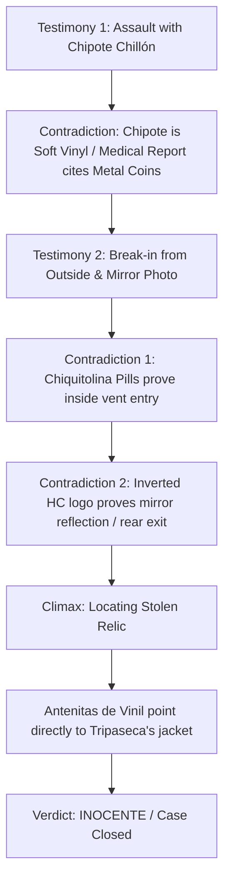

# Case 1: El Juicio del Escuadrón Colorado

Detailed narrative and design specification for Case 1 ("Turnabout of the Red Grasshopper"), configured in [[src/case/case.group.md]].

## Case Synopsis

The legendary **Chicharra Paralizadora de Oro** has been stolen from the Museum of Curiosities. The pirate guard, Alma Negra, was discovered unconscious with severe head trauma. The police arrested **El Chapulín Colorado** at the scene, claiming he assaulted the guard with his Chipote Chillón and fled the crime scene.

Prodigy prosecutor **Super Sam** ("Time is money!") demands an instant guilty verdict based on eyewitness testimony from notorious hoodlum **El Tripaseca**.

## Dramatis Personae

| Character | Role | Profile |
|-----------|------|---------|
| **Defensa (Player)** | Defense Attorney | Protagonist defending the innocent with logic, evidence, and objections. |
| **El Chapulín Colorado** | Defendant | Well-meaning bumbling superhero wrongfully accused of theft and assault. |
| **Super Sam** | Prosecutor | Arrogant hero turned speed-running prosecutor armed with bags of money. |
| **El Tripaseca** | Witness & True Culprit | Gangster who stole the relic, framed Chapulín, and bribed Super Sam. |
| **El Juez** | Judge | Easily swayed yet fair presiding magistrate. |
| **Doña Florinda** | Museum Curator | Primary witness during the crime scene investigation. |
| **Alma Negra** | Victim / Security Guard | Pirate guard knocked unconscious during the heist. |

## Timeline of Events (August 21)

- **8:45 PM**: El Chapulín Colorado's *Antenitas de Vinil* detect enemy activity; Chapulín rushes to the museum.
- **8:50 PM**: El Tripaseca consumes *Pastillas de Chiquitolina*, reduces to mouse-size, enters the locked museum through an air vent, and smashes the glass case from inside.
- **8:55 PM**: Tripaseca ambushes guard Alma Negra from behind using a heavy sack of metal coins (Super Sam's dollar bag).
- **9:00 PM**: Tripaseca runs past the large Venetian hallway mirror toward the back loading bay where his truck is parked; the security camera takes a photo of the mirror reflection showing the inverted "HC" chest emblem.
- **9:05 PM**: Chapulín arrives, trips into a historic parrot cage, and gets arrested by Super Sam.

## Courtroom Contradictions & Strategy

1. **Testimony 1 (The Assault)** ([[src/case/Private/case1_trial.ts#Testimony 1: Assault Weapon]]):
   - *Tripaseca's Claim*: Saw Chapulín strike Alma Negra with his "lethal" Chipote Chillón.
   - *Contradiction*: Present **Chipote Chillón** or **Informe Médico**. The Chipote is soft hollow vinyl and emits a comedy squeak; the medical report proves the guard was knocked out by a dense sack of metal coins.

2. **Testimony 2 (The Break-in & Escape)** ([[src/case/Private/case1_trial.ts#Testimony 2: Escape Route]]):
   - *Tripaseca's Claim 1*: Culprit forced the locks and broke the glass case from the outside.
   - *Contradiction 1*: Present **Pastillas de Chiquitolina**. Glass fell outward; the culprit shrank, crawled through the duct, and broke the glass from inside.
   - *Tripaseca's Claim 2*: Security photo shows Chapulín running toward the front exit.
   - *Contradiction 2*: Present **Foto del Sospechoso**. The chest emblem reads "HC" instead of "CH", proving it is a mirror reflection; the culprit was actually running toward the rear loading dock.

3. **Final Climax (The Hidden Loot)** ([[src/case/Private/case1_climax.ts#Climax Confrontation & Dilemma]]):
   - Super Sam demands proof of where the Chicharra is right now.
   - *Contradiction*: Present **Antenitas de Vinil**. The antennae vibrate violently towards Tripaseca's coat pocket, exposing the stolen relic.
