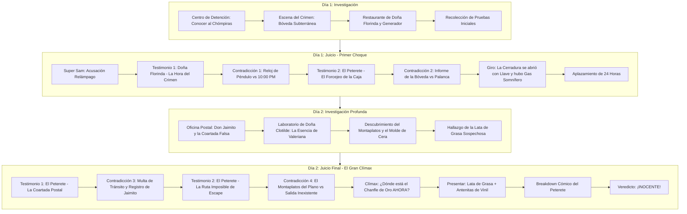

# Caso 2: El Juicio del Chómpiras — El Asalto de las Dos Caras
*(Turnabout of the Two-Faced Thief)*

Documento de diseño narrativo, guión de diálogos y especificación técnica para el **Episodio 2** de **El Chapulín Colorado: Ace Attorney**.

---

## 1. Resumen General del Caso (Case Synopsis)

El legendario y milenario **"Chanfle de Oro"** (una estatuilla prehispánica maciza de oro puro y esmeraldas valorada en 5 millones de dólares) ha sido sustraída de la bóveda de máxima seguridad de la histórica **Hacienda del Marqués**, anexa al exclusivo **Gran Hotel & Restaurante de Doña Florinda**.

La policía y el implacable fiscal **Super Sam** (*"Time is money!"*) encuentran en el interior de la bóveda sellada a **Aquiles Esquivel Madrazo, alias "El Chómpiras"**, un ex-carterista que intentaba reformarse trabajando como humilde limpiabotas y botones nocturno. El Chómpiras es hallado aturdido y tambaleante frente a la caja fuerte abierta y vacía, sosteniendo una pesada palanca de metal. Para Super Sam, se trata de un caso cerrado en tiempo récord (menos de 5 minutos).

Desesperado, El Chómpiras implora ayuda: *"¡Oh! Y ahora, ¿quién podrá defenderme?!"*.
Al llamado acude **El Chapulín Colorado**, quien recluta a su abogado de cabecera: **Don Ramón (Lic. Monchito)**, motivado tanto por la justicia como por la urgente necesidad de pagarle 14 meses de renta al Señor Barriga.

Juntos, Don Ramón y El Chapulín deberán enfrentarse a un misterio que parece sencillo al principio, pero que rápidamente se retuerce en una compleja red de sabotajes eléctricos, somníferos botánicos, coartadas postales fraudulentas y conductos secretos, hasta desenmascarar al verdadero autor intelectual del golpe: el astuto y elegante **El Peterete**.

---

## 2. Personajes (Dramatis Personae)

| Personaje | Rol en el Caso | Perfil y Comportamiento | Sprites / Poses Clave |
|---|---|---|---|
| **Don Ramón (Lic. Monchito)** | Abogado Defensor | Sagaz, callejero y sarcástico. Aunque improvisa sobre la marcha para salvar a su cliente y cobrar honorarios, posee una intuición lógica impecable. Grita con orgullo *"¡Yo le voy al Necaxa!"* y *"¡Con permisito, dijo Monchito!"*. | `donramon_idle`, `donramon_point`, `donramon_slam`, `donramon_sweat`, `donramon_panic` |
| **El Chapulín Colorado** | Co-defensor / Asistente | Compañero de investigación y apoyo en el estrado. Aporta sus icónicos artefactos (*Antenitas de Vinil*, *Pastillas de Chiquitolina*, *Chipote Chillón*), sus deducciones disparatadas pero certeras y su moral inquebrantable. | `chapulin_idle`, `chapulin_point`, `chapulin_slam`, `chapulin_panic`, `chapulin_thinking` |
| **Super Sam** | Fiscal Acusador | *"Time is money!"*. Superhéroe capitalista armado con bolsas de dólares que azota contra el estrado. Desea condenas instantáneas para maximizar la rentabilidad de la corte y desprecia los rodeos legales. | `supersam_idle`, `supersam_point`, `supersam_slam`, `supersam_sweat`, `supersam_breakdown` |
| **El Chómpiras (Aquiles Esquivel Madrazo)** | Acusado | Ex-ladrón de poca monta con un corazón inocente. Extremadamente ingenuo y torpe al explicarse, casi incriminándose a sí mismo por accidente en cada frase. | `chompiras_idle`, `chompiras_nervous`, `chompiras_crying`, `chompiras_relieved` |
| **El Peterete (Severiano Baldomero)** | Testigo Estrella & Verdadero Culpable | Jefe de seguridad de la hacienda y perito valuador. Cerebro criminal. Viste traje a rayas, bufanda y sombrero fedora. Es sumamente arrogante y calculador. Cuando es acorralado, sufre un cómico ataque de ira dándose bofetadas a sí mismo con el sombrero. | `peterete_smug`, `peterete_thinking`, `peterete_sweat`, `peterete_panic`, `peterete_breakdown` |
| **El Profesor Jirafales** | Testigo & Perito Intelectual | Caballero distinguido, culto y de imponente estatura. Amante de la arquitectura y la precisión matemática. Ante cualquier falta de rigor o contradicción vulgar, estalla en su legendario *"¡¡¡TA-TA-TA-TA-TAAAAAA!!!"*. | `jirafales_idle`, `jirafales_smoking`, `jirafales_angry`, `jirafales_shock` |
| **Doña Florinda** | Testigo & Propietaria | Dueña del restaurante anexo a la hacienda. Mujer de fuerte carácter que no tolera a *"la chusma"*. Percibió el parpadeo de las luces a las 9:15 PM mientras servía café de olla al Profesor, y descubrió al acusado dentro de la bóveda al sonar la alarma. | `florinda_idle`, `florinda_angry`, `florinda_shock`, `florinda_fanning` |
| **Don Jaimito el Cartero** | Testigo de Investigación | Cartero veterano originario de Tangamandapio. Carga una gigantesca saca de cartas que nunca termina de entregar para *"evitar la fatiga"*. Posee recibos postales cruciales. | `jaimito_idle`, `jaimito_tired`, `jaimito_proud` |
| **Doña Clotilde (La Bruja del 71)** | Testigo de Investigación | Vecina aficionada a la botánica y a los brebajes aromáticos. Enamorada platónicamente de Don Ramón (*"¡Mi Roro!"*). Su esencia sedante de rosas y valeriana es la clave del gas somnífero. | `clotilde_idle`, `clotilde_flustered`, `clotilde_mysterious` |
| **El Juez** | Juez de la Corte | Magistrado bondadoso pero influenciable por el dramatismo de los letrados. Adora el café de olla y exige silencio riguroso con su mazo. | `judge_neutral`, `judge_gavel`, `judge_thinking`, `judge_shock` |

---

## 3. Cronología Real de los Hechos (Timeline)

> **Nota de coherencia física:** El reloj de péndulo de la bóveda es electromecánico centralizado (se detiene sin energía). El reloj digital del pasillo también es de corriente y **sin pila de respaldo**: el apagón lo dejó sin hora, por lo que Peterete tuvo que reprogramarlo a mano (fijándolo en las 10:00 PM) tras restablecer la corriente — sin esa manipulación, el reloj habría delatado los 40 minutos de corte. El restaurante de Doña Florinda tiene acometida eléctrica propia: al forzarse el interruptor maestro sólo sufrió un parpadeo momentáneo, mientras el ala de la hacienda quedó a oscuras de 9:15 a 9:55 PM. El conducto de ventilación y el montaplatos son instalaciones independientes: el primero ventila, el segundo comunica la bóveda con el callejón. La llave maestra original se devuelve cada noche a la caja de custodia del hotel, por eso Peterete necesitaba un duplicado de cera para actuar sin dejar rastro en el registro de custodia.

```mermaid
timeline
    title Cronología del Robo del Chanfle de Oro (Noche del 28 de Agosto)
    Tarde 28 Ago : Un individuo misterioso visita a Doña Clotilde para comprar la Esencia de Valeriana y aprovecha un descuido de ella para copiar la llave maestra en cera (molde desechado en la basura de Clotilde).
    8:30 PM : El Peterete devuelve la llave original a custodia y contrata a Chómpiras para lustrar unas botas de plata históricas en la antecámara de la bóveda, dejándolo encerrado con su lata de grasa vacía.
    9:15 PM : Peterete fuerza la caja del generador (pintura azul) y baja el interruptor principal; el reloj de péndulo centralizado se detiene a las 9:15 PM y el reloj digital del pasillo (sin pila de respaldo) queda sin hora. En el restaurante, con acometida eléctrica propia, Jirafales y Florinda sólo perciben un parpadeo momentáneo de las luces.
    9:20 PM : Peterete bombea Esencia Sedante de Valeriana por el ducto de aire independiente; Chómpiras (aún sin palanca en manos) cae dormido profundamente (~30 min de efecto).
    9:30 PM : Con la bóveda a oscuras y en silencio, Peterete abre la caja fuerte sin forcejeo con la llave duplicada y extrae el Chanfle de Oro (5 kg).
    9:35 PM : Vacía la lata de grasa de Chómpiras, introduce el Chanfle, la resella con betún y la envía por el montaplatos al callejón. La lata cae en segundos dentro de la saca postal del carrito de Don Jaimito, estacionado y sin supervisión en el callejón.
    9:40 PM : Don Jaimito sigue durmiendo su siesta en la banca del parque (para evitar la fatiga); el carrito lleva rato abandonado — por eso un agente vial le levantó la multa de tránsito de las 9:30 PM.
    9:45 PM : Peterete sale por el pasillo de servicio al callejón, comprueba que la lata cayó dentro de la saca y estampa en el registro postal del carrito un sello manual falso con hora 9:30 PM para fabricarse una coartada; regresa a la hacienda sin ser visto.
    9:55 PM : Peterete restablece la energía, arrastra al adormilado Chómpiras hasta dejarlo frente a la caja fuerte, le coloca la palanca (usada sólo en el generador) entre las manos, reprograma el reloj digital del pasillo fijándolo en las 10:00 PM y activa la alarma general antes de correr al vestíbulo para "llegar" junto a los testigos.
    10:00 PM (Hora Falsa) : Doña Florinda y Jirafales, alertados por la alarma, descubren a Chómpiras aturdido con la palanca.
    10:15 PM : Super Sam llega y arresta a Chómpiras como culpable in fraganti. La policía asegura sólo el interior de la bóveda; el carrito postal del callejón —fuera del perímetro y propiedad de Correos— no es registrado esa noche y es retirado por Jaimito al amanecer.
```

---

## 4. Catálogo del Acta del Juicio (Court Record)

### Objetos y Pruebas (Evidence)

1. **Insignia de Abogado (`insignia_abogado`)**:
   - *Descripción*: La chapa oficial del Licenciado Monchito. Demuestra su condición de letrado defensor (aunque esté algo abollada).
2. **Chanfle de Oro (`chanfle_oro`)**:
   - *Descripción*: Reliquia de oro puro macizo de 5 kg con incrustaciones de esmeraldas. Desaparecida de la caja fuerte de la hacienda.
3. **Reloj de Péndulo Dañado (`reloj_pendulo`)**:
   - *Descripción*: Reloj electromecánico de la bóveda. Sus manecillas quedaron congeladas a las **9:15 PM** tras el corte eléctrico.
4. **Informe de la Bóveda (`informe_boveda`)**:
   - *Descripción*: Reporte técnico. La cerradura de la caja de acero no tiene signos de forcejeo; fue abierta limpiamente con su llave maestra de precisión milimétrica.
5. **Palanca Rota (`palanca_rota`)**:
   - *Descripción*: Barra de hierro hallada en manos del Chómpiras. La punta tiene restos de pintura azul marino, no del gris metálico de la caja fuerte.
6. **Muestra de Aroma Dulce (`aroma_dulce`)**:
   - *Descripción*: Frasco con residuos aromáticos tomados de la rejilla de ventilación. Huele intensamente a rosas y valeriana.
7. **Plano de la Hacienda (`plano_hacienda`)**:
    - *Descripción*: Diagrama arquitectónico del Profesor Jirafales. Revela que la bóveda subterránea no tiene ventanas ni puertas directas al exterior, pero sí dos instalaciones independientes: el **ducto de ventilación** (por donde se bombeó el somnífero) y un antiguo **montaplatos de lavandería** que comunica con el callejón trasero.
8. **Caja del Generador (`caja_generador`)**:
    - *Descripción*: La caja metálica azul del interruptor principal está abollada y presenta una muesca del ancho exacto de la palanca. La punta de la palanca conserva transferencia de pintura azul marino de esta caja, prueba de que se forzó el generador, no la caja fuerte.
9. **Registro Postal (`registro_postal`)**:
    - *Descripción*: Cuaderno de Don Jaimito con los envíos del 28 de agosto. Contiene una entrada a las 9:30 PM con sello y firma atribuidos a Peterete, estampados con un sello manual de trazo irregular — incompatible con el sello mecánico oficial que el cartero lleva siempre consigo. Jaimito confirma que a esa hora dormía en el parque y no selló nada.
10. **Multa de Tránsito (`multa_transito`)**:
     - *Descripción*: Multa de tránsito municipal expedida a las 9:30 PM al carrito de correos por estar "abandonado y sin supervisión" en el callejón trasero. La multa fue puesta por un agente vial de ronda, independiente de la policía judicial que aseguró la bóveda, por lo que el carrito no fue inspeccionado como parte de la escena del crimen.
11. **Frasco de Esencia de Valeriana (`frasco_valeriana`)**:
    - *Descripción*: Brebaje herbal concentrado creado por Doña Clotilde (rosas + valeriana). Provoca sueño instantáneo y profundo de ~30 minutos; coincide químicamente con el residuo del ducto. Fue comprado por un cliente misterioso.
12. **Molde de Cera (`molde_cera`)**:
    - *Descripción*: Trozo de cera de veladora encontrado en la basura de Doña Clotilde. Contiene la huella exacta de la llave maestra de la bóveda. Fue creado la tarde del 28 de agosto por el misterioso cliente que visitó a Clotilde para comprar la esencia.
13. **Lata de Grasa de Zapatos (`lata_grasa`)**:
    - *Descripción*: Lata grande de betún negro con el logotipo del Chómpiras. Es inusualmente pesada (~5.3 kg: 5 kg del Chanfle + lata) y de su junta brota polvo dorado brillante. Fue la lata vacía que Chómpiras llevó a la bóveda por encargo de Peterete.
14. **Antenitas de Vinil (`antenitas_vinil`)**:
    - *Descripción*: Antenas de vinil del Chapulín Colorado. Vibran con frecuencia ultrasónica al detectar la presencia de objetos robados o enemigos.

---

## 5. Estructura General del Episodio (4 Partes / ~1 Hora de Juego)



---

## 6. Guión Detallado: Día 1 — Investigación

### Locación 1: Centro de Detención (Detention Center)
- **Personaje**: El Chómpiras (`chompiras_nervous`, `chompiras_crying`).
- **Música de Fondo**: `detention_center`.

```dialogue
[ENTRADA AL CENTRO DE DETENCIÓN]
NARRADOR: 29 de Agosto, 10:00 AM. Centro de Detención de la Ciudad.
DEFENSA (donramon_idle): Bueno, aquí estamos. Según la policía, el sospechoso es un peligroso asaltante internacional...
CHAPULIN (chapulin_idle): ¡Calma, Monchito! ¡Que no panda el cúnico! Mis antenitas de vinil me dicen que el acusado es una persona totalmente inofensiva... o muy despistada.
CHOMPIRAS (chompiras_crying): ¡Buaaaa! ¡Yo no fui, jefecito! ¡Yo no me robé ningún chanfle de nada! ¡Lo único que me he robado en mi vida son dos panes de dulce y ya los devolví mordidos!
DEFENSA (donramon_sweat): (Vaya facha de genio criminal... se parece a mí cuando llega el casero.)
DEFENSA (donramon_point): A ver, muchacho, cálmate. Soy el Licenciado Monchito, tu abogado defensor, y vengo con el Chapulín Colorado.
CHOMPIRAS (chompiras_relieved): ¡El Chapulín Colorado! ¡No contaban con mi astucia! Digo... ¡con la suya!
```

#### Opciones de Diálogo (Talk):
1. **"¿Qué hacías dentro de la bóveda?"**:
    - **Chómpiras**: *"Pues verá, el señor Peterete me dijo que me daría 50 pesos si le lustraba unas botas de plata en el sótano. Me dio mi latita de grasa vacía y me dejó encerrado para que nadie me distrajera."*
    - **Don Ramón**: *"¿Y la palanca que tenías en la mano?"*
    - **Chómpiras**: *"¡Ah, esa palanca! Yo no la llevaba... Me quedé jetón por un humo con olor a rosas muy sabroso que salía de la rejilla, y cuando desperté con la alarma ya la tenía entre las manos sin saber de dónde salió."*
    - **Chapulín**: *"¡Eso confirma que te la plantaron mientras dormías!"*
    - **Se añade al acta**: `palanca_rota` (copia del inventario policial de la pieza incautada; Chómpiras aclara que despertó con ella ya en las manos).
2. **"Sobre el señor Peterete"**:
   - **Chómpiras**: *"Es un señor muy fino y elegante. Dice que es el jefe de seguridad de la hacienda y perito valuador. Trae un sombrero muy bonito y siempre me ayuda a no caer en malos pasos."*
   - **Chapulín**: *"¡Sospechosa amabilidad! ¡Todos mis movimientos están fríamente calculados!"*
   - **Don Ramón**: *"Dime una cosa, muchacho... Si él es el jefe de seguridad, ¿no es el principal responsable de vigilar el Chanfle de Oro? ¿Y fue él quien te encerró justo en la escena del crimen?"*
   - **Chómpiras**: *"Pues sí, jefecito. Hasta me dijo: 'Quédate aquí quietecito, que si algo desaparece, tú serás el chivo expiatorio perfecto'. ¡Qué señor tan bromista!"*
   - **Don Ramón**: *"(¡De bromista no tiene nada! Este Peterete lo planeó todo para incriminar al pobre diablo. ¡Es nuestro sospechoso número uno!)"*
   - **Se desbloquea locación**: `boveda_crimen`.

---

### Locación 2: Gran Bóveda del Tesoro (Escena del Crimen)
- **Personajes**: Doña Florinda (`florinda_angry`), El Peterete (`peterete_smug`).
- **Música de Fondo**: `investigation`.

```dialogue
[ENTRADA A LA BÓVEDA SUBTERRÁNEA]
NARRADOR: 29 de Agosto, 11:30 AM. Bóveda Subterránea de la Hacienda.
FLORINDA (florinda_angry): ¡Esto es inconcebible! ¡Tener a un ladrón de baja ralea merodeando por el vecindario del hotel! ¡Menos mal que el fiscal Super Sam lo apresó de inmediato!
PETERETE (peterete_smug): Tranquilícese, mi distinguida dama. Como jefe de seguridad, he levantado un peritaje irrebatible. El criminal actuó en solitario a las 10:00 PM.
DEFENSA (donramon_idle): ¡Con permisito, dijo Monchito! La defensa entra a inspeccionar la escena del crimen.
PETERETE (peterete_smug): Ja, adelante, 'abogado'. Aunque dudo que su intelecto pueda encontrar algo que la fiscalía haya pasado por alto.
```

#### Puntos de Interés (Hotspots):
1. **Caja Fuerte Abierta y Suelo (`hotspot_caja`)**:
   - Al examinar la cerradura de acero macizo: no presenta abolladuras ni rayaduras. La manija giró limpiamente.
   - **Don Ramón**: *"Miren esto... una caja blindada con cerradura de llave maestra y no tiene ni un solo golpe de palanca."*
   - **Se añade al acta**: `informe_boveda`.
2. **Reloj de Péndulo de la Pared (`hotspot_reloj`)**:
   - El gran reloj electromecánico de pared marca exactamente las **9:15 PM**. Su mecanismo interno está detenido.
   - **Chapulín**: *"¡Miren ese reloj! ¡Se quedó dormido antes de tiempo!"*
   - **Peterete**: *"Pamplinas. Ese reloj es una antigüedad decorativa que no funciona desde el siglo pasado."*
   - **Se añade al acta**: `reloj_pendulo`.
   - **Se desbloquea locación**: `restaurante_florinda` (la defensa quiere preguntar en el restaurante anexo si alguien notó algo a las 9:15 PM).
3. **Rejilla del Ducto de Ventilación (`hotspot_rejilla`)**:
   - La rejilla metálica desprende un aroma dulce muy particular.
   - **Chapulín**: *(Olfatea)* *"¡Mmm! Huele a perfume de rosas con té de tila... ¡igualito al que prepara Doña Clotilde cuando se le mete un susto!"*
   - **Don Ramón**: *"Tomaré una muestra con este pañuelo."*
   - **Se añade al acta**: `aroma_dulce`.

---

### Locación 3: Restaurante de Doña Florinda y Cuadro Eléctrico
- **Personaje**: El Profesor Jirafales (`jirafales_idle`, `jirafales_smoking`).
- **Música de Fondo**: `investigation`.

```dialogue
[ENTRADA AL RESTAURANTE]
NARRADOR: 29 de Agosto, 1:00 PM. Restaurante de Doña Florinda.
JIRAFALES (jirafales_idle): ¡Ah, Don Ramón! He escuchado sobre la penosa situación del señor Chómpiras. Como hombre de ciencia y educación, abogo por la verdad absoluta.
DEFENSA (donramon_idle): Profesor, usted que es un pozo de sabiduría, ¿estaba cenando aquí anoche con Doña Florinda?
JIRAFALES (jirafales_smoking): En efecto. Degustábamos una exquisita taza de café de olla cuando, de súbito, a las 9:15 PM las luces sufrieron un apagón momentáneo.
DEFENSA (donramon_point): ¡¿A las 9:15 PM?! ¡Justo la hora en que se detuvo el reloj de la bóveda!
JIRAFALES (jirafales_idle): Así es. De hecho, como entusiasta de la arquitectura, he trazado este plano meticuloso del inmueble.
```

#### Puntos de Interés y Acciones:
1. **Plano Arquitectónico entregado por el Profesor**:
    - **Profesor Jirafales**: *"Tenga este plano. Muestra la estructura subterránea. Notará que la bóveda carece de ventanas y puertas al exterior; sólo posee el ducto de ventilación y un antiguo montaplatos de lavandería que conecta con el callejón trasero."*
    - **Se añade al acta**: `plano_hacienda`.
2. **Generador Eléctrico Exterior (`hotspot_generador`)**:
    - Al examinar la caja azul del generador en el patio trasero: la puerta metálica azul tiene una abolladura fresca del mismo ancho que la punta de la palanca, que fue usada para forzar la puerta y acceder al interruptor maestro.
    - **Don Ramón**: *"¡Miren! La punta de la palanca tiene pintura azul marino del generador... ¡la usaron para forzar la caja del generador, no la caja fuerte!"*
    - **Se añade al acta**: `caja_generador`.

---

## 7. Guión Detallado: Día 1 — Juicio en el Tribunal

- **Ubicación**: Sala Superior de Juicios Orales.
- **Participantes**: El Juez, Super Sam, Don Ramón, El Chapulín, Doña Florinda, El Peterete.

```dialogue
[APERTURA DEL JUICIO - DÍA 1]
JUEZ (judge_gavel): ¡Silencio en la sala! Se abre la sesión del tribunal superior. [sfx: gavel, bgm: trial]
JUEZ (judge_neutral): La fiscalía puede presentar sus cargos en contra del acusado Aquiles Esquivel Madrazo.
SUPER SAM (supersam_slam): Time is money, Your Honor! [sfx: desk_slam]
SUPER SAM (supersam_point): El acusado fue sorprendido in fraganti dentro de la bóveda a las 10:00 PM con la herramienta del delito en sus manos. ¡Exijo un veredicto de culpabilidad en 3 minutos!
DEFENSA (donramon_slam): ¡PROTESTO! ¡La defensa demostrará que todo este caso es un vil montaje! [sfx: desk_slam]
CHAPULIN (chapulin_point): ¡Síganme los buenos! ¡No permitiremos que condenen a un inocente!
JUEZ (judge_neutral): Que pase al estrado el primer testigo de la fiscalía.
```

---

### Testimonio 1: Doña Florinda — "El Descubrimiento a las 10:00 PM"
- **Testigo**: Doña Florinda (`florinda_idle`).
- **Música de Fondo**: `cross_exam_moderato`.

```dialogue
[DECLARACIÓN DEL TESTIGO]
FLORINDA (stmt1_1): Anoche a las 10:00 PM en punto, mientras terminaba de limpiar el salón del restaurante, sonó la alarma general.
FLORINDA (stmt1_2): Corrí de inmediato hacia la bóveda subterránea acompañada por el respetable jefe de seguridad, el señor Peterete.
FLORINDA (stmt1_3): La puerta estaba entreabierta y vimos al acusado de pie frente a la caja fuerte vacía con su palanca de fierro.
FLORINDA (stmt1_4): Hasta el reloj de péndulo de la pared de la bóveda marcaba las 10:00 PM, confirmando la hora exacta de la fechoría.
```

#### Declaraciones, Presiones y Contradicción:

- **Presionar `stmt1_1` ("Anoche a las 10:00 PM...")**:
  - **Don Ramón**: *"¡UN MOMENTO! ¿Cómo tiene tanta certeza de que eran las 10:00 PM?"*
  - **Doña Florinda**: *"¡Porque acababa de mirar el reloj eléctrico digital del pasillo, ignorante!"*
- **Presionar `stmt1_3` ("La puerta estaba entreabierta...")**:
  - **Don Ramón**: *"¿El Chómpiras estaba despierto o consciente?"*
  - **Doña Florinda**: *"Bueno... parecía mareado o atontado, ¡pero la chusma siempre tiene esa cara de despistada!"*
- **CONTRADICCIÓN en `stmt1_4` ("Hasta el reloj de péndulo... marcaba las 10:00 PM...")**:
  - **Presentar**: `reloj_pendulo` o `caja_generador`.
  - **Animación**: ¡PROTESTO! (`cutin: objection_protesto`, `sfx: whoosh`, `bgm: objection`).

```dialogue
[ÉXITO DE LA CONTRADICCIÓN 1]
DEFENSA (donramon_point): ¡PROTESTO! ¡Con permisito, dijo Monchito! ¡Doña Florinda, su afirmación de la hora es absolutamente imposible!
SUPER SAM (supersam_point): What?! ¡El reloj digital del pasillo marcaba las 10:00 PM! Time is money!
DEFENSA (donramon_slam): ¡Miren este 'Reloj de Péndulo Dañado' rescatado del interior de la bóveda! [sfx: desk_slam]
DEFENSA (donramon_point): Este reloj es electromecánico centralizado. Cuando a las 9:15 PM alguien forzó la caja del generador y bajó el interruptor maestro, ¡el reloj de péndulo se quedó sin energía y se detuvo a las 9:15 PM!
JUEZ (judge_shock): ¡Cáspita! ¿Significa que la energía se cortó tres cuartos de hora antes?
DEFENSA (donramon_idle): ¡Exacto! Y el reloj digital del pasillo, que no tiene pila de respaldo, también quedó sin hora durante el corte. Quien restableció la corriente lo reprogramó fijándolo en las 10:00 PM para fabricar una hora falsa del crimen. ¡El robo comenzó a las 9:15 PM en completa oscuridad!
FLORINDA (florinda_shock): ¡Ay, Dios mío! ¡¿Entonces a las 9:15 PM ya estaban robando la hacienda?!
SUPER SAM (supersam_sweat): Grrr... Un simple desfase horario no exime al acusado de haber reventado la caja de caudales con su palanca. ¡Llamo al estrado al jefe de seguridad, el señor Peterete!
```

---

### Testimonio 2: El Peterete — "El Forcejeo de la Caja Fuerte"
- **Testigo**: El Peterete (`peterete_smug`).
- **Música de Fondo**: `cross_exam_allegro`.

```dialogue
[DECLARACIÓN DEL TESTIGO]
PETERETE (stmt2_1): Muy astuta la observación del reloj, Licenciado. Pero los hechos materiales son indiscutibles.
PETERETE (stmt2_2): El Chómpiras utilizó la palanca metálica para forzar el pestillo de acero de la caja y arrancar el Chanfle de Oro.
PETERETE (stmt2_3): Al entrar tras la alarma, vi con mis propios ojos las marcas del forcejeo: el acero cedió ante la fuerza bruta del sospechoso.
PETERETE (stmt2_4): No existe otra forma en que esa puerta blindada pudiera abrirse sin dejar rastros.
```

#### Declaraciones, Presiones y Contradicción:

- **Presionar `stmt2_1`**:
  - **Don Ramón**: *"¿Usted dónde se encontraba a las 9:15 PM?"*
  - **Peterete**: *"En la estafeta de correos, despachando unas encomiendas urgentes. El cartero podrá confirmárselo."* (Siembra la coartada postal que la defensa investigará el Día 2.)
- **Presionar `stmt2_3`**:
  - **Chapulín**: *"¡UN MOMENTO! ¿Marcas de forcejeo? ¡Pues mis antenitas de vinil no detectaron ni un rasguño en esa caja!"*
  - **Peterete**: *"¡Serían rasguños finísimos, de acero de alta resistencia, alimaña roja!"*
- **CONTRADICCIÓN en `stmt2_2`, `stmt2_3` o `stmt2_4` ("El Chómpiras utilizó la palanca..." / "vi las marcas del forcejeo...")**:
  - **Presentar**: `informe_boveda` o `palanca_rota`.
  - **Animación**: ¡TOMA ESO! (`cutin: objection_toma_eso`, `sfx: whoosh`, `bgm: pursuit`).

```dialogue
[ÉXITO DE LA CONTRADICCIÓN 2 Y GRAN REVELACIÓN DEL DÍA 1]
DEFENSA (donramon_point): ¡TOMA ESO! ¡Señor Peterete, sus mentiras caen por su propio peso!
PETERETE (peterete_sweat): ¿M-mentiras? ¡Mida sus palabras, picapleitos!
DEFENSA (donramon_slam): ¡El 'Informe de la Bóveda' dictamina categóricamente que los pestillos de la caja fuerte NO sufrieron ningún daño por palanca! [sfx: desk_slam]
DEFENSA (donramon_point): La cerradura fue abierta suave y limpiamente con una LLAVE MAESTRA.
DEFENSA (donramon_idle): Además, la punta de la palanca incautada tiene restos de pintura AZUL MARINO, que coincide exactamente con el cuadro eléctrico exterior. ¡La palanca se usó para forzar el generador, no la caja de caudales!
CHAPULIN (chapulin_point): ¡Lo sospeché desde un principio! ¡Al Chómpiras le pusieron la palanca en las manos mientras dormía plácidamente por culpa de un gas somnífero!
JUEZ (judge_shock): ¡¿Gas somnífero?! ¡Esto cambia la naturaleza del caso de un robo rústico a una conspiración premeditada!
SUPER SAM (supersam_slam): Objection! ¿Quién tenía acceso a esa llave maestra y dónde está el somnífero? ¡Sin esas pruebas esto son puras especulaciones! [sfx: desk_slam]
JUEZ (judge_gavel): Concuerdo con la fiscalía en que faltan elementos clave. Por tanto, ¡suspendo esta sesión por 24 horas para que la defensa y la policía investiguen el origen de la llave y el sedante! [sfx: gavel]
```

---

## 8. Guión Detallado: Día 2 — Investigación Profunda

### Locación 1: Oficina Postal y Callejón Trasero
- **Personaje**: Don Jaimito el Cartero (`jaimito_idle`, `jaimito_tired`).
- **Música de Fondo**: `investigation`.

```dialogue
[ENCUENTRO CON DON JAIMITO]
NARRADOR: 30 de Agosto, 9:00 AM. Callejón Trasero y Puesto Postal.
JAIMITO (jaimito_tired): Buenos días... Vengo a entregar estas cartas, pero es que quiero evitar la fatiga...
DEFENSA (donramon_idle): Don Jaimito, perdone la molestia, pero la noche del robo usted estacionó su carrito de correos en este callejón, justo debajo del montaplatos de la hacienda.
JAIMITO (jaimito_idle): ¡Ah, sí! Es que en mi pueblo natal, Tangamandapio, los carritos se dejan a la sombra de los árboles de guayaba...
CHAPULIN (chapulin_idle): Don Jaimito, ¿recuerda si el señor Peterete le entregó algún paquete la noche del 28 a las 9:30 PM?
JAIMITO (jaimito_tired): ¿A las 9:30 PM? ¡Imposible! A esa hora yo estaba durmiendo una siesta reparadora en la banca del parque para evitar la fatiga. Hasta me pusieron una multa por dejar el carrito abandonado en el callejón.
DEFENSA (donramon_idle): ¿Una multa?
JAIMITO (jaimito_tired): Sí, mire. Aquí dice: "9:30 PM. Vehículo postal abandonado sin cartero a la vista."
```

#### Pruebas Recolectadas:
- **Multa de Tránsito (`multa_transito`)**: Prueba irrefutable de que el carrito postal estuvo abandonado sin supervisión a las 9:30 PM (infracción vial, no judicial).
- **Registro Postal de Envíos (`registro_postal`)**: Muestra que la entrada de Peterete a las 9:30 PM fue estampada con un sello manual de trazo irregular mientras Jaimito dormía — el sello mecánico oficial, que el cartero lleva siempre encima, nunca se usó.
- **Inspección del Carrito de Correo (`hotspot_saca_postal`)**:
   - En el fondo de la saca de cuero, Don Ramón encuentra la **Lata de Grasa de Zapatos (`lata_grasa`)** — la misma lata vacía que Peterete le dio a Chómpiras, ahora sellada y con polvo dorado.
   - **Don Ramón**: *"¡Caray! Esta lata de grasa para zapatos pesa más de 5 kilos... ¡y de la tapa cae un polvillo amarillo resplandeciente!"*
   - **Chapulín**: *"¡Mis antenitas de vinil están vibrando a 10,000 revoluciones por minuto! ¡El oro está aquí adentro!"*
   - **Se añade al acta**: `lata_grasa` y `antenitas_vinil` (el Chapulín registra sus antenitas como instrumento de detección ante el tribunal).
   - *Nota de cadena de custodia:* El carrito fue retirado del callejón al amanecer del 29 por Jaimito y no fue inspeccionado por la policía judicial la noche del crimen (sólo se aseguró la bóveda interior), por lo que la lata permaneció oculta bajo la correspondencia hasta hoy.

---

### Locación 2: Habitación 71 y Laboratorio Botánico
- **Personaje**: Doña Clotilde (`clotilde_flustered`, `clotilde_mysterious`).
- **Música de Fondo**: `investigation`.

```dialogue
[ENCUENTRO CON DOÑA CLOTILDE]
NARRADOR: 30 de Agosto, 11:30 AM. Casa de Doña Clotilde.
CLOTILDE (clotilde_flustered): ¡Ay, mi Roro! ¡Qué dicha tenerte en mi humilde morada! ¿Quieres que te prepare una tacita de café o una infusión para los nervios?
DEFENSA (donramon_sweat): Este... gracias, Doña Clotilde, pero andamos investigando un aroma muy curioso. ¿Reconoce este frasco?
CLOTILDE (clotilde_mysterious): ¡Por supuesto! Es mi fórmula secreta de 'Esencia Concentrada de Valeriana y Rosas'. Un hombre muy elegante vino antier por la tarde, justo antes del robo, a comprarme tres frascos diciendo que tenía un insomnio terrible.
CHAPULIN (chapulin_thinking): ¿Un hombre elegante? ¿No recuerda quién era?
CLOTILDE (clotilde_mysterious): Llevaba el sombrero calado y una bufanda que le tapaba media cara. Pero tenía unos modales muy refinados, nada que ver con la chusma.
DEFENSA (donramon_idle): Doña Clotilde, ¿le importaría si revisamos un poco? (Mira la basura) ¡Chapulín, mira esto!
CHAPULIN (chapulin_idle): ¡Es un trozo de cera de veladora con la forma de una llave!
DEFENSA (donramon_point): ¡El misterioso comprador usó la cera de Doña Clotilde para hacer el molde de una llave cuando vino a comprar el sedante!
```

#### Pruebas Recolectadas:
- **Frasco de Esencia de Valeriana (`frasco_valeriana`)**: Coincidencia química 100% idéntica con el residuo del ducto (`aroma_dulce`).
- **Molde de Cera (`molde_cera`)**: El comprador misterioso usó cera de las velas de Doña Clotilde para copiar una llave la tarde previa al robo (28 de agosto) y desechó el molde en su basura por exceso de confianza.

---

## 9. Guión Detallado: Día 2 — Juicio Final y Gran Clímax

- **Ubicación**: Sala del Tribunal Superior.
- **Participantes**: El Juez, Super Sam, Don Ramón, El Chapulín, El Peterete, Profesor Jirafales.
- **Música de Fondo**: `trial` -> `cross_exam_moderato` -> `objection` -> `cross_exam_allegro` -> `pursuit` -> `victory`.

```dialogue
[REAPERTURA DEL JUICIO - DÍA 2]
JUEZ (judge_gavel): Se reanuda la sesión en el caso del Chanfle de Oro. [sfx: gavel]
SUPER SAM (supersam_slam): Time is money! Your Honor, la fiscalía ha comprobado que el señor Peterete tiene una coartada de hierro a la hora del corte de luz. [sfx: desk_slam]
SUPER SAM (supersam_point): Estaba en la oficina postal con el cartero despachando encomiendas. ¡El acusado sigue siendo el único sospechoso viable!
DEFENSA (donramon_slam): ¡La defensa exige que el señor Peterete vuelva al banquillo de los testigos! [sfx: desk_slam]
```

---

### Testimonio 1: El Peterete — "Mi Coartada Postal"
- **Testigo**: El Peterete (`peterete_smug`).
- **Música de Fondo**: `cross_exam_moderato`.

```dialogue
[DECLARACIÓN DEL TESTIGO]
PETERETE (stmt3_1): Qué pérdida de tiempo tan lamentable. A las 9:15 PM yo estaba en la estafeta de correos entregando paquetes urgentes.
PETERETE (stmt3_2): El cartero Jaimito recibió mis envíos y estampó el sello oficial de las 9:30 PM en el libro de registro.
PETERETE (stmt3_3): Estuve allí hasta las 9:45 PM conversando amenamente sobre la historia de Tangamandapio.
PETERETE (stmt3_4): Por ende, me fue físicamente imposible estar cerca del generador o del ducto de aire.
```

#### Declaraciones, Presiones y Contradicción:

- **Presionar `stmt3_1`**:
  - **Don Ramón**: *"¿Qué contenían esos paquetes tan 'urgentes'?"*
  - **Peterete**: *"Muestras de telas finas, nada de la incumbencia de este tribunal."*
- **CONTRADICCIÓN en `stmt3_2` o `stmt3_3` ("El cartero Jaimito recibió mis envíos...")**:
  - **Presentar**: `multa_transito` o `registro_postal`.
  - **Animación**: ¡PROTESTO! (`cutin: objection_protesto`, `sfx: whoosh`, `bgm: objection`).

```dialogue
[ÉXITO DE LA CONTRADICCIÓN 3]
DEFENSA (donramon_point): ¡PROTESTO! ¡Señor Peterete, su coartada es más falsa que un billete de tres dólares de Super Sam!
SUPER SAM (supersam_sweat): Hey! ¡Mis dólares son 100% auténticos!
DEFENSA (donramon_slam): ¡Esta 'Multa de Tránsito' oficial y el 'Registro Postal' demuestran que a las 9:30 PM el carrito estaba abandonado en el callejón y no había ningún cartero para recibirle nada! [sfx: desk_slam]
DEFENSA (donramon_point): ¡Usted mismo fue al carrito abandonado y estampó un sello falso en el registro para fabricarse una coartada, sin que nadie lo viera!
PETERETE (peterete_sweat): ¡G-grrrk! ¡Maldito cartero holgazán!
```

---

### Testimonio 2: El Peterete — "La Ruta Imposible del Escape"
- **Testigo**: El Peterete (`peterete_sweat`).
- **Música de Fondo**: `cross_exam_allegro`.

```dialogue
[DECLARACIÓN DEL TESTIGO]
PETERETE (stmt4_1): ¡Aunque no haya estado en correos, nadie pudo haber sacado la estatuilla de 5 kilos de esa bóveda subterránea!
PETERETE (stmt4_2): Las paredes son de hormigón armado de dos metros de espesor y no existe ninguna salida al exterior.
PETERETE (stmt4_3): Si yo hubiera robado el Chanfle de Oro, la policía me lo habría encontrado encima durante el cacheo preventivo.
PETERETE (stmt4_4): ¡El oro no pudo salir de esa bóveda! ¡Seguramente el Chómpiras lo escondió bajo las baldosas del suelo!
```

#### Declaraciones, Presiones y Contradicción:

- **Presionar `stmt4_3`**:
   - **Super Sam**: *"Indeed! ¡La policía lo registró de pies a cabeza y no tenía ni una onza de oro!"*
   - **Don Ramón**: *"Porque el oro nunca salió por la puerta principal..."*
- **CONTRADICCIÓN en `stmt4_2` ("no existe ninguna salida al exterior...")**:
   - **Presentar**: `plano_hacienda`.
   - **Animación**: ¡TOMA ESO! (`cutin: objection_toma_eso`, `sfx: whoosh`, `bgm: pursuit`).

```dialogue
[ÉXITO DE LA CONTRADICCIÓN 4]
DEFENSA (donramon_point): ¡TOMA ESO! ¡No hay ventanas, pero el 'Plano Arquitectónico' del Profesor revela un antiguo MONTAPLATOS DE LAVANDERÍA que sí es una salida al exterior! [sfx: desk_slam]
DEFENSA (donramon_slam): El montaplatos comunica la bóveda directamente con el callejón trasero donde reposaba el carrito postal. [sfx: desk_slam]
JIRAFALES (jirafales_angry): ¡¡¡TA-TA-TA-TA-TAAAAAA!!! ¡Exactamente como lo diseñó el Marqués en 1892!
PETERETE (peterete_panic): ¡P-pero la policía revisó al sospechoso y no había ningún Chanfle de Oro a la vista! ¡¿Dónde está la prueba material?!
```

---

### El Gran Clímax: ¿Dónde se Oculta el Chanfle de Oro? (Final Showdown)

```dialogue
[DILEMA FINAL DEL CLÍMAX]
SUPER SAM (supersam_point): Stop right there! ¡Si el señor Peterete es el ladrón, exijo que la defensa presente en este instante el Chanfle de Oro!
JUEZ (judge_thinking): Es la regla de oro del tribunal: para condenar al autor intelectual, debemos ubicar el cuerpo del delito. ¿Tiene la defensa esa prueba decisiva?
DEFENSA (donramon_idle): (Es el momento decisivo. El oro no está en los bolsillos de Peterete... pero estuvo en el carrito todo este tiempo...)
CHAPULIN (chapulin_point): ¡Monchito! ¡Mis antenitas de vinil me dicen que el culpable disfrazó el tesoro a la vista de todos!
```

#### Elección de Prueba Clímax 1: El Oro
- **Presentar**: `lata_grasa` (prueba directa) o `antenitas_vinil` (detector que apunta a la lata).

```dialogue
[REVELACIÓN DEL ORO]
DEFENSA (donramon_point): ¡PROTESTO! ¡Aquí está el Chanfle de Oro, oculto dentro de la 'Lata de Grasa de Zapatos' del Chómpiras! [cutin: objection_protesto, sfx: whoosh, bgm: pursuit]
SUPER SAM (supersam_slam): What?! ¡¿Una simple lata de betún para calzado?! [sfx: desk_slam]
DEFENSA (donramon_slam): ¡Pesa más de 5 KILOS y de su junta brota polvo dorado! El señor Peterete vació el betún, introdujo la estatuilla de oro macizo y reselló la tapa con betún negro para que pareciera un inocente utensilio de trabajo. [sfx: desk_slam]
CHAPULIN (chapulin_slam): ¡Y mis Antenitas de Vinil lo confirman — vibran justo hacia esta lata! ¡Ábranla y verán el brillo del oro! [sfx: chipote]
NARRADOR: *¡¡¡CLAAANG-BRILLOOOO!!!* (La tapa cede y el resplandor dorado del Chanfle de Oro ilumina toda la sala del tribunal) [sfx: realization]
PETERETE (peterete_sweat): ¡G-grrrk! ¡E-esa es la lata del Chómpiras! ¡Esto solo demuestra que él escondió el oro en su propia lata! ¡Yo no tengo nada que ver!
SUPER SAM (supersam_point): ¡Exactly! ¡El acusado tenía la lata y la palanca! ¡Sigue siendo el único culpable posible!
DEFENSA (donramon_idle): (¡Rayos! Tienen razón, el oro en la lata del Chómpiras no incrimina directamente al Peterete... a menos que demuestre que el Chómpiras no pudo haberlo hecho, y que el Peterete tenía cómo abrir la caja.)
```

#### Elección de Prueba Clímax 2: La Inocencia del Chómpiras
- **Presentar**: `frasco_valeriana` o `aroma_dulce`.

```dialogue
[LA INOCENCIA DEL CHÓMPIRAS]
DEFENSA (donramon_point): ¡TOMA ESO! ¡El Chómpiras no pudo haber guardado el oro porque estaba profundamente dormido! [cutin: objection_toma_eso, sfx: whoosh]
DEFENSA (donramon_slam): Alguien bombeó esta 'Esencia de Valeriana' por el ducto de ventilación. ¡Un sedante tan potente que lo dejó inconsciente por 30 minutos! [sfx: desk_slam]
PETERETE (peterete_panic): ¡P-pero la caja fuerte se abrió con llave! ¡Yo devolví la llave maestra a custodia a las 8:30 PM! ¡Nadie más tenía cómo abrirla!
```

#### Elección de Prueba Clímax 3: La Culpabilidad del Peterete
- **Presentar**: `molde_cera`.

```dialogue
[LA CULPABILIDAD DEL PETERETE]
DEFENSA (donramon_point): ¡PROTESTO! ¡Usted no necesitaba la llave original, porque fabricó un DUPLICADO! [cutin: objection_protesto, sfx: whoosh]
DEFENSA (donramon_slam): ¡Encontramos este 'Molde de Cera' en la basura de Doña Clotilde! ¡Tiene la huella exacta de la llave maestra! [sfx: desk_slam]
PETERETE (peterete_smug): ¡Bah! Doña Clotilde dijo que fue un hombre misterioso con bufanda y sombrero. ¡Podría ser cualquiera!
DEFENSA (donramon_point): ¡No se haga el tonto! Doña Clotilde dijo que el hombre fue a comprar la esencia la tarde del 28 de agosto.
DEFENSA (donramon_slam): Y según las reglas del hotel, ¡la única persona que portaba la llave maestra original durante esa tarde era el JEFE DE SEGURIDAD! [sfx: desk_slam]
DEFENSA (donramon_point): ¡Usted fue a comprarle la esencia de valeriana, y aprovechó para copiar su propia llave en la cera de sus veladoras! ¡Usted durmió al Chómpiras, abrió la caja con su copia, metió el oro en la lata y la tiró por el montaplatos!
PETERETE (peterete_breakdown): ¡¡¡NOOOOOOOOOOOO!!! ¡¡¡MI PLAN PERFECTO DE CINCO MILLONES DE DÓLARES ARRUINADO POR UN LIMPIABOTAS Y UN DEFENSOR DEL NECAXA!!! [sfx: damage]
NARRADOR: (El Peterete comienza a propinarse sonoras bofetadas con su propio sombrero fedora mientras gira desquiciado por el estrado de los testigos hasta caer desplomado).
SUPER SAM (supersam_breakdown): OH NOOO! ¡My fees! ¡My bonus! ¡Time is money and I lost my dollars!
JUEZ (judge_gavel): ¡Silencio y orden! Habiendo aparecido la prueba reina, demostrado el método y confesado el verdadero culpable, ¡este juzgado emite su veredicto definitivo! [sfx: gavel]
JUEZ (judge_gavel): ¡Declaro al acusado, Aquiles Esquivel Madrazo... INOCENTE! [cutin: objection_culpable, sfx: whoosh, bgm: victory]
```

---

## 10. Epílogo: Celebración en la Vecindad (Post-Trial Epilogue)

```dialogue
[SALA DE ESPERA DE LA CORTE - FINAL]
CHOMPIRAS (chompiras_relieved): ¡Ay, Don Ramón, Chapulín! ¡No sé cómo agradecerles! ¡Ya me veía pasando 20 años en la cárcel comiendo sopa de piedras!
CHAPULIN (chapulin_point): ¡No hay de qué, Chómpiras! ¡La nobleza y la astucia siempre vencen al mal! ¡Síganme los buenos!
FLORINDA (florinda_idle): Debo admitir, Don Ramón... que por una vez en su vida no se comportó como la chusma habitual.
JIRAFALES (jirafales_idle): Ha sido una cátedra de deducción aristotélica, Don Ramón. Admirable.
DEFENSA (donramon_idle): ¡Je, je! ¡No hay de queso nomás de papa! Y ahora que demostré mi talento legal...
NARRADOR: (De pronto, se escuchan pasos pesados en el pasillo... ¡es el Señor Barriga con su portafolio!) [sfx: realization]
DEFENSA (donramon_panic): ¡¡¡CHANFLE!!! ¡¡¡EL SEÑOR BARRIGA VIENE POR LOS 14 MESES DE RENTA!!!
CHAPULIN (chapulin_idle): ¡Toma, Monchito! ¡Tómate una 'Pastilla de Chiquitolina' y escóndete en mi bolsillo!
DEFENSA (donramon_point): ¡Con permisito, dijo Monchitooooo!
[FIN DEL CASO 2]
```

---

## 11. Especificación Técnica de Audio y BGM (Soundtrack Plan)

| Momento de Juego | Nombre del Track MIDI | Canal 1 (Lead) | Canal 2 (Chords) | Canal 3 (Bass) | Canal 4 (Percusión) |
|---|---|---|---|---|---|
| **Investigación** | `investigation` | Melodía misteriosa en flauta / synth cuadrada | Acordes en arpegio menor | Bajo caminante rítmico | Hi-hats sutiles y rimshot |
| **Centro de Detención** | `detention_center` | Tono melancólico lento en onda triangular | Pads armónicos oscuros | Bajo sostenido grave | Sin batería (silencio tenso) |
| **Inicio del Juicio** | `trial` | Fanfarria solemne en onda de pulso | Acordes mayores firmes | Pulso rítmico enérgico | Caja de marcha y bombo |
| **Interrogatorio Moderato** | `cross_exam_moderato` | Staccato interrogativo moderado | Acordes en contratiempo | Bajo con slap de 8-bits | Ritmo constante de platillo |
| **Interrogatorio Allegro** | `cross_exam_allegro` | Melodía rápida y apremiante | Sintetizadores cortados veloces | Línea de bajo acelerada | Batería intensa con redobles |
| **Objeción / Giro** | `objection` | Fanfarria triunfal latina / mariachi retro | Acordes de trompeta brillante | Bajo funky saltarín | Batería completa enérgica |
| **Persecución (Cornered)** | `pursuit` | Tema de acción veloz del Chapulín | Progresión armónica heroica | Línea de bajo arpegiada rápida | Doble bombo y platillos retro |
| **Victoria** | `victory` | Canción festiva y alegre mexicana | Acordes alegres en modo mayor | Bajo saltarín juguetón | Aplausos y caja celebratoria |

