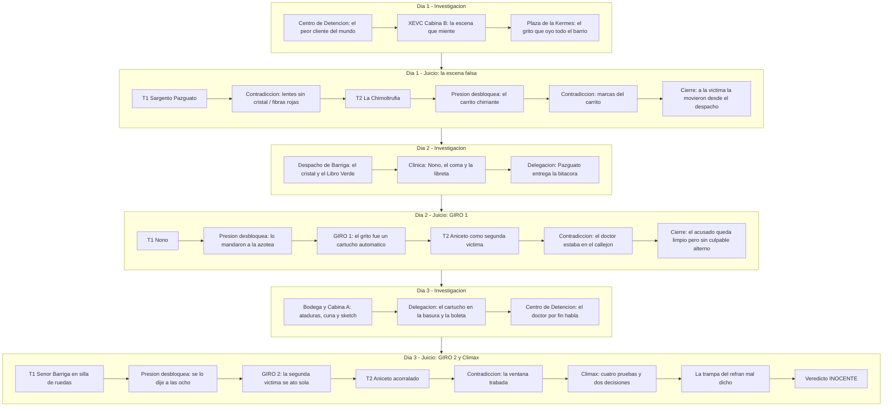

# Caso 3: El Juicio del Doctor Chapatín — La Noche del Grito
*(Turnabout of the Golden Voice)*

Documento de diseño narrativo, guión de diálogos y especificación técnica para el **Episodio 3** de **El Chapulín Colorado: Ace Attorney**.

**Duración objetivo:** ~2 horas (6 fases: 3 días de investigación + 3 días de juicio, ~20 min cada una).

---

## 1. Resumen General del Caso (Case Synopsis)

La noche del **15 de septiembre**, la vecindad entera celebra el Grito de Independencia en la **Plaza de la Kermés**. Desde el segundo piso del Edificio Barriga transmite la pequeña **Radiodifusora XEVC, "La Voz de la Vecindad"**, cuyas bocinas cubren toda la plaza.

A las **11:03 PM**, apenas termina el enlace del Grito, las bocinas escupen seis segundos de horror: la voz inconfundible del **Señor Barriga** gritando *"¡Doctor Chapatín, no! ¡Auxilio!"*, un golpe seco, y silencio.

Media vecindad corre escaleras arriba. En la **Cabina B** encuentran al Señor Barriga inconsciente en el suelo, con el cráneo abierto por un **Micrófono de Oro** de bronce macizo — y arrodillado sobre él, con las manos en su cabeza, al **Doctor Chapatín**, que esa misma tarde había discutido a gritos con la víctima delante de todo el edificio.

En la bodega aparece además **Don Aniceto Rebollar, "La Voz de Oro"**, el locutor estrella de la estación: amarrado, amordazado y medio asfixiado. Una segunda víctima.

Para el fiscal **Super Sam**, tres testigos, un grito transmitido a toda la plaza y un acusado atrapado con las manos sobre la víctima son *"the fastest case in history"*.

El Doctor Chapatín no ayuda: se niega a decir dónde estuvo entre las 10:40 y las 11:03, se niega a decir su edad, y golpea con su bolsa de papel a todo el que le pregunte. Aun así, alguien tenía que defenderlo.

*"¡Oh! Y ahora, ¿quién podrá defenderme?"* — refunfuñó el doctor, esperando que no llegara nadie.

Llegaron dos: **El Chapulín Colorado** y su abogado de cabecera, **Don Ramón (Lic. Monchito)**, que ya no debe catorce meses de renta sino quince.

Lo que empieza como un pleito de casero y inquilino se desenreda en tres días hasta convertirse en algo mucho peor: **un crimen grabado con seis horas de anticipación**.

---

## 2. Personajes (Dramatis Personae)

| Personaje | Rol en el Caso | Perfil y Comportamiento | Sprites / Poses Clave |
|---|---|---|---|
| **Don Ramón (Lic. Monchito)** | Abogado Defensor | Sagaz, callejero y sarcástico. En este caso litiga con el estómago vacío y con el casero en coma: si Barriga muere, nadie le cobra la renta... y eso le da un móvil que Super Sam le restriega toda la semana. | `donramon_idle`, `donramon_point`, `donramon_slam`, `donramon_shock`, `donramon_sweat`, `donramon_panic` |
| **El Chapulín Colorado** | Co-defensor / Investigador | Aporta antenitas, deducciones disparatadas y **refranes mal citados**. Su manía de destrozar dichos populares es, esta vez, el arma que gana el juicio. | `chapulin_idle`, `chapulin_point`, `chapulin_slam`, `chapulin_panic`, `chapulin_thinking` |
| **Super Sam** | Fiscal Acusador | *"Time is money!"*. Trae cronómetro y calculadora: cada aplazamiento le cuesta dinero y se lo descuenta al Sargento Pazguato. Defiende con uñas y dientes a la "segunda víctima". | `supersam_idle`, `supersam_point`, `supersam_slam`, `supersam_sweat`, `supersam_breakdown` |
| **Sargento Refugio Pazguato** | Policía Investigador (aliado) | **Rol tipo Gumshoe.** Enorme, leal, mal pagado y peor organizado. Contamina la escena el día 1, le descuentan el sueldo el día 2 y se redime el día 3 escarbando basura toda la noche. Le pasa pruebas a la defensa a escondidas. | `pazguato_idle`, `pazguato_saludo`, `pazguato_sweat`, `pazguato_decidido` |
| **Doctor Chapatín** | **Acusado** | Médico anciano, gruñón y tacaño. Golpea con su bolsa de papel a quien lo contradiga y se enfurece si le preguntan la edad. Calla su coartada por **secreto profesional**, aunque le cueste la cárcel. Es, además, el mejor perito forense del caso. | `chapatin_idle`, `chapatin_enojado`, `chapatin_bolsa`, `chapatin_sweat`, `chapatin_conmovido` |
| **Señor Barriga** | **Víctima** | Casero y dueño del edificio y de la estación. Descubrió un faltante de $40,000 en el Fondo de la Kermés. En coma los días 1 y 2; despierta el día 3 y declara en silla de ruedas. Testigo **honesto pero equivocado**. | `barriga_idle`, `barriga_vendado`, `barriga_shock`, `barriga_enojado` |
| **Don Aniceto Rebollar, "La Voz de Oro"** | Locutor estrella, tesorero de la kermés — **segunda víctima aparente** y **verdadero culpable** | 25 años al aire. Voz de terciopelo, modales impecables y una manía fatal: **corrige la dicción ajena sin poder evitarlo**. Adorado por toda la vecindad. Nadie lo sospecha porque a él también lo hallaron amarrado. | `aniceto_terciopelo`, `aniceto_thinking`, `aniceto_sweat`, `aniceto_panic`, `aniceto_breakdown` |
| **Ñoño** | Operador de consola de XEVC | Hijo del Señor Barriga. Miente sobre dónde estuvo durante el Grito — no por culpa, sino por miedo: esconde un problema del corazón que su papá desconoce y que el Doctor Chapatín le trata en secreto. | `nono_idle`, `nono_nervioso`, `nono_llorando` |
| **La Chimoltrufia** | Locutora de la sección de horóscopos | *"¡Como digo una cosa, digo otra!"*. Se contradice sola en cada frase; sus declaraciones **crecen cuando la presionan**. Detrás del desorden guarda el dato que rompe el día 1. | `chimoltrufia_idle`, `chimoltrufia_confundida`, `chimoltrufia_shock` |
| **Doña Florinda** | Encargada del puesto de la kermés | Presidenta del comité vecinal. Confirma que Barriga estaba vivo y coleando en la plaza a las 9:40 PM buscando a Quico. Sigue sin tolerar a la chusma. | `florinda_idle`, `florinda_angry`, `florinda_shock`, `florinda_fanning` |
| **Profesor Jirafales** | Maestro de ceremonias del Grito | Dio el Grito a las 11:00 PM en punto y llevó el programa minuto a minuto. Su libreto es la prueba que fecha el crimen. | `jirafales_idle`, `jirafales_smoking`, `jirafales_angry`, `jirafales_shock` |
| **El Juez** | Juez de la Corte | Bondadoso, influenciable y muy fan de la radio: se sabe de memoria el sketch semanal de XEVC. | `judge_neutral`, `judge_gavel`, `judge_thinking`, `judge_shock` |
| **Quico** *(sólo voz)* | Cameo | El "niño de cachetes muy grandes" que se perdió en la kermés a las 9:40 PM. Nunca aparece en pantalla; se le oye desde fuera de cuadro. | — (sin sprite) |

---

## 3. Cronología Real de los Hechos (Timeline)

> **Nota de coherencia física:** El **ventilador central de las cabinas** de XEVC está descompuesto desde agosto, así que las tres cabinas transmiten con la ventana trabada con una cuña de madera: desde adentro se oyen las bocinas de la plaza, y las bocinas de la plaza se cuelan en toda grabación. El **cable del micrófono de la Cabina B** lo enrolla el operador al terminar cada sesión (rutina, no sabotaje): quedó desconectado desde las 9:50 PM. La consola dispara **sola** el cartucho de "corte de estación" en el minuto programado por la hoja de programación (esa noche, 11:03 PM, al terminar el enlace del Grito). El piso de la Cabina B es linóleo gris; el del despacho, un tapete de lana roja.

```mermaid
timeline
    title Cronologia real de la Noche del Grito (15 de septiembre)
    6:00 PM : Abre la kermes en la plaza. XEVC transmite y sus bocinas cubren la explanada.
    7:00 PM : El Doctor Chapatin llega a grabar su seccion. Discute a gritos con Barriga por la renta del consultorio; lo oye todo el edificio y media plaza.
    8:00 PM : Barriga guarda el Libro Verde en la caja fuerte del despacho y le confia SOLO a Aniceto que faltan 40,000 pesos del Fondo de la Kermes y que dira el nombre al aire despues del Grito. Aniceto lo ve marcar la combinacion.
    9:30 PM : Aniceto entra a la Cabina A a grabar el sketch semanal "El Casero Cascarrabias" imitando la voz de Barriga. Chapatin entra a la Cabina B a grabar "La Salud es Primero".
    9:40 PM : Jirafales anuncia por las bocinas de la plaza que se perdio un nino de cachetes muy grandes. El anuncio se cuela por las ventanas trabadas y queda grabado en AMBAS cintas. En ese minuto exacto Aniceto graba el falso grito de auxilio con la voz de Barriga.
    9:50 PM : Chapatin termina y Nono le enrolla el cable del microfono de la Cabina B, como cada noche. Barriga sigue en la plaza ayudando a buscar a Quico.
    10:15 PM : Aniceto carga el falso grito en el cartucho 3 de corte de estacion, que la consola disparara sola a las 11:03 PM segun la hoja de programacion.
    10:40 PM : Chapatin se va furioso por la escalera de servicio al callejon.
    10:45 PM : En el callejon, Chapatin le aplica a Nono su inyeccion en secreto. Arriba, Aniceto entra al despacho, toma su propio Microfono de Oro del pedestal y golpea a Barriga en la sien derecha. Los lentes se rompen y un cristal rueda bajo el escritorio.
    10:47 PM : Aniceto abre la caja fuerte, arranca la hoja del 12 de septiembre del Libro Verde y la quema en el cenicero.
    10:50 PM : Sube a Barriga al carrito de discos y lo lleva por el pasillo hasta la Cabina B. Las ruedas engrasadas chirrian y dejan dos rayas negras paralelas en la alfombra. La Chimoltrufia lo oye desde la Cabina C y cree que es el conserje.
    10:53 PM : Acomoda la escena, deja el trofeo sobre la mesa de la consola y le encarga a Nono subir a la azotea a mover la antena a las once en punto.
    10:55 PM : Aniceto baja a la bodega, se ata las munecas con un cable de microfono y se amordaza con su propio panuelo de seda, anudado al frente.
    11:00 PM : Jirafales da el Grito. Truenan los cohetes. Nono esta en la azotea y la consola queda sola.
    11:03 PM : Termina el enlace y la consola dispara sola el cartucho 3. La voz de Barriga grita el nombre del doctor ante toda la plaza.
    11:04 PM : Chapatin, que estaba en la plaza, corre al edificio. El Sargento Pazguato corre tras el.
    11:06 PM : Pazguato y Nono hallan al doctor arrodillado dando primeros auxilios. Arresto inmediato.
    11:15 PM : Hallan a Aniceto atado en la bodega. Nadie lo trata como sospechoso: es una victima mas.
    11:20 PM : Pazguato acomoda el trofeo para la foto y se lleva por error el carrete de la Cabina A en vez del cartucho 3.
    11:30 PM : Barriga entra en coma. Lo trasladan a la clinica mas cercana, que resulta ser la del propio acusado.
```

---

## 4. Catálogo del Acta del Juicio (Court Record)

> Cada ficha indica **día de obtención**, **actualizaciones de descripción** y **dónde se presenta**. Ninguna prueba queda sin uso (ver §14, Auditoría de Cabos Sueltos).

| # | ID | Nombre | Descripción inicial | Actualizaciones (`updates`) | Se presenta en |
|---|---|---|---|---|---|
| 1 | `insignia_abogado` | Insignia de Abogado | La chapa del Licenciado Monchito. Sigue abollada, y ahora también empeñada dos veces. | — | Constante de la serie |
| 2 | `informe_medico` | Informe Médico de Barriga | Contusión en la sien derecha con una marca octagonal. En el cabello y el cuello hay **fibras rojas de lana**. Coma profundo. | — | D1-T1 (alt.) |
| 3 | `lentes_barriga` | Lentes Rotos de Barriga | Armazón hallado junto a la víctima. **Le falta el cristal derecho** y en la Cabina B no hay ni una esquirla de vidrio. | **D2:** el cristal apareció bajo el escritorio del despacho, sobre el tapete de lana roja. | D1-T1 |
| 4 | `microfono_oro` | Micrófono de Oro | Trofeo de bronce macizo de 4 kg con base octagonal. Hallado sobre la mesa de la consola (el sargento lo movió antes de fotografiarlo). Arma del delito. | **D2:** su pedestal de terciopelo está vacío en el despacho; es el premio por los **25 años al aire de Aniceto Rebollar**. · **D3:** estuvo empeñado desde junio y fue **desempeñado el 3 de septiembre pagando $12,000 en efectivo**. | Clímax E4 (alt.) |
| 5 | `bolsa_papel` | Bolsa de Papel del Doctor | La bolsa que el acusado suelta al arrodillarse. Dentro: una ampolleta vacía de cardiotónico y **una jeringa recién usada**. | — | D2-T2 (alt.) |
| 6 | `microfono_cabina` | Micrófono de la Cabina B | El micrófono de la cabina tiene el cable **enrollado y desconectado**; el operador lo desconecta al terminar cada sesión. | **D2:** la bitácora confirma que esa noche nada salió al aire desde la Cabina B. | D2-T1 (alt.) |
| 7 | `cinta_salud` | Cinta "La Salud es Primero" | La sección grabada por el acusado en la Cabina B de 9:30 a 9:50 PM. Aparentemente sin valor para el caso. | — | Clímax E2 |
| 8 | `marcas_carrito` | Marcas del Carrito de Discos | Dos rayas paralelas de grasa negra en la alfombra del pasillo, **del despacho a la Cabina B**. En una rueda quedó atorado un hilo del saco del Señor Barriga. | — | D1-T2 |
| 9 | `ventana_cabina` | Cuña de la Ventana | Cuña de madera y nota de mantenimiento: **el ventilador central lleva descompuesto desde agosto**, así que las tres cabinas graban con la ventana abierta. Adentro se oyen las bocinas de la plaza. | — | D3-T2 (alt.) |
| 10 | `libro_verde` | Libro Verde del Fondo | Libro de cuentas del Fondo de la Kermés. **Le arrancaron la hoja del 12 de septiembre**; sus cenizas estaban en el cenicero del despacho. | **D3:** el calcado a lápiz de la hoja siguiente revela: *"Faltan $40,000. Los retiros los firmó el tesorero. Se lo diré al aire."* | Clímax E4 (alt.) |
| 11 | `bitacora_transmision` | Bitácora de Transmisión | Registro de la noche. **23:03 — CORTE DE ESTACIÓN (CARTUCHO 3) — AUTOMÁTICO.** Además: 21:30-21:50 Cabina B (Dr. Chapatín) y 21:30-22:00 Cabina A ("El Casero Cascarrabias"). | — | D2-T1 |
| 12 | `receta_nono` | Libreta de Consultas de la Clínica | Asiento del 15 de septiembre, **10:50 PM**: aplicación de cardiotónico a un paciente registrado sólo con iniciales. Escrito de puño y letra del acusado. | — | D2-T2 |
| 13 | `programa_kermes` | Libreto de la Kermés | Minutario del Profesor Jirafales. **9:40 PM: aviso de niño extraviado ("cachetes muy grandes")** — se anunció una sola vez en toda la noche. | — | Clímax E1 |
| 14 | `ataduras_bodega` | Ataduras de la Bodega | El pañuelo de seda y el cable de micrófono que ataron a Aniceto. **El nudo de la mordaza quedó al frente, del lado izquierdo**; las muñecas no tienen marca alguna y el polvo del piso no muestra forcejeo. | — | D3-T1 |
| 15 | `cartucho_corte` | Cartucho de Corte de Estación | Cartucho rotulado "IDENTIFICACIÓN XEVC", rescatado de la basura por el Sargento Pazguato. | **D3:** contiene el grito de las 11:03. **Debajo de la voz se alcanza a oír el aviso del niño extraviado.** | D3-T2 |
| 16 | `cinta_sketch` | Cinta "El Casero Cascarrabias" | Sketch semanal de XEVC: un personaje que imita la voz del Señor Barriga y cierra siempre con *"¡Tenía que ser el Chavo del Ocho!"*. Se graba en la Cabina A. | — | Clímax E3 |
| 17 | `boleta_empeno` | Boleta de Empeño | Del Monte de Piedad: un micrófono de bronce empeñado en junio y **desempeñado el 3 de septiembre por $12,000 en efectivo**. Firma del titular: *A. Rebollar*. | — | Clímax E4 (alt.) |

---

## 5. Estructura General del Episodio (6 Fases / ~2 Horas)



---

## 6. Mecánicas Nuevas (Especificación Técnica)

### 6.1 Declaraciones desbloqueables por presión (`unlockedBy`)

Parte del testimonio **no existe** hasta que el jugador presiona la declaración correcta. Es el corazón del ritmo del caso: en dos testimonios la contradicción vive **dentro** de una declaración oculta, así que presionar deja de ser opcional.

```typescript
// src/types/Private/script.ts
export interface Statement {
  id: string;
  speaker: SpeakerName;
  pose?: PoseName;
  text: string;
  pressText?: DialogueLine[];
  contradiction?: ContradictionRule;
  /** Si está presente, la declaración sólo aparece tras presionar la declaración con ese id. */
  unlockedBy?: string;
}
```

Reglas:

1. `TrialController` deriva `visibleStatements()` filtrando `unlockedBy` contra un `Set<string>` de declaraciones ya presionadas. Toda la navegación (`nextStatement`, `prevStatement`, `renderCurrentStatement`, `handlePresentEvidence`) opera sobre la lista **visible**, no sobre `testimony.statements`.
2. La declaración desbloqueada se inserta en su **posición declarada** dentro del arreglo, para que el testimonio se lea natural al releerlo.
3. Al desbloquear: notificación `#game-notification` con *"El testigo ha añadido una declaración"*, `sfx: realization`, y el cursor salta a la declaración nueva.
4. El `Set` de presionadas vive en el snapshot de `TrialController` (`pressedStatementIds`) para sobrevivir a guardar/cargar y al cambio de idioma.
5. **Anti-atasco:** si el jugador acumula 2 presentaciones fallidas en un testimonio que tiene declaraciones ocultas, el Chapulín suelta una pista de una línea (*"¡Monchito! ¡A ese testigo hay que exprimirlo, no nomás oírlo!"*). No hay penalización por presionar.

### 6.2 Descripciones de prueba en varias etapas (`updates`)

Hoy `EvidenceItem` admite una sola revisión (`updatedDesc`). El Caso 3 necesita hasta **dos** revisiones sobre la misma prueba (el `microfono_oro` pasa de *arma* a *trofeo de Aniceto* a *trofeo desempeñado con dinero robado*).

```typescript
// src/types/Private/evidence.ts
export interface EvidenceItem {
  id: EvidenceId;
  name: string;
  icon: string;
  desc: string;
  /** Legado: equivalente a updates: [updatedDesc]. */
  updatedDesc?: string;
  /** Revisiones sucesivas; cada updateEvidence avanza una etapa. */
  updates?: string[];
}
```

Reglas:

1. `GameStateManager` guarda `evidenceUpdateStage: Record<EvidenceId, number>`; `updateEvidence` avanza una etapa y satura en la última.
2. `getEvidenceDescription(id)` devuelve `updates[stage - 1] ?? updatedDesc ?? desc`.
3. Si el jugador llega a una línea `updateEvidence` de una prueba que aún no tiene, se **añade** con la descripción de esa etapa (toast de alta), igual que hoy — nadie se bloquea por orden de visita.
4. El aviso de actualización reutiliza el toast y el `realization` existentes. Las etapas afectan la lógica: la etapa 4 del clímax sólo acepta `microfono_oro` **con las dos revisiones aplicadas**; sin ellas el trofeo es sólo un arma sin dueño.

### 6.3 Tercer día de juicio (encadenamiento de aplazamientos)

```typescript
export interface AdjournmentDefinition {
  nextLocation: LocationId;
  unlockLocations: LocationId[];
  requiredEvidence: EvidenceId[];
  trial: TrialDayScript;
  /** Encadena el siguiente día. El clímax sigue viviendo en script.trial.climax. */
  next?: AdjournmentDefinition;
}
```

- `gameState.trialDay` pasa a `1 | 2 | 3`; `beginTrialDay2()` se generaliza a `beginNextTrialDay()`.
- `TrialDayRouter.getActiveTrial(script, day)` recorre la cadena `adjournment.next` `day - 1` veces.
- `shouldAdjourn` es verdadero mientras exista un aplazamiento pendiente para el día actual.
- `CaseId` incorpora `'case3'`; `getCaseScript(lang, 'case3')`; botón `#btn-start-case3` y `?case=3`, `?case=3&trial`, `?case=3&trial=2`, `?case=3&trial=3` para depuración.

### 6.4 Pruebas requeridas por día (`checkTrialReadiness`)

| Día | `requiredEvidence` |
|---|---|
| 1 | `lentes_barriga`, `informe_medico`, `marcas_carrito`, `microfono_cabina`, `microfono_oro`, `cinta_salud` |
| 2 | `bitacora_transmision`, `receta_nono`, `libro_verde`, `programa_kermes` |
| 3 | `ataduras_bodega`, `cartucho_corte`, `cinta_sketch`, `boleta_empeno` |

`bolsa_papel` se obtiene **dentro** del juicio del día 1 (al presionar al Sargento), así que nunca es requisito de entrada.

---

## 7. Guión Detallado: Día 1 — Investigación

### Locación 1: Centro de Detención (`centro_detencion`, `bg_detention.jpg`)
- **Personaje**: Doctor Chapatín (`chapatin_enojado`, `chapatin_bolsa`).
- **Música**: `detention_center`.

```dialogue
[ENTRADA AL CENTRO DE DETENCIÓN]
NARRADOR: 16 de septiembre, 9:00 AM. Centro de Detención de la Ciudad.
DEFENSA (donramon_idle): Buenos días, doctor. Soy el Licenciado Monchito, su abogado defensor.
CHAPATIN (chapatin_enojado): ¡Yo no pedí abogado! ¡Los abogados son como las radiografías: carísimos y nunca se entiende nada!
CHAPULIN (chapulin_idle): ¡Calma, doctorcito! ¡Que no panda el cúnico! Venimos a ayudarlo.
CHAPATIN (chapatin_bolsa): ¡Y usted quién es, el del disfraz! [sfx: chipote]
NARRADOR: (El doctor le acomoda un bolsazo de papel al Chapulín en plena antenita.)
CHAPULIN (chapulin_panic): ¡Ay! ¡Se aprovechan de mi nobleza!
DEFENSA (donramon_sweat): (Ochenta años, dos kilos de mal humor y una bolsa de papel. Este cliente me va a salir más caro que la renta.)
```

#### Opciones de Diálogo (Talk):
1. **"¿Qué pasó anoche en la cabina?"**
   - **Chapatín**: *"Oí el grito por las bocinas de la plaza. Subí corriendo — bueno, corriendo lo que uno corre a mi edad, que no es de su incumbencia — y me lo encontré tirado. Le busqué el pulso y le empecé a dar primeros auxilios. Entonces entró el gendarme ese y me esposó por salvarle la vida a un hombre."*
   - **Don Ramón**: *"¿Movió usted el trofeo?"*
   - **Chapatín**: *"Lo quité de en medio para arrodillarme. ¡O querían que le hiciera masaje cardíaco haciendo equilibrio!"*
2. **"¿Dónde estuvo entre las 10:40 y las 11:03?"**
   - **Chapatín**: *"No le importa."*
   - **Don Ramón**: *"Doctor, con todo respeto, eso es exactamente lo que lo va a mandar veinte años a la cárcel."*
   - **Chapatín**: *"Entonces me voy veinte años. Un médico que suelta la lengua no es médico, es chismoso."*
   - **Chapulín**: *"(Monchito... está encubriendo a alguien.)"*
   - **Don Ramón**: *"(Y ese alguien es su paciente. Apunte, Chapulín: la coartada existe, pero está bajo secreto profesional.)"*
3. **"Sobre su pleito con el Señor Barriga"**
   - **Chapatín**: *"Me quería subir la renta del consultorio un cuarenta por ciento. Le grité. Él me gritó. Nos gritamos. Así llevamos once años y ninguno se ha muerto... hasta anoche."*
   - **Se desbloquea locación**: `cabina_radio`.

---

### Locación 2: XEVC — Cabina B (`cabina_radio`, `bg_cabina.jpg`)
- **Personajes**: Sargento Pazguato (`pazguato_saludo`), La Chimoltrufia (`chimoltrufia_idle`).
- **Música**: `investigation`.

```dialogue
[ENTRADA A LA RADIODIFUSORA]
NARRADOR: 16 de septiembre, 11:00 AM. Radiodifusora XEVC, segundo piso del Edificio Barriga.
PAZGUATO (pazguato_saludo): ¡A sus órdenes, mi Licenciado! Sargento Refugio Pazguato, para servir a usted y a la justicia.
DEFENSA (donramon_idle): ¿La fiscalía sabe que nos deja entrar?
PAZGUATO (pazguato_sweat): Ay, no... Y no le diga al Súper Sam, porque ya van tres quincenas que me descuenta. Pero es que yo... yo creo que el doctorcito no fue.
CHAPULIN (chapulin_idle): ¡Ese es el espíritu! ¡Síganme los buenos!
```

#### Puntos de Interés (Hotspots):
1. **Mesa de la consola (`hotspot_trofeo`)**
   - Un cerco de polvo y un trofeo de bronce macizo con base octagonal.
   - **Pazguato**: *"Ahí lo puse yo para la foto, se veía más ordenadito."*
   - **Don Ramón**: *"¿Que usted... lo puso? Sargento, eso se llama alterar la escena."*
   - **Se añade al acta**: `microfono_oro`.
2. **Piso y silueta de tiza (`hotspot_piso`)**
   - Linóleo gris, sin una sola gota de sangre ni esquirla de vidrio. Junto a la silueta, un armazón de lentes.
   - **Chapulín**: *"¡Mire, Monchito! ¡A estos lentes les falta un ojo!"*
   - **Don Ramón**: *"Falta el cristal derecho... y en toda esta cabina no hay ni un pedacito de vidrio. Interesante."*
   - **Se añade al acta**: `lentes_barriga`.
3. **Micrófono de la cabina (`hotspot_micro`)**
   - El cable está enrollado en ocho y desconectado de la pared.
   - **Chimoltrufia**: *"Ay, es que el muchacho lo desconecta cada noche al acabar. Como digo una cosa, digo otra: yo le digo que lo deje, y él lo enrolla."*
   - **Se añade al acta**: `microfono_cabina`.
4. **Ventana y ventilador (`hotspot_ventana`)**
   - La ventana está trabada con una cuña de madera; el ventilador central tiene un cartelito de "descompuesto" desde agosto.
   - **Chapulín**: *"¡Aquí se oye la feria como si estuviéramos en la feria!"*
   - **Don Ramón**: *"Anótelo, no vaya a ser."*
   - **Se añade al acta**: `ventana_cabina`.
5. **Estante de cintas (`hotspot_cintas`)**
   - **Se añade al acta**: `cinta_salud` (la sección que el acusado grabó de 9:30 a 9:50 PM).
   - **Don Ramón**: *"(Una cinta de consejos para la digestión. Dudo que esto le sirva de algo a nadie.)"*
6. **Alfombra del pasillo (`hotspot_pasillo`)**
   - Dos rayas paralelas de grasa negra que salen de la puerta del despacho y terminan en la Cabina B. En una de ellas, un hilo de casimir gris.
   - **Se añade al acta**: `marcas_carrito`.

#### Hablar con el Sargento Pazguato:
- **"El informe médico"** → **Se añade al acta**: `informe_medico`. Pazguato lo entrega doblado en cuatro dentro de una torta de frijoles.
- **"¿Quién más estaba en el edificio?"** → *"El joven Ñoño en la consola, la señora Chimoltrufia en la Cabina C, y don Aniceto... pobre don Aniceto, lo hallamos amarrado en la bodega. Al que le hicieron eso no le tembló la mano."*
- **Se desbloquea locación**: `plaza_kermes`.

---

### Locación 3: Plaza de la Kermés (`plaza_kermes`, `bg_kermes.jpg`)
- **Personajes**: Doña Florinda (`florinda_idle`), Profesor Jirafales (`jirafales_smoking`), Don Aniceto (`aniceto_terciopelo`).
- **Música**: `investigation`.

```dialogue
[ENTRADA A LA PLAZA]
NARRADOR: 16 de septiembre, 3:00 PM. Plaza de la Kermés, con los papeles de colores todavía colgados.
FLORINDA (florinda_angry): ¡Otra vez usted! ¿Ahora a quién defiende, a la chusma o a los caseros?
DEFENSA (donramon_idle): A un doctor de ochenta años, doña Florinda.
FLORINDA (florinda_idle): ...Setenta y nueve. Se lo pregunté una vez y casi me mata con la bolsa.
JIRAFALES (jirafales_smoking): Yo di el Grito a las once en punto, Licenciado. A las once y tres minutos, las bocinas de la estación transmitieron ese alarido espantoso. Lo oímos DOS MIL personas.
ANICETO (aniceto_terciopelo): Muy buenas tardes tengan todos ustedes... Aniceto Rebollar, veinticinco años al servicio de esta vecindad. Perdonen si aún hablo despacito: anoche estuve amordazado tres cuartos de hora.
CHAPULIN (chapulin_idle): ¡Pobre señor! Pero no se apure, que perro que ladra... no muerde, porque no puede hacer las dos cosas al mismo tiempo.
ANICETO (aniceto_thinking): Permítame, joven: es "perro que ladra no muerde". La dicción, ante todo. Veinticinco años corrigiendo micrófonos, ya es enfermedad.
DEFENSA (donramon_sweat): (Este señor corrige hasta a un superhéroe. Qué manía.)
```

> **PLANTE CLAVE:** la manía de Aniceto de corregir la dicción ajena se establece aquí, como chiste. Es el mecanismo exacto con el que el jugador lo desenmascara en el clímax. Debe repetirse una vez más el día 2.

#### Hechos que deja la plaza (sin prueba física):
- Barriga estaba **vivo y en la plaza a las 9:40 PM**, ayudando a buscar a Quico (Florinda y Jirafales lo confirman; se oye a Quico gritar fuera de cuadro: *"¡Cállate, cállate, que me desesperas!"*).
- Las bocinas de la plaza repiten **todo** lo que sale al aire.
- Aniceto es el hombre más querido del barrio. Nadie, ni el jugador, tiene por qué mirarlo dos veces.
- **Se habilita el juicio** (botón `#btn-inv-trial`) con las 6 pruebas requeridas del día 1.

---

## 8. Guión Detallado: Día 1 — Juicio (La escena que miente)

```dialogue
[APERTURA DEL JUICIO - DÍA 1]
JUEZ (judge_gavel): ¡Silencio en la sala! Se abre el juicio contra el Doctor Chapatín. [sfx: gavel, bgm: trial]
SUPER SAM (supersam_slam): Time is money, Your Honor! ¡Dos mil testigos oyeron a la víctima gritar el nombre del acusado! [sfx: desk_slam]
SUPER SAM (supersam_point): ¡Y noventa segundos después lo hallaron encima del cuerpo! ¡Pido veredicto antes de mi hora de la comida!
DEFENSA (donramon_slam): ¡PROTESTO! ¡Con permisito, dijo Monchito! [sfx: desk_slam]
DEFENSA (donramon_point): La defensa sostiene que en esa cabina no se cometió ningún crimen.
JUEZ (judge_shock): ¿Cómo que no...? ¡Si ahí estaba la víctima!
DEFENSA (donramon_idle): Ahí estaba la víctima, señor Juez. Que no es lo mismo.
```

### Testimonio 1: Sargento Pazguato — "El hallazgo en la Cabina B"
- **Testigo**: Sargento Pazguato (`pazguato_idle`). **BGM**: `cross_exam_moderato`.

```dialogue
[DECLARACIÓN DEL TESTIGO]
PAZGUATO (stmt1_1): A las 11:03 el grito de la víctima salió al aire y lo oímos hasta en la Plaza.
PAZGUATO (stmt1_2): Subí volando con el joven Ñoño y hallamos al doctor arrodillado sobre el señor Barriga.
PAZGUATO (stmt1_3): El arma, o sea el trofeo, estaba ahí mismito, tal y como lo dejó el criminal.
PAZGUATO (stmt1_4): En todo el segundo piso no había nadie más... nomás don Aniceto, amarrado en la bodega.
```

- **Presionar `stmt1_2`** → **desbloquea `stmt1_2b`**:
  - **Pazguato**: *"¡Ah! Y también estaba tirada la bolsa de papel del doctor. Adentro traía una ampolleta vacía y una jeringa recién usada."*
  - **Don Ramón**: *"¿Recién usada? Sargento, eso significa que el doctor inyectó a alguien poco antes de subir."*
  - **Super Sam**: *"O que pensaba inyectar a la víctima. Time is money, don't waste it!"*
  - **Se añade al acta**: `bolsa_papel`.
- **Presionar `stmt1_3`**:
  - **Pazguato** (`pazguato_sweat`): *"Bueno... es que para la foto se veía mejor acomodadito, y yo lo cambié de lugar antes de..."*
  - **Super Sam** (`supersam_slam`): *"YOUR SALARY IS CUT! ¡Otra quincena!"*
  - **Pazguato**: *"Con esta van cuatro, mi fiscal. A este paso yo le voy a deber a usted."*
- **CONTRADICCIÓN en `stmt1_3`** ("tal y como lo dejó el criminal"):
  - **Presentar**: `lentes_barriga` o `informe_medico`.
  - **Animación**: ¡PROTESTO! (`cutin: objection_protesto`, `sfx: whoosh`, `bgm: objection`).

```dialogue
[ÉXITO DE LA CONTRADICCIÓN 1]
DEFENSA (donramon_point): ¡PROTESTO! ¡Sargento, esa cabina no está como la dejó el criminal, porque el criminal nunca estuvo ahí!
DEFENSA (donramon_slam): ¡A estos lentes les falta el cristal derecho! Se rompieron con el golpe... ¿y dónde está el vidrio? ¡En esa cabina no hay ni una esquirla! [sfx: desk_slam]
JUEZ (judge_shock): ¡Cáspita! ¡Los lentes se rompieron en otra parte!
DEFENSA (donramon_point): Y hay más. El informe médico reporta FIBRAS ROJAS DE LANA en el cabello y el cuello de la víctima. El piso de la Cabina B es linóleo gris. ¡Ahí no hay una sola hebra roja!
SUPER SAM (supersam_sweat): Grrr... ¡Eso no prueba nada! ¡Pudieron caérsele antes!
DEFENSA (donramon_idle): ¿Las fibras del golpe, señor fiscal? Al Señor Barriga lo golpearon tirado sobre lana roja. Y después lo acostaron en linóleo gris.
JUEZ (judge_thinking): Si eso es cierto, alguien trasladó a la víctima... ¿pero cómo? ¡Ese hombre pesa lo que dos hombres!
```

### Testimonio 2: La Chimoltrufia — "El pasillo durante el Grito"
- **Testigo**: La Chimoltrufia (`chimoltrufia_idle`). **BGM**: `cross_exam_allegro`.

```dialogue
[DECLARACIÓN DEL TESTIGO]
CHIMOLTRUFIA (stmt2_1): Yo estaba grabando los horóscopos en la Cabina C, ¡como digo una cosa, digo otra!
CHIMOLTRUFIA (stmt2_2): A las 11:03 oí el grito del señor Barriga por la bocinita del pasillo.
CHIMOLTRUFIA (stmt2_3): Y por ese pasillo no pasó nadie en toda la noche, más que el doctorcito, que se fue echando pestes a las 10:40.
CHIMOLTRUFIA (stmt2_4): Por eso yo digo que fue él... aunque también digo que quién sabe.
```

- **Presionar `stmt2_1`**: *"Los horóscopos los grabo yo solita porque nadie me quiere ayudar. Ah, y salieron muy bonitos: dije que a los Piscis les iba a ir espantoso, y mire nomás."*
- **Presionar `stmt2_3`** → **desbloquea `stmt2_3b`**:
  - **Chimoltrufia**: *"Bueno, pasar-pasar nadie... pero como a las once menos cuarto oí rechinar las ruedas del carrito de los discos. Ha de haber sido el conserje llevando discos, ¡bien cargadito que iba!"*
  - **Don Ramón**: *"(Ahí está. A las 10:45 alguien empujaba algo pesado por ese pasillo... y el doctor ya se había ido a las 10:40.)"*
- **CONTRADICCIÓN en `stmt2_3b`** ("ha de haber sido el conserje llevando discos"):
  - **Presentar**: `marcas_carrito`.
  - **Animación**: ¡TOMA ESO! (`cutin: objection_toma_eso`, `sfx: whoosh`, `bgm: pursuit`).

```dialogue
[ÉXITO DE LA CONTRADICCIÓN 2 — CIERRE DEL DÍA 1]
DEFENSA (donramon_point): ¡TOMA ESO! ¡Ese carrito no llevaba discos!
DEFENSA (donramon_slam): ¡Estas dos rayas de grasa salen de la puerta del DESPACHO y terminan en la Cabina B! ¡Y en una rueda quedó atorado un hilo del saco del Señor Barriga! [sfx: desk_slam]
CHIMOLTRUFIA (chimoltrufia_shock): ¡Ay, qué la canción! ¿Entonces lo que iba en el carrito era...?
CHAPULIN (chapulin_slam): ¡Era el señor Barriga! ¡Lo pasearon por el pasillo como si fuera un long play! [sfx: desk_slam]
SUPER SAM (supersam_sweat): Objection! ¡El acusado pudo haberlo movido él mismo!
DEFENSA (donramon_point): ¿En noventa segundos, señor fiscal? Entre el grito de las 11:03 y el arresto de las 11:06 hay hora y media de minutos... digo, ¡hay minuto y medio! ¡Un anciano no abre una caja fuerte, golpea a un hombre, lo sube a un carrito, lo pasea cincuenta metros y lo acuesta en minuto y medio!
JUEZ (judge_shock): ¡La defensa tiene razón! ¡Al Señor Barriga lo atacaron en el despacho y lo trasladaron a la cabina!
SUPER SAM (supersam_slam): Then he did it EARLIER! ¡Y montó la escena para fingir la hora! [sfx: desk_slam]
JUEZ (judge_gavel): Suficiente. Ordeno sellar y registrar el despacho del Señor Barriga. ¡Se aplaza la sesión veinticuatro horas! [sfx: gavel]
```

---

## 9. Guión Detallado: Día 2 — Investigación

### Locación 1: Despacho del Señor Barriga (`despacho_barriga`, `bg_despacho.jpg`)
- **Personaje**: Don Aniceto (`aniceto_terciopelo`, `aniceto_thinking`). **Música**: `suspense`.

```dialogue
[ENTRADA AL DESPACHO]
NARRADOR: 17 de septiembre, 9:30 AM. Despacho de la administración, con sellos judiciales en la puerta.
ANICETO (aniceto_terciopelo): Adelante, Licenciado. Me pidieron abrir yo, por ser el tesorero de la kermés... aunque le confieso que me tiemblan las manos al entrar aquí.
DEFENSA (donramon_idle): ¿Usted lleva las cuentas del fondo?
ANICETO (aniceto_terciopelo): Las llevo, las firmo y las lloro. Veinticinco años. Esta estación se sostiene con cariño y con cables amarrados.
CHAPULIN (chapulin_thinking): ¡Qué bárbaro! Con razón dicen que el que mucho abarca... poco aprieta el cinturón.
ANICETO (aniceto_thinking): "El que mucho abarca, poco aprieta", joven. Sin cinturón. Discúlpeme, es que no puedo evitarlo.
```

> **SEGUNDO PLANTE:** la corrección compulsiva se repite. El jugador ya vio dos veces que Aniceto **no puede** dejar pasar una frase mal dicha.

#### Puntos de Interés:
1. **Bajo el escritorio (`hotspot_escritorio`)**: sobre el tapete de lana roja, un cristal de lente. → **`updateEvidence: lentes_barriga`**.
   - **Chapulín**: *"¡Aquí está el ojo que le faltaba a los lentes!"*
   - **Don Ramón**: *"Y el tapete es de lana roja. Las fibras del informe médico salieron de aquí. Esta es la escena del crimen de verdad."*
2. **Pedestal de terciopelo (`hotspot_pedestal`)**: un pedestal vacío con un cerco de polvo del tamaño exacto de la base octagonal del trofeo. La placa dice: *"A Aniceto Rebollar, 25 años de La Voz de Oro"*. → **`updateEvidence: microfono_oro`** (etapa 1).
   - **Aniceto** (`aniceto_thinking`): *"...Sí. Es mío. Qué cosa tan fea, que me lo hayan usado para eso."*
   - **Don Ramón**: *"(Su trofeo estaba en el despacho. Y apareció en la cabina. O sea que subió al carrito junto con el señor Barriga.)"*
3. **Caja fuerte y cenicero (`hotspot_caja`)**: la caja está abierta, sin dinero adentro; el Libro Verde tiene arrancada la hoja del 12 de septiembre y en el cenicero hay ceniza de papel reciente. → **Se añade al acta**: `libro_verde`.
   - **Chapulín**: *"¡Se robaron una hoja y se la fumaron!"*
   - **Don Ramón**: *"Se la quemaron, Chapulín. Alguien no quería que se leyera lo del 12 de septiembre... y ese alguien sabía la combinación."*
- **Se desbloquea locación**: `clinica_chapatin`.

---

### Locación 2: Clínica del Doctor Chapatín (`clinica_chapatin`, `bg_clinica.jpg`)
- **Personajes**: Ñoño (`nono_nervioso`), Doña Florinda, Profesor Jirafales. **Música**: `detention_center`.

```dialogue
[ENTRADA A LA CLÍNICA]
NARRADOR: 17 de septiembre, 12:00 PM. Clínica del Doctor Chapatín — la más cercana al edificio, y por eso trasladaron aquí a la víctima.
NONO (nono_nervioso): Mi papi sigue dormido... Dicen que a lo mejor despierta, y a lo mejor no.
DEFENSA (donramon_idle): Joven Ñoño, ¿usted estuvo toda la noche en la consola?
NONO (nono_nervioso): ¡Sí! ¡Toda! ¡Todita! ¡No me moví ni un segundito!
CHAPULIN (chapulin_thinking): (Monchito, ese muchacho dijo "todita" y le sudaron hasta los cachetes.)
JIRAFALES (jirafales_idle): Licenciado, tenga usted mi libreto de la kermés. Ahí está minuto por minuto lo que se anunció por las bocinas.
DEFENSA (donramon_idle): ¿Minuto por minuto, profesor?
JIRAFALES (jirafales_angry): ¡¡¡TA-TA-TA-TA-TAAAAAA!!! ¡Un maestro de ceremonias sin minutario es un charlatán con micrófono!
```

- **Se añade al acta**: `programa_kermes` (incluye el aviso de las 9:40 PM del niño extraviado).
- **Punto de interés — Libreta de consultas (`hotspot_libreta`)**: en el mostrador, la libreta del doctor. Asiento del 15 de septiembre, 10:50 PM: *"Cardiotónico aplicado. Paciente: N.B. Cobro: nada."*
  - **Chapulín**: *"¡Diez cincuenta de la noche! ¡El doctor estaba curando a alguien mientras chirriaba el carrito!"*
  - **Don Ramón**: *"Y no le cobró. Por eso el viejo prefiere la cárcel: no está tapando a un cómplice, está tapando a un paciente."*
  - **Se añade al acta**: `receta_nono`.
  - **Ñoño** (`nono_llorando`): *"¡No diga nada, por favor! ¡Si mi papi se entera de lo de mi corazón se muere del susto!"*
  - **Don Ramón**: *"Su papá está en coma, muchacho. Del susto ya no se muere. De un veredicto injusto, mi cliente sí."*
- **Se desbloquea locación**: `delegacion`.

---

### Locación 3: Delegación de Policía (`delegacion`, `bg_delegacion.jpg`)
- **Personaje**: Sargento Pazguato (`pazguato_sweat`). **Música**: `investigation`.

```dialogue
[ENTRADA A LA DELEGACIÓN]
NARRADOR: 17 de septiembre, 5:00 PM. Delegación de Policía, escritorio del fondo, el que le tocó al sargento.
PAZGUATO (pazguato_sweat): Pásele, Licenciado. ¿Gusta? Es torta de frijoles. Ya nomás como de frijoles porque el fiscal me dejó la quincena en catorce pesos.
DEFENSA (donramon_idle): No, gracias, sargento. ¿Qué recogió usted de la cabina de control?
PAZGUATO (pazguato_decidido): Aquí traigo la bitácora de transmisión, mi Licenciado. Ahí apunta la consola todo lo que sale al aire, solita.
DEFENSA (donramon_shock): ...Sargento. Aquí dice que a las 23:03 salió al aire un CORTE DE ESTACIÓN AUTOMÁTICO. Cartucho tres.
PAZGUATO (pazguato_sweat): Sí, ¿verdad? Yo también le entendí re' poquito.
CHAPULIN (chapulin_point): ¡Monchito! ¡Eso quiere decir que a las 11:03 la consola no estaba transmitiendo a nadie... estaba tocando una grabación!
DEFENSA (donramon_panic): ¡CHANFLE! ¡El grito que oyó toda la plaza estaba enlatado!
```

- **Se añade al acta**: `bitacora_transmision`. → **`updateEvidence: microfono_cabina`** (la bitácora confirma que nada salió al aire desde la Cabina B).
- **Pazguato confiesa su segundo error**: se llevó "el carrete grandote" de la Cabina A y no los cartuchos. El cartucho 3 sigue perdido en algún lado de la estación.
- **Se habilita el juicio del día 2**.

---

## 10. Guión Detallado: Día 2 — Juicio (GIRO 1: El grito enlatado)

```dialogue
[REAPERTURA - DÍA 2]
JUEZ (judge_gavel): Se reanuda la sesión. El registro del despacho confirmó lo que dijo la defensa: ahí se cometió la agresión. [sfx: gavel]
SUPER SAM (supersam_slam): Correction, Your Honor! ¡Confirma que ahí se cometió, no QUIÉN la cometió! [sfx: desk_slam]
SUPER SAM (supersam_point): ¡El acusado tuvo desde las 10:40 hasta las 11:03! ¡Time enough to be money!
DEFENSA (donramon_slam): La defensa llama al operador de la consola de XEVC. [sfx: desk_slam]
```

### Testimonio 1: Ñoño — "Yo estaba en la consola"
- **Testigo**: Ñoño (`nono_nervioso`). **BGM**: `cross_exam_moderato`.

```dialogue
[DECLARACIÓN DEL TESTIGO]
NONO (stmt3_1): Yo soy el operador. Esa noche manejé la consola durante todo el Grito.
NONO (stmt3_2): A las 11:03 el grito de mi papi entró por el micrófono de la Cabina B y salió al aire.
NONO (stmt3_3): Nadie más tocó la consola. ¡Nadie, se los juro!
NONO (stmt3_4): Luego subimos todos... y el doctor estaba ahí, con mi papi en el suelo.
```

- **Presionar `stmt3_1`** → **desbloquea `stmt3_1b`**:
  - **Ñoño** (`nono_llorando`): *"...Bueno. A las once en punto don Aniceto me mandó a la azotea a mover la antena, porque el Grito se estaba oyendo con estática. Bajé hasta las 11:06."*
  - **Don Ramón**: *"¿Entonces la consola estuvo SOLA justo en el minuto del grito?"*
  - **Super Sam**: *"Objection! ¡Eso favorece a la fiscalía! ¡Una consola sola es una consola que cualquiera pudo usar!"*
  - **Don Ramón**: *"(O una consola que no necesitaba a nadie...)"*
- **Presionar `stmt3_3`**: Ñoño se derrumba, insiste sudando; el Juez le pide calma; Don Ramón anota el temblor.
- **CONTRADICCIÓN en `stmt3_2`** ("entró por el micrófono de la Cabina B"):
  - **Presentar**: `bitacora_transmision` o `microfono_cabina`.
  - **Animación**: ¡PROTESTO! (`cutin: objection_protesto`, `sfx: whoosh`, `bgm: objection`).

```dialogue
[ÉXITO — GIRO 1: EL GRITO ENLATADO]
DEFENSA (donramon_point): ¡PROTESTO! ¡Ese grito NO entró por ningún micrófono!
DEFENSA (donramon_slam): ¡La bitácora de la propia consola lo dice con todas sus letras: 23:03, CORTE DE ESTACIÓN, CARTUCHO 3, AUTOMÁTICO! [sfx: desk_slam]
JUEZ (judge_shock): ¡¿Automático?! ¡¿Quiere decir que la máquina lo disparó sola?!
DEFENSA (donramon_point): Sola, señor Juez. Y por si quedara duda: el micrófono de la Cabina B tenía el cable enrollado y desconectado desde las diez para las diez de la noche. ¡De esa cabina no salió al aire ni un suspiro!
NARRADOR: (La sala estalla. El Juez golpea el mazo cuatro veces y nadie lo oye.) [sfx: gavel]
CHAPULIN (chapulin_slam): ¡Lo sospeché desde un principio! ¡El grito que oyeron dos mil personas era una GRABACIÓN! [sfx: desk_slam]
SUPER SAM (supersam_sweat): ¡¿A canned scream?! But... but that means...
DEFENSA (donramon_idle): Significa dos cosas, señor fiscal. Una: nadie sabe a qué hora atacaron realmente al Señor Barriga. Y dos, la fea...
DEFENSA (donramon_slam): ¡Alguien grabó un grito de auxilio con la voz de la víctima ANTES de que la víctima lo necesitara! ¡Esto no fue un pleito, señor Juez: esto se ensayó! [sfx: desk_slam]
JUEZ (judge_shock): ¡Premeditación! ¡Alguien planeó esto con horas de anticipación!
SUPER SAM (supersam_point): ¡Y ese alguien tuvo una cabina de grabación toda la noche a su disposición! ¡EL ACUSADO! ¡Llamo a declarar a la otra víctima, don Aniceto Rebollar!
```

### Testimonio 2: Don Aniceto Rebollar — "Lo que sufrí en la bodega"
- **Testigo**: Don Aniceto (`aniceto_terciopelo`). **BGM**: `cross_exam_allegro`.
- **Nota de tono**: en todo este testimonio Aniceto es tratado por la corte, por Super Sam y por la defensa **como víctima**. Nadie insinúa lo contrario, y Don Ramón lo dice en voz alta.

```dialogue
[DECLARACIÓN DEL TESTIGO]
ANICETO (stmt4_1): A las 10:55 bajé a la bodega por los discos del aniversario.
ANICETO (stmt4_2): Alguien me golpeó por la espalda, me ató y me amordazó. No alcancé a ver nada.
ANICETO (stmt4_3): Pero oí sus pasos: cortitos, arrastrados... pasos de persona muy mayor.
ANICETO (stmt4_4): Cuando el sargento me halló yo seguía atado. Casi me ahogo, señor Juez.
```

- **Presionar `stmt4_2`** → **desbloquea `stmt4_2b`**:
  - **Aniceto**: *"Me amordazaron con mi propio pañuelo de seda, ese que siempre llevo al cuello. Me lo quitaron y me lo metieron en la boca. Qué humillación."*
  - **Don Ramón**: *"(¿Su propio pañuelo? Sargento... ¿esas ataduras siguen tiradas en la bodega?)"*
  - **Pazguato** *(desde la galería, en voz baja)*: *"Uy. Sí. Nadie las recogió."*
- **Presionar `stmt4_4`**: Super Sam protesta indignado, el Juez pide respeto para "la segunda víctima de este monstruo" y Don Ramón se disculpa sinceramente. La corte cierra filas alrededor de Aniceto.
- **CONTRADICCIÓN en `stmt4_3`** ("pasos de persona muy mayor"):
  - **Presentar**: `receta_nono` o `bolsa_papel`.
  - **Animación**: ¡TOMA ESO! (`cutin: objection_toma_eso`, `sfx: whoosh`, `bgm: pursuit`).

```dialogue
[ÉXITO DE LA CONTRADICCIÓN 4]
DEFENSA (donramon_point): ¡TOMA ESO! ¡Esos pasos no pudieron ser los del Doctor Chapatín!
DEFENSA (donramon_slam): ¡Esta es la libreta de consultas de su clínica! ¡15 de septiembre, 10:50 de la noche: cardiotónico aplicado, paciente N.B., cobro: NADA! [sfx: desk_slam]
SUPER SAM (supersam_slam): ¡Un papel escrito por el propio acusado! ¡Objection!
DEFENSA (donramon_point): ¡Entonces vea su bolsa de papel, la que el sargento levantó de la escena! ¡Ampolleta vacía y jeringa recién usada! ¡Mi cliente venía de inyectar a alguien en el callejón, señor fiscal, no de asaltar una caja fuerte!
NONO (nono_llorando): ¡ERA YO! [sfx: realization]
NARRADOR: (El joven Ñoño se pone de pie en la galería, con la cara empapada.)
NONO (nono_llorando): ¡Era yo! ¡Yo bajé al callejón a las diez cuarenta y cinco porque me faltaba el aire! ¡El doctor lleva un año inyectándome a escondidas y sin cobrarme para que mi papi no se entere de que estoy malo del corazón!
CHAPATIN (chapatin_enojado): ¡Muchacho imprudente! ¡Eso era secreto profesional!
CHAPATIN (chapatin_conmovido): ...Y baje la voz, que se le va a subir la presión.
JUEZ (judge_shock): ¡Entonces el acusado estaba FUERA del edificio durante el traslado del cuerpo!
DEFENSA (donramon_idle): Recapitulemos, señor Juez. Al Señor Barriga lo golpearon en el despacho. Lo pasearon en un carrito a las 10:45. Y a las 10:45 mi cliente estaba en el callejón, con una jeringa en una mano y un paciente en la otra.
SUPER SAM (supersam_sweat): ¡G-grrrk!
ANICETO (aniceto_terciopelo): Yo me alegro, Licenciado. De verdad. Pero entonces... el que me atacó a mí sigue suelto, y ni usted ni yo sabemos quién es.
JUEZ (judge_thinking): La defensa ha desmontado la acusación... pero sin un culpable alternativo, este tribunal no puede absolver.
JUEZ (judge_gavel): Ordeno registrar la bodega y localizar ese cartucho tres. ¡Se aplaza la sesión veinticuatro horas! [sfx: gavel]
SUPER SAM (supersam_point): ¡Sargento Pazguato! ¡Si mañana no aparece ese cartucho, le descuento la quincena, el aguinaldo y la torta!
PAZGUATO (pazguato_decidido): ...Sí, mi fiscal. Aunque tenga que meterme al bote de basura completito.
```

---

## 11. Guión Detallado: Día 3 — Investigación

### Locación 1: Bodega y Cabina A de XEVC (`bodega_radio`, `bg_bodega.jpg`)
- **Música**: `suspense`.

#### Puntos de Interés:
1. **Ataduras en el piso (`hotspot_ataduras`)**: el pañuelo de seda y el cable de micrófono, tal como quedaron. → **Se añade al acta**: `ataduras_bodega`.
   - **Chapulín**: *"¡Monchito! ¡El nudo de la mordaza está por delante, del lado izquierdo!"*
   - **Don Ramón**: *"Si a usted lo amordaza alguien parado a sus espaldas, ¿dónde le queda el nudo?"*
   - **Chapulín**: *"¡Atrás! ¡Todos mis movimientos están fríamente calculados!"*
   - **Don Ramón**: *"(Adelante y a la izquierda. Como se amarra uno la corbata frente al espejo.)"*
2. **Polvo del piso (`hotspot_polvo`)**: una marca limpia de alguien sentándose despacio. Ni un arrastrón, ni una patada, ni una marca de forcejeo. Las muñecas del testigo, según el parte médico, no tenían una sola rozadura.
3. **Estante del aniversario (`hotspot_discos`)**: los discos del aniversario siguen ahí, **con el fleje de la caja sin abrir desde el lunes**.
   - **Don Ramón**: *"Dijo que bajó por estos discos. Nadie ha tocado esta caja en cinco días."*
   - **Chapulín**: *"¡Chanfle! ¿Entonces a qué bajó?"*
   - **Don Ramón**: *"A que lo encontraran, Chapulín. Bajó a que lo encontraran."*
4. **Cabina A, ventana (`hotspot_cabina_a`)**: la misma cuña de madera, el mismo ventilador muerto. Confirma `ventana_cabina`.
5. **Estante de cintas de la Cabina A (`hotspot_sketch`)**: la cinta del sketch semanal. → **Se añade al acta**: `cinta_sketch`.
   - **Chapulín** *(la escucha)*: *"¡Es la voz del señor Barriga! ¡Está vivo y hablando!"*
   - **Don Ramón**: *"Es el sketch de los jueves, Chapulín. Un actor imitando al casero. Lleva años al aire y a toda la vecindad le da risa."*
   - **Don Ramón**: *"(...Un actor imitando al casero. Un actor. Imitando. Al casero.)"* [sfx: realization]
- **Se desbloquea locación**: `delegacion`.

---

### Locación 2: Delegación de Policía (`delegacion`, `bg_delegacion.jpg`)
- **Personaje**: Sargento Pazguato (`pazguato_decidido`). **Música**: `investigation`.

```dialogue
[ENTRADA A LA DELEGACIÓN]
NARRADOR: 18 de septiembre, 8:00 AM. El sargento no se ha cambiado de uniforme. Ni piensa hacerlo.
PAZGUATO (pazguato_decidido): ¡Mi Licenciado! ¡Toda la noche en los tambos de basura de la estación! ¡Ocho horas! ¡Con estas manitas!
CHAPULIN (chapulin_point): ¡Y con mis antenitas de vinil! ¡Vibraron re' feo sobre el tambo del callejón!
PAZGUATO (pazguato_decidido): Ahí estaba, mi Licenciado. Debajo de las cáscaras. Cartucho tres.
NARRADOR: (Ponen el cartucho en la máquina. La sala se queda muda.) [sfx: realization]
BARRIGA (voz grabada): ¡Doctor Chapatín, no! ¡Auxilio! ...
DEFENSA (donramon_shock): Otra vez. Súbanle a lo que se oye ATRÁS de la voz.
NARRADOR: (Debajo del grito, lejano y rasposo, se alcanza a oír una bocina de plaza:) "...se ha perdido un niño de cachetes muy grandes..."
CHAPULIN (chapulin_panic): ¡Ese es el aviso de Quico! ¡El del libreto del Profesor! ¡Nueve cuarenta de la noche!
DEFENSA (donramon_slam): A las 9:40 el señor Barriga estaba en la plaza, vivo, ayudando a buscar al niño. ¡Delante de doña Florinda y del Profesor!
DEFENSA (donramon_point): O sea que a las 9:40, mientras el señor Barriga buscaba a Quico en la plaza... ALGUIEN estaba grabando su voz en una cabina.
PAZGUATO (pazguato_sweat): ¿Y eso qué significa, mi Licenciado?
DEFENSA (donramon_idle): Que la voz de ese cartucho, sargento, nunca fue la del señor Barriga.
```

- **`updateEvidence: cartucho_corte`** (contiene el grito + el aviso del niño extraviado por debajo).
- **Pazguato entrega también**: `boleta_empeno` (rastreó el trofeo en el Monte de Piedad) → **`updateEvidence: microfono_oro`** (etapa 2).
  - **Pazguato**: *"Y ya encarrerado me fui al Monte de Piedad, mi Licenciado. Ese micrófono estuvo empeñado desde junio. Lo desempeñaron el 3 de septiembre. Doce mil pesos. En efectivo."*
  - **Don Ramón**: *"¿Y de dónde saca doce mil pesos en efectivo un locutor de radio de barrio?"*
- **Chapulín hace el calcado a lápiz** sobre la hoja siguiente del `libro_verde` → **`updateEvidence: libro_verde`**:
  - **Chapulín**: *"¡Con el lapicito de lado, como en la escuela! ¡Ya salió! Dice: 'Faltan cuarenta mil. Los retiros los firmó el tesorero. Se lo diré al aire.'"*
- **Se desbloquea locación**: `centro_detencion`.

---

### Locación 3: Centro de Detención (`centro_detencion`, `bg_detention.jpg`)
- **Personaje**: Doctor Chapatín (`chapatin_conmovido`). **Música**: `detention_center`.

```dialogue
[VISITA FINAL AL ACUSADO]
DEFENSA (donramon_idle): Doctor, su paciente despertó. El señor Barriga abrió los ojos esta mañana.
CHAPATIN (chapatin_conmovido): ...Ajá. Bueno. Ya era hora, con lo que cobro yo por cama.
NARRADOR: (Se seca los ojos con la bolsa de papel y jura que es el polvo.)
DEFENSA (donramon_point): Doctor, necesito su opinión profesional sobre una cosa. Un hombre amarrado tres cuartos de hora, forcejeando...
CHAPATIN (chapatin_enojado): ...tendría las muñecas en carne viva. Y las rodillas raspadas. Y la garganta hecha trizas de gritar. Yo revisé a ese señor esa misma noche, jovencito: no tenía ni el rastro de una rozadura. Ni una.
DEFENSA (donramon_shock): ¿Y por qué no lo dijo antes?
CHAPATIN (chapatin_idle): ¡Porque nadie me preguntó! ¡Todos estaban muy ocupados esposándome!
CHAPULIN (chapulin_point): ¡Monchito! ¡Ya tenemos con qué!
DEFENSA (donramon_idle): Tenemos cómo, Chapulín. Todavía nos falta demostrar QUIÉN. Y eso... eso lo va a decir el propio señor Barriga sin darse cuenta.
```

- **Se habilita el juicio del día 3.**

---

## 12. Guión Detallado: Día 3 — Juicio (GIRO 2 y Clímax)

```dialogue
[REAPERTURA - DÍA 3]
JUEZ (judge_gavel): Se reanuda la sesión. La corte ha sido informada de que la víctima recuperó el conocimiento. [sfx: gavel, bgm: trial]
SUPER SAM (supersam_slam): ¡Y la fiscalía lo llama de inmediato al estrado! ¡Que la víctima señale a su agresor y nos vamos a comer! [sfx: desk_slam]
DEFENSA (donramon_idle): (Que hable. Es justo lo que necesito.)
```

### Testimonio 1: Señor Barriga — "El nombre que nunca dije"
- **Testigo**: Señor Barriga en silla de ruedas (`barriga_vendado`). **BGM**: `cross_exam_moderato`.
- **Nota de tono**: Barriga es un testigo **honesto**. Todo lo que dice es verdad. Su error no es mentir: es confiar.

```dialogue
[DECLARACIÓN DEL TESTIGO]
BARRIGA (stmt5_1): El 12 de septiembre descubrí que faltaban cuarenta mil pesos del Fondo de la Kermés.
BARRIGA (stmt5_2): Los retiros llevaban firma de tesorería, así que decidí decir el nombre al aire después del Grito.
BARRIGA (stmt5_3): No se lo dije a nadie... a nadie, salvo a una persona de toda mi confianza.
BARRIGA (stmt5_4): Y esa persona es inocente: a esa persona también la atacaron y la dejaron amarrada en la bodega.
```

- **Presionar `stmt5_1`**: *"¡Cuarenta mil pesos! ¡Eso es la renta de once meses! ¡Digo, de quince meses, y usted sabe muy bien de quién estoy hablando, Licenciado!"* — Don Ramón suda.
- **Presionar `stmt5_3`** → **desbloquea `stmt5_3b`**:
  - **Barriga**: *"Se lo dije a las ocho de la noche, en mi despacho, mientras guardaba el Libro Verde en la caja fuerte. Me acuerdo clarito porque él me detuvo la puerta mientras yo marcaba la combinación."*
  - **Don Ramón** *(bajito)*: *"(Una sola persona sabía del faltante. Una sola persona vio la combinación. Y esa persona apareció amarrada.)"*
  - **Chapulín**: *"(¡Monchito! ¡Pero si esa persona es la víctima número dos!)"*
  - **Don Ramón**: *"(Por eso mismo, Chapulín. Por eso a nadie se le ocurrió mirarla.)"*
- **CONTRADICCIÓN en `stmt5_4`** ("a esa persona también la atacaron"):
  - **Presentar**: `ataduras_bodega`.
  - **Animación**: ¡PROTESTO! (`cutin: objection_protesto`, `sfx: whoosh`, `bgm: pursuit`).

```dialogue
[ÉXITO — GIRO 2: LA SEGUNDA VÍCTIMA]
DEFENSA (donramon_point): ¡PROTESTO! ¡Señor Juez, antes de continuar quiero que conste algo!
DEFENSA (donramon_idle): Durante tres días esta defensa NO ha señalado a ningún testigo. Ni al sargento, ni a la señora Chimoltrufia, ni al muchacho. Yo no vine a repartir culpas: vine a leer pruebas.
DEFENSA (donramon_slam): Y estas pruebas dicen una cosa que no me da ningún gusto decir. [sfx: desk_slam]
DEFENSA (donramon_point): ¡Estas son las ataduras de la bodega! ¡El nudo de la mordaza quedó AL FRENTE, del lado izquierdo!
JUEZ (judge_thinking): ¿Y eso qué significa, Licenciado?
DEFENSA (donramon_slam): ¡Que quien la ató estaba de FRENTE a esa boca! ¡Nadie amordaza a otro por la espalda y va a hacerle el nudo por delante! [sfx: desk_slam]
CHAPULIN (chapulin_slam): ¡Y hay más! ¡Tres cuartos de hora amarrado y las muñecas sin una raspadura! ¡Y en el polvo del piso no hay ni una marca de forcejeo, nomás la sentadita! [sfx: desk_slam]
CHAPATIN (chapatin_enojado): ¡Yo lo revisé esa noche! ¡Ese señor no forcejeó ni un segundo! ¡Y si alguien lo duda que venga y le explico con la bolsa!
NARRADOR: (Silencio absoluto en la sala. Don Aniceto Rebollar deja de sonreír por primera vez en veinticinco años.) [sfx: realization]
JUEZ (judge_shock): ¡¿Está usted diciendo que la segunda víctima... se ató sola?!
BARRIGA (barriga_shock): No... No, no, no. Licenciado, usted no entiende. Yo a ese hombre le confié las cuentas veinticinco años.
DEFENSA (donramon_idle): Lo sé, señor Barriga. Por eso le confió también el secreto. Y por eso... es el único que pudo usarlo.
SUPER SAM (supersam_slam): ¡OBJECTION! ¡La fiscalía no permitirá que se linche a una víctima con un nudo mal hecho! ¡Que el señor Rebollar suba a defenderse! [sfx: desk_slam]
ANICETO (aniceto_sweat): Con mucho gusto, señor fiscal. Con muchísimo gusto.
```

### Testimonio 2: Don Aniceto Rebollar — "Veinticinco años de voz"
- **Testigo**: Don Aniceto (`aniceto_sweat`). **BGM**: `cross_exam_allegro`.

```dialogue
[DECLARACIÓN DEL TESTIGO]
ANICETO (stmt6_1): Está bien. Sí. Yo me até. ¡Me até de puro miedo, porque oí al asesino en el pasillo y me escondí en la bodega!
ANICETO (stmt6_2): Pero yo no grabé nada: a las 9:40 yo estaba en la Cabina A grabando el sketch, encerrado con llave.
ANICETO (stmt6_3): Y además yo no sé imitar a nadie. Soy locutor de noticias, no payaso de carpa.
ANICETO (stmt6_4): El cartucho de identificación lo carga el operador. Ese muchacho. No yo.
```

- **Presionar `stmt6_1`**: *"¿Nunca ha tenido miedo, Licenciado? Yo tengo sesenta y cuatro años y una voz bonita. Con eso no se pelea uno."* — la sala vuelve a compadecerlo. Super Sam aplaude.
- **Presionar `stmt6_2`** → **desbloquea `stmt6_2b`**:
  - **Aniceto**: *"Y la ventana estaba cerrada, naturalmente. Una cabina de radio es hermética: por eso se llama cabina."*
  - **Don Ramón** *(muy despacio)*: *"...Hermética. Repítalo, por favor. Que conste en actas."*
- **Presionar `stmt6_4`**: culpa abiertamente a Ñoño; Barriga se levanta a medias de la silla de ruedas gritando; el Juez restablece el orden. Aniceto pierde la simpatía de la sala por primera vez.
- **CONTRADICCIÓN en `stmt6_2b`** ("la ventana estaba cerrada; una cabina es hermética"):
  - **Presentar**: `ventana_cabina` o `cartucho_corte`.
  - **Animación**: ¡TOMA ESO! (`cutin: objection_toma_eso`, `sfx: whoosh`, `bgm: pursuit`).

```dialogue
[ÉXITO DE LA CONTRADICCIÓN 6]
DEFENSA (donramon_point): ¡TOMA ESO! ¡Hermética, dice usted!
DEFENSA (donramon_slam): ¡El ventilador central de las cabinas de XEVC está descompuesto desde AGOSTO! ¡Las tres cabinas graban con la ventana trabada con una cuña de madera! [sfx: desk_slam]
ANICETO (aniceto_sweat): ¡E-eso es un detalle de mantenimiento sin importancia!
DEFENSA (donramon_point): ¡Es el detalle que le va a costar veinte años! Porque con la ventana abierta, TODO lo que dicen las bocinas de la plaza se cuela en la grabación.
DEFENSA (donramon_slam): ¡Y en este cartucho, debajo del grito, se oye clarito el aviso del niño de los cachetes! [sfx: desk_slam]
JUEZ (judge_shock): ¡El aviso de las 9:40 de la noche!
DEFENSA (donramon_point): ¡El grito que oyeron dos mil personas se grabó a las nueve cuarenta! ¡Y a las nueve cuarenta el señor Barriga estaba en la plaza, vivo, buscando a un niño!
BARRIGA (barriga_shock): ¡Es cierto! ¡Yo andaba con la señora Florinda gritando "Quicoooo"!
CHAPULIN (chapulin_slam): ¡Entonces esa voz del cartucho NO ES la del señor Barriga! ¡Es una imitación! [sfx: desk_slam]
ANICETO (aniceto_panic): ¡Una imitación que pudo hacer cualquiera! ¡Cualquiera!
SUPER SAM (supersam_slam): ¡Exactly! ¡Y el acusado tuvo una cabina toda la noche! [sfx: desk_slam]
JUEZ (judge_gavel): ¡ORDEN! La corte exige que la defensa demuestre, con pruebas, QUIÉN grabó esa voz. [sfx: gavel]
```

---

### El Gran Clímax: Cuatro Pruebas y Dos Decisiones

```dialogue
[DILEMA FINAL DEL CLÍMAX]
JUEZ (judge_thinking): Licenciado Monchito, este tribunal ya no discute si su cliente es inocente. Discute quién es culpable. Y para eso hacen falta cuatro cosas: cuándo se grabó, dónde se grabó, quién podía grabarlo y por qué. [bgm: suspense]
DEFENSA (donramon_idle): (Cuatro clavos, Monchito. Uno por uno, y sin fallar ninguno.)
CHAPULIN (chapulin_point): ¡Ánimo, Monchito! ¡Que no panda el cúnico!
```

#### Etapa 1 — ¿CUÁNDO se grabó el grito?
- **Presentar**: `programa_kermes`.

```dialogue
DEFENSA (donramon_slam): ¡El libreto del Profesor Jirafales! ¡El aviso del niño extraviado se anunció UNA SOLA VEZ en toda la noche: a las 9:40 PM! [sfx: desk_slam, cutin: objection_protesto]
JIRAFALES (jirafales_angry): ¡¡¡TA-TA-TA-TA-TAAAAAA!!! ¡Nueve cuarenta, ni un segundo antes ni uno después!
JUEZ (judge_shock): Entonces el grito se grabó a las 9:40 PM. ¡Una hora y cinco minutos ANTES de la agresión!
```

#### Etapa 2 — ¿DÓNDE se grabó? (y por qué no pudo ser el acusado)
- **Presentar**: `cinta_salud`.

```dialogue
SUPER SAM (supersam_point): ¡Y a las 9:40 el acusado estaba encerrado en una cabina! ¡Case closed!
DEFENSA (donramon_point): ¡Exactamente, señor fiscal! ¡Y aquí está lo que grabó! [cutin: objection_toma_eso, sfx: whoosh]
DEFENSA (donramon_slam): ¡"La Salud es Primero", Cabina B, de 9:30 a 9:50 PM, según la bitácora! ¡Escuchen el minuto diez! [sfx: desk_slam]
NARRADOR: (De la bocina sale la voz del doctor recomendando el té de manzanilla... y por debajo, lejano, "...se ha perdido un niño de cachetes muy grandes...") [sfx: realization]
JUEZ (judge_shock): ¡El mismo aviso! ¡En la cinta del acusado!
DEFENSA (donramon_idle): A las 9:40 en punto, mi cliente estaba hablando de la manzanilla en la Cabina B, y quedó grabado haciéndolo. No pudo estar en dos cabinas a la vez.
DEFENSA (donramon_point): ¡Y sólo había otra cabina ocupada esa noche! ¡La Cabina A!
SUPER SAM (supersam_sweat): ...Y en la Cabina A, de 9:30 a 10:00, según la bitácora, estaba grabándose...
CHAPULIN (chapulin_point): ¡El sketch de los jueves!
```

#### Etapa 3 — ¿QUIÉN podía hacer esa voz?
- **Presentar**: `cinta_sketch`.

```dialogue
DEFENSA (donramon_slam): ¡"El Casero Cascarrabias"! ¡El sketch semanal de XEVC, en el que un actor IMITA la voz del Señor Barriga desde hace cuatro años! [sfx: desk_slam, cutin: objection_protesto]
JUEZ (judge_shock): ¡Yo lo oigo todos los jueves! ¡Es malísimo y me encanta!
ANICETO (aniceto_panic): ¡Ese personaje lo hace un actor invitado! ¡Un muchacho de Guadalajara! ¡Ya se fue!
DEFENSA (donramon_point): Qué raro. La hoja de programación de XEVC no registra ningún actor invitado en cuatro años. Registra a un solo locutor... el mismo que hace las noticias, el horario, los anuncios y el sketch.
BARRIGA (barriga_enojado): ¡Yo le pagaba doble por hacerlo, porque decía que le daba pena!
```

#### Etapa 4 — ¿POR QUÉ?
- **Presentar**: `boleta_empeno`, `libro_verde` o `microfono_oro` (con sus dos revisiones).

```dialogue
DEFENSA (donramon_slam): ¡Y aquí está el porqué! ¡Boleta del Monte de Piedad! ¡Un micrófono de bronce empeñado en junio... y desempeñado el 3 de septiembre con DOCE MIL PESOS EN EFECTIVO! [sfx: desk_slam, cutin: objection_toma_eso, bgm: pursuit]
DEFENSA (donramon_point): ¡Y el calcado del Libro Verde dice: "Faltan cuarenta mil. Los retiros los firmó EL TESORERO"!
JUEZ (judge_shock): ¡¿Y quién es el tesorero del Fondo de la Kermés?!
BARRIGA (barriga_vendado): ...Aniceto. Aniceto Rebollar. Desde hace veinticinco años.
DEFENSA (donramon_slam): ¡Veintiocho mil pesos se fueron en pagar el adeudo del transmisor de la estación! ¡Y doce mil, en rescatar ESTO! [sfx: desk_slam]
NARRADOR: (Don Ramón levanta el Micrófono de Oro. La placa brilla: "A Aniceto Rebollar, 25 años de La Voz de Oro".)
DEFENSA (donramon_point): ¡El arma del crimen es su propio trofeo, señor Rebollar! ¡El que rescató con el dinero de la kermés, y el que agarró del pedestal cuando el único hombre que lo sabía le dijo que lo iba a decir al aire!
ANICETO (aniceto_panic): ¡N-no pueden probar que esa voz sea la mía! ¡Es una cinta! ¡Una cinta no tiene cara! [sfx: damage]
SUPER SAM (supersam_sweat): He's right... Sin la voz, todo esto son papeles. Time is money and this is... paperwork.
JUEZ (judge_thinking): El fiscal tiene razón, por increíble que parezca. Licenciado, ¿puede usted probar que esa voz pertenece al testigo?
```

#### Elección Múltiple 1: ¿Qué falta?
- **Pregunta:** ¿Qué le falta a la defensa para cerrar el caso?
- **Opciones**:
  - Su confesión firmada. *(Incorrecta)*
  - **Probar que la voz del cartucho es la suya.** *(Correcta)*
  - Las huellas en el trofeo. *(Incorrecta)*

```dialogue
[OPCIÓN INCORRECTA: confesión / huellas]
DEFENSA (donramon_sweat): ¡Pues... que confiese, señor Juez! ¡Que confiese ya!
ANICETO (aniceto_terciopelo): Con mucho gusto confieso... que estoy indignado.
JUEZ (judge_gavel): Licenciado, este tribunal no funciona con buenos deseos. ¡Penalización! [sfx: damage]

[OPCIÓN CORRECTA]
DEFENSA (donramon_point): Falta una sola cosa, señor Juez: que esta sala oiga al señor Rebollar hablar con la voz del señor Barriga.
ANICETO (aniceto_panic): ¡Jamás! ¡No pienso abrir la boca!
JUEZ (judge_thinking): Y no está obligado a hacerlo. ¿Cómo piensa lograrlo, Licenciado?
```

#### Elección Múltiple 2: La trampa
- **Pregunta:** ¿Cómo hacemos que "La Voz de Oro" hable con la voz del Señor Barriga delante del tribunal?
- **Opciones**:
  - Pedírselo amablemente. *(Incorrecta)*
  - Amenazarlo con la cárcel. *(Incorrecta)*
  - **Poner el sketch... y decir mal su frase famosa.** *(Correcta)*

```dialogue
[OPCIÓN INCORRECTA: pedírselo / amenazarlo]
DEFENSA (donramon_sweat): ¿No nos haría usted una vocecita, por favorcito?
ANICETO (aniceto_terciopelo): Licenciado, tengo veinticinco años de carrera y usted tiene una insignia abollada.
JUEZ (judge_gavel): ¡No haga usted payasadas en mi tribunal! [sfx: damage]

[OPCIÓN CORRECTA — LA TRAMPA]
DEFENSA (donramon_idle): Chapulín. La cinta del sketch. Y hágame usted un favor... dígala como usted dice los refranes.
CHAPULIN (chapulin_point): ¡Con muchísimo gusto! ¡Todos mis movimientos están fríamente calculados!
NARRADOR: (Suena la cinta. La voz del "Casero Cascarrabias" arranca su frase famosa... y el Chapulín le baja el volumen y la completa él.)
CHAPULIN (chapulin_slam): "¡TENÍA QUE SER... EL CHANGO DEL OCHO!" [sfx: chipote]
NARRADOR: (Silencio.)
NARRADOR: (Don Aniceto Rebollar, veinticinco años al aire, cierra los ojos. Le tiembla el labio. No puede. No puede dejarlo pasar.)
ANICETO (aniceto_breakdown): ¡¡¡ES "EL CHAVO DEL OCHO", ANIMAL!!! ¡¡¡"TE-NÍ-A QUE SER EL CHAVO DEL OCHO"!!! [sfx: realization, bgm: objection]
NARRADOR: (Lo grita con la voz del Señor Barriga. Exacta. Redonda. Idéntica al cartucho. Dos mil personas la oyeron el 15 de septiembre y ciento veinte la oyen ahora.)
NARRADOR: (Don Aniceto se queda con la boca abierta, oyéndose a sí mismo rebotar en las paredes del tribunal.)
DEFENSA (donramon_point): Gracias, don Aniceto. Acaba usted de confesar con su mejor voz. [cutin: objection_protesto, sfx: whoosh]
```

---

### Colapso y Veredicto

```dialogue
[BREAKDOWN DE ANICETO REBOLLAR]
ANICETO (aniceto_breakdown): Veinticinco años... [bgm: pursuit]
ANICETO (aniceto_breakdown): ¡Veinticinco años levantando esa estación con las uñas! ¡Pagándole la luz con mi sueldo! ¡Amarrando los cables con mecate!
ANICETO (aniceto_breakdown): ¡Y ese trofeo era lo ÚNICO que me quedaba de mí! ¡Lo empeñé para pagar el transmisor y me lo rescaté con lo que había, porque el fondo iba a devolverlo, lo iba a devolver completito!
BARRIGA (barriga_vendado): Aniceto... me hubieras pedido el dinero. Te lo doy. Te lo hubiera dado.
ANICETO (aniceto_breakdown): ¡NO! ¡Tú ibas a decir mi nombre! ¡MI NOMBRE! ¡Al aire! ¡En MI estación! ¡Después de que esta vecindad me quiso veinticinco años!
ANICETO (aniceto_breakdown): ¡Y sabía que el doctor iba a subir corriendo! ¡Lo sabía! ¡Es médico! ¡Los médicos siempre corren! [sfx: damage]
NARRADOR: (Empieza a hablar con la voz de Barriga. Luego con la de Doña Florinda. Luego con la del Profesor. Luego con la del propio Juez. Veinticinco años de voces saliéndosele todas juntas por la misma garganta.)
ANICETO (aniceto_breakdown): "...Aquí XEVC... La Voz de la Vecindad... transmitiendo para usted... desde... desde..."
NARRADOR: (Se abraza al Micrófono de Oro y se queda callado. Por primera vez en veinticinco años, callado de verdad.)
SUPER SAM (supersam_breakdown): OH NOOO! ¡Tres días! ¡THREE DAYS! ¡Mis honorarios! ¡Mi bono! ¡Mi hora de la comida! [sfx: damage]
JUEZ (judge_gavel): ¡Orden! Habiendo quedado establecido el método, el móvil y el autor... este tribunal emite su veredicto. [sfx: gavel]
JUEZ (judge_gavel): ¡Declaro al acusado, el Doctor Chapatín... INOCENTE! [cutin: objection_inocente, sfx: whoosh, bgm: victory]
NARRADOR: (Cae confeti sobre la sala. El doctor lo mira con desconfianza, como si fuera a cobrárselo alguien.)
CHAPATIN (chapatin_conmovido): ...Hmpf. Ya era hora.
CHAPULIN (chapulin_point): ¡Síganme los buenos!
```

---

## 13. Epílogo: Sala de Espera de la Corte (`bg_waiting_room.jpg`)

```dialogue
[EPÍLOGO]
NARRADOR: Una hora después. Sala de espera del tribunal. Afuera, la vecindad todavía no se lo cree.
BARRIGA (barriga_vendado): Ñoño. Ven acá, hijo. ¿Un año? ¿Un año entero con el corazón malo y no me dices nada?
NONO (nono_llorando): ¡Es que no quería que te preocuparas, papi!
BARRIGA (barriga_vendado): ¡Me preocupo más si me entero en un juzgado, muchacho! [sfx: realization]
CHAPATIN (chapatin_enojado): Y usted, a mi consultorio el lunes a las nueve. Sin falta.
NONO (nono_idle): ¿Y cuánto le debo, doctor?
CHAPATIN (chapatin_idle): Nada. Ya me pagaron con tres días de cárcel y un abogado con sombrero de mezclilla.
PAZGUATO (pazguato_decidido): ¡Mi Licenciado! ¡El fiscal me descontó la quincena otra vez! ¡Dice que fue por "insubordinación olfativa" por lo de la basura!
BARRIGA (barriga_idle): Sargento, la estación necesita velador. Y velador honrado. ¿Le interesa?
PAZGUATO (pazguato_saludo): ¡A sus órdenes! ¿Y paga usted... con dinero?
BARRIGA (barriga_idle): Con dinero, sargento. Y ya que estamos hablando de dinero, Licenciado Monchito...
DEFENSA (donramon_panic): ¡¿Yo?! ¡Si yo acabo de salvarle la vida al hombre que lo iba a...!
BARRIGA (barriga_enojado): Quince meses de renta, Don Ramón. QUINCE. [sfx: desk_slam]
DEFENSA (donramon_sweat): ...¿Y si se los descuento de los honorarios?
BARRIGA (barriga_idle): ¿Cuáles honorarios? ¡Si el doctor no le pagó!
DEFENSA (donramon_panic): ¡CHANFLE!
NARRADOR: (En la bocina del pasillo se oye la estación abriendo de nuevo. Es una voz joven, temblorosa, que se aclara la garganta.)
NONO (voz en la bocina): "Muy buenas noches tengan todos ustedes... Aquí XEVC, La Voz de la Vecindad..."
CHAPULIN (chapulin_idle): ¿Sabe qué, Monchito? El que a hierro mata... acaba con la casa llena de fierros.
DEFENSA (donramon_idle): ...No es así el dicho, Chapulín.
CHAPULIN (chapulin_point): ¡Ya lo sé! ¡Pero si lo digo bien, la próxima vez no atrapamos a nadie! ¡Síganme los buenos!
[FIN DEL CASO 3]
```

---

## 14. Escalera de Sospecha (por qué ningún testigo es sospechoso "de entrada")

El caso está construido para que la defensa **nunca** empiece señalando personas. Cada día ataca **un hecho**, no a un individuo; el sospechoso aparece al final, cuando los hechos ya no dejan a nadie más.

| Día | Lo que la defensa ataca | A quién señala |
|---|---|---|
| 1 | *"El crimen ocurrió en esa cabina."* | A nadie. Sólo demuestra que la escena es falsa. |
| 2 | *"El grito de las 11:03 fue en vivo."* | A nadie. Demuestra que hubo premeditación, y encima **exculpa** a un testigo (Ñoño) que mintió. |
| 3 (giro 2) | *"La segunda víctima fue atacada."* | Aquí, y sólo aquí, aparece una persona — y llega por el testimonio **espontáneo de la víctima**, no por una corazonada de la defensa. Don Ramón lo dice expresamente en el estrado antes de presentar la prueba. |

**Transición obligatoria antes de acusar:** después del GIRO 2, el Juez exige a la defensa que demuestre, con pruebas, **cuándo / dónde / quién / por qué** (las cuatro etapas del clímax). No basta con desconfiar de alguien: hay que cerrar las cuatro.

**Tabla de descarte (por qué sólo queda una persona):**

| Requisito del crimen | Chapatín | Ñoño | Chimoltrufia | Pazguato | Aniceto |
|---|:--:|:--:|:--:|:--:|:--:|
| Sabía del faltante y del anuncio (8:00 PM) | ✗ | ✗ | ✗ | ✗ | ✓ |
| Vio la combinación de la caja fuerte | ✗ | ✗ | ✗ | ✗ | ✓ |
| Estuvo en la **Cabina A** a las 9:40 PM | ✗ (Cabina B, grabado) | ✗ (consola) | ✗ (Cabina C, grabado) | ✗ (kermés) | ✓ |
| Sabe imitar la voz de Barriga | ✗ | ✗ | ✗ | ✗ | ✓ (sketch semanal) |
| Podía programar el cartucho automático | ✗ | ✓ | ✗ | ✗ | ✓ |
| Fuerza para mover 100 kg en carrito | ✗ | ✓ | ✗ | ✓ | ✓ |
| Estuvo libre entre 10:40 y 10:55 | ✗ (callejón) | ✗ (callejón) | ✗ (grabando) | ✗ (kermés) | ✓ |

Ñoño y la Chimoltrufia quedan descartados por sus **propias cintas**, que corren sin cortes durante las horas críticas (dato que la defensa menciona en el clímax, etapa 2). Pazguato, por estar de guardia a la vista de dos mil personas.

---

## 15. Auditoría de Cabos Sueltos

Ninguna pista se introduce sin pagar. Verificación pieza por pieza:

| Elemento sembrado | Dónde se siembra | Dónde se cobra |
|---|---|---|
| Manía de Aniceto de corregir la dicción | D1 Plaza (chiste) y D2 Despacho (repetición) | Clímax: la trampa del refrán mal dicho |
| Refranes mal citados del Chapulín | D1 Plaza, D2 Despacho, Epílogo | Clímax: son el mecanismo de la trampa |
| Sketch "El Casero Cascarrabias" | D3 Bodega (`cinta_sketch`) y D1 (el Juez lo menciona de pasada) | Clímax etapa 3 |
| Ventilador descompuesto / cuña de la ventana | D1 Cabina B (`ventana_cabina`) | D3-T2: derrumba "la cabina es hermética" |
| Cinta "La Salud es Primero" (parece inútil) | D1 Cabina B | Clímax etapa 2: es la coartada del acusado |
| Bolsa de papel del doctor | D1-T1 (al presionar) | D2-T2: la jeringa usada respalda la coartada |
| Cable del micrófono enrollado | D1 Cabina B | D2-T1: nada salió al aire de la Cabina B |
| Fibras rojas de lana del informe médico | D1 (informe) | D1-T1 (contradicción) y D2 (tapete del despacho) |
| Cristal faltante de los lentes | D1 Cabina B | D1-T1 (contradicción) y D2 (aparece bajo el escritorio) |
| Marcas del carrito | D1 pasillo | D1-T2 (contradicción) |
| Pedestal vacío del trofeo | D2 Despacho | Clímax etapa 4: el arma es del culpable |
| Ceniza en el cenicero | D2 Despacho (descripción de `libro_verde`) | D3: el calcado a lápiz recupera la hoja quemada |
| Aviso del niño extraviado (Quico) | D1 Plaza (relato) y D2 (`programa_kermes`) | Clímax etapa 1: fecha la grabación |
| Torpezas del Sargento Pazguato | D1 (mueve el trofeo, se lleva el carrete equivocado) | D3: su noche de basura recupera el cartucho y la boleta |
| Secreto del corazón de Ñoño | D1 (el doctor calla), D2 (la libreta) | D2-T2 (coartada) y Epílogo (reconciliación) |
| Deuda de 15 meses de renta de Don Ramón | Apertura y D3-T1 | Epílogo (chiste de cierre) |
| Discos del aniversario sin abrir | D3 Bodega | Refuerza que Aniceto bajó a que lo encontraran |

**Sin cabos sueltos deliberados:** las 17 pruebas del acta tienen al menos una ranura de presentación; las 6 actualizaciones de descripción cambian el valor probatorio de su prueba (no son adorno); y los tres testigos que mienten (Ñoño, Chimoltrufia por desorden, Aniceto) reciben resolución explícita en pantalla.

---

## 16. Guía de Estilo: Fidelidad de las Frases

> **Regla dura para implementación y traducción:** las frases canónicas se transcriben **literales**, incluso cuando son gramaticalmente incorrectas. No se "corrigen", no se modernizan y no se traducen al inglés palabra por palabra: en la versión EN se dejan en español con la aclaración del contexto, salvo donde ya exista precedente en los Casos 1 y 2.

| Personaje | Frases canónicas (usar tal cual) | Notas |
|---|---|---|
| **El Chapulín Colorado** | *"¡Que no panda el cúnico!"*, *"¡No contaban con mi astucia!"*, *"¡Síganme los buenos!"*, *"¡Se aprovechan de mi nobleza!"*, *"¡Todos mis movimientos están fríamente calculados!"*, *"¡Lo sospeché desde un principio!"*, *"¡Chanfle!"* | *"Que no panda el cúnico"* **es** el error original: jamás escribir "que no cunda el pánico". |
| **Don Ramón / Lic. Monchito** | *"¡Con permisito, dijo Monchito!"*, *"¡Yo le voy al Necaxa!"*, *"¡Chanfle!"* | Continuidad con Casos 1 y 2. |
| **Super Sam** | *"Time is money!"*, *"Objection!"*, *"Your salary is cut!"* | Mezcla inglés-español, como en los casos previos. |
| **Doña Florinda** | *"¡Chusma, chusma!"* | — |
| **Profesor Jirafales** | *"¡¡¡TA-TA-TA-TA-TAAAAAA!!!"* | Cinco "ta", vocal final alargada. |
| **La Chimoltrufia** | *"¡Como digo una cosa, digo otra!"*, *"¡Ay, qué la canción!"* | La primera se usa como muletilla real, no como chiste aislado: sus declaraciones **se contradicen de verdad**. |
| **Señor Barriga** | *"¡Tenía que ser el Chavo del Ocho!"* | Es la frase del sketch imitado **y** la trampa del clímax. Debe aparecer idéntica en los tres lugares. |
| **Doctor Chapatín** | No tiene muletilla fija. Su firma es **conductual**: la bolsa de papel como arma y la furia ante cualquier mención de su edad. | No inventarle catchphrases. Escribirlo por comportamiento, no por frase. |
| **Sargento Pazguato** | *"¡A sus órdenes, mi Licenciado!"*, *"Es que otra vez me descontaron del sueldo."* | Personaje nuevo: estas frases quedan fijadas aquí como canon del juego. |
| **Don Aniceto Rebollar** | *"Muy buenas noches tengan todos ustedes..."* | Locución impecable **siempre**, hasta en el colapso. |

### Los dos refranes mal citados del Chapulín (intocables)

Son dos, deliberadamente, y ambos cargan peso dramático:

1. **Día 1, Plaza de la Kermés:**
   > *"Perro que ladra... no muerde, porque no puede hacer las dos cosas al mismo tiempo."*
   Sirve para que Aniceto lo corrija en pantalla y quede establecida su manía.

2. **Epílogo:**
   > *"El que a hierro mata... acaba con la casa llena de fierros."*
   Cierra el chiste y confirma que el Chapulín sabe perfectamente lo que hace.

Además, en el Despacho (Día 2) el Chapulín dice *"el que mucho abarca, poco aprieta el cinturón"* — es una tercera variación **corta e intencional** cuya única función es que Aniceto vuelva a corregir. Si hay que recortar, se recorta esta y **nunca** las dos anteriores.

---

## 17. Requisitos de Assets

### Fondos nuevos (6) — 1536×1024, recorte `cover` como el Caso 2

| Archivo | Escena | Dirección de arte |
|---|---|---|
| `bg_cabina.jpg` | Cabina B de XEVC | Cabina de radio setentera: espuma acústica gastada, consola de bulbos con VU metros, linóleo gris, ventana trabada con cuña, cinta de policía. |
| `bg_kermes.jpg` | Plaza de la Kermés | Noche del 15 de septiembre: papel picado verde/blanco/rojo, kiosco iluminado, puestos, bocinas de trompeta en los postes, restos de cohetes. |
| `bg_despacho.jpg` | Despacho del Señor Barriga | Oficina de administración: tapete de lana roja, caja fuerte, pedestal de terciopelo vacío, muro de trofeos, cenicero. |
| `bg_clinica.jpg` | Clínica del Doctor Chapatín | Consultorio modesto, biombo, camilla con el paciente vendado, mostrador con libreta, olor a alcohol (visualmente: verde clínico y luz fría). |
| `bg_bodega.jpg` | Bodega y Cabina A | Almacén con discos, cables, transmisor viejo, polvo con huellas, puerta a la Cabina A al fondo. |
| `bg_delegacion.jpg` | Delegación de Policía | Escritorio de acero con torta de frijoles, archiveros, casilleros de pruebas, reproductor de cartuchos. |

Reutilizados: `bg_detention.jpg`, `bg_defense.jpg`, `bg_courtroom.jpg`, `bg_witness.jpg`, `bg_judge.jpg`, `bg_waiting_room.jpg`.

### Sprites nuevos (6 personajes)

| Personaje | Poses | Notas de identidad (lock de la pose `idle`) |
|---|---|---|
| **Doctor Chapatín** | `chapatin_idle`, `chapatin_enojado`, `chapatin_bolsa`, `chapatin_sweat`, `chapatin_conmovido` | Anciano bajito, bata blanca sobre traje gris, bigote y cejas blancas, **bolsa de papel de estraza** siempre en la mano. La bolsa es parte de la silueta en las cinco poses. |
| **Sargento Pazguato** | `pazguato_idle`, `pazguato_saludo`, `pazguato_sweat`, `pazguato_decidido` | Corpulento, uniforme caqui arrugado, gorra torcida, gabardina, libreta en el bolsillo. Nunca elegante. |
| **Don Aniceto Rebollar** | `aniceto_terciopelo`, `aniceto_thinking`, `aniceto_sweat`, `aniceto_panic`, `aniceto_breakdown` | Alto, canoso, traje cruzado gris perla, **pañuelo de seda al cuello** (clave: desaparece en las escenas de la bodega). Prohibido el rosa/magenta por el chroma-key. |
| **Señor Barriga** | `barriga_idle`, `barriga_vendado`, `barriga_shock`, `barriga_enojado` | Traje café, portafolios, sombrero. `barriga_vendado` en silla de ruedas con venda craneal (recorte de busto, la silla se ve al borde inferior). |
| **Ñoño** | `nono_idle`, `nono_nervioso`, `nono_llorando` | Joven regordete, camisa a cuadros, audífonos de operador colgados al cuello. |
| **La Chimoltrufia** | `chimoltrufia_idle`, `chimoltrufia_confundida`, `chimoltrufia_shock` | Vestido floreado, delantal, tubos en el pelo, aretes grandes. Evitar magenta en las flores del vestido. |

Reutilizados: `donramon_*`, `chapulin_*`, `supersam_*`, `judge_*`, `florinda_*`, `jirafales_*`.
Sin sprite: **Quico** (sólo voz fuera de cuadro) — decisión deliberada para acotar el presupuesto de arte.

### Iconos de prueba (17)
Uno por ID de la §4, en `assets/<id>.png`, con el mismo tratamiento de pixel art de los casos anteriores. `microfono_oro` debe leerse como trofeo (base octagonal + placa dorada), no como micrófono de estudio, para que se distinga de `microfono_cabina`.

### Cut-ins
Se reutilizan los cinco existentes. No se requieren nuevos.

---

## 18. Especificación de Audio y BGM

| Momento de Juego | Track | Reutiliza / Nuevo | Notas de composición |
|---|---|---|---|
| Investigación general | `investigation` | Reutiliza | — |
| Centro de detención | `detention_center` | Reutiliza | También para la clínica (víctima en coma). |
| Despacho sellado / bodega | `suspense` | Reutiliza | Reloj-hi-hat y drone: son las escenas de descubrimiento. |
| Apertura de juicio | `trial` | Reutiliza | — |
| Interrogatorio (T1 de cada día) | `cross_exam_moderato` | Reutiliza | — |
| Interrogatorio (T2 de cada día) | `cross_exam_allegro` | Reutiliza | — |
| Interrogatorio final (día 3, T2) | `cross_exam_presto` | **Nuevo** (~168 BPM) | Variante acelerada del allegro: lead en semicorcheas, bajo en octavas, redoble cada 4 compases. Sólo suena una vez en todo el juego, en el último testimonio. |
| Objeción / giro | `objection` | Reutiliza | Los dos GIROS deben entrar sobre el downbeat de este tema. |
| Clímax acorralado | `pursuit` | Reutiliza | Entra en la etapa 4 del clímax y no vuelve a salir hasta el veredicto. |
| Victoria | `victory` | Reutiliza | — |
| Kermés (Día 1, plaza) | `kermes` | **Nuevo** (~132 BPM) | Diegético: suena "desde las bocinas". Banda de plaza en chiptune — trompeta cuadrada, tuba en el bajo triangular, tarola de marcha. Filtrado paso-bajo mientras el jugador está adentro del edificio, abierto en la plaza. |

**SFX:** todos reutilizados (`gavel`, `desk_slam`, `whoosh`, `realization`, `damage`, `chipote`). El `chipote` cubre los bolsazos del Doctor Chapatín.

---

## 19. Notas de Implementación (resumen accionable)

1. **Tipos** (`src/types/Private/`): `Statement.unlockedBy`, `EvidenceItem.updates[]`, `AdjournmentDefinition.next`, `CaseId += 'case3'`, `PoseName +=` las 21 poses nuevas, `LocationId +=` `centro_detencion`, `cabina_radio`, `plaza_kermes`, `despacho_barriga`, `clinica_chapatin`, `delegacion`, `bodega_radio`.
2. **Estado** (`GameStateManager`): `trialDay: 1 | 2 | 3`, `beginNextTrialDay()`, `evidenceUpdateStage`, `checkTrialReadiness` por día según §6.4. El payload de guardado ya lleva `caseId`/`trialDay`; sólo hay que ampliar el rango.
3. **Motor** (`TrialController`): lista visible de declaraciones + `pressedStatementIds` en el snapshot; `TrialDayRouter` recorre la cadena de aplazamientos; `TrialClimax` ya soporta N etapas y `choices` sin cambios.
4. **Guiones** (`src/case/Private/case3_*.ts`): ES y EN, un módulo por escena para respetar el límite de 200 líneas por archivo; ensamblado en `case3_script.ts` y expuesto por `getCaseScript(lang, 'case3')`.
5. **Catálogo**: `EvidenceCatalogCase3.ts` siguiendo el patrón del Caso 2.
6. **Pipeline**: `process_case3_assets.py` clonando `process_case2_assets.py`; verificar con `verify_assets.py`.
7. **Pruebas**: `tests/case/Case3Scripts.test.ts` (integridad de IDs, que toda prueba tenga al menos una ranura de presentación, que toda declaración `unlockedBy` apunte a una declaración existente y presionable), `tests/engine/StatementUnlock.test.ts`, `tests/state/EvidenceUpdateStages.test.ts`, y ampliación de `TrialDayRouter.test.ts` al día 3.
8. **Documentación al implementar**: actualizar `docs/architecture/case-scripting.md` (nuevos campos de esquema), `docs/flows/trial-cross-examination-flow.md` (paso de desbloqueo por presión) y `docs/live/glossary.md` (personajes y términos del Caso 3).
