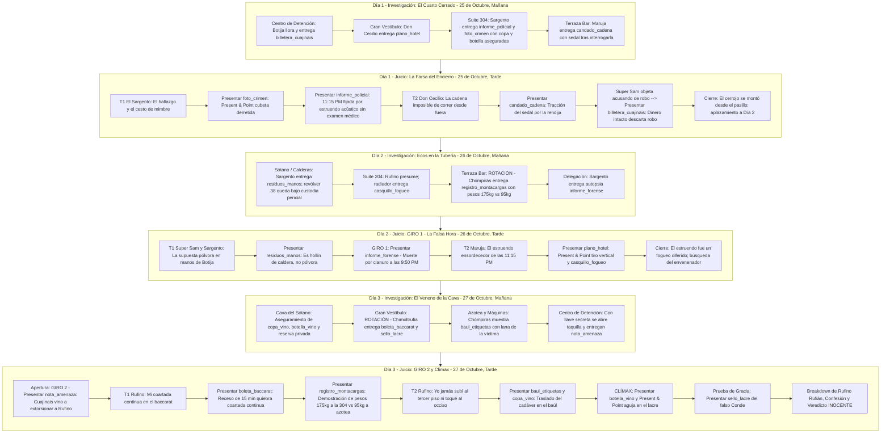

# Caso 4: El Juicio del Botija — Crimen en el Gran Hotel
*(Turnabout at the Grand Hotel)*

Documento de diseño narrativo, guión de diálogos y especificación técnica para el **Episodio 4** de **El Chapulín Colorado: Ace Attorney**.

**Duración objetivo:** ~2 horas (6 fases: 3 días de investigación + 3 días de juicio, ~20 min cada una).

---

## 1. Resumen General del Caso (Case Synopsis)

La noche del **24 de octubre**, el aristocrático y decadente **Gran Hotel Buena Vista**, enclavado en las colinas de las afueras, celebra su gala anual de otoño con selectos huéspedes de la alta sociedad, diplomáticos, apostadores y coleccionistas.

A las **11:15 PM**, un estruendo seco y metálico retumba por el tiro vertical de las tuberías de calefacción del ala oeste. Huéspedes y empleados acuden alarmados al tercer piso. La puerta de la señorial **Suite Presidencial 304** está bloqueada por dentro con un pesado cerrojo de cadena de latón macizo. Al forzar la puerta con auxilio de la palanca de servicio del personal, encuentran tendido en la alfombra el cadáver del inquilino, registrado bajo el nombre falso de *"Sr. Gómez"*: nada menos que el temido gángster **El Cuajinais**, con su inconfundible cicatriz en la mejilla izquierda, muerto aparentemente por un impacto de bala calibre .38 en pleno pecho.

Las altas ventanas de la suite permanecen atrancadas por dentro, a quince metros sobre un precipicio de rosales espinosos. No hay salida visible. Y dentro de la habitación, oculto en el cesto de mimbre de la lavandería, la policía encuentra temblando a **Gordon Botija Pompa y Pompa ("El Botija")**, ex-carterista reformado que labora como fontanero y encargado de mantenimiento del hotel. En sus palmas y mangas negras hay **residuos negros de carbón y hollín**, en su cinto una llave inglesa manchada y en su bolsillo la billetera de piel de cocodrilo del difunto con $200 pesos intactos.

Para el implacable fiscal **Super Sam** (*"Time is money!"*), el litigio es un *"open-and-shut case"*: un vulgar ajuste de cuentas entre antiguos compinches del bajo mundo por el robo del legendario **Collar de Lágrimas de Cleopatra**, desaparecido meses atrás del Museo de Marsella.

La angustiada camarera en jefe del hotel y devota esposa del acusado, **María Expropiación Petronila Lascuráin y Torquemada de Botija ("La Chimoltrufia")**, armada con su plumero y un mar de lágrimas, clama por auxilio en los pasillos: *"¡Oh! Y ahora, ¿quién podrá defender a mi Botijita?!"*.

A la desesperada llamada acude **El Chapulín Colorado**, acompañado de su infatigable defensor de oficio: el sagaz y empobrecido **Don Ramón (Lic. Monchito)**, quien arrastra ya 16 meses de renta acumulada y no puede permitirse perder a su vecino fontanero.

Lo que aparenta ser una ejecución a quemarropa dentro de un cuarto cerrado hermético se convierte en una apasionante partida de ajedrez criminal. Detrás de la escena yace un sofisticado plan urdido por el aristócrata de fachada y estafador internacional **Rufino Rufián ("Conde de Montemayor")**: una muerte por envenenamiento en el piso inferior tras hacer bajar a la víctima a la Suite 204, el traslado del cadáver en un baúl de viaje mediante el montacargas de servicio, un disparo post-mortem sofocado con una almohada de plumas de la suite para encubrir el veneno, la salida cerrando la puerta con la llave de Cuajinais tomada de la mesita, el posterior bloqueo exterior de la puerta traccionando el cerrojo de cadena con un sedal de pescar a través de la rendija aprovechando que Botija la dejó emparejada, y una detonación acústica de fogueo con mecha lenta retardada conectada a la válvula de purga de las tuberías para forjar una coartada perfecta.

---

## 2. Personajes (Dramatis Personae)

| Personaje | Rol en el Caso | Perfil Canónico y Comportamiento | Sprites / Poses Clave |
|---|---|---|---|
| **Don Ramón (Lic. Monchito)** | Abogado Defensor | Sagaz, callejero y sarcástico. Carga con 16 meses de renta impagada. Defiende a Botija con uñas y dientes sabiendo que si su vecino cae preso, la Chimoltrufia demolerá la vecindad a escobazos. Frases: *"¡Con permisito, dijo Monchito!"*, *"¡Yo le voy al Necaxa!"*, *"¡Chanfle!"*. | `donramon_idle`, `donramon_point`, `donramon_slam`, `donramon_shock`, `donramon_sweat`, `donramon_panic` |
| **El Chapulín Colorado** | Co-defensor / Investigador | Apoyo moral y deducciones laterales. Emplea sus *Antenitas de Vinil*, *Pastillas de Chiquitolina* y su repertorio de refranes enredados, que funcionan como respiro cómico y certera intuición jurídica. Frases: *"¡Que no panda el cúnico!"*, *"¡No contaban con mi astucia!"*, *"¡Síganme los buenos!"*, *"¡Se aprovechan de mi nobleza!"*, *"¡Lo sospeché desde un principio!"*. | `chapulin_idle`, `chapulin_point`, `chapulin_slam`, `chapulin_panic` |
| **Super Sam** | Fiscal Acusador | *"Time is money!"*. Obsesionado con el cierre de la bolsa de Nueva York. Empuña fajos de dólares, azota calculadoras contra el estrado y amenaza con descontar la quincena al Sargento por cada objeción rechazada. Frases: *"Time is money!"*, *"Objection!"*, *"What?!"*. | `supersam_idle`, `supersam_point`, `supersam_slam`, `supersam_sweat`, `supersam_breakdown` |
| **El Sargento (Refugio Pazguato)** | Policía Investigador (Aliado) | Detective bonachón, leal, mal pagado y despistado. Canónico del Caso 3 (`pazguato_*`): extremadamente alto, espigado y de cuello largo (estilo Rubén Aguirre), con espeso bigote caído de herradura y kepis torcido. Asustado por los recortes de Super Sam, coopera a escondidas con Don Ramón. | `pazguato_idle`, `pazguato_saludo`, `pazguato_sweat`, `pazguato_decidido` |
| **Gordon Botija Pompa y Pompa ("El Botija")** | **Acusado** | Corpulento, obeso y de cara redonda. Barba negra cerrada tupida, gorra plana celeste/gris y vestimenta completa negra con tenis blancos. Ex-asaltante reformado que labora reparando cañerías; rompe en llanto infantil ante la idea de la cárcel y el sufrimiento de su adorada Chimoltrufia. | `botija_idle`, `botija_nervioso`, `botija_llorando`, `botija_aliviado` |
| **María Expropiación Petronila Lascuráin y Torquemada de Botija ("La Chimoltrufia")** | Camarera en jefe / Testigo | Feroz, temperamental, desgarbada y de cuello largo. Peinado erizado y desaliñado en coleta (sin tubos), pecas y chimuela. Defiende con furia a su esposo con su plumero. Atiende la recepción el Día 3. Frases: *"¡Como digo una cosa, digo otra!"*, *"¡Ay, qué la canción!"*. | `chimoltrufia_idle`, `chimoltrufia_confundida`, `chimoltrufia_shock` |
| **Don Cecilio Buenavista** | Dueño y gerente del Gran Hotel / Testigo | Anciano distinguido, exquisito y patológicamente miope con lentes de fondo de botella que confunden a la gente con estatuas. Celoso de las cinco estrellas del hotel. Frase: *"¡Cielos santos!"*. | `cecilio_idle`, `cecilio_ciego`, `cecilio_escandalo`, `cecilio_shock` |
| **Maruja ("La Sirena del Hotel")** | Huésped distinguida / Testigo | Sofisticada y seductora dama de la Suite 303. Traje de noche escotado verde esmeralda, estola de plumas, abanico y su distintivo peinado esponjado, cardado y rizado pelirrojo cobrizo encendido. | `maruja_idle`, `maruja_coqueta`, `maruja_abanico`, `maruja_nerviosa`, `maruja_shock` |
| **Aquiles Esquivel Madrazo ("El Chómpiras")** | Botones y operador de elevador / Testigo | Amigo íntimo de Botija. Canónico del Caso 2 (`chompiras_*`): sombrero bombín negro abollado y remendado, playera a rayas beige/blancas, saco raído y bigotito recortado. Ingenuo y distraído (*"¡Tómelo por el lado amable!"*). | `chompiras_idle`, `chompiras_nervous`, `chompiras_relieved` |
| **Rufino Rufián ("Conde de Montemayor")** | Huésped de la Suite 204 / **Verdadero Culpable** | Falso aristócrata internacional, perito en timos y venenos. Frac impecable, bigote fino engominado, monóculo de oro y anillo con sello nobiliario. Asesinó a Cuajinais envenenándolo en la 204 y montó el cuarto cerrado en la 304. | `rufino_smug`, `rufino_monocle`, `rufino_sweat`, `rufino_panic`, `rufino_breakdown` |
| **El Cuajinais** | **Víctima** | Notorio criminal con cicatriz en la mejilla izquierda. Traje de lana marrón y sombrero gángster. Llegó al hotel como "Sr. Gómez" con revólver .38 y resguardo de telegrama para extorsionar a Rufino. Murió envenenado con cianuro a las 9:50 PM. | — (Fotografías y silueta pericial) |
| **El Juez** | Juez Presidente de la Corte | Magistrado veterano de la serie, solemne y amante de las comodidades de lujo, sensible al protocolo aristocrático pero inquebrantable ante la lógica jurídica. | `judge_neutral`, `judge_gavel`, `judge_thinking`, `judge_shock` |

### 2.1 Descripciones Físicas Detalladas (Guía para Generación de Assets y Sprites)

Esta subsección fija la apariencia visual canónica exacta para modelar, generar prompts y renderizar los sprites de personajes del Caso 4:

1. **Gordon Botija Pompa y Pompa ("El Botija")** *(Actor: Édgar Vivar)*
   - **Complexión y porte:** Muy corpulento, obeso (~120 kg), de gran circunferencia abdominal y rostro ancho y redondo.
   - **Vestimenta canónica:** Siempre viste enteramente de negro: suéter / camiseta holgada de manga larga negra y pantalones negros anchos de corte recto. En los pies calza tenis deportivos blancos. Durante el caso lleva enganchada al cinto una llave inglesa de mantenimiento, y en la escena sus palmas y mangas terminan manchadas de hollín negro y azufre mineral de la caldera.
   - **Gorra:** Gorra plana clásica / boina (*flat cap / ivy cap*) de color azul celeste claro (o gris claro deslavado), notoriamente pequeña respecto a su cabeza, apoyada hacia atrás sobre la coronilla.
   - **Barba y bigote:** Barba negra completa, tupida, densa y bien delimitada que recorre mandíbula, mentón y papada contorneando la redondez facial, unida a un bigote corto y poblado.
   - **Cabello:** Cabello negro corto asomando bajo el borde de la gorra, con patillas anchas integradas en la barba.

2. **Maruja ("La Sirena del Hotel")** *(Actriz: María Antonieta de las Nieves)*
   - **Peinado distintivo (Rasgo clave):** Melena sumamente voluminosa, cardada, esponjada y rizada/ondulada formando una silueta redondeada y amplia que enmarca el rostro. Color **pelirrojo cobrizo encendido (rojo anaranjado)** muy vistoso.
   - **Vestimenta:** Traje de noche largo y ceñido con escote pronunciado en tono **verde esmeralda brillante / satín**.
   - **Accesorios de sprite:** Estola de plumas suaves descansando sobre hombros y cuello; abanico de mano a juego en tono verde/dorado para poses de coquetería y tensión (`maruja_abanico`).
   - **Rostro y porte:** Dama glamorosa de alta sociedad, pestañas marcadas, labios rojos y expresión coqueta que vira al pánico al descubrirse el complot.

3. **Aquiles Esquivel Madrazo ("El Chómpiras")** *(Actor: Roberto Gómez Bolaños — Canon Caso 2)*
   - **Complexión y porte:** Delgado, desgarbado, de estatura baja y postura cabizbaja, humilde y encorvada; junta las manos en actitud de súplica ingenua. Reutiliza los sprites base de `src/case/case2/` (`chompiras_idle`, `chompiras_nervous`, `chompiras_relieved`).
   - **Sombrero:** Sombrerito negro tipo bombín / fedora viejo, abollado, deshilachado en los bordes y con remiendos visibles.
   - **Rostro y cabello:** Cabello negro lacio despeinado que asoma desordenado bajo el sombrero; rostro demacrado con bigotito fino recortado y sombra de barba descuidada de varios días.
   - **Vestimenta:** Saco o chaqueta vieja y holgada de color gris oscuro / negro con parches en los codos, combinada con playera interior de cuello redondo a rayas horizontales beige/marrón claro y blanco.

4. **El Sargento (Refugio Pazguato)** *(Actor: Rubén Aguirre — Canon Caso 3)*
   - **Complexión y físico:** Extremadamente alto, espigado y enjuto, con un cuello largo y delgado muy característico y porte torpe/desgarbado. Reutiliza los sprites base de `src/case/case3/` (`pazguato_idle`, `pazguato_saludo`, `pazguato_sweat`, `pazguato_decidido`).
   - **Rostro:** Cara alargada y delgada, ojos caídos y soñolientos con ojeras suaves; luce un **bigote negro muy poblado, espeso y caído** (estilo herradura/walrus).
   - **Gorra:** Gorra de plato policial azul marino reglamentaria con visera negra brillante y escudo dorado metálico, calzada ligeramente torcida hacia un lado.
   - **Uniforme:** Guerrera policial azul marino abotonada con botones dorados; placa dorada del D.F. en el pecho izquierdo, libreta de notas sobresaliendo del bolsillo superior, correa de cuero marrón cruzada al torso (*tahalí*) y cinturón con cartuchera y tolete/macana de madera.

5. **María Expropiación Petronila Lascuráin y Torquemada ("La Chimoltrufia")** *(Actriz: Florinda Meza — Caricatura Canónica)*
   - **Complexión y rostro:** Silueta delgada, huesuda y desgarbada (*lanky*), cuello largo, mejillas con pecas y **dientes frontales faltantes (chimuela)**.
   - **Cabello (Bloqueo de identidad vs Doña Florinda):** Cabello castaño oscuro alborotado, rebelde, erizado y recogido en una coleta desaliñada; **sin tubos ni rulos** para diferenciarla radicalmente de Doña Florinda.
   - **Atuendo:** Vestido estampado modesto de diario (flores amarillas/naranjas sobre fondo oscuro) cubierto por un delantal color crema desgastado con bolsillos; empuña un plumero de limpieza.

6. **Rufino Rufián ("Conde de Montemayor")**
   - **Porte y rostro:** Porte aristocrático altivo, estirado y despectivo. Bigote fino, recto y engominado en las puntas; **monóculo circular de oro** sujeto en su ojo derecho.
   - **Vestimenta:** Frac negro impecable de gala con solapas de seda, chaleco marfil, camisa de cuello palomita con corbatín blanco; en el dedo anular luce un **anillo nobiliario con sello heráldico de oro**.

7. **Don Cecilio Buenavista**
   - **Rostro y mirada:** Anciano distinguido con pelo cano y peinado impecable; porta **anteojos de armazón redondo con lentes extremadamente gruesos ("fondo de botella")** que distorsionan cómicamente sus ojos.
   - **Vestimenta:** Traje sastre formal de tres piezas en tono gris perla o azul oscuro, corbata sobria y pañuelo de seda en el bolsillo, correspondiente a un refinado gerente hotelero.

8. **El Cuajinais (Víctima / "Sr. Gómez")**
   - **Rostro:** Rostro curtido y ceñudo de criminal peligroso con una **notoria y profunda cicatriz en la mejilla izquierda**.
   - **Vestimenta:** Traje de lana marrón de corte clásico gángster de época, camisa clara, corbata oscura y sombrero fedora de ala ancha.

9. **Don Ramón (Lic. Monchito)**
   - **Rostro y complexión:** Delgado, demacrado, de tez cetrina y bigote ralo; cejas pobladas y expresivas que transmiten desesperación y astucia callejera.
   - **Vestimenta:** Traje raído y desgastado de abogado de oficio, camiseta modesta debajo, su clásico **gorrito arrugado de mezclilla azul** y la insignia dorada de abogado abollada en la solapa.

10. **El Chapulín Colorado**
    - **Complexión y traje:** Ágil y delgado. Uniforme completo de mallas y camiseta rojas con el escudo del corazón amarillo y letras "CH" rojas en el pecho, calzoncillo amarillo y zapatillas rojas. En la cabeza porta las dos **Antenitas de Vinil** amarillas con base roja.

11. **Super Sam**
    - **Porte y vestimenta:** Héroe/fiscal de caricatura satírica estadounidense. Traje con sombrero de copa a rayas rojas y blancas, traje azul con estrellas, capa corta; siempre empuñando una calculadora de bolsillo o bolsas de dólares con el signo `$`.

12. **El Juez**
    - **Aspecto:** Anciano venerable de pelo y bigote cano abundante, expresión solemne; viste toga negra amplia sobre camisa blanca de cuello estricto y empuña su mazo judicial (*gavel*) de madera noble.

---

## 3. Cronología Real de los Hechos (Timeline)

> **Reglas de Coherencia Física y Mecánica:**
> 1. **Ductos y Tuberías de Calefacción:** La red vertical de vapor del ala oeste del hotel conecta en línea recta la caldera del sótano con la válvula de purga del radiador de la Suite 204 (habitación de Rufino) y el radiador de la Suite 304 (suite de Cuajinais). Cualquier detonación en la válvula de purga de la 204 reverbera con fuerza idéntica en el radiador de la 304 como si fuera un disparo in situ.
> 2. **El Cerrojo de Cadena y el Cuarto Cerrado:** El cerrojo de latón de la 304 desliza su perno en un riel horizontal abierto hacia la jamba. Con la puerta emparejada o abierta escasos 4 cm, pasar un sedal de pescar de nylon fino por la rendija y sujetar el perno permite **traccionar y correr el perno desde afuera** a lo largo del riel horizontal hasta dejar la puerta atrancada "por dentro", recuperando luego el hilo desde el pasillo exterior sin pisar la alfombra.
> 3. **El Montacargas de Servicio y el Baúl:** El montacargas de equipaje comunica el sótano, piso 2, piso 3 y la azotea. Su bitácora automática registra los llamados manuales y el tonelaje de carga:
>    - A las **10:20 PM** registra **carga pesada (~175 kg: Rufino ~75 kg + baúl ~20 kg + cadáver de Cuajinais ~80 kg)** desde el piso 2 (Suite 204) hasta el piso 3 (Suite 304).
>    - A las **10:25 PM** registra **carga ligera (~95 kg: Rufino ~75 kg + baúl vacío ~20 kg)** desde el piso 3 a la azotea, probando matemáticamente que se descargó un bulto de ~80 kg en el tercer piso.
> 4. **El Vino y el Cianuro:** El *Chateau Buena Vista 1958* es una reserva exclusiva privada de Rufino Rufián. Rufino inyectó cianuro de potasio líquido a través de la cúpula del sello de lacre rojo mediante una aguja hipodérmica, y volvió a alisar la perforación calentando la cera con su anillo nobiliario de oro. La botella descorchada y la copa envenenada fueron subidas junto con el cuerpo a la Suite 304 para simular que Cuajinais bebió allí. En la Cava subterránea permanece la botella gemela sin alterar y la lista de pedidos exclusivos de Rufino.
> 5. **El Hielo de la Cubeta:** Cuajinais ordenó a room service a las 9:30 PM una cubeta con hielo para enfriar una botella de refresco/agua mineral. Al fotografiar la escena a las 11:30 PM, el hielo derretido a temperatura ambiente demuestra que la bebida llevaba servida dos horas y no quince minutos.
> 6. **El Revólver .38 y Custodia Pericial:** El revólver .38 de cañón corto traído por Cuajinais fue usado por Rufino a las 10:22 PM en la Suite 304 para disparar un tiro post-mortem en el pecho a través de la almohada de plumas de la suite (sofocando el sonido del estruendo y simulando una ejecución por arma de fuego). Inmediatamente después, Rufino arrojó el revólver por el tiro de cenizas de la chimenea hacia la caldera del sótano, donde el Sargento lo rescata más tarde entre el carbón. Dicha arma queda bajo **custodia pericial de la fiscalía en poder del Sargento Refugio Pazguato** (por lo que no ingresa al inventario del jugador como prueba manipulable por la defensa).
> 7. **El Telegrama y la Taquilla:** El resguardo de la oficina de telégrafos demuestra que Cuajinais envió un mensaje exigiendo los $50,000 en efectivo por el Collar de Cleopatra al "Conde de Montemayor". Cuajinais guardó el resguardo en la taquilla #42 de la terminal de autobuses antes de subir al hotel.
> 8. **Coartada de Baccarat y Cronología de la Mecha:** Rufino jugó en la mesa de baccarat entre las 10:30 PM y las 11:30 PM. Sin embargo, la boleta oficial y el croupier certifican un **receso sellado de 15 minutos (11:10 a 11:25 PM)** para "tomar aire fresco". En esos 15 minutos:
>    - A las **11:12 PM**, Rufino bajó a la Suite 204 a encender la mecha lenta de 3 minutos conectada al cartucho de fogueo en la válvula de purga del radiador.
>    - A las **11:14 PM**, Rufino subió a la Suite 304, vio la puerta emparejada dejada por Botija, pasó el sedal de pescar por la rendija y traccionó el cerrojo de cadena deslizándolo en su riel horizontal para bloquear la habitación por dentro desde afuera. Rufino bajó de inmediato a paso veloz hacia el salón de juegos.
>    - A las **11:15 PM**, la mecha lenta alcanza el cartucho de fogueo en la 204 y detona en la tubería mientras Rufino ya va bajando al baccarat.
>    - A las **11:18 PM**, Rufino reaparece ostentosamente en la mesa de juego a la vista de los apostadores antes de terminar su receso a las 11:25 PM.

```mermaid
timeline
    title Cronología del Crimen en el Gran Hotel (24 de Octubre)
    8:30 PM : El Cuajinais llega al hotel como "Sr. Gómez", se aloja en la Suite 304. Deja el resguardo de su telegrama de extorsión en la taquilla de la estación. Porta un revólver .38 de cañón corto para exigir a Rufino $50,000 pesos por el Collar de Cleopatra.
    9:00 PM : Maruja comenta en el bar con Rufino sobre la llegada del misterioso "Sr. Gómez" de la cicatriz. Rufino comprende que su antiguo socio viene a extorsionarlo y urde un plan de eliminación inmediata.
    9:20 PM : Rufino prepara en su Suite 204 una botella de su cava privada (Chateau Buena Vista 1958). Inyecta cianuro con una aguja hipodérmica a través del sello de lacre rojo y disimula la punzada con el calor de su anillo sello de oro.
    9:30 PM : Rufino invita a Cuajinais a su Suite 204 con el pretexto de pagarle. Cuajinais pide una cubeta con hielo por teléfono a room service y baja de la Suite 304 a la Suite 204.
    9:50 PM : Cuajinais brinda con el vino tinto en la Suite 204, sufre asfixia fulminante por cianuro de potasio y muere a los pocos minutos.
    10:00 PM : Rufino revisa la billetera de Cuajinais buscando la llave de la taquilla; al no hallarla a simple vista, la arroja junto al cadáver con los $200 intactos. Rufino se apodera del revólver .38 de cañón corto.
    10:15 PM : Rufino introduce el cadáver de Cuajinais dentro de su gran baúl de viaje de cuero inglés forrado de terciopelo.
    10:20 PM : Rufino transporta el baúl con el cuerpo en el montacargas de servicio desde el piso 2 (Suite 204) al piso 3 (Suite 304). Bitácora registra carga pesada (~175 kg).
    10:22 PM : En la Suite 304, Rufino saca el cuerpo y lo coloca junto a la chimenea; deposita la copa rota, la botella descorchada y la billetera. Coloca la almohada de plumas de la suite sobre el pecho del cadáver y le dispara un tiro post-mortem con el revólver .38 de cañón corto para sofocar el estruendo y enmascarar el veneno.
    10:23 PM : Rufino arroja el revólver .38 por el ducto de cenizas de la chimenea hacia la caldera del sótano (donde el Sargento lo recuperará bajo custodia pericial).
    10:24 PM : Rufino sale de la Suite 304 cerrando la puerta con la llave de la suite de Cuajinais que tomó de la mesita antes de dirigirse al baccarat.
    10:25 PM : Rufino toma el montacargas con el baúl ya vacío. Bitácora registra carga ligera (~95 kg) del piso 3 a la azotea. Esconde el baúl detrás del motor del montacargas.
    10:30 PM : Rufino baja al salón de juegos y se sienta a la mesa de baccarat para labrarse una coartada pública.
    10:45 PM : En el sótano, la caldera de carbón se atora de hollín. Don Cecilio ordena al fontanero Gordon Botija limpiar el tiro y destapar la válvula de purga del radiador de la Suite 304 que frena el vapor.
    11:10 PM : Botija concluye de raspar el hollín de la caldera en el sótano, quedando con las manos y mangas cubiertas de tizne mineral y azufre. Rufino solicita un receso de 15 minutos en el baccarat (11:10 a 11:25 PM).
    11:12 PM : Botija sube a la Suite 304, abre con su llave maestra de mantenimiento y deja la puerta emparejada mientras revisa la válvula de purga del radiador. En paralelo, Rufino baja a su Suite 204 y conecta un cartucho de fogueo con mecha lenta de 3 minutos en la válvula de purga de su radiador.
    11:13 PM : En la penumbra de la 304, Botija tropieza con el cadáver; atónito, levanta la billetera de la alfombra para identificarlo y se paraliza del susto.
    11:14 PM : Botija escucha pasos en el pasillo exterior (Rufino acercándose y Maruja regresando a su suite 303). Aterrado de que lo inculpen por sus antecedentes, Botija se oculta en el cesto de mimbre con la billetera en la mano. Afuera, Rufino ve la puerta emparejada por Botija, pasa un sedal de pescar por la rendija, tracciona el cerrojo de cadena corriendo el perno en el riel horizontal hasta bloquearlo por dentro, retira el hilo y huye escaleras abajo hacia el baccarat.
    11:15 PM : El cartucho de fogueo en la Suite 204 detona dentro de la tubería de hierro. La onda retumba por el radiador de la 304 como un tiro a quemarropa in situ, mientras Rufino ya va bajando al salón de baccarat.
    11:18 PM : Rufino reingresa a la mesa de baccarat a la vista de los apostadores, consumando su coartada.
    11:20 PM : Don Cecilio, el Sargento y los empleados derriban la puerta atrancada. Hallan a Cuajinais muerto y a Botija dentro del cesto con las manos negras y la billetera. Arresto inmediato.
```

---

## 4. Catálogo del Acta del Juicio (Court Record)

Alineado con la norma arquitectónica de la serie, **las 15 pruebas específicas del caso poseen al menos una ranura de presentación obligatoria durante las sesiones del tribunal**; la `insignia_abogado` es una **constante de la serie** presente desde el inicio en el inventario que no requiere ranura obligatoria (totalizando 16 entradas en el catálogo):

| # | ID | Nombre | Descripción Inicial | Actualizaciones (`updates`) / Directiva (`updateEvidence`) | Presentación Obligatoria en Juicio | ¿Examinable a fondo? |
|---|---|---|---|---|---|:---:|
| 1 | `insignia_abogado` | Insignia de Abogado | Chapa profesional del Licenciado Monchito. Abollada y empeñada tres veces para pagar la renta, pero legalmente válida. | — | **Constante de la serie** (no requiere presentación obligatoria) | No |
| 2 | `informe_policial` | Informe Policial del Sargento | La víctima murió de un disparo calibre .38 en el pecho en la Suite 304 a las 11:15 PM. Habitación cerrada con cerrojo de cadena interior. | **D1 (Stage 1):** La fijación de las 11:15 PM se basó sólo en el estruendo de las tuberías sin prueba médica forense.<br>**D2 (Stage 2):** El deceso a las 11:15 choca frontalmente con la autopsia toxicológica. | **D1-T1** (vs hora oficial de la carátula fijada por estruendo acústico sin examen médico) | No |
| 3 | `foto_crimen` | Fotografía de la Suite 304 | Escena del crimen a las 11:30 PM. El cuerpo yace junto a la chimenea; sobre la alfombra y la mesita yacen la copa rota con residuos secos y la botella descorchada de *Chateau Buena Vista 1958* junto a la cubeta de hielo, aseguradas por el Sargento. | **D1 (Stage 1):** Al ampliar la cubeta, se observa agua templada sin un solo témpano de hielo flotando. | **D1-T1** (Present & Point: hielo derretido en la cubeta) | **Sí (`examine_foto`)** |
| 4 | `candado_cadena` | Cerrojo de Cadena de la 304 | Mecanismo de seguridad de la puerta. Riel horizontal de latón con perno deslizante. En el canto exterior hay un rasguño fresco y un sedal de pescar de nylon. | — | **D1-T2** (vs puerta imposible de cerrar desde afuera) | **Sí (`examine_cadena`)** |
| 5 | `plano_hotel` | Plano de Tuberías y Suites | Sección arquitectónica del ala oeste. Demuestra que el radiador y chimenea de la 304 comparten tiro directo y cavidad con la Suite 204. | **D2 (Stage 1):** Muestra el acceso del tubo de purga de vapor de la Suite 204 al radiador superior. | **D2-T2** (Present & Point: tiro vertical de tuberías) | **Sí (`examine_plano`)** |
| 6 | `residuos_manos` | Análisis de Manos de Botija | Polvo negro tomado de las manos y ropa negra de Botija. Calificado inicialmente por Super Sam como "pólvora fresca de disparo". | **D2 (Stage 1):** Peritaje químico corregido: 98% hollín mineral y azufre de la caldera de carbón, sin trazas de nitratos balísticos. | **D2-T1** (vs prueba de disparo balístico de Super Sam) | No |
| 7 | `billetera_cuajinais` | Billetera de la Víctima | Billetera de piel de cocodrilo hallada en manos de Botija. Contiene $200 pesos íntegros, credencial del "Sr. Gómez" y un forro secreto descosido. | **D3 (Stage 1):** Guarda en su forro secreto la llave de la taquilla #42 de la terminal de autobuses. | **D1-T2** (refuta acusación de Super Sam: dinero intacto descarta robo con violencia) | No |
| 8 | `informe_forense` | Autopsia Toxicológica | Reporte patológico oficial: el disparo en el pecho fue post-mortem (sin reacción vital ni hemorragia interna). Causa real: **asfixia por cianuro potásico** a las 9:50 PM. | — | **D2-T1 / Giro 1** (demuestra falsa hora de muerte y disparo post-mortem) | No |
| 9 | `casquillo_fogueo` | Casquillo de Fogueo Quemado | Casquillo calibre .38 detonado sin proyectil, hallado dentro de la válvula de purga del radiador de la Suite 204. Restos de mecha lenta de azufre. | — | **D2-T2** (artificio acústico del disparo retardado en tuberías) | No |
| 10 | `registro_montacargas` | Bitácora del Montacargas | Registro del ascensor de carga: a las 10:20 PM carga pesada (~175 kg: piso 2 a piso 3); a las 10:25 PM carga ligera (~95 kg: piso 3 a azotea). | — | **D3-T1** (traslado vertical: demuestra descarga de bulto de 80 kg en piso 3) | No |
| 11 | `copa_vino` | Copa Rota de Vino | Copa de cristal fino con restos de vino tinto *Chateau Buena Vista 1958*. Sedimento analizado dio positivo letal a cianuro de potasio. | — | **D3-T2** (prueba de la ingesta de veneno en el vino servido) | No |
| 12 | `botella_vino` | Botella Chateau Buena Vista 1958 | Botella de gran reserva privada de Rufino. Corcho extraído intacto. En la cúpula del sello de lacre rojo hay un micro-orificio de aguja disimulado con cera fundida. | — | **Clímax** (Present & Point: punzada de aguja en el lacre) | **Sí (`examine_botella`)** |
| 13 | `boleta_baccarat` | Boleta de Baccarat de Rufino | Boleta de apuestas del salón de juegos. Acredita juego de 10:30 PM a 11:30 PM, pero incluye un **receso sellado de 15 min (11:10 a 11:25 PM)**. | — | **D3-T1** (ruptura de la coartada pública de Rufino) | No |
| 14 | `baul_etiquetas` | Baúl de Viaje con Ruedas | Baúl de cuero inglés hallado oculto en el cuarto de máquinas de la azotea. En su forro de terciopelo se hallaron fibras de lana del traje de Cuajinais y carbón. | — | **D3-T2** (vehículo del traslado del cadáver al tercer piso) | No |
| 15 | `sello_lacre` | Anillo Sello de Oro | Anillo con escudo heráldico propiedad de Rufino Rufián. Hallado en la basura de la 204; presenta rastros microscópicos de cera roja fundida en el relieve. | — | **Clímax** (Prueba de Gracia contra el falso Conde) | No |
| 16 | `nota_amenaza` | Resguardo de Telegrama de Extorsión | Recibo oficial de telégrafos hallado en la taquilla de Cuajinais: *"Conde de Montemayor: o pagas mis $50,000 del collar de Cleopatra o la policía sabrá todo. Habitación 304."* | — | **D3-T1 / Giro 2** (apertura del juicio: móvil y extorsión real) | **Sí (`examine_nota`)** |

> **Nota sobre el Revólver .38:** El arma traída por la víctima e incautada en la caldera no figura como ítem en el inventario del jugador porque permanece legalmente bajo **custodia pericial de la fiscalía en poder del Sargento Pazguato** durante todo el procedimiento judicial.

---

## 5. Estructura General del Episodio (6 Fases / ~2 Horas)



---

## 6. Mecánicas Nuevas (Especificación Técnica)

### 6.1 Examen Profundo de Pruebas en el Acta (`Court Record Deep Examination`)

En el Caso 4, cinco pruebas contienen información pericial detallada, espacial o textual que no cabe en la descripción resumida del inventario. Al seleccionarlas en el Acta del Juicio, se ilumina el botón interactivo `#btn-evidence-examine` (*"Examinar Detalle"*):

```typescript
// src/types/Private/evidence.ts
export interface EvidenceItem {
  id: EvidenceId;
  name: string;
  icon: string;
  desc: string;
  updatedDesc?: string;
  updates?: string[];
  /** Indica si la prueba abre una vista detallada interactiva con hotspots propios. */
  detailedView?: {
    imageAsset: string;
    caption: string;
    clickableZones?: {
      id: string;
      x: number; // porcentaje 0-100
      y: number;
      width: number;
      height: number;
      tooltip: string;
      discoveryDialogue: DialogueLine[];
    }[];
  };
}
```

Las 5 pruebas examinables a fondo son:
1. **`foto_crimen` (`examine_foto`):** Al inspeccionar la mesita ratona, la ampliación sobre la cubeta de hielo revela agua templada líquida sin témpanos flotando, evidenciando un servicio de más de dos horas de antigüedad, junto a la botella descorchada y la copa rota en el suelo.
2. **`candado_cadena` (`examine_cadena`):** Al rotar la placa de latón, se aprecia la ranura de deslizamiento horizontal, el raspón exterior sobre la jamba y el cabo de nylon transparente de pesca de 0.35 mm enganchado en el borde del perno, permitiendo traccionar la cadena desde afuera.
3. **`plano_hotel` (`examine_plano`):** Muestra el corte arquitectónico transversal del ala oeste, revelando el tiro común de chimenea y la línea vertical de purga de vapor que une los radiadores de la Suite 204 y la Suite 304 con la caldera del sótano.
4. **`botella_vino` (`examine_botella`):** Enfoque macroscópico del gollete de la botella descorchada. La cúpula de lacre rojo revela una punzada milimétrica de aguja hipodérmica resellada con cera derretida.
5. **`nota_amenaza` (`examine_nota`):** Muestra el formulario oficial de Telégrafos Nacionales con el matasellos de la terminal de autobuses (8:15 PM del 24 de octubre), el destinatario "Conde de Montemayor" y la exigencia de $50,000 pesos por el Collar de Cleopatra.

### 6.2 Señalamiento de Detalles en Pantalla Durante el Juicio (`Present & Point`)

Durante momentos de contradicción física insoslayable, el tribunal exige señalar visualmente la anomalía sobre el documento gráfico presentado:

```typescript
// src/types/Private/trial.ts
export interface PointTargetContradiction {
  targetEvidenceId: EvidenceId;
  promptQuestion: string;
  zones: {
    id: string;
    bounds: [number, number, number, number]; // [minX, minY, maxX, maxY] en %
    isCorrect: boolean;
    failureDialogue: DialogueLine[];
  }[];
  successDialogue: DialogueLine[];
}
```

- **Fallo:** Descuenta 1 punto de salud (`penalty`), reproduce el sonido `damage` y ejecuta el bloque `failureDialogue` correspondiente a la zona errónea seleccionada (o amonestación judicial genérica).
- **Acierto:** Detona el sonido `realization`, despliega el cut-in `¡TOMA ESO!`, reproduce `objection` y ejecuta el bloque `successDialogue`, abriendo el monólogo de refutación de Don Ramón.

#### Especificación Técnica de las 3 Instancias de `Present & Point`:

1. **Instancia 1 — `foto_crimen` (Día 1 — Juicio, Contradicción en `d1_t1_3b`):**
   - **`targetEvidenceId`**: `'foto_crimen'`
   - **`promptQuestion`**: *"¡Señale el elemento gráfico que desmiente que el servicio estuviera recién servido a las 11:15 PM!"*
   - **Zona correcta**:
     - `id`: `'cubeta_hielo_derretido'`
     - `bounds`: `[50, 14, 88, 82]` (cubeta metálica completa sobre la mesita, incluido el agua templada del interior; el WebP generado ocupa casi todo el tercio derecho, no un parche en el costado)
     - `isCorrect`: `true`
   - **Zona incorrecta / `failureDialogue`**:
     ```typescript
     failureDialogue: [
       { speaker: 'DEFENSA', pose: 'donramon_sweat', text: '¡Mire fijamente aquí, señor Juez! ¿Acaso no ve... eh... una mancha sospechosa?' },
       { speaker: 'JUEZ', pose: 'judge_thinking', text: 'Licenciado Monchito, señalar ese punto no aporta nada sobre la hora del servicio.', sfx: 'damage' },
       { speaker: 'SUPER SAM', pose: 'supersam_slam', text: 'Time is money! ¡Deje de señalar fantasmas y pague la penalización!' }
     ]
     ```

2. **Instancia 2 — `plano_hotel` (Día 2 — Juicio, Contradicción en `d2_t2_4`):**
   - **`targetEvidenceId`**: `'plano_hotel'`
   - **`promptQuestion`**: *"¡Señale el conducto exacto donde se propagó la onda sonora del disparo de las 11:15 PM!"*
   - **Zona correcta**:
     - `id`: `'tuberia_vapor_vertical'`
     - `bounds`: `[40, 18, 62, 74]` (tiro vertical de vapor y radiadores 204↔304 sobre `examine_plano.webp`, sin las habitaciones laterales ni la boca de la caldera)
     - `isCorrect`: `true`
   - **Zona incorrecta / `failureDialogue`**:
     ```typescript
     failureDialogue: [
       { speaker: 'DEFENSA', pose: 'donramon_panic', text: '¡Por este sector del edificio es por donde viajó el estruendo... creo!' },
       { speaker: 'JUEZ', pose: 'judge_shock', text: '¡Pero Licenciado, ese sector no tiene conexión directa de vapor con la Suite 304!', sfx: 'damage' },
       { speaker: 'SUPER SAM', pose: 'supersam_point', text: '¡Pura desorientación arquitectónica! ¡Menos diez dólares a su honorario!' }
     ]
     ```

3. **Instancia 3 — `botella_vino` (Día 3 — Juicio, Clímax contra Rufino Rufián):**
   - **`targetEvidenceId`**: `'botella_vino'`
   - **`promptQuestion`**: *"¡Señale el punto exacto por donde penetró el cianuro en la botella sellada!"*
   - **Zona correcta**:
     - `id`: `'cupula_sello_lacre'`
     - `bounds`: `[42, 2, 58, 30]` (cúpula y goteos del sello de lacre rojo, con la micro-punzada de aguja en el centro de la tapa)
     - `isCorrect`: `true`
   - **Zona incorrecta / `failureDialogue`**:
     ```typescript
     failureDialogue: [
       { speaker: 'DEFENSA', pose: 'donramon_sweat', text: '¡El veneno entró exactamente por este lado de la botella!' },
       { speaker: 'JUEZ', pose: 'judge_thinking', text: 'El vidrio está perfectamente intacto y sellado en esa zona, Licenciado.', sfx: 'damage' },
       { speaker: 'RUFINO', pose: 'rufino_smug', text: '¡Qué ignorancia! Mis botellas de reserva privada no presentan la más mínima fisura en el cristal.' }
     ]
     ```

### 6.3 Rotación Dinámica de Personajes y Convención de Locaciones por Día

Para respetar la arquitectura y evitar bloqueos (*softlocks*), la sustitución de residentes en un mismo escenario se rige por la convención de IDs con sufijo de día (`_d2`, `_d3`) cuando cambia el elenco o el estado del escenario:

- **Terraza / Bar "El Chapuzón":**
  - **Día 1 (`hotel_terraza`):** Reside **Maruja** (`maruja_idle`). Tras agotar sus temas y obtener el cerrojo de cadena, se completa la jornada.
  - **Día 2 (`hotel_terraza_d2`):** Maruja se retira a su suite. En la barra aparece **El Chómpiras** (`chompiras_idle`), quien revela los movimientos y pesos de la bitácora del montacargas.
- **Gran Vestíbulo / Recepción:**
  - **Días 1 y 2 (`hotel_lobby`):** Atendido por el gerente **Don Cecilio Buenavista** (`cecilio_idle`).
  - **Día 3 (`hotel_lobby_d3`):** Don Cecilio se ausenta urgentemente a la ciudad para atender a los inversionistas, a la junta directiva y a la prensa ante el escándalo de reputación del hotel. El mostrador es asumido por **La Chimoltrufia** (`chimoltrufia_idle`), quien entrega las pruebas rescatadas del basurero de la 204.
- **Centro de Detención:**
  - **Día 1 (`detention`):** Botija desesperado entrega la billetera de la víctima.
  - **Día 3 (`detention_d3`):** Con la llave secreta hallada en el forro descosido, se recupera el resguardo del telegrama de extorsión.

### 6.4 Pruebas Requeridas por Día (`checkTrialReadiness`)

Cumpliendo rigurosamente con la lección de arquitectura `trial-gating-is-inventory-only.md`, **la última locación visitada en cada día de investigación entrega al menos una prueba obligatoria de `requiredEvidence`**:

| Día | `requiredEvidence` | Última Locación Obligatoria | Prueba que Sella el Día |
|---|---|---|---|
| **Día 1** | `informe_policial`, `foto_crimen`, `plano_hotel`, `billetera_cuajinais`, `candado_cadena` | `hotel_terraza` | `candado_cadena` (entregada por Maruja tras agotar su diálogo) |
| **Día 2** | `residuos_manos`, `casquillo_fogueo`, `registro_montacargas`, `informe_forense` | `delegacion` | `informe_forense` (entregada por el Sargento al recibir la autopsia) |
| **Día 3** | `copa_vino`, `botella_vino`, `boleta_baccarat`, `baul_etiquetas`, `sello_lacre`, `nota_amenaza` | `detention_d3` | `nota_amenaza` (entregada al abrir la taquilla con la llave secreta) |

### 6.5 Directivas de Actualización de Inventario (`updateEvidence`) en el Motor

Conforme a la regla arquitectónica documentada en `docs/lessons-learned/court-record-description-updates.md`, una segunda invocación de `addEvidence` sobre un ítem preexistente en el inventario es un *no-op* silencioso que no genera alertas visuales ni actualiza el texto en el Acta del Juicio.

Para reflejar el avance de la investigación o los descubrimientos periciales en el juicio, el motor implementa la directiva `updateEvidence?: EvidenceId` en la estructura de datos `DialogueLine` ([[src/types/Private/script.ts]]). Al emitirse una línea con este campo:
1. `DialogueFlow.ts` ejecuta `gameState.updateEvidence(evidenceId)`.
2. El `GameStateManager` avanza el estado del ítem a su descripción revisada (`updatedDesc` o el siguiente estadio en el arreglo `updates[]`).
3. La interfaz emite un banner flotante (`#game-notification`) con el mensaje *"Acta del Juicio actualizada"* y detona el efecto de sonido `realization`.
4. Si el jugador alcanzara la línea de actualización antes de registrar el ítem en su inventario, el motor lo ingresa directamente en su estado actualizado para no condicionar el orden de exploración.

#### Catálogo de Directivas `updateEvidence` del Caso 4:

| # | `EvidenceId` | Fase / Disparador del Script | Texto Actualizado en el Acta (`updatedDesc`) |
|---|---|---|---|
| 1 | `foto_crimen` | **Día 1 — Juicio (D1-T1):** Tras resolver el señalamiento (`Present & Point`) del agua derretida en la cubeta sobre la mesita ratona. | *"Escena del crimen a las 11:30 PM. La cubeta sobre la mesita contiene agua templada sin un solo témpano de hielo flotando, demostrando que el servicio de bebidas se entregó horas antes del estruendo."* |
| 2a | `informe_policial` *(Stage 1)* | **Día 1 — Juicio (D1-T1):** Tras presentar `informe_policial` para refutar la hora oficial de la carátula basada únicamente en el estruendo de tuberías. | *"Informe preliminar del Sargento. La hora de muerte fijada (11:15 PM) se asentó únicamente por el estruendo escuchado desde el pasillo a través de las tuberías de vapor, sin examen médico forense in situ."* |
| 2b | `informe_policial` *(Stage 2)* | **Día 2 — Juicio (D2-T1):** Al revelar el **Giro 1** presentando la autopsia toxicológica (`informe_forense`). | *"Informe policial preliminar refutado: la autopsia médico-legal certificó que la víctima falleció por asfixia por cianuro de potasio a las 9:50 PM; el impacto de bala a las 11:15 PM fue post-mortem."* |
| 3 | `residuos_manos` | **Día 2 — Juicio (D2-T1):** Tras presentar `residuos_manos` para demoler la imputación de pólvora sostenida por Super Sam. | *"Peritaje químico corregido de las manos y ropa negra de Botija: 98% de hollín mineral de carbón y azufre de la caldera; 0% de pólvora o nitratos balísticos. Descarta disparo de arma de fuego."* |
| 4 | `plano_hotel` | **Día 2 — Juicio (D2-T2):** Tras resolver el señalamiento del conducto de vapor vertical y presentar el `casquillo_fogueo`. | *"Plano arquitectónico del ala oeste. Confirma la conexión directa del tiro vertical de tuberías de purga de vapor entre la Suite 204 y la Suite 304, conducto por el cual reverberó la detonación acústica de fogueo."* |
| 5 | `billetera_cuajinais` | **Día 3 — Investigación (Locación 4):** Al dialogar con Botija en el centro de detención tras descoser el forro secreto en el laboratorio. | *"Billetera de piel de cocodrilo con $200 intactos. El peritaje químico descosió el forro secreto y extrajo la llave de la taquilla #42 de la terminal de autobuses."* |

---

## 7. Guión Detallado: Día 1 — Investigación (El Cuarto Cerrado)

### Locación 1: Centro de Detención (`detention`, `bg_detention.webp`)
- **Personajes**: Gordon Botija Pompa y Pompa (`botija_nervioso`, `botija_llorando`), El Chapulín Colorado (`chapulin_idle`), Don Ramón (`donramon_idle`).
- **Música**: `detention_center`.

```dialogue
[ENTRADA AL CENTRO DE DETENCIÓN]
NARRADOR: 25 de octubre, 9:00 AM. Centro de Detención Preventiva.
DEFENSA (donramon_idle): ¡Buenos días, vecino! Aquí está el Licenciado Monchito en persona, listo para sacarte de este atolladero.
BOTIJA (botija_llorando): ¡Don Ramón! ¡Dígame que no me van a refundir en las Islas Marías! ¡Yo soy un hombre de bien, se lo juro por los ojos zarcos de mi Chimoltrufia adorada!
CHAPULIN (chapulin_idle): ¡Calma, no te sulfures! ¡Que no panda el cúnico! ¡El Chapulín Colorado acude para velar por los inocentes y desamparados!
BOTIJA (botija_nervioso): Gracias, Chapulín... pero con mis ciento veinte kilos, de desamparado tengo muy poco. ¡Mire mis manos, Don Ramón! ¡El fiscal gringo jura que disparé un trabuco!
DEFENSA (donramon_sweat): (Tiene las manos más negras que llanta de tractor... Esto pinta más feo que mi recibo de la renta de dieciséis meses.)
```

#### Opciones de Diálogo (Talk con Botija):
1. **"¿Por qué estabas en la Suite 304?"**
   - **Botija**: *"A las 10:45 PM estuve raspando el hollín del tiro de la caldera en el sótano hasta las 11:10 PM. Apenas me limpié un poco, Don Cecilio me mandó a revisar el baño de la Suite 304 porque la válvula de purga del radiador estaba silbando vapor hirviendo. Subí con mi ropa de trabajo y mi llave inglesa a las 11:12 PM. Abrí la puerta con mi llave maestra de mantenimiento y la dejé emparejada para que circulara el aire... ¡y en eso vi al Cuajinais tirado en la alfombra junto a la chimenea!"*
   - **Don Ramón**: *"¿Y por qué te metiste al canasto de la ropa sucia?"*
   - **Botija**: *"¡Por puro pánico, Don Ramón! A las 11:14 PM escuché pasos en el pasillo exterior. Pensé: 'Si me pescan aquí con mis antecedentes de carterista, me clavan el difunto'. ¡Y mire nomás qué puntería tuvieron!"*
2. **"Sobre la billetera del Cuajinais"**
   - **Botija**: *"A las 11:13 PM la vi tirada en la alfombra junto al cuerpo. La levanté con curiosidad para ver la credencial y cerciorarme de si era el Cuajinais... ¡y en eso oí los pasos, me metí al cesto y a las 11:15 PM sonó un trallazo como cañón en la tubería! Se me quedó en la bolsa del pantalón del puro susto, ¡pero no le toqué un solo centavo!"*
   - **Se añade al acta**: `billetera_cuajinais`.
3. **"¿Tú pasaste la cadena de la puerta?"**
   - **Botija**: *"¡Jamás en la vida! Yo abrí con mi llave maestra y dejé la puerta sólo emparejada para trabajar. Si yo hubiera querido atrincherarme, ¡le echo llave con cerrojo doble y pongo un ropero enfrente, no me escondo entre sábanas que huelen a cloro!"*
   - **Se desbloquea locación**: `hotel_lobby`.

---

### Locación 2: Gran Vestíbulo del Hotel (`hotel_lobby`, `bg_hotel_lobby.webp`)
- **Personajes**: Don Cecilio Buenavista (`cecilio_idle`, `cecilio_ciego`), Don Ramón (`donramon_panic`), El Chapulín Colorado (`chapulin_point`).
- **Música**: `investigation`.

```dialogue
[ENTRADA AL GRAN HOTEL]
NARRADOR: 25 de octubre, 10:30 AM. Gran Vestíbulo del Hotel Buena Vista.
CECILIO (cecilio_ciego): ¡Sea muy bienvenido a nuestro ilustre establecimiento, distinguido caballero de frac! Permítame guardar su sombrero de copa.
DEFENSA (donramon_panic): ¡Oiga, Don Cecilio! ¡Póngase los anteojos! ¡No soy ningún conde, soy Don Ramón! ¡Y esto no es sombrero de copa, es mi gorrito de mezclilla arrugado!
CECILIO (cecilio_escandalo): ¡Cielos santos! ¡Un menesteroso invadiendo la alfombra persa de mi lobby de cinco estrellas! ¡Llamaré al botones!
CHAPULIN (chapulin_point): ¡Detenga su ademán, noble hostelero! ¡El Chapulín Colorado investiga el trágico suceso de anoche en el tercer piso!
CECILIO (cecilio_idle): ¡Ah, el deplorable espectáculo del inquilino de la cicatriz! Perturbó el reposo del Conde de Montemayor y de toda la planta noble.
```

#### Opciones de Diálogo (Talk con Cecilio):
1. **"El escándalo de anoche"**: Don Cecilio confirma que a las 11:15 PM oyó un estampido como trueno desde el tercer piso. Subió con el Sargento y encontraron la puerta trabada con la cadena interior.
2. **"El plano del edificio"** → **Se añade al acta**: `plano_hotel`.
   - Cecilio: *"Tome usted el esquema del inmueble. Fue construido en 1920 con hierro macizo y tiros verticales de vapor."*
   - **Se habilita botón examinar detalle** en `plano_hotel`.
- **Se desbloquea locación**: `hotel_suite`.

---

### Locación 3: Suite Presidencial 304 (`hotel_suite`, `bg_hotel_suite.webp`)
- **Personajes**: El Sargento Refugio Pazguato (`pazguato_saludo`, `pazguato_sweat`), Don Ramón (`donramon_idle`), Chapulín (`chapulin_idle`).
- **Música**: `suspense`.

```dialogue
[ENTRADA A LA SUITE DEL CRIMEN]
NARRADOR: 25 de octubre, 11:45 AM. Suite Presidencial 304.
SARGENTO (pazguato_saludo): ¡A la orden de la justicia, mi Licenciado! Sargento Refugio Pazguato custodiando la escena del crimen.
DEFENSA (donramon_idle): ¿Super Sam no anda por aquí contando dólares?
SARGENTO (pazguato_sweat): No, fue a la casa de cambio a redondear centavos. ¡Pero si me sorprende cooperando con la defensa, me descuenta el aguinaldo de los próximos tres años!
CHAPULIN (chapulin_idle): ¡No temas, leal custodio del orden! ¡La nobleza de tu deber te protege!
```

#### Puntos de Interés (Hotspots):
1. **Silueta en la alfombra (`hotspot_cuerpo`)**:
   - Mancha seca junto a la chimenea. Sobre la alfombra y la mesita yacen la copa rota con residuos secos y la botella descorchada de *Chateau Buena Vista 1958* junto a la cubeta de hielo, aseguradas bajo cadena de custodia por el Sargento para su posterior remisión a análisis químico.
   - El Sargento entrega las actuaciones preliminares y la toma fotográfica de la escena tomada a las 11:30 PM.
   - **Se añade al acta**: `informe_policial` y `foto_crimen`.
   - **Al examinar `foto_crimen` a fondo**: sobre la mesita, junto a la botella descorchada y la copa rota en el suelo, la cubeta de hielo revela agua templada sin un solo bloque congelado flotando.
2. **Marco de la puerta y cerradura (`hotspot_puerta`)**:
   - El marco de madera de caoba está astillado donde la policía empujó la puerta.
   - El Sargento comenta: *"El cerrojo de cadena estaba puesto en su riel interior. Sin embargo, cuando forzamos la jamba, la señorita Maruja de la suite contigua vio caer algo metálico y lo recogió del suelo del pasillo."*
3. **Radiador de hierro (`hotspot_radiador`)**:
   - Tubería gruesa vertical que baja hacia el piso 2. Huele amargamente a humo de combustión y azufre concentrado.
4. **Cesto de lavandería (`hotspot_cesto`)**:
   - Gran cesto de mimbre con sábanas blancas salpicadas de tizne donde se ocultó Botija.
- **Se desbloquea locación**: `hotel_terraza`.

---

### Locación 4: Terraza & Bar "El Chapuzón" (`hotel_terraza`, `bg_hotel_bar.webp`)
- **Personajes**: Maruja (`maruja_idle`, `maruja_abanico`, `maruja_nerviosa`), Don Ramón (`donramon_sweat`), El Chapulín Colorado (`chapulin_panic`).
- **Música**: `investigation`.

```dialogue
[ENTRADA A LA TERRAZA DEL BAR]
NARRADOR: 25 de octubre, 1:15 PM. Terraza Bar "El Chapuzón".
MARUJA (maruja_abanico): Caramba... ¿Qué tenemos por aquí? Un caballero con sombrero de pescador y un muchacho enfundado en terciopelo encarnado.
CHAPULIN (chapulin_panic): ¡Chanfle! ¡Es una muñeca de sololoy de carne y hueso!
DEFENSA (donramon_sweat): Señora o señorita... Soy el abogado defensor de Gordon Botija.
MARUJA (maruja_coqueta): Puedes llamarme Maruja, Licenciado... Aunque si pretendes salvar a ese gigante que despachó al pobre Gómez, temo que estás gastando pólvora en infiernitos.
CHAPULIN (chapulin_idle): ¡Tranquila, primorosa dama! Porque más vale pájaro en mano... que verlo madrugar volando.
DEFENSA (donramon_idle): ¡No, Chapulín! Al que madruga Dios le ayuda, y más vale pájaro en mano que ver un ciento volando.
CHAPULIN (chapulin_idle): Bueno... la idea es esa.
MARUJA (maruja_abanico): Qué graciosos son...
```

#### Opciones de Diálogo (Talk con Maruja):
1. **"¿Qué escuchó anoche en el pasillo?"**
   - Maruja declara que estaba en su Suite 303 contigua descansando de una migraña. A las 11:15 PM oyó una detonación brutal que cimbró las paredes. Al salir al pasillo, vio a Don Cecilio tratando de empujar la puerta de la 304.
2. **"Sobre la víctima (Sr. Gómez)"**
   - Asegura que apenas lo conocía de vista cuando se cruzaron en la recepción por la tarde.
   - Don Ramón observa que Maruja luce nerviosa cuando se le menciona al difunto Cuajinais.
3. **"El objeto del pasillo"**
   - Maruja: *"Cuando el Sargento y los mozos embistieron la puerta a las 11:20 PM, saltó hacia la alfombra del pasillo el cerrojo de cadena. Yo lo levanté porque traía enredado un alambre brillante muy raro... Pensé que era bisutería, pero se los entrego si les sirve de algo."*
   - **Se añade al acta**: `candado_cadena`.
   - **Al examinar `candado_cadena` a fondo**: se aprecia el rasguño metálico fresco y un largo sedal de nylon de pescar sujeto al perno para traccionarlo por la rendija desde el exterior.

> **¡Gating Cumplido!** La obtención de `candado_cadena` en `hotel_terraza` completa las 5 pruebas requeridas del Día 1 (`informe_policial`, `foto_crimen`, `plano_hotel`, `billetera_cuajinais`, `candado_cadena`) y activa el botón `#btn-inv-trial` para marchar a la Corte.

---

## 8. Guión Detallado: Día 1 — Juicio (La Farsa del Encierro)

```dialogue
[APERTURA DEL JUICIO - 25 DE OCTUBRE, 3:00 PM]
JUEZ (judge_gavel): ¡Silencio en este tribunal! Se abre la vista preliminar contra el ciudadano Gordon Botija Pompa y Pompa por el delito de homicidio calificado y robo. [sfx: gavel, bgm: trial]
SUPER SAM (supersam_slam): Time is money, Your Honor! ¡Este proceso no requiere más de diez minutos de deliberación! [sfx: desk_slam]
SUPER SAM (supersam_point): El inculpado fue sorprendido en flagrancia dentro de un cuarto cerrado por dentro con cadena de latón, con las manos empapadas en pólvora y la billetera del occiso en su bolsillo. ¡Pido sentencia condenatoria antes del cierre de Wall Street!
DEFENSA (donramon_slam): ¡PROTESTO! ¡Con permisito, dijo Monchito! [sfx: desk_slam]
DEFENSA (donramon_point): ¡La defensa demostrará que esa supuesta recámara hermética fue un truco de magia montado por un tercero para inculpar a un humilde fontanero!
```

### Testimonio 1: El Sargento — "El Hallazgo en la Suite 304"
- **Testigo**: El Sargento Refugio Pazguato (`pazguato_idle`). **BGM**: `cross_exam_moderato`.

```dialogue
[TESTIMONIO D1-T1: EL SARGENTO]
SARGENTO (d1_t1_1): A las 11:15 PM en punto escuchamos un disparo de arma de fuego procedente del tercer piso.
SARGENTO (d1_t1_2): Al subir con la gerencia, encontramos la puerta de la Suite 304 trabada por dentro con la cadena de seguridad.
SARGENTO (d1_t1_3): Tras forzar la entrada, vimos el cuerpo sin vida y la cubeta con vino recién servida junto al cadáver.
SARGENTO (d1_t1_4): Oculto en el cesto de la ropa estaba el acusado, con las manos tiznadas y la billetera de la víctima.
```

#### Fase de Presión (Press):

```dialogue
[PRESIÓN D1-T1-1]
DEFENSA (donramon_point): ¿Cómo está tan seguro del minutero exacto, Sargento?
SARGENTO (pazguato_saludo): ¡Porque miré mi reloj de pulso reglamentario en cuanto sonó el trallazo metálico en las tuberías!
DEFENSA (donramon_idle): De modo que las 11:15 PM es cuando usted oyó el ruido... no necesariamente cuando ocurrió el disparo.
SUPER SAM (supersam_slam): Objection! Time is money! ¡Ruido de balazo y hora de disparo son la misma cosa aquí y en Manhattan!

[PRESIÓN D1-T1-2]
DEFENSA (donramon_point): ¿La puerta abría algo o estaba completamente sellada?
SARGENTO (pazguato_sweat): Abría apenas unos cuatro centímetros... lo justo para ver el perno dorado de la cadena atrancado en el riel de latón.
DEFENSA (donramon_idle): Cuatro centímetros... suficiente para meter la mano... o un hilo.
SUPER SAM (supersam_point): ¡Nadie tiene manos de papel para colarse por cuatro centímetros, letrado!

[PRESIÓN D1-T1-3]
DEFENSA (donramon_point): ¿Y afirma usted que el vino y el hielo estaban recién puestos en la mesita?
SARGENTO (pazguato_saludo): ¡Totalmente! La fotografía oficial que tomé a las 11:30 PM documenta la escena intacta quince minutos después del crimen.
JUEZ (judge_thinking): El Sargento afirma que el servicio de bebidas estaba fresco... Esto debe constar en autos.
```

*(La declaración `d1_t1_3` cambia a `d1_t1_3b`: "La escena estaba fresca a las 11:30 PM: la cubeta con hielo y el vino acababan de servirse en la suite.")*

```dialogue
[PRESIÓN D1-T1-3B]
DEFENSA (donramon_sweat): Sargento, insisto: ¿observó con atención los témpanos dentro de esa cubeta antes de dar por sentado que estaban recién servidos?
SARGENTO (pazguato_sweat): Bueno, mi Licenciado... Con el alboroto del fiambre, la chimenea y el Botija metido en el cesto, yo vi el balde de metal reluciente y di por hecho que los cubitos estaban recién salidos del congelador.
SUPER SAM (supersam_slam): Time is money! ¡Un balde de hielo es un balde de hielo! ¡Deje de marear la perdiz con cubitos de agua y presente una contradicción si la tiene!

[PRESIÓN D1-T1-4]
DEFENSA (donramon_point): ¿Revisó si faltaba dinero o si la billetera estaba abierta cuando atraparon a Botija?
SARGENTO (pazguato_saludo): La billetera estaba cerrada. La abrí en presencia del fiscal y tenía doscientos pesos en billetes de curso legal... intactos.
DEFENSA (donramon_idle): (Doscientos pesos enteros... Un ladrón se habría llevado los billetes antes de esconderse.)
SUPER SAM (supersam_point): ¡No intente justificarlo! ¡Botija no tuvo tiempo de vaciarla porque llegamos en diez segundos!
```

#### Contradicción en `d1_t1_3b`:
- **Presentar**: `foto_crimen` (prueba gráfica admisible para señalamiento).
- **Se activa mecánica Señalar Detalle (`Present & Point`)**:
  - Pregunta del tribunal: *"¡Señale el elemento gráfico que desmiente que el servicio estuviera recién servido a las 11:15 PM!"*
  - **Zona correcta**: La cubeta de metal sobre la mesita ratona (`id`: `'cubeta_hielo_derretido'`, `bounds`: `[50, 14, 88, 82]`).
  - **Zona incorrecta / Fallo**: Si se señala fuera de la cubeta, se activa el `failureDialogue` y se descuenta 1 punto de salud (`penalty`).
- **Diálogo de éxito**:

```dialogue
DEFENSA (donramon_point): ¡Mire con aumento la cubeta de la mesita, señor Juez! [cutin: objection_protesto, sfx: whoosh, bgm: objection]
JUEZ (judge_shock): ¿La cubeta metálica? Pero si sólo contiene líquido...
DEFENSA (donramon_slam): ¡Exacto! ¡Es agua líquida a temperatura ambiente! ¡No queda ni una raspadura de hielo! [sfx: desk_slam, updateEvidence: foto_crimen]
SUPER SAM (supersam_sweat): What?! ¡¿Y qué tienen que ver los hielos con el plomo caliente de una bala?!
DEFENSA (donramon_point): ¡Un bloque de cubos de hielo en un balde tarda entre dos y tres horas en derretirse por completo a temperatura de habitación! Si el servicio hubiera subido a las 11:15 PM, ¡a las 11:30 PM los hielos estarían casi completos!
JUEZ (judge_thinking): Es un razonamiento incontestable... La cubeta fue llevada a esa recámara mucho antes de las once de la noche.
```

#### Objeción del Fiscal y Ranura Obligatoria para `informe_policial`:

```dialogue
SUPER SAM (supersam_slam): Objection! ¡Puras pamplinas termodinámicas! [sfx: desk_slam]
SUPER SAM (supersam_point): ¡Aunque el agua estuviera tibia, la carátula oficial de la policía fija taxativamente las 11:15 PM como el minuto exacto del homicidio por arma de fuego! ¡Contra un parte policial sellado, los cubitos de hielo no tienen valor probatorio!
JUEZ (judge_thinking): El señor Fiscal plantea una cuestión de primer orden formal. El acta preliminar de las autoridades goza de fe pública respecto a la hora del deceso. Licenciado Monchito, ¿tiene alguna prueba documental en sus manos que desacredite formalmente la certeza de la hora registrada en ese reporte?
DEFENSA (donramon_slam): ¡Por supuesto, señor Juez! ¡La propia carátula de las autoridades desmiente la certeza médica de ese horario! [cutin: objection_protesto, sfx: desk_slam]
```

- **Presentar**: `informe_policial`.

```dialogue
DEFENSA (donramon_point): ¡Examinen detenidamente la carátula del informe policial redactado por el Sargento! [cutin: objection_toma_eso, sfx: whoosh, bgm: objection]
JUEZ (judge_shock): ¿El informe policial preliminar?
DEFENSA (donramon_slam): ¡Lean con lupa la casilla de "Hora del Crimen"! El Sargento anotó las 11:15 PM basándose única y exclusivamente en el estruendo escuchado desde el pasillo a través de las tuberías de vapor. ¡No hubo ningún médico forense presente certificando signos vitales, temperatura corporal ni rigidez cadavérica a esa hora!
SARGENTO (pazguato_sweat): Es verdad, mi Licenciado... Con el susto del trallazo en los tubos, dimos por hecho que el disparo fatal acababa de sonar. No teníamos forense a esa hora en el hotel para revisar el cuerpo... [updateEvidence: informe_policial]
DEFENSA (donramon_point): ¡De modo que las 11:15 PM es la hora de un sonido en el edificio, no la hora médica en que murió Cuajinais!
SUPER SAM (supersam_sweat): What?!
JUEZ (judge_thinking): ¡Cielos santos! La carátula policial carece de sustento biológico. La hora del asesinato queda formalmente en entredicho.
SUPER SAM (supersam_slam): ¡Irrelevant! ¡Aunque la hora médica esté pendiente, nadie pudo entrar a disparar antes ni después porque la puerta tenía la cadena echada por dentro! [sfx: desk_slam]
```

---

### Testimonio 2: Don Cecilio Buenavista — "La Cadena de Seguridad"
- **Testigo**: Don Cecilio Buenavista (`cecilio_idle`, `cecilio_ciego`). **BGM**: `cross_exam_allegro`.

```dialogue
[TESTIMONIO D1-T2: DON CECILIO]
CECILIO (d1_t2_1): Yo mismo empujé con el hombro la pesada puerta de roble de la suite tras oír el tiroteo.
CECILIO (d1_t2_2): La hoja se detuvo en seco a los cuatro centímetros porque la cadena de latón estaba firme en su carril.
CECILIO (d1_t2_3): Ese mecanismo es inviolable desde el exterior; requiere forzosamente que una mano humana deslice el perno desde adentro.
CECILIO (d1_t2_4): Como el Botija era el único viviente dentro de la alcoba, ¡sólo él pudo atrancar la puerta para proteger su botín!
```

#### Fase de Presión (Press):

```dialogue
[PRESIÓN D1-T2-1]
DEFENSA (donramon_point): ¿No intentó abrir con su llave maestra de la gerencia primero?
CECILIO (cecilio_idle): La cerradura ordinaria de llave estaba descorrida... Lo que frenaba el acceso era pura y exclusivamente la cadena de seguridad interior.
SUPER SAM (supersam_point): ¡Exacto! ¡Cerradura abierta pero cadena trabada por dentro por el asesino!

[PRESIÓN D1-T2-2]
DEFENSA (donramon_point): ¿Y qué se podía distinguir exactamente por esa rendija de cuatro centímetros?
CECILIO (cecilio_ciego): Mis ojos no son de águila imperial, distinguido letrado, pero alcancé a percibir en la penumbra el cesto de mimbre y la silueta del occiso cerca del fuego.
DEFENSA (donramon_sweat): (Cuatro centímetros de rendija... más que suficiente para pasar un sedal de pescar.)

[PRESIÓN D1-T2-3]
DEFENSA (donramon_point): ¿Está usted absolutamente convencido de que nadie pudo manipular ese cerrojo desde el exterior del pasillo?
CECILIO (cecilio_escandalo): ¡Completamente, señor letrado! La chapa de latón macizo no tiene hendiduras exteriores y el perno corre por la cara interna. A menos que el homicida fuera un fantasma o poseyera poderes de telequinesis, ¡nadie puede empujar ese perno desde el pasillo!
DEFENSA (donramon_idle): (Un fantasma no... pero alguien con paciencia, un buen hilo y dos dedos de frente, sin duda alguna...)

[PRESIÓN D1-T2-4]
DEFENSA (donramon_point): ¿A qué botín se refiere usted con tanta ligereza, Don Cecilio?
CECILIO (cecilio_idle): ¡A la billetera de piel de cocodrilo del infortunado señor Gómez, por supuesto! ¡Un humilde fontanero no puede resistir la tentación del lujo!
DEFENSA (donramon_slam): ¡Cuidado con difamar a la clase trabajadora, don Cecilio, que el Botija tiene las manos tiznadas pero honradas!
```

#### Contradicción en `d1_t2_3`:
- **Presentar**: `candado_cadena`.

```dialogue
DEFENSA (donramon_slam): ¡PROTESTO! ¡Examine este cerrojo recuperado del pasillo exterior, Don Cecilio! [cutin: objection_protesto, sfx: desk_slam, bgm: objection]
CECILIO (cecilio_ciego): Permítame limpiar mis cristales... ¡Válgame Dios, qué bonito dije de bisutería!
DEFENSA (donramon_point): ¡No es ningún dije! ¡Es la base del cerrojo de cadena! En el perno corredizo hay una raspadura fresca y un sedal de pescar de nylon transparente.
JUEZ (judge_shock): ¿Un sedal de pesca?
DEFENSA (donramon_point): ¡Cualquier persona parada en el pasillo exterior puede pasar un sedal de pescar por la rendija de la puerta emparejada, sujetar el perno y tirar del hilo desde afuera para traccionar y correr el perno a lo largo del riel horizontal hasta calzarlo en el tope interior, soltando luego el sedal para recuperarlo y dejar la habitación bloqueada por dentro!
CHAPULIN (chapulin_point): ¡Exactamente! ¡No contaban con mi astucia! ¡Cualquiera desde el corredor pudo montar el falso cuarto cerrado y dejar a mi cliente atrapado adentro!
```

#### Objeción del Fiscal y Presentación de la Billetera:

```dialogue
SUPER SAM (supersam_slam): Objection! ¡Puras filigranas teóricas de pescador de domingo! [sfx: desk_slam]
SUPER SAM (supersam_point): Aunque un duende hubiera corrido ese cerrojo con un hilito de nylon, ¿cómo explica la defensa el móvil criminal? ¡Gordon Botija fue capturado con la billetera de piel de cocodrilo de la víctima en su propio bolsillo! ¡Entró a desvalijar al señor Gómez!
JUEZ (judge_gavel): Ciertamente... El señor Fiscal plantea una cuestión de primer orden. La presencia de la billetera en manos del encausado sugiere un móvil de robo con violencia. Licenciado Monchito, ¿tiene alguna prueba en su poder que refute ese móvil de robo?
DEFENSA (donramon_slam): ¡La defensa tiene la prueba irrefutable de que Botija jamás tuvo la intención de robar un solo centavo! [cutin: objection_protesto, sfx: desk_slam]
```

- **Presentar**: `billetera_cuajinais`.

```dialogue
DEFENSA (donramon_point): ¡Examine con atención el contenido de la billetera del difunto, señor Juez! [cutin: objection_toma_eso, sfx: whoosh, bgm: objection]
JUEZ (judge_shock): ¿La billetera del señor Gómez? Pero si contiene... ¡doscientos pesos intactos en billetes de curso legal!
DEFENSA (donramon_point): ¡Exacto! ¡Doscientos pesos íntegros sin que falte una sola moneda! Si Gordon Botija hubiera entrado con el propósito criminal de robar, ¿se habría guardado la cartera con el dinero adentro para que sirviera de prueba en su bolsillo, en lugar de llevarse los billetes y tirar la billetera por la ventana? ¡El dinero intacto descarta por completo el móvil de robo con violencia!
SUPER SAM (supersam_sweat): What?! ¡Pero tenía las manos llenas de pólvora negra!
JUEZ (judge_thinking): Es un argumento de peso... Ningún carterista profesional deja el dinero intacto en la billetera de su víctima. La defensa ha demostrado que la cadena pudo correrse desde el pasillo y que el móvil de robo es insostenible. Sin embargo, el enigma de los residuos negros en las manos de Botija y el estampido de bala de las 11:15 PM exigen respuesta pericial. ¡Se suspende la sesión hasta mañana! [sfx: gavel]
```

---

## 9. Guión Detallado: Día 2 — Investigación (Ecos en la Tubería)

### Locación 1: Sótano y Sala de Calderas (`hotel_sotano`, `bg_hotel_sotano.webp`)
- **Personajes**: El Sargento Refugio Pazguato (`pazguato_decidido`, `pazguato_saludo`), Don Ramón (`donramon_idle`).
- **Música**: `suspense`.

```dialogue
[ENTRADA AL SÓTANO]
NARRADOR: 26 de octubre, 9:30 AM. Sala de calderas en el sótano del Gran Hotel.
SARGENTO (pazguato_decidido): ¡Mi Licenciado! Me escabullí mientras Super Sam fiscalizaba los tickets de la cafetería.
DEFENSA (donramon_idle): ¿Qué arrojó el laboratorio sobre las manos de Botija?
SARGENTO (pazguato_saludo): ¡Mire el dictamen del químico! Llevé los hisopos en mi bolsa del lonche.
```
- **Se añade al acta**: `residuos_manos` (revela 98% hollín de carbón y azufre mineral de caldera; 0% nitratos balísticos).
- **Inspección de la caldera**: Entre las cenizas del tiro de la chimenea que baja de los pisos superiores, el Sargento recupera un revólver .38 de cañón corto con una bala percutida y olor a pólvora vieja. Rufino lo arrojó por el tiro de la 304 tras dispararle al cadáver a través de la almohada de plumas.
- **Aclaración Pericial**: El revólver .38 de cañón corto queda formalmente confiscado bajo **custodia pericial de la fiscalía en poder del Sargento Refugio Pazguato** para peritajes balísticos, por lo que no ingresa al inventario de la defensa.
- **Se desbloquea locación**: `hotel_suite204`.

---

### Locación 2: Suite 204 — Habitación de Rufino Rufián (`hotel_suite204`, `bg_hotel_suite204.webp`)
- **Personajes**: Rufino Rufián (`rufino_smug`, `rufino_monocle`), Don Ramón (`donramon_idle`), Chapulín (`chapulin_idle`).
- **Música**: `investigation`.

```dialogue
[ENTRADA A LA SUITE 204]
NARRADOR: 26 de octubre, 11:00 AM. Suite 204, situada directamente bajo la escena del crimen.
RUFINO (rufino_monocle): Vaya... ¿Quién franqueó el acceso a la plebe a mis aposentos nobiliarios?
DEFENSA (donramon_idle): Venimos a revisar las tuberías del edificio, caballero.
RUFINO (rufino_smug): Lamento desilusionarlo, leguleyo. Mi velada de anoche a las 11:15 PM transcurrió en el salón de baccarat cosechando victorias frente a distinguidos diplomáticos.
CHAPULIN (chapulin_idle): (Este señor habla como si trajera una patata caliente en el cogote...)
```

#### Puntos de Interés (Hotspots):
1. **Radiador de la 204 (`hotspot_radiador204`)**:
   - Don Ramón inspecciona la válvula de purga desenroscada del radiador. En su cavidad interna descubre un casquillo detonado calibre .38 con restos de mecha lenta de azufre quemada.
   - **Se añade al acta**: `casquillo_fogueo`.
2. **Armario y maletas (`hotspot_armario`)**:
   - Rufino guarda celosamente un maletín de piel cerrado con llave (donde oculta el Collar de Cleopatra).
- **Se desbloquea locación**: `hotel_terraza_d2`.

---

### Locación 3: Terraza & Bar "El Chapuzón" (`hotel_terraza_d2`, `bg_hotel_bar.webp`) — ROTACIÓN DE PERSONAJE
- **Personaje anterior (Día 1)**: Maruja (ausente, retirada a su alcoba).
- **Nuevo personaje (Día 2)**: **Aquiles Esquivel Madrazo ("El Chómpiras")** (`chompiras_idle`, `chompiras_nervous`, `chompiras_relieved`).
- **Música**: `investigation`.

```dialogue
[ENTRADA A LA TERRAZA - DÍA 2]
NARRADOR: 26 de octubre, 1:00 PM. Terraza Bar. Maruja no está; en la barra, un botones desgarbado sorbe un refresco de naranja con popote.
CHOMPIRAS (chompiras_nervous): ¡Ay, Madrecita mía! ¡No me pegue con el mazo, que de niño me caí de una barda y me quedó tierna la cabeza!
DEFENSA (donramon_shock): ¡¿Chómpiras?! ¡¿Qué demonios haces tú trabajando en este palacio de millonarios?!
CHOMPIRAS (chompiras_nervous): ¡Don Ramón! ¡Qué milagro que no lo veo huyendo de la renta de los dieciséis meses! Estoy chambeando de botones y elevadorista del montacargas. ¡Tómelo por el lado amable!
CHAPULIN (chapulin_idle): ¡Alabado sea el trabajo honesto! Dime, buen amigo: ¿qué movimientos extraños viste anoche en los elevadores?
```

#### Opciones de Diálogo (Talk con Chómpiras):
1. **"El montacargas de servicio"**
   - Chómpiras declara que la bitácora automática registró a las **10:20 PM carga pesada (~175 kg: Rufino + baúl + cadáver)** operada desde el piso 2 (Suite 204) hasta el piso 3 (Suite 304). Luego, a las **10:25 PM**, registró **carga ligera (~95 kg: Rufino + baúl vacío)** del piso 3 subiendo directo a la azotea.
   - **Se añade al acta**: `registro_montacargas`.
2. **"¿Viste al Conde de Montemayor?"**
   - Chómpiras lo vio caminar apurado hacia el salón de juegos alrededor de las 10:30 PM oliendo a cera caliente y tabaco fino.
- **Se desbloquea locación**: `delegacion`.

---

### Locación 4: Delegación de Policía (`delegacion`, `bg_delegacion.webp`)
- **Personajes**: El Sargento Refugio Pazguato (`pazguato_saludo`, `pazguato_sweat`), Don Ramón (`donramon_idle`, `donramon_shock`).
- **Música**: `investigation`.

```dialogue
[ENTRADA A LA DELEGACIÓN]
NARRADOR: 26 de octubre, 3:30 PM. Delegación Central de Policía.
SARGENTO (pazguato_saludo): ¡Mi Licenciado! ¡Acaba de salir del horno el protocolo de autopsia toxicológica de la capital!
DEFENSA (donramon_idle): Desembucha, Sargento, que la corte sesiona en media hora.
SARGENTO (pazguato_sweat): ¡Se va a caer para atrás! La herida de bala en el pecho no tiene quemadura cutánea ni coágulos en los pulmones... ¡El Cuajinais ya no respiraba cuando el proyectil le atravesó la ropa!
DEFENSA (donramon_shock): ¡Chanfle! ¿No respiraba? ¿Me estás diciendo que le dispararon a un fiambre?
```
- **Se añade al acta**: `informe_forense` (muerte por asfixia celular por **cianuro potásico** entre las 9:30 y 10:00 PM; el disparo fue post-mortem).

> **¡Gating Cumplido!** La entrega de `informe_forense` en la delegación completa las 4 pruebas del Día 2 (`residuos_manos`, `casquillo_fogueo`, `registro_montacargas`, `informe_forense`) y abre la puerta del tribunal.

---

## 10. Guión Detallado: Día 2 — Juicio (GIRO 1: La Falsa Hora)

```dialogue
[APERTURA DEL JUICIO - 26 DE OCTUBRE, 4:00 PM]
JUEZ (judge_gavel): Se reanuda la audiencia. La fiscalía basa su acusación en que los restos de pólvora en las manos del encausado lo señalan como el autor material del tiro de las 11:15 PM. [sfx: gavel]
SUPER SAM (supersam_point): Yes, Your Honor! Gunpowder residue on both hands! ¡Gordon Botija detonó el arma homicida a las 11:15 de la noche!
DEFENSA (donramon_slam): ¡PROTESTO! ¡Yo le voy al Necaxa y a la verdad científica! [cutin: objection_protesto, sfx: desk_slam, bgm: objection]
```

### Testimonio 1: Super Sam y El Sargento — "Las Manos Tiznadas de Botija"
- **Testigos**: Super Sam (`supersam_point`) y El Sargento (`pazguato_idle`). **BGM**: `cross_exam_moderato`.

```dialogue
[TESTIMONIO D2-T1: SUPER SAM Y EL SARGENTO]
SUPER SAM (d2_t1_1): Las evidencias físicas son indiscutibles: el acusado estaba dentro de la habitación del crimen.
SUPER SAM (d2_t1_2): El polvo negro en sus palmas y mangas es pólvora balística producida por accionar un arma de fuego.
SARGENTO (d2_t1_3): El impacto en el pecho de la víctima provocó la muerte instantánea al momento de oírse la detonación.
SUPER SAM (d2_t1_4): A las 11:15 PM se consumó el asesinato; cualquier otra teoría es una pérdida intolerable de dólares.
```

#### Fase de Presión (Press):

```dialogue
[PRESIÓN D2-T1-1]
DEFENSA (donramon_point): ¡Un momento, señor Fiscal! El señor Botija no estaba en esa suite por gusto propio ni para delinquir. ¡Acudió por órdenes de Don Cecilio para purgar la tubería de vapor del radiador!
SUPER SAM (supersam_slam): Objection! Time is money! ¡Las órdenes laborales no son salvoconducto para asesinar clientes! ¡Estar presente en el cuarto en el segundo del crimen es el 99% de la culpabilidad!
JUEZ (judge_thinking): Es verdad que Botija tenía orden de mantenimiento, pero la fiscalía sostiene que aprovechó el momento para jalar el gatillo.

[PRESIÓN D2-T1-2]
DEFENSA (donramon_sweat): ¿Y bajo qué criterio científico afirma la fiscalía que ese tizne negro en las manos de Botija es pólvora balística?
SUPER SAM (supersam_point): Simple logic, defense! Polvo negro adherido a la piel y mangas tras un tiro de bala. ¿Qué otra cosa va a ser? ¡En Nueva York no perdemos el tiempo con microscopios cuando el indicio salta a la vista!
SARGENTO (pazguato_sweat): Bueno, mi Licenciado... Don Sam me ordenó redactar la carátula basándome en una simple inspección ocular a ojo de buen cubero...

[PRESIÓN D2-T1-3]
DEFENSA (donramon_point): Sargento Pazguato, ¿está la policía completamente segura de que el disparo en el pecho fue lo que acabó con la vida de Cuajinais?
SARGENTO (pazguato_sweat): Bueno... El señor Gómez tenía el agujero en la camisa y la sangre seca. Al oír el trallazo a las 11:15 PM y encontrarlo tieso, dimos por hecho que el plomo lo fulminó... pero el laboratorio central tardó en enviar los análisis químicos de los tejidos...
SUPER SAM (supersam_slam): ¡Irrelevant! ¡Un balazo en el corazón mata a cualquiera! ¡No intente desviar la atención con tratados de anatomía!

[PRESIÓN D2-T1-4]
DEFENSA (donramon_slam): Fiscal Sam, condenar a un inocente por ahorrarse diez minutos de juicio sería una monstruosidad judicial.
SUPER SAM (supersam_point): Time is money, defense! ¡Las pruebas circunstanciales son aplastantes! ¡Cadáver reciente, cuarto cerrado, manos negras y estruendo de bala a las 11:15 PM! ¡Pido veredicto inmediato antes de que caigan mis acciones en bolsa!
```

#### Contradicción 1 en `d2_t1_2`:
- **Presentar**: `residuos_manos`.

```dialogue
DEFENSA (donramon_point): ¡Lo que Botija tiene en sus manos no contiene un solo grano de pólvora, señor Fiscal! [cutin: objection_toma_eso, sfx: whoosh, bgm: objection]
SUPER SAM (supersam_sweat): What?!
DEFENSA (donramon_slam): ¡Es carbón mineral, tizne y azufre de la chimenea de la caldera central que estuvo destapando por órdenes de Don Cecilio antes de subir al tercer piso! [updateEvidence: residuos_manos]
SUPER SAM (supersam_sweat): But... but the gunshot at 11:15 PM! ¡El estruendo del disparo lo oyó todo el hotel!
DEFENSA (donramon_point): ¡Y aquí se derrumba la farsa de la fiscalía! [sfx: desk_slam, bgm: suspense]
```

#### GIRO 1: Presentación de la Autopsia Toxicológica
- **Presentar**: `informe_forense`.

```dialogue
DEFENSA (donramon_point): ¡La víctima, El Cuajinais, NO murió a las 11:15 de la noche! [cutin: objection_protesto, sfx: whoosh, bgm: objection]
JUEZ (judge_shock): ¡¿CÓMO DICE?!
DEFENSA (donramon_slam): El informe patológico forense dictamina que el disparo fue ejecutado sobre un cadáver frío. ¡La causa real de la muerte fue asfixia celular provocada por cianuro de potasio ingerido antes de las diez de la noche! [updateEvidence: informe_policial]
SUPER SAM (supersam_breakdown): OH NOOO! ¡Two hours earlier?! ¡Mis honorarios se devaluaron un cincuenta por ciento! [sfx: damage]
JUEZ (judge_thinking): ¡Cielos santos! Si la víctima ya era un cadáver a las diez de la noche... ¿qué demonios fue el estruendo de bala que todos escucharon a las 11:15 PM?
```

---

### Testimonio 2: Maruja — "El Estampido de las 11:15 PM"
- **Testigo**: Maruja (`maruja_idle`, `maruja_abanico`). **BGM**: `cross_exam_allegro`.

```dialogue
[TESTIMONIO D2-T2: MARUJA]
MARUJA (d2_t2_1): Yo me encontraba recostada en mi alcoba de la Suite 303 a las 11:15 en punto.
MARUJA (d2_t2_2): El estrépito fue aterrador; la vibración sacudió con fuerza la pared que comparte tuberías con la 304.
MARUJA (d2_t2_3): Conozco el timbre metálico de un revólver .38; el sonido nació directamente dentro de la habitación contigua.
MARUJA (d2_t2_4): Si el tiro sonó en ese segundo exacto, el asesino forzosamente tuvo que estar dentro jalando el gatillo.
```

#### Fase de Presión (Press):

```dialogue
[PRESIÓN D2-T2-1]
DEFENSA (donramon_point): Señorita Maruja, ¿dónde se encontraba usted exactamente minutos antes de las 11:15 PM?
MARUJA (maruja_abanico): Acababa de subir por la escalera principal tras tomar una infusión de azahar en la terraza del bar. Entré a mi Suite 303 y me recosté en el diván porque me aquejaba una migraña pertinaz.
SUPER SAM (supersam_point): ¡Ubicación perfecta para ser testigo presencial del balazo!

[PRESIÓN D2-T2-2]
DEFENSA (donramon_point): Dice que la vibración sacudió la pared. ¿Qué elemento de la habitación tembló con más fuerza?
MARUJA (maruja_nerviosa): ¡El radiador de calefacción! Es de hierro forjado y retumbó como campana de catedral al recibir el estrépito.
DEFENSA (donramon_idle): (El radiador de hierro forjado... conectado en línea recta vertical con el piso inferior.)

[PRESIÓN D2-T2-3]
DEFENSA (donramon_point): Conoce el timbre de un revólver .38... ¿El estruendo viajó libremente por el aire o resonó con eco metálico encapsulado?
MARUJA (maruja_coqueta): Qué oído tan fino tiene, Licenciado... Ahora que lo pienso, sonó con un retumbar hueco y metálico, como si el cañón hubiera disparado dentro de una campana de hierro.
SUPER SAM (supersam_slam): ¡Poesía acústica! ¡Un disparo es un disparo, Your Honor!

[PRESIÓN D2-T2-4]
DEFENSA (donramon_point): Señorita Maruja, ¿vio usted con sus propios ojos al tirador dentro de la 304 jalando el gatillo?
MARUJA (maruja_abanico): No me hacía falta mirar, Licenciado... El estampido fue tan ensordecedor y cimbró tan pegado a mi tabique divisorio, que cualquier alma viva juraría que la bala salió de esa recámara. ¿Dónde más podría haber sido?
DEFENSA (donramon_idle): (Ese es el truco maestro... Si la detonación parece salir de la habitación, todos asumen que el asesino estaba adentro jalando el gatillo.)
```

#### Contradicción en `d2_t2_4`:
- **Presentar**: `plano_hotel`.
- **Se activa mecánica Señalar Detalle (`Present & Point`)**:
  - Pregunta del tribunal: *"¡Señale el conducto exacto donde se propagó la onda sonora del disparo de las 11:15 PM!"*
  - **Zona correcta**: La conexión vertical de vapor entre el radiador de la Suite 204 y el radiador de la Suite 304 (`id`: `'tuberia_vapor_vertical'`, `bounds`: `[40, 18, 62, 74]`).
  - **Zona incorrecta / Fallo**: Si se señala fuera del conducto vertical, se activa el `failureDialogue` y se descuenta 1 punto de salud (`penalty`).
- **Presentar enseguida**: `casquillo_fogueo`.

```dialogue
DEFENSA (donramon_point): ¡El estruendo de las 11:15 PM no fue el asesinato de Cuajinais! ¡Fue una trampa acústica fabricada con este casquillo de fogueo con mecha lenta, detonado dentro del tubo de purga de la Suite 204! [cutin: objection_protesto, sfx: whoosh, bgm: objection, updateEvidence: plano_hotel]
MARUJA (maruja_shock): ¡¿La Suite 204?! ¡Pero si esa es la recámara del Conde de Montemayor!
JUEZ (judge_shock): ¡¿El ilustre Conde de Montemayor involucrado en un artificio pirotécnico?!
DEFENSA (donramon_slam): ¡El verdadero asesino envenenó al Cuajinais con cianuro antes de las diez, le disparó un tiro a través de la almohada de plumas de la suite para sofocar el estruendo y simular muerte por bala, armó una detonación acústica retardada para labrarse una coartada pública a las 11:15 PM y dejó encerrado a mi cliente para que cargara con el muerto!
SUPER SAM (supersam_sweat): Objection! ¡Usted no ha probado quién preparó ese veneno ni qué relación guardaba el Conde con el difunto!
JUEZ (judge_gavel): La gravedad de esta revelación exige abrir la investigación sobre la procedencia del veneno y las actividades de la Suite 204. ¡Se levanta la sesión hasta la jornada final! [sfx: gavel]
```

---

## 11. Guión Detallado: Día 3 — Investigación (El Veneno de la Cava)

### Locación 1: Cava de Vinos del Gran Hotel (`hotel_cava`, `bg_hotel_cava.webp`)
- **Personajes**: El Sargento Refugio Pazguato (`pazguato_decidido`, `pazguato_saludo`), Don Ramón (`donramon_idle`).
- **Música**: `suspense`.

```dialogue
[ENTRADA A LA CAVA]
NARRADOR: 27 de octubre, 9:00 AM. Cava subterránea del Gran Hotel Buena Vista.
SARGENTO (pazguato_decidido): ¡Mi Licenciado! Allanamos la reserva privada de vinos franceses con orden del juez.
DEFENSA (donramon_idle): ¿Qué encontraron sobre el Chateau Buena Vista 1958?
SARGENTO (pazguato_saludo): En el casillero exclusivo del Conde hallamos la botella gemela intacta y la lista de pedidos privados a su nombre. Y del laboratorio central nos devolvieron la copa rota y la botella envenenada aseguradas el primer día en la Suite 304.
```
- **Se añade al acta**: `copa_vino` y `botella_vino`.
- **Al examinar `botella_vino` a fondo**: la cúpula de lacre rojo revela una punzada milimétrica de aguja hipodérmica resellada con calor.
- **Se desbloquea locación**: `hotel_lobby_d3`.

---

### Locación 2: Gran Vestíbulo (`hotel_lobby_d3`, `bg_hotel_lobby.webp`) — ROTACIÓN DE PERSONAJE
- **Personaje anterior (Días 1 y 2)**: Don Cecilio Buenavista (ausente en la ciudad atendiendo la crisis financiera y mediática con los inversionistas y la prensa).
- **Nuevo personaje (Día 3)**: **María Expropiación Petronila Lascuráin y Torquemada de Botija ("La Chimoltrufia")** (`chimoltrufia_idle`, `chimoltrufia_confundida`, `chimoltrufia_shock`).
- **Música**: `investigation`.

```dialogue
[ENTRADA AL GRAN VESTÍBULO - DÍA 3]
NARRADOR: 27 de octubre, 11:00 AM. Don Cecilio viajó de urgencia a la capital para calmar a los accionistas; La Chimoltrufia atiende el mostrador empuñando un plumero con fiereza.
CHIMOLTRUFIA (chimoltrufia_confundida): ¡Ay, qué la canción! ¡Como digo una cosa, digo otra! ¡A mí nadie me viene a decir que mi Botijita envenenó a ningún cristiano, porque mi Botija no sabe ni hervir un pocillo de café sin quemar el peltre!
CHAPULIN (chapulin_idle): ¡Sosiéguese, doña Chimoltrufia! ¡Se aprovechan de su nobleza!
DEFENSA (donramon_idle): ¿Limpiaste hoy temprano la suite de Rufino Rufián?
CHIMOLTRUFIA (chimoltrufia_idle): ¡Claro que sí, Don Ramón! Ese catrín relamido se fue al juzgado dejando el cesto de la basura repleto. Encontré este anillo de oro manchado de cera roja... ¡y una boleta del salón de baccarat! Creía que lo iba a tirar al incinerador, ¡pero yo tengo ojo de perito valuador!
```
- **Se añade al acta**: `boleta_baccarat` (revela el receso sellado de 15 minutos: 11:10 a 11:25 PM) y `sello_lacre`.
- **Se desbloquea locación**: `hotel_azotea`.

---

### Locación 3: Azotea y Cuarto de Máquinas (`hotel_azotea`, `bg_hotel_azotea.webp`)
- **Personajes**: El Chómpiras (`chompiras_idle`, `chompiras_nervous`, `chompiras_relieved`), Don Ramón (`donramon_point`).
- **Música**: `investigation`.

```dialogue
[ENTRADA A LA AZOTEA]
NARRADOR: 27 de octubre, 1:30 PM. Azotea del hotel, junto a la maquinaria del montacargas.
CHOMPIRAS (chompiras_nervous): ¡Don Ramón! Estaba barriendo las telarañas del cuarto del motor del montacargas... ¡y mire lo que descubrí detrás del generador!
DEFENSA (donramon_point): ¡El baúl inglés de Rufino Rufián!
```
- Inspección del baúl: En el forro de terciopelo azul se detectan fibras de lana marrón del traje de Cuajinais y polvo de carbón del montacargas. El cuerpo fue subido a la 304 dentro de este baúl a las 10:20 PM.
- **Se añade al acta**: `baul_etiquetas`.
- **Se desbloquea locación**: `detention_d3`.

---

### Locación 4: Centro de Detención (`detention_d3`, `bg_detention.webp`)
- **Personajes**: Gordon Botija (`botija_aliviado`), Don Ramón (`donramon_idle`), El Sargento (`pazguato_saludo`).
- **Música**: `detention_center`.

```dialogue
[ENTRADA A DETENCIÓN - DÍA 3]
NARRADOR: 27 de octubre, 3:30 PM. Centro de Detención Preventiva.
DEFENSA (donramon_idle): Botija, el químico descosió el forro secreto de la billetera de Cuajinais y halló una llavecita de taquilla de la estación de autobuses. El Sargento fue a abrirla de inmediato. [updateEvidence: billetera_cuajinais]
BOTIJA (botija_aliviado): ¿Y qué guardaba el Cuajinais ahí, Don Ramón?
SARGENTO (pazguato_saludo): ¡El resguardo oficial de un telegrama de extorsión!
```
- **Se añade al acta**: `nota_amenaza` (Nombre: `Resguardo de Telegrama de Extorsión`).
- **Al examinar `nota_amenaza` a fondo**: telegrama enviado por Cuajinais exigiendo a Rufino los $50,000 en efectivo por el Collar de Cleopatra bajo amenaza de delatarlo a la policía.

> **¡Gating Cumplido!** Con las 6 pruebas del Día 3 aseguradas (`copa_vino`, `botella_vino`, `boleta_baccarat`, `baul_etiquetas`, `sello_lacre`, `nota_amenaza`), se destraba el juicio final.

---

## 12. Guión Detallado: Día 3 — Juicio (GIRO 2 y Clímax)

```dialogue
[APERTURA DEL JUICIO - 27 DE OCTUBRE, 4:00 PM]
JUEZ (judge_gavel): ¡Se abre la última sesión plenaria! Comparece en estrados el señor Rufino Rufián, huésped de la Suite 204. [sfx: gavel, bgm: trial]
RUFINO (rufino_smug): Protesto enérgicamente por este atropello a mi alcurnia y reputación. Mi estancia en el baccarat entre las 10:30 y las 11:30 PM ha sido certificada por la gerencia.
SUPER SAM (supersam_slam): Time is money! ¡No podemos molestar a un noble inversionista sin un móvil probado!
DEFENSA (donramon_slam): ¡La defensa demostrará que el supuesto conde es un peligroso timador y que la víctima vino al hotel a cobrarle una cuenta mortal! [cutin: objection_protesto, sfx: desk_slam, bgm: objection]
```

### GIRO 2: El Chantaje del Collar de Cleopatra
- **Presentar**: `nota_amenaza` (`Resguardo de Telegrama de Extorsión`).

```dialogue
DEFENSA (donramon_point): ¡Lean este resguardo de telegrama hallado en la taquilla de la víctima! [cutin: objection_toma_eso, sfx: whoosh, bgm: objection]
JUEZ (judge_shock): *"Conde de Montemayor: o pagas mis $50,000 del collar de Cleopatra o la policía sabrá todo. Habitación 304."*
DEFENSA (donramon_slam): ¡El Cuajinais no fue víctima de un robo casual por un fontanero! ¡Vino al Gran Hotel a extorsionar a Rufino Rufián por el botín del Museo de Marsella!
RUFINO (rufino_sweat): ¡Calumnias de un plebeyo ignorante! ¿Dónde están sus pruebas de que yo abandoné el salón de juegos?
```

---

### Testimonio 1: Rufino Rufián — "Mi Coartada Inquebrantable en el Baccarat"
- **Testigo**: Rufino Rufián (`rufino_monocle`, `rufino_sweat`). **BGM**: `cross_exam_presto`.

```dialogue
[TESTIMONIO D3-T1: RUFINO RUFIÁN]
RUFINO (d3_t1_1): Desconozco absolutamente a ese maleante de cicatriz y sus presuntas extorsiones.
RUFINO (d3_t1_2): Mi noche transcurrió de manera ininterrumpida en la mesa de baccarat de 10:30 a 11:30 PM ante testigos de honor.
RUFINO (d3_t1_3): Jamás toqué el montacargas de servicio del personal; mi estatus me prohíbe operar maquinaria rústica.
RUFINO (d3_t1_4): A las 11:15 PM, cuando se oyó la detonación, yo me encontraba apostando sobre el paño verde.
```

#### Fase de Presión (Press):

```dialogue
[PRESIÓN D3-T1-1]
DEFENSA (donramon_point): ¿Asegura que no conocía al difunto señor Gómez ni a su alias de El Cuajinais?
RUFINO (rufino_monocle): Por favor, leguleyo. Un Conde de Montemayor sólo alterna con ministros plenipotenciarios y duquesas europeas. No tengo tratos con bribones de barriada.
SUPER SAM (supersam_point): ¡A gentleman of high society! ¡Una acusación infame contra el capital internacional!

[PRESIÓN D3-T1-2]
DEFENSA (donramon_point): ¿Afirma bajo juramento que no se levantó de su asiento en la mesa de baccarat ni un solo segundo en toda esa hora?
RUFINO (rufino_smug): Por supuesto. Un aristócrata de mi categoría jamás interrumpe una racha afortunada en el paño verde. Sesenta minutos continuos de juego limpio de 10:30 a 11:30 PM ante la atenta mirada de diplomáticos y del propio croupier.
DEFENSA (donramon_idle): (Sesenta minutos continuos sin despegarse del paño verde... Habrá que ver si los registros oficiales de apuestas dicen lo mismo.)

[PRESIÓN D3-T1-3]
DEFENSA (donramon_point): Dice que no usó el montacargas... pero ese elevador de equipaje tiene paradas directas junto a su Suite 204 y la Suite 304.
RUFINO (rufino_monocle): ¡Insensateces! Operar palancas grasientas es labor de peones y lacayos. Un noble no ensucia sus puños de encaje con maquinaria de servicio.
DEFENSA (donramon_idle): (A menos que necesite transportar un fardo de ochenta kilos sin cruzarse con nadie por las escaleras...)

[PRESIÓN D3-T1-4]
DEFENSA (donramon_point): A las 11:15 PM exactamente, ¿qué hacía usted?
RUFINO (rufino_smug): Estaba doblando mi apuesta en la banca y recogiendo fichas de marfil. Si el edificio crujió por las tuberías, apenas mereció una mirada despectiva de mis distinguidos contertulios.
SUPER SAM (supersam_slam): Coartada de hierro a prueba de balas, Your Honor!
```

#### Contradicción en `d3_t1_2`:
- **Presentar**: `boleta_baccarat`.

```dialogue
DEFENSA (donramon_point): ¡Mienta con más elegancia, falso conde! ¡Miren el reverso de esta boleta de baccarat certificada por el croupier! [cutin: objection_protesto, sfx: whoosh, bgm: objection]
RUFINO (rufino_panic): ¡¿Cómo?!
DEFENSA (donramon_slam): De 10:30 a 11:30 PM hay sesenta minutos... ¡pero a las 11:10 PM usted solicitó un RECESO de quince minutos para tomar aire fresco!
JUEZ (judge_shock): ¡Un receso sellado entre las 11:10 y las 11:25 PM!
DEFENSA (donramon_point): ¡En esos quince minutos bajó a su Suite 204 a las 11:12 PM a encender la mecha lenta en la tubería; a las 11:14 PM subió al tercer piso, vio la puerta emparejada por Botija, pasó el sedal por la rendija y traccionó el cerrojo de cadena para bloquear la recámara por dentro desde afuera; y bajó apresurado hacia el baccarat antes de que a las 11:15 PM estallara el cartucho de fogueo en la tubería!
SUPER SAM (supersam_sweat): What a scheme!
RUFINO (rufino_sweat): ¡Pamplinas! ¡Aunque me haya tomado quince minutos de receso, eso no prueba nada! El difunto murió antes de las diez de la noche según su forense. ¡Yo jamás subí al tercer piso ni toqué el montacargas rústico del hotel para transportar a nadie a la Suite 304!
SUPER SAM (supersam_point): Yes! ¡No hay registro alguno de que el Conde haya puesto un pie en la Suite 304!
DEFENSA (donramon_slam): ¡Pues la maquinaria del hotel tiene memoria matemática y no olvida los kilogramos de un muerto! [cutin: objection_protesto, sfx: desk_slam]
```

#### Contradicción contra la negativa de subir al tercer piso (`d3_t1_3`):
- **Presentar**: `registro_montacargas`.

```dialogue
DEFENSA (donramon_point): ¡Examinen la bitácora automática del montacargas de servicio, señor Juez! [cutin: objection_toma_eso, sfx: whoosh, bgm: objection]
JUEZ (judge_shock): ¿La bitácora de tonelaje del montacargas?
DEFENSA (donramon_point): ¡A las 10:20 PM, el ascensor fue accionado desde el segundo piso —donde está la Suite 204 de Rufino— marcando una carga pesada de 175 kilogramos hasta detenerse en el tercer piso!
RUFINO (rufino_panic): ¡¿175 kilogramos?!
DEFENSA (donramon_slam): ¡Hagamos cuentas claras! Rufino pesa 75 kilos, su gran baúl de viaje de cuero inglés pesa 20 kilos... ¡y el cuerpo inerte de Cuajinais pesaba exactamente 80 kilos! ¡75 más 20 más 80 da exactamente 175 kilogramos transportados a la Suite 304!
JUEZ (judge_thinking): ¡Cielos santos! ¿Y qué ocurrió cinco minutos después?
DEFENSA (donramon_point): A las 10:25 PM, el montacargas sube del tercer piso directo a la azotea... ¡pero marcando únicamente 95 kilogramos! Rufino de 75 kilos y el baúl vacío de 20 kilos. ¡Los 80 kilos del cadáver fueron descargados en el tercer piso!
SUPER SAM (supersam_sweat): What an equation! ¡El bulto humano se quedó en la 304!
RUFINO (rufino_panic): ¡Mentira! ¡Una calumnia de números! ¡Nadie me vio en esa suite ni tocando a ese maleante!
```

---

### Testimonio 2: Rufino Rufián — "Yo Jamás Subí al Tercer Piso ni Toqué al Occiso"
- **Testigo**: Rufino Rufián (`rufino_sweat`, `rufino_panic`). **BGM**: `cross_exam_presto`.

```dialogue
[TESTIMONIO D3-T2: RUFINO ACORRALADO]
RUFINO (d3_t2_1): Es absurdo sugerir que yo cargué un cadáver por los pasillos sin ser visto por los conserjes.
RUFINO (d3_t2_2): Jamás pisé la Suite 304 en toda la noche del 24 de octubre.
RUFINO (d3_t2_3): El difunto jamás estuvo en mi presencia ni tuvo contacto con mis pertenencias de viaje.
RUFINO (d3_t2_4): Y el vino envenenado de mi reserva privada jamás salió de mi bodega con el sello alterado.
```

#### Fase de Presión (Press):

```dialogue
[PRESIÓN D3-T2-1]
DEFENSA (donramon_point): Nadie ha dicho que usted cargara el cadáver en brazos por los pasillos a la vista de los conserjes.
RUFINO (rufino_smug): Cualquier traslado entre habitaciones habría alertado a los botones. Nadie me vio transportar ningún bulto.
DEFENSA (donramon_idle): Claro que nadie lo vio... porque usó el tiro interior del montacargas de servicio directo entre suites.

[PRESIÓN D3-T2-2]
DEFENSA (donramon_point): ¿Sostiene que jamás pisó la Suite 304 en toda la noche del 24 de octubre?
RUFINO (rufino_monocle): Jamás. La planta noble de huéspedes de honor termina en el segundo piso; el tercer nivel está reservado a inquilinos de paso sin linaje.
SUPER SAM (supersam_point): ¡El testigo no tenía motivo alguno para subir al piso tres!

[PRESIÓN D3-T2-3]
DEFENSA (donramon_point): ¿Asegura categóricamente que el difunto jamás estuvo en su presencia ni tuvo contacto con sus pertenencias de viaje?
RUFINO (rufino_panic): ¡Jamás en la vida! Mis pertenencias de cuero inglés importado permanecieron resguardadas en mis aposentos privados de la 204, sin contacto alguno con maleantes callejeros de poca monta.
DEFENSA (donramon_idle): (Muy seguro de su equipaje de cuero inglés... Veamos si su baúl dice lo mismo.)

[PRESIÓN D3-T2-4]
DEFENSA (donramon_point): Y sobre la botella de vino de su reserva... ¿cómo explica que una botella exclusiva suya estuviera en la escena?
RUFINO (rufino_sweat): Pudo haber sido sustraída de la cava por cualquier empleado infiel. Pero insisto: el lacre de mis botellas es inviolable sin quebrar la cera de la corona.
DEFENSA (donramon_idle): (Inviolable a golpes... pero permeable a una aguja médica.)
```

#### Contradicción en `d3_t2_3`:
- **Presentar**: `baul_etiquetas`.

```dialogue
DEFENSA (donramon_slam): ¡PROTESTO! ¡Dentro de su baúl de viaje hallado en la azotea se encontraron hebras de lana del traje de Cuajinais y polvo de carbón del montacargas! [cutin: objection_protesto, sfx: desk_slam, bgm: pursuit]
RUFINO (rufino_panic): ¡E-Ese baúl... ese baúl pudo haber sido robado por cualquier botones descalzo!
DEFENSA (donramon_point): ¡Y para completar el cuadro, presentamos la copa de vino hallada junto al cadáver!
```
- **Presentar**: `copa_vino` (acredita que Cuajinais ingirió cianuro del vino tinto Chateau Buena Vista 1958 servido por Rufino).

---

### Clímax: El Sello de Lacre y la Aguja Hipodérmica (Sin Auto-spoiler)

```dialogue
RUFINO (rufino_panic): ¡Pamplinas! ¡Nadie en esta sala puede demostrar científicamente cómo entró el cianuro a esa botella si el corcho estaba sellado con mi lacre intacto! [sfx: desk_slam, bgm: pursuit]
JUEZ (judge_gavel): ¡Silencio en la sala! Licenciado Monchito: el testigo desafía a este tribunal. ¿Tiene la defensa en sus manos la prueba material que demuestra cómo se inoculó el veneno sin violar el corcho?
DEFENSA (donramon_slam): ¡La defensa tiene la prueba decisiva que destruirá la coartada del falso conde! [cutin: objection_protesto, sfx: desk_slam]
```

*(El jugador debe seleccionar la prueba en el inventario; Don Ramón no nombra el objeto antes de tiempo).*

- **Presentar**: `botella_vino`.
- **Se activa mecánica Señalar Detalle (`Present & Point`)**:
  - Pregunta del tribunal: *"¡Señale el punto exacto por donde penetró el cianuro en la botella sellada!"*
  - **Zona correcta**: La cúpula superior del sello de lacre rojo sobre el cuello de la botella (`id`: `'cupula_sello_lacre'`, `bounds`: `[42, 2, 58, 30]`, el micro-orificio de aguja disimulado con calor).
  - **Zona incorrecta / Fallo**: Si se señala el cuerpo de la botella, la etiqueta o el cristal, se activa el `failureDialogue` y se descuenta 1 punto de salud (`penalty`).

```dialogue
DEFENSA (donramon_point): ¡Miren con lente de aumento la cabeza de este sello de lacre rojo! ¡Ahí está la marca de una aguja hipodérmica! [cutin: objection_toma_eso, sfx: whoosh, bgm: pursuit]
JUEZ (judge_shock): ¡Un orificio milimétrico disimulado con cera fundida!
DEFENSA (donramon_slam): ¡Usted no descorchó la botella! Inyectó el cianuro líquido a través del corcho virgen y luego usó un objeto metálico caliente para sellar la punzada con la propia cera derretida.
JUEZ (judge_thinking): Pero... ¿con qué objeto específico calentó y estampó esa cera?
DEFENSA (donramon_point): ¡Con la misma joya que tiró al basurero de su suite creyendo que nadie la encontraría!
```

- **Presentar Prueba de Gracia**: `sello_lacre`.

---

### Colapso de Rufino Rufián y Veredicto

```dialogue
[BREAKDOWN DE RUFINO RUFIÁN]
RUFINO (rufino_panic): ¡NOOOOO! ¡Maldito seas, picapleitos de vecindad! [sfx: damage, bgm: pursuit]
NARRADOR: (A Rufino se le desprende el monóculo de oro, que se estrella contra el estrado. Desesperado, se jala el bigote postizo hasta arrancárselo de cuajo y arroja el frac al suelo entre estertores de rabia.)
RUFINO (rufino_breakdown): ¡Ese cerdo del Cuajinais me iba a delatar! ¡Robamos juntos el Collar de Cleopatra en Marsella y vino a exigirme cincuenta mil pesos en efectivo o traería a la policía a mi puerta!
RUFINO (rufino_breakdown): ¡Iba a matarme! ¡Sólo le ofrecí una copa en mi suite para que durmiera eternamente! ¡Y ese infeliz fontanero gordo subió a destapar las tuberías en el momento perfecto para ser mi chivo expiatorio!
SUPER SAM (supersam_breakdown): OH NOOO! ¡A criminal swindler! ¡Mis inversiones en bonos nobiliarios cayeron a cero! [sfx: damage]
JUEZ (judge_gavel): ¡Se acabó la farsa! Habiendo quedado demostrado el autor intelectual, material y la mecánica de la trampa pirotécnica... [sfx: gavel]
JUEZ (judge_gavel): ¡Declaro al ciudadano Gordon Botija Pompa y Pompa... INOCENTE de todos los cargos! [cutin: objection_inocente, sfx: whoosh, bgm: victory]
NARRADOR: (Cae confeti tricolor sobre el estrado de la defensa. Botija abraza a la Chimoltrufia elevándola por los aires entre lágrimas y risas estruendosas.)
BOTIJA (botija_aliviado): ¡Soy libre, mi cielo! ¡Soy libre!
CHIMOLTRUFIA (chimoltrufia_confundida): ¡Como digo una cosa digo otra, pero hoy te preparo una cazuela de chicharrón en salsa verde con triple tortilla!
CHAPULIN (chapulin_point): ¡No contaban con mi astucia!
```

---

## 13. Epílogo: Sala de Espera de la Corte (`bg_waiting_room.webp`)

```dialogue
[EPÍLOGO]
NARRADOR: 27 de octubre, 6:00 PM. Sala de espera de la corte.
BOTIJA (botija_aliviado): Don Ramón... Chapulín... No tengo cómo pagarles. Me salvaron de pudrirme en el penal.
DEFENSA (donramon_idle): Con que no vuelvas a esconderte en canastos de sábanas ajenas me doy por bien pagado, Botija.
SARGENTO (pazguato_saludo): ¡Mi Licenciado! Super Sam me cesó formalmente por insubordinación balística, pero Don Cecilio me acaba de nombrar Director General de Seguridad del Gran Hotel.
DEFENSA (donramon_shock): ¡¿Y hay buena paga?!
SARGENTO (pazguato_decidido): ¡Sueldo fijo, uniforme de gala y barra libre de refrescos en la terraza!
CHOMPIRAS (chompiras_relieved): ¡Tómelo por el lado amable, Don Ramón! Ahora cuando visite el hotel puede pedir fiado en el restaurante de postines.
CHAPULIN (chapulin_idle): ¿Saben una cosa, mis amigos? Al final de la jornada... a caballo regalado no le entran moscas si no abre el colmillo.
DEFENSA (donramon_sweat): ...Chapulín, acabas de mezclar el caballo del colmillo con la boca cerrada de las moscas.
CHAPULIN (chapulin_point): ¡Bueno, la idea es esa! ¡Lo sospeché desde un principio! ¡Síganme los buenos!
[FIN DEL CASO 4]
```

---

## 14. Escalera de Sospecha (por qué ningún testigo es sospechoso "de entrada")

El caso cuida meticulosamente que la defensa **no dispare acusaciones gratuitas**:

1. **Día 1 de Juicio:** La defensa ataca exclusivamente la física del cerrojo de cadena, la debilidad acústica de la carátula policial y el deshielo de la cubeta. Don Ramón jamás afirma que Don Cecilio o Maruja sean criminales; demuestra que la cadena fue corrida desde el pasillo mediante tracción de sedal y que el vino fue servido mucho antes.
2. **Día 2 de Juicio:** Se ataca la hora y causa biológica de muerte mediante la autopsia. Se prueba que el disparo de las 11:15 PM fue una trampa pirotécnica detonada por control diferido en la tubería común de la 204. No se acusa a Rufino de homicidio, sino que el tribunal abre investigación sobre las actividades de su suite.
3. **Día 3 de Juicio:** La sospecha sobre Rufino emerge de forma irrebatible a través de las pruebas científicas: el resguardo del telegrama por el Collar de Cleopatra (Giro 2), la rotura de su coartada por el receso de 15 minutos en el baccarat, el uso del montacargas con su baúl de viaje (carga pesada de 175 kg vs ligera de 95 kg) y la micro-perforación en el lacre de su vino privado.

### Tabla de Descarte Inapelable:

| Requisito del Crimen | Botija | Chómpiras | Maruja | Don Cecilio | Rufino Rufián |
|---|:---:|:---:|:---:|:---:|:---:|
| Acceso a la Cava y a la reserva Chateau 1958 | ✗ | ✗ | ✗ | ✓ | **✓ (propietario)** |
| Manejo de jeringa y cianuro potásico | ✗ | ✗ | ✗ | ✗ | **✓** |
| Móvil del Collar de Cleopatra ($50,000) | ✗ | ✗ | ✗ | ✗ | **✓** |
| Acceso a la válvula de purga de la Suite 204 | ✗ | ✗ | ✗ | ✗ | **✓ (huésped)** |
| Coartada con receso de 15 min (11:10 a 11:25) | ✗ | ✗ | ✗ | ✗ | **✓** |
| Posesión del anillo sello de oro fundidor | ✗ | ✗ | ✗ | ✗ | **✓** |

---

## 15. Auditoría de Cabos Sueltos (Zero Loose Ends)

| Elemento Sembrado | Dónde se Siembra | Dónde y Cómo se Resuelve |
|---|---|---|
| Rasguño y sedal de pescar en la puerta | D1 Terraza (`candado_cadena`) | D1-T2: Demuestra la manipulación de la cadena por tracción desde el pasillo exterior. |
| Hielo derretido a temperatura ambiente | D1 Suite 304 (`foto_crimen`) | D1-T1: Revela que el servicio se entregó a las 9:30 PM y no a las 11:15 PM. |
| Hora 11:15 PM fijada en carátula | D1 Suite 304 (`informe_policial`) | D1-T1: Demuestra que la hora fue fijada por estruendo acústico de tuberías sin comprobación médica. |
| Billetera con $200 intactos | D1 Detención (`billetera_cuajinais`) | D1-T2: Desmiente el móvil de robo con violencia imputado a Botija por Super Sam. |
| Residuos negros en manos de Botija | D1 Detención y reporte inicial | D2-T1 (`residuos_manos`): Peritaje confirma hollín de caldera y azufre, no pólvora. |
| Revólver .38 de cañón corto con una bala percutida | D2 Sótano (cenizas de caldera) | D2/D3: Rufino lo arrojó por el tiro tras disparar al cadáver con almohada; queda bajo custodia pericial. |
| Casquillo quemado con mecha en radiador | D2 Suite 204 (`casquillo_fogueo`) | D2-T2: Prueba la detonación de fogueo acústico diferido en la tubería vertical. |
| Disparo en el pecho sin hemorragia | D1 Fotografía del cuerpo | D2-T1 (`informe_forense`): Demuestra que el deceso fue por cianuro a las 9:50 PM. |
| Movimiento nocturno del montacargas | D2 Terraza (Chómpiras) | D3-T1 (`registro_montacargas`): Ubica carga de 175 kg a las 10:20 y 95 kg a las 10:25 (bulto de 80 kg en piso 3). |
| Olor a almendras en el sedimento | D3 Cava (`copa_vino`) | D3-T2: Confirma el veneno ingerido en el vino tinto Chateau Buena Vista. |
| Baúl inglés oculto en la azotea | D3 Azotea (`baul_etiquetas`) | D3-T2: Fibras de lana de Cuajinais y carbón prueban el traslado del cuerpo. |
| Receso de 15 minutos en el baccarat | D3 Vestíbulo (`boleta_baccarat`) | D3-T1: Quiebra la coartada de Rufino entre las 11:10 y las 11:25 PM. |
| Resguardo de telegrama de extorsión | D3 Detención (`nota_amenaza`) | D3 Apertura / Giro 2: Expone el móvil del robo del Collar de Cleopatra. |
| Punzada microscópica en el corcho | D3 Cava (`botella_vino`) | Clímax: Señalamiento (`Present & Point`) del método de inyección de cianuro. |
| Anillo con restos de lacre rojo | D3 Vestíbulo (`sello_lacre`) | Clímax: Prueba de gracia que vincula a Rufino con el resello térmico. |

---

## 16. Guía de Estilo: Fidelidad de las Frases y Refranes

### Frases Canónicas del Elenco:
- **Don Ramón:** *"¡Con permisito, dijo Monchito!"*, *"¡Yo le voy al Necaxa!"*, *"¡Chanfle!"*.
- **El Chapulín Colorado:** *"¡Que no panda el cúnico!"*, *"¡No contaban con mi astucia!"*, *"¡Síganme los buenos!"*, *"¡Se aprovechan de mi nobleza!"*, *"¡Lo sospeché desde un principio!"*.
- **La Chimoltrufia:** *"¡Como digo una cosa, digo otra!"*, *"¡Ay, qué la canción!"*.
- **El Chómpiras:** *"¡Tómelo por el lado amable!"*.
- **Don Cecilio Buenavista:** *"¡Cielos santos!"*.
- **Super Sam:** *"Time is money!"*, *"Objection!"*, *"What?!"*.

### Los Refranes Mezclados del Chapulín:
1. **Día 1 (Terraza Bar):**
   > *"Más vale pájaro en mano... que verlo madrugar volando."*
   *(Fusión de: "Más vale pájaro en mano que ciento volando" y "Al que madruga, Dios le ayuda".)*
2. **Día 3 (Epílogo):**
   > *"A caballo regalado... no le entran moscas si no abre el colmillo."*
   *(Fusión de: "A caballo regalado no se le mira el colmillo" y "En boca cerrada no entran moscas".)*

---

## 17. Requisitos de Assets

### Fondos Requeridos:

#### Fondos Nuevos del Gran Hotel (7) — Formato `.webp` optimizado (1536×1024, recorte `cover` a 960×540):
1. `bg_hotel_lobby.webp`: Gran vestíbulo art-déco con alfombra roja persa, candelabro de cristal, mostrador de recepción y casillero de llaves.
2. `bg_hotel_suite.webp`: Suite Presidencial 304; chimenea de mármol, radiador de hierro forjado, mesita ratona y ventana alta con cortinajes.
3. `bg_hotel_bar.webp`: Terraza Bar "El Chapuzón"; barra de maderas finas, taburetes de cuero, vista a los jardines y mesas con sombrillas.
4. `bg_hotel_sotano.webp`: Sala de calderas; tuberías remachadas de vapor, manómetros antiguos, chimenea con carbón y cenicero industrial.
5. `bg_hotel_suite204.webp`: Suite 204 de Rufino; sobria y señorial, perchero con frac, armario de roble y radiador con llave de purga.
6. `bg_hotel_cava.webp`: Cava subterránea; anaqueles de roble repletos de botellas añejas con telarañas y casilleros privados con candado.
7. `bg_hotel_azotea.webp`: Azotea del hotel; maquinaria del montacargas, cables de acero, tiro de chimeneas y horizonte nocturno.

#### Fondos Reutilizados de Episodios Previos (6+1):
- `bg_detention.webp`: Centro de detención preventiva (visitas a Botija).
- `bg_courtroom.webp`: Sala principal del tribunal (plano general de la corte).
- `bg_waiting_room.webp`: Sala de espera de la corte (epílogo del caso).
- `bg_defense.webp`: Estrado de la defensa (cámara de Don Ramón y El Chapulín).
- `bg_witness.webp`: Estrado de testigos (cámara de declaraciones y careos).
- `bg_judge.webp`: Estrado del Juez (cámara de veredictos y llamados al orden).
- `bg_delegacion.webp`: Delegación de policía (reutilizado del Caso 3 para la entrega pericial del Sargento).

### Sprites de Personajes:
- **Gordon Botija Pompa y Pompa:** `botija_idle`, `botija_nervioso`, `botija_llorando`, `botija_aliviado`.
- **Don Cecilio Buenavista:** `cecilio_idle`, `cecilio_ciego`, `cecilio_escandalo`, `cecilio_shock`.
- **Maruja:** `maruja_idle`, `maruja_coqueta`, `maruja_abanico`, `maruja_nerviosa`, `maruja_shock`.
- **La Chimoltrufia:** `chimoltrufia_idle`, `chimoltrufia_confundida`, `chimoltrufia_shock`.
- **Aquiles Esquivel Madrazo ("El Chómpiras"):** `chompiras_idle`, `chompiras_nervous`, `chompiras_relieved`.
- **Rufino Rufián:** `rufino_smug`, `rufino_monocle`, `rufino_sweat`, `rufino_panic`, `rufino_breakdown`.

### Audio y BGM:
- Pistas de la banda sonora: `trial`, `cross_exam_moderato`, `cross_exam_allegro`, `cross_exam_presto`, `objection`, `pursuit`, `victory`, `detention_center`, `suspense`, `investigation`.
- SFX: `gavel`, `desk_slam`, `whoosh`, `realization`, `damage`.

---

## 18. Notas de Implementación

1. **Estructuras de Datos (`src/types/Private/`):**
   - `EvidenceItem.detailedView` para el visor de inspección profunda en el inventario.
   - `PointTargetContradiction` para el señalamiento interactivo en juicio (`Present & Point`), con soporte para coordenadas numéricas porcentuales exactas (`bounds: [minX, minY, maxX, maxY]`) y secuencias de `failureDialogue` por zona o genéricas.
   - Pipeline de actualización reactiva del inventario mediante la directiva `updateEvidence` en `DialogueLine` ([[src/types/Private/script.ts]]), conforme a las reglas arquitectónicas de `docs/lessons-learned/court-record-description-updates.md`.
   - Poses canónicas registradas en `src/types/Private/character.ts` y `src/types/Private/script.ts`:
     - Chimoltrufia: `chimoltrufia_idle`, `chimoltrufia_confundida`, `chimoltrufia_shock`.
     - Chómpiras: `chompiras_idle`, `chompiras_nervous`, `chompiras_relieved`.
     - Chapulín: `chapulin_idle`, `chapulin_point`, `chapulin_slam`, `chapulin_panic` (sin referencias a `chapulin_thinking`).
2. **Controladores del Motor (`src/engine/Private/`):**
   - `ModalManager.ts`: Soporte para ampliar imágenes de pruebas y gestionar clics en zonas específicas.
   - `TrialController.ts`: Verificación de coordenadas porcentuales para señalamientos gráficos (`Present & Point`).
   - `InvestigationController.ts`: Enrutamiento condicional y gestión de locaciones por día:
     - `hotel_terraza` (Día 1 con Maruja) vs `hotel_terraza_d2` (Día 2 con Chómpiras).
     - `hotel_lobby` (Días 1 y 2 con Don Cecilio) vs `hotel_lobby_d3` (Día 3 con La Chimoltrufia).
     - `detention` (Día 1) vs `detention_d3` (Día 3).
3. **Auditoría de Integridad:**
   - Cumplimiento verificado: las 15 pruebas específicas del caso tienen ranura de presentación obligatoria en el tribunal; `insignia_abogado` es constante de la serie en el inventario.
   - Cierre de días verificado: la última locación de cada día entrega la prueba requerida de `requiredEvidence`.
   - Custodia pericial del revólver .38 de cañón corto en manos del Sargento Pazguato, documentada sin cabos sueltos.
