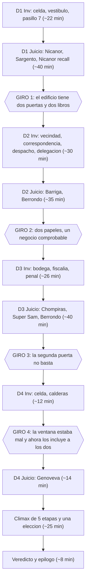

# Caso 5: El Tomo Trece — El Último Juicio de Don Ramón

> **Estado: implementado en código** (guion ES/EN, clímax de cinco etapas, arte y geometría de hotspots). El plan [[docs/plans/case-5-el-tomo-trece.md]] no se reescribe aquí. Contiene spoilers completos de los cinco episodios. Dirección de arte: [[docs/specs/artistic-direction.md]]. Configurado en [[src/case/case.group.md]]. El BGM `truth` no se usa en este episodio.

### 0.0 Bitácora de auditoría ([[docs/lessons-learned/spec-audit-lens-log.md]])

| # | Lente | Fecha | Resultado |
|---|---|---|---|
| 1 | Conteos y referencias cruzadas | — | Hallazgos convertidos en pruebas |
| 2 | Calendario y cronología 1982 | — | Hallazgos convertidos en I4, I10 |
| 3 | Cronología física del crimen | — | Hallazgos convertidos en I11, I12 |
| 4 | Justicia de fallos del clímax | — | Hallazgos convertidos en I8 |
| 5 | Ledger y columnas por riesgo | 2026-09-16 | §24 creado ([[docs/lessons-learned/ledger-columns-follow-case-risk.md]]) |
| 6 | Relaciones entre vistas (ranuras §5 ↔ guion, declaración ↔ revelación, llegada ↔ hallazgo) | 2026-09-17 | 13 hallazgos; corregidos y convertidos en pruebas relacionales |
| 7 | Simulación de agentes y presentaciones | 2026-09-17 | Hueco del actuario y presupuesto pre-crimen |
| 8 | Contrato de motor, audio y tipos (guion ↔ `src/types`, `TrackCatalog`, `SFXName`, §25) | 2026-09-17 | 1 hallazgo: §25 sin fila de audio; corregido |
| 9 | Cobertura del ledger y simulación del jugador (24.A ↔ descarte, §2.2 ↔ §24.B, §7.3 ↔ guion, fuentes de conocimiento, §9 presupuesto) | 2026-09-17 | 7 hallazgos: espera de §2.2, A11 del Sargento, fila 2 del descarte, hora 19:05 de L2, ubicación de L7, vector de conocimiento de Super Sam, suma de §9; convertidos en I17–I21 |
| 10 | Conformidad con las reglas duras del propio episodio (§1.1, §7.2, §8, §20, §22, §23.2–23.3) ejecutadas contra el guion completo | 2026-09-17 | 5 hallazgos: antigüedad del Sargento, asistencia del Sargento a los cuatro juicios, seis→ocho días y conducta de D3-T2 en §20.1, ese caída en los paneles A/B de §23.3; convertidos en I22–I25 |
| 11 | **Defensa adversaria del culpable** (suficiencia probatoria: qué demolería un defensor de Berrondo; atribución de cada rastro a una persona en pantalla; presupuestos contra las duraciones que declaran los propios testigos) | 2026-09-17 | 5 hallazgos: rúbrica de la segunda tira nunca leída en pantalla (I14), «dato tercero» inexistente en §21/§20.1, presupuesto de apertura sin tiempo de extracción, 2.8 kg atribuidos al tomo de lujo, orden de filas de §4.2 |
| 12 | **Paridad de localización ES↔EN** (qué argumento deja de leerse al cambiar de idioma: láminas compartidas, defecto tipográfico, juegos de palabras) | 2026-09-17 | 3 hallazgos: `SÁB` en una lámina declarada compartida, `s` minúscula sin regla de traducción, refranes y chiste sin regla de sustitución; convertidos en I30–I32 |
| 13 | Orden de actos y fechas heredadas (tabla §4.3, paneles B/C y diálogos del museo/Chómpiras) | 2026-09-17 | Cero hallazgos nuevos: se conservaron las identidades de Caso 1/Caso 2 y de `panel_b`/`panel_c`; solo cambiaron sus fechas. |
| 14 | **Contrato inter-espec**: los hechos heredados del nuevo orden de actos (Acto 1 = Caso 2, crimen 21 ago; Acto 2 = Caso 1, museo 28 ago), verificados contra los specs fuente de los Casos 0–4, no contra las vistas de este documento | 2026-09-17 | 3 hallazgos aplicados: la lámina L5 describía el panel C como una compra que no es la del Caso 2 y leía las fechas fuera de orden; la delegación narraba los legajos «por fecha» con el museo (28 ago) antes que la hacienda (21 ago) y declaraba al comprador del Caso 2 sin identificar; §21/§21.1 heredaban ese cabo falso. Convertidos en I33–I34. El ancla temporal de «Me lo consiguió el Sargento» quedó resuelta en la pasada 15. |
| 15 | **Simulación de agentes extendida entre episodios** (estado de cada personaje que regresa contra su última aparición en pantalla en los Casos 0–4) | 2026-09-17 | 5 hallazgos: conteos de la corte con el Caso 2 mal excluido (quinta→sexta, cuatro→cinco; I38), historial hotelero del Chómpiras imposible en pantalla (I36), doble ocupación sep–oct sin ancla (I36), «me lo consiguió el Sargento» sin ancla temporal (I36, resuelto con la escolta de agosto), orden antiguo en la lista de cinco defendidos. Convertidos en pruebas. |
| 16 | **Canon heredado ↔ specs fuente** (cada re-declaración de los Casos 0–4 cotejada contra su documento fuente) | 2026-09-17 | 2 hallazgos aplicados: el residuo de la bolsa del Caso 1 quedaba cerrado sólo a medias —ahora Sam ata en pantalla la bolsa del museo a su oficina (I35)— y el panel E citaba un acta que el Caso 4 nunca produce, cuando su documento del 24 de octubre es el telegrama (I37). Aceptados sin arreglo por compatibles: «salió periódico», «lo condené yo mismo», «cuatro años de condena», «tengo el papel», «prueba decomisada». |
| 17 | **Justicia de fallos con el nuevo conocimiento del jugador** (líneas de fallo de señalamientos, etapas y elección contra R1–R4) | 2026-09-17 | 4 hallazgos aplicados: el `failDialogue` de la elección diagnosticaba con las antenitas un error que no cometieron todas las opciones; la fila 3 de §20.1 decía «tres días» donde el acuse da cinco (I39); `cartoncitos` afirmaba hechos nunca demostrados sobre Nicanor y `zoclo` una antigüedad sin ancla; el fallo de la etapa 3 enunciaba un criterio que `tomo_caido` satisfacía literalmente. Convertidos en pruebas. |
| 18 | **Re-verificación en paralelo de las lentes 15–17** sobre el documento corregido (confirma los arreglos y audita su radio de explosión) | 2026-09-17 | 9 hallazgos aplicados: el arreglo del Chómpiras asignaba un «turno de noche» que el Caso 4 contradice con escenas diurnas (corregido a «corría entre los dos», I36 actualizado); dos antigüedades de encierro sin sustento («ocho meses de proceso» y «ocho meses adentro» vs el juicio de dos días del Caso 2, I36); el criterio de la etapa 3 aún satisfacía `expediente_casimiro` (ahora «en ese estante… que no pudiera haber salido de él»); el fallo de la etapa 2 era falso para la insignia; «y son los últimos» afirmaba un estado de puntos no controlado; la fila de §21 conservaba la etiqueta «cliente misterioso»; el arte del panel C le ponía «etiqueta de botica» a un brebaje casero de Clotilde; D3-T2 decía «hallada» el 28 de agosto de una ficha hallada el 30; §3 prometía el tic de Casimiro «dos veces por frase» que el guion no ejecuta. Aceptados sin arreglo: 26 vs 20 años del Sargento (métricas distintas) y la Chimoltrufia sin ancla de su traslado al juzgado (su personaje es la sustituta eterna). |
| 19 | **Segunda re-verificación en paralelo de las lentes 15–17** (confirma los arreglos de la 18 y audita su radio) | 2026-09-17 | 11 hallazgos aplicados: el relato §10.1 recordaba un intercambio del estrado invertido (Casimiro presumió «uno estudia el producto» en el Caso 0; la réplica «no estudió nada» era del Tripaseca en el Caso 1); el «corría entre los dos» implicaba un solo hotel cuando el Chómpiras pasó del de Florinda al Buena Vista (I36 reformulada); el Sargento pasó de Preventiva a judicial sin ancla (resuelto: «me pasaron a judicial con el ascenso»); su rencor citaba «poli» tres veces que el Caso 3 no muestra (resuelto con el regaño real del micrófono); L9 conservaba «hallada» con la fecha del abandono y fechaba el decomiso al día del crimen; la libreta de Casimiro citaba una fotografía de periódico sin ancla; «dos tercios del juicio» no reconstruía contra el Caso 0 (ahora «hasta el final del juicio»); «Con la mano levantada» contradecía el manotazo del Caso 1. Aceptado entonces sin arreglo y **revocado en la lente 22**: la vivienda de Don Ramón se escribía «4», cuando el canon de la serie la fija en la **72** (la del Caso 0 sí es otra vecindad) y la ventana de ascenso de octubre cabe entre el 26 y el 31. |
| 20 | **Tercera re-verificación en paralelo de las lentes 15–17** | 2026-09-17 | 5 hallazgos aplicados: «cuatro meses» de la bolsa vacía rebasaban el 28 de agosto (ahora «más de tres meses», dos vistas); el «gasto de preparación» de la boleta del Caso 3 era temporalmente imposible —la redención precede en doce días a la concepción del crimen— (ahora «gasto del culpable» en L5, §4.3, `panel_d` y F12); la memoria del Juez sobre el Tomo Trece decía «no pudo preguntárselo» cuando en el Caso 1 sí preguntó y la objeción cortó (cláusula retirada); «salió periódico» recibió ancla en pantalla («ficha incluida» en boca de Berrondo); el glosario ganó las entradas de Toribio, Nazario y Casimiro que el Caso 0 le exige, y su nota del Acta de Personajes ya no reserva la barra de pestañas al Caso 1. La lente de justicia rindió cero hallazgos en esta pasada (criterio de parada parcial). |
| 21 | **Re-corrida con subagentes en paralelo de las lentes históricas de mayor rendimiento** (relaciones entre vistas, simulación de agentes y presentaciones, canon heredado ↔ specs fuente, defensa adversaria del culpable) **más las catastróficas menos revisadas** (contrato de motor, persistencia y tipos; solvabilidad, gating y conteos). Cada subagente sólo encontró; los arreglos se aplicaron en una sola pasada coordinada | 2026-09-18 | 24 hallazgos reportados, 20 únicos tras deduplicar 4 solapamientos entre lentes, todos aplicados: el `followUp` de D3-T1 leía en estrado las dos tiras del 4-XII un día antes de que E3 lo presentara como descubrimiento (I40); la defensa del día 2 alegaba el ofrecimiento del fichero sin fuente en pantalla y el Juez del día 3 lo contradecía (I41); Berrondo se declaraba síndico desde 1963 contra su «primera sindicatura» (I42); la coartada adjudicaba los ciento veinte escalones al tramo corto (I43); el fiscal firmaba 120 oficios/semana y 600/mes (I44); la caldera «llevaba cuatro días» dicho el 4 y el 6 (I45); la regla de §7.1 «la línea siguiente sin `bg` devuelve la cámara» era falsa en investigación y las 6 líneas tras lámina/relato no re-estampaban `bg` (I46); Genoveva era despedida con la carpeta de vales que E3 y §18.4 consultan (I47); el Juez ordenaba «esa fotografía» y el alguacil traía sólo el tomo (I48); las filas 3 y 4 de §20.1 negaban a Don Ramón el citatorio del lunes e invertían Nicanor/Sargento en el relevo (I49); §25 omitía las uniones cerradas `EvidenceId`/`ProfileId`/`PoseName` en un inventario declarado exhaustivo (I50); la cita del panel B perdía tres renglones y escribía «— 5 min.» donde la fuente imprime «5 min.» (I51); la etapa 2 del perfil de Berrondo adelantaba un dato que GIRO 2 no ejecuta (I52); la fila del actuario en §21 citaba como siembra y cobro bloques que no los contienen (I53); el alcance de las 47 partidas se deslizaba del depósito al huacal; §4.2 no declaraba ser vista derivada y colocaba el montacargas a las 16:45 fuera del presupuesto de §24.B (I54, I12). Solvabilidad y gating rindieron cero bloqueos (criterio de parada parcial de esa lente). |
| 22 | **Canon de la serie sobre datos de identidad del elenco** (domicilios, nombres y números que el público ya conoce de *El Chavo del 8* / *El Chapulín Colorado*) | 2026-09-18 | 1 hallazgo aplicado: el domicilio de Don Ramón se escribía «vivienda 4» en las nueve líneas que lo citan (celda, vecindad, D2-T1, clímax E4 y E5) y en la lámina `examine_esquina_tarjeta`; el canon lo fija en la **casa 72** de la vecindad. Unificado a 72 en ES y EN y cubierto con prueba estructural. No se tocó la vivienda 4 del Caso 0 (domicilio de Toribio Pantoja, otra vecindad) ni el «setenta y nueve» del Caso 3 (edad del Doctor Chapatín). |
| 23 | **Física del soborno de Super Sam** (lente abierta por el autor al leer D3-T2: «¿le pagaron pero perdió dinero?») | 2026-09-20 | 4 hallazgos aplicados, uno de ellos **revoca I35**. (a) El cobro llegaba dentro de una bolsa de lona, imposible: esa noche Sam **pierde** una bolsa y el día 1 del Caso 1 sube al estrado sin nada al hombro; ahora le devuelven un bulto envuelto en papel de estraza. (b) El cobro pesaba «seis kilos», que son la bolsa entera y no la sexta parte que el personaje declara haber perdido; ahora es **un kilo de seis**. (c) El robo del despacho no tenía fecha y el jugador no podía situarlo; ahora es la **mañana del 28 de agosto**, y Sam explica por qué no levantó el acta. (d) La presión 5 enumeraba en tríos con voz de informe; reescrita para que Sam **cuente**, que es su gesto, y se cite a sí mismo con la evasiva del Caso 1. I35 pasa de «dos bolsas distintas» a **una sola, la suya**: la que el Tripaseca usa como arma y deja vacía en el patio. El residuo del Caso 1 se cierra más fuerte, no más flojo. |

**Regla:** cada nueva pasada declara aquí su lente antes de empezar; repetir una lente no cuenta como auditoría. El criterio de parada es una pasada con lente nueva que rinde cero hallazgos.

---

## 0. Ajustes aprobados sobre el plan

| # | Ajuste | Origen |
|---|---|---|
| 1 | **Cuatro horas** en lugar de 150 minutos: **tres jornadas completas** (investigación + juicio) más una **cuarta jornada corta** (investigación de dos locaciones + un testimonio + clímax). | Requisito del autor. |
| 2 | **Mecánica destacada: la lámina explicativa** (§7). No es motor nuevo —la convención `[LÁMINA]` ya existe desde el Caso 0— pero aquí se formaliza con reglas y se usa nueve veces. Regla dura nueva: **prohibida dentro de un contrainterrogatorio**. | Requisito del autor. |
| 3 | **Nueve testimonios y cuatro giros** en lugar de seis y dos. El giro 3 y el giro 4 son nuevos respecto al plan: el día 3 la defensa gana el punto y **pierde el caso**, y el día 4 la defensa tiene que destruir su propia coartada para seguir. | Densidad exigida por el ajuste 1. |
| 4 | **Reparto ampliado**: tres familias de sprite nuevas (Berrondo, Nicanor, Genoveva) en lugar de una, y tres personajes existentes recolocados en oficios nuevos (Chómpiras cargador del Archivo, Chimoltrufia en correspondencia del juzgado, Señor Barriga como casero acreedor). | Requisito del autor. |

**Requisito que contradecía el plan y quedó resuelto por el autor:** «acusado nuevo». Se conserva el acusado del plan. Don Ramón y El Chapulín siguen trabajando juntos, pero con los papeles invertidos: el Chapulín litiga y Don Ramón asesora desde el banquillo (§1, §3).

---

## 1. Objetivo y reglas de diseño

Caso 5 es el **último episodio** en orden de juego. Su trabajo es cerrar el arco de la serie sin exigir que el jugador haya jugado ninguno de los anteriores, y hacerlo con las mecánicas que los Casos 0–4 ya inventaron. No añade una mecánica jugable, pero sí exige ampliar la integración del motor para registrar `case5` y una cuarta jornada (§25).

| Regla | Valor |
|---|---|
| Duración objetivo | **~240 minutos** (comprobar jugando; las estimaciones de §9 suman ~252). Es el episodio más largo y el único que puede permitírselo. |
| Jornadas | **4 investigaciones + 4 juicios.** `adjournment.next` encadenado tres veces. |
| Testimonios | **9**, repartidos 3 / 2 / 3 / 1. |
| Testigos en el estrado | 7 distintos (Nicanor ×2, el Sargento, Señor Barriga, Berrondo ×2, Chómpiras, Super Sam, Genoveva). |
| Locaciones de investigación | **12** (3 / 4 / 3 / 2). |
| Giros | **4**, uno al cierre de cada jornada de juicio (el cuarto abre la jornada 4 en lugar de cerrarla). |
| Entradas del Acta (pruebas) | **23**, todas con al menos una ranura de presentación (§5 y §10–18). |
| Fichas del Acta de Personajes | **10**, dos con ranura de señalamiento. |
| Señalamientos (Present & Point) | 2. |
| Penalizaciones | 5 puntos por jornada; se restauran al aplazar. |

### 1.1 Las cuatro reglas duras del episodio

**Regla de legibilidad.** El caso es enrevesado por acumulación, no por ofuscación. Cada jornada plantea **una pregunta enunciada en voz alta por el Juez**, la contesta, y la respuesta vuelve falsa la hipótesis de la jornada anterior. El jugador nunca adivina: siempre tiene en el Acta la pieza que necesita.

**Regla de sospecha.** La defensa no abre señalando personas; ataca hechos. El paso de «aquí hubo alguien más» a «ese alguien es el licenciado Berrondo» está **mecanizado y diferido**:

1. Durante los días 1 y 2, Berrondo es **coadyuvante de la fiscalía**. El Juez dice en pantalla que no se le toma declaración a un abogado porque la defensa esté incómoda. El jugador **no puede** tocarlo.
2. El día 2 Berrondo **se ofrece voluntariamente** a declarar. Es él quien abre esa puerta, no la defensa.
3. El día 3 declara ya **en calidad de investigado**, por decisión del Juez tras el giro 2.
4. El **señalamiento interactivo de una persona** ocurre una sola vez, en la etapa 1 del clímax, y lo ordena el Juez. La defensa puede formular verbalmente la acusación después sin abrir otro señalamiento.

Ningún testigo del episodio es tratado como sospechoso: Nicanor, el Sargento, el Señor Barriga, el Chómpiras, Super Sam y Genoveva son **honestos**, y de los seis, cuatro están equivocados y ninguno miente. Don Ramón **no** verbaliza que nunca antes acusó a nadie: ese recurso se gastó en el Caso 3 y repetirlo lo vuelve tic.

**Regla de no modificación.** Los Casos 0, 2, 3 y 4 quedan **idénticos byte a byte** ([[docs/plans/arco-general-el-tomo-trece.md]] §2). El Caso 1 también: está implementado y no se toca. Todo dato de un episodio anterior entra al Caso 5 como **panel del expediente de serie** (§5, `expediente_serie`), con su descripción autocontenida. Ninguna deducción exige memoria del jugador: la memoria la guarda el Acta.

**Regla de residuo cero.** A diferencia de los Casos 1 y 4, este episodio **no deja sin cobrar ninguna pista propia de su misterio central**. Es el último. Cada pista sembrada en el Caso 5 se cobra en pantalla y §21 lo audita pieza por pieza. Los tres hilos heredados del Caso 1 siguen siendo el origen de la bolsa de lona, el sentido de «el Tomo Trece» y **quién escribió la ficha del museo**. El clímax relaciona la ficha con la Olivetti y atribuye el montaje a Berrondo mediante la cadena completa de pruebas; el cotejo aislado nunca identifica al mecanógrafo.

---

## 2. Sinopsis y verdad del autor

### 2.1 Lo que la fiscalía cree

El **sábado 4 de diciembre**, el sentenciado **Casimiro Lengua** —culpable del Caso 0, cumpliendo condena— es trasladado al **Archivo Judicial del Distrito** para una diligencia de su apelación. Había ofrecido al ministerio público «entregar un fichero» a cambio de reducción de pena, y pidió expresamente que estuviera presente el único abogado que lo venció: **Don Ramón**.

A las **16:40** Don Ramón firma el libro de visitas y sube. A las **16:58** firma su salida. A las **17:35** el conserje encuentra a Casimiro muerto de un golpe en la nuca, entre el estante 7 y la mesa de consulta, con un tomo de enciclopedia tirado a un metro y **la mano derecha cerrada sobre la esquina rota de una tarjeta**. En esa esquina, mecanografiado, hay un domicilio: el de Don Ramón.

Cinco días antes, alguien pagó en efectivo **diecisiete meses de renta atrasada** al Señor Barriga, a nombre de Don Ramón.

La tesis de Super Sam es demoledora y falsa: que las cuatro victorias del defensor entre agosto y octubre no fueron talento sino **información comprada**, que Casimiro iba a decirlo en esa diligencia, y que Don Ramón lo calló con lo primero pesado que tuvo a la mano — igual que Casimiro calló a Don Nazario en julio.

### 2.2 Lo que de verdad pasó

**El Lic. Fulgencio Berrondo** liquidó *Enciclopedias El Saber Universal, S.A.* en 1971. Remató los tomos por kilo y, con autorización judicial, **se adjudicó el cedulario de suscriptores por tres pesos**: once mil cuatrocientas tarjetas levantadas casa por casa durante quince años para autorizar crédito a veinticuatro volúmenes. El remate le transfirió el cedulario, pero no autorizó sacar las tarjetas originales del depósito judicial mientras concluye la quiebra. Cada tarjeta trae domicilio, ingreso declarado, **qué objetos de valor declaró la familia**, quién paga puntual, quién está atrasado y **qué chapa tiene la puerta**. Es un catálogo de objetivos escrito por las propias víctimas. Berrondo vende copias ficha por ficha.

Lo que nadie ha pensado es **dónde vive ese fichero**. Aunque Berrondo se adjudicó el cedulario, sus originales permanecen inventariados, sellados y depositados **dentro del propio Archivo Judicial**, en el huacal 9 de la bodega de bienes, por las condiciones de su custodia mientras la quiebra sigue abierta. El síndico conserva la llave y responde del depósito: **ser dueño del fichero no lo autoriza a llevárselo**. Lleva once años vendiendo copias desde esa caja del juzgado. En las reglas jurídicas de esta ficción, ni la adjudicación ni esas ventas autorizadas constituyen delito.

También está ahí la **máquina de escribir Olivetti Lexikon 80, partida 41 del inventario**. Todas las fichas de la serie salieron de ella, porque sacarla del Archivo habría sido disponer de un bien de la masa y **el hombre que invoca la ley nunca se llevó la máquina**. Baja los jueves, destapa el huacal, escribe un rato y se va. Durante once años lo ayudaron distintos cargadores y conserjes; el Chómpiras sólo lo hace desde que entró a trabajar en septiembre.

Entre agosto y octubre, Don Ramón le destruyó **cuatro clientes en cuatro juicios seguidos**. No es venganza: el abogado es malo para el negocio y, además, es la única persona viva que ha visto las cuatro escenas. Está a una conexión de ver el patrón.

El **29 de noviembre** llegan a la sindicatura dos cosas el mismo día: la **notificación** de que el 4 de diciembre, a las 17:00, un sentenciado abrirá el huacal 9 delante del actuario Hilario Balbuena; y la certeza de que ese sentenciado es **el único levantador vivo que puede nombrarlo**. Balbuena era el actuario habitual de esas diligencias sabatinas: cerraba el libro semanal de exhortos a las 17:00 en el juzgado contiguo y sus cuatro llegadas anteriores constaban entre las 17:18 y las 17:25. Berrondo había coincidido con él dos veces y confirmó con la Chimoltrufia que volvería a ser el asignado. Por eso podía prever, sin controlar el retraso exacto, que a las 17:00 todavía no estaría en el Archivo. Berrondo baja al sótano, escribe a máquina una nota, mete diecisiete meses de renta en un sobre amarillo y lo desliza bajo la puerta del Señor Barriga, antes de que éste lo encuentre a las nueve de la mañana. **La hora exacta de recepción de la notificación y de entrega del sobre no consta**; su orden relativo sí. Después arranca la esquina de una tarjeta de su cedulario —la del domicilio de Don Ramón, levantada en 1969 y **actualizada en agosto de este año**— y guarda el fragmento.

El 4 de diciembre entra a las 16:05 por el **acceso de peritos y auxiliares**, que tiene su propio libro y que nadie considera «visitas». Baja al sótano, revisa el huacal con el vale ordinario del día, lo sella y lo fecha, y sube en el **montacargas de carga** al primer piso. Ve a Don Ramón hablando con Casimiro y espera detrás de los estantes. Poco antes de las 16:50 baja por la escalera de servicio y devuelve el gafete en la ventanilla —el gafete sólo sirve para las salas de lectura; su credencial de síndico no caduca ni tiene horario—; la hora del libro es la de esa devolución. Vuelve a subir y se oculta otra vez.

A las 17:00 los dos custodios del pasillo se bajan a firmar su relevo. A las **17:02**, Berrondo saca el **Tomo XI** del estante de consulta, se lo cierra a Casimiro en la nuca desde atrás y desde arriba, lo deja caer, y le acomoda la esquina de tarjeta en la mano.

Y entonces comete su único error, que no es un cálculo sino un reflejo: **no puede dejar el estante con un hueco**. Usa el **montacargas de carga**, cuyo mando conserva como síndico, y baja al sótano en noventa segundos. **Sin tramitar un segundo vale**, abre otra vez el huacal 9 y saca un Tomo XI de la **edición de lujo** —media piel, cantoneras de latón, doscientos diez ejemplares sin vender desde 1971—. Vuelve a tapar el huacal, pega la segunda tira, la firma y la fecha, y **sólo entonces** sube con el tomo por el mismo montacargas: no deja tapas abiertas detrás de sí. Lo mete en la ranura vacía y baja al descanso del patio. Sale por el patio de maniobras a las 17:14. El recorrido completo queda presupuestado en §24.B; durante el crimen no usa los ciento veinte escalones.

Sobre un estante de veintidós lomos de tela idénticos hay, desde esa tarde, **un lomo de piel con cantoneras de latón**, y en su guarda un sello: `Q-114/1971 — MASA CONCURSAL — HUACAL 9`. La ranura 13 sigue vacía.

**El arma no es el tomo. El arma es el orden.**

### 2.3 La ironía que sostiene el episodio

Casimiro Lengua murió **haciendo el trabajo de la defensa**. Su apelación no pedía clemencia: pedía un cotejo. Había escrito en su libreta, con su prosa de catálogo, que la tarjeta de presentación que la corte le decomisó en julio y la ficha que apareció en un patio de carga en agosto salieron **de la misma máquina**. Iba a señalar el huacal donde estaba esa máquina.

Nadie le hizo caso durante dieciocho días porque el oficio se quedó en un cajón de la fiscalía. Y el día que por fin le hicieron caso, lo mataron a doce metros de la máquina, guardada en el sótano.

Berrondo **no lo reconoció**. Casimiro fue uno de ciento diez distribuidores en 1969, y a Berrondo sólo le interesaban los distribuidores como partidas de un inventario. Casimiro, en cambio, se pasó once años copiándole hasta la manera de hablar.

---

## 3. Reparto

| Personaje | Papel | Notas de escritura |
|---|---|---|
| **El Chapulín Colorado** | **Defensa titular (el jugador)** | Es la progresión que la serie venía dibujando sin decirlo: asesor en el 0, codefensor del 1 al 4, titular en el 5. Litiga con `chapulin_idle / point / slam / panic`. Sigue siendo él: destroza dos refranes y le tiemblan las antenitas. Pero cuando el Juez lo llama «licenciado», no corrige. |
| **Don Ramón (Lic. Monchito)** | **Acusado** | Litiga desde el banquillo, como hizo el Chapulín en el Caso 1. Diecisiete meses de renta, pagados por un desconocido. Dice, por primera y única vez en la serie y con la voz de alguien que no está haciendo un chiste: *«¿Y ahora quién podrá defenderme?»* |
| **Super Sam** | Fiscal | *«Time is money!»*. Este episodio le cobra su único arco: el día 3 declara contra sí mismo, voluntariamente, y se queda sin fiscalía. Nadie lo acorrala. Nadie se lo agradece. |
| **Lic. Fulgencio Berrondo** | **Acusador coadyuvante y culpable único** | Setenta y un años. Síndico de la quiebra 114/1971 desde el 9 de marzo de 1971. Cortés, colegiado, impecable, **sin sanciones formales conocidas antes del homicidio**; esa reputación no acredita la licitud del uso de fondos de la sindicatura. Numera sus argumentos, cita tomos y **define palabras que nadie preguntó**. Conserva la compostura hasta las etapas finales del clímax. Durante los contrainterrogatorios sólo se demuestra una mentira de su coartada; las demás falsedades se desenmascaran en el clímax. Su derrota es quedarse sin vocabulario. |
| **Casimiro Lengua** | **Víctima** | Culpable del Caso 0. Su condena **no se revisa**: el arco no lo absuelve de nada, y el guion nunca insinúa que lo manipularan. Aparece en un relato (§10.1), en una fotografía pericial y en su libreta. Su tic de consultar la hora aparece en el relato, una hora por intervención; sus dos relojes, en el epílogo. |
| **El Juez** | Juez | El mismo de siempre. Enuncia en voz alta la pregunta abierta al final de cada bloque: es lo que mantiene legible un caso de cuatro horas. Rasgo propio del episodio: es la sexta vez que ve a Don Ramón y la primera que lo ve sentado del otro lado, y lo dice. |
| **El Sargento (Refugio Pazguato)** | Policía investigador (aliado) | Conserva la placa y la facultad de pedir análisis, como cierra el Caso 4. Aquí **no contamina nada**: es su redención. Se pasa dos noches en el Archivo. *«¡A sus órdenes, mi Licenciado!»* — y el «licenciado» ahora es el Chapulín, cosa que le cuesta trabajo. |
| **Nicanor Tolentino, «el Conserje»** | Conserje del Archivo, testigo D1-T1 y D1-T3 | Treinta y un años barriendo el mismo edificio. Honesto, orgulloso y equivocado. Mide el mundo en pasillos y le teme a una sola cosa: **la humedad**. *«La humedad se come el papel, señor juez. La humedad y los ratones.»* Es quien encuentra el cuerpo. Nuevo. |
| **Srta. Genoveva Peñaloza** | Encargada de la ventanilla de peritos, testigo D4-T1 | Contesta exactamente lo que se le pregunta y ni una sílaba más, porque *«el reglamento no me faculta»*. No es hostil: es exacta. Su exactitud, bien interrogada, es lo que abre el día 4. Nueva. |
| **El Chómpiras** | Cargador del Archivo (aliado), testigo D3-T1 | Absuelto en el Caso 2, con el primer trabajo que le da seguro y aguinaldo y aterrado de perderlo. Sube y baja huacales en el montacargas. Conoce desde septiembre una rutina institucional que empezó once años antes. Declara que Berrondo conserva el mando de síndico y sabe operar el aparato sin cargador. |
| **La Chimoltrufia** | Oficina de correspondencia del juzgado (sólo investigación) | *«¡Como digo una cosa, digo otra!»*. Entrega, traspapela y recuerda al revés; pero el acuse que firmó existe y tiene una rúbrica. |
| **Señor Barriga** | Casero de Don Ramón, testigo D2-T1 | Honesto y equivocado, como en el Caso 3. Diecisiete años esperando esa renta y no la iba a rechazar. *«¡Tenía que ser el Chavo del Ocho!»* no se dice aquí: su frase de este caso es contable. |

**Sin sprite:** los dos custodios del pasillo (voz fuera de cuadro), el actuario Hilario Balbuena (llegada registrada a las 17:44, sin diálogo), la perita en documentoscopia (firma un dictamen que lee el Sargento) y el agente de guardia del ministerio público (presente en la inspección, sin intervención). El secretario de acuerdos habla como `SECRETARIO` desde la mesa de la fiscalía, con las poses `secretario_leyendo`, `secretario_leyendo_senala`, `secretario_leyendo_pagina` y `secretario_leyendo_mira`.

**Cameos de epílogo, sin diálogo propio:** ninguno. El epílogo se juega con cinco personajes y termina donde empezó la serie.

---

## 4. El Archivo Judicial: plano, accesos y cronología

### 4.1 Plano mínimo

Sólo lo que los argumentos necesitan. Todo lo que no esté aquí es libre para el arte.

```
                         CALLE
                           |
                  [PUERTA PÚBLICA]                      [PORTÓN DEL PATIO]
                           |                                    |
   ┌───────────────────────┴────────────┐            ┌──────────┴──────────┐
   │  VESTÍBULO  ·  mostrador público   │            │ PATIO DE MANIOBRAS  │
   │  LIBRO DE VISITAS  (Nicanor)       │            │  (coches, montacarga)│
   └───────┬────────────────────────────┘            └──────────┬──────────┘
           │ escalera principal                                 │
           │                                     [VENTANILLA DE PERITOS]
           │                                      LIBRO DE PERITOS (Genoveva)
           │                                                     │
   ┌───────┴─────────────────────────────────────────────────────┴──────────┐
   │ PRIMER PISO                                                            │
   │   reja del pasillo ──►  PASILLO 7  ──►  mesa de consulta  ──► ESTANTE   │
   │   (aquí esperan los             (los custodios NO ven          DE       │
   │    custodios)                    la mesa desde la reja)     CONSULTA    │
   │                                                       ▲                 │
   └───────────────────────────────────────────────────────┼─────────────────┘
                                      puerta de servicio ──┘
                                              │
                                     ESCALERA DE SERVICIO
                                              │
   ┌──────────────────────────────────────────┴─────────────────────────────┐
   │ SÓTANO · BODEGA DE BIENES                                              │
   │   catorce huacales sellados · HUACAL 9 (quiebra 114/1971)              │
   │   sala de calderas y secadores ──► (pegada al muro del pasillo 7)      │
   └────────────────────────────────────────────────────────────────────────┘
```

**Hechos del plano de los que dependen las deducciones:**

| # | Hecho | Dónde se usa |
|---|---|---|
| P1 | El edificio tiene **dos accesos y dos libros**: el público (visitas) y el de peritos y auxiliares de la justicia. Nadie llama «visitas» al segundo. **El segundo libro no se menciona durante la investigación del D1**: la investigación sólo establece que el libro de visitas lo firman las visitas/el público y que el personal no firma. La existencia del segundo libro se revela en el juicio (GIRO 1). | GIRO 1 |
| P2 | La **escalera de servicio** conecta el patio de maniobras, el sótano y el extremo del pasillo 7 **sin pasar por ningún mostrador**. | GIRO 1, clímax E2 |
| P3 | Desde la **reja del pasillo**, donde esperan los custodios, **no se ve la mesa de consulta**: los estantes la tapan. Se oyen voces; no se ve nada. | D1-T2, GIRO 4 |
| P4 | El **libro de peritos** tiene dos columnas: *hora de entrada* y *hora de devolución de gafete*. **No tiene columna de salida.** | D2-T2 `followUp`, D4-T1 |
| P5 | El **gafete de visita** habilita las salas de lectura del primer piso. La **credencial de síndico** habilita el depósito de bienes, es permanente y no tiene horario. | Clímax E2 |
| P6 | El **estante de consulta** del pasillo 7 guarda la colección donada de *El Saber Universal*: veinticuatro ranuras, veintitrés tomos, y la ranura 13 vacía desde 1971 porque ese tomo **se anunció y nunca se publicó**. | Clímax E3 |
| P7 | La **sala de calderas** comparte muro con el pasillo 7. El tambor del termógrafo está en el sótano, conectado por cable a una **sonda de temperatura situada en el pasillo 7**; sus lecturas corresponden al pasillo, no al sótano. | GIRO 4 |
| P8 | El **montacargas de carga** comunica sótano, descanso del patio y primer piso por el mismo hueco que la escalera de servicio. Cada trayecto entre niveles extremos tarda noventa segundos. El Chómpiras usa el mando de cargador; Berrondo conserva un mando de síndico y sabe operarlo solo. | D3-T1; clímax E3; §24.B |

### 4.2 Cronología del sábado 4 de diciembre

> **Vista derivada** del Libro de hechos (§24).

> **Por qué un sábado.** El traslado de un interno en fin de semana cuesta menos, y el actuario no cobra hora extra si la diligencia se fija a las 17:00. Lo decidió así la fiscalía, por presupuesto, y lo dice Super Sam en el día 3 sin que nadie se lo pregunte. La consecuencia es que el Archivo estaba **casi vacío**: el libro **público** tiene catorce firmas (la última entrada a las 16:40), mientras el libro separado de peritos y auxiliares tiene cuatro asientos, incluidos el del actuario a las 17:44 y el del Sargento a las 17:52. El perito valuador aparece en ambos registros: su paso por el acceso público y su entrada profesional por la otra ventanilla son trámites distintos; Nicanor sólo da fe del primero.
>
> Las jornadas del juicio son, por tanto, **lunes 6, martes 7, miércoles 8 y jueves 9 de diciembre**. El último día es jueves: el día en que el síndico baja al sótano.

Las horas de autor **no son hechos judiciales**: la columna derecha dice hasta dónde llega el jugador.

| Hora | Hecho real | Alcance para el jugador |
|---|---|---|
| 3 dic | Revienta un tubo en el muro del pasillo 7. Mantenimiento pone la caldera y dos secadores al máximo y los deja así cuatro días. | `bitacora_caldera`, D4. Nicanor lo menciona desde el D1. |
| 16:05 | Berrondo firma el **libro de peritos**. Recibe gafete. | `libro_peritos`, D2. |
| 16:10–16:40 | Sótano. Con el vale ordinario de revisión, abre el huacal 9, revisa, cierra, sella y **fecha la primera tira del día**. | `huacal_9`, D3. Él mismo lo declara. |
| 16:25 | Dos custodios entregan a Casimiro en la mesa de consulta del pasillo 7 y se quedan en la reja. | `hoja_relevo`. |
| 16:40 | Don Ramón firma el **libro de visitas**. Sube. | `libro_visitas`, D1. |
| 16:40–16:45 | Berrondo sube en el montacargas de carga y espera detrás del estante 7. | **Nunca se acredita con testigo.** Presupuestado en §24.B; se demuestra por el estante (clímax E3). |
| 16:44–16:56 | Don Ramón y Casimiro hablan doce minutos. Los custodios oyen dos voces y no ven nada (P3). | Relato de §10.1. **La corte nunca tiene más que la palabra del acusado.** |
| 16:50 | Berrondo devuelve el gafete en la ventanilla y vuelve a subir. | `libro_peritos`. |
| 16:58 | Don Ramón firma su salida. | `libro_visitas`. |
| 17:00 | **Los dos custodios bajan a firmar el relevo.** | `hoja_relevo`. |
| 17:02–17:03 | Golpe único con el **Tomo XI** del estante de consulta, desde atrás y desde arriba, cerrando el libro sobre la nuca. Deja caer el tomo. Acomoda la esquina de tarjeta en la mano derecha de la víctima. | `informe_forense_c5`, `tomo_caido`, `esquina_tarjeta`. |
| 17:03–17:04:30 | Baja solo en el **montacargas de carga**. No usa la escalera. | `plano_archivo`; D3-T1; §24.B. |
| 17:04:30–17:07:30 | Sin registrar otro vale, abre el huacal 9 y extrae un **Tomo XI de la edición de lujo**. | Dos sellos / un vale; clímax E3. |
| 17:07:30–17:10:30 | Recoloca la tapa, pega una segunda tira, la firma y la fecha. | `huacal_9`; clímax E3. |
| 17:10:30–17:12 | Sube en el montacargas con el tomo de lujo de 3.4 kg. | P8; clímax E3. |
| 17:12–17:12:30 | Llena la ranura 11. | `estante_consulta`. |
| 17:12:30–17:14 | Baja hasta el descanso del patio y sale por el portón de maniobras. | P2, P8. |
| 17:15 | El relevo de custodios llega a la **reja** y firma su entrada; si los relevos habían entrado antes al edificio, todavía no estaban vigilando el pasillo. | `hoja_relevo`. |
| 17:35 | Nicanor sube a cerrar el pasillo y encuentra el cuerpo. | D1-T1. |
| 17:44 | El actuario Hilario Balbuena entra por peritos y firma, ya después del hallazgo de las 17:35; la diligencia queda suspendida. Sus cuatro diligencias sabatinas anteriores constan entre 17:18 y 17:25; Berrondo había coincidido con él dos veces. | `libro_peritos`; D2 correspondencia. |
| 18:40 | El médico forense toma temperatura. Con el modelo normal fija la muerte entre **17:00 y 17:30**. | `informe_forense_c5`. |
| 19:05 | El Sargento toma la fotografía pericial de la escena. | L2. |
| 21:40 | Detención de Don Ramón en la vecindad. Inventario: la insignia abollada, tres pesos, una libreta y **un recibo de renta a su nombre por diecisiete mensualidades**. | `parte_detencion`. |

> **Nota de la hora del gafete.** Berrondo devuelve el gafete a las **16:50** y vuelve a subir por la escalera de servicio. Esa devolución es lo único que el libro registra. La fiscalía la interpreta inicialmente como «hora de salida», pero la defensa demuestra ya en D2-T2 que el encabezado impreso dice «devolución de gafete». El día 4 Genoveva confirma cómo asienta esa hora y admite que ella misma usaba el nombre equivocado: **el reglamento no la faculta para mirar la puerta del patio** (P4, P5).

> **Nota de la ventana forense.** El forense trabajó con el modelo de enfriamiento de una sala a 20 °C. El pasillo 7 estaba a **31 °C** por los secadores. Corregido, el intervalo se desplaza a **16:35–17:05**, que es el giro 4 — y que mete a Don Ramón dentro de la ventana junto con Berrondo. **La hora deja de decidir nada y el caso se resuelve por el estante, el huacal y la máquina.**

### 4.3 Cronología de la serie que el episodio cobra

| Fecha | Caso | Lo que el Caso 5 hace con eso |
|---|---|---|
| 12 jul | Caso 0 | La tarjeta de una sociedad disuelta desde 1971 que Casimiro llevaba encima. Panel A de `expediente_serie`. |
| 28 ago | Caso 1 | La ficha de seis renglones del patio de carga, con su renglón 6: *«Servicio de cierre incluido — 5 min.»* Panel B. |
| 21 ago | Caso 2 | El frasco de valeriana que compró el propio culpable de ese caso, y el molde de cera que dejó al copiar una llave. Panel C. |
| 15 sep | Caso 3 | La boleta del Monte de Piedad: **$12,000 en efectivo el 3 de septiembre**, doce días antes del crimen, pagados por Aniceto para desempeñar el micrófono. Panel D. Documenta un gasto del culpable, no un cobro. |
| 24–27 oct | Caso 4 | El telegrama de Cuajinais reclamando su parte del Collar de Cleopatra: botín impune cuyo reparto nunca se pagó. Panel E. |
| 29 nov | — | Notificación al síndico. Diecisiete meses de renta en un sobre amarillo. |
| 4 dic | Caso 5 | — |

Los paneles B y C conservan su identidad probatoria —B es la ficha del museo y C son el frasco y el molde— aunque sus fechas ya no estén en orden ascendente. El orden de los actos es una decisión de presentación y no renombra los `caseId`.

---

## 5. Acta del Juicio — Pruebas

Veintitrés entradas. **Todas tienen al menos una ranura de presentación** (tabla de esta sección y guion de §10–18). Catálogo aislado propio (`EvidenceCatalogCase5Es.ts` / `...En.ts`), siguiendo el aislamiento del Caso 4: **no se importa ningún catálogo de otro caso**.

> **Colisión de nombres de archivo.** `insignia_abogado` y `parte_detencion` reutilizan `EvidenceId` de los Casos 0 y 1 y **deben sobrescribir `icon`** o colisionan en `assets/<id>.webp` ([[docs/lessons-learned/shared-evidence-id-filenames.md]]): `assets/parte_detencion_c5.webp`. `insignia_abogado` conserva su icono: es la misma insignia y es deliberado. El informe forense del Caso 5 también tiene contenido propio y usa `informe_forense_c5` / `assets/informe_forense_c5.webp`, porque `informe_forense` ya pertenece al Caso 4.

### 5.1 Bloque A — La escena (día 1)

| ID | Obtención | Descripción inicial permitida | Ranura |
|---|---|---|---|
| `insignia_abogado` *(heredado)* | Inicio | Insignia abollada de Don Ramón. Se le cayó al drenaje en julio. Hoy la trae otro. | D1 `openingPresent`. |
| `parte_detencion` *(heredado, icono nuevo)* | D1 celda | Acta de detención del 4 de diciembre: detención de Ramón Valdés a las 21:40 en la vecindad. Inventario: una insignia de abogado, tres pesos, una libreta y un recibo de renta a su nombre por diecisiete mensualidades. | Sostiene el recibo de renta (giro 2). **Ya no lleva anexo.** |
| `hoja_relevo` **(nueva)** | D1 celda | Hoja de relevo de custodia del Archivo Judicial, 4 de diciembre. Turno saliente: Rangel y Nieto firman su **salida** de la reja del pasillo 7 a las **17:00**. Turno entrante: Cadena y Solís firman su **entrada** a las **17:15**. Quince minutos sin custodio asentado en la reja. | D1-T2 contradicción resolutoria (declaración 6). La descripción debe declarar ambas horas: la brecha es la contradicción. |
| `esquina_tarjeta` **(nueva)** | D1 celda | Fotografía pericial del fragmento hallado en la mano derecha de la víctima: esquina de cartulina crema, mecanografiada, con un domicilio incompleto. `detailedView`. | D1-T2 `followUp`. |
| `informe_forense_c5` **(nueva)** | D1 pasillo 7 | Casimiro Lengua: golpe único en región occipital. Objeto pesado, **canto recto de cuatro centímetros**, sin aristas vivas. Temperatura tomada a las 18:40; intervalo estimado **17:00–17:30**. `updates[]` de **2 etapas**. | D1-T1 contradicción. |
| `tomo_caido` **(nueva)** | D1 pasillo 7 | Tomo XI de *El Saber Universal*, edición económica, encuadernado en tela. Hallado a un metro del cuerpo, con sangre en el lomo. **En la guarda, un sello de tinta violeta.** `detailedView`. | D3-T3 `followUp`. |
| `estante_consulta` **(nueva)** | D1 pasillo 7 | Estante de consulta del pasillo 7. Veinticuatro ranuras numeradas; la colección de *El Saber Universal* donada al Archivo en 1971. `detailedView`. **Tablero del Señalamiento 2.** | Clímax E3 + **Señ. 2**. |
| `libro_visitas` **(nueva)** | D1 vestíbulo | Libro de visitas del público, hoja del 4 de diciembre. Catorce firmas. La última: *R. Valdés, 16:40 / 16:58*. **La descripción declara que sólo firman los que vienen de visita y que el personal del edificio no firma**, de modo que presentarlo ante *«¿A quién no le exige firma ese libro?»* se sostiene con el dato ya obtenido en el vestíbulo (no requiere `updates`). `detailedView`. | D1-T1 `followUp`. |
| `plano_archivo` **(nueva)** | D1 vestíbulo | Plano de protección civil del Archivo Judicial, clavado con tachuelas junto al mostrador. Marca dos accesos, la escalera de servicio y los tres descansos del montacargas en sótano, patio y primer piso. `detailedView`. | D1-T3 contradicción. *(La etapa 3 del clímax lo cita de palabra pero no lo admite como presentación: sólo acepta `estante_consulta`.)* |
| `expediente_casimiro` **(nueva)** | D1 pasillo 7 | Expediente de apelación de la víctima, hallado **abierto sobre la mesa de consulta, en la página 214**. En esa página está pegada, como prueba decomisada en julio, una tarjeta de presentación. | D1-T3 `followUp`. |

### 5.2 Bloque B — El dinero y el aviso (día 2)

| ID | Obtención | Descripción inicial permitida | Ranura |
|---|---|---|---|
| `recibo_renta` **(nueva)** | D2 vecindad | Recibo del Señor Barriga, 29 de noviembre, por diecisiete mensualidades. Concepto escrito de su puño: **«recibí de tercero no identificado, a cuenta del inquilino»**. | D2-T1 `followUp`. |
| `nota_mecanografiada` **(nueva)** | D2 vecindad | Media cuartilla mecanografiada que venía en el sobre amarillo. Tres renglones en tercera persona y fórmula de oficio. Sin firma. `detailedView`. | D2-T1 contradicción. |
| `acuse_notificacion` **(nueva)** | D2 correspondencia | Acuse del oficio 4471, entregado el 29 de noviembre en la sindicatura de la quiebra 114/1971. El asiento transcribe el asunto completo, **con el nombre del interno que promovió la diligencia**. Rubricado. `detailedView`. | D3-T3 contradicción. |
| `credencial_sindico` **(nueva)** | D2 despacho | Credencial expedida por el juzgado Séptimo: *Fulgencio Berrondo, síndico, quiebra 114/1971*. **Vigente hasta la conclusión del concurso. Sin límite de horario. Acceso al depósito de bienes de la masa.** `detailedView`. | Clímax E2. |
| `inventario_1971` **(nueva)** | D2 despacho | Inventario de la masa concursal, 14 de octubre de 1971. Cuarenta y siete partidas. Partida 12: *cedulario, 11,400 tarjetas*. Partida 41: *máquina de escribir Olivetti Lexikon 80*. Partida 44: *ejemplares de lujo sin vender, 210*. `detailedView`. | D3-T1 contradicción. |
| `libro_peritos` **(nueva)** | D2 juicio, por orden del Juez | Libro de peritos y auxiliares de la justicia, hoja del 4 de diciembre. Cuatro asientos, incluido el del actuario Hilario Balbuena a las 17:44. Dos columnas: **hora de entrada** y **hora de devolución de gafete**. `detailedView`. | D2-T2 contradicción; **D4-T1 contradicción**. |
| `expediente_serie` **(nueva)** | D2 delegación | Extracto certificado de cinco expedientes de este año, compilado por la policía judicial. Cinco paneles: A (12 jul), B (28 ago), C (21 ago), D (15 sep), E (24 oct). `detailedView`. **Tablero del Señalamiento 1.** | D2-T2 `followUp` + **Señ. 1**; D3-T2 `followUp`. |

### 5.3 Bloque C — La masa concursal (día 3)

| ID | Obtención | Descripción inicial permitida | Ranura |
|---|---|---|---|
| `huacal_9` **(nueva)** | D3 bodega | Huacal de madera, quiebra 114/1971. En la tapa, **más de doscientas cincuenta tiras de sello encabalgadas**, cada una rubricada por el síndico y fechada con día de la semana. Las dos superiores llevan la fecha completa **`SÁB 4-XII`**. `detailedView`. | D3-T1 `followUp`; desvío en D3-T1 declaración 2. |
| `fichero_cedulario` **(nueva)** | D3 bodega | Cedulario de once mil cuatrocientas siete tarjetas físicas en nueve cajones de madera. **Ordenado por calle, no por nombre.** Cada tarjeta trae domicilio, ingreso declarado, objetos de valor declarados, puntualidad de pago y estado de la chapa; las bajas permanecen archivadas con marca de inactividad. | D4-T1 `followUp`. |
| `maquina_escribir` **(nueva)** | D3 bodega | Olivetti Lexikon 80, partida 41 del inventario de 1971. Cinta bicolor gastada hasta la tela. `updates[]` de **2 etapas**. `detailedView`. | Clímax E5, con `requiredUpdateStage: { maquina_escribir: 2 }`; desvío en D3-T1 declaración 3. |
| `oficio_diligencia` **(nueva)** | D3 fiscalía | Oficio 4471 de la fiscalía, 26 de noviembre: ordena la diligencia fijada para el **sábado 4 de diciembre** a las 17:00 en el Archivo Judicial y designa al actuario Hilario Balbuena. Al calce, la lista de distribución. | D3-T2 contradicción. |
| `efectos_casimiro` **(nueva)** | D3 penal | Efectos de la víctima. Dos piezas: su libreta de pasta negra, escrita con letra de catálogo, y la copia al carbón del oficio que dirigió al ministerio público el 8 de noviembre. `detailedView` de dos paneles. | D3 `openingPresent`. |

### 5.4 Bloque D — El día 4 y el clímax

| ID | Obtención | Descripción inicial permitida | Ranura |
|---|---|---|---|
| `bitacora_caldera` **(nueva)** | D4 calderas | Bitácora de mantenimiento del Archivo. Tubo reventado el 3 de diciembre en el muro del pasillo 7; caldera y dos secadores al máximo del 3 al 7 de diciembre. Adjunta, la tira archivada del **termógrafo**, cuyo registrador está en el sótano y cuya sonda está en el pasillo 7. `detailedView`. | D4 `openingPresent`. |
| `ficha_domicilio` **(nueva)** | Clímax E4, por orden del Juez | Tarjeta del cedulario correspondiente a la vecindad de Don Ramón. Levantada en 1969 y **actualizada en agosto de este año**. Seis campos en dos columnas: cinco a la izquierda (el último es el estado de la puerta) y domicilio a la derecha, partido en cuatro renglones que llegan a la esquina inferior. Le falta esa esquina inferior derecha. `detailedView`. | Clímax E4. |

### 5.5 Etapas de descripción (`updates[]`)

El contador es lineal y satura: una tercera actualización se descartaría en silencio ([[docs/lessons-learned/investigation-gating-and-evidence-stages.md]]).

| Prueba | Etapa 1 | Etapa 2 |
|---|---|---|
| `informe_forense_c5` | Éxito del `followUp` de D1-T2: *«Ampliación: el calco corresponde a un canto recto de cuatro centímetros aplicado **de arriba abajo y por detrás**, con el objeto sostenido a dos manos y cerrado sobre la nuca. No hay arco de golpe: no se blandió, se cerró.»* | Éxito del `openingPresent` del día 4: *«Rectificación del forense: aplicado el coeficiente de una sala a 31 °C, el intervalo se corrige a **16:35–17:05**.»* |
| `maquina_escribir` | Éxito del `followUp` de D3-T1: *«Peritaje ocular: la barra de la ‘s’ minúscula está vencida nueve décimas de milímetro. Imprime media línea por debajo del renglón y medio grado inclinada a la izquierda.»* | Sala de calderas, día 4 (§16.2), al recibir el dictamen del Sargento: *«Dictamen de documentoscopia: los tres documentos cuestionados —la tarjeta de julio, la ficha de agosto y la nota del sobre— presentan el mismo defecto. **No fue posible cotejar contra el aparato: la máquina está en depósito judicial y se requiere orden para obtener muestra.**»* |

### 5.6 Reglas de redacción heredadas

- Ninguna descripción inicial nombra la solución de un señalamiento ([[docs/lessons-learned/climax-stage-prompt-spoils-answer.md]]). La ficha de `estante_consulta` **no** dice que la ranura 11 tenga un lomo distinto; la de `expediente_serie` **no** dice cuál panel es el que cobra.
- La ficha de `tomo_caido` dice «un sello de tinta violeta» y **no lo transcribe**: su texto se lee en el `followUp` de D3-T3; el sello del tomo de lujo se descubre después, en la etapa 3 del clímax.
- `informe_forense_c5` **no nombra ni dibuja un libro** en su descripción inicial. Identificar el objeto es trabajo del día 1.
- La ficha de `nota_mecanografiada` **no menciona la ‘s’ caída**. El defecto sólo existe, para el jugador, dentro de las láminas de examen, y no se argumenta hasta el día 4.
- Las descripciones largas (`expediente_serie`, `inventario_1971`, `fichero_cedulario`) tienen que caber con scroll dentro del panel ([[docs/lessons-learned/court-record-description-scroll.md]]).
- **Veintitrés tarjetas en la rejilla.** Verificar el desbordamiento del Acta con `repeat(N, minmax(0,1fr))`, `min-width: 0` y `overflow-x: clip` ([[docs/lessons-learned/court-record-grid-overflow.md]]); este caso tiene casi el doble de entradas que el Caso 1 y es el que va a romper esa rejilla si algo la rompe.

---

## 6. Acta de Personajes

Mecánica introducida en el Caso 1 (§6 de [[docs/specs/case-1-turnabout-red-grasshopper.md]]). **No se toca el esquema.** El Caso 5 declara perfiles, así que su Acta muestra la barra de pestañas; los Casos 0, 2, 3 y 4 siguen sin declararlos y su Acta sigue viéndose igual que hoy ([[docs/lessons-learned/conditional-acta-tab-bar.md]]).

Regla heredada intacta: **durante un contrainterrogatorio la tarjeta de persona no ofrece botón de presentar.** Es lo que hace imposible acusar a Berrondo antes de que el Juez lo pida.

### 6.1 Catálogo del Caso 5 (10 fichas)

| Ficha | Alta | Descripción inicial | Etapas |
|---|---|---|---|
| `perfil_donramon` | D1 celda | *«El acusado. Abogado de banqueta. Diecisiete meses de renta atrasada que alguien le pagó sin decírselo. Es la sexta vez que pisa este juzgado y la primera que lo hace esposado.»* | **2.** (1) D1-T2: *«Estuvo doce minutos a solas con la víctima, sin testigo que viera la mesa.»* (2) GIRO 4: *«La ventana corregida lo incluye. Su defensa acaba de meterlo en ella.»* |
| `perfil_chapulin` | D1 celda | *«Defensor titular, por designación del propio acusado. No tiene título, tiene antenitas. Litiga con la insignia prestada de su cliente.»* | **1** (GIRO 3): *«Ganó tres jornadas seguidas y no ha demostrado todavía que alguien estuviera en ese pasillo.»* |
| `perfil_casimiro` | D1 celda | *«La víctima. Sentenciado en julio por el asalto al cobrador Nazario Cuenca; su condena no está en discusión. Pidió declarar en el Archivo y pidió que estuviera su propio abogado contrario.»* | **2.** (1) D1-T3: *«Lo encontraron con su expediente abierto en la página 214.»* (2) D3-T2: *«Ofreció entregar un fichero el 8 de noviembre. La fiscalía le contestó dieciocho días después.»* |
| `perfil_supersam` | D1 apertura | *«Fiscal. Cobra por caso cerrado. Lleva una bolsa de lona vacía desde agosto y nadie le ha preguntado por qué.»* | **1** (D3-T2): *«Declaró contra sí mismo sin que nadie se lo pidiera.»* |
| `perfil_berrondo` | D1 apertura | *«Acusador coadyuvante. Abogado colegiado desde 1955. Síndico de una quiebra de 1971 que todavía no se cierra. Se ofreció a auxiliar a la fiscalía sin cobrar honorarios.»* | **3.** (1) D2-T2: *«Administra un cedulario de once mil cuatrocientas tarjetas y vende copias. No es delito.»* (2) D2-T2: *«Concede que vender no es delito; la corte ordena inspeccionar su huacal de todos modos.»* (3) D3-T3: *«Firmó el acuse de una diligencia que él mismo dijo desconocer.»* |
| `perfil_nicanor` | D1 vestíbulo | *«Conserje del Archivo Judicial. Treinta y un años de servicio. Encontró el cuerpo a las 17:35, subiendo a cerrar el pasillo.»* | **1** (D1-T3): *«Sacude el Tomo XI los lunes. El sábado del crimen vio el estante completo.»* |
| `perfil_genoveva` | D2 juicio | *«Encargada de la ventanilla de peritos y auxiliares. Lleva el segundo libro del edificio. Contesta lo que se le pregunta y nada más.»* | **1** (D4-T1): *«Escribe la hora cuando le devuelven el gafete. No ve la puerta del patio y el reglamento no la obliga.»* |
| `perfil_sargento` | D1 pasillo 7 | *«Policía judicial. Pidió los análisis, no movió nada y lo asentó todo. Dice que aprendió en septiembre.»* | — |
| `perfil_barriga` | D2 vecindad | *«Casero del acusado. Diecisiete años cobrándole. Recibió diecisiete meses en efectivo el 29 de noviembre y expidió recibo.»* | — |
| `perfil_chompiras` | D3 bodega | *«Cargador del Archivo. Absuelto en agosto del robo del Chanfle de Oro. Es lo primero que le han dado con seguro y con aguinaldo, y no piensa perderlo.»* | **1** (D3-T1): *«Ayuda a destapar el huacal 9 desde septiembre y lo ha visto abierto seis o siete veces.»* |

### 6.2 Ranuras de señalamiento de persona

Dos, y sólo dos:

1. **`openingPresent` del día 2** (enseñanza, baja presión). El Juez pide que conste en actas quién era la víctima y por qué estaba en el Archivo. Respuesta: `perfil_casimiro`.
2. **Clímax, etapa 1.** El Juez exige que la defensa diga **quién** estuvo en ese pasillo. Respuesta: `perfil_berrondo`. Es el único momento del episodio en que se acusa a una persona, y lo autoriza el Juez.

---

## 7. Mecánica destacada: la lámina explicativa

### 7.1 Qué es

Un bloque a pantalla completa que muestra una imagen mientras alguien explica algo. Existe desde el Caso 0 (`[LÁMINA]`, el chiste del cartapacio) y no requiere motor nuevo: cada línea del bloque lleva `bg` + `furniture: 'none'` y habla `NARRADOR` sin `pose`, para que ningún sprite tape la imagen. En el estrado, la línea siguiente sin `bg` devuelve la cámara al fondo del juicio. En investigación y en los bloques posteriores a una lámina o a un relato, **cada** línea de diálogo debe re-estampar el `bg` de la escena activa; el motor no infiere el fondo del bloque anterior.

El Caso 5 la convierte en una mecánica con reglas porque es el episodio que más conceptos ajenos tiene que explicar —una sindicatura, un cedulario, un plano con dos puertas, una curva de enfriamiento— y porque **explicarlos en diálogo de estrado los volvería ilegibles**.

### 7.2 Reglas de producto

1. **Prohibida dentro de un contrainterrogatorio.** No puede aparecer en `Statement.pressText`, ni en `ContradictionRule.successDialogue`, ni en `ContradictionFollowUp.successDialogue`. Mientras hay declaraciones que navegar, la pantalla no se va a otra parte.
2. **Permitida** en: diálogo de investigación (intro, hotspots, talk), `TrialScript.intro`, `openingPresent.successDialogue`, los bloques de giro y aplazamiento, `climax.dialogue`, `ClimaxStage.successDialogue`, `verdict` y `epilogue`.
3. **La lámina explica; no demuestra.** Nunca entrega una prueba (`addEvidence`) ni resuelve una contradicción. Si algo que se ve en una lámina va a usarse como argumento, ese algo tiene que estar además en una prueba del Acta con `detailedView`.
4. **Una lámina explicativa no es un `detailedView`.** El examen a detalle lo abre el jugador desde el Acta y es interactivo; la lámina la abre el guion y sólo se lee. Comparten tecnología y no comparten función.
5. **Máximo cuatro líneas de `NARRADOR` por lámina**, y la última cierra. Nadie lee ocho renglones sobre una imagen fija.
6. Ninguna línea de lámina lleva `sfx` de máquina de escribir si es texto de interfaz; si es narración normal, sí ([[docs/lessons-learned/examine-prompt-no-chirp.md]]).

### 7.3 Las nueve láminas explicativas del episodio

| # | Dónde | Archivo | Qué explica |
|---|---|---|---|
| L1 | D1, vestíbulo | `plate_dos_accesos.webp` | El plano del Archivo: dos puertas y la escalera de servicio. La lámina no menciona el segundo libro (reserva de GIRO 1). |
| L2 | D1, juicio, apertura | `plate_foto_pericial.webp` | Fotografía pericial de la escena: el cuerpo, el tomo caído, la mesa de consulta. Se muestra una vez y no se vuelve a mostrar. |
| L3 | D2, despacho de Berrondo | `plate_masa_concursal.webp` | Qué es una masa concursal y por qué un huacal de 1971 sigue en un juzgado. **Chiste de palabra difícil** (§22.2). |
| L4 | D2, despacho de Berrondo | `plate_anatomia_ficha.webp` | Anatomía de una tarjeta de cedulario: los seis campos que el vendedor llenaba en la puerta. |
| L5 | D2, juicio, GIRO 2 | `plate_cinco_papeles.webp` | Los cinco expedientes en fila, con sus fechas. Es la imagen del arco. |
| L6 | D3, bodega | `plate_huacal_sellos.webp` | Cómo se sella y se fecha un bien de la masa, y por qué las tiras se encabalgan. |
| L7 | D4, juicio, GIRO 4 | `plate_curva_enfriamiento.webp` | La curva de enfriamiento a 20 °C y a 31 °C, superpuestas, con la ventana desplazada. |
| L8 | Clímax E3 | `plate_tomo_trece.webp` | Las veinticuatro ranuras, la ranura 13 vacía y por qué ese tomo nunca existió. |
| L9 | Clímax E5 | `plate_cuatro_renglones.webp` | Los cuatro documentos en fila, con la misma ‘s’ caída marcada en los cuatro. |

> **Regla de justicia sobre L8 y L9.** Las dos aparecen **después** de que el jugador acertó la etapa, nunca antes. Una lámina que se muestra antes de un señalamiento sería la respuesta impresa.

---

## 8. Convenciones de guion

- `[ENTREGAR id]` = `addEvidence`. `[ACTUALIZAR id]` = `updateEvidence`. `[ENTREGAR-PERFIL id]` / `[ACTUALIZAR-PERFIL id]` = los equivalentes del Acta de Personajes.
- `[LÁMINA ruta]` … `[FIN LÁMINA]` = lámina explicativa (§7).
- `[RELATO bg]` … `[FIN RELATO]` = **bloque de recuerdo**. Misma tecnología que la lámina (cada línea estampa `bg` + `furniture: 'none'`) pero **con sprites**: sirve para poner en pantalla una conversación que el jugador no presenció. Se usa **una sola vez en todo el episodio** (§10.1) y ninguna deducción depende de él: es lo que el acusado *dice* que pasó, y el guion lo trata como tal.
- **El altavoz `DEFENSA` es el Chapulín.** Todas las líneas `DEFENSA` de este caso llevan `pose: chapulin_*`. Don Ramón habla como `DON RAMÓN` con `pose: donramon_*` desde el banquillo ([[docs/lessons-learned/defense-counsel-decoupling.md]]).
- Presionar es **gratuito y siempre produce contenido**. Ninguna contradicción exige presionar una paráfrasis para habilitarse; las dos declaraciones `unlockedBy` del caso las señaliza el Juez expresamente.
- Presentar mal o señalar mal cuesta un punto, repite la pregunta y **no revela la respuesta**. La única excepción es la presentación desviada.
- **Presentación desviada** (`deflect`, campo de la declaración) = prueba que de verdad toca la declaración, pero todavía no procede. **No cuesta salud**: la corte contesta, dice por qué no procede todavía, orienta hacia lo que falta probar sin nombrarlo, y devuelve al jugador a la misma declaración. Va sin `bgm` y sin `cutin`: no es un beat dramático. No aplica al `openingPresent` ni al `followUp`, donde responder mal a una pregunta expresa de la corte sigue costando un punto.
- Cada testimonio tiene **una** contradicción resolutoria y a lo sumo un `followUp`. Contradicción y `followUp` encolan arreglos de diálogo **distintos** ([[docs/lessons-learned/contradiction-followup-plays-twice.md]]).
- El `followUp` **cuelga de la regla de contradicción, no de una declaración**: el motor lo dispara en cuanto esa regla se resuelve. Cuando un encabezado menciona una declaración junto a un `followUp`, es contexto narrativo.
- Ningún testimonio arranca en seco: lo precede el **llamado al estrado**, que la primera vez toma nombre y ocupación, después sólo recuerda la protesta, y **termina siempre en una línea del `JUEZ`** ordenando declarar ([[docs/specs/case-3-la-noche-del-grito.md]] §6.5).
- La primera línea de diálogo del clímax fija `bgm` explícitamente ([[docs/lessons-learned/climax-bgm-line-override.md]]).
- Toda línea del epílogo y de la sala de espera estampa `bg` + `furniture: 'none'` ([[docs/lessons-learned/trial-waiting-room-epilogue-staging.md]]).
- Toda línea visible pronunciada por un personaje **con sprite** lleva `pose` explícita; `NARRADOR`, `ALGUACIL` y `CUSTODIO` son voces sin sprite y no llevan una pose prestada de otro personaje. En el Caso 5, `SECRETARIO` sí tiene busto propio: las líneas de lectura del libro en D2 lo declaran con una pose explícita y las demás líneas usan `secretario_leyendo` como fallback de la cámara de fiscalía ([[docs/lessons-learned/case0-script-visual-contract.md]]).
- Los `hotspot` de examen apuntan a objetos **pintados en el fondo**, no a sprites ([[docs/lessons-learned/investigation-hotspot-targets-must-be-on-background.md]]).
- **La campana del juzgado no se narra.** El motor toca el `sfx: bell` cuando se habilita el botón «Ir a Juicio» ([[docs/flows/investigation-flow.md#Unlocking & Launching Trial]]), que es el momento real en que se cierra la jornada. Una línea de `NARRADOR` con campana suena donde la puso el guionista, no donde el jugador termina de investigar.

### 8.1 Vocabulario: el leguleyo caracteriza, no confunde

El episodio transcurre en un juzgado, pero **el jugador nunca tiene que traducir**. Regla dura:

- **«occiso», «foja», «legista» y «Ha lugar» están prohibidas** en todo lo que el juego usa para *preguntarle* algo al jugador (`prompt`, `promptQuestion`, `question` y `label` de `ChoiceOption`) y en toda la copia del Acta del Juicio y del Acta de Personajes (`name`, `desc`, `updates[]`, `detailedView.caption`). Ahí se dice **«la víctima», «página», «forense»** y el Juez concede con **«Concedido.»** — que ya es como concede en los Casos 1 y 2.
- Como **rasgo de personaje**, «occiso» sobrevive **dos veces y sólo en boca de Berrondo** (§13.3 despacho y §11.1 su presentación ante la corte): es el síndico que habla en escritura, y el contraste con el Chapulín es el chiste. Ninguna deducción depende de esas dos líneas.
- **«Leontina» es sólo de Berrondo.** El Chapulín, el Sargento y el NARRADOR dicen **«la cadena de oro»** / **«el señor de la cadena de oro»**. La primera vez que Berrondo la nombra en su despacho (§13.3) dispara el **chiste de palabra difícil** del Chapulín —«¿Leon... qué?» → Berrondo completa la sílaba y la define con `berrondo_definicion` → «¡Chanfle!»—, el mismo gag estrenado con *cartapacio* en el Caso 0. En inglés el objeto se llama **watch chain** para todos y **albert chain** sólo en boca de Berrondo, que es donde vive el gag.
- El arte manda sobre la prosa: la mancha del Tomo XI va **«en el lomo»**, no «en el canto del lomo», porque la lámina no pinta el canto ([[docs/lessons-learned/present-point-cover-crop.md]]).
- Nada «nace» si es una escalera, y una tarjeta no tiene «años de muerta»: lo disuelto es la compañía.

Guardado por `tests/case/Case5Vocabulary.test.ts`, que recorre los `prompt` de los cuatro días y del clímax, las etiquetas de opción y ambos catálogos en ES y EN, y además fija en dos los usos de «occiso» en las fuentes.

---

## 9. Estructura general (~252 minutos estimados; objetivo ~240, comprobar jugando)



### 9.1 Puerta de acceso al juicio (`requiredEvidence`)

La comprobación es **sólo de inventario**: nunca mira qué locaciones se visitaron ([[docs/lessons-learned/trial-gating-is-inventory-only.md]]). Por eso la **última locación obligatoria de cada jornada entrega una prueba requerida**.

| Jornada | `requiredEvidence` | Última locación y prueba que cierra |
|---|---|---|
| Día 1 | `parte_detencion`, `hoja_relevo`, `esquina_tarjeta`, `libro_visitas`, `plano_archivo`, `informe_forense_c5`, `tomo_caido`, `estante_consulta`, `expediente_casimiro` | **Pasillo 7** → `informe_forense_c5`, `tomo_caido`, `estante_consulta`, `expediente_casimiro` |
| Día 2 | `recibo_renta`, `nota_mecanografiada`, `acuse_notificacion`, `credencial_sindico`, `inventario_1971`, `expediente_serie` | **Delegación** → `expediente_serie` |
| Día 3 | `huacal_9`, `fichero_cedulario`, `maquina_escribir`, `oficio_diligencia`, `efectos_casimiro` | **Penal** → `efectos_casimiro` |
| Día 4 | `bitacora_caldera` | **Calderas** → `bitacora_caldera` |

`adjournment.next` se encadena **tres** veces. `gameState.trialDay` pasa a `1 | 2 | 3 | 4` (§25).

**Regla de cadena (aplica a las cuatro jornadas).** El paso que desbloquea la siguiente locación va **siempre al final** de la escena y **se condiciona a haber recogido las pruebas de esa escena**:

| Escena | Paso que desbloquea | Condición previa |
|---|---|---|
| `celda_c5` | Talk 3 → `archivo_vestibulo` | Talks 1 y 2 jugados (entregan `parte_detencion`, `hoja_relevo`, `esquina_tarjeta` y las tres primeras fichas de persona) |
| `archivo_vestibulo` | Nicanor, tema 2 → `archivo_pasillo7` | `hotspot_libro`, `hotspot_plano` examinados |
| `archivo_pasillo7` | `hotspot_mesa` entrega `expediente_casimiro` y **dispara el bloque de cierre** | `hotspot_cuerpo`, `hotspot_tomo`, `hotspot_estante` examinados |
| `vecindad_c5` | Barriga, tema 3 → `correspondencia` | `hotspot_puerta`, `hotspot_sobre` examinados |
| `correspondencia` | Chimoltrufia, tema 2 → `despacho_berrondo` | `hotspot_libro_acuses` examinado |
| `despacho_berrondo` | Berrondo, tema 4 → `delegacion_c5` | `hotspot_vitrina`, `hotspot_retrato` examinados |
| `delegacion_c5` | Talk 2 entrega `expediente_serie` y **dispara el bloque de cierre** | — |
| `bodega_masa` | `hotspot_maquina` → `fiscalia_c5` | `hotspot_huacal`, `hotspot_cajones` examinados |
| `fiscalia_c5` | Super Sam, tema 2 → `penal_efectos` | `hotspot_bolsa` examinado |
| `penal_efectos` | `hotspot_caja` entrega `efectos_casimiro` y **dispara el bloque de cierre** | — |
| `celda_c5_d4` | Talk 2 → `archivo_caldera` | Talk 1 jugado |
| `archivo_caldera` | `hotspot_termografo` entrega `bitacora_caldera` y **dispara el bloque de cierre** | `hotspot_caldera` examinado |

### 9.2 Cobertura de mecánicas

| Mecánica | Dónde | Dificultad |
|---|---|---|
| Presionar con recompensa | Las **46 declaraciones** de los 9 testimonios (5+6+4 / 5+5 / 4+6+6 / 5) | Baja |
| `unlockedBy` | D1-T2 decl. 6 y D3-T3 decl. 6. **Dos en todo el caso**, ambas señalizadas por el Juez | Media |
| `updates[]` de descripción | `informe_forense_c5` (2), `maquina_escribir` (2) | Media |
| `detailedView` | 16 pruebas | Media |
| Present & Point | Señalamiento 1 (D2-T2) y 2 (clímax E3) | Media |
| `openingPresent` | Los cuatro días: `insignia_abogado` / `perfil_casimiro` / `efectos_casimiro` / `bitacora_caldera` | Baja |
| Acta de Personajes | 10 fichas; 2 ranuras de señalamiento de persona | Media |
| Aplazamiento encadenado | D1→D2→D3→D4 (`adjournment.next` ×3) | — |
| Clímax multietapa | **5 etapas + 1 elección** (`choicesAfterStage: 2`, después de la tercera etapa) | Alta |
| `requiredUpdateStage` | Clímax E5 (`maquina_escribir: 2`) | Alta |
| **Lámina explicativa** | 9 apariciones (§7.3) | **Mecánica destacada** |
| Bloque de relato | 1 aparición (§10.1) | Nueva, cosmética |

---

## 10. Guion: Día 1 — Investigación (6 de diciembre)

Ruta obligatoria: `celda_c5` → `archivo_vestibulo` → `archivo_pasillo7`.

### 10.1 Locación 1: Centro de Detención, celda (`celda_c5`, `bg_detention.webp`)

- **Personajes:** Don Ramón (`donramon_idle`, `donramon_sweat`, `donramon_shock`), El Chapulín (altavoz `DEFENSA`).
- **Música:** `detention_center`.

~~~dialogue
NARRADOR: 6 de diciembre, 8:40 AM. Centro de Detención de la Ciudad. [bg: bg_detention; furniture: none; bgm: detention_center]
DON RAMÓN: ...Buenos días, joven. [pose: donramon_idle]
DEFENSA: ¡Don Ramón! ¡Que no panda el cúnico! ¡Vine en cuanto me avisaron! [pose: chapulin_point]
DON RAMÓN: Tardaste once horas. [pose: donramon_idle]
DEFENSA: Es que me avisaron hace once horas. [pose: chapulin_idle]
DON RAMÓN: Ah. Entonces vas mejorando. [pose: donramon_idle]
NARRADOR: Don Ramón está sentado del otro lado del cristal. Trae el mismo saco de siempre y no trae el sombrero.
DON RAMÓN: Me acusan de homicidio calificado, Chapulín. Del señor Casimiro Lengua. [pose: donramon_idle]
DEFENSA: ¡¿El de las enciclopedias?! ¡Pero si usted lo metió al bote en julio! [pose: chapulin_panic]
DON RAMÓN: Por eso, joven. Por eso. [pose: donramon_sweat]
DON RAMÓN: Y el fiscal dice que tengo motivo, oportunidad y una tarjeta con mi domicilio en la mano del muerto. [pose: donramon_sweat]
DON RAMÓN: Yo he defendido a cinco personas en mi vida. A un paletero, a un ratero, a un grillo, a un doctor y a un plomero. [pose: donramon_idle]
DON RAMÓN: Y ahora... [pose: donramon_shock]
DON RAMÓN: ¿Y ahora quién podrá defenderme? [pose: donramon_shock]
DEFENSA: ¡YOOOOO! [pose: chapulin_idle; sfx: whoosh]
NARRADOR: Silencio. Don Ramón no se ríe.
DON RAMÓN: Ya sé, joven. Ya sé que es usted. [pose: donramon_idle]
DON RAMÓN: Es que yo era el que decía esa frase del otro lado del cristal. [pose: donramon_sweat]
DEFENSA: (Chanfle.) [pose: chapulin_idle]
DON RAMÓN: Tenga. [pose: donramon_idle]
NARRADOR: Por la ranura del cristal pasa una insignia de abogado, abollada de un lado. [sfx: click]
DON RAMÓN: Está un poquito abollada, pero charolea bonito. Sin eso no lo dejan pasar de la reja. [pose: donramon_idle]
DEFENSA: Don Ramón, yo no soy licenciado. [pose: chapulin_panic]
DON RAMÓN: Yo tampoco, joven, y llevo cinco juicios. [pose: donramon_idle]
[ENTREGAR insignia_abogado]
[ENTREGAR-PERFIL perfil_donramon]
[ENTREGAR-PERFIL perfil_chapulin]
[ENTREGAR-PERFIL perfil_casimiro]
DEFENSA: (Tres fichas en el Acta de Personajes. Mi cliente, yo, y el pobre señor que ya no puede declarar.) [pose: chapulin_idle]
~~~


#### Opciones de diálogo (Talk)

**1. «¿Qué pasó el cuatro de diciembre?»**

~~~dialogue
DON RAMÓN: Me llegó un citatorio el lunes. Que el señor Lengua pedía que yo estuviera en una diligencia de su apelación. [pose: donramon_idle]
DEFENSA: ¿El hombre al que usted venció pidió que usted fuera? [pose: chapulin_idle]
DON RAMÓN: Eso mismo pensé yo. Fui por curiosidad y por educación, que es como se hacen casi todas las tonterías. [pose: donramon_idle]
DON RAMÓN: Firmé el libro de visitas a las cuatro cuarenta. Subí al pasillo siete. Ahí estaba, sentado en una mesa de consulta, con dos custodios en la reja. [pose: donramon_idle]
DEFENSA: ¿Y de qué hablaron? [pose: chapulin_point]
DON RAMÓN: Doce minutos, joven. Se los voy a contar completos, porque es lo único que tengo. [pose: donramon_sweat]
~~~

**Bloque de relato** (§8). Única aparición en el episodio.

~~~dialogue
[RELATO bg_archivo_pasillo7_d4]
NARRADOR: 4 de diciembre, 16:44. Pasillo 7 del Archivo Judicial. [bg: bg_archivo_pasillo7_d4; furniture: none; bgm: suspense]
CASIMIRO: Licenciado. Cuatro cuarenta y cuatro. Puntual usted, para ser de banqueta. [bg: bg_archivo_pasillo7_d4; furniture: none; pose: casimiro_amable]
DON RAMÓN: Señor Lengua. [bg: bg_archivo_pasillo7_d4; furniture: none; pose: donramon_idle]
CASIMIRO: No lo mandé llamar para pedirle perdón. Eso lo hacen los que tienen tiempo. [bg: bg_archivo_pasillo7_d4; furniture: none; pose: casimiro_catalogo]
CASIMIRO: Lo mandé llamar porque usted es el único que me creyó capaz de leer. [bg: bg_archivo_pasillo7_d4; furniture: none; pose: casimiro_catalogo]
DON RAMÓN: En el estrado me dijo usted que uno estudia el producto. [bg: bg_archivo_pasillo7_d4; furniture: none; pose: donramon_idle]
CASIMIRO: Y lo dije. Sólo que mi producto no eran los libros, licenciado: eran las puertas. [bg: bg_archivo_pasillo7_d4; furniture: none; pose: casimiro_amable]
NARRADOR: El sentenciado abre su expediente en la página 214 y pone el dedo sobre una tarjeta pegada al papel. [bg: bg_archivo_pasillo7_d4; furniture: none]
CASIMIRO: Ésta me la decomisaron a mí en julio. Y en agosto, en el patio de un museo, apareció otra parecida. Salió periódico. [bg: bg_archivo_pasillo7_d4; furniture: none; pose: casimiro_catalogo]
CASIMIRO: Las dos las escribió la misma máquina, licenciado. Se lo digo yo, que me pasé nueve años tecleando en ella. [bg: bg_archivo_pasillo7_d4; furniture: none; pose: casimiro_catalogo]
DON RAMÓN: ¿Y dónde está esa máquina? [bg: bg_archivo_pasillo7_d4; furniture: none; pose: donramon_shock]
CASIMIRO: Abajo. A doce metros de donde estamos sentados. Cuatro cuarenta y nueve. [bg: bg_archivo_pasillo7_d4; furniture: none; pose: casimiro_amable]
CASIMIRO: Le voy a decir una cosa y después ya no le digo más hasta que venga el actuario. [bg: bg_archivo_pasillo7_d4; furniture: none; pose: casimiro_catalogo]
CASIMIRO: A usted le vendieron la puerta de su propia casa, licenciado. Está fichada desde el sesenta y nueve. [bg: bg_archivo_pasillo7_d4; furniture: none; pose: casimiro_catalogo]
DON RAMÓN: ...¿Cómo dice? [bg: bg_archivo_pasillo7_d4; furniture: none; pose: donramon_shock]
CUSTODIO: ¡Se acabó la visita! ¡Bajando! [bg: bg_archivo_pasillo7_d4; furniture: none]
CASIMIRO: Cuatro cincuenta y seis. Vaya usted con Dios. Yo aquí espero. [bg: bg_archivo_pasillo7_d4; furniture: none; pose: casimiro_amable]
[FIN RELATO]
~~~

~~~dialogue
DEFENSA: ...¿Y usted se fue? [bg: bg_detention; pose: chapulin_panic]
DON RAMÓN: Firmé mi salida a las cuatro cincuenta y ocho y me fui a la vecindad a que el casero no me viera llegar. [bg: bg_detention; pose: donramon_sweat]
DON RAMÓN: A las nueve y media de la noche tenía a la policía en la puerta. [bg: bg_detention; pose: donramon_idle]
DEFENSA: ¿Y de lo que le dijo? ¿Lo de la puerta de su casa? [bg: bg_detention; pose: chapulin_idle]
DON RAMÓN: Pensé que era el señor Lengua siendo el señor Lengua. Hablando bonito para que uno se quede pensando. [bg: bg_detention; pose: donramon_sweat]
DON RAMÓN: Llevo casi cuarenta horas pensando. [bg: bg_detention; pose: donramon_sweat]
~~~

**2. «Enséñeme el acta de detención»**

~~~dialogue
NARRADOR: El alguacil desliza por la ranura una copia del acta de detención del 4 de diciembre. [sfx: click]
DEFENSA: (Detención a las nueve cuarenta de la noche. Inventario: una insignia de abogado, tres pesos, una libreta...) [pose: chapulin_idle]
DEFENSA: (...y un recibo de renta a su nombre. Diecisiete mensualidades. Pagadas.) [pose: chapulin_panic]
DEFENSA: ¡Don Ramón! ¡Aquí dice que usted pagó diecisiete meses de renta! [pose: chapulin_point]
DON RAMÓN: Yo no pagué nada, joven. [pose: donramon_idle]
DON RAMÓN: El lunes en la tarde el señor Barriga me detuvo en el patio, me dio un recibo y me dijo «gracias». [pose: donramon_sweat]
DON RAMÓN: Me dijo «gracias», Chapulín. Nunca en diecisiete años me había dicho gracias. Yo creí que se estaba burlando. [pose: donramon_sweat]
DEFENSA: (Me quedo con el acta.) [pose: chapulin_idle]
[ENTREGAR parte_detencion]
NARRADOR: El alguacil desliza una segunda hoja, engrapada aparte: la hoja de relevo de custodia del Archivo. [sfx: click]
DEFENSA: (Cuatro firmas y cuatro horas. Rangel y Nieto salen de la reja a las cinco en punto...) [pose: chapulin_idle]
DEFENSA: (...y Cadena y Solís firman su entrada hasta las cinco y cuarto.) [pose: chapulin_panic]
DEFENSA: (Quince minutos. Un papel con horas siempre sirve, y éste tiene un hueco.) [pose: chapulin_idle]
[ENTREGAR hoja_relevo]
~~~

**3. «¿Qué tenía el muerto en la mano?»** *(desbloquea `archivo_vestibulo`)*

~~~dialogue
DON RAMÓN: Eso es lo que me tiene aquí. [pose: donramon_idle]
NARRADOR: Entre las hojas del parte viene una fotografía pericial: una mano cerrada sobre un pedazo de cartulina.
DEFENSA: Es una esquina. Rota. Con letras de máquina. [pose: chapulin_idle]
DEFENSA: «...cindad de la calle del Espanto 8, viv. 72.» [pose: chapulin_point]
DON RAMÓN: Mi casa, joven. Con el número de mi vivienda. [pose: donramon_sweat]
DEFENSA: ¡Pero si esto no prueba nada! ¡Cualquiera puede escribir un domicilio! [pose: chapulin_panic]
DON RAMÓN: Cualquiera puede. Pero fíjese bien en el pedazo. [pose: donramon_idle]
DEFENSA: (Está roto derechito. Sin arrugas. Un papel que se le arranca a alguien en un forcejeo queda estrujado, y éste está planchado.) [pose: chapulin_idle]
DON RAMÓN: Guárdelo bien y mírelo de cerca en el Acta cuando tenga calma. [pose: donramon_idle]
[ENTREGAR esquina_tarjeta]
DON RAMÓN: Y váyase al Archivo Judicial, joven. Antes de que barran. [pose: donramon_idle]
DEFENSA: ¡No contaban con mi astucia! [pose: chapulin_point]
DON RAMÓN: Yo sí contaba, joven. Es lo único con lo que cuento. [pose: donramon_idle]
~~~

> **`detailedView` de `esquina_tarjeta`** (`assets/examine_esquina_tarjeta.webp`): macro pericial del fragmento sobre fondo neutro con regla testigo. Cartulina crema. Texto mecanografiado incompleto, **con la única ‘s’ del fragmento, la de «Espanto», media línea por debajo de su renglón**. El borde roto es **recto y limpio**, sin pliegues ni sudor. Pie de lámina neutro: *«Fragmento hallado en la mano derecha del occiso. 3.1 × 2.4 cm.»* La dirección está mecanografiada **en cuatro renglones cortos**, con esta distribución dentro del fragmento: «...cindad de» / «la calle del» / «Espanto 8,» / «viv. 72.». La lámina **no** dice que el corte sea deliberado ni menciona la ‘s’: eso se argumenta en D1-T2 y en el clímax.

---

### 10.2 Locación 2: Archivo Judicial, vestíbulo (`archivo_vestibulo`, `bg_archivo_vestibulo.webp`)

- **Personajes:** Nicanor Tolentino (`nicanor_idle`, `nicanor_escoba`, `nicanor_sweat`).
- **Música:** `archivo` (§23.7).

~~~dialogue
NARRADOR: 6 de diciembre, 10:15 AM. Archivo Judicial del Distrito, vestíbulo. [bg: bg_archivo_vestibulo; furniture: none; bgm: archivo]
NARRADOR: Huele a papel viejo, a cera de piso y, desde hace tres días, a ropa secándose.
NICANOR: Pásele despacito, joven, que acabo de encerar. [pose: nicanor_escoba]
DEFENSA: ¡Buenos días! Vengo de parte de la defensa del licenciado Valdés. [pose: chapulin_point]
NICANOR: ...¿Usted es de la defensa? [pose: nicanor_idle]
DEFENSA: ¡Soy la defensa! [pose: chapulin_idle]
NICANOR: Ah. Pues yo soy el conserje y llevo treinta y un años. Aquí ya nada me sorprende, ni usted. [pose: nicanor_idle]
NICANOR: Nicanor Tolentino, para servirle. Yo fui el que lo encontró. [pose: nicanor_sweat]
[ENTREGAR-PERFIL perfil_nicanor]
DEFENSA: Don Nicanor, ¿le puedo preguntar cosas? [pose: chapulin_idle]
NICANOR: Pregunte, pero camine por la orilla. Y no me toque nada del pasillo siete, que ahí se murió un cristiano y todavía huele a humedad. [pose: nicanor_escoba]
DEFENSA: ¿A humedad? [pose: chapulin_idle]
NICANOR: Se reventó un tubo el tres de diciembre. La humedad se come el papel, joven. La humedad y los ratones. [pose: nicanor_idle]
NICANOR: Pusieron la caldera y dos secadores al máximo desde el tres de diciembre. Aquello es un horno. [pose: nicanor_sweat]
DEFENSA: (Un horno. Bueno. Por lo menos el muerto no se resfrió.) [pose: chapulin_idle]
~~~

> **Plante clave.** El tubo reventado y los secadores se dicen aquí, en la primera visita, en boca de un conserje que sólo está quejándose. Se cobran en el **GIRO 4**. Nadie los subraya.

#### Puntos de interés (Hotspots)

**1. Libro de visitas (`hotspot_libro`)**

~~~dialogue
NARRADOR: Sobre el mostrador, un libro de registro abierto, con una pluma atada a un cordel.
DEFENSA: Hoja del cuatro de diciembre. Catorce firmas. [pose: chapulin_idle]
NICANOR: Catorce. Yo las cuento dos veces: al cerrar y al día siguiente. [pose: nicanor_idle]
DEFENSA: La última dice: «R. Valdés. Entrada cuatro cuarenta. Salida cuatro cincuenta y ocho.» [pose: chapulin_point]
NICANOR: La hora de salida se la puse yo. Nadie sale de aquí sin que yo le ponga la hora. [pose: nicanor_idle]
DEFENSA: ¿Y los policías que trajeron al señor Lengua? [pose: chapulin_idle]
NICANOR: Uniformados no firman, joven. Nunca han firmado. Este libro es para las visitas: el que viene de fuera a consultar y nada más. [pose: nicanor_idle]
DEFENSA: ¿Y el que trabaja en el edificio? [pose: chapulin_point]
NICANOR: Ése entra a trabajar, joven, no viene de visita. Yo no me firmo a mí mismo. [pose: nicanor_idle]
DEFENSA: (O sea que este libro no dice quién estuvo en el edificio. Nada más dice quién vino de visita.) [pose: chapulin_idle]
[ENTREGAR libro_visitas]
~~~

> **`detailedView` de `libro_visitas`** (`assets/examine_libro_visitas.webp`): hoja rayada fotografiada de plano, catorce renglones manuscritos con nombre, asunto y dos columnas de hora. El asiento 14 es *R. Valdés · «diligencia sala 7» · 16:40 · 16:58*. En el margen, un sello de goma con la leyenda **«LIBRO DE VISITAS DEL PÚBLICO»**. Sin anotaciones ni flechas.

**2. Plano de protección civil (`hotspot_plano`)**

~~~dialogue
NARRADOR: Clavado con tachuelas junto al mostrador, un plano amarillento del edificio con las salidas marcadas en rojo.
DEFENSA: Planta baja, primer piso, sótano... ¡y dos puertas! [pose: chapulin_point]
NICANOR: Tres, si cuenta la del carbón, pero ésa lleva tapiada desde el cincuenta y ocho. [pose: nicanor_idle]
DEFENSA: ¿Y ésta de acá, la del costado? [pose: chapulin_idle]
NICANOR: Ésa es la ventanilla de peritos. Ahí no entra público: entran peritos, actuarios, notarios y síndicos. [pose: nicanor_idle]
DEFENSA: ¿Y ésos pasan por su mostrador? [pose: chapulin_point]
NICANOR: Ni por mi mostrador ni por mi libro. Entran por su ventanilla y yo ni les veo la cara. [pose: nicanor_idle]
DEFENSA: ...¿Y entonces quién apunta a ésos? [pose: chapulin_panic]
NICANOR: La señorita Genoveva, joven. Cada quien su puerta y cada quien su pena. [pose: nicanor_escoba]
DEFENSA: (Dos puertas. Y la policía sólo miró una.) [pose: chapulin_idle]
[ENTREGAR plano_archivo]
~~~

**Lámina explicativa L1.**

~~~dialogue
[LÁMINA assets/plate_dos_accesos.webp]
NARRADOR: Plano del Archivo Judicial. La puerta pública da al vestíbulo y al mostrador del libro de visitas.
NARRADOR: La ventanilla de peritos da al patio de maniobras y lleva su propio libro.
NARRADOR: Una escalera de servicio une el patio, el sótano y el extremo del pasillo 7 sin pasar por ningún mostrador.
[FIN LÁMINA]
~~~

~~~dialogue
DEFENSA: (Por esa escalera se puede subir del sótano al pasillo siete sin que nadie te vea la cara.) [bg: bg_archivo_vestibulo; pose: chapulin_idle]
DEFENSA: (No contaban con mi astucia... ni yo tampoco, la verdad.) [bg: bg_archivo_vestibulo; pose: chapulin_idle]
~~~

**3. Carrito de expedientes (`hotspot_carrito`)**

~~~dialogue
NARRADOR: Un carrito de metal con legajos atados con listón, esperando a que alguien los suba.
NICANOR: Ése lo sube el muchacho del montacargas. Yo ya no cargo: tengo la cintura hecha una lástima. [pose: nicanor_idle]
DEFENSA: ¿Qué muchacho? [pose: chapulin_idle]
NICANOR: El Chómpiras. Buen muchacho. Lo metieron aquí en septiembre y no ha faltado ni un día. [pose: nicanor_idle]
DEFENSA: (¡El Chómpiras! Ese sí me debe una.) [pose: chapulin_point]
~~~

#### Hablar con Nicanor — el **segundo** tema desbloquea `archivo_pasillo7`

**«¿Cómo encontró el cuerpo?»**

~~~dialogue
NICANOR: A las cinco treinta y cinco subo a cerrar los pasillos. Siempre a las cinco treinta y cinco, porque a las seis llega mi relevo y a las siete cierro. [pose: nicanor_idle]
NICANOR: Llegué al siete y vi los zapatos primero. Los zapatos y luego lo demás. [pose: nicanor_sweat]
DEFENSA: ¿Movió algo? [pose: chapulin_idle]
NICANOR: Nada. Bajé corriendo y hablé por teléfono. Yo he barrido este edificio treinta y un años y nunca había barrido un muerto. [pose: nicanor_sweat]
NICANOR: Ni pienso. [pose: nicanor_idle]
~~~

**«¿Quién más estuvo aquí esa tarde?»** *(desbloquea `archivo_pasillo7`)*

~~~dialogue
NICANOR: De visita, catorce personas y todas antes de las cinco. El último fue su licenciado. [pose: nicanor_idle]
DEFENSA: ¿Y los que no venían de visita? [pose: chapulin_point]
NICANOR: De ésos no me consta. Yo tengo mi puerta y la señorita Genoveva tiene la suya. [pose: nicanor_idle]
NICANOR: Cada quien su puerta, joven. Aquí eso es como cada quien su tumba. [pose: nicanor_idle]
DEFENSA: (Voy a tener que conocer a la señorita Genoveva.) [pose: chapulin_idle]
NICANOR: Suba al siete si quiere. Ya levantaron la cinta esta mañana. Y no se recargue en el estante, que está enderezado. [pose: nicanor_escoba]
DEFENSA: ¿Enderezado? [pose: chapulin_idle]
NICANOR: Derechito. Como siempre. Ése es el único mueble de este edificio que nunca me ha dado guerra. [pose: nicanor_idle]
~~~

> **Plante clave.** «Enderezado. Derechito. Como siempre.» El conserje que barre ese pasillo los lunes está diciendo, sin saberlo, que el estante **no tiene ningún hueco**. Se cobra en el clímax, etapa 3, y se vuelve a decir en D1-T3.

---

### 10.3 Locación 3: Archivo Judicial, pasillo 7 (`archivo_pasillo7`, `bg_archivo_pasillo7.webp`)

- **Personajes:** el Sargento (`pazguato_idle`, `pazguato_saludo`, `pazguato_sweat`, `pazguato_decidido`).
- **Música:** `suspense`.
- El cuerpo ya no está. La silueta de gis y el tomo caído están **pintados en el fondo**, para que Examinar no los oculte.

~~~dialogue
NARRADOR: 6 de diciembre, 11:40 AM. Pasillo 7, primer piso. Hace un calor absurdo para diciembre. [bg: bg_archivo_pasillo7; furniture: none; bgm: suspense]
SARGENTO: ¡A sus órdenes, mi Licen...! [pose: pazguato_saludo]
SARGENTO: ...ciado. [pose: pazguato_sweat]
DEFENSA: ¡Sargento! [pose: chapulin_point]
SARGENTO: Perdone usted. Es que llevo casi tres meses diciéndole «mi licenciado» al otro y se me hace nudo la lengua. [pose: pazguato_sweat]
DEFENSA: Dígame «mi licenciado» a mí. Traigo su insignia y todo. [pose: chapulin_idle]
SARGENTO: ...A sus órdenes, mi Licenciado. [pose: pazguato_saludo]
DEFENSA: Sargento, con todo respeto: ¿usted de qué lado está? [pose: chapulin_idle]
SARGENTO: Del lado de asentar bien las cosas, mi Licenciado. En septiembre moví un micrófono antes de fotografiarlo y me lo recordaron seis semanas. [pose: pazguato_decidido]
SARGENTO: Aquí no moví nada. Fotografié, medí, pedí análisis y me esperé. [pose: pazguato_decidido]
SARGENTO: Y le voy a decir una cosa que no debería: a mí este expediente no me gusta. [pose: pazguato_sweat]
[ENTREGAR-PERFIL perfil_sargento]
~~~

#### Puntos de interés (Hotspots)

**1. Silueta del cuerpo (`hotspot_cuerpo`)**

~~~dialogue
NARRADOR: Una silueta de gis en el piso, entre el estante y la mesa de consulta. Boca abajo, con la cabeza hacia el estante.
DEFENSA: Cayó de frente. Con la cara hacia los libros. [pose: chapulin_idle]
SARGENTO: Golpe único en la nuca, mi Licenciado. El forense está preparando una ampliación sobre la dirección y el modo del impacto. [pose: pazguato_idle]
DEFENSA: ¿Y la hora? [pose: chapulin_point]
SARGENTO: Entre las cinco y las cinco y media. Le tomaron la temperatura a las seis cuarenta. [pose: pazguato_idle]
DEFENSA: Sargento, ¿usted no siente que aquí hace un calor de fritanga? [pose: chapulin_idle]
SARGENTO: Sí, pero el forense no vino a sentir. Vino a medir. [pose: pazguato_sweat]
DEFENSA: (Ahí está el detalle... o a lo mejor no. Me lo apunto de todos modos.) [pose: chapulin_idle]
[ENTREGAR informe_forense_c5]
~~~

> **Plante clave.** El calor se menciona dos veces en la misma jornada —el conserje abajo, el Chapulín aquí— y **ninguna de las dos veces lo recoge nadie**. Es el giro 4.

**2. Tomo caído (`hotspot_tomo`)**

~~~dialogue
NARRADOR: A un metro de la silueta, marcado con un cartelito de perito, un tomo grueso encuadernado en tela verde.
DEFENSA: «El Saber Universal. Tomo XI. Ferrocarriles - Guatemala.» [pose: chapulin_idle]
DEFENSA: Tiene sangre en el lomo. [pose: chapulin_panic]
SARGENTO: Dos kilos ochocientos. Es el arma, mi Licenciado. La fiscalía ya lo fotografió, lo marcó y ordenó que quedara aquí bajo resguardo; yo tengo la ficha pericial. [pose: pazguato_idle]
DEFENSA: ¿Y este sellito morado de la primera hoja? [pose: chapulin_idle]
SARGENTO: Ni idea. Está medio borrado y tiene letra chiquita. Con la lupa del Acta a lo mejor lo lee usted. [pose: pazguato_idle]
DEFENSA: (Lo miro con calma más tarde. Ahorita lo que me importa es que a este señor lo mataron con un libro.) [pose: chapulin_idle]
DEFENSA: (Con un libro, Chapulín. Con un libro.) [pose: chapulin_panic]
[ENTREGAR tomo_caido]
~~~

> **`detailedView` de `tomo_caido`** (`assets/examine_tomo_caido.webp`): dos vistas. Izquierda, el tomo cerrado de canto, tela verde oliva, tejuelo dorado «XI», mancha parda en el lomo, regla testigo. Derecha, la guarda abierta con un **sello ovalado de tinta violeta, parcialmente corrido**, cuyo texto se lee con esfuerzo: *«DONACIÓN DEL SÍNDICO DE LA QUIEBRA 114/1971 · 14-X-1971»*. El pie de lámina describe el sello como objeto y **no lo interpreta**.

**3. Estante de consulta (`hotspot_estante`)**

~~~dialogue
NARRADOR: Un estante de madera oscura pegado al muro, con las ranuras numeradas del 1 al 24 en cartoncitos.
DEFENSA: Una colección completa. Del uno al veinticuatro. [pose: chapulin_idle]
DEFENSA: (A ver... uno, dos, tres... doce... catorce...) [pose: chapulin_idle]
DEFENSA: Sargento, aquí falta uno. La ranura trece está vacía. [pose: chapulin_point]
SARGENTO: Ésa lleva vacía desde antes que yo naciera, mi Licenciado. Me lo dijo el conserje. [pose: pazguato_idle]
SARGENTO: Dice que ese tomo se anunció y nunca se imprimió. Que le pasó a toda la colección del país. [pose: pazguato_idle]
DEFENSA: ¿Y entonces no falta ninguno? [pose: chapulin_idle]
SARGENTO: Ninguno. Veintitrés tomos y el hueco de siempre. Lo conté tres veces porque no me lo creía. [pose: pazguato_decidido]
DEFENSA: ¡Pero si el arma es un tomo de esta colección! ¡Si lo sacaron de aquí tendría que faltar otro! [pose: chapulin_panic]
SARGENTO: Por eso lo conté tres veces. [pose: pazguato_sweat]
DEFENSA: (Veintitrés tomos en el estante y uno más en el suelo. Veinticuatro tomos para veinticuatro ranuras... y una ranura vacía.) [pose: chapulin_idle]
DEFENSA: (Las cuentas no me salen y no sé por qué. Me llevo el estante entero al Acta.) [pose: chapulin_idle]
[ENTREGAR estante_consulta]
~~~

> **Nota de diseño.** Éste es el corazón del caso y el jugador lo ve **en la primera jornada**, sin entenderlo, con el Sargento diciéndole en voz alta que las cuentas no cuadran. No se vuelve a mencionar hasta el clímax. La aritmética completa da **veinticuatro tomos físicos**: veintitrés en el estante y uno en el suelo. Como la colección publicada sólo tuvo veintitrés tomos, uno de esos veinticuatro es una copia extra subida del sótano.

**4. Mesa de consulta (`hotspot_mesa`)** *(cierra la jornada)*

~~~dialogue
NARRADOR: Una mesa larga de roble con una lámpara de pantalla verde. Sobre ella, un legajo abierto y atado con listón.
DEFENSA: Es el expediente del señor Lengua. Su apelación. [pose: chapulin_idle]
DEFENSA: Y está abierto en la página doscientos catorce. [pose: chapulin_point]
SARGENTO: Ahí lo dejó él. Nadie ha pasado esa hoja, mi Licenciado; tengo la fotografía de las siete de la noche y está igualita. [pose: pazguato_decidido]
DEFENSA: En la página doscientos catorce hay una tarjeta pegada con engrudo. [pose: chapulin_idle]
DEFENSA: «Enciclopedias El Saber Universal, S.A.» Prueba decomisada al sentenciado en julio. [pose: chapulin_idle]
SARGENTO: Esa sociedad está disuelta desde el setenta y uno. Lo dice ahí abajito, de puño y letra del secretario. [pose: pazguato_idle]
DEFENSA: (Un hombre al que le quedaban cuatro años de condena pidió que lo trajeran hasta aquí para señalar una tarjeta vieja.) [pose: chapulin_idle]
DEFENSA: (Y lo mataron antes de que llegara el actuario.) [pose: chapulin_panic]
[ENTREGAR expediente_casimiro]
~~~

#### Bloque de cierre de la jornada

~~~dialogue
SARGENTO: Mi Licenciado. Una cosa más y ya me callo. [pose: pazguato_sweat]
SARGENTO: La fiscalía me pidió el libro de visitas y yo se lo di. [pose: pazguato_idle]
DEFENSA: ¿Y le pidieron algo más? [pose: chapulin_point]
SARGENTO: ...No, mi Licenciado. Me pidieron ése y nada más. [pose: pazguato_sweat]
SARGENTO: Y yo contesto lo que me preguntan. Ése es mi defecto y también mi virtud. [pose: pazguato_sweat]
DEFENSA: (Catorce firmas de visitas. Y nadie ha preguntado todavía quién entró sin ser visita.) [pose: chapulin_idle]
DEFENSA: (Ya preguntaré yo, Sargento. Delante del juez.) [pose: chapulin_point]
DEFENSA: ¡Síganme los buenos! ¡A la sala de audiencias! [pose: chapulin_point]
SARGENTO: A sus órdenes, mi Licenciado. [pose: pazguato_saludo]
~~~

---

## 11. Guion: Día 1 — Juicio (6 de diciembre, 14:00)

Pregunta de la jornada, enunciada por el Juez en la apertura y contestada en el giro: **¿hubo alguien más dentro de ese edificio?**

### 11.1 Apertura y `openingPresent`

~~~dialogue
NARRADOR: 6 de diciembre, 2:00 PM. Tribunal Superior, sala de audiencias. [bg: bg_courtroom; furniture: none; bgm: trial]
JUEZ: ¡Silencio en la sala! Se abre la audiencia por el homicidio del señor Casimiro Lengua. [sfx: gavel; pose: judge_gavel]
JUEZ: Acusado: Ramón Valdés, licenciado en derecho por... [pose: judge_neutral]
DON RAMÓN: Por la calle, señor juez. [pose: donramon_idle]
JUEZ: ...por la calle. Sí. [pose: judge_thinking]
JUEZ: Licenciado Valdés, es la sexta vez que esta corte lo ve. Y es la primera que lo ve sentado ahí. [pose: judge_thinking]
DON RAMÓN: A mí también se me hace raro, señor juez. Se ve todo más chiquito. [pose: donramon_sweat]
SUPER SAM: Your Honor, la fiscalía va a ser breve, porque este caso ya me costó una noche. [pose: supersam_point]
SUPER SAM: Un edificio cerrado. Un libro con catorce firmas. Un muerto. Y en la mano del muerto, el domicilio del último hombre que subió. [pose: supersam_slam; sfx: desk_slam]
SUPER SAM: Motive? La víctima iba a declarar el sábado que las cuatro victorias de este señor entre agosto y octubre no fueron talento. Fueron información comprada. [pose: supersam_point]
DON RAMÓN: ...¿Comprada con qué, señor fiscal? Llevo diecisiete meses sin pagar la renta. [pose: donramon_idle]
SUPER SAM: ¡AH! ¡Pero la pagó! ¡El veintinueve de noviembre! ¡DIECISIETE MESES! ¡En efectivo! [pose: supersam_slam; sfx: desk_slam]
NARRADOR: La galería estalla. [sfx: gavel]
JUEZ: ¡ORDEN! [sfx: gavel; pose: judge_gavel]
JUEZ: Antes de nada: esta corte no ve a nadie en el estrado de la defensa. [pose: judge_shock]
DEFENSA: ¡Aquí, señor juez! [pose: chapulin_slam; sfx: desk_slam]
JUEZ: ...¿Y usted quién es? [pose: judge_shock]
DEFENSA: ¡Soy el Chapulín Colorado! [pose: chapulin_point]
SUPER SAM: ¡OBJECTION! ¡Your Honor, ese señor fue mi ACUSADO en agosto! [pose: supersam_slam; sfx: desk_slam]
DEFENSA: ¡Y me absolvieron! ¡Que es más de lo que puede decir su expediente! [pose: chapulin_point]
JUEZ: La corte necesita, de todos modos, que quien ocupa ese estrado acredite su personalidad. [pose: judge_neutral]
DON RAMÓN: Joven. La insignia. [pose: donramon_idle]
~~~

`openingPresent`: **`insignia_abogado`**. Pregunta visible: *«¿Qué acredita a la defensa ante esta corte?»*

~~~dialogue
DEFENSA: ¡Mi insignia, señor juez! [pose: chapulin_point]
JUEZ: Esa insignia está abollada. [pose: judge_thinking]
DEFENSA: Se cayó a un drenaje en julio, señor juez. Pero charolea bonito. [pose: chapulin_idle]
JUEZ: ...Esta corte ha visto litigar a esa insignia cinco veces y en las cinco ha aprendido algo. [pose: judge_neutral]
JUEZ: Queda acreditada la defensa, bajo la responsabilidad del acusado que la designó. [sfx: gavel; pose: judge_gavel]
SUPER SAM: ¡Your Honor, esto es un circo con dos pistas! [pose: supersam_sweat]
JUEZ: Es un circo con una sola pista, señor fiscal, y usted está en ella desde hace cinco meses. [pose: judge_thinking]
[ENTREGAR-PERFIL perfil_supersam]
NARRADOR: En la mesa de la fiscalía, a la derecha de Super Sam, hay un segundo hombre. Traje negro de tres piezas y una cadena de oro cruzándole el chaleco. No se ha movido.
JUEZ: Y esta corte tampoco conoce al señor que acompaña a la fiscalía. [pose: judge_neutral]
BERRONDO: Fulgencio Berrondo, señor juez. Abogado, cédula 4.882, colegiado desde 1955. [pose: berrondo_idle]
BERRONDO: Comparezco como coadyuvante del ministerio público, sin honorarios, con la venia de esta corte. [pose: berrondo_idle]
JUEZ: ¿Y a qué debemos el gusto, licenciado? [pose: judge_thinking]
BERRONDO: A que el occiso fue, hace muchos años, distribuidor de una sociedad cuya liquidación tengo a mi cargo. Me pareció que debía estar presente. [pose: berrondo_idle]
BERRONDO: «Coadyuvante», del latín «coadiuvare»: el que ayuda junto con otro. No tomo la palabra salvo que se me conceda. [pose: berrondo_definicion]
DEFENSA: (¿Quién le preguntó qué quería decir?) [pose: chapulin_idle]
[ENTREGAR-PERFIL perfil_berrondo]
JUEZ: Se le tiene por presentado. Y esta corte quiere una respuesta clara a una sola pregunta antes que a ninguna otra: [pose: judge_thinking]
JUEZ: **¿Hubo alguien más dentro de ese edificio?** [sfx: gavel; pose: judge_gavel]
SUPER SAM: ¡No, Your Honor! ¡Y lo va a decir el hombre que lleva treinta y un años sentado en la puerta! [pose: supersam_point]
SUPER SAM: La fiscalía llama al conserje del Archivo Judicial, señor Nicanor Tolentino. [pose: supersam_point]
~~~

**Lámina explicativa L2** (una sola vez en el episodio, antes del primer testimonio).

~~~dialogue
JUEZ: Antes de oírlo, que la secretaría ponga a la vista la fotografía pericial. Esta corte quiere saber de qué estamos hablando. [pose: judge_neutral]
[LÁMINA assets/plate_foto_pericial.webp]
NARRADOR: Fotografía pericial tomada a las 19:05 del 4 de diciembre. El cuerpo aparece boca abajo entre el estante y la mesa de consulta.
NARRADOR: A un metro, un tomo encuadernado en tela con una mancha en el lomo.
NARRADOR: Sobre la mesa, un legajo abierto y una lámpara encendida. En el muro, un estante de veinticuatro ranuras.
[FIN LÁMINA]
JUEZ: Testigo, diga su nombre y su ocupación. [pose: judge_neutral]
NICANOR: Nicanor Tolentino, conserje del Archivo Judicial. Treinta y un años, cuatro meses. [pose: nicanor_idle]
NICANOR: Y quiero que conste que ese piso lo encero yo y que nadie me avisó que iban a pisarlo veinte policías. [pose: nicanor_escoba]
JUEZ: Consta. Su testimonio, por favor. Únicamente lo que percibió. [sfx: gavel; pose: judge_gavel]
~~~

---

### 11.2 Testimonio 1 — Nicanor Tolentino: *«Nadie más entró esa tarde»*

**BGM:** `cross_exam_moderato`.

~~~dialogue
c5_d1t1_1 NICANOR: Yo abro a las ocho y cierro a las siete, y en medio no me muevo del mostrador más que para encerar.
c5_d1t1_2 NICANOR: El cuatro de diciembre firmaron catorce personas. La última fue el licenciado Valdés, a las cuatro cuarenta.
c5_d1t1_3 NICANOR: A las cinco menos dos bajó, firmó su salida, y la hora se la puse yo con mi pluma.
c5_d1t1_4 NICANOR: Después de él no entró nadie y no salió nadie. A las cinco treinta y cinco subí a cerrar y ahí estaba el pobre señor.
~~~

#### Presiones

**Declaración 1**

~~~dialogue
DEFENSA: ¡UN MOMENTO! ¿Y cuándo encera usted? [sfx: whoosh; cutin: objection_un_momento; pose: chapulin_point]
NICANOR: Los sábados de cuatro a cinco, joven. Digo, licenciado. Los sábados, porque no hay público. [pose: nicanor_idle]
DEFENSA: ¡El cuatro de diciembre fue sábado! [pose: chapulin_panic]
NICANOR: Y encere de cuatro a cinco, sin quitarle la vista a la puerta. Se encera de espaldas, pero se encera mirando. [pose: nicanor_escoba]
JUEZ: ¿Se puede encerar mirando la puerta? [pose: judge_thinking]
NICANOR: Señor juez, con todo respeto: yo puedo encerar dormido. [pose: nicanor_idle]
SUPER SAM: ¡Ahí lo tiene, Your Honor! ¡Un testigo con treinta y un años de experiencia en encerar! [pose: supersam_point]
DEFENSA: (No se está burlando de él. Lo está usando de muro.) [pose: chapulin_idle]
~~~

**Declaración 2**

~~~dialogue
DEFENSA: ¡UN MOMENTO! Catorce personas. ¿Quiénes? [sfx: whoosh; pose: chapulin_point]
NICANOR: Nueve pasantes, dos actuarios, una señora que venía por un acta de nacimiento de 1931, un perito de valuación en la mañana y su licenciado. [pose: nicanor_idle]
DEFENSA: ¿Y todos salieron? [pose: chapulin_idle]
NICANOR: Todos, con su hora. El libro lo puede contar usted mismo si sabe contar. [pose: nicanor_idle]
DEFENSA: ¡Sé contar hasta veinticuatro! [pose: chapulin_point]
DEFENSA: (...y ahí es donde me atoré esta mañana.) [pose: chapulin_idle]
~~~

**Declaración 3**

~~~dialogue
DEFENSA: ¡UN MOMENTO! ¿Usted vio al licenciado bajar? [sfx: whoosh; pose: chapulin_point]
NICANOR: Lo vi bajar la escalera, cruzar el vestíbulo y firmar. Le pregunté si había encontrado lo que buscaba. [pose: nicanor_idle]
DEFENSA: ¿Y qué contestó? [pose: chapulin_idle]
NICANOR: Dijo: «Ojalá que no.» Yo no le entendí y no pregunté. [pose: nicanor_sweat]
DON RAMÓN: (No le entendí yo tampoco, don Nicanor. Todavía.) [pose: donramon_sweat]
SUPER SAM: ¡«Ojalá que no»! ¡Your Honor, que conste en actas la frase de un hombre que acababa de cometer un homicidio! [pose: supersam_slam; sfx: desk_slam]
DEFENSA: ¡PROTESTO! ¡Eso es interpretar, no es declarar! [sfx: desk_slam; cutin: objection_protesto; pose: chapulin_slam]
JUEZ: Concedido. Consta la frase, no la interpretación. [pose: judge_neutral]
~~~

**Declaración 4**

~~~dialogue
DEFENSA: ¡UN MOMENTO! Media hora larga, don Nicanor. ¿Qué hizo usted en esa media hora? [sfx: whoosh; pose: chapulin_point]
NICANOR: Terminé de encerar, guardé la enceradora, me tomé un café y subí. [pose: nicanor_idle]
DEFENSA: ¿Oyó algo arriba? [pose: chapulin_idle]
NICANOR: Con la caldera y los dos secadores puestos al máximo, licenciado, ahí arriba no se oye ni el juicio final. [pose: nicanor_sweat]
DEFENSA: (Otra vez los secadores. Y otra vez nadie se detiene.) [pose: chapulin_idle]
~~~

#### Contradicción resolutoria — declaraciones 3 **y** 4: **`informe_forense_c5`**

La hora de salida («cinco menos dos», decl. 3) y el «nadie subió después» (decl. 4) sostienen los dos la misma colisión con el intervalo 17:00–17:30 del forense, y el alegato cita ambas. Las dos declaraciones comparten una sola `ContradictionRule` (mismo patrón que `c0_t2_2` / `c0_t2_3` del Caso 0), así que el juego acepta el informe sobre cualquiera de ellas.

Pregunta visible: *«¿A qué hora murió ese hombre, según el propio perito de la fiscalía?»*

~~~dialogue
DEFENSA: ¡PROTESTO! [sfx: desk_slam; cutin: objection_protesto; pose: chapulin_slam]
DEFENSA: Señor juez, el informe del forense fija la muerte entre las cinco y las cinco y media de la tarde. [pose: chapulin_point]
DEFENSA: Y el acusado firmó su salida a las cinco menos dos. Lo dice el testigo y lo escribió el testigo con su propia pluma. [pose: chapulin_idle]
SUPER SAM: ¡Dos minutos, counselor! ¡DOS! ¡El perito puso un intervalo, no un cronómetro! [pose: supersam_slam; sfx: desk_slam]
DEFENSA: Entonces hagamos la cuenta del señor fiscal, señor juez. [pose: chapulin_point]
DEFENSA: Si mi cliente lo mató antes de las cinco menos dos, bajó tranquilamente una escalera, cruzó un vestíbulo, platicó con el conserje y firmó con buena letra. [pose: chapulin_idle]
DEFENSA: Y si lo mató después, entonces volvió a subir. Y el testigo acaba de declarar que **nadie subió**. [pose: chapulin_slam; sfx: desk_slam]
NICANOR: Nadie subió, señor juez. Eso sí se lo firmo. [pose: nicanor_idle]
JUEZ: ¡Cáspita! [pose: judge_shock]
JUEZ: O el acusado mató antes de firmar su salida, y el dictamen no permite excluir esos dos minutos... [pose: judge_thinking]
JUEZ: ...o dentro de ese pasillo hubo alguien que este libro no conoce. [pose: judge_neutral]
SUPER SAM: ¡El libro conoce a TODOS! ¡Catorce firmas, Your Honor! [pose: supersam_point]
JUEZ: Defensa: ¿tiene algo que decir sobre ese libro? [pose: judge_thinking]
~~~

#### `followUp`: **`libro_visitas`**

Pregunta visible: *«¿A quién no le exige firma ese libro?»*

~~~dialogue
DEFENSA: ¡TOMA ESO! ¡El libro de visitas del público! [sfx: desk_slam; cutin: objection_toma_eso; pose: chapulin_slam]
DEFENSA: Don Nicanor: el cuatro de diciembre, ¿entraron al edificio dos policías custodiando a un preso? [pose: chapulin_point]
NICANOR: Pues claro. Y a las cinco entraron otros dos, de relevo. [pose: nicanor_idle]
DEFENSA: ¿Y firmaron? [pose: chapulin_idle]
NICANOR: Uniformados no firman, licenciado. Nunca han firmado. Ni ellos, ni el cartero, ni yo, ni la señorita de la ventanilla. [pose: nicanor_idle]
DEFENSA: Entonces ese día, dentro del edificio, hubo por lo menos cinco personas que no están en este libro. [pose: chapulin_slam; sfx: desk_slam]
NARRADOR: Murmullo en la galería. [sfx: realization]
DEFENSA: Señor juez: este libro no dice quién estuvo en el Archivo. [pose: chapulin_point]
DEFENSA: Dice quién era **público**. [pose: chapulin_idle]
SUPER SAM: ¡Objection! ¡Un policía de custodia no asesina a su propio preso! [pose: supersam_sweat]
DEFENSA: Nadie ha dicho eso, señor fiscal, y le pido que no lo repita. [pose: chapulin_idle]
DEFENSA: Yo no estoy señalando a nadie. Estoy diciendo que la lista está incompleta. [pose: chapulin_idle]
JUEZ: La corte comparte esa distinción y le agradece a la defensa haberla hecho. [pose: judge_neutral]
JUEZ: Testigo, puede retirarse por ahora. La corte quiere oír al agente que levantó la escena. [sfx: gavel; pose: judge_gavel]
SUPER SAM: La fiscalía llama al Sargento Refu... [pose: supersam_point]
SARGENTO: Refugio Pazguato, señor juez. Policía judicial. [pose: pazguato_saludo]
SUPER SAM: ¡Yo iba a decirlo! [pose: supersam_sweat]
SARGENTO: Es que usted nunca lo termina, señor fiscal. [pose: pazguato_decidido]
JUEZ: Queda bajo protesta de decir verdad. Su testimonio. [sfx: gavel; pose: judge_gavel]
~~~

---

### 11.3 Testimonio 2 — El Sargento: *«La secuencia que asenté»*

**BGM:** `cross_exam_moderato`. Contiene la **primera de las dos declaraciones `unlockedBy`** del caso.

~~~dialogue
c5_d1t2_1 SARGENTO: Recibí el aviso a las cinco treinta y ocho y llegué a las cinco cincuenta y dos con el forense.
c5_d1t2_2 SARGENTO: El cuerpo estaba boca abajo entre el estante siete y la mesa de consulta, con la cabeza hacia el estante.
c5_d1t2_3 SARGENTO: A un metro, el Tomo XI de una enciclopedia, con sangre en el lomo. Lo fotografié antes de tocarlo.
c5_d1t2_4 SARGENTO: En la mano derecha traía cerrada una esquina de tarjeta, con un domicilio escrito a máquina.
c5_d1t2_5 SARGENTO: Les tomé declaración a los custodios del pasillo. Los dos me dijeron que en toda la tarde no subió nadie más que el acusado.
c5_d1t2_6 SARGENTO: [unlockedBy: c5_d1t2_5] ...A los dos pares de custodios, señor juez. Porque a las cinco en punto hubo relevo.
~~~

#### Presiones

**Declaración 1**

~~~dialogue
DEFENSA: ¡UN MOMENTO! Catorce minutos de camino. ¿Por qué tan rápido? [sfx: whoosh; cutin: objection_un_momento; pose: chapulin_point]
SARGENTO: Porque el Archivo está cruzando la calle del juzgado, mi Licenciado. Digo, licenciado. Digo... perdón. [pose: pazguato_sweat]
SUPER SAM: ¡Your salary is cut! [pose: supersam_point]
SARGENTO: Ya no, señor fiscal. Desde octubre cobro por escalafón. [pose: pazguato_decidido]
SUPER SAM: ...¿Desde cuándo? [pose: supersam_sweat]
SARGENTO: Desde que usted firmó mi ascenso sin leerlo. Me pasaron a judicial con él. [pose: pazguato_decidido]
NARRADOR: Risas en la galería. [sfx: realization]
JUEZ: ¡Orden! [sfx: gavel; pose: judge_gavel]
~~~

**Declaración 2**

~~~dialogue
DEFENSA: ¡UN MOMENTO! ¿La cabeza hacia el estante? [sfx: whoosh; pose: chapulin_point]
SARGENTO: Hacia el estante. Los pies hacia la mesa. Cayó de frente, como quien va caminando y se apaga. [pose: pazguato_idle]
DEFENSA: O sea que estaba de espaldas a quien le pegó. [pose: chapulin_idle]
SARGENTO: De espaldas y sentado, licenciado. La silla quedó volcada hacia atrás. [pose: pazguato_idle]
DEFENSA: (Sentado. Leyendo. Con la lámpara prendida y un expediente abierto.) [pose: chapulin_panic]
DON RAMÓN: (Estaba esperando al actuario. Me lo dijo: «Yo aquí espero».) [pose: donramon_sweat]
~~~

**Declaración 3**

~~~dialogue
DEFENSA: ¡UN MOMENTO! Descríbame el golpe, Sargento. [sfx: whoosh; pose: chapulin_point]
SARGENTO: Uno solo. En la nuca. El informe preliminar sólo fija un canto recto de cuatro centímetros. [pose: pazguato_idle]
DEFENSA: ¿Y con cuánta fuerza? [pose: chapulin_idle]
SARGENTO: Todavía no consta si el objeto se blandió o se aplicó de otra manera. Pedí al forense que amplíe el análisis de las marcas. [pose: pazguato_sweat]
JUEZ: ¿Está pendiente esa ampliación, entonces? [pose: judge_shock]
SARGENTO: Sí, señor juez. No quiero confundir lo que vimos con lo que aún tiene que concluir el perito. [pose: pazguato_idle]
DEFENSA: (Un canto recto de cuatro centímetros. Necesito el modo del golpe, no sólo el tamaño de la marca.) [pose: chapulin_idle]
DEFENSA: (Ojalá llegue esa ampliación antes de que se cierre el juicio de hoy.) [pose: chapulin_panic]
~~~

**Declaración 4**

~~~dialogue
DEFENSA: ¡UN MOMENTO! Esa esquina de tarjeta. ¿Estaba apretada? [sfx: whoosh; pose: chapulin_point]
SARGENTO: La mano estaba cerrada, licenciado. Eso lo asenté. [pose: pazguato_idle]
DEFENSA: No le pregunté por la mano. Le pregunté por el papel. [pose: chapulin_point]
SARGENTO: ...El papel estaba liso. [pose: pazguato_sweat]
JUEZ: ¿Liso? [pose: judge_thinking]
SARGENTO: Liso, señor juez. Sin una arruga. Yo lo saqué con pinzas y lo puse en un sobre y se me hizo raro, pero uno asienta, no opina. [pose: pazguato_decidido]
DEFENSA: (Asiente usted, Sargento. Opino yo.) [pose: chapulin_idle]
~~~

**Declaración 5**

~~~dialogue
DEFENSA: ¡UN MOMENTO! ¿Los dos custodios? [sfx: whoosh; pose: chapulin_point]
SARGENTO: Los dos. Alfredo Rangel y Jesús Nieto. Los dos dijeron lo mismo. [pose: pazguato_idle]
DEFENSA: ¿Y estuvieron en la reja del pasillo toda la tarde? [pose: chapulin_idle]
SARGENTO: ...Toda la tarde, sí. Bueno. [pose: pazguato_sweat]
SARGENTO: Señor juez, ¿le puedo agregar una cosa a mi declaración? Es que si no lo digo no duermo. [pose: pazguato_sweat]
JUEZ: ¡La corte quiere oír eso! Testigo, agregue esa declaración a su testimonio. [sfx: gavel; pose: judge_gavel]
NARRADOR: Se ha añadido una nueva declaración al testimonio. [sfx: realization]
~~~

**Declaración 6**

~~~dialogue
DEFENSA: ¡UN MOMENTO! ¿Relevo? [sfx: whoosh; pose: chapulin_point]
SARGENTO: Relevo de turno, licenciado. Rangel y Nieto entregaron a las cinco. Los que entraron fueron Cadena y Solís. [pose: pazguato_idle]
DEFENSA: ¿Y a qué hora llegaron Cadena y Solís a la reja? [pose: chapulin_point]
SARGENTO: ...Eso ya no me lo dijeron a mí. Eso está en la hoja de relevo. [pose: pazguato_sweat]
SUPER SAM: ¡Irrelevante! ¡Un cambio de turno dura lo que dura un saludo! [pose: supersam_slam; sfx: desk_slam]
DEFENSA: (Un saludo. Vamos a ver cuánto dura un saludo en este país.) [pose: chapulin_idle]
~~~

#### Contradicción resolutoria — declaración 6: **`hoja_relevo`**

Pregunta visible: *«¿Cuánto tiempo estuvo esa reja sin nadie?»*

~~~dialogue
DEFENSA: ¡PROTESTO! [sfx: desk_slam; cutin: objection_protesto; pose: chapulin_slam]
DEFENSA: Señor juez, la hoja de relevo de custodia del Archivo trae cuatro firmas y cuatro horas. [pose: chapulin_point]
DEFENSA: Rangel y Nieto firman su salida a las **cinco en punto**. [pose: chapulin_idle]
DEFENSA: Cadena y Solís firman su entrada a las **cinco y cuarto**. [pose: chapulin_slam; sfx: desk_slam]
JUEZ: ¡Quince minutos! [pose: judge_shock]
DEFENSA: Quince minutos con la reja del pasillo siete sin un solo custodio, señor juez. [pose: chapulin_point]
DEFENSA: Justo en medio del intervalo en que murió ese hombre. [pose: chapulin_idle]
SARGENTO: ...Es correcto. Y lo asenté yo, señor juez, y nadie me preguntó por ello hasta hoy. [pose: pazguato_decidido]
SUPER SAM: ¡Su salary is...! ¡Ash! [pose: supersam_sweat]
JUEZ: ¡Que se asiente! Entre las diecisiete horas y las diecisiete quince, el pasillo siete estuvo abierto y sin vigilancia. [sfx: gavel; pose: judge_gavel]
SUPER SAM: ¡Abierto para el acusado, Your Honor! ¡Que ya había firmado su salida y podía volver a subir! [pose: supersam_point]
DEFENSA: Por la escalera principal, cuyo primer escalón está a tres metros del mostrador de un hombre que llevaba treinta y un años mirando esa puerta. [pose: chapulin_idle]
JUEZ: La corte concede el punto a la defensa y devuelve la pregunta a la fiscalía. [pose: judge_neutral]
JUEZ: Y quiere además una explicación sobre ese papel liso, licenciado. [pose: judge_thinking]
~~~

#### `followUp`: **`esquina_tarjeta`**

Pregunta visible: *«¿Cómo llegó ese papel a la mano de la víctima?»*

~~~dialogue
DEFENSA: ¡TOMA ESO! [sfx: desk_slam; cutin: objection_toma_eso; pose: chapulin_slam]
DEFENSA: Señor juez, mírela de cerca. Tres centímetros por dos y medio. [pose: chapulin_point]
DEFENSA: El borde está roto **recto**. Como se rompe un papel cuando uno lo dobla y lo jala con calma, sobre una mesa. [pose: chapulin_idle]
DEFENSA: Un papel que se le arranca a alguien en un forcejeo queda hecho bola. Éste está planchado. [pose: chapulin_slam; sfx: desk_slam]
SARGENTO: Yo eso lo asenté, señor juez. «Liso». [pose: pazguato_decidido]
DEFENSA: Y hay más. La mano estaba **cerrada alrededor** del papel, no apretándolo. El cartón no tiene ni una marca de uña. [pose: chapulin_point]
JUEZ: ¿Qué está diciendo la defensa? [pose: judge_shock]
DEFENSA: Que a ese hombre no le arrancaron una tarjeta. [pose: chapulin_idle]
DEFENSA: Que alguien le abrió la mano después, le puso un pedacito de cartón adentro y se la volvió a cerrar. [pose: chapulin_slam; sfx: desk_slam; cutin: objection_protesto]
NARRADOR: La galería se levanta. [sfx: gavel]
JUEZ: ¡ORDEN! ¡ORDEN EN LA SALA! [sfx: gavel; pose: judge_gavel]
[ACTUALIZAR informe_forense_c5]
DEFENSA: Y con la ampliación que pedimos esta mañana, señor juez: el golpe entró de arriba abajo y por detrás, sin arco. [pose: chapulin_point]
DEFENSA: El objeto se sostuvo a dos manos y se cerró sobre la nuca. Como se cierra un libro. [pose: chapulin_idle]
[ACTUALIZAR-PERFIL perfil_donramon]
SUPER SAM: ¡Su cliente estuvo doce minutos a solas con él, counselor! ¡Sin un testigo que viera esa mesa! [pose: supersam_slam; sfx: desk_slam]
DEFENSA: Y esos doce minutos son lo único que tengo, señor fiscal. Ya lo sé. [pose: chapulin_idle]
DEFENSA: Por eso no le estoy pidiendo a la corte que me crea. Le estoy pidiendo que cuente. [pose: chapulin_point]
JUEZ: La corte necesita al conserje otra vez. [sfx: gavel; pose: judge_gavel]
JUEZ: Señor Tolentino, vuelva usted al estrado. Sigue bajo protesta. [pose: judge_neutral]
NICANOR: Con permiso. Y perdonen la tardanza, es que fui por mi escoba. [pose: nicanor_escoba]
JUEZ: ...La corte le pide que deje la escoba. [pose: judge_thinking]
NICANOR: Es que sin ella no sé dónde poner las manos, señor juez. [pose: nicanor_sweat]
JUEZ: Déjele la escoba. Y declare usted sobre lo que vio al subir. [sfx: gavel; pose: judge_gavel]
~~~

---

### 11.4 Testimonio 3 — Nicanor Tolentino (recall): *«Lo que sí vi al subir»*

**BGM:** `cross_exam_allegro`. Testimonio corto: cuatro declaraciones.

~~~dialogue
c5_d1t3_1 NICANOR: A las cinco treinta y cinco subí por la escalera principal, como todos los días de mi vida.
c5_d1t3_2 NICANOR: En el pasillo siete estaba el señor en el suelo, y el tomo a un metro de él.
c5_d1t3_3 NICANOR: Lo demás estaba en su sitio: la mesa con su legajo abierto, la lámpara prendida y el estante derechito.
c5_d1t3_4 NICANOR: Y como por mi escalera no subió nadie después del licenciado, concluí que nadie más pudo llegar al pasillo siete. Esa escalera empieza a tres metros de mi mostrador.
~~~

#### Presiones

**Declaración 1**

~~~dialogue
DEFENSA: ¡UN MOMENTO! ¿Todos los días a la misma hora? [sfx: whoosh; pose: chapulin_point]
NICANOR: Cinco treinta y cinco. Ni un minuto antes, porque a las cinco treinta todavía puede llegar un pasante corriendo. [pose: nicanor_idle]
DEFENSA: ¿Y quién más sabe que usted sube a las cinco treinta y cinco? [pose: chapulin_idle]
NICANOR: Todo el edificio, licenciado. Llevo treinta y un años subiendo a la misma hora. Es lo único que la gente sabe de mí. [pose: nicanor_idle]
DEFENSA: (Todo el edificio. Otra vez un horario escrito en la frente de un hombre bueno.) [pose: chapulin_idle]
~~~

**Declaración 2**

~~~dialogue
DEFENSA: ¡UN MOMENTO! ¿El tomo estaba abierto o cerrado? [sfx: whoosh; pose: chapulin_point]
NICANOR: Cerrado. Boca abajo, con el lomo para arriba. [pose: nicanor_idle]
DEFENSA: ¿Y usted sabe cuál tomo era? [pose: chapulin_idle]
NICANOR: El once, licenciado. Lo sé porque lo sacudo los lunes. Ferrocarriles-Guatemala. [pose: nicanor_idle]
DEFENSA: (Este señor conoce esa colección tomo por tomo. Y no se le ocurrió ni una vez decir que faltara alguno.) [pose: chapulin_idle]
~~~

**Declaración 3** — *(se cobra en el clímax, etapa 3)*

~~~dialogue
DEFENSA: ¡UN MOMENTO! «El estante derechito.» ¿Qué quiere decir eso? [sfx: whoosh; pose: chapulin_point]
NICANOR: Que estaba completo, licenciado. Sin un hueco. [pose: nicanor_idle]
DEFENSA: ¿Completo? ¿Con un tomo tirado en el suelo? [pose: chapulin_panic]
NICANOR: Pues sí. Se me hizo raro un segundito y luego se me olvidó, porque había un muerto. [pose: nicanor_sweat]
SUPER SAM: ¡OBJECTION! ¡El testigo acababa de encontrar un cadáver! ¡Nadie cuenta libros en ese momento! [pose: supersam_slam; sfx: desk_slam]
NICANOR: Yo sí, señor fiscal. Yo los cuento hasta dormido. Son veintitrés y el hueco del trece. [pose: nicanor_idle]
JUEZ: ¿El hueco del trece? [pose: judge_thinking]
NICANOR: Ése lleva vacío desde el setenta y uno. Es un tomo que anunciaron y nunca imprimieron. Yo le digo «el tomo trece» y ahí sigue, vacío. [pose: nicanor_idle]
DEFENSA: (El tomo trece.) [pose: chapulin_idle]
BERRONDO: (...) [pose: berrondo_idle]
DEFENSA: (Ese señor de la cadena de oro no se ha movido en toda la audiencia. Y acaba de mover un dedo.) [pose: chapulin_idle]
~~~

> **La única vez que se nombra el título del episodio dentro del episodio**, y lo dice un conserje hablando de un mueble. Nadie lo comenta. La acotación de Berrondo es **una línea sin texto** (`...`) con `pose: berrondo_idle`: la primera y única reacción visible del culpable en todo el día 1.

**Declaración 4**

~~~dialogue
DEFENSA: ¡UN MOMENTO! ¿Su escalera es la única que llega al pasillo siete? [sfx: whoosh; pose: chapulin_point]
NICANOR: La mía es la de la gente. [pose: nicanor_idle]
DEFENSA: No le pregunté si es la de la gente. Le pregunté si es la única. [pose: chapulin_point]
SUPER SAM: ¡OBJECTION! ¡Ya rechazó esta corte esa línea! ¡El testigo declara sobre su puerta! [pose: supersam_slam; sfx: desk_slam]
JUEZ: ...La corte **rechaza** la objeción. [pose: judge_neutral]
SUPER SAM: ¡¿QUÉ?! [pose: supersam_sweat]
JUEZ: Esta mañana la defensa preguntaba por curiosidad. Ahora hay quince minutos sin vigilancia y un papel que alguien planchó. [pose: judge_thinking]
JUEZ: Conteste, testigo. [sfx: gavel; pose: judge_gavel]
NICANOR: ...No, licenciado. No es la única. [pose: nicanor_sweat]
~~~

#### Inferencia refutada — declaración 4: **`plano_archivo`**

Pregunta visible: *«¿Por dónde más se llega al pasillo 7?»*

~~~dialogue
DEFENSA: ¡PROTESTO! [sfx: desk_slam; cutin: objection_protesto; pose: chapulin_slam; bgm: objection]
DEFENSA: ¡El plano de protección civil del Archivo Judicial, señor juez! ¡Está clavado con tachuelas a dos metros de este testigo desde 1958! [pose: chapulin_point]
DEFENSA: Hay una **escalera de servicio**. Sube del patio de maniobras al sótano, y del sótano al extremo del pasillo siete. [pose: chapulin_idle]
DEFENSA: No pasa por el vestíbulo. No pasa por el mostrador. No pasa por ningún libro de visitas. [pose: chapulin_slam; sfx: desk_slam]
DEFENSA: Por eso, vigilar su escalera no basta para concluir que nadie más pudo llegar al pasillo siete. [pose: chapulin_point]
NICANOR: Por ahí suben los huacales, señor juez. Y el muchacho del montacargas. [pose: nicanor_idle]
JUEZ: ¡CÁSPITA! [pose: judge_shock]
SUPER SAM: ¡Objection! ¡Esa escalera da al patio! ¡El patio tiene portón! ¡El portón está cerrado! [pose: supersam_slam; sfx: desk_slam]
DEFENSA: El portón está cerrado para el público, señor fiscal. [pose: chapulin_point]
DEFENSA: ¿Y para quién está abierto? [pose: chapulin_idle]
NICANOR: Pues para los peritos. Y los actuarios. Y los notarios. Y los síndicos. [pose: nicanor_idle]
NICANOR: Ésos entran por la ventanilla de la señorita Genoveva. [pose: nicanor_idle]
JUEZ: ¿Y firman? [pose: judge_shock]
NICANOR: Su libro, señor juez. El de ellos. [pose: nicanor_idle]
NARRADOR: Silencio absoluto en la sala. [bgm: suspense]
JUEZ: ...¿Hay **dos** libros? [pose: judge_shock]
NICANOR: Señor juez, en el Archivo hay libros hasta para apuntar los libros. [pose: nicanor_escoba]
~~~

#### `followUp`: **`expediente_casimiro`**

Pregunta visible: *«¿Qué estaba haciendo la víctima cuando la golpearon?»*

~~~dialogue
DEFENSA: ¡TOMA ESO! [sfx: desk_slam; cutin: objection_toma_eso; pose: chapulin_slam]
DEFENSA: Don Nicanor dijo que todo estaba «en su sitio». Y entre las cosas que estaban en su sitio había un expediente abierto. [pose: chapulin_point]
DEFENSA: Abierto en la página doscientos catorce, señor juez. Y en la página doscientos catorce hay una tarjeta pegada con engrudo. [pose: chapulin_idle]
JUEZ: Léala, licenciado. [sfx: gavel; pose: judge_gavel]
DEFENSA: «Enciclopedias El Saber Universal, Sociedad Anónima.» Prueba decomisada al sentenciado en julio. [pose: chapulin_point]
DEFENSA: Y al pie, de puño y letra del secretario: «sociedad disuelta desde 1971». [pose: chapulin_idle]
DEFENSA: Don Nicanor sacude el Tomo XI cada lunes. El sábado del crimen vio el estante completo y el expediente abierto en esta página. [pose: chapulin_point]
[ACTUALIZAR-PERFIL perfil_casimiro]
[ACTUALIZAR-PERFIL perfil_nicanor]
JUEZ: ¿Y qué venía a hacer ese hombre aquí con la tarjeta de una compañía disuelta hace once años? [pose: judge_thinking]
DEFENSA: Eso, señor juez, es exactamente lo que alguien no quiso que dijera. [pose: chapulin_slam; sfx: desk_slam]
SUPER SAM: ¡OBJECTION! ¡Especulación! [pose: supersam_slam; sfx: desk_slam]
JUEZ: Concedido. Pero la corte la anota igual, porque la va a necesitar. [pose: judge_neutral]
~~~

---

### 11.5 GIRO 1 — *El edificio tiene dos puertas y dos libros*

Se encola como cierre de la `successDialogue` del `followUp` de D1-T3, antes del `adjournment`.

~~~dialogue
JUEZ: Esta corte va a ordenar algo muy simple. [sfx: gavel; bgm: objection; pose: judge_gavel]
JUEZ: Fiscalía: el **libro de peritos y auxiliares de la justicia** del Archivo Judicial, hoja del cuatro de diciembre. Mañana a primera hora. [pose: judge_neutral]
SUPER SAM: Your Honor, con todo respeto, ese libro es de trámite. Ahí firman valuadores. [pose: supersam_sweat]
JUEZ: Señor fiscal: esta corte ha pasado toda la audiencia oyendo que por una puerta no entró nadie. [pose: judge_thinking]
JUEZ: Y llevamos toda la audiencia sin que nadie me diga quién entró por la otra. [sfx: gavel; pose: judge_gavel]
SUPER SAM: ...La fiscalía lo traerá. [pose: supersam_sweat]
NARRADOR: En la mesa de la fiscalía, el hombre de la cadena de oro saca una pluma y anota una sola línea en una libreta.
DEFENSA: (Ese señor tomó nota. Lleva todo el día sin tomar nota y ahora toma nota.) [pose: chapulin_idle]
DEFENSA: (Y ni siquiera sé por qué me fijo.) [pose: chapulin_idle]
JUEZ: Mañana esta corte quiere dos cosas. [pose: judge_neutral]
JUEZ: **Qué acredita el registro de la segunda puerta.** Y **qué prueba realmente el recibo por diecisiete meses de renta**, porque la fiscalía lo ha ofrecido como móvil sin acreditar todavía quién pagó. [sfx: gavel; pose: judge_gavel]
DON RAMÓN: (Diecisiete meses.) [pose: donramon_sweat]
DON RAMÓN: (En toda mi vida nunca tuve diecisiete meses de nada. Ni de suerte.) [pose: donramon_idle]
JUEZ: Se levanta la sesión. [sfx: gavel; pose: judge_gavel]
DEFENSA: (Don Ramón, ganamos el primer día.) [pose: chapulin_point]
DON RAMÓN: (No, joven. El primer día no se gana. El primer día nada más no se pierde.) [pose: donramon_idle]
~~~

> **`adjournment` (día 1 → día 2).** `requiredEvidence`: `recibo_renta`, `nota_mecanografiada`, `acuse_notificacion`, `credencial_sindico`, `inventario_1971`, `expediente_serie`. `unlockLocations`: **sólo `vecindad_c5`**; `correspondencia`, `despacho_berrondo` y `delegacion_c5` los abre la cadena de la propia jornada (§9.1). La salud se restaura a 5.

---

## 12. Guion: Día 2 — Investigación (7 de diciembre)

Ruta obligatoria: `vecindad_c5` → `correspondencia` → `despacho_berrondo` → `delegacion_c5`.

### 12.1 Locación 1: La vecindad (`vecindad_c5`, `bg_despacho_c5.webp`)

- **Personajes:** Señor Barriga (`barriga_idle`, `barriga_sorpresa`, `barriga_reclamo`, `barriga_confundido`).
- **Música:** `investigation`.
- Se conserva la oficina del fondo del despacho del Señor Barriga del Caso 3, pero se usa una variante exclusiva del Caso 5 para que el escritorio pinte el sobre y los documentos que el hotspot examina.

~~~dialogue
NARRADOR: 7 de diciembre, 8:30 AM. Despacho del Señor Barriga, en la vecindad de la calle del Espanto. [bg: bg_despacho_c5; furniture: none; bgm: investigation]
BARRIGA: ¡Ay, no! ¡Otra vez no! ¡Ya sé para qué viene! [pose: barriga_reclamo]
DEFENSA: Yo no le he dicho nada. [pose: chapulin_idle]
BARRIGA: ¡Es que cada vez que alguien de esta vecindad me toca la puerta es para pedirme prórroga! [pose: barriga_reclamo]
DEFENSA: Vengo por lo contrario, señor Barriga. Vengo por una renta que **sí** se pagó. [pose: chapulin_point]
BARRIGA: ...Ah. [pose: barriga_idle]
BARRIGA: Ésa. [pose: barriga_sorpresa]
BARRIGA: Mire, joven. Yo llevo diecisiete años cobrándole al señor Ramón. Diecisiete. [pose: barriga_idle]
BARRIGA: Y el veintinueve de noviembre encontré un sobre amarillo debajo de mi puerta con diecisiete meses adentro. [pose: barriga_sorpresa]
BARRIGA: Yo me senté en el escalón y me estuve quieto diez minutos. [pose: barriga_idle]
DEFENSA: ¿Por el gusto? [pose: chapulin_idle]
BARRIGA: Por el susto. Cuando algo se arregla solo después de diecisiete años, uno sabe que algo se descompuso en otro lado. [pose: barriga_confundido]
[ENTREGAR-PERFIL perfil_barriga]
~~~

#### Puntos de interés

**1. La puerta del despacho (`hotspot_puerta`)**

~~~dialogue
NARRADOR: Una puerta de madera con el marco hinchado por la humedad y una rendija de dos dedos abajo.
DEFENSA: Por aquí cabe un sobre sin doblarlo. [pose: chapulin_idle]
BARRIGA: Por ahí me han pasado de todo: cartas, quejas, un pollo. [pose: barriga_idle]
DEFENSA: ¿Un pollo? [pose: chapulin_panic]
BARRIGA: Vivo. No pregunte. [pose: barriga_reclamo]
DEFENSA: (Cualquiera pudo dejar ese sobre sin que nadie lo viera. Eso no me sirve de nada... o me sirve para todo.) [pose: chapulin_idle]
~~~

**2. El sobre y su contenido (`hotspot_sobre`)**

~~~dialogue
NARRADOR: Sobre el escritorio, un sobre de manila abierto y, al lado, media cuartilla mecanografiada.
BARRIGA: Ahí está todo. El sobre, el papelito y la copia de mi recibo. Yo no soy de los que tiran papeles. [pose: barriga_idle]
DEFENSA: «Adjunto el pago de diecisiete mensualidades vencidas a cargo del C. Ramón Valdés, inquilino de la vivienda 72.» [pose: chapulin_idle]
DEFENSA: «Se ruega expedir el recibo correspondiente y conservarlo. No se requiere respuesta.» [pose: chapulin_point]
DEFENSA: ...Señor Barriga, ¿usted cree que Don Ramón escribe así? [pose: chapulin_idle]
BARRIGA: Joven, el señor Ramón me manda los recados escritos en la envoltura de una torta. [pose: barriga_idle]
BARRIGA: Y con faltas. [pose: barriga_reclamo]
DEFENSA: (A máquina. En tercera persona. Y con «se ruega».) [pose: chapulin_idle]
[ENTREGAR nota_mecanografiada]
[ENTREGAR recibo_renta]
~~~

> **`detailedView` de `nota_mecanografiada`** (`assets/examine_nota_renta.webp`): media cuartilla de papel cebolla fotografiada de plano con luz rasante. Tres renglones mecanografiados con tipografía de máquina mecánica de los sesenta, cinta bicolor gastada. **Defecto obligatorio: cada `s` minúscula que pertenece al texto se imprime una sola vez, conservando su lugar en la palabra pero desplazada media línea por debajo del renglón y medio grado inclinada a la izquierda. No se conserva otra `s` en la línea base ni se añade otra `s` debajo.** Sin firma, sin membrete, sin fecha. En la esquina inferior, una marca de liga. El pie de lámina describe el papel y **no menciona la ‘s’**.

#### Hablar con el Señor Barriga — el **tercer** tema desbloquea `correspondencia`

**«¿Vio usted a alguien?»**

~~~dialogue
BARRIGA: A nadie, joven. Yo estaba desayunando. Salí por el periódico y ahí estaba el sobre. [pose: barriga_idle]
DEFENSA: ¿A qué hora? [pose: chapulin_idle]
BARRIGA: Nueve en punto. Salgo por el periódico a las nueve desde 1954. [pose: barriga_idle]
DEFENSA: (Otro señor con horario. En esta ciudad todos tienen horario menos yo.) [pose: chapulin_idle]
~~~

**«¿Qué hizo con el dinero?»**

~~~dialogue
BARRIGA: Guardé esos mismos billetes en la caja fuerte de mi despacho. Diecisiete mensualidades, joven: cuatro mil doscientos cincuenta pesos. Eso no se guarda bajo el colchón. [pose: barriga_idle]
DEFENSA: ¿Y el recibo? [pose: chapulin_idle]
BARRIGA: Lo hice esa misma mañana y se lo di al señor Ramón el lunes en el patio. Le dije «gracias» y él puso una cara rarísima. [pose: barriga_sorpresa]
DEFENSA: ¿Qué escribió usted en el concepto? [pose: chapulin_point]
BARRIGA: Lo que pasó. «Recibí de tercero no identificado, a cuenta del inquilino.» [pose: barriga_idle]
DEFENSA: ¿Por qué no puso el nombre de Don Ramón? [pose: chapulin_idle]
BARRIGA: Porque no me lo dio él, joven. Yo seré casero, pero no soy mentiroso. [pose: barriga_reclamo]
DEFENSA: (Este señor acaba de escribir, sin querer, la mejor prueba de la defensa. Y va a subir al estrado a decir que fue Don Ramón.) [pose: chapulin_idle]
~~~

**«¿Y por qué cree que fue Don Ramón?»** *(desbloquea `correspondencia`)*

~~~dialogue
BARRIGA: ¿Pues quién más iba a pagar la renta del señor Ramón? [pose: barriga_idle]
DEFENSA: No lo sé. Eso es lo que vengo a averiguar. [pose: chapulin_idle]
BARRIGA: Joven, yo no quiero que metan al señor Ramón a la cárcel. Me debe diecisiete meses. [pose: barriga_sorpresa]
BARRIGA: ...Me DEBÍA. Ay, ya ni sé. [pose: barriga_confundido]
DEFENSA: Señor Barriga, ¿me presta ese sobre y la nota? [pose: chapulin_point]
BARRIGA: Llévese lo que quiera menos el recibo, que es mi comprobante fiscal. [pose: barriga_idle]
DEFENSA: Llévame una copia entonces. [pose: chapulin_idle]
BARRIGA: Dos pesos la copia. [pose: barriga_reclamo]
DEFENSA: ¡Se aprovechan de mi nobleza! [pose: chapulin_panic]
DEFENSA: (Una nota a máquina, sin firma, escrita por alguien que sabe cómo se redacta un oficio.) [pose: chapulin_idle]
DEFENSA: (¿Y quién redacta oficios todo el día? Los juzgados.) [pose: chapulin_point]
~~~

---

### 12.2 Locación 2: Oficina de correspondencia del juzgado (`correspondencia`, `bg_correspondencia.webp`)

- **Personajes:** La Chimoltrufia (`chimoltrufia_idle`, `chimoltrufia_confundida`, `chimoltrufia_shock`).
- **Música:** `investigation_core`.

~~~dialogue
NARRADOR: 7 de diciembre, 10:00 AM. Oficina de correspondencia del Juzgado Séptimo. [bg: bg_correspondencia; furniture: none; bgm: investigation_core]
NARRADOR: Cuatro mil oficios al mes entran y salen por una ventanilla de madera de setenta centímetros.
CHIMOLTRUFIA: ¡Ay, qué la canción! ¡Si es el Chapulín Colorado! [pose: chimoltrufia_shock]
DEFENSA: ¡Que no panda el cúnico, señorita! Vengo por un asunto oficial. [pose: chapulin_point]
CHIMOLTRUFIA: Pues aquí todo es oficial. Bueno, casi todo. Como digo una cosa, digo otra. [pose: chimoltrufia_idle]
DEFENSA: Necesito saber a quién se le avisó de una diligencia que iba a haber el cuatro de diciembre. [pose: chapulin_idle]
CHIMOLTRUFIA: Uy, joven, por aquí pasan cuatro mil papeles al mes. [pose: chimoltrufia_confundida]
CHIMOLTRUFIA: Yo me acuerdo de todos. [pose: chimoltrufia_idle]
CHIMOLTRUFIA: Bueno, de ninguno. [pose: chimoltrufia_confundida]
CHIMOLTRUFIA: ¡Pero de ése sí! [pose: chimoltrufia_shock]
DEFENSA: (...Voy a necesitar el libro.) [pose: chapulin_idle]
~~~

#### Puntos de interés

**1. Libro de acuses (`hotspot_libro_acuses`)** *(entrega la prueba)*

~~~dialogue
NARRADOR: Un libro empastado en tela azul, con una columna de firmas garabateadas al margen de cada asiento.
DEFENSA: Veintinueve de noviembre... veintinueve de noviembre... [pose: chapulin_idle]
DEFENSA: ¡Aquí! «Oficio 4471. Diligencia de cotejo documental **promovida por el interno C. Lengua**. Archivo Judicial, 4 de diciembre, 17:00 horas.» [pose: chapulin_point]
DEFENSA: «Entregado en: Sindicatura de la quiebra 114/1971.» [pose: chapulin_idle]
DEFENSA: (Trae hasta el nombre del señor Lengua. Con todas sus letras.) [pose: chapulin_idle]
DEFENSA: ¿Sindi... qué? [pose: chapulin_panic]
CHIMOLTRUFIA: Sindicatura, joven. Es donde vive el síndico. [pose: chimoltrufia_idle]
DEFENSA: ¿Y el síndico qué es? ¿Un señor o un edificio? [pose: chapulin_idle]
CHIMOLTRUFIA: Es un señor. Bueno, es un cargo. Bueno, como digo una cosa, digo otra. [pose: chimoltrufia_confundida]
DEFENSA: (Y aquí al margen hay una rúbrica. Alguien recibió ese aviso y firmó de recibido.) [pose: chapulin_idle]
[ENTREGAR acuse_notificacion]
~~~

> **`detailedView` de `acuse_notificacion`** (`assets/examine_acuse.webp`): asiento de libro de acuses fotografiado de plano. Renglón mecanografiado con los datos del oficio 4471 y, al margen derecho, **una rúbrica manuscrita a tinta azul, enérgica y muy pequeña, con dos rayas bajo el trazo**. Fecha estampada con fechador de hule: *29 NOV*. Sin nombre impreso: sólo la rúbrica.

#### Hablar con la Chimoltrufia — el **segundo** tema desbloquea `despacho_berrondo`

**«¿Quién firmó ese acuse?»**

~~~dialogue
CHIMOLTRUFIA: Un señor mayor, muy elegante, de traje negro y cadenita de reloj. [pose: chimoltrufia_idle]
DEFENSA: ¿Vino él mismo? [pose: chapulin_point]
CHIMOLTRUFIA: Él mismo. Siempre viene él mismo. [pose: chimoltrufia_idle]
CHIMOLTRUFIA: Bueno, a veces manda a alguien. [pose: chimoltrufia_confundida]
CHIMOLTRUFIA: Pero ese día vino él, porque me dio las gracias y me dijo «señorita» y a mí nadie me dice señorita. [pose: chimoltrufia_shock]
DEFENSA: ¿Y le dijo algo del oficio? [pose: chapulin_idle]
CHIMOLTRUFIA: Me preguntó si el actuario iba a ser el mismo de siempre. [pose: chimoltrufia_idle]
CHIMOLTRUFIA: Y luego me preguntó si iba a haber policía. [pose: chimoltrufia_confundida]
DEFENSA: (...) [pose: chapulin_idle]
DEFENSA: ¿Y usted qué le dijo? [pose: chapulin_panic]
CHIMOLTRUFIA: Que sí, el licenciado Balbuena. Los sábados cierra su libro de exhortos a las cinco en el juzgado de junto y nunca llega antes de las cinco y cuarto. [pose: chimoltrufia_idle]
CHIMOLTRUFIA: Y que habría dos custodios, como siempre, y que a las cinco cambian de turno porque si no se enojan. [pose: chimoltrufia_confundida]
DEFENSA: (Que a las cinco cambian de turno.) [pose: chapulin_panic]
DEFENSA: (El mismo actuario, tarde como siempre. Y el relevo a las cinco.) [pose: chapulin_panic]
DEFENSA: (Señorita, usted acaba de decirme cómo alguien pudo planear esos quince minutos y ninguno de los dos lo sabe.) [pose: chapulin_idle]
~~~

> **Regla de sospecha.** El jugador tiene aquí, en la jornada 2, el dato que resuelve el caso — y **no puede hacer nada con él**: la Chimoltrufia no describe a nadie por su nombre, la rúbrica no tiene nombre impreso, y el Acta de Personajes no ofrece botón de presentar. El Chapulín lo dice en voz alta y el episodio sigue. Es la tensión que sostiene los días 2 y 3.

**«¿Quién más pregunta por los oficios?»** *(desbloquea `despacho_berrondo`)*

~~~dialogue
CHIMOLTRUFIA: Nadie, joven. Aquí nadie pregunta nada. Por eso me aburro. [pose: chimoltrufia_idle]
DEFENSA: Señorita, ¿me puede decir dónde está esa sindicatura? [pose: chapulin_point]
CHIMOLTRUFIA: Claro. Calle de Donceles 14, segundo piso. Despacho del licenciado Berrondo. [pose: chimoltrufia_idle]
DEFENSA: ...¿Berrondo? [pose: chapulin_panic]
CHIMOLTRUFIA: Berrondo. Muy buen señor. Manda una canasta en Navidad. [pose: chimoltrufia_idle]
DEFENSA: (El señor de la cadena de oro. El que ayuda a la fiscalía sin cobrar.) [pose: chapulin_idle]
DEFENSA: (Que no panda el cúnico, Chapulín. Que no panda.) [pose: chapulin_panic]
~~~

---

### 12.3 Locación 3: Despacho del Lic. Berrondo (`despacho_berrondo`, `bg_despacho_berrondo.webp`)

- **Personajes:** Lic. Fulgencio Berrondo (`berrondo_idle`, `berrondo_definicion`, `berrondo_sweat`).
- **Música:** `suspense`.
- La escena entera está escrita para que el jugador salga **con más simpatía por Berrondo que al entrar**. Es cortés, generoso, y contesta todo. Ningún personaje sospecha de él en pantalla.

~~~dialogue
NARRADOR: 7 de diciembre, 11:30 AM. Donceles 14, segundo piso. Despacho del Lic. Fulgencio Berrondo. [bg: bg_despacho_berrondo; furniture: none; bgm: suspense]
NARRADOR: Cuatro paredes de libros encuadernados en piel, del piso al techo, ordenados por tomo y por año.
BERRONDO: Adelante, licenciado. Lo estaba esperando. [pose: berrondo_idle]
DEFENSA: ¡¿A mí?! [pose: chapulin_panic]
BERRONDO: Ayer, en la sala, se quedó usted mirando mi leontina durante cuarenta segundos. [pose: berrondo_idle]
DEFENSA: ¿Leon... qué? [pose: chapulin_idle]
BERRONDO: ...tina. Leontina. La cadena de oro que cruza el chaleco, del ojal al bolsillo del reloj. [pose: berrondo_definicion]
DEFENSA: ¡Chanfle! [pose: chapulin_panic]
BERRONDO: Un abogado que mira una leontina cuarenta segundos, viene. [pose: berrondo_idle]
BERRONDO: Siéntese. ¿Café? Es de Coatepec. [pose: berrondo_idle]
DEFENSA: (Este señor es el contrario y me está ofreciendo café.) [pose: chapulin_idle]
DEFENSA: Licenciado, usted está ayudando al fiscal que quiere encerrar a mi cliente. [pose: chapulin_point]
BERRONDO: Estoy auxiliando al ministerio público, que es distinto y peor pagado: no cobro nada. [pose: berrondo_idle]
BERRONDO: Y si su cliente es inocente, licenciado, yo seré el primero en pedirle disculpas por escrito. Con copia al colegio. [pose: berrondo_idle]
DEFENSA: (No está actuando. Ése es el problema: no está actuando.) [pose: chapulin_idle]
~~~

#### Puntos de interés

**1. Vitrina de la sindicatura (`hotspot_vitrina`)**

~~~dialogue
NARRADOR: Una vitrina de caoba con tres legajos exhibidos como si fueran trofeos, y un marco con una credencial.
DEFENSA: «Fulgencio Berrondo. Síndico. Quiebra 114 diagonal 1971.» [pose: chapulin_idle]
BERRONDO: Enciclopedias El Saber Universal, Sociedad Anónima. Mi primera sindicatura y la última que me queda abierta. [pose: berrondo_idle]
DEFENSA: ¿Once años abierta? [pose: chapulin_panic]
BERRONDO: Once años, casi nueve meses. Hay acreedores que murieron esperando y herederos que no aparecen. [pose: berrondo_idle]
BERRONDO: Un concurso no se cierra cuando uno quiere, licenciado. Se cierra cuando ya no queda nadie a quien deberle. [pose: berrondo_idle]
DEFENSA: ¿Y esa credencial sirve para algo todavía? [pose: chapulin_idle]
BERRONDO: Sirve para todo. Tenga, llévese una copia certificada; la tengo hecha desde hace años porque me la piden mucho. [pose: berrondo_idle]
[ENTREGAR credencial_sindico]
DEFENSA: (Me la dio él. Me la dio él sin que se la pidiera.) [pose: chapulin_idle]
~~~

> **`detailedView` de `credencial_sindico`** (`assets/examine_credencial.webp`): copia certificada de una credencial de cartulina con fotografía en blanco y negro de un hombre mayor de traje oscuro, sello seco del Juzgado Séptimo y tres renglones impresos: *«Vigente hasta la conclusión del concurso»*, *«Sin límite de horario»*, *«Acceso al depósito de bienes de la masa»*. Al reverso, la firma del juez que la expidió en 1971. El pie de lámina **no comenta** ninguno de los tres renglones.

**2. Retrato de la editorial (`hotspot_retrato`)**

~~~dialogue
NARRADOR: Una fotografía enmarcada: cincuenta hombres de traje frente a un edificio, con una banda que dice «EL SABER UNIVERSAL · 1969».
DEFENSA: ¿Ésta es la empresa? [pose: chapulin_idle]
BERRONDO: Ciento diez distribuidores, licenciado. Ahí están cincuenta. Los otros andaban en la calle, que era su oficio. [pose: berrondo_idle]
DEFENSA: ¿Y usted cuál es? [pose: chapulin_point]
BERRONDO: Yo no estoy. Yo llegué en el setenta y uno, cuando ya no había a quién retratar. [pose: berrondo_idle]
DEFENSA: (Cincuenta caras. ¿Estará aquí el señor Lengua?) [pose: chapulin_idle]
BERRONDO: Si busca usted al occiso, no pierda el tiempo. Yo tampoco lo encontré y lo intenté anoche dos horas. [pose: berrondo_idle]
BERRONDO: Ciento diez hombres, licenciado, y para mí no eran hombres: eran una partida del pasivo. [pose: berrondo_idle]
DEFENSA: (Y lo dice sin que le tiemble la voz. Como quien dice que llovió.) [pose: chapulin_idle]
~~~

#### Hablar con Berrondo — el **cuarto** tema desbloquea `delegacion_c5`

**«¿Qué es una quiebra que no se cierra?»** — aquí entra el **chiste de palabra difícil** (§22.2)

~~~dialogue
BERRONDO: Lo que queda de una sociedad muerta se llama **masa concursal**. [pose: berrondo_definicion]
DEFENSA: ¿La masa concur... qué? [pose: chapulin_idle]
BERRONDO: ...sal. [pose: berrondo_idle]
DEFENSA: ¡Chanfle! [pose: chapulin_panic]
BERRONDO: Del latín *concursus*, «concurrencia»: todos los acreedores concurren a la vez sobre lo que queda. [pose: berrondo_definicion]
BERRONDO: Es una palabra bonita para una cosa muy fea, licenciado. [pose: berrondo_idle]
~~~

**Lámina explicativa L3.**

~~~dialogue
[LÁMINA assets/plate_masa_concursal.webp]
NARRADOR: Lámina ilustrativa: masa concursal. Todo lo que una sociedad quebrada deja se inventaría, se sella y se deposita.
NARRADOR: Mientras un bien siga sin adjudicarse, queda en administración; uno ya rematado puede continuar depositado por las condiciones del remate.
NARRADOR: Del depósito responde el síndico. Es quien puede abrir el huacal y responde de cada apertura con su firma.
NARRADOR: Por eso los depósitos se guardan donde el juzgado pueda verlos: en el Archivo Judicial.
[FIN LÁMINA]
~~~

~~~dialogue
DEFENSA: ¿En el Archivo? ¿En **ese** Archivo? [pose: chapulin_panic]
BERRONDO: En el sótano, licenciado. Catorce huacales. Bajo dos veces al mes y firmo cada vez. [pose: berrondo_idle]
BERRONDO: Si le parece a usted siniestro, piénselo al revés: el lugar más vigilado de esta ciudad para guardar algo es un juzgado. [pose: berrondo_idle]
DEFENSA: (Y el lugar donde nadie mira dos veces a un señor con credencial... también.) [pose: chapulin_idle]
~~~

**«¿Y qué hay en esos huacales?»**

~~~dialogue
BERRONDO: Muebles de oficina, tres mil doscientos tomos que nadie quiso, doscientos diez ejemplares de la edición de lujo... [pose: berrondo_idle]
BERRONDO: ...y el cedulario. [pose: berrondo_definicion]
DEFENSA: ¿El cedu...? [pose: chapulin_idle]
BERRONDO: Cedulario. Once mil cuatrocientas tarjetas. Es lo único de esa empresa que valía algo y por eso lo remataron al final. [pose: berrondo_idle]
DEFENSA: ¿Tarjetas de qué? [pose: chapulin_point]
BERRONDO: De clientes, licenciado. Para venderle a crédito veinticuatro tomos a una familia, uno tiene que saber quién es esa familia. [pose: berrondo_idle]
BERRONDO: Tenga, le enseño una en blanco. Son todas iguales. [pose: berrondo_idle]
~~~

**Lámina explicativa L4.**

~~~dialogue
[LÁMINA assets/plate_anatomia_ficha.webp]
NARRADOR: Tarjeta de cedulario, formato único desde 1956. Seis campos, llenados a máquina por el vendedor al volver de la ruta.
NARRADOR: Domicilio. Ingreso declarado por el jefe de familia. Objetos de valor que la familia dice tener.
NARRADOR: Puntualidad de pago. Observaciones del vendedor. Y, abajo del todo, el estado de la puerta.
NARRADOR: Ese último campo servía para saber si había que volver o si se podía dejar el tomo adentro.
[FIN LÁMINA]
~~~

~~~dialogue
DEFENSA: ...¿El estado de la puerta? [pose: chapulin_panic]
BERRONDO: La chapa, licenciado. Si estaba buena, si estaba vencida, si se empujaba. [pose: berrondo_idle]
BERRONDO: Era una empresa de crédito a domicilio. Necesitaba saber si el domicilio existía y si el domicilio cerraba. [pose: berrondo_idle]
DEFENSA: (Once mil cuatrocientas casas. Con lo que hay adentro y con cómo se abre la puerta.) [pose: chapulin_panic]
DEFENSA: (Escrito por las propias familias.) [pose: chapulin_idle]
BERRONDO: Veo que le impresiona. A mí me impresionó en 1971; con permiso del juzgado pagué tres pesos por el cedulario. Me lo adjudicaron, pero los originales debían seguir depositados aquí hasta concluir la quiebra. [pose: berrondo_idle]
DEFENSA: ¿Y para qué lo quiso usted? [pose: chapulin_point]
BERRONDO: Para vender copias, licenciado. Ficha por ficha, a quien las pida y las pague. [pose: berrondo_idle]
DEFENSA: ¡¿Y eso se puede?! [pose: chapulin_panic]
BERRONDO: Búsquelo usted, se lo suplico. Tomo IX del Código, voz «cosas fuera del comercio». La información no está ahí. [pose: berrondo_definicion]
BERRONDO: Vender información no es delito en este país, licenciado. Ni lo era en el setenta y uno, ni lo es hoy. [pose: berrondo_idle]
DEFENSA: (No me está confesando nada. Me está dando una clase.) [pose: chapulin_idle]
~~~

**«¿A quién se la vende?»** — aquí entra el **primer refrán destrozado** (§22.1)

~~~dialogue
BERRONDO: A quien la pida. No pregunto para qué. Tampoco lo pregunta el que vende un cuchillo. [pose: berrondo_idle]
DEFENSA: ¡Pero un cuchillo sirve para partir el pan! [pose: chapulin_point]
BERRONDO: Y una ficha sirve para saber a quién hay que cobrarle. La han comprado tres cobradores este año. [pose: berrondo_idle]
DEFENSA: ¡Pues a mí no me cuadra! ¡Porque dime con quién andas... y a aullar se enseña! [pose: chapulin_point]
BERRONDO: ...Son dos refranes, licenciado. [pose: berrondo_definicion]
DEFENSA: ¡Ya sé! [pose: chapulin_panic]
BERRONDO: El primero es del Quijote, segunda parte, capítulo veintitrés. El segundo es del refranero castellano y trae lobos. [pose: berrondo_definicion]
BERRONDO: Usted los empalmó por la mitad. Le quedó una frase perfectamente gramatical que no quiere decir absolutamente nada. [pose: berrondo_idle]
DEFENSA: ¡A mí sí me dice! [pose: chapulin_point]
BERRONDO: A usted sí. Ése es el problema de hablar con usted. [pose: berrondo_idle]
DEFENSA: (Me acaba de corregir igualito que el profesor Jirafales.) [pose: chapulin_idle]
DEFENSA: (Y no sé por qué eso no me dio risa.) [pose: chapulin_idle]
~~~

**«¿Me deja ver el inventario?»** *(desbloquea `delegacion_c5`)*

~~~dialogue
BERRONDO: Naturalmente. Es público desde 1971; puede pedirlo en el juzgado, pero le ahorro el trámite. [pose: berrondo_idle]
NARRADOR: Berrondo saca de la vitrina un legajo delgado y lo pone sobre la mesa, abierto.
DEFENSA: Cuarenta y siete partidas... [pose: chapulin_idle]
DEFENSA: «Partida 12: cedulario, once mil cuatrocientas tarjetas.» [pose: chapulin_idle]
DEFENSA: «Partida 41: máquina de escribir Olivetti Lexikon 80.» [pose: chapulin_point]
BERRONDO: Ésa la usaban las secretarias para los contratos. Sigue abajo. Con su número de partida pintado en la carcasa. [pose: berrondo_idle]
DEFENSA: ¿Y no se la llevó nadie? [pose: chapulin_idle]
BERRONDO: Licenciado, esa máquina no es mía. Es de la masa. [pose: berrondo_idle]
BERRONDO: Sacarla del depósito sería **disponer de un bien ajeno**, y yo llevo veintisiete años de ejercicio sin una sola nota en mi expediente. [pose: berrondo_idle]
DEFENSA: (Veintisiete años sin una sola nota.) [pose: chapulin_idle]
[ENTREGAR inventario_1971]
BERRONDO: Llévese el inventario. Y una cosa más, licenciado, si me permite. [pose: berrondo_idle]
DEFENSA: Dígame. [pose: chapulin_idle]
BERRONDO: Su cliente es un hombre decente. Lo he visto litigar cuatro veces y las cuatro me pareció que hacía falta en esta ciudad. [pose: berrondo_idle]
BERRONDO: Espero de veras que lo saque usted. [pose: berrondo_idle]
DEFENSA: ...Gracias. [pose: chapulin_idle]
NARRADOR: El Chapulín baja las escaleras de Donceles 14 y se detiene en el descanso del primer piso.
DEFENSA: (Todos mis movimientos están fríamente calculados.) [pose: chapulin_idle]
DEFENSA: (Menos las antenitas. Las antenitas se me erizaron allá arriba y no sé por qué.) [pose: chapulin_panic]
~~~

---

### 12.4 Locación 4: Delegación de policía (`delegacion_c5`, `bg_delegacion.webp`)

- **Personajes:** el Sargento.
- **Música:** `investigation`.
- Cierra la jornada entregando `expediente_serie`.

~~~dialogue
NARRADOR: 7 de diciembre, 3:00 PM. Delegación. Sobre el escritorio del Sargento hay cinco legajos atados con listón y un café frío. [bg: bg_delegacion; furniture: none; bgm: investigation]
SARGENTO: ¡A sus órdenes, mi Licenciado! No dormí. [pose: pazguato_saludo]
DEFENSA: Sargento, tiene usted cara de martes. [pose: chapulin_idle]
SARGENTO: Es que anoche me puse a hacer una cosa que no me pidió nadie, y cuando uno hace eso a mi edad, amanece así. [pose: pazguato_decidido]
~~~

#### Hablar con el Sargento

**«¿Qué hizo anoche?»**

~~~dialogue
SARGENTO: Me puse a pensar en lo que dijo usted ayer en la sala: que la lista estaba incompleta. [pose: pazguato_idle]
SARGENTO: Y me dio por pensar en otra lista. [pose: pazguato_decidido]
SARGENTO: Mi Licenciado: el señor Ramón defendió cuatro juicios entre agosto y octubre y los ganó los cuatro. [pose: pazguato_idle]
SARGENTO: Yo estuve en dos de ellos. Y anoche fui al Archivo y pedí los cuatro expedientes. [pose: pazguato_decidido]
DEFENSA: ¿Y qué encontró? [pose: chapulin_point]
SARGENTO: No sé. [pose: pazguato_sweat]
SARGENTO: De veras que no sé, mi Licenciado. Pero me tembló la mano y yo ya aprendí a hacerle caso a eso. [pose: pazguato_decidido]
~~~

**«Enséñeme esos expedientes»** *(entrega la prueba y cierra la jornada)*

~~~dialogue
NARRADOR: El Sargento desata cinco legajos y los pone en fila sobre el escritorio, por fecha.
SARGENTO: Julio. El señor Lengua, el de las enciclopedias. Le decomisaron una tarjeta de presentación de una sociedad disuelta desde el setenta y uno. [pose: pazguato_idle]
SARGENTO: Agosto, la hacienda. Un frasco de valeriana que compró el propio culpable de aquel robo, y el molde de cera que dejó al copiar una llave. [pose: pazguato_idle]
SARGENTO: Agosto otra vez, el museo. En el patio de carga apareció una ficha mecanografiada de seis renglones. Nunca se supo quién la escribió. [pose: pazguato_idle]
SARGENTO: Septiembre, la radiodifusora. Una boleta del Monte de Piedad: doce mil pesos en efectivo, el tres de septiembre. [pose: pazguato_idle]
SARGENTO: Y octubre, el hotel. Un collar que se robaron antes y cuyo reparto nunca se pagó. [pose: pazguato_idle]
DEFENSA: Sargento... estos cinco casos no tienen nada que ver entre sí. [pose: chapulin_idle]
SARGENTO: Nada, mi Licenciado. Distintos culpables, distintos barrios, distintos delitos. [pose: pazguato_decidido]
SARGENTO: Por eso me tembló la mano. [pose: pazguato_decidido]
[ENTREGAR expediente_serie]
DEFENSA: (Cinco papeles de cinco casos que no se conocen entre ellos.) [pose: chapulin_idle]
DEFENSA: (Y los cinco hablan del mismo negocio.) [pose: chapulin_panic]
SARGENTO: Mi Licenciado. Le voy a pedir una cosa y perdóneme el atrevimiento. [pose: pazguato_sweat]
SARGENTO: No lo diga hoy en la sala hasta que el señor de la cadena de oro esté declarando. [pose: pazguato_decidido]
DEFENSA: ¿Y por qué? [pose: chapulin_idle]
SARGENTO: Porque un coadyuvante puede objetar. Un testigo, no. [pose: pazguato_decidido]
DEFENSA: (Sargento, ¿desde cuándo sabe usted de derecho?) [pose: chapulin_idle]
SARGENTO: Desde septiembre, mi Licenciado. Es lo único bueno que me dejó septiembre. [pose: pazguato_saludo]
~~~

---

## 13. Guion: Día 2 — Juicio (7 de diciembre, 16:00)

Pregunta de la jornada: **¿Qué prueban realmente el segundo libro y el recibo de renta?** La identidad del pagador queda abierta hasta el clímax E4.

### 13.1 Apertura, el segundo libro y `openingPresent` de persona

~~~dialogue
NARRADOR: 7 de diciembre, 4:00 PM. Segunda audiencia. [bg: bg_courtroom; furniture: none; bgm: trial]
JUEZ: Se reanuda la audiencia. Esta corte quiere saber qué prueban realmente el segundo libro y ese recibo de renta. Fiscalía: el libro que ordenó esta corte. [sfx: gavel; pose: judge_gavel]
SUPER SAM: Aquí está, Your Honor. Y le advierto que es de una insignificancia absoluta. [pose: supersam_point]
NARRADOR: El alguacil deposita sobre la mesa un libro empastado en hule negro, mucho más delgado que el otro.
JUEZ: Léalo, señor secretario. Hoja del cuatro de diciembre. [pose: judge_neutral]
SECRETARIO: Cuatro asientos, señor juez.
SECRETARIO: Uno. Hermenegildo Rosas, perito valuador. Entrada nueve diez, gafete devuelto nueve cuarenta.
SECRETARIO: Dos. Licenciado Fulgencio Berrondo, síndico de la quiebra 114 diagonal 1971. Entrada dieciséis cero cinco, gafete devuelto dieciséis cincuenta.
SECRETARIO: Tres. Licenciado Hilario Balbuena, actuario. Entrada diecisiete cuarenta y cuatro, gafete devuelto dieciocho cero cinco.
SECRETARIO: Cuatro. Sargento Refugio Pazguato, policía judicial. Entrada diecisiete cincuenta y dos, gafete devuelto veintidós quince.
NARRADOR: Silencio absoluto en la sala. [bgm: suspense]
DEFENSA: (...El segundo nombre es el señor que me dio café esta mañana.) [pose: chapulin_panic]
SUPER SAM: ¡Your Honor, antes de que la galería empiece a inventar! [pose: supersam_slam; sfx: desk_slam]
SUPER SAM: ¡El licenciado Berrondo es auxiliar de la justicia y estaba haciendo su trabajo! ¡Yo mismo lo invité a coadyuvar el lunes por la mañana, cuando él me comunicó su carácter de síndico de la víctima! [pose: supersam_point]
BERRONDO: Es exacto, señor juez. Yo se lo dije al señor fiscal el lunes por la mañana, antes de la primera audiencia. [bg: bg_courtroom; pose: berrondo_idle]
BERRONDO: Consideré que ocultarlo habría sido indigno y que declararlo sería útil. Me pareció que ambas cosas eran obvias. [bg: bg_courtroom; pose: berrondo_idle]
JUEZ: ¿La defensa tiene algo que decir? [pose: judge_thinking]
DEFENSA: ...La defensa tiene mucho que decir y no tiene todavía con qué decirlo, señor juez. [pose: chapulin_idle]
JUEZ: Entonces la corte se lo va a impedir, licenciado, por su propio bien. [pose: judge_neutral]
JUEZ: El licenciado Berrondo comparece como coadyuvante del ministerio público. **Esta corte no le va a tomar declaración a un abogado porque la defensa esté incómoda.** [sfx: gavel; pose: judge_gavel]
DEFENSA: (Y ahí se cerró la puerta.) [pose: chapulin_idle]
[ENTREGAR libro_peritos]
[ENTREGAR-PERFIL perfil_genoveva]
DEFENSA: (La señorita de la ventanilla lleva ese libro. Me la apunto en el Acta, aunque hoy no me sirva.) [pose: chapulin_idle]
JUEZ: Y antes de oír al testigo de hoy, esta corte quiere una cosa en actas, porque llevamos dos días hablando de un hombre como si fuera un mueble. [pose: judge_thinking]
JUEZ: Defensa: **diga usted quién era la víctima y qué estaba haciendo en ese Archivo.** [sfx: gavel; pose: judge_gavel]
~~~

`openingPresent`: **`profileTarget: ['perfil_casimiro']`**. Pregunta visible: *«¿Quién era el hombre que murió en el pasillo 7?»*

~~~dialogue
DEFENSA: Casimiro Lengua, señor juez. [pose: chapulin_idle]
DEFENSA: Sentenciado en julio por el asalto al cobrador Nazario Cuenca. Lo acusó la fiscalía que hoy comparece y lo venció el abogado que hoy está sentado en el banquillo. [pose: chapulin_point]
DEFENSA: Su condena no está en discusión y esta defensa no va a pedir que se revise. Era culpable y lo sigue siendo. [pose: chapulin_idle]
JUEZ: ¿Y qué hacía en el Archivo? [pose: judge_neutral]
DEFENSA: Venía a declarar en una diligencia de su apelación, señor juez. La diligencia la pidió él. [pose: chapulin_idle]
DEFENSA: Y pidió que estuviera presente el único abogado que lo había vencido. [pose: chapulin_point]
JUEZ: ¿Por qué pediría eso un hombre? [pose: judge_thinking]
DON RAMÓN: Porque era el único que no le tenía miedo, señor juez. [pose: donramon_idle]
DON RAMÓN: A la gente como el señor Lengua le tienen miedo, o lástima, o asco. Nunca nada más respeto. [pose: donramon_idle]
JUEZ: Que se asiente. [sfx: gavel; pose: judge_gavel]
SUPER SAM: Conmovedor. La fiscalía llama al testigo que cobró esa renta. [pose: supersam_point]
SUPER SAM: Señor Zenón Barriga y Pesado, arrendador. [pose: supersam_point]
BARRIGA: Presente. Y quiero aclarar de una vez que yo no quería venir. [pose: barriga_reclamo]
JUEZ: Nadie quiere venir, señor Barriga. Su testimonio. [sfx: gavel; pose: judge_gavel]
~~~

---

### 13.2 Testimonio 1 — Señor Barriga: *«El sobre del veintinueve»*

**BGM:** `cross_exam_moderato`.

~~~dialogue
c5_d2t1_1 BARRIGA: El veintinueve de noviembre, a las nueve de la mañana, encontré un sobre amarillo debajo de mi puerta.
c5_d2t1_2 BARRIGA: Adentro venían diecisiete mensualidades en efectivo. Cuatro mil doscientos cincuenta pesos, en billetes nuevecitos.
c5_d2t1_3 BARRIGA: Y venía una nota a máquina, diciéndome que expidiera el recibo y que no hacía falta contestar.
c5_d2t1_4 BARRIGA: Hice el recibo esa misma mañana y se lo entregué al señor Ramón ese lunes, en el patio, delante de dos vecinas.
c5_d2t1_5 BARRIGA: Yo no vi a nadie. Pero tenía que ser él. ¿Quién más le iba a pagar la renta al señor Ramón?
~~~

#### Presiones

**Declaración 1**

~~~dialogue
DEFENSA: ¡UN MOMENTO! ¿A las nueve en punto? [sfx: whoosh; cutin: objection_un_momento; pose: chapulin_point]
BARRIGA: A las nueve. Desayuno antes de esa hora y salgo por el periódico a las nueve en punto desde 1954. [pose: barriga_idle]
DEFENSA: Entonces el sobre pudo estar ahí desde la madrugada. [pose: chapulin_idle]
BARRIGA: Pudo. Yo no duermo en la puerta, joven. [pose: barriga_reclamo]
DEFENSA: (Nadie vio nada. Como siempre que las cosas están bien hechas.) [pose: chapulin_idle]
~~~

**Declaración 2**

~~~dialogue
DEFENSA: ¡UN MOMENTO! ¿Billetes nuevos? [sfx: whoosh; pose: chapulin_point]
BARRIGA: Nuevecitos. De los de cien, con la banda del banco todavía puesta en dos fajos. [pose: barriga_sorpresa]
JUEZ: ¿Con banda de banco? [pose: judge_thinking]
BARRIGA: Con banda. Yo la guardé porque tenía un número. Se la di al Sargento. [pose: barriga_idle]
SARGENTO: Y yo la rastreé, señor juez. Retiro de ventanilla del veintiséis de noviembre. Cuenta a nombre de una sindicatura. [pose: pazguato_decidido]
NARRADOR: Murmullo. [sfx: realization]
BERRONDO: Señor juez, con la venia: ese retiro es mío y está declarado. [bg: bg_courtroom; pose: berrondo_idle]
BERRONDO: Retiré cinco mil pesos el veintiséis para pagar honorarios de un notario en efectivo, cosa fea pero corriente. [bg: bg_courtroom; pose: berrondo_idle]
BERRONDO: El notario extendió factura y la tengo aquí. ¿La agrego? [bg: bg_courtroom; pose: berrondo_idle]
JUEZ: ...Agréguela. [pose: judge_thinking]
DEFENSA: (Contesta antes de que le pregunten. Y contesta bien.) [pose: chapulin_idle]
DEFENSA: (Cinco mil menos cuatro mil doscientos cincuenta son setecientos cincuenta pesos. ¿Cuánto cobra un notario?) [pose: chapulin_idle]
DEFENSA: (Ese pedacito no me lo va a contestar hoy. Me lo guardo.) [pose: chapulin_idle]
~~~

> **Plante de precisión.** La factura del notario existe, es auténtica y es por setecientos cincuenta pesos; la fiscalía la admite sin discutirla. El resto del retiro **nunca se explica en el día 2**, y el Chapulín lo deja pasar en voz alta. Se cobra en el clímax, etapa 4.

La intervención de Berrondo ocurre todavía desde la mesa de la fiscalía, antes de su declaración formal como testigo. Las líneas de esa intervención llevan `bg_courtroom` explícito para no heredar la cámara del testimonio que sigue.

**Declaración 3**

~~~dialogue
DEFENSA: ¡UN MOMENTO! Léale la nota a la corte, señor Barriga. [sfx: whoosh; pose: chapulin_point]
BARRIGA: «Adjunto el pago de diecisiete mensualidades vencidas a cargo del C. Ramón Valdés, inquilino de la vivienda 72.» [pose: barriga_idle]
BARRIGA: «Se ruega expedir el recibo correspondiente y conservarlo. No se requiere respuesta.» [pose: barriga_idle]
JUEZ: ¿«Se ruega»? [pose: judge_thinking]
BARRIGA: Se ruega, señor juez. Así dice. [pose: barriga_idle]
DEFENSA: (Y «conservarlo». ¿Por qué le importaría a nadie que el casero guarde el recibo?) [pose: chapulin_idle]
~~~

**Declaración 4**

~~~dialogue
DEFENSA: ¡UN MOMENTO! ¿Qué cara puso mi cliente cuando le dio el recibo? [sfx: whoosh; pose: chapulin_point]
BARRIGA: Cara de susto. [pose: barriga_sorpresa]
BARRIGA: Yo le dije «gracias, señor Ramón» y él me dijo «¿gracias de qué?» y se quedó parado como poste. [pose: barriga_idle]
SUPER SAM: ¡Actuación! ¡Yo también sé poner cara de poste! [pose: supersam_point]
DON RAMÓN: Póngala usted, señor fiscal, a ver si le sale. [pose: donramon_idle]
SUPER SAM: ¡...No pienso poner cara de poste en mi propio juicio! [pose: supersam_sweat]
JUEZ: Lástima. [pose: judge_thinking]
~~~

**Declaración 5**

~~~dialogue
DEFENSA: ¡UN MOMENTO! Señor Barriga, ¿usted quiere que condenen a Don Ramón? [sfx: whoosh; pose: chapulin_point]
BARRIGA: ¡Claro que no! [pose: barriga_sorpresa]
BARRIGA: Si lo encierran, ¿a quién le cobro? Uno no le cobra la renta a un preso. [pose: barriga_reclamo]
BARRIGA: Yo nomás estoy diciendo lo único que se me ocurre, joven, porque no se me ocurre otra cosa. [pose: barriga_idle]
DEFENSA: (Eso es exactamente lo que está pasando, señor juez. Y no es lo mismo que declarar.) [pose: chapulin_idle]
~~~

#### Contradicción resolutoria — declaración 5: **`nota_mecanografiada`**

Pregunta visible: *«¿Quién escribe así?»*

~~~dialogue
DEFENSA: ¡PROTESTO! [sfx: desk_slam; cutin: objection_protesto; pose: chapulin_slam]
DEFENSA: Señor juez, esa nota está escrita **a máquina**, **en tercera persona** y **sobre el propio deudor**. [pose: chapulin_point]
DEFENSA: «A cargo del C. Ramón Valdés.» Nadie paga su propia renta «a cargo» de sí mismo. [pose: chapulin_idle]
DEFENSA: Y «se ruega expedir el recibo correspondiente». Señor Barriga: ¿cómo le escribe a usted mi cliente? [pose: chapulin_point]
BARRIGA: En la envoltura de una torta, señor juez. [pose: barriga_idle]
BARRIGA: Y con faltas. [pose: barriga_reclamo]
NARRADOR: Risas en la galería. [sfx: realization]
DON RAMÓN: Son faltas de tiempo, no de ortografía. [pose: donramon_sweat]
DEFENSA: ¡Mi cliente no tiene máquina de escribir, señor juez! ¡Mi cliente no tiene mesa donde ponerla! [pose: chapulin_slam; sfx: desk_slam]
SUPER SAM: ¡Objection! ¡Se renta una máquina por dos pesos la hora en cualquier papelería! [pose: supersam_slam; sfx: desk_slam]
DEFENSA: ¡Y se aprende a escribir «se ruega» en cualquier papelería también! [pose: chapulin_point]
JUEZ: La corte concede que quien redactó esa nota **no es el inquilino**. [sfx: gavel; pose: judge_gavel]
JUEZ: Y la corte quiere saber qué escribió en el recibo el hombre que recibió el dinero. [pose: judge_thinking]
~~~

#### `followUp`: **`recibo_renta`**

Pregunta visible: *«¿De quién dijo el testigo que recibía ese dinero?»*

~~~dialogue
DEFENSA: ¡TOMA ESO! [sfx: desk_slam; cutin: objection_toma_eso; pose: chapulin_slam]
DEFENSA: El recibo lo escribió el señor Barriga con su propia mano el veintinueve de noviembre. [pose: chapulin_point]
DEFENSA: Y en el concepto puso, textualmente: «**Recibí de tercero no identificado, a cuenta del inquilino.**» [pose: chapulin_slam; sfx: desk_slam]
JUEZ: ¡Cáspita! El propio testigo asentó que no pudo identificar a quien dejó el dinero. [pose: judge_shock]
DEFENSA: Eso no demuestra todavía quién pagó, señor juez. Demuestra que el recibo no acredita un pago personal de Don Ramón. [pose: chapulin_idle]
BARRIGA: ¡Pues claro que lo asenté! ¡Yo seré casero, pero no soy mentiroso! [pose: barriga_reclamo]
BARRIGA: Si el señor Ramón me hubiera pagado, yo hubiera escrito «recibí del señor Ramón», ¡y hubiera puesto un dibujito! [pose: barriga_sorpresa]
DEFENSA: Señor Barriga, escribió usted la mejor prueba de esta defensa hace ocho días y sin saberlo. [pose: chapulin_idle]
BARRIGA: ...¿De veras? [pose: barriga_confundido]
DEFENSA: De veras. [pose: chapulin_idle]
BARRIGA: Uy. Entonces no me cobre la consulta. [pose: barriga_aliviado]
SUPER SAM: ¡OBJECTION! [sfx: desk_slam; cutin: objection_un_momento; pose: supersam_slam]
SUPER SAM: ¡Your Honor! ¡Si un tercero pagó esa renta, entonces el acusado tiene un CÓMPLICE! [pose: supersam_point]
SUPER SAM: ¡Alguien que le pagó diecisiete meses cinco días antes del homicidio! ¡Eso no lo exculpa: eso lo empeora! [pose: supersam_slam; sfx: desk_slam]
DEFENSA: (...Y tiene razón. Tiene razón y no me gusta nada.) [pose: chapulin_panic]
JUEZ: La corte concede el punto a la fiscalía. [pose: judge_neutral]
JUEZ: **Un tercero pagó.** Esta corte quiere saber quién, y quiere saberlo hoy. [sfx: gavel; pose: judge_gavel]
JUEZ: El testigo puede retirarse. [pose: judge_neutral]
NARRADOR: En la mesa de la fiscalía, el hombre de la cadena de oro se pone de pie. [bgm: suspense]
BERRONDO: Señor juez. Con la venia de esta corte y el permiso del señor fiscal. [bg: bg_courtroom; pose: berrondo_idle]
SUPER SAM: ¿Licenciado? [pose: supersam_sweat]
BERRONDO: Llevo dos días oyendo a la defensa rodear mi nombre sin pronunciarlo, y eso es malo para todos: para ella, para la corte y para mí. [bg: bg_courtroom; pose: berrondo_idle]
BERRONDO: **Solicito rendir declaración voluntaria.** Renuncio por este acto a mi carácter de coadyuvante mientras declare. [bg: bg_courtroom; pose: berrondo_idle]
JUEZ: ¡Licenciado, nadie lo ha acusado de nada! [pose: judge_shock]
BERRONDO: Todavía no, señor juez. Prefiero contestar antes que ser contestado. [bg: bg_courtroom; pose: berrondo_idle]
DEFENSA: (...Se abrió él solito la puerta que el juez me cerró en la cara.) [pose: chapulin_panic]
DON RAMÓN: (Joven. Cuidado.) [pose: donramon_sweat]
DON RAMÓN: (Un hombre que se sube al estrado sin que lo llamen es un hombre que ya sabe qué le van a preguntar.) [pose: donramon_idle]
JUEZ: Que pase el licenciado Berrondo. Nombre, ocupación y protesta. [sfx: gavel; pose: judge_gavel]
BERRONDO: Fulgencio Berrondo Ontiveros. Abogado postulante desde 1955 y síndico desde marzo de 1971. [pose: berrondo_idle]
BERRONDO: Protesto decir verdad, y agrego que en veintisiete años de ejercicio no he tenido una sola nota en mi expediente. [pose: berrondo_idle]
JUEZ: La corte lo ha verificado esta mañana, y es cierto. Declare usted. [sfx: gavel; pose: judge_gavel]
~~~

---

### 13.3 Testimonio 2 — Lic. Berrondo: *«Lo que administro y lo que vendo»*

**BGM:** `cross_exam_grave` (§23.7). Pista propia: Berrondo **no suena como los demás testigos**.

~~~dialogue
c5_d2t2_1 BERRONDO: Soy síndico de la quiebra 114 diagonal 1971, Enciclopedias El Saber Universal, sociedad anónima, desde el 9 de marzo de ese año.
c5_d2t2_2 BERRONDO: Entre los bienes de esa masa hay un cedulario de once mil cuatrocientas tarjetas, inventariado, sellado y depositado en el sótano del Archivo Judicial.
c5_d2t2_3 BERRONDO: Vendo copias de esa información a quien la pide y la paga. Es lícito, está declarado y pago impuestos por ello.
c5_d2t2_4 BERRONDO: No conozco ni he conocido a ninguno de los sentenciados cuyos expedientes la defensa ha estado hojeando. Ni siquiera a la víctima.
c5_d2t2_5 BERRONDO: Y el cuatro de diciembre entré a las dieciséis cero cinco, revisé el huacal nueve y salí a las dieciséis cincuenta. Consta en el libro.
~~~

#### Presiones

**Declaración 1**

~~~dialogue
DEFENSA: ¡UN MOMENTO! Once años con un concurso abierto. ¿No es mucho? [sfx: whoosh; cutin: objection_un_momento; pose: chapulin_point]
BERRONDO: Es muchísimo, licenciado, y es culpa de una acreedora de Tacubaya que se niega a cobrar cuarenta pesos por principio. [pose: berrondo_idle]
BERRONDO: Mientras ella no cobre, el concurso no se cierra. Mientras no se cierre, los bienes siguen en depósito. [pose: berrondo_idle]
BERRONDO: Y mientras sigan en depósito, yo sigo respondiendo de ellos. Con mi firma y con mi patrimonio. [pose: berrondo_idle]
DEFENSA: (Cuarenta pesos. Un negocio de once años colgado de cuarenta pesos que una señora no quiere cobrar.) [pose: chapulin_idle]
~~~

**Declaración 2**

~~~dialogue
DEFENSA: ¡UN MOMENTO! ¿Cuántas veces baja usted a ese sótano? [sfx: whoosh; pose: chapulin_point]
BERRONDO: Dos veces al mes, en promedio. Los jueves. [pose: berrondo_idle]
DEFENSA: ¿Los jueves? [pose: chapulin_idle]
BERRONDO: Los jueves. Es el día en que el Archivo no recibe público en el sótano y se puede trabajar. [pose: berrondo_idle]
DEFENSA: ¿Y qué hace usted ahí abajo? [pose: chapulin_point]
BERRONDO: Reviso, cuento, cotejo y firmo. Un depositario que no cuenta es un depositario que va a la cárcel. [pose: berrondo_idle]
DEFENSA: (Once años bajando los jueves a un sótano del juzgado. Y nadie le ha preguntado nunca por qué.) [pose: chapulin_idle]
~~~

**Declaración 3**

~~~dialogue
DEFENSA: ¡UN MOMENTO! ¿Y no le da a usted ninguna vergüenza? [sfx: whoosh; pose: chapulin_point]
SUPER SAM: ¡OBJECTION! ¡La vergüenza no es un hecho! [pose: supersam_slam; sfx: desk_slam]
JUEZ: ...Concedido, aunque a esta corte le habría gustado la respuesta. [pose: judge_thinking]
BERRONDO: Contesto igual, señor juez, si me lo permite. [pose: berrondo_idle]
BERRONDO: No. No me da vergüenza. Yo vendo domicilios y hábitos de pago. [pose: berrondo_idle]
BERRONDO: Los compran cobradores, abogados, aseguradoras y tres periódicos. Uno de ellos es el que publicó el caso de su cliente en agosto, ficha incluida. [pose: berrondo_idle]
DEFENSA: ¿Y si se la compra un ladrón? [pose: chapulin_point]
BERRONDO: Entonces el ladrón roba, licenciado, y el ladrón responde. [pose: berrondo_idle]
BERRONDO: Yo no le puse la mano en la puerta a nadie. [pose: berrondo_idle]
DEFENSA: (Y eso, señor juez, es exactamente lo malo.) [pose: chapulin_idle]
~~~

**Declaración 4**

~~~dialogue
DEFENSA: ¡UN MOMENTO! ¿Ni a la víctima? ¡Fue distribuidor de su propia empresa! [sfx: whoosh; pose: chapulin_point]
BERRONDO: De la empresa que liquidé, licenciado. Que no es mi empresa: es mi expediente. [pose: berrondo_definicion]
BERRONDO: Ciento diez distribuidores. Yo llegué cuando ya estaban despedidos. Para mí eran una partida del pasivo laboral. [pose: berrondo_idle]
JUEZ: ¿No recuerda usted ni una cara? [pose: judge_shock]
BERRONDO: Ni una, señor juez. Y lo lamento sinceramente, porque anoche lo intenté durante dos horas. [pose: berrondo_idle]
DON RAMÓN: (...Chapulín.) [pose: donramon_shock]
DON RAMÓN: (El señor Lengua hablaba **igualito** que ese señor.) [pose: donramon_idle]
DEFENSA: (¿Igualito cómo?) [pose: chapulin_idle]
DON RAMÓN: (Definiendo palabras que nadie preguntó, joven. Con latín y todo.) [pose: donramon_sweat]
DON RAMÓN: (Yo creí que era una manía de vendedor. Y resulta que era de dónde la copió.) [pose: donramon_idle]
~~~

> **Plante del arco.** El parecido de habla entre Casimiro y Berrondo es la única pista disponible desde el Caso 0 y se enuncia **aquí, una sola vez**, en boca del acusado y entre paréntesis. No se argumenta nunca en el estrado; se cobra en la última línea del clímax (§18.7).

**Declaración 5**

~~~dialogue
DEFENSA: ¡UN MOMENTO! ¿Y a qué fue usted ese día al sótano? [sfx: whoosh; pose: chapulin_point]
BERRONDO: A revisar el huacal nueve, porque una diligencia iba a tocarlo. [pose: berrondo_idle]
DEFENSA: ¿Sabía usted que iba a haber una diligencia? [pose: chapulin_panic]
BERRONDO: Naturalmente. Un bien de la masa no se toca sin notificar al síndico; es lo primero que se estudia en concursal. [pose: berrondo_definicion]
DEFENSA: (Contesta que sí sin que le tiemble nada. Porque es verdad y porque es legal.) [pose: chapulin_idle]
DEFENSA: ¿Y salió a las cuatro cincuenta? [pose: chapulin_idle]
BERRONDO: A las dieciséis cincuenta. Está en el libro, licenciado. Léalo usted. [pose: berrondo_idle]
DEFENSA: (Eso voy a hacer.) [pose: chapulin_idle]
~~~

#### Contradicción resolutoria — declaración 5: **`libro_peritos`**

Pregunta visible: *«¿Qué es exactamente lo que dice ese libro a las 16:50?»*

~~~dialogue
DEFENSA: ¡PROTESTO! [sfx: desk_slam; cutin: objection_protesto; pose: chapulin_slam]
DEFENSA: Señor juez, el testigo acaba de decir «salí a las dieciséis cincuenta». [pose: chapulin_point]
DEFENSA: Ese libro **no tiene columna de salida**. [pose: chapulin_slam; sfx: desk_slam]
JUEZ: ¿Cómo dice? [pose: judge_shock]
DEFENSA: Tiene dos columnas, señor juez, y están impresas: «hora de entrada» y «hora de devolución de gafete». [pose: chapulin_point]
DEFENSA: Lo que este libro registra a las dieciséis cincuenta **no es que alguien saliera del edificio**. Es que alguien entregó un gafete en una ventanilla. [pose: chapulin_idle]
NARRADOR: Murmullo en la galería. [sfx: realization]
SUPER SAM: ¡Objection! ¡Es la misma cosa! ¡Uno entrega el gafete y se va! [pose: supersam_slam; sfx: desk_slam]
DEFENSA: Uno **normalmente** se va, señor fiscal. Eso no es lo mismo que constar. [pose: chapulin_point]
BERRONDO: El licenciado tiene razón. [pose: berrondo_idle]
JUEZ: ¿Perdón? [pose: judge_shock]
BERRONDO: Digo que el licenciado tiene razón, señor juez, y se lo agradezco. [pose: berrondo_idle]
BERRONDO: Yo declaré «salí» y debí declarar «devolví el gafete». Es una imprecisión mía y rectifico. [pose: berrondo_idle]
BERRONDO: Salí por el patio de maniobras, que es donde dejo el automóvil. Nadie lleva registro de ese portón porque no hay nada que registrar. [pose: berrondo_idle]
[ACTUALIZAR-PERFIL perfil_berrondo]
DEFENSA: (Me dio la razón. Me dio la razón y me quitó todo.) [pose: chapulin_panic]
JUEZ: Queda rectificada la declaración. Y la corte sigue sin saber quién pagó esa renta. [pose: judge_neutral]
JUEZ: Defensa: ¿tiene usted algo que ligue a este testigo con el dinero, o vamos a seguir discutiendo columnas? [pose: judge_thinking]
DEFENSA: (Sargento, espero que no haya dormido por algo.) [pose: chapulin_idle]
~~~

#### `followUp`: **`expediente_serie`** — **Señalamiento 1**

Pregunta visible: *«¿Qué tienen en común cinco casos que no se conocen entre sí?»*

~~~dialogue
DEFENSA: ¡TOMA ESO! [sfx: desk_slam; cutin: objection_toma_eso; pose: chapulin_slam; bgm: objection]
DEFENSA: Señor juez, la policía judicial compiló anoche cinco expedientes de este año. Cinco casos distintos, cinco culpables distintos, cinco barrios distintos. [pose: chapulin_point]
DEFENSA: Y en los cinco hay un papel que nadie supo explicar. [pose: chapulin_idle]
JUEZ: Que se ponga a la vista de esta corte. [sfx: gavel; pose: judge_gavel]
~~~

**Señalamiento sobre la lámina de `expediente_serie`.** Pregunta visible: *«Señala el papel que ya describe el producto que este testigo admite vender.»* Zona correcta: `panel_b`.

| Zona | Panel | Diálogo de fallo |
|---|---|---|
| `panel_a` | Tarjeta de presentación (12 jul) | *«Esa tarjeta identifica a la sociedad disuelta, licenciado. Nos lleva hasta el cedulario, pero no describe el producto vendido.»* |
| **`panel_b`** | **Ficha de seis renglones (28 ago)** | **correcta** |
| `panel_c` | Frasco y molde (21 ago) | *«Esa compra preparó otro delito, pero no es información salida del cedulario. Vuelva a mirar.»* |
| `panel_d` | Boleta de empeño (15 sep) | *«Aniceto pagó doce mil pesos para desempeñar el micrófono. Es un gasto del propio culpable, no el producto que este testigo vende.»* |
| `panel_e` | Telegrama (24 oct) | *«Ese papel registra un reparto que quedó sin pagar. No contiene datos de una casa ni de una puerta.»* |

Éxito:

~~~dialogue
DEFENSA: ¡La ficha del museo, señor juez! [pose: chapulin_slam; sfx: desk_slam]
DEFENSA: Seis renglones con la chapa, la rejilla, la ronda del velador y hasta un servicio de cierre. [pose: chapulin_point]
DEFENSA: Eso no es el recuerdo de un testigo. Es información doméstica convertida en un producto para quien quiere entrar. [pose: chapulin_idle]
JUEZ: ¿Y los otros cuatro paneles? [pose: judge_thinking]
DEFENSA: Dan contexto sobre preparación, dinero y botín. No prueban que este testigo los vendiera, y no voy a fingir que lo prueban. [pose: chapulin_idle]
DEFENSA: Pero el panel A nombra a la sociedad disuelta, el panel B muestra una ficha operativa, y el propio testigo admite que administra ese cedulario y vende copias. [pose: chapulin_slam; sfx: desk_slam]
NARRADOR: La sala entera se inclina hacia adelante. [sfx: realization; bgm: pursuit]
~~~

---

### 13.4 GIRO 2 — *Dos papeles, un negocio comprobable*

**Lámina explicativa L5.**

~~~dialogue
[LÁMINA assets/plate_cinco_papeles.webp]
NARRADOR: Doce de julio. Una tarjeta de una sociedad disuelta desde 1971, en el bolsillo de un hombre que reconocía puertas.
NARRADOR: Veintiuno de agosto. Un frasco de valeriana que compró el propio culpable de aquel robo, y el molde de cera que dejó al copiar una llave.
NARRADOR: Veintiocho de agosto. Una ficha mecanografiada de seis renglones: la chapa, la rejilla, la ronda escrita del velador, y un servicio de cierre.
NARRADOR: Quince de septiembre y veinticuatro de octubre. Un gasto del culpable —doce mil pesos para recuperar un micrófono— y un collar robado cuyo reparto nunca se pagó.
[FIN LÁMINA]
~~~

~~~dialogue
DEFENSA: Señor juez, no voy a decir que cinco casos prueban un solo vendedor. No lo prueban. [pose: chapulin_idle; bgm: objection]
DEFENSA: Pero el panel A identifica a «El Saber Universal», y el panel B contiene exactamente la clase de información que el testigo admite vender. [pose: chapulin_point]
DEFENSA: El catálogo de ese negocio son once mil cuatrocientas tarjetas que están **en el sótano de este juzgado**. [pose: chapulin_slam; sfx: desk_slam; cutin: objection_protesto]
DEFENSA: Eso no prueba homicidio. Sí justifica que la corte inspeccione el huacal antes de aceptar que el vínculo es casualidad. [pose: chapulin_idle]
NARRADOR: La galería se levanta entera. [sfx: gavel]
JUEZ: ¡ORDEN! ¡ORDEN EN LA SALA! [sfx: gavel; pose: judge_gavel]
SUPER SAM: ¡OBJECTION! ¡Your Honor, vender no es matar! ¡Ni siquiera es robar! [pose: supersam_slam; sfx: desk_slam]
SUPER SAM: ¡Aunque le hayan vendido una ficha a cuatro delincuentes, cada uno de ellos planeó y ejecutó lo suyo! ¡Los cuatro están condenados y los cuatro son culpables! [pose: supersam_point]
DEFENSA: ...Y yo no he dicho lo contrario, señor fiscal. [pose: chapulin_idle]
DEFENSA: Comprarle una herramienta a alguien no le quita a nadie la autoría de lo que hizo con ella. [pose: chapulin_idle]
BERRONDO: Señor juez, agradezco esa precisión de la defensa más de lo que puedo decir. [bg: bg_courtroom; pose: berrondo_idle]
BERRONDO: Y agrego tres cosas, numeradas, y me callo. [bg: bg_courtroom; pose: berrondo_definicion]
BERRONDO: **Primera.** Todo lo que la defensa acaba de describir es lícito y yo lo he declarado antes de que ella lo descubriera. [bg: bg_courtroom; pose: berrondo_idle]
BERRONDO: **Segunda.** No hay una sola prueba de que yo haya vendido la ficha del museo, y la defensa lo sabe. [bg: bg_courtroom; pose: berrondo_idle]
BERRONDO: **Tercera.** Aunque la hubiera, vender información sigue sin ser delito en este país. [bg: bg_courtroom; pose: berrondo_idle]
BERRONDO: Puede esta corte censurarme moralmente. No puede procesarme. [bg: bg_courtroom; pose: berrondo_idle]
JUEZ: ...La corte concede las tres, licenciado, y lo hace con el estómago revuelto. [pose: judge_thinking]
[ACTUALIZAR-PERFIL perfil_berrondo]
DEFENSA: ¡Señor juez! [pose: chapulin_panic]
JUEZ: Licenciado, si yo condenara hoy a alguien por un patrón, mañana condenarían a su cliente por el mismo procedimiento. [pose: judge_neutral]
JUEZ: Un móvil y una oportunidad no son una autoría. En esta sala eso vale para todos o no vale para nadie. [sfx: gavel; pose: judge_gavel]
DEFENSA: (...Tiene razón. Otra vez tiene razón alguien que no es yo.) [pose: chapulin_idle]
JUEZ: Pero esta corte **sí** puede hacer una cosa. [pose: judge_thinking]
JUEZ: Se ordena la **inspección judicial del huacal nueve** del depósito de bienes del Archivo Judicial, mañana a las nueve horas. [sfx: gavel; bgm: pursuit; pose: judge_gavel]
JUEZ: Con presencia del síndico, del ministerio público, de la defensa y de la policía judicial. [pose: judge_neutral]
BERRONDO: Estaré ahí a las nueve menos cuarto, señor juez, con la llave y con el inventario. [bg: bg_courtroom; pose: berrondo_idle]
BERRONDO: No tengo absolutamente nada que esconder. [bg: bg_courtroom; pose: berrondo_idle]
NARRADOR: Y lo dice sin una sola gota de sudor, porque es verdad. [bgm: suspense]
DEFENSA: (Es verdad. Ése es el problema. Todo lo que ha dicho hoy es verdad.) [pose: chapulin_idle]
JUEZ: Se levanta la sesión. [sfx: gavel; pose: judge_gavel]
DON RAMÓN: (Joven.) [pose: donramon_idle]
DON RAMÓN: (Cuando un hombre le dice a un juez que no tiene nada que esconder, casi siempre miente.) [pose: donramon_idle]
DON RAMÓN: (Y cuando no miente, es peor: quiere decir que lo que tiene es legal.) [pose: donramon_sweat]
~~~

> **`adjournment.next` (día 2 → día 3).** `requiredEvidence`: `huacal_9`, `fichero_cedulario`, `maquina_escribir`, `oficio_diligencia`, `efectos_casimiro`. `unlockLocations`: **sólo `bodega_masa`**. Salud restaurada a 5.

---

## 14. Guion: Día 3 — Investigación (8 de diciembre)

Ruta obligatoria: `bodega_masa` → `fiscalia_c5` → `penal_efectos`.

### 14.1 Locación 1: Bodega de bienes, huacal 9 (`bodega_masa`, `bg_bodega_masa.webp`)

- **Personajes:** el Chómpiras (`chompiras_idle`, `chompiras_nervous`, `chompiras_relieved`), el Sargento, Berrondo (presente por ley, cortés, en silencio). Un agente de guardia del ministerio público asiste sin sprite ni diálogo.
- **Música:** `suspense`.

~~~dialogue
NARRADOR: 8 de diciembre, 9:00 AM. Sótano del Archivo Judicial. Bodega de bienes en depósito. [bg: bg_bodega_masa; furniture: none; bgm: suspense]
NARRADOR: Catorce huacales de madera: doce apilados de dos en dos y otros dos sobre el suelo. El número nueve es de gran formato; las tapas están encostradas de tiras de papel sellado.
SARGENTO: Inspección judicial en el asunto 5.514. Presentes: la defensa, el representante del ministerio público, el suscrito y el síndico. Son las nueve horas con dos minutos. [pose: pazguato_decidido]
BERRONDO: Buenos días, licenciado. Le traje café otra vez; hace frío aquí abajo. [pose: berrondo_idle]
DEFENSA: ...Gracias. [pose: chapulin_idle]
DEFENSA: (Me trae café el día que vengo a abrirle su caja. Y no lo hace por cinismo. Lo hace por educación.) [pose: chapulin_idle]
CHOMPIRAS: ¡Chapulín! ¡Digo, licenciado! ¡Digo... ay, caray! [pose: chompiras_nervous]
DEFENSA: ¡Chómpiras! ¿Tú aquí? [pose: chapulin_point]
CHOMPIRAS: Yo cargo los huacales, licenciado. Desde septiembre. [pose: chompiras_idle]
CHOMPIRAS: Es mi primer trabajo con seguro y con aguinaldo y no lo pienso perder, así que si alguien pregunta, yo no dije nada de nada. [pose: chompiras_nervous]
DEFENSA: Nadie te va a quitar nada, Chómpiras. [pose: chapulin_idle]
CHOMPIRAS: Eso mismo me dijeron en agosto y acabé en el bote. [pose: chompiras_nervous]
[ENTREGAR-PERFIL perfil_chompiras]
~~~

#### El momento de las antenitas

> **Canon y límite probatorio:** las antenitas pueden vibrar cerca de un enemigo o de una pista importante. Ya han conducido al Chapulín hasta objetos robados y, en uno de esos casos, el enemigo no estaba cerca. No identifican qué las activó ni responden a voluntad. Por eso, su quietud no prueba inocencia, propiedad ni ausencia de pistas. Lo que sí puede contrastarse son la adjudicación admitida por Berrondo, el inventario y el depósito.

~~~dialogue
DEFENSA: (A ver, antenitas de vinil. Trabajo para ustedes.) [pose: chapulin_idle]
NARRADOR: El Chapulín se planta frente al huacal 9 y cierra los ojos. Las antenitas se yerguen. [sfx: whoosh]
NARRADOR: Y no pasa nada.
DEFENSA: ...¿Nada? [pose: chapulin_panic]
NARRADOR: El Chapulín da un paso más. Pega las antenitas a la madera.
NARRADOR: Nada. Quietas como dos cordones de zapato. [sfx: whoosh]
DEFENSA: ¡PERO SI ESTO ES EL CATÁLOGO DE ONCE MIL CUATROCIENTOS ROBOS! [pose: chapulin_panic]
SARGENTO: ¿Le fallaron, mi Licenciado? [pose: pazguato_sweat]
DEFENSA: ...No sé qué significa. [pose: chapulin_idle]
BERRONDO: Tal vez las está interrogando mal, licenciado. [pose: berrondo_idle]
DEFENSA: ¿Cómo dice? [pose: chapulin_point]
BERRONDO: Una cosa es lo que sugiera su aparato. Otra, el remate que yo mismo le conté y el inventario que usted examinó. [pose: berrondo_idle]
BERRONDO: Y los papeles dicen que lo que hay en ese huacal, sencillamente, no es robado. [pose: berrondo_idle]
NARRADOR: Silencio en el sótano. [bgm: suspense]
DEFENSA: (...Chanfle.) [pose: chapulin_idle]
~~~

> **Plante decisivo.** El Chapulín espera que las antenitas resuelvan su desconcierto, pero su quietud no descarta enemigos ni pistas importantes y tampoco acredita propiedad. Berrondo da la pista decisiva sin proponérselo: afirma que el contenido no es robado y remite a la adjudicación que reconoció y al inventario ya examinado. En §18.4 el jugador debe distinguir **propiedad adquirida y depósito** de **inocencia penal**; la conclusión se sustenta en la adjudicación reconocida, el inventario y el depósito, no en el aparato. Conservar la sorpresa de la respuesta y la ironía del negocio legal.

#### Puntos de interés

**1. Tapa del huacal 9 (`hotspot_huacal`)**

~~~dialogue
NARRADOR: La tapa está cubierta de tiras de papel sellado encabalgadas unas sobre otras, como escamas. Cada una lleva una rúbrica y una fecha.
DEFENSA: Una... dos... cincuenta... cien... [pose: chapulin_idle]
BERRONDO: Más de doscientas cincuenta, licenciado. Más de doscientas cincuenta aperturas desde 1971. [pose: berrondo_idle]
BERRONDO: Cada vez que se abre un depósito hay que sellarlo de nuevo, y el sello nuevo se pega encima del anterior, sin quitarlo. [pose: berrondo_definicion]
BERRONDO: Es para que cualquiera pueda contar la historia del huacal sin abrirlo. [pose: berrondo_idle]
DEFENSA: ¿Y la de hasta arriba? [pose: chapulin_point]
BERRONDO: La de hasta arriba es mía y es del cuatro de diciembre. Ya lo declaré ayer bajo protesta. [pose: berrondo_idle]
DEFENSA: (Ya lo declaró. Antes de que se lo preguntaran. Otra vez.) [pose: chapulin_idle]
SARGENTO: Mi Licenciado, ¿le fotografío la tapa entera? [pose: pazguato_decidido]
DEFENSA: Fotografíemela, Sargento. Y cuéntelas usted también. [pose: chapulin_idle]
[ENTREGAR huacal_9]
~~~

**Lámina explicativa L6.**

~~~dialogue
[LÁMINA assets/plate_huacal_sellos.webp]
NARRADOR: Sellado de un bien en depósito judicial. Una tira de papel engomado cruza la junta de la tapa.
NARRADOR: Quien abre firma la tira nueva y la pega encima de la anterior, sin retirar ninguna.
NARRADOR: La pila de tiras es el historial del depósito: cuántas veces se abrió, cuándo y quién.
[FIN LÁMINA]
~~~

> **`detailedView` de `huacal_9`** (`assets/examine_huacal9.webp`): tapa fotografiada en picado con luz rasante para que las capas de papel proyecten sombra. Más de doscientas cincuenta tiras encabalgadas, amarilleando hacia abajo, todas fechadas con el formato institucional `DÍA D-MES`. **La de hasta arriba es blanca y limpia, con fecha a mano: «SÁB 4-XII»**, y bajo ella asoma una anterior con «SÁB 4-XII» también, medio tapada. El pie de lámina **no menciona** que sean dos del mismo día: eso sólo se ve mirando; el día de la semana sí es legible para el `followUp`.

> **Regla de justicia.** La segunda tira del 4 de diciembre —la que delata que el huacal se abrió **dos veces ese día**— está dibujada en la lámina desde el día 3 y **no se argumenta hasta el clímax, etapa 3**. Es una de las pistas físicas visibles antes de su uso, como el lomo distinto del estante; verla no le sirve de nada hasta que exista la pregunta correspondiente.

**2. Cajones del cedulario (`hotspot_cajones`)**

~~~dialogue
NARRADOR: Dentro del huacal, nueve cajones de madera rubia con tiradores de latón y una etiqueta manuscrita en cada frente.
DEFENSA: «Aguascalientes a Bucareli.» «Bucareli a Donceles.» «Donceles a Espanto.» [pose: chapulin_idle]
DEFENSA: ...Están ordenadas por calle. [pose: chapulin_panic]
BERRONDO: Por calle, licenciado. Una editorial de crédito a domicilio no vende a personas: vende a domicilios. [pose: berrondo_idle]
DEFENSA: ¿Y cuántas hay? [pose: chapulin_idle]
BERRONDO: Once mil cuatrocientas siete, al último corte. [pose: berrondo_idle]
DEFENSA: ¿Siete más? [pose: chapulin_point]
BERRONDO: Siete altas y once bajas desde el remate. Las bajas se marcan inactivas, pero no se sacan del cajón. Los domicilios se mueren también, licenciado. [pose: berrondo_idle]
DEFENSA: (Siete altas. Este fichero no está muerto. Este fichero **crece**.) [pose: chapulin_panic]
SARGENTO: Señor juez... digo, mi Licenciado: ¿me llevo los nueve cajones a la delegación? [pose: pazguato_decidido]
BERRONDO: Le pido que no, Sargento. Es un depósito judicial bajo mi responsabilidad y responde a mi firma. [pose: berrondo_idle]
BERRONDO: Pero le ofrezco algo mejor: que los selle la corte y los deje aquí, y que se abra el cajón que la corte pida, cuando lo pida. [pose: berrondo_idle]
SARGENTO: ...Eso es más correcto que lo que yo iba a hacer. [pose: pazguato_sweat]
DEFENSA: (Once mil cuatrocientas siete tarjetas y hay que pedirlas por calle.) [pose: chapulin_idle]
DEFENSA: (Si no sé qué calle buscar, es lo mismo que si estuvieran en el fondo del mar.) [pose: chapulin_idle]
[ENTREGAR fichero_cedulario]
~~~

> **Plante mecánico.** El orden por calle es lo que impide resolver el caso el día 3 y lo que obliga, en el clímax, a que **sea el acusado quien dicte su propio domicilio** para que el secretario encuentre la tarjeta (§18.4).

**3. La máquina de escribir (`hotspot_maquina`)** *(desbloquea `fiscalia_c5`)*

~~~dialogue
NARRADOR: En el fondo del huacal, envuelta en una funda de hule, una máquina de escribir negra con el carro cromado.
DEFENSA: «Olivetti Lexikon 80.» Y tiene un número pintado con plantilla en el costado: cuarenta y uno. [pose: chapulin_idle]
BERRONDO: Partida 41 del inventario. Como le dije ayer en mi despacho. [pose: berrondo_idle]
DEFENSA: ¿Puedo? [pose: chapulin_idle]
BERRONDO: Puede mirar. No puede escribir: cualquier huella de uso altera un bien en depósito. [pose: berrondo_definicion]
DEFENSA: (La cinta está gastada hasta la tela. Esta máquina ha escrito muchísimo.) [pose: chapulin_panic]
DEFENSA: Licenciado, ¿quién usa esta máquina? [pose: chapulin_point]
BERRONDO: Yo, licenciado. Dos veces al mes, aquí sentado, para levantar mis actas de revisión. [pose: berrondo_idle]
BERRONDO: Y antes que yo, once años de secretarias. Una máquina no se echa a perder por usarla: se echa a perder por no usarla. [pose: berrondo_idle]
SARGENTO: Mi Licenciado, con permiso: yo le pido a la corte un peritaje ocular de esta máquina. [pose: pazguato_decidido]
BERRONDO: Me parece muy bien, Sargento. Yo mismo lo habría pedido. [pose: berrondo_idle]
[ENTREGAR maquina_escribir]
DEFENSA: (Lo habría pedido él. Claro que lo habría pedido él.) [pose: chapulin_idle]
DEFENSA: (Porque una máquina que él usa legalmente para escribir actas legales no prueba nada de nada.) [pose: chapulin_panic]
~~~

> **`detailedView` de `maquina_escribir`** (`assets/examine_maquina.webp`): Olivetti Lexikon 80 negra fotografiada de tres cuartos sobre la funda de hule, con el número **41** pintado a plantilla en blanco sobre el costado. Segunda vista, macro del abanico de barras de tipos: una de ellas, la de la **‘s’ minúscula**, está visiblemente torcida hacia la izquierda respecto de sus vecinas. El pie de lámina describe la máquina y **no señala la barra**.

#### Bloque de cierre de la locación

~~~dialogue
CHOMPIRAS: Oiga, licenciado... ¿ya se van? Es que yo tengo que volver a subir los huacales. [pose: chompiras_idle]
DEFENSA: ¿Tú los subes y los bajas? [pose: chapulin_idle]
CHOMPIRAS: Yo los destapo, más bien. Los jueves. [pose: chompiras_idle]
DEFENSA: ¿Los jueves? [pose: chapulin_point]
CHOMPIRAS: Los jueves, licenciado. Llega el señor de negro, yo le destapo el nueve con la pata de cabra, él se sienta un ratito a escribir, y luego yo se lo vuelvo a clavar. [pose: chompiras_idle]
DEFENSA: ...¿Desde cuándo? [pose: chapulin_panic]
CHOMPIRAS: ¿Yo? Desde septiembre. [pose: chompiras_idle]
CHOMPIRAS: Pero el señor Nicanor dice que Berrondo lleva once años haciendo lo mismo. Antes de que yo entrara, le ayudaban los cargadores anteriores. [pose: chompiras_idle]
NARRADOR: El Chapulín se queda mirando el huacal. [bgm: suspense]
DEFENSA: (Once años. Dos veces al mes. Sentado a escribir. En un juzgado.) [pose: chapulin_idle]
DEFENSA: (Y las antenitas no vibraron. Pero su quietud no descarta una pista ni dice nada sobre la propiedad. Berrondo dijo que la caja está legalmente depositada. ¿Y si lo terrible es precisamente que dice la verdad?) [pose: chapulin_panic]
BERRONDO: Licenciado, voy a subir a la fiscalía. ¿Lo acerco? Tengo el coche en el patio. [pose: berrondo_idle]
DEFENSA: ...No, gracias. Yo voy corriendo. [pose: chapulin_idle]
BERRONDO: Como usted quiera. Que tenga buena mañana. [pose: berrondo_idle]
~~~

---

### 14.2 Locación 2: Fiscalía (`fiscalia_c5`, `bg_fiscalia.webp`)

- **Personajes:** Super Sam (`supersam_sweat`, `supersam_point`). En esta locación no se usa `supersam_idle`: la bolsa de lona está doblada sobre la silla, no en su mano.
- **Música:** `detention_center` (la única vez que suena fuera de una celda; el despacho del fiscal suena a celda a propósito).

~~~dialogue
NARRADOR: 8 de diciembre, 11:20 AM. Despacho del agente del ministerio público Sam Sullivan. [bg: bg_fiscalia; furniture: none; bgm: detention_center]
NARRADOR: Una calculadora de manivela, un cronómetro de bolsillo y, en un rincón, una bolsa de lona doblada y vacía.
SUPER SAM: Counselor. [pose: supersam_sweat]
DEFENSA: Señor fiscal. [pose: chapulin_idle]
SUPER SAM: Si viene a que retire la acusación, la respuesta es no. Si viene a que le dé una prueba, la respuesta es no. [pose: supersam_point]
SUPER SAM: Si viene a preguntarme por qué tengo cara de no haber dormido, la respuesta también es no. [pose: supersam_sweat]
DEFENSA: Vengo por el oficio de la diligencia. [pose: chapulin_point]
SUPER SAM: ...Ah. [pose: supersam_sweat]
SUPER SAM: Ése sí se lo doy. [pose: supersam_sweat]
~~~

#### Puntos de interés

**1. Bolsa de lona vacía (`hotspot_bolsa`)**

~~~dialogue
NARRADOR: En el rincón, doblada sobre una silla, una bolsa de lona cruda con el sello de la fiscalía. Vacía y limpia.
DEFENSA: ¿Y ésta? [pose: chapulin_idle]
SUPER SAM: Ésa es mi bolsa. [pose: supersam_sweat]
DEFENSA: Está vacía. [pose: chapulin_idle]
SUPER SAM: Desde agosto. [pose: supersam_sweat]
DEFENSA: Señor fiscal, en agosto usted me acusó a mí. [pose: chapulin_point]
SUPER SAM: Lo sé perfectamente, counselor. Cerré ese caso en cinco minutos. Five. [pose: supersam_sweat]
SUPER SAM: Y llevo más de tres meses cargando una bolsa vacía para que no se me olvide por qué los cerré tan rápido. [pose: supersam_sweat]
DEFENSA: ...¿Perdón? [pose: chapulin_panic]
SUPER SAM: Nada. Get out of my office. [pose: supersam_point]
DEFENSA: (No. No me lo va a decir hoy. Y si se lo saco a la fuerza, deja de ser suyo.) [pose: chapulin_idle]
~~~

> **Regla de arco (intocable).** La autodestrucción de Super Sam es **voluntaria** y ocurre en el estrado, no aquí. Si la defensa lo acorrala con una prueba, el episodio le roba lo único que este personaje tiene. El jugador **no puede** presentar nada en esta escena.

#### Hablar con Super Sam — el **segundo** tema desbloquea `penal_efectos`

**«Deme el oficio de la diligencia»**

~~~dialogue
SUPER SAM: Oficio 4471, del veintiséis de noviembre. Mío, firmado por mí, ordenado por mí. [pose: supersam_sweat]
DEFENSA: «Diligencia de cotejo documental. Archivo Judicial. Cuatro de diciembre, diecisiete horas.» [pose: chapulin_idle]
DEFENSA: Y al calce, la lista de distribución: «c.c.p. Actuaría adscrita. c.c.p. Dirección del Archivo. c.c.p. **Sindicatura de la quiebra 114/1971**.» [pose: chapulin_point]
SUPER SAM: Es un trámite, counselor. Se notifica a quien tiene interés jurídico. Lo hace la máquina, no el hombre. [pose: supersam_sweat]
DEFENSA: Señor fiscal, ¿usted sabía que ese oficio salía de aquí con esa lista? [pose: chapulin_point]
SUPER SAM: ...Yo firmo ciento cuarenta oficios a la semana. [pose: supersam_sweat]
SUPER SAM: Y hasta anteayer creía que eso era eficiencia. [pose: supersam_sweat]
[ENTREGAR oficio_diligencia]
~~~

**«¿Por qué tardó dieciocho días?»** *(desbloquea `penal_efectos`)*

~~~dialogue
SUPER SAM: ...¿Cómo dice? [pose: supersam_sweat]
DEFENSA: El señor Lengua le escribió el ocho de noviembre. Usted ordenó la diligencia el veintiséis. [pose: chapulin_point]
DEFENSA: Dieciocho días, señor fiscal. Usted, que cobra por minuto. [pose: chapulin_idle]
SUPER SAM: Era un preso ofreciendo un fichero a cambio de menos condena, counselor. Eso me llega todas las semanas. [pose: supersam_sweat]
SUPER SAM: Presos que ofrecen mapas del tesoro. Presos que ofrecen nombres. Presos que ofrecen a su madre. [pose: supersam_sweat]
DEFENSA: ¿Y qué hizo usted con éste? [pose: chapulin_idle]
SUPER SAM: Lo puse en un cajón. [pose: supersam_sweat]
SUPER SAM: Y el veintiséis lo saqué porque estaba limpiando el cajón. [pose: supersam_sweat]
NARRADOR: Super Sam se queda callado un momento largo, con la mano sobre la calculadora.
SUPER SAM: Counselor. Vaya usted al penal y pida los efectos de ese hombre. [pose: supersam_sweat]
DEFENSA: ¿Y por qué me lo dice usted? [pose: chapulin_idle]
SUPER SAM: Porque yo no los pedí. [pose: supersam_sweat]
SUPER SAM: Time is money, counselor. Y hay días en que a uno le sale carísimo. [pose: supersam_sweat]
~~~

---

### 14.3 Locación 3: Penal, bodega de efectos (`penal_efectos`, `bg_penal_efectos.webp`)

- **Personajes:** el Sargento.
- **Música:** `suspense`.
- Cierra la jornada entregando `efectos_casimiro`.

~~~dialogue
NARRADOR: 8 de diciembre, 2:40 PM. Penal del Distrito, bodega de efectos personales. [bg: bg_penal_efectos; furniture: none; bgm: suspense]
NARRADOR: Trescientas cajas de cartón numeradas en un estante metálico. En la etiqueta de la 214-J dice: LENGUA, CASIMIRO.
SARGENTO: Caja doscientos catorce jota, mi Licenciado. Y fíjese en el número. [pose: pazguato_decidido]
DEFENSA: Doscientos catorce. [pose: chapulin_idle]
DEFENSA: Como la página del expediente que dejó abierto. [pose: chapulin_panic]
SARGENTO: Coincidencia, mi Licenciado. Lo verifiqué: se las numeran por orden de ingreso. [pose: pazguato_idle]
DEFENSA: ...Ya. [pose: chapulin_idle]
DEFENSA: (Coincidencia. Pero yo me acordé de la página por el número, y por eso vine.) [pose: chapulin_idle]
~~~

#### Punto de interés: la caja 214-J (`hotspot_caja`)

~~~dialogue
NARRADOR: Dentro de la caja: dos relojes de pulsera parados, un moño de corbata, una libreta de pasta negra y un papel carbón doblado en cuatro.
DEFENSA: Dos relojes. [pose: chapulin_idle]
SARGENTO: Uno por brazo, dice el registro. Los dos parados en la misma hora. [pose: pazguato_sweat]
DEFENSA: (Dos relojes que ya no le sirven a nadie.) [pose: chapulin_idle]
DEFENSA: El papel carbón es la copia de un oficio. [pose: chapulin_point]
DEFENSA: «Ciudadano agente del ministerio público. El suscrito, interno, ofrece entregar a esa representación social un fichero...» [pose: chapulin_idle]
DEFENSA: «...a cambio de que se estudie la reducción de mi condena. 8 de noviembre.» [pose: chapulin_idle]
SARGENTO: Y la libreta, mi Licenciado. Léala. Yo ya la leí y por eso traigo esta cara. [pose: pazguato_decidido]
~~~

~~~dialogue
NARRADOR: La libreta está escrita con letra pequeña y apretadísima, con márgenes y con subrayados.
NARRADOR: «Tomo primero. De la máquina.»
NARRADOR: «Punto uno. La tarjeta que me decomisaron en julio tiene la ese caída. Tecleé nueve años en esa máquina y esa ese la miré caer renglón por renglón.»
NARRADOR: «Punto dos. La ficha del museo que salió en el periódico en agosto tiene la ese caída.»
NARRADOR: «Punto tres. Las escribió el mismo aparato. Un aparato no se corrige solo: se corrige con un mecánico, y nadie llamó al mecánico en once años.»
NARRADOR: «Punto cuatro. Yo sé dónde está ese aparato porque yo tecleé en él de 1962 a 1971, y no lo han movido.»
NARRADOR: «Punto cinco. Lo que no sé es cómo decirlo sin que parezca que me quiero salvar. Y me quiero salvar.»
DEFENSA: ...Sargento. [pose: chapulin_panic]
SARGENTO: Dígame, mi Licenciado. [pose: pazguato_sweat]
DEFENSA: Este hombre estaba haciendo mi trabajo. [pose: chapulin_idle]
SARGENTO: Lo estaba haciendo desde el ocho de noviembre. [pose: pazguato_decidido]
SARGENTO: Y lo mataron a doce metros de la máquina, guardada en el sótano, el día que por fin le hicieron caso. [pose: pazguato_decidido]
[ENTREGAR efectos_casimiro]
~~~

> **`detailedView` de `efectos_casimiro`** (`assets/examine_efectos.webp`): dos paneles. Izquierda, la libreta abierta por los cinco puntos, con letra menuda y regular y los márgenes trazados a regla; el punto cinco, más torcido que los otros cuatro. Derecha, la copia al carbón del oficio, morada y traslúcida, con el sello de acuse de la fiscalía fechado **8 NOV** y, encima, escrito a lápiz por alguien: «pendiente».

#### Bloque de cierre de la jornada

~~~dialogue
DEFENSA: (Tengo la máquina. Tengo las tarjetas. Tengo cinco expedientes. Tengo un libro sin columna de salida.) [pose: chapulin_idle]
DEFENSA: (Y no tengo absolutamente nada, porque todo eso es legal.) [pose: chapulin_panic]
SARGENTO: Mi Licenciado. ¿Le puedo decir algo que no es de policía? [pose: pazguato_sweat]
DEFENSA: Dígame. [pose: chapulin_idle]
SARGENTO: El señor Ramón me cae mal desde el Caso del Grito. Estuvo allí el día que moví un micrófono antes de fotografiarlo, y mi regaño duró seis semanas. [pose: pazguato_idle]
SARGENTO: Y si mañana lo condenan, yo me voy a pasar el resto de mi vida sabiendo que tuve el libro de peritos en la mano el primer día y no lo entregué. [pose: pazguato_decidido]
DEFENSA: Sargento, usted no hizo nada mal. [pose: chapulin_idle]
SARGENTO: Yo no hice nada, mi Licenciado. Que es distinto y es peor. [pose: pazguato_decidido]
DEFENSA: ¡Síganme los buenos, Sargento! [pose: chapulin_point]
SARGENTO: A sus órdenes, mi Licenciado. [pose: pazguato_saludo]
~~~

---

## 15. Guion: Día 3 — Juicio (8 de diciembre, 16:00)

Pregunta de la jornada: **¿quién sabía que ese hombre iba a estar ahí?**

### 15.1 Apertura y `openingPresent`

~~~dialogue
NARRADOR: 8 de diciembre, 4:00 PM. Tercera audiencia. [bg: bg_courtroom; furniture: none; bgm: trial]
JUEZ: Se reanuda la audiencia. Esta corte recibió el acta de la inspección judicial de esta mañana. [sfx: gavel; pose: judge_gavel]
JUEZ: Consta que el depósito reúne mobiliario y tres mil doscientos tomos distribuidos entre sus huacales; en el huacal nueve se inventariaron doscientos diez ejemplares de lujo, un cedulario de once mil cuatrocientas siete tarjetas y una máquina de escribir. [pose: judge_neutral]
JUEZ: Consta también que todo ello está inventariado desde 1971 y que **nada de ello es robado**. [pose: judge_thinking]
SUPER SAM: Your Honor, la fiscalía solicita que se archive esta línea de investigación y se resuelva sobre el acusado. [pose: supersam_point]
JUEZ: La fiscalía la solicita todos los días y esta corte se la niega todos los días. Siéntese. [pose: judge_neutral]
JUEZ: Antes de nada: ayer esta corte oyó que ese hombre pidió esta diligencia para su apelación. Lo que nadie ha explicado todavía es **qué venía a señalar en ella**. [pose: judge_thinking]
JUEZ: Defensa: ¿qué venía a hacer la víctima en esa diligencia? [sfx: gavel; pose: judge_gavel]
~~~

`openingPresent`: **`efectos_casimiro`**. Pregunta visible: *«¿Qué iba a señalar la víctima en esa diligencia?»*

~~~dialogue
DEFENSA: Los efectos personales de la víctima, señor juez. Dos relojes parados, un moño y una libreta. [pose: chapulin_idle]
DEFENSA: Y en la libreta, cinco puntos numerados que este hombre escribió en el penal el ocho de noviembre. [pose: chapulin_point]
JUEZ: Léalos. [sfx: gavel; pose: judge_gavel]
DEFENSA: «Punto uno. La tarjeta que me decomisaron en julio tiene la ese caída. Tecleé nueve años en esa máquina y esa ese la miré caer renglón por renglón.» [pose: chapulin_idle]
DEFENSA: «Punto dos. La ficha del museo que salió en el periódico en agosto tiene la ese caída.» [pose: chapulin_idle]
DEFENSA: «Punto tres. Las escribió el mismo aparato. Un aparato no se corrige solo.» [pose: chapulin_idle]
DEFENSA: «Punto cuatro. Yo sé dónde está ese aparato, porque tecleé en él de mil novecientos sesenta y dos a mil novecientos setenta y uno.» [pose: chapulin_point]
NARRADOR: Murmullo en la galería. [sfx: realization]
DEFENSA: «Punto cinco. Lo que no sé es cómo decirlo sin que parezca que me quiero salvar. Y me quiero salvar.» [pose: chapulin_idle]
NARRADOR: Silencio. [bgm: suspense]
JUEZ: ...Que se asiente íntegra esa libreta. [sfx: gavel; pose: judge_gavel]
JUEZ: Y que conste que este tribunal condenó a ese hombre en julio y que su condena sigue firme. [pose: judge_neutral]
JUEZ: Lo que hizo en julio no lo disculpa nada. Lo que quiso hacer en noviembre no lo redime. [pose: judge_thinking]
JUEZ: Pero esta corte no va a permitir que lo que quiso hacer en noviembre se pierda por segunda vez. [sfx: gavel; pose: judge_gavel]
DON RAMÓN: (...Gracias, señor juez.) [pose: donramon_idle]
SUPER SAM: ...Your Honor. [pose: supersam_sweat]
JUEZ: Después, señor fiscal. Primero la defensa va a llamar a su testigo. [pose: judge_neutral]
DEFENSA: La defensa llama al cargador del depósito de bienes del Archivo Judicial. [pose: chapulin_point]
CHOMPIRAS: ...¡¿Yo?! [pose: chompiras_nervous]
JUEZ: Nombre y ocupación. [pose: judge_neutral]
CHOMPIRAS: ...Me dicen el Chómpiras, señor juez. Cargador. Con seguro y con aguinaldo. [pose: chompiras_nervous]
CHOMPIRAS: Y antes de nada quiero decir que yo salí inocente en agosto y que tengo el papel. [pose: chompiras_idle]
JUEZ: La corte lo recuerda perfectamente y lo felicita. Declare usted. [sfx: gavel; pose: judge_gavel]
~~~

---

### 15.2 Testimonio 1 — El Chómpiras: *«Lo que cargo en ese sótano»*

**BGM:** `cross_exam_moderato`.

~~~dialogue
c5_d3t1_1 CHOMPIRAS: Yo cargo huacales, señor juez. Los subo, los bajo, y los destapo con la pata de cabra cuando me lo mandan.
c5_d3t1_2 CHOMPIRAS: El huacal nueve lo destapo los jueves, cuando llega el señor licenciado de negro.
c5_d3t1_3 CHOMPIRAS: Y adentro no hay más que libros viejos y unos cajones de madera. Yo lo he visto abierto seis o siete veces.
c5_d3t1_4 CHOMPIRAS: El señor se sienta un ratito, escribe a máquina, y cuando termina yo se lo vuelvo a clavar y él le pega su papelito.
~~~

#### Presiones

**Declaración 1**

~~~dialogue
DEFENSA: ¡UN MOMENTO! ¿Desde cuándo trabajas ahí? [sfx: whoosh; cutin: objection_un_momento; pose: chapulin_point]
CHOMPIRAS: Desde el quince de septiembre, señor juez. Me lo consiguió el Sargento, que me escoltó cuando me arrestaron en agosto. [pose: chompiras_idle]
SARGENTO: Le conseguí una solicitud, señor juez. El trabajo se lo ganó él solo. [pose: pazguato_decidido]
CHOMPIRAS: Y no, licenciado, no me quedé quieto: corría entre el Archivo y lo que cayera hasta noviembre. Por eso no he faltado ni un día: no duermo. [pose: chompiras_idle]
CHOMPIRAS: Pero esto es lo primero que he cargado con seguro y con aguinaldo, y lo primero que vale más que yo y sigue sin ser mío al final. [pose: chompiras_relieved]
NARRADOR: Risas suaves en la galería. [sfx: realization]
~~~

**Declaración 2**

~~~dialogue
DEFENSA: ¡UN MOMENTO! ¿Siempre los jueves? [sfx: whoosh; pose: chapulin_point]
CHOMPIRAS: Siempre. Yo ya hasta le tengo la pata de cabra lista. [pose: chompiras_idle]
DEFENSA: ¿Y por qué los jueves? [pose: chapulin_idle]
CHOMPIRAS: Porque los jueves no hay público abajo y se puede trabajar. Me lo dijo él. [pose: chompiras_idle]
DEFENSA: (Y eso mismo declaró ayer bajo protesta. Punto por punto.) [pose: chapulin_idle]
~~~

**Declaración 3**

~~~dialogue
DEFENSA: ¡UN MOMENTO! ¿Tú has visto qué hay en los cajones? [sfx: whoosh; pose: chapulin_point]
CHOMPIRAS: Tarjetitas, señor juez. Miles y miles de tarjetitas. [pose: chompiras_idle]
DEFENSA: ¿Y no te dio curiosidad? [pose: chapulin_idle]
CHOMPIRAS: ¡A mí la curiosidad me costó un juicio entero y dos noches de bote, licenciado! ¡Yo ya no tengo curiosidad ni por el periódico! [pose: chompiras_nervous]
DEFENSA: (Y aun así acaba de decirle a la corte lo que él cree que hay. Y se equivoca por defecto.) [pose: chapulin_idle]
~~~

**Declaración 4**

~~~dialogue
DEFENSA: ¡UN MOMENTO! «Le pega su papelito.» ¿Qué papelito? [sfx: whoosh; pose: chapulin_point]
CHOMPIRAS: Una tirita engomada, señor juez, de las de sellar. Trae su firma y su fecha. [pose: chompiras_idle]
CHOMPIRAS: Él la escribe con pluma, la moja con la lengua y la pega encima de las otras. Siempre encima, nunca quitando. [pose: chompiras_idle]
DEFENSA: ¿Y cuántas veces le has visto pegar una? [pose: chapulin_idle]
CHOMPIRAS: Pues... las que ha bajado. Seis o siete desde septiembre. [pose: chompiras_idle]
DEFENSA: ¿La tapa está clavada? [pose: chapulin_point]
CHOMPIRAS: No, licenciado. Tiene cuatro cierres de palanca. La pata de cabra sólo levanta el labio porque la madera se hincha. [pose: chompiras_idle]
CHOMPIRAS: Abrirla toma dos minutos. Cerrar los cuatro broches y poner la tira, dos minutos y medio. Lo sé porque la señorita Genoveva nos cronometra. [pose: chompiras_nervous]
DEFENSA: (Seis o siete en tres meses. Y son dos al mes. Las cuentas cuadran... salvo que alguna sobre.) [pose: chapulin_idle]
~~~

#### Presentación desviada — declaración 2: **`huacal_9`**

El jugador tiene la fotografía desde la inspección de la bodega y sabe que la tira de hasta arriba es del sábado. Presentarla aquí es razonar bien un turno antes de tiempo: la corte contesta y no cobra nada.

~~~dialogue
JUEZ: Defensa: esa fotografía prueba el día en que alguien abrió el huacal. El testigo está declarando qué hace él los jueves. [pose: judge_thinking]
JUEZ: Mientras esta corte no sepa qué se guarda ahí dentro, una fecha suelta no contradice a nadie. Establezca primero el contenido. [pose: judge_neutral]
DEFENSA: (Primero qué hay. Después quién lo abrió.) [pose: chapulin_idle]
~~~

#### Presentación desviada — declaración 3: **`maquina_escribir`**

La máquina salió de ese mismo huacal el día anterior, así que presentarla contra «no hay más que libros viejos» es una refutación literal. Lo que no puede es sustituir al inventario: dice lo que hay hoy, no lo que el juzgado escribió en 1971.

~~~dialogue
JUEZ: Defensa: esa máquina se levantó ayer, en la inspección que esta corte ordenó. Dice lo que hay hoy en el huacal. [pose: judge_thinking]
JUEZ: El testigo habla de lo que él ha visto desde septiembre. Para contradecirlo, tráigame lo que la corte escribió cuando selló ese depósito. [pose: judge_neutral]
DEFENSA: (Lo que la corte escribió... cuando lo selló. En mil novecientos setenta y uno.) [pose: chapulin_idle]
~~~

#### Contradicción resolutoria — declaración 3: **`inventario_1971`**

Pregunta visible: *«¿Qué dice el juzgado que hay dentro de ese huacal?»*

~~~dialogue
DEFENSA: ¡PROTESTO! [sfx: desk_slam; cutin: objection_protesto; pose: chapulin_slam]
DEFENSA: Señor juez, el testigo dice «libros viejos y unos cajones». Y es lo que él ve, y lo dice de buena fe. [pose: chapulin_idle]
DEFENSA: Pero lo que la corte escribió de ese huacal en 1971 consta en el inventario de la masa: cuarenta y siete partidas. [pose: chapulin_point]
DEFENSA: **Partida doce: cedulario, once mil cuatrocientas tarjetas.** [pose: chapulin_idle]
DEFENSA: **Partida cuarenta y uno: máquina de escribir Olivetti Lexikon 80.** [pose: chapulin_slam; sfx: desk_slam]
JUEZ: Que se asiente. [sfx: gavel; pose: judge_gavel]
DEFENSA: Y una más, señor juez, porque nadie la ha leído en voz alta en once años. [pose: chapulin_point]
DEFENSA: **Partida cuarenta y cuatro: ejemplares de la edición de lujo sin vender, doscientos diez.** [pose: chapulin_idle]
JUEZ: ¿Edición de lujo? [pose: judge_thinking]
DEFENSA: Media piel, señor juez, con cantoneras de latón en el lomo. La que nadie compró. [pose: chapulin_idle]
DEFENSA: Por eso quebró la empresa: dejó doscientas diez colecciones de lujo completas sin vender. [pose: chapulin_idle]
BERRONDO: Doscientos diez ejemplares sueltos sin vender, licenciado. No doscientas diez colecciones completas. Fue un desastre memorable. [pose: berrondo_idle]
DEFENSA: (Gracias, licenciado.) [pose: chapulin_idle]
DEFENSA: (Otra vez me corrigió. Y otra vez me dio un dato que no le pedí.) [pose: chapulin_idle]
~~~

> **Plante decisivo.** La existencia de una **edición de lujo con cantoneras de latón**, guardada en el huacal 9, se establece aquí, en la jornada 3, **por boca del propio culpable corrigiendo una cifra**. Es lo que hace legible la etapa 3 del clímax.

#### `followUp`: **`huacal_9`**

Pregunta visible: *«¿Qué fecha completa aparece en la tira de hasta arriba del huacal?»*

~~~dialogue
DEFENSA: ¡TOMA ESO! [sfx: desk_slam; cutin: objection_toma_eso; pose: chapulin_slam]
DEFENSA: Señor juez, el testigo declaró que ese huacal se destapa **los jueves**. [pose: chapulin_point]
DEFENSA: Y la tira de hasta arriba dice, con todas sus letras: **«SÁB cuatro de diciembre»**. La respuesta está escrita en la prueba que acabo de presentar. [pose: chapulin_slam; sfx: desk_slam]
JUEZ: ¡Cáspita! [pose: judge_shock]
CHOMPIRAS: ¡Ah, pues sí! ¡El sábado yo no fui! ¡Yo los sábados juego dominó! [pose: chompiras_nervous]
DEFENSA: ¿Y entonces quién le destapó el huacal? [pose: chapulin_point]
CHOMPIRAS: Pues él solito, licenciado. La pata de cabra se queda colgada del clavo. [pose: chompiras_idle]
DEFENSA: ¿Y para subir algo pesado necesitaba que tú manejaras el montacargas? [pose: chapulin_idle]
CHOMPIRAS: No, licenciado. Yo tengo el mando de cargador y el síndico tiene el suyo. De sótano a primero tarda minuto y medio. [pose: chompiras_idle]
CHOMPIRAS: El licenciado Berrondo sabe manejarlo. Lo vi hacerlo dos veces cuando yo estaba descargando en el patio. [pose: chompiras_nervous]
BERRONDO: Señor juez, yo lo declaré ayer: bajé el sábado porque una diligencia iba a tocar el bien. [pose: berrondo_idle]
BERRONDO: Un depositario que sólo baja los jueves y deja pasar una diligencia en sábado merece una queja en el colegio. [pose: berrondo_idle]
DEFENSA: (Otra vez tiene razón. Otra vez.) [pose: chapulin_idle]
JUEZ: La corte asienta la explicación. Sargento: sobre la fotografía que ya obra en autos, ¿cuántas tiras contó usted? [sfx: gavel; pose: judge_gavel]
SARGENTO: Más de doscientas cincuenta tiras, señor juez. Las revisé con el perito. [pose: pazguato_decidido]
SARGENTO: Y el perito dejó su dictamen ocular de la máquina. ¿Lo leo? [pose: pazguato_decidido]
JUEZ: Léalo. [pose: judge_neutral]
SARGENTO: «La barra de tipo correspondiente a la ese minúscula está vencida nueve décimas de milímetro.» [pose: pazguato_idle]
SARGENTO: «Imprime media línea por debajo del renglón y medio grado inclinada a la izquierda.» [pose: pazguato_idle]
[ACTUALIZAR maquina_escribir]
DEFENSA: (La ese caída. Como en la libreta del muerto.) [pose: chapulin_panic]
SUPER SAM: ¡Objection! ¡Una máquina con una tecla chueca no es un asesino! [pose: supersam_slam; sfx: desk_slam]
JUEZ: No lo es, señor fiscal. Pero es un aparato que escribe igual que algo que apareció en el patio de un museo. [pose: judge_thinking]
JUEZ: Y esta corte quiere saber quién lo escribió y quién sabía qué. [pose: judge_neutral]
[ACTUALIZAR-PERFIL perfil_chompiras]
JUEZ: El testigo puede retirarse. [sfx: gavel; pose: judge_gavel]
NARRADOR: Super Sam se pone de pie sin que nadie se lo pida. [bgm: suspense]
SUPER SAM: Your Honor. La fiscalía solicita rendir declaración. [pose: supersam_idle]
JUEZ: ¿La fiscalía solicita QUÉ? [pose: judge_shock]
SUPER SAM: Que me tomen declaración a mí, Your Honor. Bajo protesta. [pose: supersam_idle]
DEFENSA: ¡¿Qué?! [pose: chapulin_panic]
DON RAMÓN: (Déjelo, joven.) [pose: donramon_idle]
DON RAMÓN: (Ese hombre lleva más de tres meses cargando una bolsa vacía. Déjelo.) [pose: donramon_sweat]
JUEZ: ...La corte lo autoriza, y designa al secretario para que actúe como ministerio público mientras tanto. [sfx: gavel; pose: judge_gavel]
JUEZ: Nombre, cargo y protesta. [pose: judge_neutral]
SUPER SAM: Sam Sullivan. Agente del ministerio público adscrito a este juzgado. [pose: supersam_idle]
SUPER SAM: Protesto decir verdad. Y le advierto a esta corte que le va a salir barato: voy a ser rápido. [pose: supersam_idle]
~~~

---

### 15.3 Testimonio 2 — Super Sam: *«Lo que cobré en agosto»*

**BGM:** `cross_exam_grave`. El fiscal declara desde el estrado de testigos, con la bolsa de lona vacía sobre la mesa de la fiscalía, a la vista de la sala.

> **Pose.** En este testimonio **no se usa `supersam_idle`**: ese sprite lleva la bolsa llena al hombro y aquí la bolsa está vacía sobre la mesa, no en su mano. Declaraciones 1–3 en `supersam_point` (todavía es el fiscal que cobra por caso cerrado) y 4–6 en `supersam_sweat`, de modo que el arco de la pose acompañe al de la confesión. Misma regla que §14.2 para el despacho.

~~~dialogue
c5_d3t2_1 SUPER SAM: Recibí el oficio que me mandó el preso el ocho de noviembre. Lo puse en un cajón y lo tuve dieciocho días.
c5_d3t2_2 SUPER SAM: El veintiséis lo saqué, y fijé la diligencia para el sábado cuatro de diciembre a las cinco de la tarde, porque el sábado el traslado cuesta la mitad.
c5_d3t2_3 SUPER SAM: Nadie más supo de esa diligencia. Un oficio de la fiscalía no se publica en el periódico.
c5_d3t2_4 SUPER SAM: Y ahora lo mío. La mañana del veintiocho de agosto entré a mi despacho y mi bolsa no estaba. Seis kilos de moneda de plata de esta fiscalía.
c5_d3t2_5 SUPER SAM: Esa misma noche me compraron con un kilo de mi propia plata, por llegar rápido a ese museo y cerrar el caso en cinco minutos.
c5_d3t2_6 SUPER SAM: Desde entonces la cargo vacía. No por remordimiento. Por contabilidad.
~~~

#### Presiones

**Declaración 1**

~~~dialogue
DEFENSA: ¡UN MOMENTO! Dieciocho días. ¿Por qué? [sfx: whoosh; cutin: objection_un_momento; pose: chapulin_point]
SUPER SAM: Porque un preso que ofrece un fichero a cambio de menos condena me llega todas las semanas, counselor. [pose: supersam_idle]
SUPER SAM: Y porque ese preso en particular lo había condenado yo mismo y lo había condenado mal. [pose: supersam_sweat]
JUEZ: ¿Mal? [pose: judge_thinking]
SUPER SAM: Lo condené acusando al hombre equivocado hasta el final del juicio, Your Honor. Usted estaba ahí. [pose: supersam_sweat]
SUPER SAM: Uno no vuelve con gusto a un expediente donde quedó como un imbécil. [pose: supersam_sweat]
~~~

**Declaración 2**

~~~dialogue
DEFENSA: ¡UN MOMENTO! ¿El sábado cuesta la mitad? [sfx: whoosh; pose: chapulin_point]
SUPER SAM: Sábado, sin público, sin horas extra del actuario, con dos custodios de guardia que ya están pagados. [pose: supersam_idle]
SUPER SAM: Ahorré cuatrocientos ochenta pesos, counselor. [pose: supersam_sweat]
DEFENSA: Y dejó ese edificio vacío. [pose: chapulin_idle]
SUPER SAM: ...Y dejé ese edificio vacío. [pose: supersam_sweat]
DON RAMÓN: (No lo remate, joven.) [pose: donramon_idle]
DEFENSA: (No pensaba, Don Ramón. Yo también he ahorrado en cosas que luego me salieron caras.) [pose: chapulin_idle]
~~~

**Declaración 3**

~~~dialogue
DEFENSA: ¡UN MOMENTO! ¿Nadie? ¿Ni el actuario? [sfx: whoosh; pose: chapulin_point]
SUPER SAM: El actuario, la dirección del Archivo y yo. Tres personas. [pose: supersam_idle]
DEFENSA: ¿Y los custodios? [pose: chapulin_idle]
SUPER SAM: Los custodios se enteran la mañana del traslado. Es política. [pose: supersam_idle]
DEFENSA: Entonces, según usted, el sábado por la mañana lo sabían cinco personas. [pose: chapulin_idle]
SUPER SAM: Cinco. Y ninguna de ellas mató a nadie. [pose: supersam_point]
DEFENSA: Señor juez, una pregunta de ignorante, ya que estamos. [pose: chapulin_idle]
DEFENSA: Ese sótano guarda huacales de una empresa quebrada hace once años. Si la empresa ya no existe, ¿esas cajas de quién son? [pose: chapulin_point]
JUEZ: De la masa, defensa. Y las administra un síndico. [pose: judge_neutral]
DEFENSA: ¿Un sindi... qué? [pose: chapulin_idle]
JUEZ: ...co. [pose: judge_thinking]
DEFENSA: ¡Chanfle! [pose: chapulin_panic]
JUEZ: La corte advierte que el término no es del dominio común. Se ilustrará para el acta. [pose: judge_thinking]
JUEZ: Cuando un negocio quiebra, sus cosas no se quedan sin dueño: pasan a un bulto que la ley llama masa. [pose: judge_neutral]
JUEZ: Un abogado nombrado por un juzgado la cuida, la reparte y responde de ella hasta que el concurso termina. A ése se le llama síndico. [pose: judge_neutral]
DEFENSA: ¡Ah! ¡Entonces no es el dueño, es el que cuida lo que ya no tiene dueño! [pose: chapulin_point]
JUEZ: Queda ilustrado el término. Continúe, defensa. [sfx: gavel; pose: judge_gavel]
DEFENSA: (Cinco personas, según él. Pero eso lo dice él... no lo dice su oficio.) [pose: chapulin_idle]
~~~

**Declaración 4**

~~~dialogue
DEFENSA: ¡UN MOMENTO! ¿Y cuándo levantó el acta? [sfx: whoosh; pose: chapulin_point]
SUPER SAM: No la levanté. [pose: supersam_sweat]
DEFENSA: ¿Le roban seis kilos de plata y no levanta un acta? [pose: chapulin_panic]
SUPER SAM: Iba a hacerlo a mediodía. A las cinco de la tarde ya no tenía nada que denunciar. [pose: supersam_sweat]
JUEZ: Explíquese, señor fiscal. [pose: judge_thinking]
SUPER SAM: Un hombre comprado no denuncia a quien lo compró, Your Honor. Sale carísimo. [pose: supersam_sweat]
DEFENSA: Esa noche quedó en el patio de carga de un museo una bolsa de lona vacía con el sello de su fiscalía. [pose: chapulin_point]
SUPER SAM: ...Sí. [pose: supersam_sweat]
DEFENSA: Usted la vio. La pusieron sobre la mesa de pruebas, delante de usted. [pose: chapulin_idle]
SUPER SAM: Y dije que la fiscalía repartía bolsas como ésa. Para viáticos. Para muchas cosas. [pose: supersam_sweat]
SUPER SAM: Eso fue lo que dije, counselor. **Era la mía.** [pose: supersam_sweat]
NARRADOR: Nadie tose. [sfx: realization]
~~~

**Declaración 5**

~~~dialogue
DEFENSA: ¡UN MOMENTO! Señor fiscal, usted no tiene por qué decir esto. [sfx: whoosh; pose: chapulin_point]
SUPER SAM: Lo sé, counselor. [pose: supersam_idle]
DEFENSA: Le pueden quitar la cédula. [pose: chapulin_idle]
SUPER SAM: También lo sé. [pose: supersam_idle]
DEFENSA: ¿Entonces por qué? [pose: chapulin_panic]
SUPER SAM: Porque hay un hombre muerto que me escribió el ocho de noviembre y yo lo dejé dieciocho días en un cajón. [pose: supersam_sweat]
SUPER SAM: Y porque si no lo digo yo hoy, mañana lo va a tener que sacar usted a golpes, y eso me cuesta más caro. [pose: supersam_idle]
NARRADOR: Silencio absoluto.
DEFENSA: ¿Cómo se lo entregaron? [pose: chapulin_idle]
SUPER SAM: Un sobre por debajo de la puerta con una hora y una dirección. A esa hora, en ese callejón, había un bulto envuelto en papel de estraza. [pose: supersam_idle]
SUPER SAM: Lo abrí ahí mismo y lo conté. Yo siempre cuento, counselor. Es lo único que sé hacer bien. [pose: supersam_sweat]
DEFENSA: Un kilo de seis. [pose: chapulin_idle]
SUPER SAM: Me devolvieron **la sexta parte de lo mío** y yo dije que sí. Ésa es toda mi tarifa, counselor. [pose: supersam_sweat]
DON RAMÓN: (No lo remate, joven.) [pose: donramon_idle]
DEFENSA: ¿Y el sobre qué más traía? [pose: chapulin_point]
SUPER SAM: Abajo, un renglón que no me pedía nada. Estaba escrito como se escribe lo que ya está vendido. [pose: supersam_sweat]
DEFENSA: (A máquina.) [pose: chapulin_panic]
DEFENSA: ¿Lo conserva? [pose: chapulin_idle]
SUPER SAM: Lo quemé en agosto. [pose: supersam_sweat]
SUPER SAM: Y ésa, counselor, es la única cosa de todo esto de la que de veras me arrepiento. [pose: supersam_sweat]
~~~

> **Regla de residuo cero (nota).** El sobre quemado **no** es un cabo suelto: lo que hacía falta probar es que «servicio de cierre» era un producto, y eso lo prueba la ficha de agosto, no el sobre. Que Super Sam destruyera la única prueba que lo habría exculpado a él —y sólo a él— es coherente con el personaje y se comenta en el epílogo.

**Declaración 6**

~~~dialogue
DEFENSA: ¡UN MOMENTO! ¿«Por contabilidad»? [sfx: whoosh; pose: chapulin_point]
SUPER SAM: Llena pesaba seis kilos. Vacía pesa novecientos gramos. [pose: supersam_idle]
SUPER SAM: Un hombre que nota todos los días lo que le falta no tiene que acordarse a propósito. [pose: supersam_sweat]
DEFENSA: ¿Es la misma bolsa? [pose: chapulin_idle]
SUPER SAM: Me la devolvieron cuando aquel expediente se cerró. La fiscalía ya me había dado otra. [pose: supersam_sweat]
SUPER SAM: Uso la mía. A eso, en mi tierra, le llaman amortización. [pose: supersam_sweat]
DEFENSA: En la mía le llaman conciencia. [pose: chapulin_idle]
SUPER SAM: En la suya todo sale más barato. [pose: supersam_idle]
~~~

#### Contradicción resolutoria — declaración 3: **`oficio_diligencia`**

Pregunta visible: *«¿A quién más le avisó la fiscalía?»*

~~~dialogue
DEFENSA: ¡PROTESTO! [sfx: desk_slam; cutin: objection_protesto; pose: chapulin_slam]
DEFENSA: Señor juez, el oficio 4471 lo firmó el propio fiscal el veintiséis de noviembre. [pose: chapulin_point]
DEFENSA: Y hasta abajo lleva la lista de a quién se le mandó copia, escrita por la máquina de su propia oficina. [pose: chapulin_idle]
DEFENSA: «Con copia para: la Actuaría adscrita. La Dirección del Archivo. Y...» [pose: chapulin_idle]
DEFENSA: «...la **Sindicatura de la quiebra ciento catorce diagonal mil novecientos setenta y uno**.» [pose: chapulin_slam; sfx: desk_slam; cutin: objection_toma_eso]
NARRADOR: La galería se levanta. [sfx: realization; bgm: objection]
SUPER SAM: ...¿Qué? [pose: supersam_sweat]
JUEZ: ¡ORDEN! [sfx: gavel; pose: judge_gavel]
SUPER SAM: Your Honor, yo no... eso lo pone la secretaría, eso lo pone la máquina... [pose: supersam_sweat]
DEFENSA: Lo pone la ley, señor fiscal. Nadie toca las cosas de una quiebra sin avisarle al síndico que las cuida. [pose: chapulin_point]
DEFENSA: Y eso quiere decir que hubo una **sexta persona**, señor juez. Una oficina entera que el señor fiscal no contó. [pose: chapulin_point]
DEFENSA: Su oficio hizo lo correcto. Y al hacer lo correcto le dijo a alguien el día, la hora, el lugar... [pose: chapulin_idle]
DEFENSA: ...y el nombre del hombre que iba a estar sentado ahí. [pose: chapulin_slam; sfx: desk_slam]
SUPER SAM: ...Seiscientos, Your Honor. [pose: supersam_sweat]
JUEZ: ¿Cómo dice? [pose: judge_thinking]
SUPER SAM: Que firmo seiscientos oficios al mes, y que no he leído lo que va hasta abajo de ninguno en once años. [pose: supersam_sweat]
[ACTUALIZAR-PERFIL perfil_supersam]
[ACTUALIZAR-PERFIL perfil_casimiro]
NARRADOR: El secretario levanta la pluma.
JUEZ: Que se asiente. [sfx: gavel; pose: judge_gavel]
JUEZ: Y que se asiente también que este tribunal no tiene todavía nada contra nadie, porque recibir una notificación legal no es un delito. [pose: judge_neutral]
DEFENSA: (Ya lo sé, señor juez. Llevo tres días sabiéndolo.) [pose: chapulin_idle]
JUEZ: Defensa, ¿le queda algo del señor fiscal? [pose: judge_thinking]
DEFENSA: Una cosa, señor juez. Y es la que menos ganas tengo de preguntar. [pose: chapulin_idle]
~~~

#### `followUp`: **`expediente_serie`**

Pregunta visible: *«¿Cómo se llamaba, en agosto, lo que le pagaron al fiscal?»*

~~~dialogue
DEFENSA: ¡TOMA ESO! [sfx: desk_slam; cutin: objection_toma_eso; pose: chapulin_slam]
DEFENSA: Panel B, señor juez. La ficha que apareció en el patio de carga del museo el veintiocho de agosto. Seis renglones. [pose: chapulin_point]
JUEZ: Léalos. [sfx: gavel; bgm: suspense; pose: judge_gavel]
DEFENSA: «Uno. Chapa puerta de carga: vencida desde marzo. Se empuja.» [pose: chapulin_idle]
DEFENSA: «Dos. Rejilla sala dos: dieciocho por veinticuatro. Malla floja en la esquina inferior. Da al patio.» [pose: chapulin_idle]
DEFENSA: «Tres. Velador: veinte cuarenta y cinco bodega de proa; veintiuna cero cero bodega de popa. Copiado de su libreta; cuelga de un clavo en la caseta.» [pose: chapulin_idle]
DEFENSA: «Cuatro. Pastillas de chiquitolina: farmacia de Insurgentes, mostrador de atrás.» [pose: chapulin_idle]
DEFENSA: «Cinco. Rollo de cámara: se cambia los lunes. El martes queda un cuadro.» [pose: chapulin_idle]
DEFENSA: Y seis. [pose: chapulin_point]
DEFENSA: «**Servicio de cierre incluido. Cinco minutos.**» [pose: chapulin_slam; sfx: desk_slam]
NARRADOR: Super Sam se queda mirando ese renglón. [bgm: suspense]
SUPER SAM: ...Ése es mi sobre. [pose: supersam_sweat]
JUEZ: ¿Cómo que su sobre? [pose: judge_shock]
SUPER SAM: El tercer renglón del sobre que me metieron por debajo de la puerta decía eso, Your Honor. Con esas palabras. [pose: supersam_sweat]
DEFENSA: Y usted cerró ese caso en cinco minutos, señor fiscal. Lo dijo usted mismo, en esta sala, en agosto. [pose: chapulin_idle]
DEFENSA: «Five.» Gritado con un manotazo. [pose: chapulin_idle]
SUPER SAM: ...... [pose: supersam_sweat]
DEFENSA: Señor fiscal, usted creyó que le habían dado un sobre. [pose: chapulin_point]
DEFENSA: Y lo que le dieron fue el **renglón seis de un catálogo**. [pose: chapulin_slam; sfx: desk_slam; cutin: objection_toma_eso]
SUPER SAM: ¡YO NO SOY UN RENGLÓN! [pose: supersam_breakdown; sfx: desk_slam]
NARRADOR: El fiscal se dobla sobre el barandal del estrado. [sfx: realization]
SUPER SAM: ¡Yo soy un hombre que cobra! ¡Cobrar no es ser un producto! [pose: supersam_breakdown]
DEFENSA: Con precio y con duración, señor fiscal. Cinco minutos. [pose: chapulin_idle]
DEFENSA: A eso, en su tierra, le llaman una tarifa. [pose: chapulin_idle]
NARRADOR: Silencio largo. [bgm: suspense]
SUPER SAM: ...Your Honor. [pose: supersam_sweat]
SUPER SAM: La fiscalía —yo— solicito ser separado de este asunto y puesto a disposición de la Contraloría. [pose: supersam_idle]
JUEZ: Se le tiene por separado. El secretario de acuerdos continuará en representación social. [sfx: gavel; pose: judge_gavel]
JUEZ: Y esta corte le dice una cosa, señor Sullivan, porque no se la va a decir nadie más. [pose: judge_thinking]
JUEZ: Lo que usted hizo hoy no lo absuelve. Pero no lo hizo por barato. [pose: judge_neutral]
SUPER SAM: ...Thank you, Your Honor. [pose: supersam_sweat]
DEFENSA: (Y ahora sí. Ahora ya nada más queda el señor de la cadena de oro.) [pose: chapulin_idle]
~~~

---

### 15.4 Testimonio 3 — Lic. Berrondo (en calidad de investigado): *«Lo que hice el cuatro de diciembre»*

**BGM:** `cross_exam_grave`. Contiene la **segunda declaración `unlockedBy`** del caso.

~~~dialogue
JUEZ: Licenciado Berrondo. Esta corte le ordena declarar, y le advierte que ya no lo hace como coadyuvante. [sfx: gavel; pose: judge_gavel]
BERRONDO: Con mucho gusto, señor juez. Y le agradezco que me lo ordene: así no parece que huyo. [bg: bg_courtroom; pose: berrondo_idle]
~~~

~~~dialogue
c5_d3t3_1 BERRONDO: Comparezco en calidad de investigado, por decisión de esta corte, y no me opongo a ella.
c5_d3t3_2 BERRONDO: El cuatro de diciembre entré por la ventanilla de peritos a las dieciséis cero cinco y recibí un gafete de visita.
c5_d3t3_3 BERRONDO: Bajé al sótano, abrí el huacal nueve, lo revisé, lo cerré y sellé la tapa con mi rúbrica y la fecha del día.
c5_d3t3_4 BERRONDO: A las dieciséis cincuenta devolví el gafete en la ventanilla y salí por el patio de maniobras, donde tengo el automóvil.
c5_d3t3_5 BERRONDO: Nunca subí al primer piso. No supe que la víctima estuviera en ese edificio hasta que lo leí en el periódico del domingo.
c5_d3t3_6 BERRONDO: [unlockedBy: c5_d3t3_5] ...Y si esta corte quiere saber por qué no lo supe, la respuesta es sencilla: porque nadie me lo dijo.
~~~

#### Presiones

**Declaración 1**

~~~dialogue
DEFENSA: ¡UN MOMENTO! ¿De veras no se opone? [sfx: whoosh; cutin: objection_un_momento; pose: chapulin_point]
BERRONDO: No, licenciado. Un investigado que se opone a declarar le está regalando a la corte la mitad de la sentencia. [pose: berrondo_definicion]
BERRONDO: Además, llevo veintisiete años diciéndoles a mis clientes que declaren. Sería incoherente. [pose: berrondo_idle]
DEFENSA: (Ni una gota de sudor. Ni una.) [pose: chapulin_idle]
~~~

**Declaración 2**

~~~dialogue
DEFENSA: ¡UN MOMENTO! ¿Para qué necesita un gafete si tiene credencial? [sfx: whoosh; pose: chapulin_point]
BERRONDO: El gafete es del edificio, licenciado. La credencial es del concurso. [pose: berrondo_definicion]
BERRONDO: Son cosas distintas y conviene no confundirlas: una la da el Archivo y la otra la dio un juez. [pose: berrondo_idle]
DEFENSA: ¿Y cuál de las dos le abre el sótano? [pose: chapulin_idle]
BERRONDO: La credencial. El gafete sólo sirve para las salas de lectura de arriba. [pose: berrondo_idle]
DEFENSA: (...) [pose: chapulin_idle]
DEFENSA: (Guárdatelo, Chapulín. Guárdatelo entero.) [pose: chapulin_idle]
~~~

> **Plante decisivo.** La distinción gafete / credencial la enuncia **el propio Berrondo**, con exactitud de catedrático, en la jornada 3. Es la etapa 2 del clímax, entregada por el culpable, porque para él es una precisión técnica y no una confesión.

**Declaración 3**

~~~dialogue
DEFENSA: ¡UN MOMENTO! ¿Cuánto tarda usted en revisar ese huacal? [sfx: whoosh; pose: chapulin_point]
BERRONDO: Media hora larga. Hay que contar tarjetas por muestreo y cotejar contra el inventario. [pose: berrondo_idle]
DEFENSA: De las cuatro y diez a las cuatro cuarenta. [pose: chapulin_idle]
BERRONDO: Aproximadamente. [pose: berrondo_idle]
DEFENSA: Y de las cuatro cuarenta a las cuatro cincuenta, ¿qué hizo? [pose: chapulin_point]
BERRONDO: Subir la escalera de servicio hasta el patio y caminar hasta la ventanilla. Es una escalera larga, licenciado, y tengo setenta y un años. [pose: berrondo_idle]
DEFENSA: (Diez minutos para salir del sótano y devolver un gafete... Es razonable. Es tan razonable que da coraje.) [pose: chapulin_idle]
~~~

**Declaración 4**

~~~dialogue
DEFENSA: ¡UN MOMENTO! ¿Alguien lo vio salir por el patio? [sfx: whoosh; pose: chapulin_point]
BERRONDO: No, licenciado. El portón no tiene garita. [pose: berrondo_idle]
DEFENSA: Entonces su salida no le consta a nadie. [pose: chapulin_point]
BERRONDO: A nadie. Como tampoco le consta a nadie la de usted, cuando sale de su casa. [pose: berrondo_idle]
BERRONDO: La ley no exige testigo para irse, licenciado. Sólo para llegar. [pose: berrondo_definicion]
JUEZ: ...La corte confirma que eso es exacto y lamenta que lo sea. [pose: judge_thinking]
~~~

**Declaración 5**

~~~dialogue
DEFENSA: ¡UN MOMENTO! ¿Nunca subió al primer piso? [sfx: whoosh; pose: chapulin_point]
BERRONDO: Nunca. No tenía nada que hacer arriba. [pose: berrondo_idle]
DEFENSA: ¿Y el domingo se enteró por el periódico? [pose: chapulin_idle]
BERRONDO: Por la segunda sección. Cuatro párrafos y una fotografía muy mala. [pose: berrondo_idle]
BERRONDO: Y le confieso una cosa, licenciado, ya que estamos: me alegré de que fuera en el Archivo. [pose: berrondo_idle]
DEFENSA: ¡¿Se alegró?! [pose: chapulin_panic]
BERRONDO: De que fuera en el Archivo y no en mi sótano. Un homicidio en un depósito a mi cargo me habría costado la sindicatura. [pose: berrondo_idle]
BERRONDO: Es una reacción fea. Pero es la mía y no la voy a maquillar en un estrado. [pose: berrondo_idle]
JUEZ: ...La corte querría añadir algo a esa declaración y no encuentra qué. [pose: judge_thinking]
BERRONDO: Si me permite, señor juez, hay una cosa más que debería agregar yo. [pose: berrondo_idle]
JUEZ: ¡La corte quiere oírla! Testigo, agréguela a su testimonio. [sfx: gavel; pose: judge_gavel]
NARRADOR: Se ha añadido una nueva declaración al testimonio. [sfx: realization]
~~~

**Declaración 6**

~~~dialogue
DEFENSA: ¡UN MOMENTO! ¿Nadie se lo dijo? [sfx: whoosh; pose: chapulin_point]
BERRONDO: Nadie, licenciado. Ni el Archivo, ni la fiscalía, ni el actuario. [pose: berrondo_idle]
BERRONDO: Y me parece una negligencia notable, porque yo tenía derecho a estar presente en esa diligencia. [pose: berrondo_idle]
DEFENSA: ¿Tenía usted derecho a estar presente? [pose: chapulin_panic]
BERRONDO: Derecho y obligación. Un bien de la masa no se exhibe sin su depositario. [pose: berrondo_definicion]
BERRONDO: Si alguien me hubiera avisado, yo habría estado ahí a las cinco de la tarde, sentado junto a ese pobre hombre. [pose: berrondo_idle]
BERRONDO: Y quizá no habría pasado nada. [pose: berrondo_idle]
NARRADOR: El Chapulín se queda quieto. [bgm: suspense]
DEFENSA: (...Acaba de decir que nadie le avisó.) [pose: chapulin_idle]
DEFENSA: (Y lo dijo él solito, sin que yo se lo preguntara, para quedar bien.) [pose: chapulin_panic]
~~~

#### Contradicción resolutoria — declaración 5 y 6: **`acuse_notificacion`**

Pregunta visible: *«¿Es verdad que nadie le avisó?»*

~~~dialogue
DEFENSA: ¡PROTESTO! [sfx: desk_slam; cutin: objection_protesto; pose: chapulin_slam; bgm: objection]
DEFENSA: Señor juez, el libro de acuses del juzgado, hoja del veintinueve de noviembre. [pose: chapulin_point]
DEFENSA: «Oficio 4471. Diligencia de cotejo documental **promovida por el interno C. Lengua**. Archivo Judicial, cuatro de diciembre, diecisiete horas.» [pose: chapulin_idle]
DEFENSA: «Entregado en: Sindicatura de la quiebra ciento catorce diagonal setenta y uno.» [pose: chapulin_idle]
DEFENSA: Y al margen, señor juez, una rúbrica. [pose: chapulin_slam; sfx: desk_slam]
NARRADOR: La sala entera se vuelve hacia el estrado. [sfx: realization]
BERRONDO: ...... [pose: berrondo_idle]
JUEZ: Licenciado Berrondo. ¿Es suya esa rúbrica? [pose: judge_neutral]
BERRONDO: Es mía, señor juez. [pose: berrondo_idle]
JUEZ: ¿Firmó usted de recibido el veintinueve de noviembre un oficio que decía el día, la hora, el lugar y el nombre? [pose: judge_shock]
BERRONDO: Lo firmé. [pose: berrondo_idle]
JUEZ: ¡¿Y acaba de declarar bajo protesta que nadie le avisó?! [sfx: gavel; pose: judge_gavel]
BERRONDO: ...Acabo de declararlo. [pose: berrondo_sweat]
NARRADOR: Primera gota de sudor en tres jornadas. [sfx: realization; bgm: pursuit]
DEFENSA: ¡Y la señorita de correspondencia se acuerda de usted, licenciado! [pose: chapulin_point]
DEFENSA: ¡Se acuerda porque le dijo «señorita», y nadie le dice «señorita»! [pose: chapulin_slam; sfx: desk_slam]
BERRONDO: ......Firmo doscientos acuses al mes, señor juez. [pose: berrondo_sweat]
DEFENSA: ¡Eso lo dijo el fiscal hace una hora y a él le costó la carrera! [pose: chapulin_point]
BERRONDO: A mí me va a costar más, licenciado. [pose: berrondo_idle]
BERRONDO: Rectifico mi declaración: sí se me notificó, el veintinueve de noviembre, y lo olvidé. [pose: berrondo_idle]
BERRONDO: Es un olvido gravísimo en un hombre de mi oficio y no lo voy a excusar. [pose: berrondo_idle]
JUEZ: Que se asiente la rectificación. [sfx: gavel; pose: judge_gavel]
[ACTUALIZAR-PERFIL perfil_berrondo]
DEFENSA: (Lo agarré. Por fin lo agarré en una.) [pose: chapulin_point]
DON RAMÓN: (Joven, no se ponga contento.) [pose: donramon_sweat]
DON RAMÓN: (Un olvido no es un homicidio. Y ese señor acaba de cambiar una mentira por un defecto de carácter.) [pose: donramon_idle]
~~~

#### `followUp`: **`tomo_caido`**

Pregunta visible: *«¿De dónde salió el libro con el que mataron a ese hombre?»*

~~~dialogue
DEFENSA: ¡TOMA ESO! [sfx: desk_slam; cutin: objection_toma_eso; pose: chapulin_slam]
DEFENSA: Señor juez, el arma de este homicidio es el Tomo XI de *El Saber Universal*, edición económica, encuadernado en tela. [pose: chapulin_point]
DEFENSA: Y en la guarda tiene un sello de tinta violeta que nadie ha leído en voz alta en tres días. [pose: chapulin_idle]
JUEZ: Léalo. [sfx: gavel; pose: judge_gavel]
DEFENSA: «**Donación del síndico de la quiebra ciento catorce diagonal setenta y uno. Catorce de octubre de mil novecientos setenta y uno.**» [pose: chapulin_slam; sfx: desk_slam]
NARRADOR: Murmullo largo en la galería. [sfx: realization]
JUEZ: ¿Usted donó esos libros a ese Archivo, licenciado? [pose: judge_shock]
BERRONDO: Yo los doné, señor juez. Veinticuatro ranuras y veintitrés tomos, porque el trece no existió nunca. [pose: berrondo_idle]
BERRONDO: Nadie los quería. Eran veintitrés volúmenes pesados y el remate por kilo no cubría el flete. [pose: berrondo_idle]
BERRONDO: Los regalé al juzgado para no pagar acarreo, y lo declaré, y hay recibo. [pose: berrondo_idle]
DEFENSA: Señor juez: a la víctima la mataron con un libro que **regaló el testigo**. [pose: chapulin_point]
BERRONDO: Hace once años, licenciado. Y a la vista de todos, en un pasillo público, durante once años. [pose: berrondo_idle]
BERRONDO: Si haber donado un libro fuera indicio, la mitad de las bibliotecas de esta ciudad estaría procesada. [pose: berrondo_idle]
JUEZ: ...La corte concede que el señor tiene razón. Otra vez. [pose: judge_thinking]
DEFENSA: (Otra vez.) [pose: chapulin_idle]
~~~

---

### 15.5 GIRO 3 — *La segunda puerta no basta*

~~~dialogue
JUEZ: Esta corte va a hacer una cuenta en voz alta, porque lleva tres días haciéndola por dentro. [sfx: gavel; bgm: suspense; pose: judge_gavel]
JUEZ: El perito fija la muerte entre las diecisiete horas y las diecisiete treinta. [pose: judge_neutral]
JUEZ: El acusado firmó su salida a las dieciséis cincuenta y ocho. [pose: judge_neutral]
JUEZ: Y el licenciado Berrondo devolvió su gafete a las dieciséis cincuenta. [pose: judge_thinking]
NARRADOR: El Juez se quita los anteojos. [bgm: suspense]
JUEZ: Licenciado Chapulín: usted le demostró a esta corte que ese edificio tenía una segunda puerta. [pose: judge_neutral]
JUEZ: También demostró que devolver el gafete no equivale a salir. Nadie vio al licenciado Berrondo cruzar el portón. [pose: judge_thinking]
DEFENSA: ¡Señor juez! [pose: chapulin_panic]
JUEZ: Pero una salida no probada tampoco es una permanencia probada. A las cinco, esta corte no puede colocar a nadie en ese pasillo. [pose: judge_neutral]
JUEZ: La segunda puerta abrió una posibilidad. Después de tres días, la defensa todavía no la convirtió en presencia. [pose: judge_thinking]
JUEZ: Y frente a esa ausencia queda un hecho probado: el acusado conocía el camino, salió dos minutos antes del intervalo y pudo volver durante los quince minutos sin vigilancia. [sfx: gavel; pose: judge_gavel]
DON RAMÓN: ...Señor juez, yo no volví a subir. [pose: donramon_shock]
JUEZ: Lo sé, licenciado Valdés. Y esta corte no puede sentenciar con lo que sabe: sentencia con lo que le prueban. [pose: judge_neutral]
[ACTUALIZAR-PERFIL perfil_chapulin]
NARRADOR: El secretario de acuerdos, que ahora ocupa la mesa de la fiscalía, se pone de pie sin ganas.
SECRETARIO: La representación social sostiene la acusación, señor juez.
JUEZ: Mañana es el cuarto día. Esta corte no va a conceder un quinto. [sfx: gavel; pose: judge_gavel]
JUEZ: Defensa: mañana a las cuatro de la tarde usted pone a alguien dentro de ese pasillo, o esta corte dicta sentencia con lo que tiene. [pose: judge_neutral]
JUEZ: Se levanta la sesión. [sfx: gavel; pose: judge_gavel]
NARRADOR: La sala se vacía despacio. Super Sam sale sin la bolsa de lona, que se queda sobre la mesa.
BERRONDO: Licenciado. [bg: bg_courtroom; pose: berrondo_idle]
DEFENSA: ...Licenciado. [pose: chapulin_idle]
BERRONDO: Lo de la rúbrica estuvo muy bien encontrado. Y lo del sello del tomo, mejor. [bg: bg_courtroom; pose: berrondo_idle]
BERRONDO: Si alguna vez quiere usted ejercer de verdad, hable conmigo. Lo digo en serio. [bg: bg_courtroom; pose: berrondo_idle]
DEFENSA: (Y lo dice en serio. Eso es lo peor de todo: que lo dice en serio.) [pose: chapulin_idle]
~~~

> **`adjournment.next` (día 3 → día 4).** `requiredEvidence`: `bitacora_caldera`. `unlockLocations`: **sólo `celda_c5_d4`**. Salud restaurada a 5.

---

## 16. Guion: Día 4 — Investigación (9 de diciembre, madrugada)

Jornada corta: dos locaciones, ~12 minutos. Ruta obligatoria: `celda_c5_d4` → `archivo_caldera`.

### 16.1 Locación 1: Celda, de madrugada (`celda_c5_d4`, `bg_detention.webp`)

- **Personajes:** Don Ramón.
- **Música:** `detention_center`.

~~~dialogue
NARRADOR: 9 de diciembre, 5:40 AM. Centro de Detención. Faltan poco más de diez horas para la última audiencia. [bg: bg_detention; furniture: none; bgm: detention_center]
DON RAMÓN: Joven, son las cinco cuarenta de la mañana. [pose: donramon_idle]
DEFENSA: ¡No he dormido! [pose: chapulin_panic]
DON RAMÓN: Se le nota en las antenitas. Las trae chuecas. [pose: donramon_idle]
DEFENSA: Don Ramón, tengo una idea y es una idea horrible. [pose: chapulin_idle]
DON RAMÓN: Ésas son las que sirven. Siéntese. [pose: donramon_idle]
~~~

#### Opciones de diálogo (Talk)

**1. «El pasillo estaba caliente»**

~~~dialogue
DEFENSA: Don Ramón, cuando usted subió el sábado, ¿hacía calor allá arriba? [pose: chapulin_point]
DON RAMÓN: Un bochorno espantoso. Me quité el saco y me lo volví a poner porque no era lugar. [pose: donramon_idle]
DEFENSA: ¿Y el señor Lengua? [pose: chapulin_idle]
DON RAMÓN: Sudaba. Se limpiaba la frente con el pañuelo cada dos frases. Yo pensé que eran los nervios. [pose: donramon_sweat]
DEFENSA: ¿Y el conserje? [pose: chapulin_point]
DON RAMÓN: El conserje me dijo en la puerta que la caldera y los secadores llevaban al máximo desde el tres, por un tubo reventado. [pose: donramon_idle]
DEFENSA: Don Ramón. [pose: chapulin_panic]
DEFENSA: El forense calculó la hora de la muerte **con la temperatura del cuerpo**. [pose: chapulin_point]
DON RAMÓN: ...Sí. [pose: donramon_idle]
DEFENSA: Y calculó suponiendo un cuarto normal. [pose: chapulin_idle]
DON RAMÓN: ...Sí. [pose: donramon_shock]
DEFENSA: En un cuarto caliente el cuerpo se enfría más despacio. Y si se enfría más despacio... [pose: chapulin_point]
DON RAMÓN: ...la muerte fue **antes** de lo que dice el papel. [pose: donramon_shock]
DEFENSA: Antes. [pose: chapulin_idle]
NARRADOR: Los dos se quedan callados. [bgm: suspense]
DON RAMÓN: Joven. [pose: donramon_idle]
DON RAMÓN: Si esa ventana se mueve para atrás, me alcanza a mí. [pose: donramon_sweat]
DEFENSA: ...Sí. [pose: chapulin_panic]
DON RAMÓN: Yo estuve doce minutos a solas con ese hombre, sin que nadie viera la mesa. [pose: donramon_idle]
DON RAMÓN: Si usted mueve esa ventana, señor juez tiene por primera vez en cuatro días una hora en la que yo estaba adentro. [pose: donramon_sweat]
DEFENSA: (Y por eso vine a las cinco cuarenta de la mañana. Porque esto no lo puedo decidir yo.) [pose: chapulin_idle]
~~~

**2. «¿Lo presento o no lo presento?»** *(desbloquea `archivo_caldera`)*

~~~dialogue
DEFENSA: Don Ramón, usted es el abogado. Dígame qué hago. [pose: chapulin_idle]
DON RAMÓN: Yo soy el acusado, joven. Los acusados no deciden estas cosas. [pose: donramon_idle]
DEFENSA: ¡Usted decidió las de cuatro juicios seguidos! [pose: chapulin_point]
DON RAMÓN: Ésos no eran míos. [pose: donramon_sweat]
NARRADOR: Don Ramón se queda mirando la pared un rato largo.
DON RAMÓN: Chapulín. [pose: donramon_idle]
DON RAMÓN: A mí me metieron aquí con un papelito que alguien le puso en la mano a un muerto. [pose: donramon_idle]
DON RAMÓN: Si yo salgo de aquí porque un perito midió mal la temperatura de un cuarto, salgo igual de sucio que como entré. [pose: donramon_idle]
DON RAMÓN: Preséntelo. [pose: donramon_shock]
DEFENSA: ¡Pero es que lo mete a usted en la ventana! [pose: chapulin_panic]
DON RAMÓN: Me mete a mí y lo mete a él. [pose: donramon_idle]
DON RAMÓN: Y yo tengo un abogado. [pose: donramon_idle]
DEFENSA: ...... [pose: chapulin_idle]
DON RAMÓN: Ándele, joven. Y péinese las antenitas, que va a salir en el periódico. [pose: donramon_idle]
DEFENSA: ¡Que no panda el cúnico, Don Ramón! [pose: chapulin_point]
DON RAMÓN: Ya pandó, joven. Ya pandó hace cuatro días. [pose: donramon_sweat]
~~~

> **Nota de tono.** Ésta es la escena que el episodio existe para tener. El acusado le ordena a su defensor que presente la prueba que lo hunde, porque prefiere ser absuelto de verdad que absuelto por un error de medición. No lleva música dramática ni cut-in: se juega en `detention_center`, en una celda, a las cinco cuarenta de la mañana.

---

### 16.2 Locación 2: Sala de calderas del Archivo (`archivo_caldera`, `bg_archivo_caldera.webp`)

- **Personajes:** el Sargento, el Chómpiras.
- **Música:** `investigation_core`.
- Cierra la jornada entregando `bitacora_caldera`.

~~~dialogue
NARRADOR: 9 de diciembre, 7:20 AM. Sótano del Archivo Judicial, sala de calderas. [bg: bg_archivo_caldera; furniture: none; bgm: investigation_core]
NARRADOR: Una caldera de hierro remachado y dos secadores industriales, apagados desde el martes. El cuarto ya se ha enfriado.
SARGENTO: ¡A sus órdenes, mi Licenciado! Llevo aquí desde las cuatro. [pose: pazguato_saludo]
CHOMPIRAS: Y yo desde las cuatro y media, porque él tiene llave y yo tengo pata de cabra. [pose: chompiras_idle]
DEFENSA: Sargento, necesito dos cosas y las dos son de hoy. [pose: chapulin_point]
SARGENTO: Deme la primera. [pose: pazguato_decidido]
~~~

#### Puntos de interés

**1. La caldera y los secadores (`hotspot_caldera`)**

~~~dialogue
NARRADOR: La caldera está apagada y los dos secadores industriales, fuera de servicio, siguen apuntando a un ducto que sube por el muro.
CHOMPIRAS: Ese ducto sube derechito al pasillo siete, licenciado. Lo pusieron así cuando el edificio era fábrica. [pose: chompiras_idle]
DEFENSA: ¿Y llevan encendidos desde...? [pose: chapulin_idle]
CHOMPIRAS: Desde el tres de diciembre, que se reventó el tubo. Los apagaron anteayer. [pose: chompiras_idle]
DEFENSA: ¿Y qué temperatura hace arriba con esto puesto? [pose: chapulin_point]
SARGENTO: Eso no hay que adivinarlo, mi Licenciado. Hay un aparato que lo apunta solo. [pose: pazguato_decidido]
~~~

**2. El termógrafo (`hotspot_termografo`)** *(cierra la jornada)*

~~~dialogue
NARRADOR: Atornillado al muro, un tambor de reloj con una tira de papel cuadriculado y una plumilla que raya una línea continua.
SARGENTO: Termógrafo del Archivo, mi Licenciado. El tambor está aquí abajo, pero su sonda está cableada al pasillo siete: mide el aire de la escena. Lo pusieron en el sesenta y cuatro por la humedad. [pose: pazguato_idle]
SARGENTO: Da una vuelta por semana; cada domingo se retira y archiva la tira anterior y se coloca una nueva. [pose: pazguato_decidido]
DEFENSA: Enséñeme la tira del sábado cuatro de diciembre. [pose: chapulin_point]
NARRADOR: El Sargento desenrolla la tira de esa semana, retirada y archivada el domingo cinco: una línea de tinta sube y baja como una sierra.
DEFENSA: Del tres al cinco... la línea se va para arriba y se queda. [pose: chapulin_idle]
SARGENTO: Treinta y un grados, mi Licenciado. Sostenidos. [pose: pazguato_decidido]
DEFENSA: ¿Y el forense con qué trabajó? [pose: chapulin_point]
SARGENTO: Con veinte. Es el número que trae impreso la tabla. [pose: pazguato_sweat]
DEFENSA: (Once grados. Once grados de diferencia.) [pose: chapulin_panic]
[ENTREGAR bitacora_caldera]
~~~

> **`detailedView` de `bitacora_caldera`** (`assets/examine_termografo.webp`): dos paneles. Arriba, la hoja de la bitácora de mantenimiento con el asiento manuscrito del 3 de diciembre («tubo reventado, muro poniente pasillo 7; caldera y dos secadores al máximo»). Abajo, la **tira del termógrafo** desenrollada: cuadrícula de horas en el eje horizontal, grados en el vertical, y una línea de tinta que sube de 19 °C a 31 °C el día 3 y **se mantiene plana en 31 °C** hasta el domingo 5, cuando se archivó esa tira semanal. Marcado con lápiz por el perito, un punto sobre la línea a las 18:40 del día 4.

#### Bloque de cierre de la jornada

~~~dialogue
SARGENTO: Mi Licenciado, la segunda cosa. La perita en documentoscopia trabajó toda la noche. [pose: pazguato_decidido]
SARGENTO: Comparó tres documentos: la tarjeta de julio, la ficha del museo de agosto y la nota del sobre de la renta. [pose: pazguato_idle]
DEFENSA: ¿Y? [pose: chapulin_point]
SARGENTO: Los tres tienen la misma ese vencida. Mismo desplome, mismo grado de inclinación. Mismo aparato. [pose: pazguato_decidido]
[ACTUALIZAR maquina_escribir]
DEFENSA: ¡¿Y entonces ya está?! [pose: chapulin_point]
SARGENTO: No, mi Licenciado. Y aquí es donde me dan ganas de llorar. [pose: pazguato_sweat]
SARGENTO: La perita no pudo cotejar contra la Olivetti. La máquina está en depósito judicial y sacarle una muestra es usarla. [pose: pazguato_idle]
SARGENTO: Y usar un bien en depósito **necesita orden del juez**. [pose: pazguato_decidido]
DEFENSA: ¿Y no se la pidió? [pose: chapulin_panic]
SARGENTO: Se la pedí anoche a las once. Me contestaron que el juez estaba dormido. [pose: pazguato_sweat]
DEFENSA: (O sea que la prueba que falta para cerrar este caso hay que pedírsela al juez **delante de todos**.) [pose: chapulin_idle]
DEFENSA: (Y sólo me la va a dar si antes le doy una razón para dármela.) [pose: chapulin_point]
CHOMPIRAS: Licenciado... ¿y si no se la da? [pose: chompiras_nervous]
DEFENSA: Entonces Don Ramón se queda adentro, Chómpiras. [pose: chapulin_idle]
CHOMPIRAS: ...Yo estuve dos noches adentro, y parecieron ocho meses. [pose: chompiras_nervous]
CHOMPIRAS: Se lo digo nomás para que sepa cuánto dura. [pose: chompiras_idle]
DEFENSA: ¡Síganme los buenos! [pose: chapulin_point]
~~~

---

## 17. Guion: Día 4 — Juicio (9 de diciembre, 16:00)

Pregunta de la jornada: **¿quién estuvo en ese pasillo?** Es la última y la única que queda.

### 17.1 Apertura y GIRO 4 — *La ventana estaba mal*

~~~dialogue
NARRADOR: 9 de diciembre, 4:00 PM. Cuarta y última audiencia. [bg: bg_courtroom; furniture: none; bgm: trial]
JUEZ: Se reanuda la audiencia. Esta corte anunció ayer que hoy dicta sentencia y lo sostiene. [sfx: gavel; pose: judge_gavel]
JUEZ: Defensa: tiene usted la palabra y tiene usted una tarde. [pose: judge_neutral]
DEFENSA: Señor juez, antes de llamar a mi testigo, la defensa tiene que rectificar una prueba. [pose: chapulin_idle]
JUEZ: ¿Rectificar? [pose: judge_thinking]
DEFENSA: El informe del forense. [pose: chapulin_point]
SECRETARIO: La representación social no se opone... aunque no entiende.
DON RAMÓN: (Nadie entiende, señor secretario. Yo tampoco y es mi pellejo.) [pose: donramon_sweat]
JUEZ: Presente la defensa lo que tenga. [sfx: gavel; pose: judge_gavel]
~~~

`openingPresent`: **`bitacora_caldera`**. Pregunta visible: *«¿Con qué temperatura trabajó el forense?»*

~~~dialogue
DEFENSA: ¡La bitácora de mantenimiento del Archivo, señor juez, y la tira del termógrafo del pasillo siete! [pose: chapulin_slam; sfx: desk_slam]
DEFENSA: El tres de diciembre reventó un tubo en el muro del pasillo siete. Pusieron la caldera y dos secadores al máximo y los dejaron cuatro días. [pose: chapulin_point]
DEFENSA: El termógrafo del edificio, que lleva dieciocho años registrando datos en tiras cambiadas cada domingo, anotó **treinta y un grados sostenidos** en la del cuatro de diciembre. [pose: chapulin_idle]
DEFENSA: Y el forense calculó la hora de la muerte con la tabla de una sala a **veinte**. [pose: chapulin_slam; sfx: desk_slam]
JUEZ: ¡Cáspita! ¿Y eso qué significa? [pose: judge_shock]
~~~

**Lámina explicativa L7.**

~~~dialogue
[LÁMINA assets/plate_curva_enfriamiento.webp]
NARRADOR: Un cuerpo pierde calor hacia el aire que lo rodea. Cuanto más frío el aire, más rápido se enfría.
NARRADOR: La curva de abajo es la que usó el perito: una sala a veinte grados.
NARRADOR: La curva de arriba es la del pasillo 7 esa tarde: treinta y un grados. El cuerpo se enfrió mucho más despacio.
NARRADOR: A la misma temperatura medida a las 18:40, la curva de arriba pone la muerte veinticinco minutos antes.
[FIN LÁMINA]
~~~

~~~dialogue
NARRADOR: El forense se pone de pie en la segunda fila de la galería, sin que nadie lo llame.
NARRADOR: Habla durante cuarenta segundos con el secretario, hace dos cuentas en un papel y asiente con la cabeza. [sfx: realization]
SECRETARIO: Señor juez, el perito rectifica su dictamen. Con treinta y un grados, el intervalo se corrige.
JUEZ: Dígalo. [sfx: gavel; pose: judge_gavel]
SECRETARIO: De las dieciséis treinta y cinco a las diecisiete cero cinco.
[ACTUALIZAR informe_forense_c5]
NARRADOR: Rumor bajo en la galería, que tarda en crecer porque la sala tarda en entenderlo. [bgm: suspense]
SECRETARIO: ...Señor juez. Con la venia.
SECRETARIO: El acusado firmó su entrada a las dieciséis cuarenta y su salida a las dieciséis cincuenta y ocho.
SECRETARIO: La representación social hace notar que la defensa **acaba de meter a su propio cliente dentro de la ventana**.
NARRADOR: La galería estalla. [sfx: gavel]
JUEZ: ¡ORDEN! ¡ORDEN EN LA SALA! [sfx: gavel; pose: judge_gavel]
JUEZ: ¡Licenciado Chapulín! ¿Usted sabe lo que acaba de hacer? [pose: judge_shock]
DEFENSA: Lo sé, señor juez. Lo supe a las cinco cuarenta de la mañana. [pose: chapulin_idle]
JUEZ: ¡Acaba usted de colocar a su defendido a solas con la víctima **dentro** de la hora de la muerte! [pose: judge_shock]
[ACTUALIZAR-PERFIL perfil_donramon]
DEFENSA: Sí, señor juez. [pose: chapulin_idle]
DEFENSA: Y acabo de demostrar que la hora registrada tampoco descarta al otro hombre. Todavía tengo que probar que llegó al pasillo. [pose: chapulin_point]
NARRADOR: Silencio. [bgm: suspense]
JUEZ: ...Explíquese. [pose: judge_neutral]
DEFENSA: El licenciado Berrondo entregó su gafete a las dieciséis cincuenta. [pose: chapulin_idle]
DEFENSA: La fiscalía la trató como hora de salida hasta que impugnamos el encabezado el martes. [pose: chapulin_idle]
DEFENSA: Antes, las dieciséis cincuenta quedaban **fuera** de la ventana del perito. [pose: chapulin_point]
DEFENSA: Ahora entran en ella. Y como el libro no acredita salida, tampoco excluye que siguiera allí a las diecisiete cero dos. [pose: chapulin_slam; sfx: desk_slam]
BERRONDO: ...... [bg: bg_courtroom; pose: berrondo_idle]
DON RAMÓN: (Ahí está, joven.) [pose: donramon_idle]
DON RAMÓN: (Ahí está el detalle.) [pose: donramon_idle]
JUEZ: La corte entiende. Y la corte advierte a la defensa que a partir de este momento juega sin red. [sfx: gavel; pose: judge_gavel]
JUEZ: Si usted no coloca a alguien más dentro de ese pasillo, el único que queda colocado es su cliente. [pose: judge_neutral]
DEFENSA: Lo sé, señor juez. [pose: chapulin_idle]
DEFENSA: La defensa llama a la encargada de la ventanilla de peritos del Archivo Judicial. [pose: chapulin_point]
JUEZ: Nombre y ocupación. [pose: judge_neutral]
GENOVEVA: Genoveva Peñaloza Suárez. Encargada de la ventanilla de peritos y auxiliares de la justicia. Trece años. [pose: genoveva_idle]
GENOVEVA: Y quiero hacer constar que vengo citada. [pose: genoveva_reglamento]
JUEZ: Todo el mundo viene citado, señorita. Declare usted. [sfx: gavel; pose: judge_gavel]
~~~

---

### 17.2 Testimonio 1 — Srta. Genoveva Peñaloza: *«El reglamento de la ventanilla»*

**BGM:** `cross_exam_allegro`.

~~~dialogue
c5_d4t1_1 GENOVEVA: Mi ventanilla atiende a peritos, actuarios, notarios y síndicos. Es el único acceso de ese edificio que no es el público.
c5_d4t1_2 GENOVEVA: El cuatro de diciembre atendí a cuatro personas, y las cuatro están en mi libro con su hora de entrada y su hora de salida.
c5_d4t1_3 GENOVEVA: Al licenciado Berrondo le entregué un gafete de visita a las dieciséis cero cinco y se lo recibí a las dieciséis cincuenta.
c5_d4t1_4 GENOVEVA: La hora la escribo yo, con mi pluma, cuando me ponen el gafete en el mostrador. El reglamento me faculta para eso.
c5_d4t1_5 GENOVEVA: Y, por reglamento, toda apertura o extracción de la bodega de bienes exige vale. Los vales que se tramitan los lleno yo y los archivo yo.
~~~

#### Presiones

**Declaración 1**

~~~dialogue
DEFENSA: ¡UN MOMENTO! ¿Y usted ve la escalera de servicio desde su ventanilla? [sfx: whoosh; cutin: objection_un_momento; pose: chapulin_point]
GENOVEVA: No, señor. [pose: genoveva_idle]
DEFENSA: ¿Y el portón del patio? [pose: chapulin_idle]
GENOVEVA: Tampoco. [pose: genoveva_idle]
DEFENSA: ¿Y no le parece raro? [pose: chapulin_point]
GENOVEVA: El reglamento no me faculta para que me parezcan raras las cosas, señor. [pose: genoveva_reglamento]
NARRADOR: Risas breves en la galería. [sfx: realization]
GENOVEVA: Y le suplico a la galería que no se ría. Yo llevo trece años haciendo exactamente lo que dice un papel, y por eso ese papel existe. [pose: genoveva_reglamento]
JUEZ: La corte apoya a la testigo. [pose: judge_neutral]
~~~

**Declaración 2**

~~~dialogue
DEFENSA: ¡UN MOMENTO! ¿Su libro se enmienda? [sfx: whoosh; pose: chapulin_point]
GENOVEVA: Jamás. Si me equivoco, tacho con una raya, escribo al lado y firmo la tachadura. [pose: genoveva_idle]
DEFENSA: ¿Y hay tachaduras el cuatro de diciembre? [pose: chapulin_idle]
GENOVEVA: Ninguna. [pose: genoveva_idle]
DEFENSA: (Ninguna tachadura. Y ella está segurísima.) [pose: chapulin_idle]
DEFENSA: (Va a ser horrible.) [pose: chapulin_idle]
~~~

**Declaración 3**

~~~dialogue
DEFENSA: ¡UN MOMENTO! ¿Y qué es exactamente un gafete de visita? [sfx: whoosh; pose: chapulin_point]
GENOVEVA: Una placa de latón numerada, con un cordón. Habilita las salas de lectura del primer piso. [pose: genoveva_idle]
DEFENSA: ¿Nada más el primer piso? [pose: chapulin_idle]
GENOVEVA: Nada más. El sótano no se abre con gafete. El sótano se abre con credencial. [pose: genoveva_reglamento]
DEFENSA: ¿Y la credencial se la guarda usted? [pose: chapulin_point]
GENOVEVA: ¿La credencial de un síndico? Ni aunque me lo ordenaran. Ésa se la expide un juez y se la queda él. [pose: genoveva_idle]
DEFENSA: (...) [pose: chapulin_idle]
DEFENSA: (El gafete es del edificio. La credencial es del concurso. Me lo dijo él mismo ayer.) [pose: chapulin_idle]
~~~

**Declaración 4**

~~~dialogue
DEFENSA: ¡UN MOMENTO! Señorita: cuando usted escribe esa hora, ¿qué está usted viendo? [sfx: whoosh; pose: chapulin_point]
GENOVEVA: Un gafete sobre mi mostrador, señor. [pose: genoveva_idle]
DEFENSA: ¿Y a la persona? [pose: chapulin_idle]
GENOVEVA: También, si se queda a esperar el recibo. Muchos no se quedan. [pose: genoveva_idle]
DEFENSA: ¿Y después? [pose: chapulin_point]
GENOVEVA: Después no, señor. Después yo sigo con lo mío. [pose: genoveva_idle]
GENOVEVA: Mi ventanilla mira hacia adentro del edificio. La puerta queda a mi espalda. [pose: genoveva_reglamento]
JUEZ: ...¿La testigo está de espaldas a la puerta que custodia? [pose: judge_shock]
GENOVEVA: Yo no custodio nada, señor juez. Yo registro. [pose: genoveva_reglamento]
~~~

**Declaración 5**

~~~dialogue
DEFENSA: ¡UN MOMENTO! ¿Qué es un vale de bodega? [sfx: whoosh; pose: chapulin_point]
GENOVEVA: Una papeleta. El reglamento exige que quien vaya a mover, abrir o consultar un bien en depósito llene el vale y lo firme. [pose: genoveva_idle]
DEFENSA: ¿Aunque él sea el depositario? [pose: chapulin_idle]
GENOVEVA: Sobre todo si está bajo su responsabilidad, señor. El depósito no protege al juzgado: protege al depositario. [pose: genoveva_reglamento]
DEFENSA: ¿Y qué se escribe en el vale? [pose: chapulin_point]
GENOVEVA: Fecha, nombre, número de huacal... y qué se abrió. Con su rótulo exacto. [pose: genoveva_idle]
DEFENSA: (Con su rótulo exacto.) [pose: chapulin_panic]
~~~

#### Contradicción resolutoria — declaración 2: **`libro_peritos`**

Pregunta visible: *«¿Qué dicen, exactamente, las dos columnas de ese libro?»*

~~~dialogue
DEFENSA: ¡PROTESTO! [sfx: desk_slam; cutin: objection_protesto; pose: chapulin_slam]
DEFENSA: Señorita Peñaloza, con todo respeto: su libro **no tiene** columna de salida. [pose: chapulin_point]
GENOVEVA: ...Sí la tiene. [pose: genoveva_idle]
DEFENSA: Léale a la corte el encabezado impreso de la segunda columna. [pose: chapulin_slam; sfx: desk_slam]
GENOVEVA: ...«Hora de devolución de gafete». [pose: genoveva_sweat]
NARRADOR: Silencio en la sala. [sfx: realization]
GENOVEVA: ...... [pose: genoveva_shock]
GENOVEVA: Trece años. [pose: genoveva_shock]
GENOVEVA: Trece años diciéndole «hora de salida» a una columna que dice otra cosa. [pose: genoveva_sweat]
DEFENSA: Todo el mundo le dice así, señorita. Yo también confundí los términos hasta que leí el encabezado el martes. [pose: chapulin_idle]
DEFENSA: Señor juez: ese libro no registra quién estaba dentro del Archivo. [pose: chapulin_point]
DEFENSA: Registra **quién pidió un gafete y quién lo devolvió**. [pose: chapulin_slam; sfx: desk_slam]
JUEZ: Que se asiente con esas palabras exactas. [sfx: gavel; pose: judge_gavel]
[ACTUALIZAR-PERFIL perfil_genoveva]
DEFENSA: Y una cosa más, señorita, porque usted es la única persona de este juicio que se sabe el reglamento. [pose: chapulin_idle]
DEFENSA: Un síndico que ya devolvió el gafete, ¿puede seguir dentro del edificio? [pose: chapulin_point]
GENOVEVA: ...Sí, señor. [pose: genoveva_sweat]
GENOVEVA: Con su credencial puede estar en el depósito de bienes a cualquier hora, todas las horas que quiera, y nadie tiene por qué saberlo. [pose: genoveva_reglamento]
GENOVEVA: Es lo que dice el papel. [pose: genoveva_idle]
NARRADOR: Rumor creciente en la galería. [sfx: realization; bgm: objection]
BERRONDO: Señor juez, con la venia: eso es exacto y yo mismo lo declaré ayer. [bg: bg_courtroom; pose: berrondo_idle]
BERRONDO: No he ocultado nunca ninguna de esas dos cosas, porque las dos son perfectamente legales. [bg: bg_courtroom; pose: berrondo_sweat]
DEFENSA: (Está sudando. Desde ayer está sudando.) [pose: chapulin_idle]
JUEZ: Defensa: **estar en un sótano no es estar en un pasillo**. [pose: judge_neutral]
JUEZ: Esta corte lleva cuatro días esperando que alguien suba una escalera. [pose: judge_thinking]
DEFENSA: (Ya voy, señor juez. Nada más una cosa antes.) [pose: chapulin_idle]
~~~

#### `followUp`: **`fichero_cedulario`**

Pregunta visible: *«¿Qué habría que escribir en un vale para abrir ese cedulario?»*

~~~dialogue
DEFENSA: ¡TOMA ESO! [sfx: desk_slam; cutin: objection_toma_eso; pose: chapulin_slam]
DEFENSA: El cedulario del huacal nueve tiene nueve cajones, señor juez. Y cada cajón tiene un rótulo. [pose: chapulin_point]
DEFENSA: Y los rótulos no son nombres. Son **calles**. [pose: chapulin_idle]
DEFENSA: «Aguascalientes a Bucareli.» «Bucareli a Donceles.» «Donceles a Espanto.» [pose: chapulin_idle]
DEFENSA: Señorita Peñaloza: si alguien abrió un cajón, su vale dice **qué calles**. [pose: chapulin_slam; sfx: desk_slam]
GENOVEVA: ...Con su rótulo exacto, señor. Es el reglamento. [pose: genoveva_idle]
JUEZ: Señorita, ¿trae usted esos vales? [pose: judge_neutral]
GENOVEVA: Traigo los del año, señor juez. Vienen citados. [pose: genoveva_reglamento]
NARRADOR: La testigo saca de una carpeta de hule un fajo de papeletas rosas atadas con una liga. [bgm: suspense]
JUEZ: El del veintinueve de noviembre. [sfx: gavel; pose: judge_gavel]
GENOVEVA: ...Hay uno, señor juez. [pose: genoveva_sweat]
GENOVEVA: «Veintinueve de noviembre. Huacal nueve. Cedulario. Solicitante: licenciado Fulgencio Berrondo. Firma: F. Berrondo.» [pose: genoveva_idle]
GENOVEVA: «Cajón: **Donceles a Espanto**.» [pose: genoveva_shock]
NARRADOR: La galería entera se vuelve hacia la mesa de la fiscalía. [sfx: realization; bgm: pursuit]
DEFENSA: ¡Y fíjese en la fecha, señor juez! El veintinueve de noviembre fue lunes. [pose: chapulin_point]
DEFENSA: ¡Y el licenciado Berrondo declaró el martes que baja al huacal dos veces al mes — sólo los jueves! [pose: chapulin_slam; sfx: desk_slam]
BERRONDO: ...... [bg: bg_courtroom; pose: berrondo_sweat]
DON RAMÓN: ...Señor juez. [pose: donramon_shock]
DON RAMÓN: Yo vivo en la calle del Espanto número ocho. [pose: donramon_idle]
DON RAMÓN: Y en la mano de ese muerto había una esquina de tarjeta que dice mi calle. [pose: donramon_shock]
NARRADOR: El Juez se pone de pie. [sfx: gavel]
JUEZ: ¡ORDEN! [sfx: gavel; pose: judge_gavel]
SECRETARIO: Recibo la carpeta, señor juez.
JUEZ: La testigo queda a disposición de esta corte. Su carpeta de vales, en resguardo del tribunal. [pose: judge_neutral]
JUEZ: Licenciado Chapulín. [pose: judge_thinking]
JUEZ: Esta corte lleva cuatro días prohibiéndole a usted señalar a una persona, y hoy se lo va a ordenar. [sfx: gavel; pose: judge_gavel]
~~~

---

## 18. Clímax: cinco etapas, una elección y el veredicto

`climax.stages`, cinco entradas, con `choicesAfterStage: 2` (la elección se abre después de la etapa 3). La **primera línea del clímax fija `bgm` explícitamente** ([[docs/lessons-learned/climax-bgm-line-override.md]]). El `prompt` de cada etapa se muestra en el HUD y en el Acta ([[docs/lessons-learned/climax-present-prompt-hud.md]]) y **nunca nombra la respuesta** ([[docs/lessons-learned/climax-stage-prompt-spoils-answer.md]]).

**Penalización.** Si la salud llega a 0 en cualquier etapa, el sitio de penalización encola el veredicto de CULPABLE (§19.2) y reinicia el día 4 del juicio ([[docs/lessons-learned/climax-penalty-must-restart.md]]).

### 18.0 Entrada al clímax

~~~dialogue
JUEZ: Licenciado: esta corte le ha impedido durante cuatro días señalar a una persona, y ha hecho bien. [sfx: gavel; bgm: pursuit; pose: judge_gavel]
JUEZ: Se señalan hechos. Las personas vienen al final o no vienen. [pose: judge_neutral]
JUEZ: Hoy los hechos ya no dejan a nadie más de pie. [pose: judge_thinking]
JUEZ: **Diga usted un nombre y respáldelo con el Acta.** [sfx: gavel; pose: judge_gavel]
DEFENSA: (Don Ramón. ¿Lo digo?) [pose: chapulin_idle]
DON RAMÓN: (Joven, llevo diecisiete años esperando a que alguien pague mi renta.) [pose: donramon_idle]
DON RAMÓN: (Y cuando por fin la pagaron, fue para meterme a la cárcel.) [pose: donramon_idle]
DON RAMÓN: (Dígalo.) [pose: donramon_shock]
~~~

---

### 18.1 Etapa 1 — ¿QUIÉN? (`profileTarget: ['perfil_berrondo']`)

`prompt`: **«¿A quién señalan las pruebas que esta corte ha admitido?»**

> El Acta se abre en la pestaña **PERSONAS** y el botón dice `¡Señalar a esta persona!`. Es el único **señalamiento interactivo de persona** del episodio; la imputación vuelve a enunciarse verbalmente en E5.

`failDialogue` (persona equivocada):

~~~dialogue
JUEZ: No, licenciado. [pose: judge_thinking]
JUEZ: Y esta corte le recuerda que no le preguntó de quién sospecha, sino a quién señalan las pruebas que usted mismo ha hecho admitir. [pose: judge_neutral]
SECRETARIO: La representación social hace notar que la defensa está probando nombres. [sfx: damage]
JUEZ: La corte le repite la pregunta, y le advierte que le quedan menos oportunidades que hace un minuto. [pose: judge_neutral]
~~~

Éxito:

~~~dialogue
DEFENSA: ¡PROTESTO! [sfx: desk_slam; cutin: objection_protesto; pose: chapulin_slam; bgm: pursuit]
DEFENSA: El hombre que estuvo en ese pasillo está sentado en la mesa de la fiscalía, señor juez. [pose: chapulin_point]
DEFENSA: **El licenciado Fulgencio Berrondo.** [pose: chapulin_slam; sfx: desk_slam]
NARRADOR: La galería se levanta entera. [sfx: realization]
BERRONDO: ...... [bg: bg_courtroom; pose: berrondo_idle]
SECRETARIO: ¡La representación social objeta! ¡El licenciado Berrondo auxilió a esta fiscalía durante tres días!
JUEZ: La corte comparte la objeción **en principio**. Defensa, fundamente o retire. [pose: judge_neutral]
DEFENSA: Con cuatro cosas, señor juez. Cuatro cosas que dijo él, delante de usted, sin que nadie se las sacara. [pose: chapulin_idle]
DEFENSA: **Primera.** Firmó el veintinueve de noviembre un acuse que decía el día, la hora, el lugar y el nombre. [pose: chapulin_point]
DEFENSA: **Segunda.** El veintinueve de noviembre, el mismo día, abrió con vale el cajón que va de Donceles a la calle del Espanto. [pose: chapulin_idle]
DEFENSA: **Tercera.** El cuatro de diciembre estuvo dentro de ese edificio en una hora que ahora cae dentro de la ventana del perito. [pose: chapulin_point]
DEFENSA: **Cuarta.** Y ayer declaró bajo protesta que nadie le había avisado, cuando su propia rúbrica decía lo contrario. [pose: chapulin_slam; sfx: desk_slam]
BERRONDO: Señor juez, la cuarta la rectifiqué yo mismo y me disculpé. [bg: bg_courtroom; pose: berrondo_sweat]
DEFENSA: Se disculpó cuando le enseñé la rúbrica, licenciado. No antes. [pose: chapulin_idle]
DEFENSA: Y es la primera vez en cuatro días que usted hace algo **después** y no antes. [pose: chapulin_point]
BERRONDO: ...... [bg: bg_courtroom; pose: berrondo_sweat]
JUEZ: La corte permite a la defensa continuar. [sfx: gavel; pose: judge_gavel]
JUEZ: Pero le advierto una cosa, licenciado: cuatro datos no son cuatro pruebas. [pose: judge_neutral]
JUEZ: Este hombre entregó su gafete a las dieciséis cincuenta. [pose: judge_thinking]
JUEZ: **Dígale a esta corte qué lo autorizaba a seguir dentro de ese edificio después de esa hora.** [sfx: gavel; pose: judge_gavel]
~~~

---

### 18.2 Etapa 2 — ¿CON QUÉ AUTORIDAD? (`presentTarget: ['credencial_sindico']`)

`prompt`: **«¿Qué le permitía seguir dentro del edificio después de entregar el gafete?»**

`failDialogue`:

~~~dialogue
JUEZ: Eso no habilita a nadie a seguir dentro de un edificio después de entregar un gafete, licenciado. [pose: judge_thinking]
JUEZ: Esta corte le preguntó por un **permiso**, no por un indicio. [pose: judge_neutral]
SECRETARIO: Y le hace notar la representación social que a la defensa le queda menos crédito que hace un momento. [sfx: damage]
~~~

Éxito:

~~~dialogue
DEFENSA: ¡La credencial de síndico, señor juez! ¡La que el propio testigo me regaló en su despacho el martes! [pose: chapulin_slam; sfx: desk_slam]
DEFENSA: Léala la corte, renglón por renglón, que son tres. [pose: chapulin_point]
JUEZ: «Vigente hasta la conclusión del concurso.» [pose: judge_neutral]
JUEZ: «Sin límite de horario.» [pose: judge_shock]
JUEZ: «Acceso al depósito de bienes de la masa.» [pose: judge_shock]
DEFENSA: Sin límite de horario, señor juez. Lo firmó un juez de este mismo edificio en 1971. [pose: chapulin_idle]
DEFENSA: Ese gafete de latón que devolvió a las cuatro cincuenta no era su permiso para estar adentro. [pose: chapulin_point]
DEFENSA: Era su permiso para estar **arriba**. [pose: chapulin_slam; sfx: desk_slam]
NARRADOR: Murmullo largo en la galería. [sfx: realization]
BERRONDO: Es correcto, licenciado, y lo declaré ayer. [bg: bg_courtroom; pose: berrondo_sweat]
BERRONDO: Yo podía quedarme en ese sótano hasta la madrugada si quería. Y no me quedé. [bg: bg_courtroom; pose: berrondo_idle]
DEFENSA: ¿Y quién lo vio irse? [pose: chapulin_point]
BERRONDO: Nadie, licenciado. Ya lo dijimos: el portón no tiene garita. [bg: bg_courtroom; pose: berrondo_idle]
BERRONDO: Pero esa moneda cae de los dos lados. Que nadie me viera salir tampoco prueba que me quedara. [bg: bg_courtroom; pose: berrondo_idle]
JUEZ: ...La corte tiene que concederlo. Otra vez. [pose: judge_thinking]
JUEZ: Licenciado Chapulín: usted ha demostrado que ese hombre **pudo** quedarse en el sótano. [pose: judge_neutral]
JUEZ: Y el sótano no es el pasillo siete. [pose: judge_thinking]
JUEZ: **Demuéstreme que subió.** [sfx: gavel; pose: judge_gavel]
DEFENSA: (Aquí es. Aquí es donde se acaba todo.) [pose: chapulin_idle]
DEFENSA: (Piensa, Chapulín. ¿Qué cosa de ese pasillo nadie ha podido explicar en cuatro días?) [pose: chapulin_idle]
~~~

---

### 18.3 Etapa 3 — ¿SUBIÓ? (`presentTarget: ['estante_consulta']`) — **Señalamiento 2**

`prompt`: **«¿Qué prueba que alguien volvió al primer piso después del golpe?»**

`failDialogue`:

~~~dialogue
JUEZ: Eso no demuestra que alguien volviera al primer piso después del golpe. [pose: judge_thinking]
JUEZ: Esta corte necesita una cosa que **siguiera en ese estante después del golpe** y que no pudiera haber salido de él. [pose: judge_neutral]
SECRETARIO: Un punto menos para la defensa, señor juez. [sfx: damage]
~~~

`introDialogue` (antes del señalamiento):

~~~dialogue
DEFENSA: ¡TOMA ESO! ¡El estante de consulta del pasillo siete! [sfx: desk_slam; cutin: objection_toma_eso; pose: chapulin_slam]
DEFENSA: Veinticuatro ranuras numeradas, señor juez. Y el conserje de ese edificio declaró el lunes, en esta sala, que al subir lo vio **derechito**. [pose: chapulin_point]
NICANOR: Derechito, señor juez. Completo. Yo los cuento hasta dormido. [pose: nicanor_idle]
DEFENSA: Veintitrés tomos y el hueco del trece. [pose: chapulin_idle]
JUEZ: ¿Y? [pose: judge_thinking]
DEFENSA: Y en el suelo, a un metro del cuerpo, había **otro tomo**. [pose: chapulin_slam; sfx: desk_slam]
NARRADOR: Silencio absoluto en la sala. [bgm: suspense]
JUEZ: ...Veinticuatro tomos. [pose: judge_shock]
DEFENSA: Veinticuatro tomos para veinticuatro ranuras... y una ranura que lleva vacía desde 1971. [pose: chapulin_point]
DEFENSA: Sobran las cuentas, señor juez. Sobra **uno**. [pose: chapulin_slam; sfx: desk_slam]
JUEZ: ¡Que traigan ese tomo a la vista de esta corte! ¡AHORA! [sfx: gavel; pose: judge_gavel]
~~~

> Bloque mapeado a `ClimaxStage.introDialogue`: el motor lo encola **antes** de abrir el señalamiento y sólo reproduce el `successDialogue` de la etapa después del acierto ([[src/engine/Private/TrialClimaxPresent.ts]]).

**Señalamiento sobre la lámina de `estante_consulta`.** Pregunta visible: *«Señala lo que no debería estar en ese estante.»* Zona correcta: `lomo_11`.

| Zona | Qué es | Diálogo de fallo |
|---|---|---|
| **`lomo_11`** | **Lomo de media piel con cantoneras de latón en la ranura 11** | **correcta** |
| `hueco_13` | La ranura 13, vacía | *«Ese hueco lleva vacío desde 1971 y de él vamos a hablar dentro de un minuto, licenciado. Pero yo le pregunté qué hay **de más**, no qué falta.»* |
| `cartoncitos` | Los números de ranura escritos a mano | *«Esos cartoncitos son los numeritos de las ranuras, licenciado. Uno, dos, tres... Yo le pregunté qué hay de más en ese estante, no cómo está numerado. Vuelva a mirar.»* |
| `tomo_i` | El primer volumen de la fila | *«Ése es el Tomo I, licenciado, y está donde debe. Mire la fila entera antes de señalar.»* |
| `zoclo` | El zoclo de madera bajo el estante | *«Ahí no hay más que polvo, licenciado, y el polvo no sube escaleras.»* |

Éxito del señalamiento:

~~~dialogue
DEFENSA: ¡AQUÍ, SEÑOR JUEZ! ¡LA RANURA ONCE! [pose: chapulin_slam; sfx: desk_slam; cutin: objection_toma_eso]
DEFENSA: Veintidós lomos de tela verde... y uno de media piel con cantoneras de latón. [pose: chapulin_point]
NARRADOR: La sala entera se inclina hacia la lámina. [sfx: realization; bgm: pursuit]
JUEZ: ¡Alguacil! ¡Que traigan a esta corte esa fotografía... y el tomo que en ella sobra! ¡AHORA! [sfx: gavel; pose: judge_gavel]
NARRADOR: Cuatro minutos. Nadie se sienta. [bgm: suspense]
NARRADOR: El alguacil deposita sobre el estrado la fotografía pericial del estante y, junto a ella, un volumen pesado, encuadernado en media piel, con cantoneras de latón en el lomo.
JUEZ: Ábralo por la guarda, señor secretario. [pose: judge_neutral]
SECRETARIO: Hay un sello, señor juez. De tinta violeta.
SECRETARIO: «Q guion ciento catorce diagonal mil novecientos setenta y uno. **Masa concursal. Huacal nueve.**»
NARRADOR: La galería estalla. [sfx: gavel; bgm: objection]
JUEZ: ¡ORDEN! ¡ORDEN! [sfx: gavel; pose: judge_gavel]
DEFENSA: ¡Señor juez, ese tomo es de la edición de lujo! [pose: chapulin_point]
DEFENSA: ¡Doscientos diez ejemplares sin vender desde 1971, partida cuarenta y cuatro del inventario! [pose: chapulin_idle]
DEFENSA: ¡Y según el inventario, los doscientos diez debían permanecer en el sótano, dentro del huacal nueve! [pose: chapulin_slam; sfx: desk_slam]
JUEZ: ¿Está la defensa diciendo...? [pose: judge_shock]
DEFENSA: Estoy diciendo lo que pasó esa tarde, señor juez, y lo voy a decir despacio. [pose: chapulin_idle]
DEFENSA: Alguien sacó el Tomo XI de la ranura once y se lo cerró en la nuca a ese hombre. [pose: chapulin_point]
DEFENSA: Y el tomo quedó en el suelo, con sangre. No se podía volver a poner. [pose: chapulin_idle]
DEFENSA: Y entonces en ese estante quedaba un hueco. [pose: chapulin_idle]
DEFENSA: **Un hueco que ese hombre no podía soportar.** [pose: chapulin_slam; sfx: desk_slam]
NARRADOR: Silencio. [bgm: suspense]
DEFENSA: Bajó al sótano en el montacargas. Noventa segundos. Abrió el huacal nueve por segunda vez esa tarde y sacó un Tomo XI de lujo. [pose: chapulin_point]
DEFENSA: Volvió a cerrarlo, le pegó su tira y la firmó, porque no sabe irse dejando una tapa abierta. Y después subió con el tomo en otros noventa segundos y lo metió en la ranura once. [pose: chapulin_idle]
DEFENSA: El plano muestra los tres descansos. El Chómpiras declaró que el síndico conservaba el mando y sabía operarlo solo. [pose: chapulin_point]
DEFENSA: (Nadie mata así por rabia. Así se mata... ordenadamente.) [pose: chapulin_panic]
SARGENTO: ¡Señor juez! ¡La fotografía de la tapa! [pose: pazguato_decidido]
SARGENTO: ¡Hay **dos** tiras de sello con fecha del cuatro de diciembre, una encima de la otra! ¡Las revisé anoche y no supe qué hacer con ellas! [pose: pazguato_decidido]
JUEZ: Léale a esta corte la rúbrica de la de encima, Sargento. [sfx: gavel; pose: judge_gavel]
SARGENTO: La misma de las otras doscientas cincuenta, señor juez. **F. Berrondo.** De su puño, con sus dos rayas debajo. [pose: pazguato_decidido]
NARRADOR: Silencio en la sala. [sfx: realization]
JUEZ: Secretario, coteje ahora la carpeta de vales que exhibió la señorita Peñaloza. ¿Cuántas aperturas del huacal nueve se registraron ese sábado? [pose: judge_thinking]
SECRETARIO: Un vale, señor juez. Revisión inicial del contenido; ninguna extracción posterior registrada.
DEFENSA: Dos sellos firmados, un solo vale. La segunda apertura la hizo la misma mano y no la registró nadie. [pose: chapulin_point]
JUEZ: ¡Que se asiente! [sfx: gavel; pose: judge_gavel]
BERRONDO: ...Señor juez. [bg: bg_courtroom; pose: berrondo_sweat]
BERRONDO: Un estante incompleto es un desorden. [bg: bg_courtroom; pose: berrondo_sweat]
BERRONDO: Yo no soporto los desórdenes. Nunca los he soportado. [bg: bg_courtroom; pose: berrondo_panic]
BERRONDO: Eso... eso no es un delito. [bg: bg_courtroom; pose: berrondo_panic]
DEFENSA: No, licenciado. [pose: chapulin_idle]
DEFENSA: **Es una firma.** [pose: chapulin_slam; sfx: desk_slam; cutin: objection_toma_eso]
~~~

**Lámina explicativa L8.**

~~~dialogue
[LÁMINA assets/plate_tomo_trece.webp]
NARRADOR: El Saber Universal se anunció en veinticuatro volúmenes y sólo llegó a imprimir veintitrés.
NARRADOR: El Tomo Trece se anunció como parte de la colección de veinticuatro volúmenes, pero nunca se imprimió ni se entregó.
NARRADOR: Por eso todas las colecciones del país tienen un hueco en el mismo sitio.
NARRADOR: Y por eso en el bajo mundo, desde hace once años, «el Tomo Trece» es el nombre de lo que quedó de esa empresa.
[FIN LÁMINA]
~~~

~~~dialogue
JUEZ: ...Esta corte quiere entender una cosa. [pose: judge_thinking]
JUEZ: ¿Ese cedulario que está en el sótano de mi juzgado es lo que en la calle llaman «el Tomo Trece»? [pose: judge_neutral]
DEFENSA: Se lo dijo un hombre en esta misma sala en agosto, señor juez. [pose: chapulin_idle]
DEFENSA: La fiscalía objetó que era irrelevante para el veredicto. Y usted le dio la razón. [pose: chapulin_point]
JUEZ: ...Lo recuerdo perfectamente. [pose: judge_shock]
JUEZ: Y ha sido la peor decisión que he tomado desde que ocupo este estrado. [pose: judge_thinking]
~~~

---

### 18.4 Elección — *Lo que las antenitas no pueden probar* (`choicesAfterStage: 2`)

`ChoicePrompt`. Pregunta: **«¿Qué se desprende de la adjudicación que Berrondo reconoció y del inventario del huacal nueve?»**

| id | Opción | Resultado |
|---|---|---|
| `descompuestas` | Que las antenitas estaban descompuestas y por eso el remate no vale. | Fallo. |
| **`no_robado`** | **Que el cedulario fue adquirido por remate y permanece en depósito, no que Berrondo sea inocente del homicidio.** | **Correcta.** |
| `vacio` | Que el huacal estaba vacío y no había bienes que adjudicar. | Fallo. |
| `inocente` | Que la adquisición lícita del cedulario vuelve inocente a Berrondo de todo delito. | Fallo. |

`failDialogue`:

~~~dialogue
DEFENSA: (No. Esa respuesta no la sostiene ningún papel, y yo la dije porque quería que fuera cierta.) [pose: chapulin_panic]
SECRETARIO: Esa respuesta no distingue lo que el remate y el inventario prueban de lo que no prueban. [sfx: damage]
DON RAMÓN: (Joven. Piense en los papeles, no en las antenitas.) [pose: donramon_idle]
DON RAMÓN: (Pregúntese qué pudo comprar ese señor por tres pesos. Y qué no demuestra esa compra.) [pose: donramon_idle]
~~~

`successDialogue`:

~~~dialogue
DEFENSA: Señor juez, la defensa quiere hacer constar una cosa que le da vergüenza. [pose: chapulin_idle]
DEFENSA: El miércoles bajé a ese sótano. Me quedé mirando mis antenitas, esperando que me dieran una respuesta. [pose: chapulin_point]
DEFENSA: Pero en esta corte **no voy a presentar su quietud como prueba**. Tengo su declaración sobre el remate y el inventario del depósito. [pose: chapulin_idle]
SECRETARIO: ¡Entonces el remate exculpa al licenciado Berrondo!
DON RAMÓN: No, señor secretario. [pose: donramon_idle]
NARRADOR: Don Ramón se pone de pie en el banquillo. [bgm: suspense]
JUEZ: El acusado tiene la palabra. [sfx: gavel; pose: judge_gavel]
DON RAMÓN: Yo llevo cuatro días oyendo hablar de ese huacal y no había entendido nada hasta hace un minuto. [pose: donramon_idle]
DON RAMÓN: No hace falta que vibren las antenitas, señor juez. Lo que hay en el huacal **no fue robado**; Berrondo reconoció la compra por tres pesos y el inventario confirma que los originales siguen depositados. [pose: donramon_idle]
DON RAMÓN: Once mil cuatrocientas siete tarjetas archivadas con el domicilio, el sueldo, lo que hay de valor y cómo cierra la puerta de cada familia. [pose: donramon_shock]
DON RAMÓN: Y todas se las dieron ellas mismas. Sentaditas en su sala, con el vendedor enfrente, contentas de que les fiaran los tomos. [pose: donramon_idle]
NARRADOR: Silencio absoluto en la sala. [bgm: suspense]
DON RAMÓN: Ese señor no necesitó robar esas tarjetas, señor juez. Ése es el asunto. [pose: donramon_idle]
DON RAMÓN: Ese fichero es suyo: lo compró en un remate por tres pesos. Y, sin embargo, los originales siguen en el depósito judicial, bajo su propia firma. [pose: donramon_idle]
DON RAMÓN: Que lo comprara legalmente no lo vuelve inocente, señor juez. **Ésa es la prueba de cómo pudo vender la información durante once años sin que nadie lo detuviera.** [pose: donramon_shock]
JUEZ: ...Que se asiente íntegra la intervención del acusado. [sfx: gavel; pose: judge_gavel]
DEFENSA: (Don Ramón...) [pose: chapulin_idle]
DON RAMÓN: (Ya cállese, joven, que me está saliendo bien.) [pose: donramon_idle]
JUEZ: Señorita Peñaloza: su carpeta de vales, al secretario. [pose: judge_neutral]
JUEZ: Esta corte ordena que se traiga a esta sala el cajón «Donceles a Espanto» del cedulario del huacal nueve. [sfx: gavel; bgm: pursuit; pose: judge_gavel]
BERRONDO: ¡Señor juez, ese cajón tiene mil trescientas tarjetas! ¡Nos va a tomar la noche entera! [bg: bg_courtroom; pose: berrondo_panic]
JUEZ: Está ordenado por calle, licenciado. Usted mismo lo declaró. [pose: judge_neutral]
JUEZ: Y esta corte tiene la suerte de contar hoy con alguien que sabe exactamente qué calle buscar. [pose: judge_thinking]
JUEZ: Acusado: **dicte usted su domicilio al secretario**. [sfx: gavel; pose: judge_gavel]
DON RAMÓN: ...Vecindad de la calle del Espanto número ocho, vivienda setenta y dos. [pose: donramon_idle]
DON RAMÓN: Ciudad de México. [pose: donramon_sweat]
NARRADOR: El secretario recorre el cajón con el dedo durante cuarenta segundos. La sala no respira. [bgm: suspense]
SECRETARIO: ...La tengo, señor juez.
[ENTREGAR ficha_domicilio]
JUEZ: Defensa: preséntela usted, que se la ganó. [sfx: gavel; pose: judge_gavel]
~~~

---

### 18.5 Etapa 4 — ¿QUÉ VENDÍA? (`presentTarget: ['ficha_domicilio']`)

`prompt`: **«¿Qué había en ese cedulario que tocaba directamente a este juicio?»**

`failDialogue`:

~~~dialogue
JUEZ: Eso no es lo que acaba de traer el secretario a esta sala, licenciado. [pose: judge_thinking]
JUEZ: Esta corte le está ofreciendo una tarjeta. Preséntela. [pose: judge_neutral]
SECRETARIO: Un punto menos, señor juez. [sfx: damage]
~~~

Éxito:

~~~dialogue
DEFENSA: ¡PROTESTO! [sfx: desk_slam; cutin: objection_protesto; pose: chapulin_slam]
DEFENSA: La tarjeta del cedulario correspondiente a la vecindad de la calle del Espanto número ocho, vivienda setenta y dos. [pose: chapulin_point]
JUEZ: Léala, licenciado. Campo por campo. [sfx: gavel; bgm: suspense; pose: judge_gavel]
DEFENSA: «Domicilio: vecindad de la calle del Espanto ocho, vivienda setenta y dos.» [pose: chapulin_idle]
DEFENSA: «Ingreso declarado: variable. Oficio: abogado sin despacho.» [pose: chapulin_idle]
DEFENSA: «Objetos de valor declarados: **ninguno**.» [pose: chapulin_idle]
DEFENSA: «Puntualidad de pago: **catorce meses de atraso**.» [pose: chapulin_point]
DEFENSA: «Observaciones del vendedor: no insistir.» [pose: chapulin_idle]
DEFENSA: Y el último campo de la columna izquierda, señor juez. El de abajo del todo. [pose: chapulin_point]
DEFENSA: «Estado de la puerta: **chapa vencida. Se empuja.**» [pose: chapulin_slam; sfx: desk_slam]
NARRADOR: Murmullo largo y feo en la galería. [sfx: realization]
JUEZ: ¿De cuándo es esa tarjeta? [pose: judge_shock]
DEFENSA: Levantada en mil novecientos sesenta y nueve. [pose: chapulin_idle]
DEFENSA: Y **actualizada en agosto de este año**. [pose: chapulin_slam; sfx: desk_slam]
NARRADOR: La sala estalla. [sfx: gavel; bgm: pursuit]
JUEZ: ¡ORDEN! [sfx: gavel; pose: judge_gavel]
DEFENSA: Señor juez, a este hombre lo tenían fichado. [pose: chapulin_point]
DEFENSA: No como abogado. No como enemigo. [pose: chapulin_idle]
DEFENSA: **Como mercancía.** Con su renta atrasada y su chapa vencida, en un cajón, entre Donceles y el Espanto. [pose: chapulin_slam; sfx: desk_slam]
DON RAMÓN: ...Catorce meses. [pose: donramon_shock]
DON RAMÓN: En agosto yo debía catorce meses. Es verdad. [pose: donramon_idle]
DON RAMÓN: Y alguien se tomó la molestia de anotarlo. [pose: donramon_sweat]
DEFENSA: Y hay una cosa más, señor juez, y es la que me tiene aquí parado. [pose: chapulin_point]
DEFENSA: A esta tarjeta **le falta la esquina inferior derecha**. [pose: chapulin_idle]
JUEZ: ¡Alguacil! ¡El fragmento hallado en la mano de la víctima! [sfx: gavel; pose: judge_gavel]
NARRADOR: El alguacil pone el sobrecito de papel encerado sobre la mesa del secretario y saca el pedazo con pinzas. [bgm: suspense]
NARRADOR: El secretario acerca el fragmento a la tarjeta. [sfx: realization]
SECRETARIO: ...Empata, señor juez.
SECRETARIO: Diente por diente. Y los cuatro renglones del campo domicilio se completan: «...cindad de la calle del Espanto 8, viv. 72.»
NARRADOR: Silencio absoluto. [bgm: suspense]
DEFENSA: Y no sólo empata el papel, señor juez. [pose: chapulin_point]
DEFENSA: El retiro de la sindicatura fue de cinco mil pesos. La factura auténtica del notario, de setecientos cincuenta. [pose: chapulin_idle]
DEFENSA: El cálculo es cinco mil menos setecientos cincuenta: cuatro mil doscientos cincuenta, exactamente las diecisiete mensualidades del sobre. [pose: chapulin_slam; sfx: desk_slam]
DEFENSA: La nota hizo que existiera un recibo a nombre de mi cliente y que Barriga guardara constancia del pago. Ése es el rastro que Berrondo necesitaba para su montaje. [pose: chapulin_point]
DEFENSA: Barriga conservó la copia y entregó el original a Don Ramón; por eso apareció en su bolsillo. La nota **no ordenaba esa entrega**, pero el montaje aprovechó que ocurriera. [pose: chapulin_point]
JUEZ: Licenciado Berrondo. [pose: judge_neutral]
JUEZ: El pedazo de papel que apareció en la mano de un hombre asesinado salió de **una tarjeta de su cedulario, guardado bajo su custodia**. [pose: judge_shock]
BERRONDO: ...Cualquiera pudo arrancarla, señor juez. [bg: bg_courtroom; pose: berrondo_panic]
DEFENSA: Cualquiera **no**, licenciado. [pose: chapulin_point]
DEFENSA: Porque cualquiera se habría llevado la tarjeta. [pose: chapulin_idle]
DEFENSA: Y usted la volvió a meter en su cajón. [pose: chapulin_slam; sfx: desk_slam]
DEFENSA: Mutilada, sin una esquina, pero **en su sitio**. [pose: chapulin_point]
DEFENSA: Igual que el estante. [pose: chapulin_idle]
BERRONDO: ¡...! [bg: bg_courtroom; pose: berrondo_panic]
JUEZ: La corte ordena la detención preventiva del licenciado Fulgencio Berrondo. [sfx: gavel; pose: judge_gavel]
SECRETARIO: Señor juez, con la venia... la representación social hace notar que todo esto sigue siendo circunstancial.
JUEZ: ...Lo es. [pose: judge_thinking]
JUEZ: Y esta corte no va a mandar a un hombre de setenta y un años a la cárcel por una manía de ordenar libros. [pose: judge_neutral]
JUEZ: Defensa. Le queda una y lo sabemos los dos. [pose: judge_thinking]
JUEZ: **Cierre el origen de esos documentos y explique por qué esta cadena señala a Berrondo.** [sfx: gavel; pose: judge_gavel]
~~~

---

### 18.6 Etapa 5 — EL COTEJO DECISIVO (`presentTarget: ['maquina_escribir']`)

`requiredUpdateStage`: `{ maquina_escribir: 2 }`, satisfecho en §16.2, que no es condicional.
`prompt`: **«¿Qué le falta a esta corte por cotejar?»**

`failDialogue`:

~~~dialogue
JUEZ: Eso ya está en autos y ya lo discutimos, licenciado. [pose: judge_thinking]
JUEZ: Esta corte le pidió cerrar el origen de los documentos y enlazarlo con los actos ya probados. [pose: judge_neutral]
SECRETARIO: Señor juez, a la defensa le queda muy poco crédito. [sfx: damage]
DON RAMÓN: (Joven, el señor Lengua se lo escribió en una libreta y se lo escribió a usted.) [pose: donramon_idle]
~~~

Éxito:

~~~dialogue
DEFENSA: ¡TOMA ESO! [sfx: desk_slam; cutin: objection_toma_eso; pose: chapulin_slam; bgm: pursuit]
DEFENSA: ¡La máquina de escribir, señor juez! ¡Partida cuarenta y uno del inventario de mil novecientos setenta y uno! [pose: chapulin_point]
DEFENSA: ¡Una Olivetti Lexikon 80 que está **hoy** en el fondo de ese huacal, once años después de su inventario, y cuyas más de doscientas cincuenta tiras de sello llevan una sola rúbrica: la suya! [pose: chapulin_slam; sfx: desk_slam]
SECRETARIO: ¡El dictamen de documentoscopia obra en autos, señor juez, y dice que no se pudo cotejar contra el aparato!
DEFENSA: ¡Porque hace falta una orden de esta corte para usar un bien en depósito! [pose: chapulin_point]
DEFENSA: ¡Y llevo cuatro días esperando para pedírsela! [pose: chapulin_slam; sfx: desk_slam]
JUEZ: **Concedida.** [sfx: gavel; pose: judge_gavel]
BERRONDO: ¡SEÑOR JUEZ! [bg: bg_courtroom; pose: berrondo_panic]
BERRONDO: ¡Ese aparato es un bien de la masa concursal! ¡Usarlo altera el depósito! [bg: bg_courtroom; pose: berrondo_panic]
JUEZ: Lo altera, licenciado. Y la corte responde de ello. [pose: judge_neutral]
JUEZ: Alguacil: la máquina, a esta sala. En su carrito. [sfx: gavel; pose: judge_gavel]
NARRADOR: Once minutos. Nadie se mueve de la galería. [bgm: suspense]
NARRADOR: El alguacil entra empujando un carrito de metal con una máquina de escribir negra, con el número 41 pintado a plantilla en el costado. [sfx: whoosh]
NARRADOR: La pone sobre la mesa del secretario. La sala entera puede oír el papel entrando en el rodillo. [sfx: click]
JUEZ: Señor secretario. Escriba usted, al dictado, el texto del fragmento hallado en la mano de la víctima, respetando sus cuatro renglones. [sfx: gavel; pose: judge_gavel]
DEFENSA: «...cindad de la calle del Espanto 8, viv. 72.» [pose: chapulin_idle]
NARRADOR: El secretario mecanografía el fragmento en una sala en la que no se oye nada más que las teclas. [sfx: text]
NARRADOR: El secretario saca la hoja del rodillo y la levanta. [sfx: realization]
SECRETARIO: ...Señor juez.
SECRETARIO: Todas las eses están media línea por debajo del renglón.
NARRADOR: La galería se levanta entera. [sfx: realization; bgm: objection]
JUEZ: ¡ORDEN! ¡ORDEN EN LA SALA! [sfx: gavel; pose: judge_gavel]
~~~

**Lámina explicativa L9.**

~~~dialogue
[LÁMINA assets/plate_cuatro_renglones.webp]
NARRADOR: Doce de julio. La tarjeta de presentación de Casimiro Lengua, decomisada en su juicio. La ese, media línea abajo.
NARRADOR: Veintiocho de agosto. Ficha de seis renglones que apareció en el patio de carga de un museo. La ese, media línea abajo.
NARRADOR: Veintinueve de noviembre. Nota que acompañó diecisiete meses de renta en un sobre amarillo. La ese, media línea abajo.
NARRADOR: Hoy, en esta sala. Una muestra recién mecanografiada. La ese, media línea abajo.
[FIN LÁMINA]
~~~

~~~dialogue
DEFENSA: Cuatro papeles, señor juez. Una máquina. [pose: chapulin_point]
DEFENSA: El cotejo identifica la máquina de los papeles; no identifica por sí solo a quien la usó, y menos aún al homicida. [pose: chapulin_idle]
DEFENSA: Pero el oficio prueba que Berrondo conocía la diligencia; el vale acredita qué cajón consultó; las dos tiras muestran dos aperturas el día del crimen, aunque solo una quedó registrada. [pose: chapulin_point]
DEFENSA: El tomo de lujo salió de ese huacal y apareció donde faltaba el arma; la tarjeta mutilada enlaza el fichero con el fragmento puesto en la mano de Casimiro. Es la combinación de esos rastros con el acceso de Berrondo y sus propias palabras sobre el estante lo que sostiene la acusación. [pose: chapulin_slam; sfx: desk_slam]
DEFENSA: Y abrir ese huacal, señor juez, ha dejado once años de tiras firmadas por una sola mano: la suya. Sacar la máquina sin orden habría sido **disponer de un bien ajeno**. [pose: chapulin_idle]
DEFENSA: Me lo dijo él en su despacho el martes, tomándose un café conmigo. [pose: chapulin_point]
DEFENSA: «Yo llevo veintisiete años de ejercicio sin una sola nota en mi expediente.» [pose: chapulin_idle]
DEFENSA: Licenciado Berrondo: usted mató a un hombre. [pose: chapulin_slam; sfx: desk_slam]
DEFENSA: Y no se llevó la máquina porque no era suya. [pose: chapulin_slam; sfx: desk_slam; cutin: objection_toma_eso]
~~~

---

### 18.7 Ruptura de Berrondo

~~~dialogue
BERRONDO: ...... [bg: bg_courtroom; pose: berrondo_panic]
BERRONDO: Yo no heredé un archivo muerto. [bg: bg_courtroom; pose: berrondo_breakdown; bgm: pursuit]
BERRONDO: ¡Yo lo mantuve **vivo**! [bg: bg_courtroom; pose: berrondo_breakdown; sfx: desk_slam]
NARRADOR: El licenciado Berrondo se levanta de la mesa de la fiscalía. Se le cae la cadena de oro del chaleco y no la recoge. [sfx: realization]
BERRONDO: ¡Once mil cuatrocientas familias le abrieron la puerta a un vendedor y le contaron todo lo que tenían! [bg: bg_courtroom; pose: berrondo_breakdown]
BERRONDO: ¡Yo no fui a ninguna casa! ¡Yo no toqué ninguna puerta! ¡Yo no le puse la mano encima a nadie en veintisiete años! [bg: bg_courtroom; pose: berrondo_breakdown]
DEFENSA: Hasta el sábado. [pose: chapulin_idle]
BERRONDO: ¡Ese hombre iba a decir mi nombre! [bg: bg_courtroom; pose: berrondo_breakdown]
NARRADOR: Silencio absoluto. [bgm: suspense]
BERRONDO: ...Ese hombre iba a decir mi nombre. [bg: bg_courtroom; pose: berrondo_panic]
BERRONDO: Y no me acordaba de él. [bg: bg_courtroom; pose: berrondo_panic]
BERRONDO: Estuve dos horas el sábado en la noche buscándolo en una fotografía de mil novecientos sesenta y nueve, y no me acordaba de él. [bg: bg_courtroom; pose: berrondo_breakdown]
DON RAMÓN: Él sí se acordaba de usted, licenciado. [pose: donramon_idle]
NARRADOR: Don Ramón habla desde el banquillo, sin levantar la voz. [bgm: suspense]
DON RAMÓN: Hablaba igualito que usted. [pose: donramon_idle]
DON RAMÓN: Definía palabras que nadie le preguntaba. Citaba tomos. Decía «un servidor». [pose: donramon_idle]
DON RAMÓN: Yo creí desde julio que era una manía de vendedor de enciclopedias. [pose: donramon_sweat]
DON RAMÓN: Y resulta que era usted. [pose: donramon_idle]
DON RAMÓN: Ese señor se aprendió su manera de hablar en una asamblea de liquidación, en mil novecientos setenta y uno, y la trajo puesta once años. [pose: donramon_idle]
DON RAMÓN: Fue lo único que le quedó del trabajo que usted le quitó. [pose: donramon_shock]
BERRONDO: ...... [bg: bg_courtroom; pose: berrondo_breakdown]
JUEZ: Licenciado Berrondo. [pose: judge_neutral]
JUEZ: Esta corte va a asentar el delito por el que queda usted a disposición del ministerio público. [sfx: gavel; pose: judge_gavel]
JUEZ: ¿Tiene algo que declarar? [pose: judge_neutral]
BERRONDO: ...Homicidio. [bg: bg_courtroom; pose: berrondo_breakdown]
BERRONDO: Del latín *homo*, hombre. Y *caedere*... [bg: bg_courtroom; pose: berrondo_breakdown]
NARRADOR: El licenciado Berrondo se queda con la boca abierta. [bgm: suspense]
BERRONDO: ...*caedere*... [bg: bg_courtroom; pose: berrondo_breakdown]
NARRADOR: No sigue.
NARRADOR: Por primera vez en veintisiete años, el licenciado Fulgencio Berrondo no encuentra una palabra. [sfx: realization]
DON RAMÓN: Matar. [pose: donramon_idle]
DON RAMÓN: Se dice matar, licenciado. [pose: donramon_idle]
NARRADOR: Berrondo se sienta. Se queda mirando la cadena de oro en el piso y no la recoge. [bgm: suspense]
JUEZ: Que se lleven al detenido. [sfx: gavel; pose: judge_gavel]
~~~

---

## 19. Veredicto y epílogo

### 19.1 Veredicto

~~~dialogue
JUEZ: Esta corte tiene todo lo que necesita. [sfx: gavel; bgm: trial; pose: judge_gavel]
JUEZ: Se ordena consignar a Fulgencio Berrondo Ontiveros por homicidio calificado. [sfx: gavel; pose: judge_gavel]
JUEZ: Se da vista al ministerio público respecto del cedulario del huacal nueve, y esta corte hace constar por escrito que **vender esa información no es delito en este país**. [pose: judge_neutral]
JUEZ: También hace constar que a este juez le parece una vergüenza, y que la ley no se arregla desde un estrado sino desde el Congreso. [pose: judge_thinking]
JUEZ: Se da vista igualmente respecto de la conducta del agente Sam Sullivan, declarada por él mismo. [pose: judge_neutral]
JUEZ: Y se hace constar que las condenas de julio, agosto, agosto, septiembre y octubre **quedan firmes**. [sfx: gavel; pose: judge_gavel]
JUEZ: Comprarle una herramienta a alguien no le quita a nadie la autoría de lo que hizo con ella. [pose: judge_neutral]
JUEZ: En cuanto al acusado. [pose: judge_thinking]
JUEZ: Ramón Valdés subió una escalera porque un hombre al que él mismo había vencido le pidió que estuviera presente. [pose: judge_neutral]
JUEZ: Estuvo doce minutos. Bajó. Firmó su salida con buena letra. Y le dijo al conserje «ojalá que no». [pose: judge_thinking]
JUEZ: Esta corte dicta su veredicto. [sfx: gavel; pose: judge_gavel]
NARRADOR: ¡INOCENTE! [cutin: objection_inocente; sfx: gavel; bgm: victory]
NARRADOR: Cae confeti sobre la sala de audiencias.
DEFENSA: ¡SÍGANME LOS BUENOS! [pose: chapulin_point]
DON RAMÓN: ...... [pose: donramon_shock]
DON RAMÓN: Con permisito, dijo Monchito. [pose: donramon_idle]
SARGENTO: ¡A sus órdenes, mi Licenciado! ¡LOS DOS! [pose: pazguato_saludo]
CHOMPIRAS: ¡Éramos pocos y salimos inocentes todos! [pose: chompiras_relieved]
NICANOR: ...¿Y ahora quién barre todo este confeti? [pose: nicanor_escoba]
~~~

> Confeti sobre la cámara del veredicto y **después** fundido a negro hacia el epílogo ([[docs/lessons-learned/verdict-celebration-before-location-cut.md]]).

### 19.2 Texto de veredicto CULPABLE (salud 0)

Obligatorio y encolado por el sitio de penalización ([[docs/lessons-learned/climax-penalty-must-restart.md]]). Reinicia el **día 4** del juicio.

~~~dialogue
JUEZ: La corte ha oído a la defensa durante cuatro días y ha visto quedarse sin crédito a su propio abogado. [sfx: gavel; pose: judge_gavel]
JUEZ: No es agradable decir esto. Esta corte respeta al acusado y lo ha respetado cinco veces. [pose: judge_thinking]
JUEZ: Pero un tribunal no absuelve por respeto. [pose: judge_neutral]
JUEZ: Ramón Valdés estuvo a solas con la víctima dentro de la hora de su muerte, y en la mano del muerto estaba su domicilio. [pose: judge_neutral]
JUEZ: Esta corte dicta su veredicto. [sfx: gavel; pose: judge_gavel]
NARRADOR: ¡CULPABLE! [cutin: objection_culpable; sfx: gavel]
DON RAMÓN: ...Está bien, joven. [pose: donramon_idle]
DON RAMÓN: Inténtelo otra vez. [pose: donramon_idle]
~~~

### 19.3 Epílogo: sala de espera del tribunal (`bg_waiting_room.webp`)

Cada línea estampa `bg: bg_waiting_room; furniture: none` ([[docs/lessons-learned/trial-waiting-room-epilogue-staging.md]]).

~~~dialogue
NARRADOR: 9 de diciembre, 20:10. Sala de espera del tribunal. [bg: bg_waiting_room; furniture: none; bgm: epilogue]
BARRIGA: Señor Ramón. Tengo que decirle una cosa y no me va a gustar decirla. [bg: bg_waiting_room; furniture: none; pose: barriga_idle]
DON RAMÓN: Dígala, señor Barriga. [bg: bg_waiting_room; furniture: none; pose: donramon_idle]
BARRIGA: Los cuatro mil doscientos cincuenta pesos son prueba en un expediente penal. [bg: bg_waiting_room; furniture: none; pose: barriga_sorpresa]
BARRIGA: Me los pidió el juzgado esta tarde y se los tuve que dar. [bg: bg_waiting_room; furniture: none; pose: barriga_idle]
BARRIGA: Yo había asentado el pago, pero esos billetes se usaron para incriminarlo y ahora están a disposición del juzgado. Que el tribunal los conserve como prueba **no anula por sí solo el recibo**. [bg: bg_waiting_room; furniture: none; pose: barriga_sorpresa]
DON RAMÓN: Señor Barriga: no quiero que ese asesino haya pagado mi renta. ¿Podemos retirar el abono de nuestras cuentas y dejar que el juzgado resuelva qué hacer con el dinero? [bg: bg_waiting_room; furniture: none; pose: donramon_idle]
BARRIGA: Si usted me lo pide, sí. Haré constar que retiramos el abono por acuerdo de los dos; conservaré la copia y la constancia de la rectificación. [bg: bg_waiting_room; furniture: none; pose: barriga_aliviado]
DON RAMÓN: Se lo pido. [bg: bg_waiting_room; furniture: none; pose: donramon_idle]
BARRIGA: ...Entonces vuelve a deberme diecisiete meses. [bg: bg_waiting_room; furniture: none; pose: barriga_reclamo]
BARRIGA: Dieciocho el sábado. [bg: bg_waiting_room; furniture: none; pose: barriga_reclamo]
DEFENSA: ¡Pero eso no es justo! ¡Ese dinero lo pagó el asesino! [bg: bg_waiting_room; furniture: none; pose: chapulin_panic]
BARRIGA: Por eso mismo, joven. Porque lo pagó el asesino. [bg: bg_waiting_room; furniture: none; pose: barriga_idle]
DON RAMÓN: Déjelo, Chapulín. [bg: bg_waiting_room; furniture: none; pose: donramon_idle]
DON RAMÓN: Es la primera renta de mi vida que me da gusto volver a deber. [bg: bg_waiting_room; furniture: none; pose: donramon_idle]
NARRADOR: Por el pasillo cruza el Sargento con una hoja en la mano y la gorra torcida. [bg: bg_waiting_room; furniture: none; sfx: whoosh]
SARGENTO: ¡Mi Licenciado! ¡Mis licenciados! [bg: bg_waiting_room; furniture: none; pose: pazguato_saludo]
SARGENTO: ¡Me ascendieron! ¡Primer oficial! [bg: bg_waiting_room; furniture: none; pose: pazguato_decidido]
DEFENSA: ¡Felicidades, Sargento! [bg: bg_waiting_room; furniture: none; pose: chapulin_point]
SARGENTO: Es que ya no me van a decir Sargento. [bg: bg_waiting_room; furniture: none; pose: pazguato_sweat]
SARGENTO: Y llevo veintiséis años siendo Sargento. [bg: bg_waiting_room; furniture: none; pose: pazguato_sweat]
DON RAMÓN: Pues siga siendo Sargento, hombre. Al fin que nadie le hace caso a los papeles. [bg: bg_waiting_room; furniture: none; pose: donramon_idle]
SARGENTO: ...A sus órdenes, mi Licenciado. [bg: bg_waiting_room; furniture: none; pose: pazguato_saludo]
NARRADOR: Por el otro extremo del pasillo sale Super Sam, con el portafolios en una mano y la calculadora de manivela bajo el brazo. [bg: bg_waiting_room; furniture: none; sfx: whoosh]
SUPER SAM: Counselor. [bg: bg_waiting_room; furniture: none; pose: supersam_idle]
DEFENSA: Señor fiscal. [bg: bg_waiting_room; furniture: none; pose: chapulin_idle]
SUPER SAM: Ya no. Me suspendieron esta tarde. Seis meses y probablemente para siempre. [bg: bg_waiting_room; furniture: none; pose: supersam_idle]
DON RAMÓN: Lo siento. [bg: bg_waiting_room; furniture: none; pose: donramon_idle]
SUPER SAM: No lo sienta. Me salió barato. [bg: bg_waiting_room; furniture: none; pose: supersam_sweat]
SUPER SAM: Un hombre al que dejé dieciocho días en un cajón pagó la diferencia. [bg: bg_waiting_room; furniture: none; pose: supersam_sweat]
DEFENSA: Señor fiscal... ¿y la bolsa? [bg: bg_waiting_room; furniture: none; pose: chapulin_idle]
SUPER SAM: La dejé en la sala de audiencias. El secretario despejó la mesa y la sacó a esta sala de espera. [bg: bg_waiting_room; furniture: none; pose: supersam_idle]
SUPER SAM: Ya me acuerdo solo. [bg: bg_waiting_room; furniture: none; pose: supersam_idle]
NARRADOR: El fiscal sigue de largo. No dice «time is money». [bg: bg_waiting_room; furniture: none; sfx: whoosh]
DEFENSA: Don Ramón, su insignia. [bg: bg_waiting_room; furniture: none; pose: chapulin_point]
DON RAMÓN: Quédesela un rato más, joven. Yo hoy no la merezco tanto. [bg: bg_waiting_room; furniture: none; pose: donramon_sweat]
DEFENSA: ¡Pero si usted no hizo nada malo! [bg: bg_waiting_room; furniture: none; pose: chapulin_panic]
DON RAMÓN: No, joven. Pero tampoco lo vi. [bg: bg_waiting_room; furniture: none; pose: donramon_idle]
DON RAMÓN: Ese señor me dijo el sábado, a las cuatro cincuenta y seis de la tarde, que me habían vendido la puerta de mi propia casa. [bg: bg_waiting_room; furniture: none; pose: donramon_idle]
DON RAMÓN: Y yo pensé que estaba hablando bonito. [bg: bg_waiting_room; furniture: none; pose: donramon_sweat]
NARRADOR: Don Ramón se queda mirando el pasillo un rato. [bg: bg_waiting_room; furniture: none]
DON RAMÓN: Tenía dos relojes, joven. Uno en cada brazo. [bg: bg_waiting_room; furniture: none; pose: donramon_idle]
DON RAMÓN: Y los dos daban la hora bien. [bg: bg_waiting_room; furniture: none; pose: donramon_idle]
DEFENSA: No se me achicopale, Don Ramón. Ya quedó. [bg: bg_waiting_room; furniture: none; pose: chapulin_idle]
DEFENSA: Además, míreselo por el lado bueno: le pagaron la renta. [bg: bg_waiting_room; furniture: none; pose: chapulin_point]
DON RAMÓN: Y me la quitaron el mismo día. [bg: bg_waiting_room; furniture: none; pose: donramon_sweat]
DEFENSA: ¡Pues ahí está! ¡A caballo regalado... más vale ciento volando! [bg: bg_waiting_room; furniture: none; pose: chapulin_point]
DON RAMÓN: ...... [bg: bg_waiting_room; furniture: none; pose: donramon_idle]
DON RAMÓN: Chapulín, a mí no me regalaron ningún caballo. [bg: bg_waiting_room; furniture: none; pose: donramon_idle]
DON RAMÓN: Me regalaron diecisiete meses y se me fueron volando los ciento. [bg: bg_waiting_room; furniture: none; pose: donramon_sweat]
DEFENSA: ¡Exactamente! ¡Por eso lo dije! [bg: bg_waiting_room; furniture: none; pose: chapulin_idle]
DON RAMÓN: ¡Chanfle! [bg: bg_waiting_room; furniture: none; pose: donramon_shock]
NARRADOR: Los dos empiezan a caminar hacia la puerta del tribunal. [bg: bg_waiting_room; furniture: none]
DEFENSA: Don Ramón, ¿y ahora qué va a hacer? [bg: bg_waiting_room; furniture: none; pose: chapulin_idle]
DON RAMÓN: Pues buscar trabajo, joven. Como todos los lunes de mi vida. [bg: bg_waiting_room; furniture: none; pose: donramon_idle]
DEFENSA: ¿Y si alguien vuelve a necesitar un abogado? [bg: bg_waiting_room; furniture: none; pose: chapulin_point]
DON RAMÓN: Pues que grite. [bg: bg_waiting_room; furniture: none; pose: donramon_idle]
DON RAMÓN: Aquí siempre hay alguien gritando «¿y ahora quién podrá defenderme?». [bg: bg_waiting_room; furniture: none; pose: donramon_idle]
DEFENSA: ¡Y ahí voy yo! [bg: bg_waiting_room; furniture: none; pose: chapulin_point]
DON RAMÓN: Tarde. [bg: bg_waiting_room; furniture: none; pose: donramon_idle]
DEFENSA: Pero voy. [bg: bg_waiting_room; furniture: none; pose: chapulin_idle]
DON RAMÓN: Pero va. [bg: bg_waiting_room; furniture: none; pose: donramon_idle]
NARRADOR: Salen. Sobre el banco donde el secretario dejó los objetos retirados de la sala de audiencias queda una bolsa de lona vacía que nadie recoge. [bg: bg_waiting_room; furniture: none]
~~~

> Tras la última línea, fundido a negro y `#case-complete-overlay` ([[docs/lessons-learned/mode-fade-and-case-complete.md]]). Este es el **último caso de la serie**: la pantalla de fin muestra el título del episodio y, debajo, la cifra `DIECISIETE MESES`.

---

## 20. Escalera de sospecha

La defensa **nunca** abre señalando personas. Cada bloque ataca **un hecho**. La persona aparece al final, cuando los hechos ya no dejan a nadie más — y aparece porque **el Juez la pide**.

| Bloque | Lo que la defensa ataca | A quién señala |
|---|---|---|
| D1-T1 (Nicanor) | *«Ese edificio estaba cerrado.»* | A nadie. Demuestra que el libro de visitas no es un censo. El testigo **no queda mal**: queda corregido, y la corrección se la da él mismo. |
| D1-T2 (Sargento) | *«Nadie pudo entrar al pasillo.»* | A nadie. El propio policía aporta el agujero de quince minutos, y lo aporta porque «si no lo digo no duermo». |
| D1-T3 (Nicanor, recall) | *«Sólo hay una escalera.»* | A nadie. Señala **un plano**, no un hombre. |
| GIRO 1 | *«Hay una segunda puerta y un segundo libro.»* | A nadie en el estrado. El nombre aparece al día siguiente, leído por un secretario, y el Juez prohíbe tocarlo. |
| D2-T1 (Barriga) | *«El acusado pagó su renta.»* | A nadie. Y el testigo **exculpa** al acusado con un recibo que escribió él mismo ocho días antes. |
| D2-T2 (Berrondo) | *«Lo que vendo es lícito.»* | A nadie: el testigo **se ofreció** a declarar y el Juez había prohibido expresamente tocarlo. La defensa ataca un modelo de negocio, no a un hombre. |
| GIRO 2 | *«La sociedad disuelta y la ficha del museo describen el producto que Berrondo admite vender.»* | A nadie: justifica inspeccionar el huacal. Los otros tres paneles dan contexto, no prueban un vendedor común. |
| D3-T1 (Chómpiras) | *«En ese huacal sólo hay libros viejos.»* | A nadie. Un aliado declara de buena fe y su buena fe es el dato. |
| D3-T2 (Super Sam) | *«Nadie supo de la diligencia.»* | A nadie: el fiscal se acusa a sí mismo y Don Ramón le dice al Chapulín «Déjelo» — la autodestrucción es voluntaria y nadie se la arrebata. |
| D3-T3 (Berrondo) | *«Nadie me avisó.»* | **Primera mentira demostrada del episodio**, y el testigo la rectifica en el acto. Sigue sin haber acusación. |
| GIRO 3 | — | La defensa **pierde**: probó una ruta posible, pero todavía no probó que Berrondo permaneciera o regresara al pasillo. |
| GIRO 4 | *«La hora estaba mal medida.»* | A nadie, y de paso **a su propio cliente**. |
| D4-T1 (Genoveva) | *«Mi libro dice quién estuvo.»* | A nadie. Aunque la defensa ya leyó correctamente el encabezado el día 2, la testigo reconoce en pantalla que llevaba trece años llamando «salida» a la devolución del gafete. |
| Clímax E1 | — | **Aquí, y sólo aquí.** La transición no la hace la defensa: el Juez le **ordena** decir un nombre y respaldarlo con el Acta. Mecánicamente, el juego **no deja** señalar a una persona antes de este punto. |

> **Por qué importa en este episodio.** El culpable pasa dos jornadas **en la mesa de la fiscalía**, ayudando a la acusación, jurídicamente intocable y personalmente encantador. El jugador sospecha de él desde el día 2 —la Chimoltrufia se lo dice casi todo en la jornada 2— y **no puede hacer absolutamente nada** hasta el día 4. Esa impotencia es el motor del episodio y sustituye a la sospecha fácil de los casos anteriores.

### 20.1 Tabla de descarte

> **Vista derivada** del Libro de hechos (§24).

| Requisito del crimen | Don Ramón | Nicanor | Sargento | Chómpiras | Super Sam | Genoveva | Berrondo |
|---|:--:|:--:|:--:|:--:|:--:|:--:|:--:|
| Estuvo dentro del edificio en la ventana corregida (16:35–17:05) | ✓ | ✓ | ✗ | ✗ (sábado libre) | ✗ | ✓ | ✓ |
| Pudo llegar al pasillo 7 sin cruzar un mostrador | ✗ | ✓ | ✗ | ✓ | ✗ | ✓ | ✓ |
| Sabía con cinco días de anticipación el día, la hora y el nombre | ✓ | ✗ | ✗ | ✗ | ✓ | ✗ | ✓ |
| Sabía que a las 17:00 había relevo de custodios | ✗ | ✓ | ✗ | ✗ | ✗ | ✗ | ✓ |
| Podía abrir el huacal 9 | ✗ | ✗ | ✗ | ✗ (sólo destapa acompañado) | ✗ | ✗ | ✓ |
| Podía sacar un ejemplar de la edición de lujo | ✗ | ✗ | ✗ | ✗ | ✗ | ✗ | ✓ |
| Tenía acceso al cedulario y a la tarjeta del domicilio | ✗ | ✗ | ✗ | ✗ | ✗ | ✗ | ✓ |
| Tenía acceso a la máquina de la partida 41 | ✗ | ✗ | ✗ | ✗ | ✗ | ✗ | ✓ |
| Tenía motivo para callar a la víctima | ✓ *(según la fiscalía)* | ✗ | ✗ | ✗ | ✓ *(vergüenza)* | ✗ | ✓ |

Super Sam coincide con Berrondo en dos casillas y **por eso el episodio lo pone en el estrado**: el jugador tiene que descartarlo con hechos, no con simpatía. **La fila 2 no descarta por sí sola**: Nicanor y Genoveva también la marcan —él por su propia escalera, ella por la puerta de su ventanilla, que da al patio (P1, P2)—. Lo que descarta es el bloque del sótano: las cuatro casillas que ninguna persona de este juicio salvo el síndico puede marcar. **La fila 3 y la fila 4 no son alegatos del estrado**: la primera se acredita con el acuse y el oficio; la segunda sólo con lo que el jugador oyó en correspondencia (F18), y por eso el clímax no la invoca.

---

## 21. Auditoría de cabos sueltos

> **Vista derivada** del Libro de hechos (§24). Ante cualquier discrepancia se corrige esta tabla, no el §24.

Este episodio cierra **su misterio central** y da respuesta al origen de la bolsa de lona y al sentido de «el Tomo Trece». Retoma asimismo la pregunta de **quién escribió la ficha del museo**: E5 identifica la máquina y encadena el acceso y los actos de Berrondo con el montaje; **la máquina por sí sola no identifica las manos que teclearon**. Los elementos de contexto de otros episodios, como el reparto impago del Caso 4, no se presentan como resueltos. El comprador del frasco del Caso 2 tampoco es un cabo: quedó identificado en su propio episodio —era el propio culpable— y aquí funciona únicamente como contexto, no como prueba.

| Elemento sembrado | Dónde se siembra | Dónde se cobra |
|---|---|---|
| La humedad, el tubo reventado y los secadores | D1 vestíbulo (queja de Nicanor); D1 pasillo 7 (el calor); D1-T1 presión 4 | **GIRO 4** (§17.1): la ventana forense se corrige |
| «El estante derechito, completo» | D1 vestíbulo (Nicanor); D1-T3 declaración 3 | **Clímax E3**: el estante no tiene hueco y sobra un tomo |
| La ranura 13 vacía desde 1971 | D1 pasillo 7 (`hotspot_estante`); D1-T3 presión 3 | **Clímax E3** (lámina L8) y el título del episodio |
| El sello violeta en la guarda del tomo caído | D1 pasillo 7; `detailedView` | **D3-T3 `followUp`**: la donación del síndico |
| Los uniformados no firman el libro de visitas | D1 vestíbulo | **D1-T1 `followUp`**: el libro no es un censo |
| La escalera de servicio en el plano | D1 vestíbulo (`hotspot_plano`, lámina L1) | **D1-T3 contradicción** y **GIRO 1** |
| El agujero de quince minutos del relevo | D1 celda (anexo del parte); D1-T2 decl. 6 | **D1-T2 contradicción**; explica la ventana material del crimen |
| El fragmento liso, sin arrugas, en la mano cerrada | D1 celda; D1-T2 presión 4 | **D1-T2 `followUp`** (fue colocado) y **clímax E4** (empata con la tarjeta) |
| «Ojalá que no», dicho por Don Ramón al conserje | D1-T1 presión 3 | **Epílogo**: era la respuesta a lo que Casimiro le había dicho a las 16:56 |
| El montacargas, sus tres descansos y los dos mandos | D1 vestíbulo (`hotspot_carrito`, `plano_archivo`) | **D3-T1**: Chómpiras fija noventa segundos por trayecto y confirma que Berrondo conserva el mando de síndico; **clímax E3**: hace posible el circuito completo de §24.B |
| El actuario habitual y su retraso sabatino | D2 correspondencia (Chimoltrufia nombra a Balbuena); `acuse_notificacion` y `oficio_diligencia` (designan la diligencia) | **D2-T2**: Balbuena entra a las 17:44; **F16**: Berrondo podía prever su ausencia a las 17:00 sin controlar la hora exacta |
| El billete con banda de banco | D2-T1 presión 2 | Rastreado al retiro del 26 de noviembre; la factura explica $750 y **el sobrante de $4,250 se cobra en el clímax E4** como dinero destinado a la renta |
| «Se ruega expedir el recibo **y conservarlo**» | D2 vecindad; D2-T1 presión 3 | **Clímax E4**: Berrondo creó un rastro documental a nombre del acusado; Barriga guardó copia y entregó el original a Don Ramón. La entrega fue aprovechada para incriminarlo, pero no está ordenada literalmente por la nota. |
| La rúbrica del margen del acuse | D2 correspondencia; `detailedView` | **D3-T3 contradicción** |
| «¿Iba a haber policía?» / «A las cinco cambian de turno» | D2 correspondencia (Chimoltrufia) | **D2 correspondencia**, en el acto: el Chapulín enuncia en voz alta que alguien pudo planear esos quince minutos. Es conocimiento del **jugador**, no del estrado: la Chimoltrufia nunca declara y nunca nombra a nadie, así que ninguna etapa del clímax lo alega. Sostiene la fila 4 de §20.1 y F18, no una imputación |
| El campo «estado de la puerta» del cedulario | D2 despacho (lámina L4) | **Clímax E4**: la tarjeta de Don Ramón dice «chapa vencida. Se empuja» |
| «Vender información no es delito» | D2 despacho; D2-T2 decl. 3; GIRO 2 | **Veredicto**: el Juez lo hace constar por escrito y da vista sin poder procesarlo |
| Las siete altas del cedulario | D3 bodega (`hotspot_cajones`) | **D3 bodega**: se constata que el fichero sigue creciendo; **clímax E4**: la ficha del acusado, actualizada en agosto, demuestra uso reciente concreto |
| Las más de doscientas cincuenta tiras de sello encabalgadas | D3 bodega (`hotspot_huacal`, lámina L6, `detailedView`) | **Clímax E3**: dos tiras con fecha del 4 de diciembre |
| «Los jueves» | D2-T2 presión 2 (Berrondo); D3-T1 decl. 2 (Chómpiras) | **D3-T1 `followUp`**: el 4 de diciembre fue sábado; **D4-T1 `followUp`**: el vale del 29 de noviembre, un lunes, refuta la rutina |
| La edición de lujo con cantoneras de latón | D3-T1 contradicción (la corrige el propio Berrondo) | **Clímax E3** |
| El cedulario ordenado por calle | D3 bodega; D4-T1 decl. 5 | **D4-T1 `followUp`** (el vale) y **clímax E4** (el acusado dicta su domicilio) |
| «El gafete es del edificio, la credencial es del concurso» | D3-T3 presión 2 (lo dice Berrondo) | **Clímax E2** |
| La libreta de Casimiro y sus cinco puntos | D3 penal | **D3 `openingPresent`** y **clímax E5** |
| Los dos relojes parados de Casimiro | D3 penal (`hotspot_caja`) | **Epílogo**: *«Y los dos daban la hora bien.»* |
| Los dieciocho días en un cajón | D3 fiscalía; D3-T2 decl. 1 | **Epílogo**: la suspensión de Super Sam |
| «Servicio de cierre incluido — 5 min» *(residuo del Caso 1)* | D2 delegación (panel B de `expediente_serie`) | **D3-T2 `followUp`**: el fiscal era el renglón seis |
| El origen de la bolsa de lona *(residuo del Caso 1)* | D3 fiscalía (`hotspot_bolsa`) | **D3-T2, presión de la declaración 5**: era su propia bolsa, robada la mañana del 28, y él lo calla en el estrado del Caso 1 |
| «El Tomo Trece» *(residuo del Caso 1)* | D1-T3 presión 3 (Nicanor, hablando de un mueble) | **Clímax E3, lámina L8**: el Juez pregunta por fin qué es y esta vez se le contesta |
| Quién escribió la ficha del museo *(residuo del Caso 1)* | D2 delegación (panel B) | **Clímax E5**: Olivetti identificada y atribución del montaje por cadena de acceso y pruebas; **el cotejo tipográfico, aisladamente, no individualiza al mecanógrafo**. |
| La ese caída | `detailedView` de `esquina_tarjeta`, `nota_mecanografiada` y `expediente_serie`; libreta de Casimiro | **Clímax E5**, con la máquina escribiendo en la sala |
| El comprador del frasco del Caso 2 —identificado en su propio episodio— y el reparto impago del Caso 4 | Paneles C y E de `expediente_serie` | **Lámina L5**: contexto de preparación y botín; **veredicto**: las condenas quedan firmes. No se usan para atribuir un vendedor común. |
| Los $12,000 del Caso 3 | Panel D | **Lámina L5**: Aniceto los pagó para desempeñar el micrófono. No se presentan como dinero recibido ni como pago de Berrondo. |
| Las Antenitas de Vinil | D3 bodega | **Clímax, elección**: la quietud desconcierta al Chapulín, pero no descarta enemigos ni pistas y no acredita propiedad. La adjudicación documentada demuestra que el cedulario no fue robado. |
| Los dos refranes destrozados del Chapulín | D2 despacho; epílogo | Chistes y **pista menor** (Berrondo corrige igual que Jirafales y que Aniceto). **No** son el mecanismo del clímax: eso se gastó en el Caso 3 |
| La renta de diecisiete meses | D1 apertura y todo el episodio | **Epílogo**: hay que devolverla |

### 21.1 Lo que este episodio decide NO resolver, y por qué no es un cabo suelto

Hay una consecuencia que el propio guion deja abierta deliberadamente: **el negocio del cedulario sigue siendo legal**. El Juez deja constancia escrita de esa legalidad en el veredicto; afirma que le parece una vergüenza y que eso no se arregla desde un estrado. No es un misterio pendiente: es la tesis del episodio. **La licitud de vender copias no implica que se haya demostrado lícito el retiro de fondos de una cuenta de la sindicatura para pagar una renta ajena; el proceso mostrado no resuelve ese punto.**

El destino del reparto del Caso 4 permanece sin respuesta. El comprador del frasco del Caso 2 no es un cabo abierto: quedó identificado en su propio episodio —era el propio culpable— y en el Caso 5 funciona únicamente como contexto, no como prueba ni como cabo que se afirme haber cerrado.

El sobre mecanografiado que Super Sam recibió en agosto **fue quemado por él en agosto** y se declara en el estrado (§15.3). No es una prueba perdida: la afirmación que sostenía —que «servicio de cierre» era un producto— la prueba el panel B, no el sobre.

---

## 22. Guía de estilo: fidelidad de las frases

> **Regla dura para implementación y traducción:** las frases canónicas se transcriben **literales**, incluso cuando son gramaticalmente incorrectas. No se corrigen, no se modernizan y no se traducen palabra por palabra.

| Personaje | Frases canónicas (usar tal cual) | Notas |
|---|---|---|
| **El Chapulín Colorado** | *«¡Que no panda el cúnico!»*, *«¡No contaban con mi astucia!»*, *«¡Síganme los buenos!»*, *«¡Se aprovechan de mi nobleza!»*, *«¡Todos mis movimientos están fríamente calculados!»*, *«¡Lo sospeché desde un principio!»*, *«¡Chanfle!»* | *«Que no panda el cúnico»* **es** el error original: jamás escribir «que no cunda el pánico». En este episodio litiga, y por primera vez hay momentos en que **no** dice ninguna: el clímax E3 y E5 van sin latiguillo. |
| **Don Ramón / Lic. Monchito** | *«¡Con permisito, dijo Monchito!»*, *«¡Yo le voy al Necaxa!»*, *«¡Chanfle!»* | *«Con permisito, dijo Monchito»* aparece **una sola vez en todo el episodio**: justo después del veredicto. Es su frase de entrada en cuatro casos y aquí es su frase de salida. *«¿Y ahora quién podrá defenderme?»* la dice **él**, una vez, en §10.1, y no es un chiste. |
| **Super Sam** | *«Time is money!»*, *«Objection!»*, *«Your Honor»*, *«Counselor»*, *«Your salary is cut!»* | *«Your salary is cut!»* se usa **una vez**, en D1-T2, y el Sargento le contesta que ya no puede. En el epílogo **no dice «time is money»**: es la señal de que dejó de ser ese personaje. |
| **El Sargento** (Refugio Pazguato) | *«¡A sus órdenes, mi Licenciado!»*, *«Es que otra vez me descontaron del sueldo.»* | El nombre completo se dice **una sola vez** en todo el caso, en el llamado al estrado de D1-T2, y lo dice él cortándole la frase a Super Sam. El chiste sólo funciona invertido respecto del Caso 3. Aquí ya no le descuentan: cobra por escalafón. |
| **El Chómpiras** | *«¡Éramos pocos y...!»* | Su frase se usa una vez, en el veredicto, con remate propio. Su firma de este episodio es el miedo a perder el trabajo. |
| **La Chimoltrufia** | *«¡Como digo una cosa, digo otra!»*, *«¡Ay, qué la canción!»* | Se contradice **de verdad**, no como chiste aislado: en §12.2 se contradice tres veces seguidas y las tres versiones son compatibles con la verdad. |
| **Señor Barriga** | Sin latiguillo en este caso. | Se escribe por conducta: contabilidad, honradez incómoda y diecisiete años de paciencia. **No** se le pone *«¡Tenía que ser el Chavo del Ocho!»*: no viene a cuento y gastarlo aquí sería ruido. |
| **Lic. Fulgencio Berrondo** | Sin latiguillo. Su firma es **estructural**: numera («Primera. Segunda. Tercera.»), define palabras que nadie preguntó, cita tomos y voces del Código, y trata de usted a todo el mundo incluso al derrumbarse. | **Mantiene la voz serena hasta el clímax; en §18.4 y §18.6 se le escapan exclamaciones, y §18.7 reserva la ruptura de su lenguaje.** Sólo queda demostrada una mentira durante los contrainterrogatorios (D3-T3, declaraciones 5–6, sobre el aviso de la diligencia); otras afirmaciones falsas sobre sus movimientos se resuelven en el clímax. Rectifica la imprecisión del gafete al ser cuestionado. Su cortesía con la defensa es **sincera**, y eso es lo que da miedo. |
| **Nicanor Tolentino** | *«La humedad se come el papel.»* | Mide en pasillos, cuenta dos veces todo y se aferra a la escoba. Nunca es cómico a su costa: el episodio lo respeta. |
| **Srta. Genoveva Peñaloza** | *«El reglamento no me faculta.»* | Es exacta, no hostil. Su momento es descubrir que llevaba trece años leyendo mal un encabezado, y el guion **no se ríe de ella**: el Chapulín la defiende en voz alta. |
| **El Juez** | Sin latiguillo. *«¡Cáspita!»* | Su rasgo es **enunciar en voz alta la pregunta abierta** al final de cada bloque. Hay que respetarlo en las once transiciones. Rasgo nuevo del episodio: admite en pantalla que se equivocó en agosto. |

### 22.1 Los dos refranes destrozados del Chapulín (intocables)

El Chapulín no se equivoca al azar: **toma dos refranes emparentados y empalma la primera mitad de uno con la segunda mitad del otro**. El resultado es gramatical y absurdo a la vez. Son dos en todo el episodio.

1. **Día 2, despacho de Berrondo:**
   > *«Dime con quién andas... y a aullar se enseña.»*
   («Dime con quién andas y te diré quién eres» + «Quien con lobos anda, a aullar se enseña».)
   Sirve para que **Berrondo** lo corrija en pantalla, con cita y todo, y para que el jugador note que corrige exactamente igual que el profesor Jirafales en el Caso 1 y que Don Aniceto en el Caso 3. Es **pista menor y chiste**, nunca mecanismo.

2. **Epílogo:**
   > *«A caballo regalado... más vale ciento volando.»*
   («A caballo regalado no se le ven los dientes» + «Más vale pájaro en mano que cien volando».)
   Cierra la serie y, por una vez, **describe exactamente lo que pasó**: le regalaron diecisiete meses y se le fueron volando.

**En inglés no se traducen: se sustituyen.** Un refrán empalmado no sobrevive a la traducción literal. La versión inglesa toma **dos proverbios ingleses emparentados** y empalma la primera mitad de uno con la segunda del otro, conservando las dos funciones: que el resultado sea gramatical y absurdo, y que Berrondo pueda citar el origen de cada mitad. El segundo, además, tiene que seguir describiendo lo que pasó en el epílogo.

**Prohibido:** inventar un tercero de relleno; repetir los del Caso 1 (*«Camarón que se duerme... a hierro muere»*, *«En casa del herrero... no entran moscas»*) o los del Caso 3 (*«Perro que ladra... no muerde, porque no puede hacer las dos cosas al mismo tiempo»*, *«El que a hierro mata... acaba con la casa llena de fierros»*, *«El que mucho abarca... poco aprieta el cinturón»*); **y, sobre todo, hacer que un refrán destrozado sea la clave del clímax**, que es lo que hizo el Caso 3 y repetirlo lo volvería tic.

### 22.2 El chiste de palabra difícil (§12.3)

Gag recurrente estrenado en el Caso 0 con *cartapacio* ([[docs/live/glossary.md]]). Se reutiliza **una sola vez** en el Caso 5, con **masa concursal**, y con una diferencia que es el corazón del arco: la sílaba que falta **la completa Berrondo**, exactamente como la completó Casimiro Lengua en el Caso 0.

> Caso 0 — CHAPULÍN: «¿Cartapa... qué?» · CASIMIRO: «...cio.» · CHAPULÍN: «¡Chanfle!»
> Caso 5 — CHAPULÍN: «¿La masa concur... qué?» · BERRONDO: «...sal.» · CHAPULÍN: «¡Chanfle!»

**En inglés:** la palabra difícil se elige de modo que se pueda cortar a media sílaba y que **la sílaba que falta la complete Berrondo**, igual que en el Caso 0. La versión inglesa del Caso 0 ya eligió su palabra y **no se toca** (regla de no modificación, §1.1); el Caso 5 sólo tiene que repetir su forma, no su palabra.

El jugador que venga del Caso 0 recibe el golpe aquí, tres jornadas antes de que nadie lo explique. El que no, se ríe y sigue. **Ninguna deducción depende de haberlo notado**: la explicación completa la da Don Ramón en §18.7.

---

## 23. Requisitos de assets

### 23.0 Dirección de arte — contrato obligatorio para TODA generación

Repetir este bloque **completo** en cada prompt de generación. **No se hereda por contexto**: si no está escrito en el prompt, el modelo lo pierde. Ésta es la causa número uno de assets inservibles en este proyecto.

> **Estilo:** ilustración 2D estilo *Capcom Ace Attorney* (linaje GBA / Nintendo DS) en alta definición. . **Contorno oscuro nítido y continuo** en carbón `#1A1A1A`, más grueso en la silueta exterior que en los detalles internos. Anatomía facial expresiva y exagerada, al borde de la caricatura. Codificación cromática por colores primarios saturados.
> **Tema:** televisión mexicana de los años setenta, universo Chespirito / El Chapulín Colorado. Melodrama de tribunal tratado en serio por el sistema, absurdo en los personajes. Este episodio añade un registro propio: **papel, madera y polvo**. Archivo judicial, expedientes atados con listón, madera barnizada, latón envejecido, luz de tungsteno.
> **Prohibido:** fotorrealismo, render 3D, acuarela, texturas fotográficas, anime moderno, estética de cómic americano de superhéroes, marcas de agua, texto en inglés dentro de la imagen (salvo las variantes EN exigidas en §23.3), y **cualquier tono rosa o magenta en el primer plano**, porque el pipeline cromatiza sobre magenta puro `#FF00FF` ([[docs/specs/artistic-direction.md]] §5).

### 23.1 Fondos nuevos (8) — 1536 × 1024, recorte `cover` a 960 × 540

| Archivo | Escena | Dirección de arte detallada |
|---|---|---|
| `bg_archivo_vestibulo.webp` | Vestíbulo del Archivo Judicial, mañana | Vestíbulo público de un edificio de gobierno mexicano de los años treinta reconvertido en archivo. Piso de **granito pulido en damero gris y crema**, encerado hasta el espejo, con el reflejo alargado de dos lámparas colgantes de tulipa opalina. A la derecha, un **mostrador de madera oscura de dos metros con reja de latón torneado** hasta media altura; sobre él, **un libro grande abierto con una pluma atada a un cordel**, un timbre de recepción y un tintero. Detrás del mostrador, un muro de casilleros de madera numerados. A la izquierda, **clavado con cuatro tachuelas, un plano amarillento de protección civil** con las salidas marcadas en rojo, y bajo él un extintor de cobre. Al fondo al centro, el arranque de una **escalera principal de piedra con barandal de hierro forjado**. En primer plano izquierdo, un **carrito de metal con legajos atados con listón rojo**. Junto al zoclo, una enceradora eléctrica de los cincuenta con el cable enrollado. Luz de mañana entrando por un ventanal alto, con polvo suspendido. Sin personajes, sin texto legible. |
| `bg_archivo_pasillo7.webp` | Pasillo 7, primer piso, escena del crimen | Pasillo estrecho y largo entre **estanterías de madera oscura del piso al techo**, cargadas de legajos atados con listón, vistas en perspectiva de un punto de fuga. Techo alto con una tubería vista. A la derecha, al frente, **un estante distinto de los demás: un mueble de consulta alto, de madera oscura, con una sola banda horizontal continua de veinticuatro ranuras numeradas con cartoncitos escritos a mano** —no dos filas apiladas ni una consola baja—, con veintidós lomos de tela verde oliva idénticos, **la ranura 13 vacía y oscura** y, en la ranura 11, **un lomo de media piel color vino con nervios y dos cantoneras de latón**. A la izquierda, **una mesa larga de roble con una lámpara de pantalla verde encendida** y un legajo abierto sobre ella; una silla volcada hacia atrás. En el piso, entre la mesa y el estante, **una silueta de cuerpo marcada con gis blanco, boca abajo, con la cabeza hacia el estante**, y a un metro, **un tomo grueso de tela verde caído con el lomo hacia arriba**, con un cartelito numerado de perito al lado. Al fondo del pasillo, **una puerta metálica gris entreabierta** (la de servicio) y, en el muro de la izquierda, **una rejilla de ventilación grande con el aire visiblemente caliente** (línea de calor sutil, nunca vapor fotográfico). Al fondo opuesto, una reja de barrotes que cierra el pasillo. Luz de tungsteno amarilla, ambiente cálido y opresivo. Sin personajes vivos, sin texto legible. |
| `bg_correspondencia.webp` | Oficina de correspondencia del juzgado | Oficina pequeña y atiborrada. Ocupa casi todo el cuadro una **ventanilla de madera barnizada de setenta centímetros con un arco de latón** y una repisa gastada por los codos. Detrás, **casilleros de madera de pared a pared con etiquetas manuscritas**, rebosantes de sobres; fajos de oficios atados con hilo sobre el suelo. A la derecha, un **fechador de hule sobre una almohadilla de tinta morada** y un libro empastado en tela azul, abierto, con firmas garabateadas al margen. Un calendario de pared de barbería con una señorita de los setenta y las hojas dobladas. Un ventilador de aspas encima de un archivero, apagado. Luz fluorescente verdosa. Sin personajes, sin texto legible. |
| `bg_despacho_berrondo.webp` | Despacho del Lic. Berrondo | Despacho de abogado antiguo y **obsesivamente ordenado**. Cuatro paredes de **librerías de caoba con vidrio corredizo**, del piso al techo, con volúmenes encuadernados en piel granate y tejuelos dorados **perfectamente alineados, todos a la misma distancia del canto del estante**. Al centro, un escritorio de caoba con superficie de cuero verde, **absolutamente despejado salvo por un secante, un tintero y una taza de café en su platito**. Detrás, una **vitrina de caoba con tres legajos exhibidos como trofeos** y una credencial enmarcada. A la izquierda, una **fotografía de grupo enmarcada, en sepia**, con cincuenta hombres de traje frente a un edificio y una banda de tela cruzada. Alfombra persa desgastada en el centro exacto de la habitación. Ventana con visillos y luz de mediodía filtrada. **Ni un papel fuera de sitio en todo el cuadro.** Sin personajes, sin texto legible. |
| `bg_bodega_masa.webp` | Bodega de bienes en depósito, sótano | Sótano de bóveda de ladrillo con vigas de hierro remachado. **Catorce huacales de madera rubia: doce apilados de dos en dos y dos apoyados en el suelo**, numerados con plantilla negra, con las **tapas encostradas de tiras de papel sellado encabalgadas como escamas**, amarilleando hacia abajo. Al frente, el **huacal 9, de gran formato y abierto**, con cuatro cierres de palanca reutilizables visibles en el borde y la tapa recargada al lado; dentro, **nueve cajones de madera con tiradores de latón y etiquetas manuscritas**, un compartimento lateral de **ejemplares de lujo encuadernados en piel** y, al fondo, **una máquina de escribir negra con el carro cromado, envuelta a medias en una funda de hule**, con el número **41** pintado a plantilla en blanco en el costado. Una **pata de cabra colgada de un clavo** en la viga. Un foco pelón colgando de un cable. Al fondo a la izquierda, el arranque de una **escalera de servicio de hierro** y la reja de un montacargas. Suelo de cemento con marcas de arrastre. Frío visual salvo por el foco. Sin personajes, sin texto legible. |
| `bg_fiscalia.webp` | Despacho del agente del ministerio público | Oficina oficial pequeña y austera, sin ventana. Escritorio metálico gris con cubierta de linóleo, **una calculadora de manivela**, un cronómetro de bolsillo sobre un pisapapeles y dos montañas de oficios perfectamente iguales. Detrás, un archivero de cuatro gavetas con un cajón entreabierto. En la pared, un **escudo nacional descolorido** y un reloj de oficina. En el rincón derecho, sobre una silla, **una bolsa de lona cruda doblada, vacía, con un sello estampado en tinta verde**. Luz de una sola lámpara de escritorio; el resto del cuarto en penumbra. Sin personajes, sin texto legible. |
| `bg_penal_efectos.webp` | Bodega de efectos personales del penal | Cuarto largo con **estantería metálica industrial de piso a techo, llena de cajas de cartón numeradas con plantilla**, todas iguales. Al frente, sobre una mesa de trabajo de acero, **una caja abierta** con su tapa al lado y su etiqueta visible. Alrededor, un flexo de cuello de ganso, un libro de registro y un sello. Piso de concreto pintado de gris. Reja de seguridad al fondo con un candado. Luz fluorescente dura y fría, sin calidez. Sin personajes, sin texto legible. |
| `bg_archivo_caldera.webp` | Sala de calderas del Archivo | Cuarto de máquinas estrecho, ya enfriado tras dos días sin calefacción extraordinaria. Al centro, una **caldera de hierro remachado con manómetros de latón y una puertecilla de fogón**, con tuberías gordas que suben por el muro y se pierden en el techo. A los lados, **dos secadores industriales sobre ruedas apuntando a un ducto** abierto en el muro. En el muro de la derecha, atornillado, **un termógrafo: una caja de madera con tapa de vidrio, un tambor de reloj y una tira de papel cuadriculado con una línea de tinta que sube y se aplana; un cable asciende por el muro hasta la sonda remota del primer piso**. Junto a él, un clavo con una bitácora colgada de un cordel. Suelo húmedo con una mancha oscura bajo un tubo remendado con tela y alambre. Fogón apagado; luz de un foco blanco. Sin personajes, sin texto legible. |

**Fondos reutilizados sin cambios:** `bg_detention.webp` (celda, días 1 y 4), `bg_despacho.webp` (vecindad del Señor Barriga, Caso 3), `bg_delegacion.webp` (Casos 3 y 4), `bg_courtroom.webp`, `bg_defense.webp`, `bg_judge.webp`, `bg_witness.webp`, `bg_waiting_room.webp`.

`bg_despacho_c5.webp` es una variante del despacho del Caso 3 para el Caso 5: conserva la oficina y cambia únicamente los objetos sobre el escritorio para satisfacer `hotspot_sobre`.

### 23.2 Sprites nuevos — cuatro familias

#### A. Lic. Fulgencio Berrondo (5 poses + 1 plano de objeto opcional)

**Identidad (repetir en las cinco poses de personaje, sin excepción):** hombre de **setenta y un años**, delgado, alto y muy erguido. Cara larga y afeitada al ras, **pómulos marcados, arrugas verticales**, nariz recta, labios finos. **Cabello blanco peinado hacia atrás con fijador, raya alta a la izquierda, sin calva.** Cejas blancas y pobladas. **Lentes de media luna de montura dorada apoyados en la punta de la nariz**, con cordoncillo negro. Viste **traje negro de tres piezas de corte anticuado** (solapa de pico, chaleco cruzado), camisa blanca de cuello duro y **corbata gris perla de nudo pequeño**. **Leontina de oro cruzando el chaleco de un ojal al bolsillo.** Lleva **un tomo encuadernado en media piel bajo el brazo izquierdo** en todas las poses en que tenga las manos libres.

> **Riesgo conocido de generación.** Un abogado anciano distinguido colapsa contra el Profesor Jirafales (Casos 1–3) o contra Don Cecilio (Caso 4). **El candado de identidad es el conjunto leontina + lentes de media luna + tomo bajo el brazo**, y `berrondo_idle` es la hoja maestra de la que derivan las otras cuatro ([[docs/lessons-learned/supersam-pose-identity-lock.md]], [[docs/lessons-learned/chimoltrufia-not-florinda-identity.md]]). **Nunca dibujarlo con bigote, ni con pipa, ni con sombrero, ni con bata:** ésos son Jirafales, Chapatín y Barriga.

| Pose | Uso | Descripción |
|---|---|---|
| `berrondo_idle` | **Candado de identidad.** Mesa de la fiscalía, estrado, despacho | Busto hasta la cintura, tres cuartos. Espalda recta, **manos cruzadas al frente a la altura del cinturón**, tomo bajo el brazo izquierdo. Expresión de cortesía neutra, boca cerrada en línea recta, mirada por encima de los lentes. **No sonríe.** |
| `berrondo_definicion` | Cuando define una palabra que nadie preguntó | Misma silueta. **Índice derecho levantado a la altura del hombro**, cabeza ligeramente ladeada, cejas alzadas, boca abierta en media sílaba. Los lentes bajados un milímetro más. Gesto de catedrático, jamás de regaño. |
| `berrondo_sweat` | Primeras grietas (D3-T3, D4) | Misma silueta y mismo traje. **Una sola gota de sudor en la sien derecha** —nunca la tormenta cómica de los demás personajes—, mandíbula apretada, mirada al frente. La mano derecha ha subido a ajustarse el nudo de la corbata. |
| `berrondo_panic` | Clímax, etapas 3 y 4 | El cuerpo pierde por primera vez la verticalidad: **hombros adelantados, una mano abierta sobre la mesa**. Lentes torcidos. Cejas juntas. Boca abierta. **El tomo ya no está bajo el brazo.** |
| `berrondo_breakdown` | Ruptura (§18.7) | De pie, **la leontina rota y colgando**, el chaleco desabotonado, el cabello blanco despeinado hacia adelante por primera vez. **Boca abierta sin gesto de grito: abierta y vacía**, como de alguien que no encuentra la palabra. Ojos muy abiertos y fijos. Una mano extendida hacia el frente sin agarrar nada. Es una ruptura del **lenguaje**, no un berrinche visual: aunque algunas frases sean exclamaciones, no dibujar papeles volando ni saliva. |
| `berrondo_leontina` *(opcional, 1×1)* | Plano de apoyo del veredicto | Hoja aparte, **celda 1 × 1**, sólo el objeto: **una leontina de oro rota sobre un piso de granito en damero**. No es un sprite de personaje; se usa como plano de cierre y puede sustituirse por una lámina si el presupuesto aprieta. |

#### B. Nicanor Tolentino, el conserje (3 poses)

**Identidad:** hombre de **sesenta y cuatro años**, bajo y encorvado, **muy delgado**. Cara redonda y curtida, **bigote blanco corto y recortado**, cejas pobladas, orejas grandes. **Calvo en la coronilla con pelo blanco en las sienes.** Viste **overol de mezclilla azul desteñido sobre camisa de franela a cuadros**, con una **franela amarilla colgando del bolsillo del pecho** y un **manojo de llaves grande al cinturón**. Zapatos de trabajo. **Siempre con una escoba de vara en la mano derecha**, salvo donde se indique.

| Pose | Uso | Descripción |
|---|---|---|
| `nicanor_idle` | **Candado de identidad.** Estrado, vestíbulo | Busto hasta la cintura. Ligeramente encorvado, **las dos manos apoyadas en el palo de la escoba, el mentón casi encima**. Expresión atenta y tranquila. |
| `nicanor_escoba` | Cuando se queja o se ocupa | Misma silueta. **Barriendo**: torso girado, escoba en diagonal, una ceja levantada, boca en gesto de protesta afable. Motas de polvo estilizadas alrededor del cepillo. |
| `nicanor_sweat` | Al hablar del cadáver o de la humedad | Misma silueta. Cejas caídas hacia adentro, **dos gotas de sudor cómicas**, la mano izquierda quitándose una gorra imaginaria de la cabeza calva. Escoba apoyada en el hombro. |

#### C. Srta. Genoveva Peñaloza (4 poses)

**Identidad:** mujer de **treinta y ocho años**, de estatura media y porte rígido. **Cabello castaño oscuro recogido en chongo bajo muy apretado**, sin un pelo suelto. **Anteojos rectangulares de pasta negra.** Cara ovalada, labios finos con lápiz labial coral discreto, sin más maquillaje. Viste **blusa blanca de cuello camisero abotonada hasta arriba, con un broche de camafeo**, y **suéter de punto gris ratón sobre los hombros, abrochado sólo en el primer botón**. **Reloj de pulsera pequeño en la muñeca izquierda y un lápiz detrás de la oreja derecha.** Lleva siempre **una carpeta de hule negro apretada contra el pecho con el brazo izquierdo**.

| Pose | Uso | Descripción |
|---|---|---|
| `genoveva_idle` | **Candado de identidad.** Estrado | Busto hasta la cintura, de frente, hombros cuadrados. Carpeta contra el pecho. Expresión neutra y atenta, barbilla ligeramente levantada. |
| `genoveva_reglamento` | Cuando cita el reglamento | Misma silueta. **Dedo índice derecho apoyado en la carpeta**, mentón algo más alto, cejas rectas, boca en gesto de recitar. Los anteojos reflejan dos rectángulos blancos de luz (recurso de estilo, no fotográfico). |
| `genoveva_sweat` | Cuando algo se sale del reglamento | Misma silueta. **Una gota de sudor en la sien**, cejas subiendo por el centro, la mano derecha subiendo hacia los anteojos sin llegar a tocarlos. La carpeta baja un par de centímetros. |
| `genoveva_shock` | Al descubrir el encabezado de la columna | Misma silueta. **Ojos enormes tras los anteojos, boca abierta pequeña, el lápiz cayéndosele de detrás de la oreja.** La carpeta se le escurre del brazo (dibujada a medio resbalar). Es el único momento en que pierde la compostura en todo el episodio. |

#### D. Señor Barriga, versión sana del Caso 5 (4 poses)

**Identidad:** hombre adulto y muy corpulento, casero de la vecindad. Rostro redondo, bigote negro ancho, cejas pesadas, sombrero café, saco café, camisa blanca, corbata mostaza, pañuelo blanco y maletín café bajo el brazo izquierdo. Estas cuatro poses son la familia visual propia del Caso 5: siempre está de pie, sin vendas, sin silla de ruedas y sin objetos médicos. Mantener el mismo encuadre de busto hasta la cintura, la misma escala y la misma línea inferior que `barriga_idle`.

| Pose | Uso | Descripción |
|---|---|---|
| `barriga_sorpresa` | Sobre, dinero o noticia inesperada | Misma silueta sana. Ojos muy abiertos, boca abierta y mano derecha levantada con la palma visible. El maletín permanece bajo el brazo izquierdo. |
| `barriga_reclamo` | Quejas, regaños y cobros | Misma silueta sana. Ceño fruncido, mirada severa y dedo índice derecho levantado como quien dicta una regla de renta. El maletín permanece bajo el brazo izquierdo. |
| `barriga_confundido` | Cuando Barriga corrige su propia conclusión | Misma silueta sana. Un dedo toca la mejilla, la mirada se desvía hacia arriba y la boca queda torcida, con perplejidad cómica. El maletín permanece bajo el brazo izquierdo. |
| `barriga_aliviado` | Cuando entiende la deducción o acepta el acuerdo | Misma silueta sana. Ojos cerrados, una mano abierta sobre el pecho y gesto de alivio contenido, todavía gruñón. El maletín permanece bajo el brazo izquierdo. |

**Sprites reutilizados sin cambios:** `donramon_idle / slam / shock / point / sweat / panic`; `chapulin_idle / point / panic / slam`; `supersam_idle / slam / point / sweat / breakdown`; `judge_neutral / gavel / shock / thinking`; `pazguato_idle / saludo / sweat / decidido`; `barriga_idle`; `chompiras_idle / nervous / crying / relieved`; `chimoltrufia_idle / confundida / shock`; `casimiro_amable / catalogo` (sólo en el bloque de relato de §10.1).

> **Verificación previa obligatoria.** Antes de presupuestar, correr [[verify_assets.py]]. `barriga_vendado` **no** se usa aquí; `casimiro_sweat`, `casimiro_panic` y `casimiro_breakdown` **tampoco**: en el relato de §10.1 Casimiro está tranquilo, y dibujarlo angustiado sería adelantar el final. `chompiras_crying` sólo se usa si se escribe el remate alternativo del veredicto.
>
> **Contrato de estrado.** Este es el primer caso en que `chapulin_*` ocupa el estrado de la defensa y `donramon_*` el banquillo. `chapulin_slam` es una pose de **contacto con mesa** y aquí es correcta y necesaria; `donramon_shock` es la pose de pie sin contacto y es la que se usa en el banquillo ([[docs/lessons-learned/investigation-slam-needs-standing-pose.md]], [[docs/lessons-learned/defense-counsel-decoupling.md]]). **Nunca usar `donramon_slam` en este caso: el acusado no tiene mesa.**

### 23.3 Láminas de examen (16 bases, 30 archivos localizados) — 1280 × 720, mostradas a 640 × 360

Las zonas de los dos señalamientos **se miden sobre el WebP ya generado**, nunca sobre las coordenadas supuestas de este documento ([[docs/lessons-learned/present-point-cover-crop.md]]).

**Aclaración de vocabulario para `examine_estante_consulta`:** en esta placa, "regla" nombra el conjunto de condiciones que debe cumplir la imagen, no un instrumento para medir. No pintar una regla, escuadra, cinta métrica ni otro patrón de medición debajo del mueble. Las filas que dicen explícitamente "regla testigo" para otras placas sí describen un objeto físico y no cambian por esta aclaración.

| Archivo | Prueba | Contenido obligatorio |
|---|---|---|
| `examine_esquina_tarjeta.webp` | `esquina_tarjeta` | Macro pericial sobre fondo gris neutro con **regla testigo de 5 cm**. Fragmento de cartulina crema de 3.1 × 2.4 cm. Texto mecanografiado incompleto dispuesto en **cuatro renglones cortos, no en uno solo**: «...cindad de» / «la calle del» / «Espanto 8,» / «viv. 72.». La **ese de «Espanto»** aparece media línea por debajo de su renglón. El borde roto, **recto y limpio**, sin pliegues ni manchas de sudor. |
| `examine_libro_visitas.webp` | `libro_visitas` | Hoja rayada de libro grande, fotografiada de plano. Catorce renglones manuscritos con **nombre, asunto y dos columnas de hora**. El asiento 14: *R. Valdés · «diligencia sala 7» · 16:40 · 16:58*. Sello de goma al margen: **«LIBRO DE VISITAS DEL PÚBLICO»**. Tintas distintas entre asientos. |
| `examine_libro_peritos.webp` | `libro_peritos` | Libro más pequeño, empastado en hule negro. Cuatro asientos: Rosas, Berrondo, Balbuena y Pazguato. El tercero muestra entrada `17:44` y devolución `18:05`. **Los encabezados impresos de las columnas son legibles y son el argumento del día 4: «HORA DE ENTRADA» y «HORA DE DEVOLUCIÓN DE GAFETE».** Ninguna tachadura. |
| `examine_plano_archivo.webp` | `plano_archivo` | Plano de protección civil amarillento, con marcas de tachuela en las cuatro esquinas. Planta baja, primer piso y sótano en tres recuadros. Salidas en rojo. **La escalera de servicio y el hueco contiguo del montacargas atraviesan los tres niveles; el montacargas tiene descansos en sótano, patio y primer piso.** Leyenda ilegible salvo cuatro rótulos: «ACCESO PÚBLICO», «PERITOS Y AUXILIARES», «PATIO DE MANIOBRAS» y «MONTACARGAS». |
| `examine_nota_renta.webp` | `nota_mecanografiada` | Media cuartilla de papel cebolla con luz rasante. Tres renglones mecanografiados, cinta bicolor gastada. **Cada `s` minúscula del texto se imprime una sola vez dentro de su palabra, media línea abajo y medio grado a la izquierda; no se duplica ni se añade una `S/s` separada.** Sin firma, sin membrete, sin fecha. Marca circular de liga en una esquina. Al lado, el sobre de manila abierto, sin timbres. |
| `examine_acuse.webp` | `acuse_notificacion` | Asiento de libro de acuses, plano. Renglón mecanografiado con el oficio 4471 y el nombre del interno. Al margen derecho, **una rúbrica manuscrita a tinta azul, muy pequeña y enérgica, con dos rayas bajo el trazo**. Fechador de hule morado: *29 NOV*. |
| `examine_credencial.webp` | `credencial_sindico` | Copia certificada de una credencial de cartulina: **fotografía en blanco y negro de un hombre mayor de traje oscuro y lentes de media luna**, sello seco en relieve del Juzgado Séptimo y tres renglones impresos legibles: *«Vigente hasta la conclusión del concurso»*, *«Sin límite de horario»*, *«Acceso al depósito de bienes de la masa»*. Segunda vista del reverso con firma de 1971. |
| `examine_inventario.webp` | `inventario_1971` | Dos folios mecanografiados en papel revolución, grapados, con el membrete del juzgado. Columna de partidas numeradas. **Legibles y destacadas por su posición, no por un realce: la 12 (cedulario, 11,400 tarjetas), la 41 (máquina de escribir Olivetti Lexikon 80) y la 44 (ejemplares de lujo sin vender, 210).** Sin flechas ni círculos. |
| `examine_expediente_serie.webp` | `expediente_serie` | **Tablero del Señalamiento 1.** Cinco paneles en fila sobre una mesa de peritajes, cada uno con su etiqueta de fecha escrita a máquina. **A (12 JUL):** tarjeta de presentación de «Enciclopedias El Saber Universal, S.A.», con las eses minúsculas media línea por debajo del renglón y medio grado inclinadas a la izquierda. **B (28 AGO):** ficha de cartulina con seis renglones mecanografiados legibles y las eses minúsculas media línea por debajo del renglón y medio grado inclinadas a la izquierda: «1. Chapa puerta de carga: vencida desde marzo. Se empuja.» «2. Rejilla sala dos: dieciocho por veinticuatro. Malla floja en la esquina inferior. Da al patio.» «3. Velador: veinte cuarenta y cinco bodega de proa; veintiuna cero cero bodega de popa. Copiado de su libreta; cuelga de un clavo en la caseta.» «4. Pastillas de chiquitolina: farmacia de Insurgentes, mostrador de atrás.» «5. Rollo de cámara: se cambia los lunes. El martes queda un cuadro.» «6. Servicio de cierre incluido. Cinco minutos.» **C (21 AGO):** un frasco de vidrio ámbar con etiqueta manuscrita y un molde de cera agrietado. **D (15 SEP):** boleta de empeño del Monte de Piedad con la cifra «$12,000» y la palabra «EFECTIVO» legibles. **E (24 OCT):** telegrama mecanografiado con su acuse de recibo, reclamando la parte de un collar. Zonas: `panel_a`, `panel_b`, `panel_c`, `panel_d`, `panel_e`. **Sin flechas, sin círculos, sin realces: la lámina no puede señalar la respuesta.** |
| `examine_tomo_caido.webp` | `tomo_caido` | Dos vistas. Izquierda: tomo cerrado de canto sobre mesa de peritajes, **tela verde oliva, tejuelo dorado «XI»**, mancha parda en el lomo, regla testigo. Derecha: la guarda abierta con **un sello ovalado de tinta violeta, parcialmente corrido**: *«DONACIÓN DEL SÍNDICO DE LA QUIEBRA 114/1971 · 14-X-1971»*. |
| `examine_estante_consulta.webp` | `estante_consulta` | **Tablero del Señalamiento 2.** Fotografía pericial en color desaturado del estante de consulta, completamente de frente. El mueble tiene **una sola banda horizontal continua de veinticuatro ranuras claramente separadas**, no dos filas apiladas. Veinticuatro ranuras con **cartoncitos numerados escritos a mano**. Veintidós lomos de **tela verde oliva idénticos**, la **ranura 13 vacía y oscura**, y en la **ranura 11 un lomo distinto: media piel color vino con nervios y dos cantoneras de latón en el canto**, media pulgada más grueso que sus vecinos. Abajo, sólo el zócalo con polvo; no pintar una regla ni ningún instrumento de medición. Zonas: `lomo_11`, `hueco_13`, `cartoncitos`, `tomo_i`, `zoclo`. **Ni una flecha, ni un círculo, ni un realce de color.** |
| `examine_huacal9.webp` | `huacal_9` | Tapa de huacal fotografiada en picado con **luz rasante para que las capas de papel proyecten sombra**. Más de doscientas cincuenta tiras de sello engomado encabalgadas como escamas, amarilleando hacia abajo, cada una con rúbrica y fecha manuscritas en el formato institucional `DÍA D-MES`. **La de hasta arriba es blanca y limpia, fechada «SÁB 4-XII»; bajo ella asoma otra, también «SÁB 4-XII», medio tapada.** El pie de lámina no comenta que sean dos, pero la fecha completa es legible. |
| `examine_maquina.webp` | `maquina_escribir` | Dos vistas. Izquierda: Olivetti Lexikon 80 negra de tres cuartos sobre funda de hule, carro cromado, cinta bicolor gastada hasta la tela, con el número **41** pintado a plantilla en blanco en el costado. Derecha: **macro del abanico de barras de tipos**, con la barra de la **‘s’ minúscula visiblemente torcida hacia la izquierda** respecto de sus vecinas. |
| `examine_ficha_domicilio.webp` | `ficha_domicilio` | Tarjeta de cedulario de cartulina crema, formato apaisado, fotografiada de plano. **Seis campos impresos en dos columnas, cinco a la izquierda y el domicilio a la derecha en cuatro renglones cortos**, con el estado de la puerta en la parte inferior izquierda; respuestas mecanografiadas legibles y texto exacto de §18.5. La columna derecha termina en la esquina inferior derecha, de donde sale el fragmento de §10.1. Las fechas «1969» y «VIII» anotadas a mano en el ángulo superior. **A la tarjeta le falta la esquina inferior derecha, con el mismo borde recto y limpio del fragmento.** Todas las eses, media línea abajo. |
| `examine_termografo.webp` | `bitacora_caldera` | Dos paneles. Arriba: hoja de bitácora de mantenimiento con el asiento manuscrito del 3 de diciembre y nota de la **sonda remota en el pasillo 7**. Abajo: **tira semanal archivada el 5 de diciembre**, cuadrícula de horas en horizontal y grados en vertical, **línea de tinta que sube de 19 °C a 31 °C y se aplana**, con un punto a lápiz marcado por el perito. |
| `examine_efectos.webp` | `efectos_casimiro` | Dos paneles. Izquierda: **libreta de pasta negra abierta**, letra menuda y regular, márgenes trazados a regla, cinco puntos numerados legibles; **el punto cinco, más torcido que los otros cuatro**. Derecha: copia al carbón morada y traslúcida de un oficio, con sello de acuse fechado **8 NOV** y, encima, escrito a lápiz por otra mano: «pendiente». Al lado, dos relojes de pulsera parados. |

**Variantes localizadas al inglés (14):** `examine_esquina_tarjeta_en.webp`, `examine_libro_visitas_en.webp`, `examine_libro_peritos_en.webp`, `examine_plano_archivo_en.webp`, `examine_nota_renta_en.webp`, `examine_acuse_en.webp`, `examine_credencial_en.webp`, `examine_inventario_en.webp`, `examine_expediente_serie_en.webp`, `examine_tomo_caido_en.webp`, `examine_ficha_domicilio_en.webp`, `examine_termografo_en.webp`, `examine_efectos_en.webp` y **`examine_huacal9_en.webp`**. En todas, el texto legible sostiene un argumento y debe coincidir con el catálogo inglés; composición, defectos mecánicos, fechas y marcas físicas permanecen iguales.

> **Por qué el huacal también se localiza.** Su argumento no es un número: es la **abreviatura del día de la semana**. El `followUp` de D3-T1 se gana leyendo `SÁB` en la tira superior, y esa abreviatura es española. La variante inglesa usa `SAT 4-XII` y el diálogo inglés lee el mismo día. Sólo `examine_estante_consulta.webp` y `examine_maquina.webp` se comparten: sus marcas operativas son números y geometría, y el defecto de la máquina es la letra `s`, que es la misma en los dos idiomas.

> **Regla de localización del defecto tipográfico.** El caso entero se cierra sobre **la `s` minúscula caída**. Toda línea traducida que se imprima dentro de una lámina cuestionada —el domicilio del fragmento y de la ficha, los tres renglones de la nota, los seis de la ficha del museo, la tarjeta de julio— **debe seguir conteniendo al menos una `s` minúscula visible**, y cada `s` debe ser el único glifo de esa letra dentro de su palabra, desplazado hacia abajo: nunca una `s` duplicada ni una `S/s` añadida debajo. El fragmento de `esquina_tarjeta` debe conservar su reparto en cuatro renglones con la `s` dentro del pedazo. Si una traducción elimina la `s` del trozo visible, se reescribe la traducción, nunca la lámina.

### 23.4 Láminas explicativas (9) — 1280 × 720

Estilo distinto de las de examen: **no son fotografías periciales, son ilustraciones didácticas**, planas, con fondo crema de papel y trazo de manual escolar mexicano de los setenta. Sin texto dentro de la imagen salvo donde se indique, porque el texto lo dice el `NARRADOR` (y así no hay que duplicarlas para el inglés).

| Archivo | Contenido |
|---|---|
| `plate_dos_accesos.webp` | Corte axonométrico del Archivo en tres niveles, con las dos puertas en rojo, la escalera de servicio en línea de puntos y el hueco contiguo del montacargas con sus tres descansos. Sin rótulos. |
| `plate_foto_pericial.webp` | Fotografía pericial en blanco y negro de grano grueso, con **render 2D cel-shaded de Ace Attorney y sin fotorrealismo**, de la escena completa del pasillo 7, tomada **desde el interior del pasillo, junto a la mesa**, para mostrar cuerpo, tomo y mesa; desde la reja la mesa queda oculta por estantes. Única lámina de esta tanda que **no** es ilustrativa. |
| `plate_masa_concursal.webp` | Diagrama: una empresa dibujada como un edificio que se desploma; debajo, sus bienes cayendo dentro de un huacal sellado; una mano con una llave sobre el huacal; alrededor, una fila de acreedores esperando. |
| `plate_anatomia_ficha.webp` | Una tarjeta de cedulario ampliada, con sus **seis campos vacíos** señalados por llaves tipográficas. El sexto —el de abajo— dibujado como una puerta con su chapa. Sin texto: la lámina se lee con la narración. |
| `plate_cinco_papeles.webp` | Cinco papeles en fila sobre un fondo crema, cada uno con su fecha escrita como en un calendario de taco. Una línea de tiempo corre bajo ellos de julio a octubre. |
| `plate_huacal_sellos.webp` | Secuencia de tres viñetas: una tapa con tiras; una mano firmando una tira nueva; la tira nueva pegada **encima** de las anteriores. |
| `plate_curva_enfriamiento.webp` | Gráfica de dos curvas descendentes sobre ejes de horas y grados. La de abajo rotulada con un termómetro a 20 °C; la de arriba, con uno a 31 °C. Una línea horizontal cruza ambas y marca dos puntos separados en el eje del tiempo. |
| `plate_tomo_trece.webp` | Una colección de veinticuatro lomos dibujados en fila, con el decimotercero dibujado sólo en contorno punteado y vacío. Debajo, una publicidad de época recortada de periódico, ilegible. |
| `plate_cuatro_renglones.webp` | Cuatro tiras de papel apiladas en escalera, cada una con un renglón mecanografiado y **la ese de cada renglón alineada en la misma vertical, media línea por debajo del resto**. Es la única lámina explicativa con texto legible, y por eso necesita variante EN: `plate_cuatro_renglones_en.webp`. |

### 23.5 Iconos de prueba (23 nuevos) y de persona (10 nuevos)

**Iconos de prueba** — `assets/<id>.webp`, estilo de icono de Acta ya establecido (objeto centrado, fondo transparente, contorno carbón).

`parte_detencion_c5` *(nombre distinto obligatorio: el id colisiona con los Casos 0 y 1)*, `hoja_relevo` *(pendiente: hoy reutiliza `assets/bitacora_transmision.webp` del Caso 3 como marcador)*, `esquina_tarjeta`, `informe_forense_c5` *(nombre distinto obligatorio: el id colisiona con el Caso 4)*, `tomo_caido`, `estante_consulta`, `libro_visitas`, `plano_archivo`, `expediente_casimiro`, `recibo_renta`, `nota_mecanografiada`, `acuse_notificacion`, `credencial_sindico`, `inventario_1971`, `libro_peritos`, `expediente_serie`, `huacal_9`, `fichero_cedulario`, `maquina_escribir`, `oficio_diligencia`, `efectos_casimiro`, `bitacora_caldera`, `ficha_domicilio`.

**Icono reutilizado:** `insignia_abogado`.

**Iconos de persona** — `assets/profile_<id>.webp`, 256 × 256, recorte de busto de la pose `*_idle` correspondiente sobre un color plano distinto por persona (**nunca magenta**), sin texto y sin marco. Diez, uno por ficha de §6.1. `profile_perfil_casimiro` se recorta de `casimiro_amable`.

### 23.6 Cut-ins

Se reutilizan los existentes: `objection_protesto`, `objection_un_momento`, `objection_toma_eso`, `objection_inocente`, `objection_culpable`. **No se requiere ninguno nuevo.**

### 23.7 Música nueva (2 pistas)

| Pista | Uso | Dirección |
|---|---|---|
| `archivo` | BGM del Archivo Judicial (vestíbulo D1 e investigación del edificio) | 16-bit lento, registro medio, sin percusión agresiva: madera, papel y polvo. Edificio público, no peligro. |
| `cross_exam_grave` | Los tres contrainterrogatorios graves: D2-T2 (Berrondo), D3-T2 (Super Sam) y D3-T3 (Berrondo) | Modo menor, tempo lento, bajo de pasos firmes y lead de registro grave. Debe distinguirse de `cross_exam_moderato` y `cross_exam_allegro` al primer compás. |

---

## 24. Libro de hechos (fuente de verdad)

Este apartado manda sobre las cronologías, el guion, la tabla de descarte y la auditoría de cabos sueltos. El caso mezcla horas registradas que no significan salida, tres niveles conectados por dos medios de transporte, asistentes esperados que llegan a horas distintas, pagos en direcciones diferentes y un inventario con copias del mismo tomo. Si una vista derivada discrepa con este libro, se corrige la vista. Ninguna reconstrucción se considera cerrada si no cabe en el presupuesto temporal de §24.B.

### 24.A Agentes

| Clave | Agente | Presencia física relevante y alcance probado |
|---|---|---|
| **A1** | Fulgencio Berrondo | Entra a las 16:05. Devuelve el gafete a las 16:50, pero no sale. Permanece oculto en el primer piso, mata a las 17:02, completa el circuito del montacargas y sale por el patio a las 17:14. Como síndico puede abrir el huacal 9 y conserva un mando del montacargas. |
| **A2** | Don Ramón | Visitante público, 16:40–16:58. Su salida sí quedó observada y registrada por Nicanor. |
| **A3** | Casimiro Lengua | En el pasillo 7 antes de las 16:40; muere a las 17:02. Esperaba al actuario en la mesa de consulta. |
| **A4** | Nicanor Tolentino | En el acceso público. No controla el patio ni el libro de peritos; sube a las 17:35 y encuentra el cuerpo. |
| **A5** | Genoveva Peñaloza | En la ventanilla profesional. Registra entrada y devolución de gafetes, no salidas por el patio. |
| **A6** | El Chómpiras | Ausente el sábado. Cargador desde el 15 de septiembre; declara que A1 conserva otro mando y sabe operar el montacargas solo. |
| **A7** | Super Sam | Ausente del Archivo. Conocía la diligencia por el oficio retenido, pero no tiene acceso al huacal ni al cedulario. |
| **A8** | Estado preexistente del Archivo | Plano, colección donada, ranura 13 vacía, caldera, secadores y reglas de acceso. |
| **A9** | Dos pares de custodios | El par saliente deja la reja a las 17:00; el entrante llega a la reja a las 17:15. Ninguno vigila el pasillo durante ese intervalo. |
| **A10** | Actuario de guardia, Hilario Balbuena | Esperado a las 17:00. Entra por peritos a las 17:44, ya después del hallazgo de las 17:35, y la diligencia queda suspendida. Devuelve el gafete a las 18:05. Sus cuatro diligencias sabatinas anteriores registran llegadas entre 17:18 y 17:25; A1 había coincidido con él dos veces. No presencia el crimen. |
| **A11** | El Sargento (Refugio Pazguato) | Ausente durante la ventana del crimen. Entra por peritos a las 17:52, ya después del hallazgo, y devuelve el gafete a las 22:15 (`libro_peritos`, asiento 4). Investiga la escena desde la noche del 4 y pasa dos noches en el Archivo. Sin acceso propio al depósito: la inspección del huacal la tramitó la corte. |

### 24.B Topología mínima y presupuesto temporal

**Conexiones.** El sótano contiene el huacal 9. La planta baja contiene el acceso público, la ventanilla de peritos y el patio de maniobras. El primer piso contiene el pasillo 7, la mesa y el estante. La escalera de servicio y el montacargas comunican los tres niveles por un mismo núcleo. El montacargas tiene descansos en sótano, patio y primer piso; cada trayecto entre niveles extremos tarda noventa segundos. El recorrido por la escalera entre sótano y primer piso toma diez minutos a A1 y no se usa en ningún tramo que conecte el sótano con el primer piso.

| Tramo | Acción | Medio | Duración máxima | Estado al terminar |
|---|---|---|---:|---|
| 16:40–16:45 | Sótano → primer piso y ocultarse tras el estante 7 | Montacargas de carga | 5:00 | A1 oculto; ve a Don Ramón con Casimiro |
| 16:45–16:50 | Primer piso → ventanilla del patio; devolver el gafete | Escalera de servicio | 5:00 | Único asiento del libro (16:50) |
| 16:50–16:55 | Patio → primer piso y ocultarse otra vez | Escalera de servicio | 5:00 | A1 oculto |
| 16:55–17:02 | Espera oculta | — | 7:00 | A las 17:00 los custodios bajan a firmar |
| 17:02–17:03 | Golpe, caída del tomo y colocación del fragmento | Pasillo 7 | 1:00 | Arma en el suelo; ranura 11 vacía |
| 17:03–17:04:30 | Primer piso → sótano | Montacargas de carga | 1:30 | A1 ante el huacal 9 |
| 17:04:30–17:07:30 | Levantar tapa (2:00 declarados por A6) y extraer el Tomo XI de lujo | Pata de cabra | 3:00 | Libro fuera; huacal abierto |
| 17:07:30–17:10:30 | Recolocar tapa, cerrar los cuatro broches y pegar la tira (2:30 declarados por A6) más firmarla y fecharla | A mano | 3:00 | Segunda tira del 4-XII, rubricada |
| 17:10:30–17:12 | Sótano → primer piso con 3.4 kg | Montacargas de carga | 1:30 | Libro ante el estante |
| 17:12–17:12:30 | Colocar el tomo en la ranura 11 | A mano | 0:30 | Estante completo |
| 17:12:30–17:14 | Primer piso → descanso del patio y salida | Montacargas de carga | 1:30 | A1 fuera antes del relevo |

**A1 sella el huacal antes de subir el tomo, no después.** Es su carácter —no deja una tapa abierta más de lo necesario— y es lo que hace caber el circuito: son **tres** trayectos de montacargas, no cuatro. El circuito del crimen (17:02–17:14) consume los doce minutos completos: no admite una subida por los ciento veinte escalones, un cuarto trayecto ni una operación adicional. Las dos manipulaciones del huacal respetan las duraciones que el Chómpiras declara en D3-T1 (dos minutos abrir; dos y medio cerrar y poner la tira) más el tiempo de escribir la rúbrica y la fecha. La aproximación (16:40–17:02) usa el montacargas entre el sótano y el primer piso, porque la escalera tarda diez minutos y los tramos disponibles son de cinco. Cualquier cambio de ruta obliga a recalcular esta tabla antes de tocar el guion.

### 24.C Rastros, accesos y flujos de dinero

| # | Hecho o rastro | Agente | Cuándo | Dirección / estado | Se argumenta en | Qué prueba y qué no prueba |
|---|---|---|---|---|---|---|
| **F1** | Cedulario levantado durante quince años; adjudicado a Berrondo por tres pesos, con originales sujetos a depósito judicial | A1 | 1956–1971; actualizado hasta 1982 | Familias → editorial → remate → propiedad de Berrondo; tarjetas originales permanecen en custodia judicial a cargo del síndico | D2-T2; D3 bodega | **11,400 originales** en 1971; **11,407 físicas** en 1982 tras siete altas. Las once bajas permanecen archivadas y marcadas como inactivas, de modo que no reducen el conteo físico. El remate no autorizó la retirada de los originales.
| **F2** | Venta autorizada de copias del cedulario adjudicado | A1 | 1971–1982, once años | Copias: Berrondo → compradores; originales conservados en depósito judicial | D2-T2, GIRO 2 | Berrondo vende información de su cedulario, pero no puede retirar del depósito las tarjetas ni la máquina inventariada. No prueba por sí sola qué ficha vendió ni un homicidio.
| **F3** | Asiento de Berrondo en el libro de peritos | A1, A5 | 4 dic, 16:05 / 16:50 | Entrada / devolución de gafete | D2-T2, D4-T1 | Prueba entrada y devolución. **No prueba salida.** |
| **F4** | Asiento del libro público | A2, A4 | 4 dic, 16:40 / 16:58 | Entrada / salida observada | D1-T1 | Coloca a Don Ramón fuera del edificio a las 16:58, salvo que regresara. |
| **F5** | Relevo sin custodios | A9 | 4 dic, 17:00–17:15 | Reja desatendida | D1-T2 | Abre la oportunidad material. No coloca a una persona concreta. |
| **F6** | Ventana forense normal y corregida | A8 | 17:00–17:30 / 16:35–17:05 | 20 °C supuestos / 31 °C reales | GIRO 4 | La ventana corregida incluye a Don Ramón y Berrondo. La hora deja de atribuir autoría. |
| **F7** | Libros visibles | A1, A8 | 17:35 | 23 en el estante + 1 en el suelo = 24 físicos | Clímax E3 | La colección publicada tuvo 23 tomos porque el XIII nunca existió. Una de las 24 copias físicas vino del huacal. |
| **F8** | Tomo XI de lujo y dos sellos del 4 de diciembre | A1 | 16:10–16:40 y 17:04:30–17:12:30 | Primera apertura con vale; segunda apertura sin vale; huacal → montacargas → ranura 11 → huacal | Clímax E3 | La fotografía muestra dos sellos **y ambos llevan la rúbrica de Berrondo**, que se lee en voz alta en E3: atribuyen a A1 una segunda apertura el día del crimen. El vale sólo registra la revisión inicial, de modo que la segunda no quedó registrada. El circuito cabe únicamente por el montacargas presupuestado en §24.B. |
| **F9** | Esquina colocada y tarjeta de domicilio rota | A1 | 4 dic, 17:02 / hallazgo E4 | Cedulario → mano de A3 | D1-T2, clímax E4 | El fragmento fue plantado y empata con la tarjeta. |
| **F10** | La misma `s` caída en tres documentos cuestionados y en una muestra judicial | A1 y máquina 41 | 1971–1982; muestra del 9 dic | Máquina → documentos | Clímax E5 | Atribuye los tres papeles antiguos a la máquina cotejada con la cuarta hoja de muestra. No atribuye por sí sola quién pulsó las teclas: para ello hace falta la cadena de acceso, actos documentados y reacción posterior de Berrondo. |
| **F11** | Panel A y panel B del expediente de serie | A1 / cliente del Caso 1 | Julio / agosto | Sociedad disuelta / ficha operativa | Señalamiento 1, GIRO 2 | Juntos justifican inspeccionar el cedulario. Los paneles C, D y E sólo dan contexto. |
| **F12** | Boleta de empeño del Caso 3 | Aniceto → Monte de Piedad | 3 sep | **Aniceto pagó** $12,000 para desempeñar el micrófono | Lámina L5 | Es un gasto del propio culpable. No es dinero recibido ni un pago de Berrondo. |
| **F13** | Renta de Don Ramón | A1 → Barriga → juzgado | 29 nov / 9 dic | $4,250 entregados en un sobre sin hora de entrega consignada; Barriga los encontró a las nueve de la mañana y conservó esos mismos billetes en caja fuerte y luego entregados como prueba | D2-T1, clímax E4, epílogo | La banda bancaria liga el efectivo al retiro de $5,000 de una cuenta de la sindicatura; la factura del notario acredita otros $750. Berrondo financia el montaje y hace expedir y conservar un recibo. Barriga entrega el original a Don Ramón y guarda copia; la nota no demuestra que Berrondo ordenara esa entrega. El efectivo queda en custodia del juzgado: ello **no invalida por sí solo el pago**. En el epílogo Don Ramón pide retirar el abono, Barriga acepta y ambos asientan la rectificación; el destino de los billetes queda a resolución judicial. No se inventa una orden judicial que suspenda el pago. El uso de fondos de sindicatura sigue sin autorización demostrada.
| **F14** | Reparto del collar del Caso 4 | Rufino / Cuajinais | Octubre | Pago prometido y no realizado | Lámina L5, veredicto | Es contexto de botín. No prueba relación comercial con Berrondo. |
| **F15** | Rutina de apertura del huacal | A1, empleados sucesivos, A6 | 1971–1982 | Síndico abre; empleado destapa acompañado | D3-T1 | La rutina tiene once años y dejó más de 250 tiras permanentes. Chómpiras sólo conoce su tramo desde septiembre. |
| **F16** | Llegada habitual y llegada real del actuario | A1, A5, A10 | Cuatro sábados anteriores / 4 dic, 17:44 | Juzgado contiguo → acceso de peritos | D2 correspondencia; D2-T2 | A1 podía prever que A10 no estaría a las 17:00. El asiento real explica su ausencia durante el crimen; no coloca a A1 en el pasillo. |
| **F17** | Vale del 29 de noviembre | A1, A5 | 29 nov | Solicitante: licenciado Fulgencio Berrondo; firma: F. Berrondo; cajón Donceles a Espanto | D4-T1; clímax E1 | Atribuye a A1 la consulta del cajón que contenía la ficha de Don Ramón. La fecha es un lunes y refuta la rutina de los jueves declarada por A1. Sin nombre y firma sólo probaría que alguien consultó el cajón. |
| **F18** | Conocimiento del relevo de custodios y del retraso del actuario | A1, Chimoltrufia | 29 nov, ventanilla de correspondencia | Chimoltrufia → A1, de viva voz, al entregar el acuse | D2 correspondencia (**sólo investigación**) | Acredita, **para el jugador**, que A1 supo que a las 17:00 cambian de turno y que Balbuena nunca llega antes de las 17:15. **Nunca se alega en el estrado:** la Chimoltrufia no declara y no nombra a nadie. Sostiene la fila 4 de §20.1; no es uno de los cuatro datos de E1 ni interviene en ninguna etapa del clímax. |

### 24.D Invariantes

| # | Invariante | Error que evita |
|---|---|---|
| **I1** | Devolver el gafete a las 16:50 nunca se narra como salir del edificio. | Exculpar a Berrondo con una columna que no registra salidas. |
| **I2** | Todo monto declara pagador, receptor y propósito. F12 siempre dice que Aniceto **pagó**. | Convertir la boleta del Caso 3 en dinero cobrado por un informante. |
| **I3** | El estante y el piso muestran 24 tomos físicos; la colección publicada sólo tiene 23 títulos. | Contar el ejemplar extra como un objeto físico adicional. |
| **I4** | El presente es 1982: 1971 queda a once años y 1955 a veintisiete años de ejercicio. | Mezclar duraciones incompatibles. |
| **I5** | Chómpiras trabaja desde septiembre y vio seis o siete aperturas. La rutina anterior pertenece a otros empleados. | Darle una memoria laboral de once o quince años. |
| **I6** | En el Señalamiento 1 sólo A y B sostienen el vínculo con el cedulario. C, D y E no atribuyen un vendedor. | Usar contexto económico como prueba de autoría común. |
| **I7** | Cada etapa declarada de perfil tiene un comando de actualización obligatorio: Berrondo 3, Chómpiras 1. | Saltar etapas del Acta por actualizaciones faltantes. |
| **I8** | Ninguna zona incorrecta puede responder válidamente la pregunta visible; cada fallo debe describir su propio panel con verdad. | Penalizar al jugador por leer correctamente el dinero o el producto. |
| **I9** | El inventario histórico declara 11,400 tarjetas originales; el fichero actual contiene 11,407 físicas. Las once bajas permanecen archivadas con marca de inactividad. | Restar bajas del conteo físico o borrar el pago de las siete altas. |
| **I10** | El crimen ocurre el sábado 4 de diciembre de 1982; las jornadas judiciales van del lunes 6 al jueves 9. La notificación y la renta son del lunes 29 de noviembre; el retiro, del viernes 26. | Asignar días de la semana imposibles o romper los intervalos de la cronología. |
| **I11** | Dos aperturas mensuales durante once años producen más de 250 tiras permanentes; las dos tiras superiores son las del 4 de diciembre. | Reducir el historial del huacal a 41 aperturas o confundir el total con las tiras del crimen. |
| **I12** | Toda versión del crimen conserva los tramos de §24.B, incluida la aproximación 16:40–17:02. El tramo 16:40→16:45 y el circuito 17:02–17:14 usan el montacargas; A1 nunca sube los ciento veinte escalones. | Hacer materialmente imposible el reemplazo del tomo o la aproximación. |
| **I26** | Toda vista que describa el circuito lo narra en el orden abrir → extraer → **sellar** → subir → colocar → salir, con **tres** trayectos de montacargas. | Volver al orden de cuatro trayectos, que no cabe en los doce minutos una vez respetadas las duraciones del Chómpiras. |
| **I27** | Ningún tramo del huacal se presupuesta por debajo de lo que A6 declara en D3-T1 (2:00 abrir, 2:30 cerrar y poner la tira), y la apertura suma además la extracción y el cierre la firma y la fecha. | Presupuestar una operación en el tiempo exacto que un testigo asigna sólo a una parte de ella. |
| **I28** | El tomo caído pesa 2.8 kg; el ejemplar de lujo, más grueso y con cantoneras, tiene peso propio (3.4 kg) y nunca hereda el del arma. | Restar el peso de una vista a otra y hacer indistinguibles los dos ejemplares en el presupuesto. |
| **I29** | Las filas de §4.2 van en orden cronológico estricto. | Que una fila se lea antes del hecho al que su propio texto remite. |
| **I30** | Una lámina sólo se comparte entre idiomas si **ningún** dato que sostiene un argumento es prosa ni abreviatura de idioma. `SÁB` es abreviatura española, así que `examine_huacal9` se localiza. | Compartir una lámina cuyo argumento el jugador inglés no puede leer. |
| **I31** | Toda línea traducida impresa en una lámina cuestionada conserva al menos una `s` minúscula visible, y el fragmento conserva sus cuatro renglones. | Dejar sin defecto visible los documentos sobre los que se cierra el caso. |
| **I32** | Los dos refranes empalmados y el chiste de palabra difícil se **sustituyen** en inglés por equivalentes que conserven su función; no se traducen literalmente ni se reescriben los casos anteriores. | Perder el chiste, la corrección de Berrondo o el eco del Caso 0 al localizar. |
| **I13** | Toda persona esperada o presente entre 17:00 y 17:35 aparece en §24.A con hora, acceso y registro. A10 entra a las 17:44, después del hallazgo; los custodios cubren 17:00–17:15 como ausencia. | Borrar al actuario o convertir los libros en censos incompletos sin explicación. |
| **I14** | Todo documento usado para atribuir una acción identifica al actor **en pantalla, en el bloque que lo usa**. F17 muestra solicitante y firma; la segunda tira del 4-XII se lee con su rúbrica dentro de E3. | Afirmar que Berrondo abrió un cajón con un vale anónimo, o cargarle una apertura clandestina descrita como si no llevara firma. |
| **I15** | La prueba exigida en cada presentación contiene la respuesta visible. El `followUp` de D3-T1 exige `huacal_9`, cuya tira superior dice «SÁB 4-XII». | Exigir conocimiento de calendario externo o una respuesta ausente del Acta. |
| **I16** | Cada conclusión conserva el alcance de su prueba: el recibo no identifica al pagador; la muestra identifica la máquina, no al mecanógrafo ni al homicida; el dictamen inicial no excluye por sí solo dos minutos. | Convertir indicios circunstanciales en identificaciones directas. |
| **I17** | La espera de A1 tras los estantes termina antes de las 16:50; la hora del libro es la de la devolución del gafete. Ninguna vista narra esperar hasta las 16:50 y bajar entonces. | Hacer imposible la devolución registrada o mover la hora del libro. |
| **I18** | Ningún personaje declara haber leído el libro de peritos antes de que la corte ordene producirlo (GIRO 1). El conocimiento de la fiscalía sobre la notificación de A1 procede del aviso del propio A1 el lunes. | Dotar a un honesto de una lectura imposible y romper la sorpresa de D3-T2. |
| **I19** | Toda columna de la tabla de descarte tiene agente con fila en §24.A; la fila de ruta no descarta por sí sola a quien está en su propio puesto (Nicanor, Genoveva). | Derivar columnas sin fuente o descartar con una casilla que P1/P2 refutan. |
| **I20** | Toda hora que cita una lámina tiene fila canónica en la cronología de §4.2. | Que el guion hablado («las siete de la noche») y la lámina (19:05) deriven sin fuente. |
| **I21** | Cada lámina de §7.3 declara la locación donde el guion la reproduce, y los archivos declarados y reproducidos coinciden uno a uno. | Mover una lámina a una escena donde su locación declarada no existe. |
| **I22** | El Sargento trata de «mi licenciado» a Don Ramón desde el Caso del Grito (15 de septiembre de 1982); toda antigüedad que él declara en primera persona arranca ahí y ninguna línea le atribuye trato anterior con el acusado. | Fechar su trato con Don Ramón en julio («cinco meses») cuando su debut es septiembre y el único «cinco meses» del episodio es el del fiscal, visto desde julio. |
| **I23** | De los cuatro juicios que Don Ramón ganó entre agosto y octubre, el Sargento sólo estuvo en dos (Casos 3 y 4). | Atribuirle asistencia a juicios donde no aparece y romper la honestidad de su «yo estuve en…». |
| **I24** | Los tres documentos que coteja la documentoscopia (tarjeta de julio, ficha de agosto, nota del sobre) muestran, en la vista donde el jugador los examina, cada `s` minúscula original una sola vez, desplazada media línea abajo y medio grado a la izquierda; ningún documento añade una `S/s` duplicada debajo y ningún pie de lámina nombra el defecto. | Sostener el dictamen del §16.2 y la lámina L9 con documentos que no enseñan el defecto o que lo representan como una letra extra. |
| **I25** | Cada fila de §20 describe una conducta que el guion ejecuta en ese bloque. | Derivar la escalera de sospecha de una conducta que nunca ocurre en pantalla (pedir al fiscal que no se acuse, cuando Don Ramón dice «Déjelo»). |
| **I33** | Toda vista que describe el panel C —§4.3, la delegación del día 2, la lámina L5 y `examine_expediente_serie`— lo describe como el frasco de valeriana que compró y el molde de cera que dejó al copiar una llave **el propio culpable del Caso 2**, identificado en ese episodio; ninguna vista lo presenta como compra sin identificar, como dos compras ni como una compra distinta. | Que una lámina describa otra compra o que el episodio reviva como cabo abierto un comprador que el Acto 1 vio identificado en pantalla. |
| **I34** | El Sargento narra los cinco legajos en el orden de sus fechas (12 jul, 21 ago, 28 ago, 15 sep, 24 oct); las letras de panel conservan su identidad aunque B (28 ago) y C (21 ago) no queden ascendentes en el tablero. | Narrar «por fecha» un orden que no es el de las fechas, o romper la identidad probatoria de los paneles al reordenarlos. |
| **I35** | Del despacho del fiscal salió **una sola bolsa: la suya**, con seis kilos de moneda de plata, robada la mañana del 28 de agosto. Ésa es el arma del Caso 1 y la que aparece vacía en el patio de carga. A Super Sam le devolvieron **un kilo de esos seis**, envuelto en papel de estraza, en un callejón y **no en una bolsa**; él lo reconoce en pantalla en D3-T2, incluida su propia evasiva del Caso 1 («la fiscalía reparte bolsas como ésa»). | Pagarle al fiscal dentro de una bolsa de lona —esa noche perdió una, no ganó ninguna, y el día 1 del Caso 1 sube al estrado sin nada al hombro— o darle seis kilos de cobro, que serían la bolsa entera y no una parte. |
| **I36** | El ingreso del Chómpiras al Archivo (15 de septiembre) convive en pantalla con sus empleos de hotelero —dos hoteles distintos entre agosto y octubre, sin turnos que el Caso 4 contradiga con sus escenas diurnas—, corriendo entre el Archivo y lo que cayera hasta noviembre; el Sargento lo ancla en agosto («me escoltó cuando me arrestaron»); su trabajo del Archivo se describe por sus prestaciones (seguro y aguinaldo), nunca como «la primera vez que le pagan por cargar» ni «su primer trabajo fijo», y ninguna antigüedad de encierro o proceso suya excede lo que el Caso 2 muestra: un juicio de dos días y dos noches de detención. | Hacer declarar a un testigo un historial imposible frente al Caso 4 o al propio Caso 2. |
| **I37** | Cada panel del `expediente_serie` describe un documento que su caso fuente muestra o deja en el expediente: el panel E es el **telegrama del 24 de octubre** de Cuajinais, no un acta. | Citar como panel un documento (acta con fotografía) que ningún episodio produjo. |
| **I38** | Don Ramón compareció ante esta misma corte en los Casos 0, 1, 2, 3 y 4 —el Caso 2 también lo presidió el Juez regular, no Jirafales—, de modo que el Caso 5 es la **sexta** vez que lo ve y la insignia ha litigado **cinco** veces. | Contar como si el Caso 2 tuviera otro juez y dejar los conteos de la corte en quinta/cuatro. |
| **I39** | La anticipación que alega la fila 3 de §20.1 se mide desde el acuse del 29 de noviembre: **cinco días**. | Inventar plazos que las fechas canónicas del Libro de hechos no sostienen. |
| **I40** | El `followUp` de D3-T1 sólo lee en estrado la **tira superior** del 4-XII; la segunda tira del mismo día se argumenta en el clímax E3. | Adelantar en D3-T1 un descubrimiento reservado a la etapa 3 del clímax. |
| **I41** | La defensa no alega en D2 el ofrecimiento del fichero sin una fuente ya en pantalla; el Juez del D3 no niega una explicación que el guion ya entregó en D2. | Inventar en el estrado un hecho que el Acta aún no muestra o contradecir el openingPresent del día 2. |
| **I42** | Berrondo se declara síndico desde **1971**, coherente con su «primera sindicatura» de esa quiebra. | Mezclar antigüedades de ejercicio (1955/1963) con la fecha de la sindicatura abierta (1971). |
| **I43** | La coartada de Berrondo para el tramo 16:40–16:50 no asigna al recorrido corto hasta la ventanilla los **ciento veinte** escalones del sótano al primer piso. | Nombrar un conteo de escalones en el diálogo de la coartada o confundir el tramo corto con la métrica de §24.B. |
| **I44** | Super Sam declara un solo volumen de oficios compatible con su cifra mensual (**ciento cuarenta por semana** frente a seiscientos por mes). | Firmar a la vez 120 por semana y 600 por mes sin que las cifras cuadren. |
| **I45** | Nicanor y Don Ramón cuentan la caldera **desde el tres de diciembre**; «los dejaron cuatro días» sólo aparece en §17.1 como total de calefacción (3→7). | Usar «seis días» para la caldera o repetir «cuatro días» fuera de §17.1 como si el calendario no avanzara. |
| **I46** | §7.1 distingue el retorno de cámara en estrado del re-estampado obligatorio de `bg` tras lámina o relato en investigación. | Afirmar que «la línea siguiente sin `bg` devuelve la cámara» en bloques donde el motor no lo hace. |
| **I47** | Genoveva no se retira antes de que el secretario reciba la carpeta de vales que E3 y §18.4 consultan después. | Despedir a la testigo dejando en el aire un documento que el clímax necesita como ya incorporado al expediente. |
| **I48** | En la etapa 3 del clímax el Juez ordena traer la **fotografía pericial y el tomo** que sobra en ella; el alguacil deposita ambos. | Pedir sólo el tomo o una fotografía que el éxito del señalamiento no trae a la vista. |
| **I49** | La fila 3 de §20.1 marca a Don Ramón con el citatorio del lunes; la fila 4 marca a **Nicanor** (no al Sargento) como quien conoce el relevo de las 17:00. | Negar al acusado un aviso que el guion muestra y atribuir al Sargento un dato institucional que declara el conserje. |
| **I50** | §25 enumera las uniones cerradas `EvidenceId`, `ProfileId` y `PoseName` que el Caso 5 exige ampliar antes de compilar. | Declarar el inventario de integración exhaustivo sin nombrar los tipos que el motor cierra. |
| **I51** | El panel B de `examine_expediente_serie` reproduce los **seis** renglones de la ficha del museo, con «5 min.» y sin guion tipográfico inventado. | Resumir el panel B en menos renglones o escribir «— 5 min.» donde la fuente imprime «5 min.» |
| **I52** | La etapa 2 de `perfil_berrondo` cita un dato de D2-T2, no un argumento reservado a GIRO 2. | Adelantar en la ficha de persona una deducción que el guion aún no ejecutó. |
| **I53** | La fila del actuario en §21 siembra y cobra sólo en bloques que realmente lo mencionan (correspondencia, acuse/oficio, D2-T2, F16). | Citar como siembra o cobro un bloque que no contiene al actuario. |
| **I54** | Las cuarenta y siete partidas pertenecen al **inventario de la masa concursal**, no al contenido físico del huacal; §4.2 es vista derivada y el montacargas de las 16:40–16:45 cabe en §24.B. | Conflar inventario con cajones del huacal, tratar §4.2 como fuente autónoma o aislar un trayecto ya presupuestado. |

### 24.E Puntos abiertos y puerta de cierre

No quedan puntos abiertos en la posibilidad material del crimen, la asistencia prevista, la atribución de documentos ni la suficiencia de las respuestas interactivas. Si una revisión futura encuentra uno, debe registrarlo aquí antes de corregir el guion y convertir la corrección en una invariante de §24.D. Una nueva auditoría no se considera cerrada con una lista de cambios aislados.

Pasada del 2026-09-17 (lentes 8 y 9): ocho hallazgos registrados y corregidos en el mismo pase — seis como invariantes I17–I21 con pruebas relacionales, la suma de §9 bajo prueba propia y la fila de audio en §25. Ninguno dejó un punto abierto.

Pasada del 2026-09-17 (lente 10, conformidad con las reglas duras del episodio): cinco hallazgos registrados y corregidos en el mismo pase — la antigüedad del Sargento (I22), su asistencia a los cuatro juicios de agosto–octubre (I23), la ese caída en los paneles A y B del tablero del Señalamiento 1 (I24) y dos filas de §20 que no describían lo que el guion ejecuta (I25). Ninguno dejó un punto abierto.

Pasada del 2026-09-17 (lente 11, defensa adversaria del culpable): cinco hallazgos registrados y corregidos en el mismo pase — la rúbrica de la segunda tira, que se usaba para atribuir una apertura clandestina sin identificarse en pantalla (I14 ampliada); el cobro de la pista del relevo en un «dato tercero» de E1 que no existía, resuelto creando F18 y marcando la fila 4 de §20.1 como conocimiento del jugador y no alegato del estrado; el presupuesto del huacal, que asignaba a «abrir y extraer» el tiempo que A6 declara sólo para abrir (I26, I27); el peso del arma heredado por el ejemplar de lujo (I28); y el orden de las filas de §4.2 (I29). Ninguno dejó un punto abierto.

Pasada del 2026-09-17 (lente 12, paridad de localización ES↔EN): tres hallazgos registrados y corregidos en el mismo pase — `examine_huacal9` se declaraba compartida entre idiomas aunque su argumento es la abreviatura española `SÁB` (I30); ninguna regla obligaba a que las traducciones de las láminas cuestionadas conservaran la `s` minúscula sobre la que se cierra el caso (I31); y §22.1 y §22.2 no decían cómo sobreviven a la traducción los dos refranes empalmados ni el chiste de palabra difícil (I32). Ninguno dejó un punto abierto.

Pasada del 2026-09-17 (lente 14, contrato inter-espec con el nuevo orden de actos — Acto 1 = Caso 2 (21 ago), Acto 2 = Caso 1 (28 ago) — verificado contra los specs fuente): tres hallazgos registrados y corregidos en el mismo pase — la lámina L5 describía el panel C como una compra que no es la del Caso 2 y leía las fechas fuera de orden (I33); la delegación del día 2 narraba los legajos «por fecha» con el museo antes que la hacienda y declaraba al comprador del Caso 2 sin identificar (I33, I34); §21 y §21.1 heredaban esa declaración de cabo falso (I33). El hallazgo del ancla del Sargento quedó resuelto en la pasada 15. Ninguno de los aplicados dejó un punto abierto.

Pasada del 2026-09-17 (lentes 15, 16 y 17 en paralelo — simulación de agentes extendida entre episodios; canon heredado contra specs fuente; justicia de fallos con el nuevo orden de actos): once hallazgos registrados y corregidos en el mismo pase — los conteos de la corte suponían que el Caso 2 lo había presidido otro juez, cuando el código del Caso 2 preside con el Juez regular (sexta vez, cinco litigios de la insignia; I38); el Chómpiras declaraba un historial imposible frente a su empleo hotelero de octubre, sin ancla para la doble ocupación ni para quién lo consiguió (resuelto en pantalla: reparto de empleos hasta noviembre, escolta de agosto; I36); el residuo de la bolsa del Caso 1 quedó atado en pantalla por el reconocimiento de Sam (I35); el panel E citaba un acta inexistente y ahora cita el telegrama del 24 de octubre (I37); la anticipación de §20.1 pasa de tres a cinco días (I39); y cuatro líneas de fallo se ajustaron a las reglas de justicia (elección, `cartoncitos`, `zoclo`, criterio de la etapa 3). Ninguno dejó un punto abierto.

Pasada del 2026-09-17 (lente 18, re-verificación en paralelo de las lentes 15–17 sobre el documento corregido): nueve hallazgos registrados y corregidos en el mismo pase — el propio arreglo I36 asignaba al hotel del Chómpiras un «turno de noche» que sus escenas diurnas del Caso 4 desmienten, y dos antigüedades de encierro («ocho meses») no cabían en el juicio de dos días del Caso 2 (I36 reformulada); el criterio de la etapa 3 todavía se satisfacía con `expediente_casimiro`, el de la etapa 2 era falso para la insignia y «y son los últimos» afirmaba un estado de puntos que el guion no controla; la fila de §21 conservaba la etiqueta «cliente misterioso» (I33); el arte del panel C exhibía una «etiqueta de botica» para un brebaje casero, D3-T2 decía «hallada» con la fecha del abandono y §3 prometía un tic que el guion no ejecuta. Quedan aceptados sin arreglo, por compatibles: los 26 frente a 20 años del Sargento (métricas de rango y de oficio) y el traslado de la Chimoltrufia al juzgado sin ancla (la sustitución es su carácter). Ninguno de los aplicados dejó un punto abierto.

Pasada del 2026-09-17 (lente 19, segunda re-verificación en paralelo de las lentes 15–17): once hallazgos registrados y corregidos en el mismo pase — el relato de §10.1 recordaba invertido el intercambio del estrado del Caso 0 (Casimiro presumió «uno estudia el producto»; el «no estudió nada» era del Tripaseca en el Caso 1); «corría entre los dos» implicaba un solo hotel cuando el Chómpiras pasó del de Doña Florinda al Buena Vista (I36 reformulada); el Sargento cambiaba de corporación sin ancla (resuelto: «me pasaron a judicial con el ascenso») y su rencor citaba un «poli» que el Caso 3 no muestra (resuelto con el regaño real del micrófono); L9 conservaba el verbo «hallada» con la fecha del abandono y fechaba el decomiso al día del crimen; la libreta citaba una fotografía de periódico sin ancla; «dos tercios del juicio» no reconstruía contra el Caso 0 («hasta el final del juicio»); y el «Five» se recordaba con la mano alzada donde el Caso 1 registra manotazo. Quedó aceptado sin arreglo, por compatible, que la vivienda de Don Ramón y la del Caso 0 fueran de vecindades distintas; la lente 22 revocó el número: la de Don Ramón es la 72. Ninguno de los aplicados dejó un punto abierto.

Pasada del 2026-09-17 (lente 20, tercera re-verificación en paralelo de las lentes 15–17): cinco hallazgos registrados y corregidos en el mismo pase — los «cuatro meses» de la bolsa vacía rebasaban el plazo real (más de tres meses); la boleta del Caso 3 se presentaba como «gasto de preparación» cuando la redención precede en doce días a la concepción del crimen («gasto del culpable» en L5, §4.3, `panel_d` y F12); la memoria del Juez comprimía el momento del Tomo Trece («no pudo preguntárselo», cuando en el Caso 1 preguntó y la objeción cortó); «salió periódico» recibió su ancla en pantalla («ficha incluida», en boca de Berrondo); y el glosario ganó las entradas de Caso 0 que su propia regla exige. La lente de justicia rindió cero hallazgos en esta pasada. Ninguno de los aplicados dejó un punto abierto.

Pasada del 2026-09-18 (lente 21, re-corrida con subagentes en paralelo de las lentes históricas de mayor rendimiento más las catastróficas menos revisadas): veinte hallazgos únicos registrados y corregidos en el mismo pase — el `followUp` de D3-T1, la defensa del día 2 y el Juez del día 3 sobre el fichero, la antigüedad sindical de Berrondo, la coartada de escalones, el volumen de oficios de Sam, la caldera en D1 frente a D4, la regla de §7.1 y los re-estampados de `bg`, la carpeta de vales de Genoveva, la orden del tomo en E3, las filas 3 y 4 de §20.1, las uniones cerradas de §25, el panel B del tablero, la etapa 2 de `perfil_berrondo`, la fila del actuario en §21, el alcance del inventario de 1971 y la vista derivada de §4.2 (I40–I54). Las lentes de solvabilidad y gating rindieron cero bloqueos. Ninguno de los aplicados dejó un punto abierto.

Pasada del 2026-09-18 (lente 22, canon de la serie sobre datos de identidad del elenco): un hallazgo registrado y corregido — el domicilio de Don Ramón se dictaba y se leía como «vivienda 4» / «viv. 4.» en las nueve líneas del guion que lo citan y en la descripción de arte del fragmento, contra el canon de la serie, que lo sitúa en la **casa 72** de la vecindad. Unificado a 72 en ES y EN; la lámina `examine_esquina_tarjeta.webp` debe reimprimirse con «viv. 72.». Quedan intactos, por ser otra cosa: la vivienda 4 del Caso 0 (domicilio de Toribio Pantoja, en otra vecindad) y el «setenta y nueve» del Caso 3 (edad del Doctor Chapatín). Ninguno dejó un punto abierto.

---

## 25. Contrato de integración del Caso 5

El caso no requiere una mecánica jugable nueva, pero **no funciona sin cambios de integración**. La implementación debe cubrir este inventario antes de declararse completa:

| Área | Cambio obligatorio |
|---|---|
| Identidad de caso | Ampliar `CaseId` con `case5`, registrar el guion y los catálogos ES/EN, y exponer el episodio en los selectores y arranques de depuración. |
| Cuarta jornada | Ampliar `TrialDay` a `1 | 2 | 3 | 4` y hacer que el enrutador recorra el tercer `adjournment.next` en lugar de devolver `null` después del día 3. |
| Persistencia | Actualizar validación y pruebas de guardado para aceptar `case5` y `trialDay: 4`. Sólo subir versión o migrar si el formato almacenado cambia de manera incompatible. |
| Arranque y precarga | Incluir Case 5 en el registro público, el arranque de depuración, la selección de episodio y la precarga de fondos, sprites, láminas e iconos. |
| Audio | Ampliar `TrackName` y `TrackCatalog` con `archivo` y `cross_exam_grave` (§23.7). `SFXName` ya cubre todos los efectos que el guion usa (`text`, `click`, `bell`, `whoosh`, `realization`, `damage`, `gavel`, `desk_slam`). |
| Tipos cerrados | Ampliar las uniones `EvidenceId`, `ProfileId` y `PoseName` en `src/types/Private/` con **cada** identificador nuevo del Caso 5 antes de registrar catálogos o guiones. El inventario de integración no se considera exhaustivo si omite alguna de las tres uniones. |
| Pruebas compartidas | Extender las matrices que enumeran casos o jornadas, incluido llamado al estrado, avance de aplazamientos, guardado/carga, catálogo aislado, `requiredEvidence` y rutas ES/EN. |

Archivos mínimos que hoy contienen límites explícitos: [[src/types/Private/state.ts]], [[src/engine/Private/TrialDayRouter.ts]], [[src/case/index.ts]], [[src/engine/Private/EngineDebugBootstrap.ts]] y [[src/state/Private/SaveManager.ts]]. La implementación debe buscar además enumeraciones exhaustivas de `case4` y `trialDay === 3`; esta tabla no sustituye esa búsqueda.

Pasada del 2026-09-20 (lente 23, física del soborno de Super Sam): cuatro hallazgos registrados y corregidos en el mismo pase, abiertos por una lectura del autor sobre D3-T2 —el testimonio hacía que al fiscal le pagaran y a la vez perdiera dinero, sin que el guion dijera cuál de las dos cosas era el chiste—. El pago venía dentro de una bolsa de lona cuando esa noche Sam pierde la suya y no gana ninguna; pesaba seis kilos, que son la bolsa completa y no la parte que él dice haber recuperado; el robo del despacho no estaba fechado; y la presión enumeraba en tríos, con una voz que no era la del personaje. **Se revoca I35**: ya no son dos bolsas de la misma oficina sino una sola, la del propio fiscal, robada la mañana del 28 de agosto con seis kilos de plata dentro. Esa bolsa es el arma del Caso 1 y la que aparece vacía en el patio de carga; a Sam le devuelven un kilo de esos seis, envuelto, en un callejón. El residuo del Caso 1 queda cerrado con más fuerza que antes: a la pregunta «¿dónde estaba esa bolsa la noche del veintiocho?» el testimonio contesta que en la mano del hombre que mató al velador, y Sam repite en el estrado la evasiva exacta con la que la tapó entonces. Ninguno de los aplicados dejó un punto abierto.

<!-- APPEND-HERE -->
